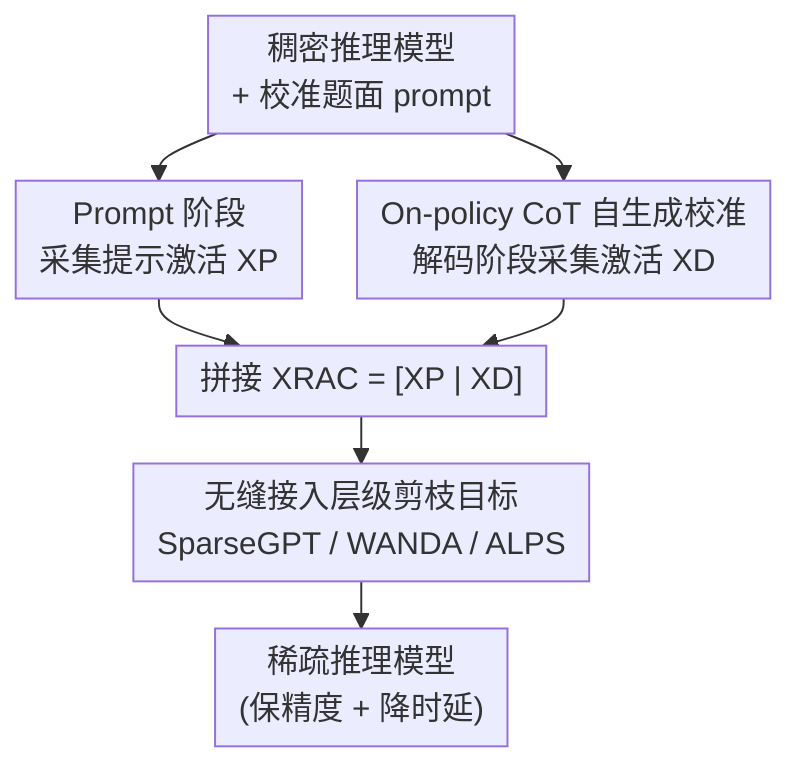

# Reasoning Models Can be Accurately Pruned Via Chain-of-Thought Reconstruction

**会议**: ICLR 2026  
**OpenReview**: [https://openreview.net/forum?id=tyGfwG6xTh](https://openreview.net/forum?id=tyGfwG6xTh)  
**代码**: https://github.com/RyanLucas3/Reasoning-Aware-Compression  
**领域**: 模型压缩  
**关键词**: 模型剪枝, 推理模型, 思维链, 校准数据, one-shot 剪枝

## 一句话总结
作者发现把标准 LLM 剪枝方法（如 SparseGPT）直接套到 DeepSeek-R1 这类长思维链推理模型上会严重掉点、甚至更慢，根因是这些方法只用「输入提示」做校准、而推理是「解码主导」任务；他们提出 RAC（Reasoning-Aware Compression），在剪枝校准时让模型自己生成思维链、把这些 on-policy 激活一并塞进重建目标，作为一个即插即用的补丁让 SparseGPT 在 50% 稀疏度下仍保住稠密模型约 95% 的精度。

## 研究背景与动机
**领域现状**：DeepSeek-R1、Qwen3 这类推理模型靠生成很长的思维链（CoT）来提升数学、代码、逻辑任务的准确率，但代价是单次查询要吐出海量 token，部署成本极高。为了省钱，一个自然的思路是用 one-shot 剪枝（剪完不再重训）压缩它们——尤其因为这些开源模型的完整训练/蒸馏 pipeline 并不公开，重训既不可行也昂贵，而 one-shot 剪枝在单张 H100 上就能跑完。

**现有痛点**：作者实测发现，把 SparseGPT 用标准 C4 校准集套到 DeepSeek-R1-Distill-Qwen-7B 上，随着稀疏度从 30% 升到 70%，MATH-500 精度持续下滑，而总评测时间反而急剧上升。原因很反直觉：剪重了的模型不是答得快，而是「越剪越啰嗦」——它生成更长、更发散的思维链，token 越吐越多却答得越错。压缩本应「保精度、降时延」，结果两头都赔。

**核心矛盾**：标准的层级剪枝目标是最小化每层权重对**校准激活**的重建误差 $\min_{\widehat{W}_\ell}\lVert W_\ell X_\ell - \widehat{W}_\ell X_\ell\rVert_2^2$，而校准矩阵 $X_\ell$ 通常只由输入提示 token 产生。这套设定默认了普通 LLM 工作负载「长上下文、短回复」（$|x|\gg|y|$），所以激活几乎都来自提示。但推理模型恰好相反：思维链加答案远长于提示（$|c|+|y|\gg|x|$），解码阶段才是 token 预算的主战场。只在提示上校准，等于让剪枝去优化一个和推理时实际遇到的激活分布**错位**的目标。

**本文目标**：在不重训的前提下，让剪枝目标对齐推理模型在解码时真正会遇到的激活分布，从而把高稀疏度下的精度和运行时损失同时压下来。

**切入角度**：既然问题出在「校准分布 ≠ 解码分布」，那就不去改剪枝算法本身，而是改喂给它的校准数据——把模型自己在思维链里产生的激活加进去。

**核心 idea**：剪枝校准时让模型 on-policy 地自生成思维链，把这些解码激活与提示激活拼在一起当校准数据，剪枝算法（SparseGPT/WANDA/ALPS）原封不动复用。

## 方法详解

### 整体框架
RAC 的核心洞察是：剪枝时用来衡量重建误差的激活，应该和模型推理时实际算出来的激活一致。普通 LLM 因为「长输入短输出」，提示激活就足以代表推理分布；但推理模型在解码阶段会自生成成千上万个思维链 token，这些激活才是主体。于是 RAC 把整个剪枝流程拆成两阶段：先收集一份「提示 + 自生成思维链」的混合激活，再把它当校准矩阵交给现成的层级剪枝算法。

具体地，给定一批校准题目（数学/代码题面），对每个题目先做 **Prompt 阶段**：把题面正常前向，按层收集提示 token 的激活 $X^P_\ell$。再做 **Decode 阶段**：让稠密模型从题面开始自回归地一路生成（最多 $T_{\max}=8192$ 个 token 的 on-policy 思维链），每生成一个 token 就把它的激活按层追加到解码激活矩阵 $X^D_\ell$。两份拼起来得到 $X^{\mathrm{RAC}}_\ell=[\,X^P_\ell \;\; X^D_\ell\,]$，最后逐层调用 SparseGPT 之类的剪枝算法、用这份激活做重建即可。整条流程只前向、不反传，单卡可跑。

### 关键设计

**1. 把「掉点」诊断为校准/解码分布错位：推理是 decode-dominated 任务**

这是全文的立论根基。标准层级剪枝把每层校准激活堆成矩阵 $X_\ell=[x^{(\ell-1)}_0,\dots,x^{(\ell-1)}_{N-1}]$，其中每一列对应一个**提示 token** 经过前 $\ell-1$ 层后的隐状态。这套设定隐含假设 $|x|\gg|y|$，所以剪枝优化的是「提示分布」上的重建误差。但推理模型在推理时生成的完整序列是 $z=(x_{0:T_{in}-1},\,c_{T_{in}:T},\,y_{T+1:T+L})$，把索引分成提示集 $P$ 和解码集 $D$，而推理任务里恰恰 $|D|\gg|P|$——解码出的思维链 token 远多于提示。每个解码 token 的激活既依赖输入、也依赖模型**自己先前生成的 token**，这些激活在「只用提示」的校准里根本没出现过。因此剪枝去拟合的目标分布，和模型推理时真正流经各层的激活分布是错位的，高稀疏度下这个错位被放大，表现为思维链退化、重复发散。把病因定位到「校准数据覆盖错了分布」，而不是「剪枝算法不够强」，是后续所有设计的前提。

**2. On-policy CoT 自生成校准：用模型自己的思维链补齐解码激活**

既然缺的是解码激活，RAC 就在校准阶段让稠密模型 on-policy 地把思维链生成出来。对每个校准题目，在解码集 $D_m$ 的每一步 $t$，用模型当前隐状态算出下一 token 分布 $\pi_\theta(\cdot\mid z^{(m)}_{0:t})=\mathrm{softmax}(W_{out}x^{(L,m)}_t)$ 并采样 $z^{(m)}_{t+1}$，立刻把它作为下一步输入喂回去，得到新的隐状态 $x^{(\ell,m)}_{t+1}=f_\ell(\{x^{(\ell-1,m)}_\tau\}_{\tau\le t+1})$，并把 $x^{(\ell-1,m)}_{t+1}$ 作为新列追加进 $X^D_\ell$。跑完所有解码步后，$X^D_\ell$ 里装的就是模型生成思维链时真正会遇到的那串激活。「on-policy」是关键——它用的是被剪模型自己的生成轨迹，而不是外部数据集里别人的文本，因此能精确模拟该模型在推理时的分布偏移。这也是它和 self-calibration（只喂一个 BOS token 让模型自由生成、模拟预训练文本分布、不条件于任务提示）以及 PPC-GPT（用合成 CoT 蒸馏、但剪枝分数仍在标准 C4 激活上算）的本质区别。

**3. 无缝接入层级剪枝目标：只换校准数据、不改算法**

RAC 不发明新的剪枝算法，而是把混合激活直接喂进现有的逐层重建目标。把提示与解码激活拼成 $X^{\mathrm{RAC}}_\ell=[X^P_\ell \;\; X^D_\ell]\in\mathbb{R}^{d_\ell\times(N_P+N_D)}$，对应的层级校准损失变为

$$\lVert(W_\ell-\widehat{W}_\ell)X^{\mathrm{RAC}}_\ell\rVert_F^2=\sum_{m=1}^{M}\sum_{t\in P_m\cup D_m}\lVert(W_\ell-\widehat{W}_\ell)x^{(\ell-1,m)}_t\rVert_2^2.$$

与标准「仅提示」校准的唯一差别，就是求和里多覆盖了 $t\in D_m$ 这部分解码激活。因为目标形式没变，PRUNE 这一步可以原封不动地换成 SparseGPT、WANDA、ALPS 等任意层级剪枝器（算法里 `PRUNE(W_ℓ, X^RAC_ℓ, S)` 是即插即用的黑盒），也兼容非结构化、结构化、N:M 半结构化等各种稀疏约束。这种「只动校准分布、不动算法」的设计让 RAC 能零成本嵌进现有压缩 pipeline，是它作为「drop-in fix」的实用价值所在。

### 损失函数 / 训练策略
RAC 不引入任何额外训练或反向传播，全程只前向。算法分两阶段：Phase I 对每个校准题目跑 prompt 阶段（收集 $X^P_\ell$）与 decode 阶段（自生成 token、收集 $X^D_\ell$）；Phase II 逐层用 $X^{\mathrm{RAC}}_\ell=[X^P_\ell,X^D_\ell]$ 调 SparseGPT 等剪枝器得到稀疏权重 $\widehat{W}_\ell$。实验设置：两族开源推理模型（DeepSeek-R1 蒸馏的 Qwen 1.5B/7B/14B/32B 与 Llama 8B/70B，以及 Qwen3 1.7B/8B/14B），SparseGPT 在 20%/30%/40%/50% 非结构化稀疏度下 one-shot 剪枝，统一用 1M 校准 token，思维链上限 $T_{\max}=8192$，评测用 32k 输出预算、zero-shot。

## 实验关键数据

### 主实验
三种校准做对比：C4（通用网页文本）、Prompt-Only（题面但不含答案/思维链）、RAC（题面 + on-policy 思维链）。MATH-500 上 acc@1:1（Top-1 精确匹配），代码用 LiveCodeBench pass@1:16。

| 模型 / 稀疏度 | 指标 | C4 | Prompt-Only | RAC | 稠密 |
|--------------|------|-----|------------|-----|------|
| DeepSeek-R1-1.5B @50% | MATH-500 acc | 0.356 | 0.496 | **0.664** | 0.832 |
| DeepSeek-R1-7B @50% | MATH-500 acc | 0.744 | 0.812 | **0.900** | 0.936 |
| DeepSeek-R1-7B @50% | 评测耗时(min) | 135.0 | 115.6 | **35.3** | 23.3 |
| Qwen3-8B @50% | MATH-500 acc | 0.564 | 0.470 | **0.862** | 0.962 |
| Qwen3-8B @50% | 评测耗时(min) | 258.8 | 274.5 | **17.1** | 41.3 |
| Qwen3-1.7B @40% | AIME-25 acc | 0.000 | 0.133 | **0.267** | 0.333 |
| DeepSeek-R1-7B @50% | LiveCodeBench pass@1:16 | 0.099 | 0.228 | **0.283** | — |

RAC 在所有架构上都稳定超过 C4、且在高稀疏度下普遍超过 Prompt-Only，并且把 C4 校准触发的「运行时爆炸」（精度崩、思维链发散导致评测时间翻几倍）大幅压回。7B 在 50% 稀疏度下 RAC 既保住 0.900 精度、又把评测耗时从 135 min 砍到 35.3 min；Qwen3-8B 更夸张，从 250+ min 降到 17.1 min。

### 消融 / 分析实验

| 配置 | 关键发现 |
|------|---------|
| 难题 AIME-25 @40-50% | C4 常直接崩到 0.000（如 Qwen3-1.7B @40%），Prompt-Only 部分缓解但仍不够，RAC 保住大部分稠密精度 |
| 逐 token 重建误差热图（MATH-500 留出题） | 提示段（黑线左侧）Prompt-Only 略优（偏红），解码段（右侧）RAC 误差显著更小（偏蓝），证明 RAC 正是在「长思维链解码」这段把误差压下去 |
| 稀疏度梯度（20%→50%） | 20-30% 低稀疏时三法都接近稠密；稀疏越激进，RAC 优势越大——说明 reasoning-aware 校准的收益主要在高压缩区 |
| 模型规模 | 14B/70B 等大模型本就更抗剪，但 RAC 在精度与运行时上仍有可观增益 |

### 关键发现
- 解码段重建误差热图是最有说服力的机理证据：RAC 的增益**精确落在**长思维链解码区，直接对应它的设计动机（补齐解码激活），而不是泛泛的「换了更好的数据」。
- 「剪枝反而变慢」这个反直觉现象被 RAC 逆转——本质是它修好了思维链发散，模型不再越剪越啰嗦。
- 收益随稀疏度单调放大、随模型规模递减，说明 RAC 解决的是「高压缩下的分布错位」这一特定痛点。

## 亮点与洞察
- **把诊断和解法绑得很紧**：先用「剪枝越重越慢」的反常实验暴露病灶，再用逐 token 误差热图证明解法正好作用在病灶上，是教科书式的「现象→机理→验证」闭环。
- **极简且即插即用**：不改剪枝算法、不加训练、不引入超参，只把校准数据从「提示」换成「提示 + on-policy 思维链」，就能套进 SparseGPT/WANDA/ALPS，工程落地几乎零成本。
- **on-policy 是点睛之笔**：用被剪模型自己的生成轨迹做校准，而非外部 CoT 文本或自由生成文本，精确对齐了「这个模型推理时的分布」，这正是它甩开 self-calibration / PPC-GPT 的地方——同样「用模型生成的文本」，条件不同结果天差地别。
- **思路可迁移**：「校准数据要匹配推理时实际激活分布」这一原则可推广到量化、其他 post-training 压缩，乃至任何「目标负载与默认校准分布错位」的场景（如长上下文、agent 多轮等）。

## 局限与展望
- 需要在校准阶段额外跑一遍稠密模型的 on-policy 生成（最多 8192 token/题），相比纯提示校准多了一笔生成开销；不过仍是 one-shot、单卡可承受。
- 收益集中在高稀疏度（40-50%），低稀疏度下与 Prompt-Only 差距不大，对只想轻剪的场景增益有限。
- 论文聚焦非结构化稀疏 + SparseGPT 主线，结构化/2:4 半结构化、量化叠加（FP8）等只在附录给吞吐分析，真实端到端加速的全面验证还较薄。
- on-policy 生成质量受稠密模型本身约束：若稠密模型在某领域思维链就不稳，自生成校准可能继承其偏差；附录中 on-policy vs off-policy（用更大的 14B 轨迹剪 7B）的对比值得进一步挖。

## 相关工作与启发
- **vs Zhang et al. 2025b（压缩推理模型基准）**：他们做的是「评测」——同样观察到 C4 校准下推理任务精度随稀疏度暴跌、思维链退化，但只停在现象。RAC 进一步动手改校准分布（注入 on-policy 思维链激活）去**消除**这个损失。
- **vs PPC-GPT**：PPC-GPT 用合成 CoT 蒸馏剪枝后的学生模型，但剪枝分数仍算在标准 C4 激活上；RAC 直接把思维链激活注入剪枝目标，省掉单独的蒸馏阶段。
- **vs self-calibration（Williams et al. 2025）**：机制表面相似（都用模型生成的文本当校准），但 self-calibration 只给一个 BOS token 让模型自由生成、模拟预训练文本分布、不条件于任务提示也不剪在推理轨迹上；RAC 条件于具体题面、采集的是任务相关的 on-policy 思维链激活。
- **vs SparseGPT / WANDA / ALPS**：这些是 RAC 复用的底层剪枝器；RAC 不与它们竞争，而是给它们换一份更对的校准数据，是正交的增强。

## 评分
- 新颖性: ⭐⭐⭐⭐ 解法本身极简（换校准数据），但「推理=decode-dominated 任务、校准要对齐解码激活」这一视角切得准、且首次系统验证
- 实验充分度: ⭐⭐⭐⭐ 覆盖两大模型族、多规模、数学/代码/竞赛多基准，并用逐 token 误差热图给出机理证据；结构化/量化端到端加速略薄
- 写作质量: ⭐⭐⭐⭐⭐ 现象-机理-验证闭环清晰，公式与算法表述干净
- 价值: ⭐⭐⭐⭐⭐ drop-in、单卡、零训练即可显著改善推理模型剪枝，落地价值高

<!-- RELATED:START -->

## 相关论文

- [\[ACL 2026\] LightReasoner: Can Small Language Models Teach Large Language Models Reasoning?](../../ACL2026/model_compression/lightreasoner_can_small_language_models_teach_large_language_models_reasoning.md)
- [\[ICLR 2026\] BeyondBench: Contamination-Resistant Evaluation of Reasoning in Language Models](beyondbench_contamination-resistant_evaluation_of_reasoning_in_language_models.md)
- [\[ICLR 2026\] TP-Spikformer: Token Pruned Spiking Transformer](tp-spikformer_token_pruned_spiking_transformer.md)
- [\[ICLR 2026\] Landscape of Thoughts: Visualizing the Reasoning Process of Large Language Models](landscape_of_thoughts_visualizing_the_reasoning_process_of_large_language_models.md)
- [\[NeurIPS 2025\] A*-Thought: Efficient Reasoning via Bidirectional Compression for Low-Resource Settings](../../NeurIPS2025/model_compression/a-thought_efficient_reasoning_via_bidirectional_compression_for_low-resource_set.md)

<!-- RELATED:END -->
