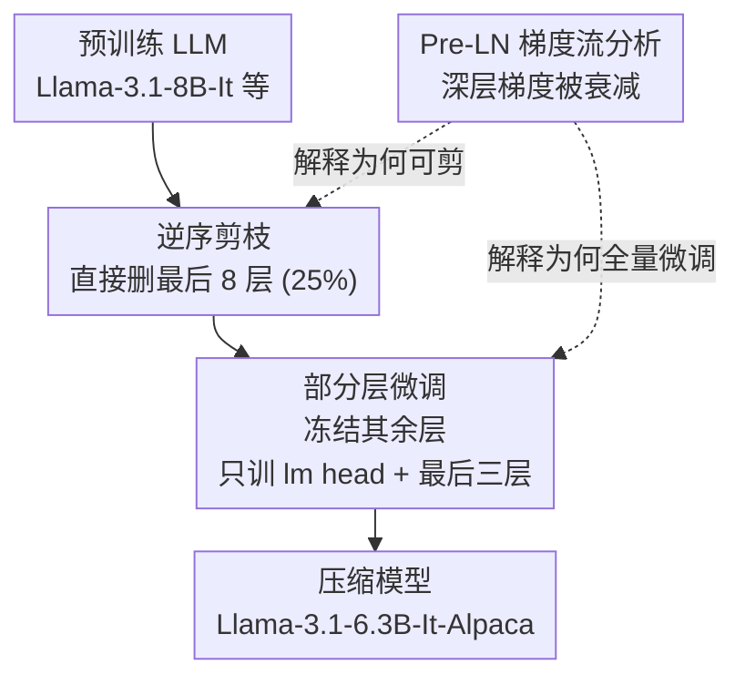

# Reassessing Layer Pruning in LLMs: New Insights and Methods

**会议**: ICLR 2026  
**OpenReview**: [https://openreview.net/forum?id=04Tfwy3LLC](https://openreview.net/forum?id=04Tfwy3LLC)  
**代码**: https://github.com/yaolu-zjut/Navigation_LLM_layer_pruning  
**领域**: 模型压缩  
**关键词**: 层剪枝, LLM 压缩, 逆序剪枝, 部分层微调, Pre-LN 梯度流

## 一句话总结
这篇论文花了数千 GPU 小时把 LLM 层剪枝的"层选择指标"和"剪枝后微调方法"系统地重新测了一遍，得出两个反直觉结论——最朴素的"逆序剪掉最后几层"胜过一众复杂指标、用"只微调 lm head + 最后三层"的部分层微调胜过被奉为标配的 LoRA，并用 Pre-LN 梯度流理论解释了为什么，最终在 Llama-3.1-8B/Llama-3-8B/Llama-3-70B 上超过现有 SOTA 剪枝方法 2.36%–19.45%。

## 研究背景与动机

**领域现状**：LLM 推理成本高、难以部署到资源受限场景，于是有了一大堆压缩手段：参数剪枝、量化、知识蒸馏、低秩分解。其中**层剪枝**（layer pruning）因为直接砍模型深度、同时降算力和显存而格外受关注——而且像 Llama 这类模型每个 transformer block 的输入输出维度完全一致，整层删掉后结构天然衔接，做起来特别简单。

**现有痛点**：尽管层剪枝本身很朴素，社区的研究却越走越"复杂"。一派人卷**层选择指标**——从 Magnitude、Taylor、PPL 到 ShortGPT 的 Block Influence (BI)、MKA 的流形信息瓶颈，指标一个比一个精致；另一派人默认**剪枝后必须用 LoRA 家族微调**来恢复性能。但没人回头问一句：这些精致指标真的比"随便砍最后几层"强吗？LoRA 真的是剪枝后微调的最优解吗？

**核心矛盾**：层剪枝有两个正交的设计自由度——**剪哪些层**（layer selection）和**怎么把性能补回来**（fine-tuning）。社区在这两个维度上都在加复杂度，却缺乏一次公平、大规模、控制变量的横向评测来验证这些复杂度是否真的换来收益。

**本文目标**：作者退一步，不提新方法，只回答两个问题——
- Q1（层选择）：识别冗余层真的需要复杂指标吗？
- Q2（微调）：LoRA 家族真是剪枝后微调的最佳选择吗？

**切入角度**：用 benchmark 说话。横跨 7 种层选择指标、3 个开源 LLM、6 种微调方法、8 个常识推理数据集，砸数千 GPU 小时做控制变量实验，再用梯度流理论给经验结论找一个原理性解释。

**核心 idea**：层剪枝的最佳实践其实极其朴素——**逆序剪掉最后几层 + 只微调 lm head 和剩余的最后三层**，简单、快、且强于所有现有 SOTA；背后的原因是 Pre-LN Transformer 的梯度在深层被持续衰减，使深层既"不重要"（可剪）又"在 LoRA 下补不动"（该全量微调）。

## 方法详解

### 整体框架

这篇论文的"方法"不是某个新模块，而是一套被实验和理论双重支撑的**最佳实践流水线**：拿一个预训练好的 LLM，先用**逆序指标**直接砍掉最后 8 层（25% 剪枝率），再用**部分层微调**（冻结其余所有层，只训练 lm head + 最后三层）在 Alpaca-cleaned 上恢复性能，最终得到 Llama-3.1-6.3B-It-Alpaca、Llama-3-6.3B-Alpaca 这样的压缩模型。两个选择都不靠拍脑袋——它们由一个基于**梯度流的分析框架**解释：Pre-LN 架构让深层梯度被反复缩小，所以深层贡献小（可剪），而剪枝后剩余的最后一层承受了最严重的分布偏移、必须被充分调整（适合全量微调而非分散式的 LoRA）。

### 关键设计

**1. 逆序剪枝：复杂指标其实不如直接砍最后几层**

针对的痛点是 Q1——社区默认精致的层选择指标更好。作者一口气评测了 7 种指标：Random、Reverse-order（逆序）、Magnitude-$l_1$、Magnitude-$l_2$、Taylor、PPL、BI。其中 BI（ShortGPT 提出）用相邻层输入的余弦相似度衡量层的"影响力"：$\mathrm{BI}_i = 1 - \mathbb{E}_{x,t}\frac{x_{i,t}^\top x_{i+1,t}}{\lVert x_{i,t}\rVert\, \lVert x_{i+1,t}\rVert}$，BI 低的层被认为冗余可删；Taylor 用一阶近似 $I^n_{\text{Taylor}} = \sum_k \lvert \frac{\partial L(D)}{\partial W^n_k} W^n_k\rvert$ 估计删除某层对训练损失的影响。而逆序（Reverse-order）则朴素到极点：认为层的重要性与深度成反比，直接给越深的层打越低的分、优先删除，连一次前向/反向都不用算。

结果出人意料：在 25% 剪枝率下，逆序在 Vicuna-7B、Qwen1.5-7B、Llama-3.1-8B-It 三个模型上都给出稳定且领先的结果，平均比第二名 PPL 高 6.04%，在 50% 剪枝率下结论依旧成立。BI、Magnitude 这些复杂指标反而经常垮掉（如 Magnitude 在多个模型上平均准确率掉到 0.30 上下，几乎等于随机）。结论（Insight #1）：逆序是简单又"防呆"的指标，跨模型跨剪枝率都稳。

**2. 部分层微调：剪枝后恢复性能，全量微调最后几层胜过 LoRA**

针对的痛点是 Q2——剪枝后大家无脑上 LoRA。作者把恢复手段拆成三类对比：LoRA（给每层注入低秩矩阵 $W_0 x + BAx$，只训低秩因子）、QLoRA（LoRA + 量化省显存）、以及**部分层微调**（冻结大部分层，只全量训练靠近输出的少数层）。部分层微调又细分为：只训 lm head、lm head + 最后 1/2/3 层。所有方法都在逆序剪掉 8 层后的模型上跑。

结论很反直觉（Insight #2）：QLoRA 比 LoRA 略差；而部分层微调显著强于 LoRA，且"lm head + 最后三层"最好。以 Llama-3.1-8B-It 为例，LoRA 平均准确率 0.5268，而 lm head + 最后三层达到 0.5807，整整高出 5 个多百分点。代价上看也划算：部分层微调虽然可训练参数更多（1.18B vs LoRA 的 15.73M），但显存相当、训练时间反而更短（7931s vs LoRA 的 10440s）；QLoRA 虽省显存却训得最慢、效果最差。所以"剪枝后该全量微调最后几层、而非分散式 LoRA"是个值得推广的新方向。

**3. Pre-LN 梯度流分析：为什么这两条实践都成立**

前两条是经验观察，作者进一步给出原理性解释，核心在 Pre-LN（Pre-Layer Normalization）架构的梯度传播。Pre-LN 的更新是 $x_{l+1} = x_l + F(\mathrm{LN}(x_l); \theta_l)$，对其求导得 $\frac{\partial x_{l+1}}{\partial x_l} = I + A^{\text{Pre-LN}}_l \cdot B^{\text{Pre-LN}}_l$，其中 $B$ 是归一化层的 Jacobian。作者证明了 LayerNorm 与 RMSNorm 的 Jacobian 谱范数分别为 $\lVert B_{\text{RMS}}(x)\rVert_2 = \frac{1}{\lVert x\rVert_{\text{RMS}} + \epsilon}$、$\lVert B_{\text{LN}}(x)\rVert_2 = \frac{1}{\sqrt{\sigma^2 + \epsilon}}$，并在 $x$ 近似正态、训练后期 $\sigma^2 > 1$ 的条件下推出 $\lVert B_{\text{RMS}}(x)\rVert_2 \le \lVert B_{\text{LN}}(x)\rVert_2 < 1$。

把它代回逐层梯度连乘 $\frac{\partial L}{\partial \theta_l} = \frac{\partial L}{\partial x_L}\left(\prod_{k=l+1}^{L-1}(I + A^{\text{Pre-LN}}_k B^{\text{Pre-LN}}_k)\right)\frac{\partial x_{l+1}}{\partial \theta_l}$：由于残差项把 $I$ 解耦出来防止了浅层梯度消失，而 $\lVert B^{\text{Pre-LN}}_k\rVert < 1$，当 $l$ 越接近输出层 $L$ 时连乘项越接近单位阵、深层梯度贡献越小——这从原理上解释了**为什么深层不重要、可以从尾部剪**。同理，剪掉尾部、冻结其余层后，剩余的最后一层承受最严重的分布偏移、必须把改变后的特征空间重新对齐到输出分布；LoRA 对深层影响本就偏弱、对齐不充分，而**直接全量微调这最后一层**能精准调整最影响输出分布的部分，因此优于把适配分散到所有剩余层的 LoRA——这解释了实践 2。

### 损失函数 / 训练策略
微调用 Alpaca-cleaned 数据集。LoRA 与部分层微调用 AdamW，QLoRA 用 paged adamw 8bit；LoRA rank $d=8$，batch size 64，学习率 $1\times10^{-5}$，100 步 warmup。最终发布模型 Llama-3.1-6.3B-It-Alpaca / Llama-3-6.3B-Alpaca 均为逆序剪 8 层 + lm head + 最后三层微调。

## 实验关键数据

实验覆盖 7 种层选择指标 × 3 个 LLM × 6 种微调方法 × 8 个常识推理数据集（PIQA、HellaSwag、OpenbookQA、ARC-e、ARC-c、MMLU、CMMLU、WinoGrande），用 lm-evaluation-harness 做零样本评测。

### 主实验：与 SOTA 剪枝方法对比（25% 剪枝率）

| 模型 | 方法 | Avg Acc↑ | 相对本文 |
|------|------|----------|----------|
| Llama-3.1-8B-It | Original（未剪枝） | 0.6295 | 上界 |
| Llama-3.1-8B-It | ShortGPT (BI) | 0.4080 | -17.27% |
| Llama-3.1-8B-It | GRASP（之前最好） | 0.5245 | -5.62% |
| Llama-3.1-8B-It | **本文 6.3B-It-Alpaca** | **0.5807** | — |
| Llama-3-8B | ShortGPT (BI) | 0.3688 | -19.45% |
| Llama-3-8B | FINERCUT（之前最好） | 0.5397 | -2.36% |
| Llama-3-8B | **本文 6.3B-Alpaca** | **0.5633** | — |

本文方法在两个模型上都超过所有 baseline：Llama-3.1-8B-It 上比最好的 GRASP 高 5.62%、比最差的 ShortGPT 高 17.27%；Llama-3-8B 上比最好的 FINERCUT 高 2.36%、比最差的 ShortGPT 高 19.45%。70B 规模上结论同样成立，验证了可扩展性。

### 消融：微调方法对比（Llama-3.1-8B-It，逆序剪 8 层）

| 微调方法 | Avg Acc↑ | 可训练参数 | 训练时间(2 epoch) | 说明 |
|----------|----------|-----------|-------------------|------|
| LoRA | 0.5268 | 15.73M | 10440s | 社区标配 |
| QLoRA | 0.5171 | 15.73M | 17249s | 省显存但最慢最差 |
| 部分层：仅 lm head | 0.5599 | 525M | 6953s | 已超 LoRA |
| 部分层：+ 最后 1 层 | 0.5732 | 743M | 7297s | — |
| 部分层：+ 最后 2 层 | 0.5766 | 962M | 7617s | — |
| **部分层：+ 最后 3 层** | **0.5807** | 1180M | 7931s | 最优 |

### 关键发现
- **复杂层选择指标常常不如逆序**：BI、Magnitude、Taylor 在不少模型上掉到接近随机水平（0.30 左右），逆序则跨模型稳定领先，平均比 PPL 高 6.04%。说明"砍最后几层"这一最朴素先验在 Pre-LN LLM 上恰好与梯度贡献分布吻合。
- **部分层微调全面优于 LoRA**：哪怕只微调 lm head 也已经超过 LoRA，且训练更快；微调层数从 0→3 单调涨点，3 层最优。可训练参数虽多近百倍，但因为不需要在每层注入额外低秩前向、显存相当且时间更短。
- **QLoRA 性价比最低**：省了显存却换来最长训练时间和最差精度，剪枝后微调场景不推荐。
- **无微调也成立**：即便完全不微调，逆序剪枝仍优于 SLEB 等推理-only 方法，说明逆序本身就选对了冗余层。

## 亮点与洞察
- **"退一步做评测"比"再发一个指标"更有价值**：这篇论文最大的贡献不是新算法，而是用数千 GPU 小时把"复杂度是否换来收益"这件事钉死，结论是层剪枝最该卷的两个维度（选层 + 微调）上，最朴素的做法反而最好。
- **经验 + 理论闭环**：先用大规模实验观察到两个反直觉现象，再用 Pre-LN 梯度流的谱范数分析给出原理解释，避免了"调参调出来的偶然结论"。$\lVert B^{\text{Pre-LN}}\rVert<1$ 导致深层梯度连乘趋于单位阵，是把"深层可剪"与"剩余末层需全量微调"统一起来的关键。
- **可直接迁移的工程默认值**：对任何 Pre-LN 的 LLM，剪枝时直接逆序砍尾部、微调时冻结主体只训 lm head + 最后三层，是一个开箱即用、又快又强的默认配置，省去大量指标搜索成本。

## 局限与展望
- **结论绑定 Pre-LN 架构**：理论分析建立在 Pre-LN + LayerNorm/RMSNorm 上，对 Post-LN 或其他归一化结构是否成立未验证；逆序的有效性本质上是 Pre-LN 梯度衰减的副产品。
- **理论中的近似假设**：梯度范数分析依赖 $x$ 近似正态、训练后期 $\sigma^2>1$ 等假设（沿用 Xiong et al. 2020），实际网络中这些条件的满足程度有待更细致的实证（⚠️ 部分推导以原文为准）。
- **任务范围**：评测集中在 8 个常识推理零样本任务，对生成质量、长文本、推理链等更复杂能力的影响讨论有限；近期也有工作指出深层对推理任务关键，逆序剪尾部在推理重场景下是否仍最优值得追问。
- **部分层微调参数量大**：虽然时间和显存可接受，但 1.18B 可训练参数远多于 LoRA，在极端显存受限场景下灵活性不如低秩方法。

## 相关工作与启发
- **vs ShortGPT (BI)**：ShortGPT 用 Block Influence 这一相邻层相似度指标挑冗余层，是"复杂指标派"代表；本文实验显示 BI 在多个模型上反而垮掉（Llama-3.1-8B-It 上仅 0.4080），逆序高出 17.27%。
- **vs Shortened LLaMA (PPL/Taylor)**：Kim et al. 用 Magnitude/Taylor/PPL 评层重要性 + LoRA 微调；本文证明 PPL 虽是次优指标但仍不及逆序，且 LoRA 不是最佳微调。
- **vs LoRA 微调范式**：未剪枝场景下 LoRA 因参数高效、能把适配分散到全网络而占优；本文指出剪枝后情形相反——末层分布偏移剧烈，集中全量微调末几层比分散 LoRA 更能对齐输出分布。
- **vs FINERCUT / GRASP（之前 SOTA）**：这些方法在选层或合并上做精细设计，本文用"逆序 + 部分层微调"这一更简单组合分别在 Llama-3-8B/Llama-3.1-8B-It 上反超 2.36%/5.62%。

## 评分
- 新颖性: ⭐⭐⭐⭐ 不是新算法但提供了反直觉且经过严格验证的新认知，并配套梯度流理论解释
- 实验充分度: ⭐⭐⭐⭐⭐ 7 指标 × 3 模型 × 6 微调 × 8 数据集，含 70B 规模和训练成本对比，数千 GPU 小时
- 写作质量: ⭐⭐⭐⭐ 问题驱动、经验与理论闭环，结构清晰
- 价值: ⭐⭐⭐⭐⭐ 给出可直接落地的层剪枝最佳实践默认值，对部署侧实用价值高

<!-- RELATED:START -->

## 相关论文

- [\[ICLR 2026\] GradPruner: Gradient-guided Layer Pruning Enabling Efficient Fine-Tuning and Inference for LLMs](gradpruner_gradient-guided_layer_pruning_enabling_efficient_fine-tuning_and_infe.md)
- [\[ICLR 2026\] Dr.LLM: Dynamic Layer Routing in LLMs](drllm_dynamic_layer_routing_in_llms.md)
- [\[ICLR 2026\] Token Distillation: Attention-Aware Input Embeddings for New Tokens](token_distillation_attention-aware_input_embeddings_for_new_tokens.md)
- [\[ACL 2026\] Adaptive Layer Selection for Layer-Wise Token Pruning in LLM Inference](../../ACL2026/model_compression/adaptive_layer_selection_for_layer-wise_token_pruning_in_llm_inference.md)
- [\[ICLR 2026\] LSA: Layer-wise Sparsity Allocation for Large Language Model Pruning Based on Minimal Linear Reconstruction Error](lsa_layer-wise_sparsity_allocation_for_large_language_model_pruning_based_on_min.md)

<!-- RELATED:END -->
