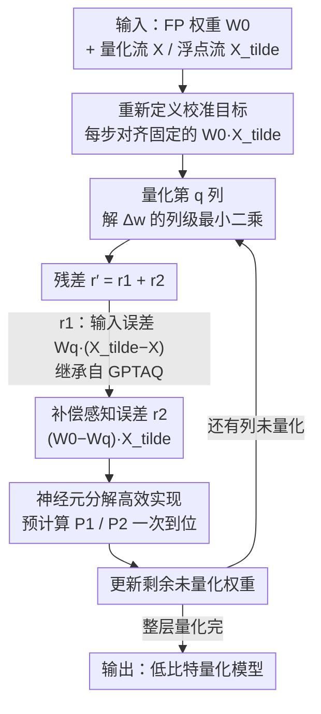

# Rethinking Residual Errors in Compensation-based LLM Quantization

**会议**: ICLR 2026  
**OpenReview**: [https://openreview.net/forum?id=LWYZ1nNkJl](https://openreview.net/forum?id=LWYZ1nNkJl)  
**代码**: https://github.com/list0830/ResComp  
**领域**: 模型压缩  
**关键词**: 后训练量化, 权重补偿, GPTQ, 残差误差, 补偿感知误差

## 一句话总结
这篇论文重新审视了 GPTQ / GPTAQ 这类「逐列量化 + 补偿剩余权重」方法的列级校准目标，指出它们错误地把「已补偿权重的输出」当成对齐基准，并由此推导出一个被遗漏的残差项——补偿感知误差（Compensation-aware Error），用 GPTAQ 的神经元分解把它高效地塞进权重更新公式，几乎零改动地嵌入 GPTQ / GPTAQ 后在 2~3 bit 量化上一致提升困惑度与下游精度。

## 研究背景与动机
**领域现状**：把百亿级 LLM 压到低比特，主流走的是后训练量化（PTQ），因为它不需要微调、成本极低。其中「基于补偿」的一支最有代表性：OBQ → GPTQ → GPTAQ。它们的共同范式是逐列把权重量化成低比特，每量化掉一列就用二阶 Hessian 信息去调整剩下还没量化的浮点权重，让该层输出尽量逼近原始输出。GPTQ 用 lazy batch-update + Cholesky 重构把这套搬到了大模型上；GPTAQ 进一步发现「逐层误差累积」会让校准基准本身漂移，于是引入非对称校准，把前面层传下来的输出误差作为「残差」补进当前层。

**现有痛点**：GPTAQ 的**层级（layer-level）目标**是对的——它始终用浮点流的输出 $w\tilde{X}$ 作对齐参考。但作者发现它的**列级（column-level）目标**在迭代中悄悄走偏了：量化第 $q$ 列时，GPTAQ 把对齐目标写成 $w^{(q)}\tilde{X}$，即用**当前已经补偿过 $q$ 步的权重** $w^{(q)}$ 去乘浮点输入。这在第 0 步成立（$w^{(0)}\tilde{X}$ 就是真正的浮点层输出），但 $q\geq1$ 后 $w^{(q)}\tilde{X}$ 已经不是浮点层的真实输出了——它是「被改过的权重」的输出。

**核心矛盾**：真正想对齐的应该是原始浮点模型的输出 $w^{(0)}\tilde{X}$，它在整个逐列过程里是个**固定不动的金标准**；而 GPTAQ 把每一步的对齐目标偷偷换成了随补偿不断变化的 $w^{(q)}\tilde{X}$。两者的差距 $(w^{(0)}-w^{(q)})\tilde{X}$ 在迭代后期会越攒越大，却被现有公式整个忽略了。

**本文目标**：把列级目标重新钉死在 $w^{(0)}\tilde{X}$ 上，并把因此多出来的那一项误差显式地推进权重更新里。

**切入角度**：既然只是「目标函数选错了对齐基准」，那就重写目标、重新解拉格朗日，看看正确的残差到底比 GPTAQ 多出什么。

**核心 idea**：把残差从「只含输入误差 $r_1$」修正为「输入误差 $r_1$ + 补偿感知误差 $r_2$」，其中 $r_2=(w^{(0)}-w^{(q)})\tilde{X}$ 刻画了「层内补偿把权重改动后引入的内生误差」，再借 GPTAQ 已有的神经元分解把 $r_2$ 廉价算出来。

## 方法详解

### 整体框架
方法本质是一次「目标函数纠偏」：补偿式量化逐列把权重量化掉、每列都解一个最小二乘求剩余权重的更新量 $\Delta w$。GPTAQ 在标准更新之外加了一个误差修正项 $rX^\top H^{-1}_{-q}$，其中残差 $r$ 只装了「前层传来的输入误差」。本文重新把列级目标对齐到固定的浮点输出 $w^{(0)}\tilde{X}$，解出的新残差 $r'=r_1+r_2$ 多出一个补偿感知误差 $r_2$；再用神经元分解把 $r_2$ 写成可一次性预计算的矩阵 $P_2$，于是整套增强只是在 GPTQ / GPTAQ 的权重更新行里**多加一个加项**，算法骨架、Hessian、Cholesky 全不变。

整体可以看成一条「逐列循环」的流水线：每量化掉一列，就把两部分残差（继承自 GPTAQ 的输入误差 + 本文新增的补偿感知误差）一起算进对剩余权重的补偿，循环到整层量化完。

### 关键设计

**1. 重新定义列级校准目标：每一步都对齐固定的浮点输出**

痛点在前面已经点明：GPTAQ 量化第 $q$ 列时把目标写成 $\min_{\Delta w}\lVert(w^{(q)}+\Delta w)X-w^{(q)}\tilde{X}\rVert_F^2$，右侧的 $w^{(q)}\tilde{X}$ 用的是**已经补偿 $q$ 步的权重**，只有第 0 步才等于真实浮点输出。作者把目标改成始终对齐那个**从头到尾不变的金标准** $w^{(0)}\tilde{X}$：

$$\min_{\Delta w}\lVert(w^{(q)}+\Delta w)X-w^{(0)}\tilde{X}\rVert_F^2,\quad \text{s.t. } \Delta w_{:q}=0,\ \Delta w_q=\hat{w}^{(q)}_q-w^{(q)}_q$$

约束保证更新只作用在还没量化的列上。把它整理成 GPTAQ 那种「$\Delta w$ 乘输入 = 残差」的形式，残差就变成 $r'=w^{(0)}\tilde{X}-w^{(q)}X$。这一步看似只是把校准基准从「动的」换成「不动的」，却是整篇论文的支点——正是这个替换让被 GPTAQ 漏掉的那项误差浮出水面。

**2. 补偿感知误差：把层内补偿引入的内生误差补回来**

对新残差做一次拆分是全文最关键的一步：

$$r'=\underbrace{w^{(q)}(\tilde{X}-X)}_{r_1}+\underbrace{(w^{(0)}-w^{(q)})\tilde{X}}_{r_2}$$

第一项 $r_1=w^{(q)}(\tilde{X}-X)$ 是「量化流输入 $X$ 与浮点流输入 $\tilde{X}$ 之差」带来的误差，也就是 GPTAQ 已经在补的**层间输入误差**。第二项 $r_2=(w^{(0)}-w^{(q)})\tilde{X}$ 是本文命名的**补偿感知误差（Compensation-aware Error, CAE）**：它度量的是「原始权重 $w^{(0)}$ 与已被补偿 $q$ 步的权重 $w^{(q)}$ 之间的差」在浮点输入上的响应——换句话说，是层内补偿这一动作本身改动了权重、从而和真实浮点输出之间拉开的**内生偏差**。GPTAQ 因为把目标对齐到了 $w^{(q)}\tilde{X}$ 而非 $w^{(0)}\tilde{X}$，刚好把 $r_2$ 当成了零，本文则把它显式补进更新公式：

$$\Delta w=\frac{\hat{w}^{(q)}_q-w^{(q)}_q}{H^{-1}_{qq}}\cdot H^{-1}_{q,:}+(r_1+r_2)X^\top H^{-1}_{-q}$$

值得注意的是 $r_2$ 即便在没有跨层误差传播的纯 GPTQ 框架里也存在（消融表里 GPTQ+Ours 单独加 $r_2$ 就涨点），说明它和 GPTAQ 的 $r_1$ 是**互补**的两类误差，而非同一回事的不同写法。

**3. 神经元分解高效实现：让 $r_2$ 几乎不增计算、可预计算到一行**

直接每列重算 $R_1$、$R_2$ 对大模型太贵（GPTAQ 早已指出）。本文沿用 GPTAQ 的**神经元分解**，把 $R_2$ 也按列拆成累加形式 $R_2=\sum_q(W^{(0)}_{:,q}-W^{(q)}_{:,q})\tilde{X}_{q,:}$，从而和 $R_1$ 一样可以并行、可以惰性更新。关键是两个修正系数矩阵能**一次性预计算**：

$$P_1=\big[(\Delta XX^\top L)\odot M_U\big]L^\top,\qquad P_2=\big[(\tilde{X}X^\top L)\odot M_U\big]L^\top$$

其中 $L$ 是 $\tilde{H}^{-1}=LL^\top$ 的逆 Cholesky 因子，$M_U$ 是上三角掩码。更妙的是连 $\tilde{X}X^\top$ 都不用单独存——因为 $\tilde{X}X^\top=XX^\top+\Delta XX^\top$，可以直接由已有量复用。最终每列的更新只是在 GPTAQ 那行后面**多挂一个 $(W^{(0)}_{:,q}-W^{(q)}_{:,q})P2_{q,q:}$ 项**（算法 1 中以橙色标出的扩展），因此对 GPTQ / GPTAQ 都是「最小改动」即插即用。代价是离线校准要额外存 $W^{(0)}$ 和 $P_2$，峰值显存略升（7B 上 GPTAQ 19.8GB→20.6GB），但**量化后模型的推理显存完全不变**。

## 实验关键数据

### 主实验
模型覆盖 Llama2/Llama3 全家 1B~70B；指标为 WikiText-2 / C4 困惑度（越低越好）与 6 个零样本下游任务平均精度（越高越好）。下表节选 3-bit per-group 仅权重量化（Table 1）：

| 模型 | 方法 | Wiki2(↓) | C4(↓) | 下游均值(↑) |
|------|------|----------|-------|-------------|
| Llama2-7B | GPTQ | 6.73 | 13.60 | 64.9 |
| Llama2-7B | **GPTQ+Ours** | **6.40** | **8.34** | **66.5** |
| Llama2-7B | GPTAQ | 6.53 | 8.40 | 66.3 |
| Llama2-7B | **GPTAQ+Ours** | **6.25** | **8.19** | **66.6** |
| Llama3-8B | GPTAQ | 8.39 | 12.96 | 68.8 |
| Llama3-8B | **GPTAQ+Ours** | **7.77** | **12.25** | **70.5** |
| Llama3.1-8B-Inst | GPTQ | 9.06 | 14.15 | 70.3 |
| Llama3.1-8B-Inst | **GPTQ+Ours** | **8.96** | **13.97** | **72.7** |

最戏剧性的是 Llama2-7B 上 GPTQ 的 C4 困惑度从 **13.60 → 8.34**（加 CAE 后几乎补回了 GPTQ 在 C4 上的崩坏），下游均值 64.9%→66.5%。

更极端的 2-bit + 旋转设定（Table 2，W2A16 + QuaRot）下增益更明显：Llama2-13B 上 QuaRot+GPTAQ 的 Wiki2 7.50→7.32、均值 55.8%→58.2%（+2.4）；Llama2-7B 均值 51.5%→54.0%。权重+激活联合量化（Table 3，W2A4KV4）里，Llama2-13B 上 SpinQuant+GPTAQ 的 Wiki2 从 9.55 大幅降到 **8.60**、均值 50.2%→52.2%。

### 消融实验
Table 4 把新增项 $(W^{(0)}_{:,q}-W^{(q)}_{:,q})P2_{q,q:}$ 单独拆出来验证（W2A16 + QuaRot）：

| 配置 | $\Delta W$ 含项 | L2-7B Wiki2 | L2-7B 均值 | L2-13B 均值 |
|------|----------------|-------------|-----------|-------------|
| GPTQ | 仅标准更新 | 19.0 | 44.9 | 50.5 |
| GPTQ+Ours | + $r_2$ 项 | 17.9 | 47.5 | 54.3 |
| GPTAQ | 标准 + $r_1$ 项 | 9.5 | 51.5 | 55.8 |
| GPTAQ+Ours | 标准 + $r_1$ + $r_2$ 项 | **8.9** | **54.0** | **58.2** |

### 关键发现
- **$r_2$ 是独立且互补的误差源**：在没有跨层传播的纯 GPTQ 上单独加 $r_2$，Llama2-7B 均值就从 44.9%→47.5%、Llama2-13B 从 50.5%→54.3%，说明补偿感知误差不依赖 GPTAQ 的 $r_1$ 也成立；二者叠加（GPTAQ+Ours）才拿到最佳，证明它们补的是**不同**的两类误差。
- **越低比特、越难的设定收益越大**：3-bit 上提升温和（多在 0.2~1.7 个点），但 2-bit / W2A4KV4 这种误差被放大的场景里，提升常达 2 个点以上，符合「$r_2$ 在迭代后期累积更大」的直觉。
- **代价可控且只在离线侧**：量化时间约增 5~8%（7B 952s→1001s、70B 5883s→6344s），峰值显存略升，但**推理侧零开销**。
- **失败观察**：Llama3-70B 上 SpinQuant 系（W2A4KV4）整体崩坏（困惑度 >1e5），作者归因于预训练旋转矩阵是在 W16A4KV4 下优化的、扛不住 2-bit 权重带来的分布漂移；本文虽相对改善但仍无法救回——这是方法边界而非 CAE 本身的问题。

## 亮点与洞察
- **「对齐基准选错了」是个被全行业忽视的细节**：GPTAQ 的层级目标是对的、列级目标却偷换了基准，这种「高层对、低层在迭代中漂」的 bug 极难察觉，作者靠重写目标 + 拆残差把它揪了出来，是典型的「看对地方比堆算力更值钱」。
- **零新增超参、即插即用**：整套增强落到代码里只是更新公式多一个加项 + 多预计算一个 $P_2$，不引入任何新超参，能无缝套到 GPTQ / GPTAQ / QuaRot / SpinQuant 之上，迁移成本极低。
- **可迁移思路**：「逐步贪心补偿类算法里，要警惕对齐目标随迭代漂移」这一观察，可推广到剪枝（OBS/OBC 系）、低秩分解等同样「改一点、补一点」的二阶补偿框架——只要目标本该锚在原始模型上，就值得检查是否被中间状态偷换。

## 局限与展望
- **离线显存与时间有额外开销**：需多存 $W^{(0)}$ 与 $P_2$，70B 校准峰值从 63.7GB 升到 69.5GB、时间 +8%；虽只在离线侧，但对显存紧张的校准环境仍是负担。
- **救不回旋转矩阵失配的崩坏**：Llama3-70B + SpinQuant 在 2-bit 下整体失效，CAE 只能小幅缓解，说明它解决的是「补偿目标偏移」这一类误差，对「上游变换本身不适配」无能为力。
- **增益与比特数强相关**：3-bit 下提升较小，方法的价值主要体现在 2-bit 等极端压缩；在更温和的量化预算下性价比下降。
- **改进方向**：能否把 $P_2$ 的存储进一步用低秩/分块近似压下来，或把「锚定原始输出」的思想从逐列推广到逐块，可能在显存和精度间取得更好平衡。

## 相关工作与启发
- **vs GPTQ**：GPTQ 只用量化流 $X$ 做层级重构，忽略跨层误差累积；本文在其上加 $r_2$ 后，即便不引入 GPTAQ 的跨层项也能显著涨点（C4 困惑度大幅回落），相当于补上了 GPTQ「层内补偿引入的内生误差」这块短板。
- **vs GPTAQ**：GPTAQ 用非对称校准补了**层间输入误差** $r_1$，但列级目标错误地对齐到补偿后权重 $w^{(q)}\tilde{X}$，从而漏掉了 $r_2$；本文把目标重钉到固定的 $w^{(0)}\tilde{X}$，是对 GPTAQ 的「同框架内纠偏 + 补全」，二者互补叠加最优。
- **vs AWQ / QuaRot / SpinQuant**：AWQ 走激活感知缩放、QuaRot/SpinQuant 走旋转变换来压离群值，它们和本文是**正交**的两条路线——本文是补偿式方法内部的误差建模，可直接叠在这些预处理之上进一步提升（实验里 QuaRot/SpinQuant + Ours 普遍更好）。

## 评分
- 新颖性: ⭐⭐⭐⭐ 不是全新框架，但精准指出并修正了 GPTAQ 列级目标的隐藏偏差，拆出被忽略的补偿感知误差，洞察扎实。
- 实验充分度: ⭐⭐⭐⭐⭐ 覆盖 Llama2/3 1B~70B、3/2-bit、仅权重/权重+激活、多种旋转基线，含显存/时间/消融，相当完整。
- 写作质量: ⭐⭐⭐⭐ 推导清晰、$r_1/r_2$ 拆分讲得透，少量公式排版略密。
- 价值: ⭐⭐⭐⭐ 零新增超参、即插即用、低比特收益明显，对补偿式 PTQ 是直接可用的增量。

<!-- RELATED:START -->

## 相关论文

- [\[ICLR 2026\] ParoQuant: Pairwise Rotation Quantization for Efficient Reasoning LLM Inference](paroquant_pairwise_rotation_quantization_for_efficient_reasoning_llm_inference.md)
- [\[ICML 2026\] ReSpinQuant: Efficient Layer-Wise LLM Quantization via Subspace Residual Rotation Approximation](../../ICML2026/model_compression/respinquant_efficient_layer-wise_llm_quantization_via_subspace_residual_rotation.md)
- [\[ICLR 2026\] SERQ: Saliency-Aware Low-Rank Error Reconstruction for LLM Quantization](serq_saliency-aware_low-rank_error_reconstruction_for_llm_quantization.md)
- [\[ICLR 2026\] The Geometry of LLM Quantization: GPTQ as Babai's Nearest Plane Algorithm](the_geometry_of_llm_quantization_gptq_as_babais_nearest_plane_algorithm.md)
- [\[AAAI 2026\] First-Order Error Matters: Accurate Compensation for Quantized Large Language Models](../../AAAI2026/model_compression/first-order_error_matters_accurate_compensation_for_quantized_large_language_mod.md)

<!-- RELATED:END -->
