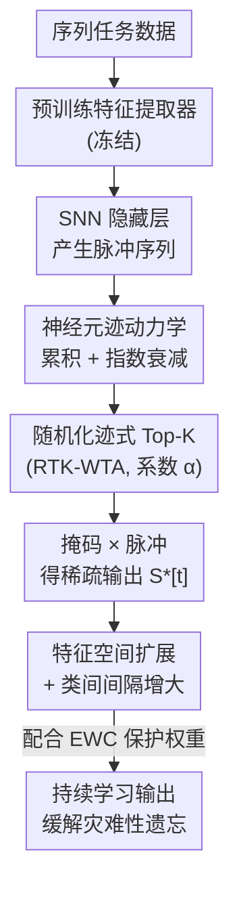

# Robust Selective Activation with Randomized Temporal K-Winner-Take-All in Spiking Neural Networks for Continual Learning

**会议**: ICLR 2026  
**OpenReview**: [https://openreview.net/forum?id=uAkexWJ7dW](https://openreview.net/forum?id=uAkexWJ7dW)  
**代码**: 待确认  
**领域**: 模型压缩 / 脉冲神经网络 / 持续学习  
**关键词**: 脉冲神经网络, 持续学习, K-Winner-Take-All, 时序迹, 随机化选择

## 一句话总结
针对脉冲神经网络（SNN）持续学习中的灾难性遗忘，本文把传统基于发放率的确定性 K-WTA 升级为「随机化时序迹 K-WTA（RTK-WTA）」——用神经元的时序迹（trace）而非瞬时发放率来排序，并在 Top-K 选择里注入受控随机性 $\alpha$，从而扩大有效特征空间、拉大类间间隔，在 splitMNIST/splitCIFAR100 上比确定性 K-WTA 提升 3.07–10.05%。

## 研究背景与动机
**领域现状**：脉冲神经网络因事件驱动、低功耗、天然带时序动力学，被视为持续学习（continual learning）的理想载体。为了在序列任务流中减少表示重叠、缓解灾难性遗忘，常见做法是引入 K-Winner-Take-All（K-WTA）这类稀疏选择机制——每个时间步只让一小撮"赢家"神经元发放，从而把不同任务的激活路径分开。

**现有痛点**：主流 K-WTA 的"赢家"判定基于神经元的**瞬时发放率或膜电位**，是一种纯空间维度上的确定性竞争。它忽略了脉冲信号本身丰富的时序信息，也无法模拟大脑跨时间调制激活模式的能力。更要命的是确定性选择会把神经元**刚性绑定**到固定模式：当后续任务和已学任务特征相似时，同一批神经元被反复选中、反复覆写，对输入扰动和任务干扰极其脆弱。

**核心矛盾**：持续学习要同时满足两个相互拉扯的需求——任务特异的**选择性**（不同任务用不同神经元，减少干扰）和跨任务的**鲁棒性/泛化**（激活模式不能太僵化，要能容忍扰动）。确定性 K-WTA 偏向前者却牺牲了后者；之前已有的"基于迹的 K-WTA"（SA-SNN）虽然引入了时序迹，但选择仍是确定性的，鲁棒性依然受限。

**切入角度**：作者注意到生物 WTA 回路并非纯确定性竞争，而是**确定性竞争 + 受控随机性**的结合——大脑靠这点随机性避免神经元过度专精、保持激活模式的灵活与冗余。同时生物神经元依赖过去活动的"时序迹"来引导未来响应。把这两点（时序迹 + 随机 Top-K）耦合进 SNN，就有望同时拿到时序选择性和抗干扰性。

**核心 idea**：用「时序迹排序 + 概率化 Top-K」替代「发放率排序 + 确定性 Top-K」——在每个时间步按神经元累积迹做 Top-K 选择，但以概率 $\alpha$ 让一部分非 Top-K 神经元也被激活，从而把选择从空间维度扩展到时空维度，并用受控随机性扩大可探索的激活组合空间。

## 方法详解

### 整体框架
RTK-WTA 接在一个预训练特征提取器之后：输入数据先被冻结的特征提取器编码成 embedding，送入 SNN 隐藏层产生脉冲序列；隐藏层每个神经元维护一条随脉冲累积、随时间衰减的**迹（trace）**；在每个时间步，RTK 模块按迹值做 Top-K 选择，但以随机系数 $\alpha$ 让一部分非 Top-K 神经元也获得激活机会，生成二值掩码 $\text{Mask}[t]$，与原始脉冲相乘得到稀疏化后的输出 $S^*[t]$；这种"随时间步变化的随机稀疏激活"在时序域里隐式地把不同任务的活跃子空间分开，无需显式任务标签，最后配合 EWC（弹性权重巩固）保护重要权重，共同抵御灾难性遗忘。

### 关键设计

**1. 时序迹作为选择指标：用累积活动而非瞬时发放率排序**

传统 K-WTA 用瞬时发放率排序，丢掉了脉冲信号的时序结构。本文改用神经元的**迹** $tr_i[t]$ 作为竞争指标。迹的离散更新规则为

$$tr_i[t+1] = tr_i[t] - \frac{tr_i[t]}{\tau} + S_i[t+1],$$

其中 $\tau$ 是衰减常数，$S_i[t+1]\in\{0,1\}$ 是脉冲。每次发放给迹加 1，无脉冲时迹按 $1/\tau$ 衰减——本质是对脉冲历史做**指数滑动平均**，对最近活动更敏感。把它沿长度 $T$ 的时间窗展开可得积分迹 $Tr_i^{(T)}=\sum_{t=1}^{T}(1-\frac{1}{\tau})^{T-t}S_i[t]$，即过去脉冲按指数衰减加权累积。相比纯发放率，迹是更紧凑、更稳定的内在状态描述：同一脉冲模式出现在不同时间位置会产生可区分的迹状态，从而支持位置不变的模式识别，为后续随机选择提供稳定度量，在不牺牲时间分辨率的前提下降低任务干扰。

**2. 随机化迹式 Top-K 选择：受控随机性扩大激活多样性**

光有迹排序仍是确定性的，鲁棒性受限。RTK 在 Top-K 选择里注入受控随机性：对 $d$ 个神经元，每个时间步生成二值掩码 $\text{Mask}[t]=\text{RTK}(tr[t])$，神经元 $i$ 被选中的概率为

$$P(\text{RTK}(tr_i[t])=1)=\begin{cases}(1-\alpha)/K, & tr_i[t]\ \text{属于 Top-}K\ \text{迹}\\ \alpha/(d-K), & \text{否则}\end{cases}$$

其中 $\alpha\in[0,1]$ 控制随机程度，$K$ 是每步选中的神经元数。$\alpha=0$ 退化为确定性 Top-K；$\alpha$ 越大，越多非 Top-K 神经元有机会被激活。被选中的脉冲输出为 $S^*[t]=S[t]\cdot\text{Mask}[t]$。这点随机性带来两个好处：一是把每步可达的激活组合从"固定一小撮"扩大到一个大得多的子集，避免落入局部极小；二是在时序域里制造**隐式任务分离**——不同任务因随机扰动而占用不同的活跃子空间，新任务干扰部分神经元时，剩余神经元仍保留旧任务的历史信息，形成互补的冗余记忆。实验也证实随机性带来的梯度噪声方差 $\mathrm{Var}(\Delta\theta_{noise})\propto\frac{\alpha(1-\alpha)}{K(d-K)}$ 起到了正则化作用，帮助收敛到更平坦的极小值。

**3. 特征空间扩展与类间间隔的理论保证：解释"为什么更鲁棒"**

作者从理论上论证随机性为何有效。在确定性 Top-K 下，因选择偏向固定一组神经元，$\binom{d}{K}$ 种组合里只有很小一部分可达；而 RTK 跨时间引入变化，每个时间步的有效激活组合数约为 $N_t=\binom{d}{K}\big[(1-\alpha)+\frac{\alpha K}{d-K}\big]^K$。沿 $T$ 步时间窗累积，有效时空特征空间体积呈指数增长：

$$V_{eff}^{(T)}\propto\Big[\binom{d}{K}\big(1+\frac{\alpha K}{(1-\alpha)(d-K)}\big)^K\Big]^T.$$

更大的特征空间直接转化为更强的泛化能力。进一步，泛化与特征空间中的最小类间间隔 $d_W=\min_{i\neq j}\|W_i-W_j\|_2$ 相关，RTK 下的有效间隔 $d_W^{RTK}\propto\big(V_{eff}^{(T)}/n\big)^{1/(KT-1)}$ 显著大于确定性 Top-K，从而实质性降低泛化误差。这条理论链条把"随机 + 时序迹"和"类间间隔更大、遗忘更少"直接挂钩，也解释了实验里 splitCIFAR100 上 10% 的领先来自更好的 100 类表示分离。

### 损失函数 / 训练策略
RTK-WTA 是一个即插即用的选择机制，不引入额外可学习模块，唯一新增超参是随机系数 $\alpha$（实验中最优值约 0.1）。训练时可单独使用，也可与 EWC 结合：EWC 用 Fisher 信息保护对旧任务重要的权重，RTK 的随机掩码则防止对噪声/任务特异连接过拟合，两者互补共同抑制遗忘。鲁棒性训练时还会随机损坏一部分 Top-K 神经元连接（按 Noise Level）来模拟不稳定的突触传输。

## 实验关键数据

### 主实验
在 splitMNIST / splitCIFAR10 / splitCIFAR100 三个持续学习基准上对比相似架构方法（准确率 %）：

| 方法 | splitMNIST | splitCIFAR10 | splitCIFAR100 |
|------|-----------|--------------|----------------|
| Rate-based SA-SNN | 50.22 | 76.88 | 21.37 |
| Trace-based SA-SNN | 60.06 | 77.73 | 22.86 |
| Randomized Rate K-WTA | 48.15 | 76.11 | 20.76 |
| **RTK-WTA** | **60.37** | **78.37** | **32.91** |
| SA-SNN + EWC | 82.18 | 80.39 | 36.47 |
| **RTK-WTA + EWC** | **85.25** | **80.56** | **41.46** |

独立使用时，RTK-WTA 在 splitCIFAR100 上达 32.91%，比次优的 Trace-based SA-SNN（22.86%）领先 **10.05%**；配合 EWC 后在 splitMNIST 达 85.25%（+3.07% over SA-SNN+EWC）、splitCIFAR100 达 41.46%（+5.0%），印证随机选择带来的特征空间扩展有助于保留任务特异特征。

### 消融实验：随机系数 α 与鲁棒性

| 配置 | 关键现象 | 说明 |
|------|---------|------|
| α = 0（确定性 Top-K） | 基线 | 无随机性，间隔较小 |
| α = 0.1（最优） | 较 α=0 提升约 1.3–1.64% | 多样性与 Top-K 核心机制的最佳平衡 |
| α = 0.5 | Random-k 暴跌约 14.47% | 近半神经元来自非 Top-K，破坏时序一致性 |
| + EWC | 退化曲线更平缓 | EWC 约束 Fisher 重要权重，缓和高 α 的不稳定 |

噪声鲁棒性（CIFAR100，训练注入噪声，准确率 %）：

| 噪声级别 | 0 | 0.2 | 0.5 | 0.8 |
|---------|---|-----|-----|-----|
| Trace-based SA-SNN + EWC | 36.47 | 31.24 | 26.32 | 10.56 |
| **RTK-WTA + EWC** | **41.46** | **37.64** | **32.42** | **17.69** |

### 关键发现
- **随机性是非单调的**：所有变体的性能随 $\alpha$ 先升后降，统一峰值在 $\alpha=0.1$。超过 0.1 后非 Top-K 神经元占比过高，破坏时序一致性导致暴跌（$\alpha=0.5$ 时掉约 14.47%），说明随机性必须"受控"。
- **时序迹比发放率关键**：纯发放率方法（Randomized Rate K-WTA）在 splitCIFAR100 上落后约 12.2%，越复杂/高维的任务越凸显时序动力学的价值。
- **鲁棒性来自更平坦的极小值**：RTK-WTA+EWC 在各噪声级别全面领先，splitMNIST 噪声从 0→0.8 仅掉 14.56%；随机掩码相当于训练时模拟测试噪声，起到隐式正则化、引导收敛到抗扰动的平坦极小值。
- **资源效率不降反优**：神经元选择性可视化显示 RTK-WTA 与 trace-based K-WTA 的激活模式高度一致，引入随机机制在提升性能的同时仍保持均衡的神经元选择分布和相当的资源利用率。

## 亮点与洞察
- **把"随机性"从工程 trick 抬升为有理论保证的机制**：通过有效特征空间体积 $V_{eff}^{(T)}$ 和类间间隔 $d_W^{RTK}$ 两条公式，把"注入随机"直接和"泛化更好、遗忘更少"挂钩，而不是只靠经验调参——这是该文最"啊哈"的地方。
- **迹 = 指数滑动平均的优雅复用**：用一行递归式 $tr_i[t+1]=tr_i[t]-tr_i[t]/\tau+S_i[t+1]$ 同时实现短期记忆、时间位置敏感和稳定排序指标，几乎零额外成本。
- **隐式任务分离**：随机 + 时序选择让不同任务自动占据不同活跃子空间，无需任务标签，这个思路可迁移到其他需要任务隔离但拿不到任务边界的持续学习场景（ANN 的稀疏激活层也能借鉴）。
- **几乎零开销的即插即用**：除 $\alpha$ 外不引入新模块/新超参，对神经形态硬件部署友好。

## 局限与展望
- 绝对精度仍偏低：splitCIFAR100 上即便最好的 RTK-WTA+EWC 也只有 41.46%，距 Joint 上界（65.28%）差距明显，SNN 持续学习整体仍处早期。
- 依赖冻结的预训练特征提取器，端到端可塑性受限；表示能力主要靠选择机制而非特征学习本身。
- 随机系数 $\alpha$ 的最优值（≈0.1）由经验扫出，理论上"为什么恰好是 0.1"缺乏闭式刻画；不同数据集/网络宽度 $d$、$K$ 下是否仍最优需更多验证。
- 类间间隔公式 $d_W^{RTK}\propto(V_{eff}^{(T)}/n)^{1/(KT-1)}$ 等推导较为近似（⚠️ 以原文为准），是定性指引而非严格界。

## 相关工作与启发
- **vs 发放率 K-WTA（Rate-based SA-SNN）**：他们按瞬时发放率做空间竞争，本文按时序迹做时空竞争，区别在于利用了脉冲历史；本文在高维任务上优势显著（splitCIFAR100 +约 12%）。
- **vs 确定性迹式 K-WTA（Trace-based SA-SNN）**：两者都用迹，但 SA-SNN 选择是确定性的、鲁棒性受限；本文加入受控随机 $\alpha$，扩大激活组合、拉大类间间隔，噪声下退化更慢。
- **vs EWC**：EWC 从"保护重要权重"侧抑制遗忘，本文从"激活路径分离"侧抑制遗忘，两者正交互补，组合后达到最优。
- **vs SDMLP（ANN 稀疏激活）**：SDMLP 是非脉冲域的全连接 Top-K 稀疏激活，作为对照可隔离出"脉冲时序动力学"本身的收益，结果验证时序动力学带来额外提升。

## 评分
- 新颖性: ⭐⭐⭐⭐ 把生物启发的"时序迹 + 受控随机"统一进 K-WTA，并给出特征空间/间隔的理论解释，角度新颖。
- 实验充分度: ⭐⭐⭐⭐ 三数据集 + α 扫描 + 训练/测试双向噪声 + 神经元选择性可视化，较完整；但绝对精度偏低、缺更大规模数据集。
- 写作质量: ⭐⭐⭐⭐ 动机—机制—理论—实验链条清晰，公式与生物动机呼应；个别推导偏近似。
- 价值: ⭐⭐⭐⭐ 为 SNN 神经形态持续学习提供了几乎零开销、可解释的鲁棒选择机制，迁移潜力好。

<!-- RELATED:START -->

## 相关论文

- [\[ICLR 2026\] Many Eyes, One Mind: Temporal Multi-Perspective and Progressive Distillation for Spiking Neural Networks](many_eyes_one_mind_temporal_multi-perspective_and_progressive_distillation_for_s.md)
- [\[ICLR 2026\] Robust Training of Neural Networks at Arbitrary Precision and Sparsity](robust_training_of_neural_networks_at_arbitrary_precision_and_sparsity.md)
- [\[ICLR 2026\] Cannistraci-Hebb Training on Ultra-Sparse Spiking Neural Networks](cannistraci-hebb_training_on_ultra-sparse_spiking_neural_networks.md)
- [\[ICLR 2026\] Rethinking Continual Learning with Progressive Neural Collapse](rethinking_continual_learning_with_progressive_neural_collapse.md)
- [\[NeurIPS 2025\] Synergy between the Strong and the Weak: Spiking Neural Networks Are Inherently Superior in Temporal Processing](../../NeurIPS2025/model_compression/synergy_between_the_strong_and_the_weak_spiking_neural_networks_are_inherently_s.md)

<!-- RELATED:END -->
