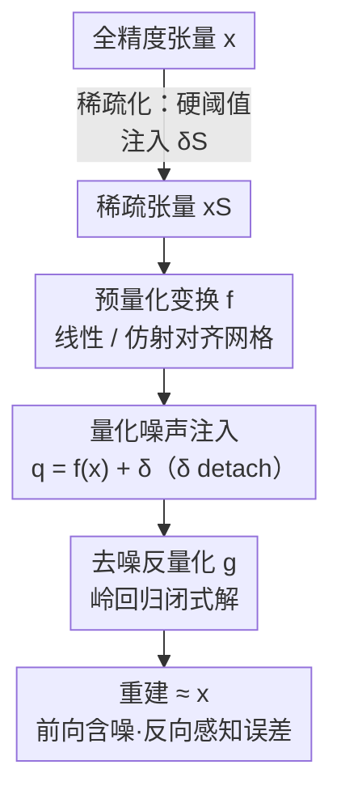

# Robust Training of Neural Networks at Arbitrary Precision and Sparsity

**会议**: ICLR 2026  
**OpenReview**: [https://openreview.net/forum?id=e6nZrzSccj](https://openreview.net/forum?id=e6nZrzSccj)  
**代码**: 未提供（论文给出 PyTorch/JAX 伪代码片段）  
**领域**: 模型压缩  
**关键词**: 量化感知训练, STE, 反量化, 岭回归, 结构化稀疏

## 一句话总结
这篇论文指出超低比特量化训练不稳定的根因不是"量化不可导"，而是 STE 的反向传播看不见量化误差；作者把量化重写成加性噪声，并用一个从岭回归推出的去噪反量化变换 $g$ 把误差显式接回梯度通路，从而在标准训练配方下稳定训练出 A1W1 乃至亚 1-bit 网络。

## 研究背景与动机

**领域现状**：要把大模型塞进端侧设备，量化（quantization）和稀疏化（sparsification）是两大主力手段。但 round / 阈值这类操作不可导，十多年来社区都靠 Straight-Through Estimator（STE）来训练量化网络——前向走真实的量化，反向直接把 round 的导数近似成恒等映射（$\frac{dq}{df(x)}=I$），让梯度照常流过。

**现有痛点**：STE 在高比特、过参数化的大模型上还能凑合，但一旦进到超低比特（尤其 A1W1，激活和权重都 1-bit）或冗余度低的小模型，训练经常震荡、发散甚至出 NaN。为了救场，社区堆了一大堆启发式补丁：额外归一化、调学习率、换优化器、加 fine-tune……全是 ad-hoc。

**核心矛盾**：作者第一次点明根因——问题不在"量化不光滑"，而在**缺一条能让模型学会抵抗量化噪声的梯度通路**。把量化写成 $y = s\cdot\text{round}(x/s)$，定义舍入误差 $\delta = \text{round}(x/s) - x/s$，前向就是 $y = x + s\cdot\delta$。STE 的反向却因为 $\frac{dy}{dx}=1$ 让 $\delta$ 彻底从梯度里消失了——这个误差影响了前向、却拿不到任何梯度，像贝克莱讽刺微积分时说的"已逝量的幽灵"。前面的层因此根本不知道误差存在，也就无从学会去适应它。

**本文目标**：不再加经验补丁，而是给量化训练一条**有良定义、不靠代理梯度估计**的通路，让超低比特和稀疏训练用现成配方就能稳定收敛。

**切入角度**：既然 $\delta$ 是噪声，那就把反量化（dequantization）显式设计成一个**去噪**步骤，让它的参数由含噪向量 $q$ 的统计量算出来——这样 $\delta$ 自然进入前向输入，也通过链式法则进入反向梯度。

**核心 idea**：把反量化建模成一个岭回归问题，得到闭式的去噪反量化变换 $g$，用它替代 STE 的"瞎反向"，造出一条对量化误差敏感的纠错梯度路径。

## 方法详解

### 整体框架

整个框架是一个三阶段的量化感知训练流程，核心是把"量化"显式拆成"加噪 + 去噪"两步，让误差在前向和反向都可见。给定全精度张量 $x$：**阶段 1** 用预量化变换 $f$ 把 $x$ 映射到适合舍入的范围（零均值数据用线性 $f(x)=x/s_f$，非对称数据用仿射 $f(x)=(x-b_f)/s_f$ 对齐网格）；**阶段 2** 把舍入建模成加性误差 $q = f(x) + \delta$，其中 $\delta=\text{round}(f(x))-f(x)$ 被 detach（不接梯度）；**阶段 3** 用去噪反量化变换 $g$ 把含噪的 $q$ 映回高精度域、重建 $x$，$g$ 的参数从 $q$ 的统计量解一个岭回归算出来，于是 $\delta$ 既进了 $g$ 的输入、又通过 $g$ 对 $q$ 的导数进了反向梯度。稀疏化被当成"只把小值置零的特殊量化"挂在阶段 1 之前，复用同一条去噪通路；而仿射量化在推理时的矩阵乘则被一个快捷公式压成接近线性量化的开销。

### 关键设计

**1. 量化噪声注入：把 round 重写成加性误差，揪出 STE 的反向盲点**

针对"超低比特训练发散"的根因，作者先做了一次关键的重写：量化不再被看成一个不可导的黑盒，而是 $q = f(x) + \delta$，其中 $\delta = \text{round}(f(x)) - f(x)$ 是舍入误差。这一步看似只是换写法，却暴露了 STE 的病灶——STE 把 $\frac{dq}{df(x)}$ 近似成恒等，于是 $\frac{dL}{dx}=\frac{dL}{dq}$，$\delta$ 在反向里被完全抹掉。也就是说前向是"量化感知"的，反向却是"量化无知"的：误差实实在在扰动了前向输出，却不给前面的层任何修正信号，未被管理的扰动持续腐蚀学习信号，最终导致发散。把 $\delta$ 显式拎出来并 detach，正是为了在阶段 3 把它重新接回梯度——这是整套方法的诊断与立足点。

**2. 去噪反量化变换 g：用岭回归造一条纠错梯度通路**

这是全文的核心创新，针对的就是设计 1 揭示的"反向看不见 $\delta$"。常规反量化只是把阶段 1 的缩放逆回去，而作者把反量化写成一个岭回归目标：对非对称数据用仿射 $g(q)=s_g\cdot q + b_g$，求解

$$\min_{s_g,b_g}\ \frac{1}{2N}\lVert s_g\cdot q + b_g\cdot\mathbf{1} - x\rVert^2 + \frac{\lambda}{2}s_g^2$$

得到闭式的反量化向量 $g(q)=\frac{\text{Cov}_{xq}}{\text{Var}_q+\lambda}(q-\bar q)+\bar x$；零均值数据则退化成更省的线性 $g(q)=s_g q$，$s_g=\frac{\langle q,x\rangle}{\langle q,q\rangle+\lambda}$。它之所以能解决 STE 盲点是因为：前向输入就是含噪的 $q=f(x)+\delta$，误差天然在里头；反向时 $\frac{dL}{dq}=\frac{dL}{dg(q)}\frac{dg(q)}{dq}$，而 $g$ 的尺度/偏移由 $q$ 的统计量算出，导数 $\frac{dg(q)}{dq}$ 直接被 $q$（含 $\delta$）塑形，于是梯度成了 $\delta$ 的显式函数——STE 丢掉的学习信号被找了回来，前面的层得以学会对误差鲁棒。其中 $\lambda$ 是"去噪旋钮"：$\lambda\to\infty$ 时 $s_g\to 0$，反量化退回到均值 $\bar x$，即忽略噪声、退守最稳的信号分量；实验里 $\lambda=0.01$ 就足以在所有设置下稳住训练。论文还点出这个 $g$ 在结构上等价于一层 LayerNorm（$\lambda$ 类比 $\epsilon$），所以计算开销与 LayerNorm/RMSNorm 同级。

**3. 稀疏化即特殊量化：一套框架统一两种压缩**

针对"量化和稀疏化各搞一套训练机制"的割裂，作者把稀疏化看成"只把不重要的值映成零的特殊量化"，从而无缝并进同一条去噪通路。做法是把两种压缩建模成串行的加性误差注入：先对全精度 $x$ 做硬阈值（如 2:4 结构化稀疏）得到稀疏误差 $\delta_S=\text{threshold}(x)-x$、稀疏张量 $x_S=x+\delta_S$；再把 $x_S$ 喂进量化管线，引入第二个误差 $\delta_Q$，得到 $q=f(x_S)+\delta_Q$。关键在于去噪变换 $g$ 作用在这个"双重扰动"的 $q$ 上、目标仍是重建原始稠密高精度 $x$，由于 $g$ 的参数来自 $q$ 的统计量，它自动学会纠正 $\delta_S$ 和 $\delta_Q$ 的联合误差分布——反向因此对"总扰动"有感知，网络同时对量化和稀疏两种压缩变得鲁棒。

**4. 仿射量化矩阵乘的快捷公式：让最鲁棒的方案也跑得快**

仿射量化（双边、逐通道）质量最好，但朴素实现会把 $\tilde Y=\tilde X\tilde W$ 展开成四项相加，又贵又难落地，这历来是它被弃用的原因。作者用一个均值中心化恒等式 $Y = (X-\bar x\mathbf 1^T)(W-\mathbf 1\bar w^T)+\bar x\bar w^T n$ 推出定理：双边逐通道仿射反量化可写成

$$\tilde Y = (s_X\cdot s_W^T)\odot(Q_X Q_W - \bar q_X\bar q_W^T n) + \bar x\bar w^T n$$

即"一个标准线性量化矩阵乘 + 两个廉价的 rank-1 修正"。主项就是线性量化的常规计算，再补一个按量化均值做中心化的减法项、一个用原始高精度均值重建输出均值的加法项。这把仿射量化的开销从四个矩阵项降到一次整数矩阵乘加两个低秩修正，让"最高质量"的仿射方案推理速度几乎和线性量化一样——这是设计 2 让仿射偏置 $b$ 能被稳定学到之后，进一步把它推向可部署的关键一步。

### 损失函数 / 训练策略
没有引入额外的训练损失或代理梯度：去噪反量化 $g$ 的参数由岭回归闭式解直接给出，唯一新增超参是正则项 $\lambda=0.01$（全实验统一）。所有量化实验的超参直接沿用 BF16 基线、无需调度调参；1/2/4-bit 量化用仿射，三值（1.5-bit）和结构化稀疏用更利于硬件的线性量化，且统一采用子通道量化 SCQ（block 128）做细粒度量化。

## 实验关键数据

### 主实验

| 设置 | 任务/模型 | 本文 | 对照 | 结论 |
|------|-----------|------|------|------|
| A1W1 训练稳定性 | nanoGPT (Shakespeare, 11M) | 平滑收敛 | STE / BitNet / ParetoQ 发散或高 loss | 极端比特下唯一稳定收敛 |
| A1W1 (GPT-2 small 124M) | OpenWebText 25k 步 | 稳定收敛 | STE/BitNet 验证 loss 震荡或 NaN，ParetoQ 收敛更差 | 真实任务上同样稳 |
| A4W1 + 2:4 稀疏 | Gemma3 4B (C4) | 0.4517 | BF16 Gemma3 1B 0.4494 / A4W4 1B 0.4443 | 大模型激进量化 > 小模型高精度 |

A1W1 SCQ128 下仿射 vs 线性量化（C4 accuracy）：本文方法线性 0.3547、仿射 **0.3751**（显著跃升），而 STE 线性 0.3399、仿射 0.3397（仿射的额外表达力完全没被用上）——说明只有稳定的反向才能真正学到仿射的 scale/bias。

### 消融实验

| 配置 | 关键现象 | 说明 |
|------|---------|------|
| A4W1（非对称分配） | 落在存储 Pareto 前沿 | 保激活精度、狠压静态权重，优于对称 A2W2 |
| A4W1 + 2:4 结构化稀疏 | 0.4068 → 0.4080，计算量减半 | 稀疏与量化协同：更省且更准 |
| SCQ128（子通道）vs Hadamard | SCQ 定义更优前沿 | 把离群值影响局部化在小块内统计混合，比复杂旋转变换更直接 |
| $\lambda=0.01$ | 全设置稳定 | 单一正则值即可，无需逐比特调参 |

### 关键发现
- **去噪反量化 $g$ 是稳定性的来源**：它把 STE 丢弃的量化误差重新接回反向梯度，是 A1W1/亚 1-bit 能训起来的根本；去掉它就退回 STE 的发散行为。
- **非对称比特分配最优**：存储 Pareto 前沿不在对称 A2W2，而在 A4W1（高精度激活 + 极低比特权重），因为权重是静态的、适合激进压缩。
- **稀疏与量化有正协同**：2:4 稀疏叠到 A4W1 上同时砍掉一半算力还涨点（0.4068→0.4080），不是简单的精度-效率权衡。
- **量化大模型 > 高精度小模型**：固定预算下，激进量化的 4B 比 BF16/量化的 1B 又准又省算力。

## 亮点与洞察
- **重新定义了问题**：十年来大家以为量化训练难是因为"不可导/不光滑"，本文第一次把矛头指向"反向缺一条让模型学会抗噪的梯度通路"——这是认知层面的纠偏，比再加一个补丁更有价值。
- **岭回归 = 去噪反量化 = 归一化层**：同一个 $g$ 三种解读自洽，$\lambda$ 既是岭回归正则、又是 LayerNorm 的 $\epsilon$，还顺带解释了为什么开销只有一层 norm，设计极其经济。
- **把稀疏统一进量化**：用"加性误差串联"把稀疏化收编进同一条去噪通路，避免为稀疏单独设计训练机制，这个抽象可迁移到其他不可导压缩操作（如低秩、码本量化）。
- **仿射 matmul 快捷公式**：把"质量最好但太贵"的双边仿射量化压成"线性量化 + 两个 rank-1 修正"，证明高质量和高效率不必二选一。

## 局限与展望
- 能耗对比用的是硬件无关的近似代价（稀疏因子 × 激活比特 × 权重比特 × 总操作数），作者明确说它省略了数据搬运、量化开销等主导项，只是算术能耗的一阶下界，不能直接当真实功耗。
- 大规模实验集中在 Gemma3 1B/4B 与 nanoGPT/GPT-2，更大规模 LLM（如 7B+）和更长训练预算下的表现未充分验证。
- 去噪变换依赖 $q$ 的逐块统计量，子通道 SCQ 的 block 大小（128）是隐含超参，块过小/过大对统计估计稳定性的影响没有系统消融。
- 改进思路：把岭回归 $\lambda$ 做成可学习/逐层自适应，或将该去噪通路推广到激活的 KV-cache 量化、训练后量化（PTQ）场景。

## 相关工作与启发
- **vs STE / BitNet / ParetoQ**：它们都靠代理梯度（恒等近似）+ 各种 ad-hoc 配方（额外归一化、改学习率/优化器、bit-specific 调参）来勉强稳定；本文不做梯度估计，从岭回归导出良定义梯度，A1W1 下别人发散/NaN 而本文平滑收敛，且能用上仿射量化的额外表达力。
- **vs Hadamard 旋转类离群值处理（QuaRot 等）**：它们把离群值"混"进其他坐标轴；本文也"混"，但混进的是去噪反量化参数的统计计算里，并用 SCQ 把影响局部化，前沿更优、实现更直接。
- **vs Spiking Neural Networks**：SNN 想靠离散脉冲达到类似效率，但同样受不可导之困；本文的 1-bit 鲁棒训练在标准梯度框架内就达成了相当的计算稀疏与效率，提供了更实用的替代路径。

## 评分
- 新颖性: ⭐⭐⭐⭐⭐ 第一次把超低比特训练不稳的根因从"不可导"重定义为"反向缺纠错梯度通路"，并给出从岭回归导出的去噪反量化解。
- 实验充分度: ⭐⭐⭐⭐ 覆盖 nanoGPT→GPT-2→Gemma 1B/4B 及存储/能耗双 Pareto 前沿，但能耗为近似代理、超大模型验证有限。
- 写作质量: ⭐⭐⭐⭐⭐ 问题诊断犀利（"已逝量的幽灵"），三阶段框架 + 归一化类比 + matmul 快捷公式层层递进，可读性强。
- 价值: ⭐⭐⭐⭐⭐ 让 A1W1/亚 1-bit 训练用标准配方即可稳定，为端侧超高效网络提供了有理论支撑的通用方案。

<!-- RELATED:START -->

## 相关论文

- [\[ICLR 2026\] BEP: A Binary Error Propagation Algorithm for Binary Neural Networks Training](bep_a_binary_error_propagation_algorithm_for_binary_neural_networks_training.md)
- [\[ICLR 2026\] Adaptive Width Neural Networks](adaptive_width_neural_networks.md)
- [\[ICLR 2026\] Robust Selective Activation with Randomized Temporal K-Winner-Take-All in Spiking Neural Networks for Continual Learning](robust_selective_activation_with_randomized_temporal_k-winner-take-all_in_spikin.md)
- [\[ICLR 2026\] Towards Lossless Memory-efficient Training of Spiking Neural Networks via Gradient Checkpointing and Spike Compression](towards_lossless_memory-efficient_training_of_spiking_neural_networks_via_gradie.md)
- [\[ICLR 2026\] Cannistraci-Hebb Training on Ultra-Sparse Spiking Neural Networks](cannistraci-hebb_training_on_ultra-sparse_spiking_neural_networks.md)

<!-- RELATED:END -->
