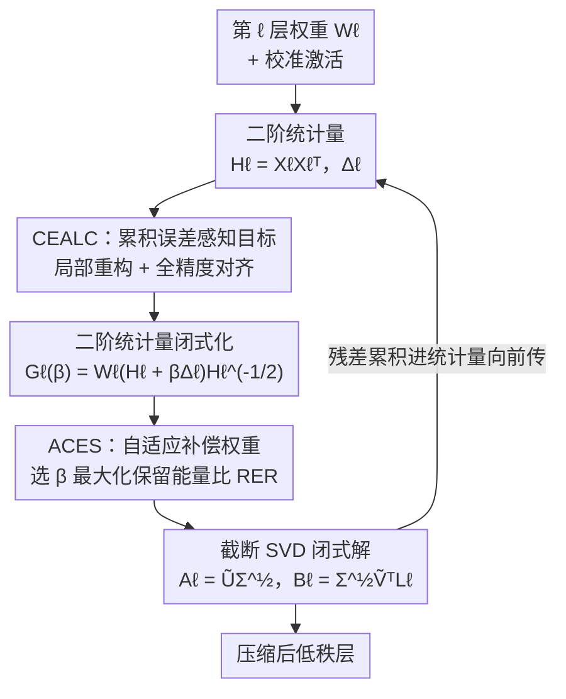

# SAES-SVD: Self-Adaptive Suppression of Accumulated and Local Errors for SVD-based LLM Compression

**会议**: ICLR 2026  
**OpenReview**: [https://openreview.net/forum?id=KMAYsQO8pU](https://openreview.net/forum?id=KMAYsQO8pU)  
**领域**: 模型压缩  
**关键词**: SVD低秩压缩, 累积误差, 闭式解, 自适应权重, LLM压缩

## 一句话总结
SAES-SVD 在逐层 SVD 低秩压缩的目标里显式加入"对齐全精度参考输出"的累积误差补偿项，推出只依赖二阶激活统计量的闭式解，并自适应地为每层挑选最优补偿权重，让压缩后模型的逐层输出始终贴近全精度基线——在 LLaMA-7B 0.2 压缩率下把平均精度跌幅从 >0.05 压到 0.02 左右，且无需微调或混合秩分配。

## 研究背景与动机
**领域现状**：LLM 体量暴涨催生了大量压缩需求，其中低秩分解（典型实现是截断 SVD）因为硬件无关、即插即用、可与量化/剪枝叠加而备受青睐。它把权重矩阵 $W$ 分解成两个低秩因子 $A B$，直接砍掉参数量和计算量。主流改进路线如 ASVD、SVD-LLM、AdaSVD、DipSVD 都围绕"让单层重构误差更小"做文章——分别引入激活感知缩放、白化变换、迭代精化、重要性加权。

**现有痛点**：这些方法有一个共同的根本缺陷——它们**各层独立**地最小化重构误差，完全无视误差会沿网络逐层传播累积。早层的压缩误差会改变后续层的输入分布，导致误差像滚雪球一样越滚越大，最终输出与全精度基线的偏差被严重放大。作者用 SVD-LLM 压 LLaMA2-7B 验证：尽管它在每一层都达到了理论最小截断误差，但压缩输出与全精度输出的余弦相似度还是从浅层的 0.97 一路掉到深层的 0.79。

**核心矛盾**："逐层局部最优"并不等于"端到端全局保真"。每层都贪心地把自己这一层重构得最好，但谁也没考虑自己的输入早已被上游污染、谁也没为下游的累积偏差负责。

**本文目标**：把传统的"各层独立优化"改造成"全局协同的误差抑制机制"——让每一层既修好自己的局部重构误差，又主动补偿来自上游的累积误差，同时这一切要在单次 SVD、不微调、不混合秩的前提下完成。

**切入角度**：作者的关键观察是，只要在压缩目标里加一项"对齐全精度参考输出 $W_\ell X_\ell^f$"的约束，就能让当前层在压缩时"看见"上游误差并主动纠偏；更妙的是，这个新目标依然能化成一个加权 Frobenius 范数最小化问题，从而保留 SVD 闭式解的优雅。

**核心 idea**：用"局部重构 + 全精度对齐"的双目标替代纯局部重构目标，推出只依赖二阶激活统计量的闭式低秩解，再用一个自适应权重系数动态平衡两者、把能量集中到主奇异子空间。

## 方法详解

### 整体框架
SAES-SVD 是一个统一的低秩压缩框架，要同时压住两类误差：当前层自己的重构误差，以及从上游压缩层累积下来的偏差。它由两个组件构成：**CEALC（累积误差感知的层压缩）** 负责把累积误差补偿写进压缩目标并解出闭式低秩解；**ACES（自适应协同误差抑制）** 负责自动调出最优的补偿权重 $\beta_\ell$，让秩预算被用在刀刃上。

整体流程是逐层串行的闭环：对第 $\ell$ 层，先从校准数据收集二阶统计量（输入协方差 $H_\ell$ 和差分协方差 $\Delta_\ell$），CEALC 据此构造出补偿了累积误差的目标矩阵 $G_\ell(\beta)$；ACES 在此基础上挑选让"保留能量比"最大的 $\beta_\ell^\star$；最后对 $G_\ell(\beta_\ell^\star)$ 做一次截断 SVD 得到闭式解 $A_\ell, B_\ell$。压缩后的本层残差又被累积进二阶统计量向前传播，让下游层能"预判"并补偿上游误差。

### 关键设计

**1. CEALC 累积误差感知目标：让压缩目标"看见"上游污染**

传统目标只要求 $A_\ell B_\ell X_\ell$ 逼近当前输出 $W_\ell X_\ell$（公式 2），但 $X_\ell$ 本身已被上游压缩污染，所以哪怕这层重构得再完美，也只是忠实复刻了一个"已经跑偏的输入"。CEALC 的破局点是在目标里加一项**全精度参考对齐**：让压缩层的输出去对齐"如果输入是全精度激活 $X_\ell^f$ 时本层该有的输出 $W_\ell X_\ell^f$"。双目标写成加权 Frobenius 范数：

$$\arg\min_{A_\ell,B_\ell}\ \underbrace{\|(A_\ell B_\ell - W_\ell)X_\ell\|_F^2}_{\text{层内重构误差}} + \alpha_\ell\underbrace{\|A_\ell B_\ell X_\ell - W_\ell X_\ell^f\|_F^2}_{\text{全精度参考对齐}}$$

其中 $\alpha_\ell \ge 0$ 控制对齐强度。作者证明，令 $T_\ell = W_\ell X_\ell$、$R_\ell = W_\ell X_\ell^f$，这个双目标可以等价化简成对单个"混合目标" $Z_\ell = \frac{T_\ell + \alpha_\ell R_\ell}{1+\alpha_\ell}$ 的逼近问题 $\min \|A_\ell B_\ell X_\ell - Z_\ell\|_F^2$（公式 4-6）。这一步的精妙之处在于：加了对齐项后目标依然是一个标准的低秩逼近问题，从而 SVD 闭式解的路子完全保留，只是逼近的"靶子"从原始输出换成了一个朝全精度方向偏移过的混合输出。这就把"各层独立"变成了"每层主动向全精度看齐"。

**2. 二阶统计量闭式化：不存原始激活也能解**

直接对齐 $X_\ell^f$ 有个工程死结：要存原始激活和它们的全精度版本，内存开销极其离谱——哪怕 128 条校准样本、序列长 2048，激活存储成本也比参数本身大两个数量级。CEALC 的解法是把目标彻底重写成**只依赖二阶统计量**的形式。定义输入协方差 $H_\ell = X_\ell X_\ell^\top$ 和差分协方差 $\Delta_\ell = (X_\ell^f - X_\ell)X_\ell^\top$（后者正是上游引起的分布漂移），利用 $X_\ell^f X_\ell^\top = H_\ell + \Delta_\ell$ 代入，混合目标里那一项就化简为

$$Z_\ell X_\ell^\top = W_\ell(H_\ell + \beta_\ell \Delta_\ell),\quad \beta_\ell := \frac{\alpha_\ell}{1+\alpha_\ell}\in[0,1)$$

配合白化矩阵 $L_\ell = H_\ell^{-1/2}$，整个目标变成对矩阵 $G_\ell = W_\ell(H_\ell + \beta\Delta_\ell)H_\ell^{-1/2}$ 求最优低秩逼近。由 Eckart–Young–Mirsky 定理，对 $G_\ell$ 做一次截断 SVD 就给出闭式解 $A_\ell = \tilde U_{r_\ell}\Sigma_{r_\ell}^{1/2}$、$B_\ell = \Sigma_{r_\ell}^{1/2}\tilde V_{r_\ell}^\top L_\ell$（公式 11-12）。于是只需逐层批量收集 $H_\ell$ 和 $\Delta_\ell$（类似 GPTQ 的做法），既避开了海量激活存储，又只比朴素 SVD 多几次矩阵运算，几乎零额外代价就完成了累积误差补偿。

**3. ACES 自适应补偿权重：把秩预算花在能量最集中处**

CEALC 里的 $\beta_\ell$ 若全网固定，会出问题：不同层对累积误差的敏感度天差地别，一个统一的对齐强度会破坏权重的低秩结构——选得不好会把谱能量散到非主导分量上，在固定秩预算下白白浪费截断容量。作者用**保留能量比 RER**（top-$k$ 奇异值平方和占总平方和的比例）来量化这种低秩友好度，RER 越高说明能量越集中在前几个奇异值、压缩效率越高。ACES 的目标就是为每层挑出让 RER 最大的 $\beta_\ell^\star$（公式 14）。

难点在于：奇异值会随 $\beta$ 变化，每试一个 $\beta$ 都得重算一次 SVD，直接优化不可行。作者用一阶近似（FS-FOA 定理 4.2）破解：把主子空间冻结在 $\beta=0$ 处，用 $S_\ell = W_\ell H_\ell L_\ell$ 在 top-$r_\ell$ 子空间外的投影残差来近似截断能量，于是相对误差比变成 $\beta$ 的有理函数 $\tilde\rho(\beta) = \frac{a + 2b\beta + c\beta^2}{A + 2B\beta + C\beta^2}$，对其求导置零得到一个一元二次方程（公式 19）。只需在可行区间 $[0,1]$ 内解出实根、连同端点一起比较，就能选出最优 $\beta_\ell^\star$，完全不必反复跑 SVD。这样 ACES 在 CEALC 满足"朝全精度纠偏"的前提上，又额外保证了"保留子空间装下尽可能多的信息"。

### 损失函数 / 训练策略
方法是 post-training、无需微调的：对每层独立求闭式解，不反传梯度、不混合秩分配。CEALC 与 ACES 共同构成一个**闭环压缩机制**——每层自适应选 $\alpha_\ell$ 压住新引入的截断误差，残差累积进二阶统计量向前传，下游层据此预判并补偿上游累积误差，最终只用每层单次 SVD 就达到接近基线的输出保真度。ACES 中 $\alpha$ 的搜索区间实践取 $[\alpha_{\min},\alpha_{\max}]=[0.25,0.75]$。

## 实验关键数据

### 主实验
在 LLaMA-1/2/3 系列上评测，困惑度测 WikiText2 与 C4（序列长 2048），零样本精度覆盖 ARC-c/e、HellaSwag、MathQA、PIQA、WinoGrande、OpenbookQA 共 7 个 benchmark。对比 ASVD、SVD-LLM、FW-SVD、Dobi-SVD、AdaSVD、Dip-SVD（其中 SVD-LLM/Dobi-SVD 需微调，ASVD/AdaSVD/Dobi-SVD 用混合秩），而 SAES-SVD 既不微调也不混合秩。

LLaMA-7B 主结果（节选，Avg↑ 为 7 项平均精度，Drop↓ 为相对全精度基线的跌幅）：

| 压缩率 | 方法 | Wiki2↓ | C4↓ | Avg↑ | Drop↓ |
|--------|------|--------|------|------|-------|
| 0.0 | Baseline | 5.68 | 7.34 | 0.52 | 0.00 |
| 0.2 | SVD-LLM† | 7.94 | 15.84 | 0.44 | 14.7% |
| 0.2 | Dobi-SVD∗† | 8.54 | 10.01 | 0.46 | 10.8% |
| 0.2 | Dip-SVD∗ | 7.95 | 14.07 | 0.47 | 9.2% |
| 0.2 | **Ours** | **7.17** | **13.77** | **0.50** | **3.9%** |
| 0.4 | Dip-SVD∗ | 12.76 | 34.35 | 0.40 | 22.8% |
| 0.4 | **Ours** | **10.42** | **32.79** | **0.41** | **21.1%** |
| 0.6 | Dobi-SVD∗† | 46.18 | — | 0.32 | 38.0% |
| 0.6 | **Ours** | **22.01** | 93.97 | **0.34** | **34.1%** |

在 0.2 率下 SAES-SVD 把精度跌幅压到 3.9%，相比最强基线 Dip-SVD 的 9.2% 几乎砍半；在激进的 0.6 率下困惑度（22.01）相对 Dobi-SVD（46.18）直接腰斩。在更大的 LLaMA-13B/30B 上同样全面领先：30B 上困惑度降到 5.49（ASVD 22.71、SVD-LLM 5.63），比 Dip-SVD 高约 10% 精度。推理上 LLaMA3-8B 在 A6000 单卡随压缩率提升取得 1.29×–3.79× 加速。

### 消融实验
两组件逐项消融（Avg Acc 为 PIQA/ARC-e/HellaSwag/WinoGrande 平均）：

| 模型 | CEALC | ACES | Wiki PPL↓ | Avg Acc↑ |
|------|-------|------|-----------|----------|
| LLaMA2-7B | × | × | 9.34 | 58.66 |
| LLaMA2-7B | ✓ | × | 7.66 | 62.02 |
| LLaMA2-7B | ✓ | ✓ | 7.37 | 63.03 |
| LLaMA3-8B | × | × | 16.59 | 55.76 |
| LLaMA3-8B | ✓ | × | 12.25 | 58.82 |
| LLaMA3-8B | ✓ | ✓ | 11.48 | 60.18 |

### 关键发现
- **CEALC 是绝对主力**：单加 CEALC 就把 LLaMA2-7B 的 PPL 从 9.34 降到 7.66、精度从 58.66 升到 62.02，贡献了大头；ACES 在此之上锦上添花，再降 0.29 PPL、再升约 1 个点。这印证了"补偿累积误差"比"调权重"更治本。
- **$\alpha$ 区间不敏感且有甜区**：LLaMA2-7B 0.2 率下扫描 $[\alpha_{\min},\alpha_{\max}]$，在 $[0.25,0.75]$ 附近 PPL/精度都最优（7.37 / 63.03），区间内表现平稳；但下界设太高（$\alpha_{\min}>0.8$）会过度对齐、反而显著掉精度，疑似过拟合校准集。
- **跨架构跨规模稳健**：7B→13B→30B 一路领先，且在不微调、不混合秩这种最"朴素"配置下就超过了那些用了微调或混合秩的对手。

## 亮点与洞察
- **把"全局问题"塞回"局部闭式解"**：累积误差本质是端到端、跨层耦合的全局问题，作者却通过"全精度参考对齐"这一项，把它折叠成一个仍可用截断 SVD 一击求解的局部目标——既抓住了全局保真，又没丢掉 SVD 的优雅与零训练成本，这是全文最漂亮的一步。
- **二阶统计量是省内存的关键 trick**：用 $H_\ell$ 和差分协方差 $\Delta_\ell$ 替代海量原始激活，把比参数大两个数量级的存储压成几个矩阵，这个思路（类 GPTQ）可直接迁移到任何需要"激活感知"的 post-training 压缩/量化方法。
- **RER + 一阶近似避免反复 SVD**：用保留能量比量化低秩友好度、再用冻结主子空间的一阶近似把权重搜索化成解一元二次方程，省掉了"每试一个权重就重算 SVD"的天价开销，是一个可复用的"目标可微化"技巧。
- **误差向前传播的闭环视角**：把每层残差累积进统计量再前传，让下游"预判"上游误差，这种把压缩看成动态系统而非静态逐层操作的视角，对剪枝、量化的逐层校准都有启发。

## 局限与展望
- 方法依赖"全精度参考激活 $X_\ell^f$"和差分协方差 $\Delta_\ell$ 的采集，需要跑一遍全精度前向收集统计量，对超大模型的校准开销和数值稳定性（$H_\ell^{-1/2}$ 白化）仍是潜在负担。
- ACES 的 $\beta^\star$ 基于"冻结 $\beta=0$ 主子空间"的一阶近似，当 $\Delta_\ell$ 较大、主子空间随 $\beta$ 明显旋转时，这个近似的最优性可能失真，论文未给出近似误差的定量界。
- $\alpha$ 搜索区间被固定为 $[0.25,0.75]$ 且对上界敏感（过高会过拟合校准集），说明对校准数据分布有一定依赖；评测集中在 LLaMA 系列与零样本/困惑度任务，缺生成质量、指令遵循等更贴近部署的评估。
- 可改进方向：把累积误差补偿与混合秩分配、量化联合优化；或为 ACES 推导更紧的近似误差界以放心用于更激进的压缩率。

## 相关工作与启发
- **vs SVD-LLM**：SVD-LLM 用白化矩阵归一化输入、达到逐层理论最小截断误差，但仍是各层独立、不管累积误差，所以深层相似度从 0.97 掉到 0.79；SAES-SVD 在白化基础上额外加全精度对齐项，把"逐层最优"升级为"端到端保真"。
- **vs ASVD / AdaSVD**：ASVD 用可学习缩放、AdaSVD 用交替迭代精化，都仍假设层误差独立、且常需混合秩或迭代；SAES-SVD 单次闭式解、不混合秩，却靠累积误差补偿超过它们。
- **vs Dip-SVD / FW-SVD**：这类用全局/局部重要性加权来指导单层压缩，改善的是层级稳定性，但同样未解累积误差；SAES-SVD 直接把跨层误差累积写进优化目标，是更根本的视角转变。

## 评分
- 新颖性: ⭐⭐⭐⭐⭐ 首次把跨层累积误差显式写进低秩压缩目标，并保留闭式解，视角与技术都新。
- 实验充分度: ⭐⭐⭐⭐ 覆盖 7B/13B/30B 多压缩率与 7 个 benchmark，消融清晰；但局限于 LLaMA 系列、缺生成类任务评估。
- 写作质量: ⭐⭐⭐⭐ 推导链条完整、动机与图示到位，公式较密但逻辑自洽。
- 价值: ⭐⭐⭐⭐⭐ 无需微调/混合秩即超过更复杂的基线，工程落地性强，对 post-training 压缩有普适启发。

<!-- RELATED:START -->

## 相关论文

- [\[ICLR 2026\] Rethinking Residual Errors in Compensation-based LLM Quantization](rethinking_residual_errors_in_compensation-based_llm_quantization.md)
- [\[ICML 2026\] Swift-SVD: Theoretical Optimality Meets Practical Efficiency in Low-Rank LLM Compression](../../ICML2026/model_compression/swift-svd_theoretical_optimality_meets_practical_efficiency_in_low-rank_llm_comp.md)
- [\[ICLR 2026\] KBVQ-MoE: KLT-guided SVD with Bias-Corrected Vector Quantization for MoE Large Language Models](kbvq-moe_klt-guided_svd_with_bias-corrected_vector_quantization_for_moe_large_la.md)
- [\[ICLR 2026\] Adaptive Nonlinear Compression for Large Foundation Models](adaptive_nonlinear_compression_for_large_foundation_models.md)
- [\[ICLR 2026\] LeSTD: LLM Compression via Learning-based Sparse Tensor Decomposition](lestd_llm_compression_via_learning-based_sparse_tensor_decomposition.md)

<!-- RELATED:END -->
