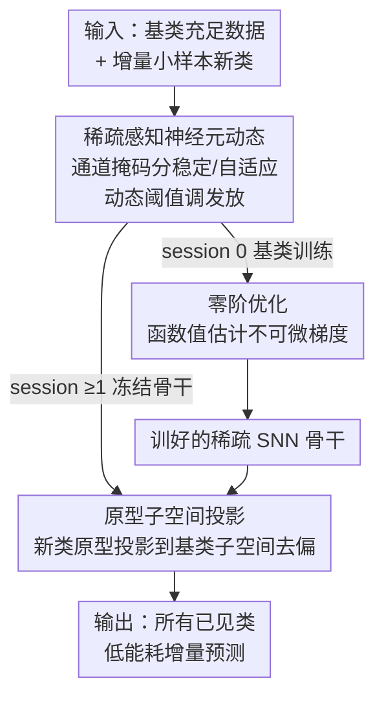

# SAFA-SNN: 面向端侧小样本类增量学习的稀疏感知快速自适应脉冲神经网络

**会议**: ICLR 2026  
**OpenReview**: [https://openreview.net/forum?id=9jcB40wjk3](https://openreview.net/forum?id=9jcB40wjk3)  
**代码**: https://github.com/ZhangHuiJing2020/SAFA-SNN  
**领域**: 模型压缩 / 端侧学习 / 脉冲神经网络 / 类增量学习  
**关键词**: 脉冲神经网络, 小样本类增量, 端侧学习, 动态阈值, 零阶优化

## 一句话总结
本文提出 SAFA-SNN，用「稀疏感知动态阈值 + 零阶优化 + 原型正交子空间投影」三件套，让脉冲神经网络（SNN）能在资源受限的边缘设备上完成小样本类增量学习（FSCIL），在 Mini-ImageNet 最后一个 session 比次优方法高 4.01%，并在 CIFAR-100 上把训练能耗降低约 20%。

## 研究背景与动机
**领域现状**：边缘设备需要在隐私约束和高标注成本下，从持续到来的、样本极少的新类数据里不断学习，这就是端侧小样本类增量学习（on-device FSCIL）。现有 FSCIL 主流做法基本都是基于人工神经网络（ANN）的参数高效微调（PEFT）：冻结一个大的预训练骨干，只在上面微调少量 prompt/参数。

**现有痛点**：这些 ANN 方案在端侧根本跑不动——PEFT 依赖大模型，显存预算动辄 4–12 GB，远超智能设备的内存上限；而 ANN 神经元用稠密浮点乘法通信，端侧内存和算力开销难以承受。另一条线的端侧 SNN 研究又大多绑死在专用神经形态硬件上，且基本是离线训练、部署后静态不变，严重依赖充足的标注数据，没法真正应对边缘的实时增量场景。

**核心矛盾**：FSCIL 本身要在「可塑性（学新类）」与「稳定性（不忘旧类）」之间走钢丝——灾难性遗忘和过拟合两座大山同时压着；而端侧又额外叠加了内存、能耗、推理延迟的硬约束。SNN 事件驱动、只在激活时发放脉冲，天然省电、对神经形态硬件友好，本该是端侧 FSCIL 的理想载体，但「如何用脉冲神经元的发放动态去调控稳定性-可塑性权衡」这件事此前没人探索过。

**本文目标**：做出第一个面向通用端侧 FSCIL 的 SNN 方案，同时解决三件事——(1) 缓解灾难性遗忘；(2) 脉冲激活不可微导致没法反传；(3) 小样本下原型偏置带来的过拟合。

**切入角度**：作者观察到生物神经网络通过不同的脉冲发放动态自然形成不同的「子网络」，于是设想——能不能不去改突触权重、而是调控**神经元的发放阈值**来形成任务特定的子网络？让大多数神经元保持稳定发放（守住旧知识），少数神经元自适应发放（学新类）。

**核心 idea**：用稀疏感知的动态阈值把神经元分成「稳定」和「自适应」两类来天然保护旧类的突触痕迹，用零阶优化绕开脉冲不可微的反传难题，再用原型正交子空间投影矫正小样本新类原型的偏置。

## 方法详解

### 整体框架
SAFA-SNN 建立在 LIF（漏电积分发放）脉冲神经元之上，整个流程分两个阶段：**基类训练阶段**（session 0，数据充足）和**增量推理阶段**（session 1…S，每个 session 都是 N-way K-shot 的小样本）。它要解决的是「同一个轻量 SNN 怎么先在基类上学好、再在端侧只看几个样本就把新类接上、还不忘旧类、还省电」。

三个核心组件分工明确：(a) **稀疏感知神经元动态**贯穿全程，通过通道掩码把神经元划成稳定/自适应两组，用动态阈值控制谁该变、谁该稳；(b) **零阶优化**只在 session 0 的基类训练里用，负责估计脉冲不可微项 $\partial S_t / \partial U_t$ 的梯度，把骨干训练好；(c) **原型子空间投影**只在增量阶段用，此时骨干冻结，只更新分类器原型，把新类原型往基类张成的子空间投影来去偏。三者串成「稀疏感知地训好基类 → 冻结骨干 → 小样本下投影矫正新类原型」的完整链路。

### 关键设计

**1. 稀疏感知神经元动态：用动态阈值在「稳定/自适应」神经元间分配可塑性**

这一设计直击「可塑性-稳定性」权衡。作者不去动突触权重，而是给每个通道随机分配一个掩码 $M=\{m_c\}$，其中 $m_c = \mathbb{1}_{c \le \lfloor \eta C \rfloor}$，$\eta \in (0,1)$ 是自适应比例：少数通道（$m_c=1$）的神经元是「自适应」的，允许阈值大幅变化去学新类；大多数通道是「稳定」的，阈值几乎不动，从而保持与基类训练时一致的发放率，把编码旧知识的突触痕迹自然冻存下来。这呼应了生物上的稳态可塑性规则——稳定神经元维持接近基类训练时的发放频率。

具体地，作者把稀疏度定义为通道级发放率 $r = \frac{1}{|\Omega|}\sum_{(b,t,n)\in\Omega} S(b,t,n)$，并设阈值调节因子
$$A = \beta(1-M) + \gamma M,$$
其中 $\beta > \gamma$ 保证自适应神经元的阈值比稳定神经元变得更自由。阈值按当前任务发放率 $r_c$ 与基类发放率 $r_b$ 的差动态更新：$U'_{th} = U_{th} + A(r_c - r_b)$。当某组神经元发放偏离基类太多，阈值就被推回去抑制不必要的突触更新——这正是「稀疏感知」的含义：让网络只在少数自适应神经元上为新任务腾出可塑性，其余维持稀疏稳定的脉冲模式。

**2. 零阶优化：用函数值估计绕开脉冲不可微的反传**

脉冲激活 $S_t = H(U'_t - U_{th})$ 是 Heaviside 阶跃函数，$\partial S_t / \partial U_t$ 不可微。常规做法是用代理梯度（surrogate gradient, SG）近似，但 SG 与真实梯度偏差大、宽度受限，还容易梯度消失。本文改用零阶优化（ZOO）——一类只靠函数值就能近似梯度的无梯度方法。

它用对称的双点有限差分来估计：令 $u = u_t - u_{th}$，单样本估计为
$$g_2(u; \delta, z) = \frac{H(u+\delta z) - H(u-\delta z)}{2\delta} z = \begin{cases} 0, & |u| > \delta|z| \\ \frac{|z|}{2\delta}, & |u| < \delta|z| \end{cases},$$
即用扰动 $u \pm z\delta$ 是否触发脉冲来判断梯度。再对 $b$ 个 i.i.d. 采样点 $\{z_i\}$ 取平均得到 $\partial S_t / \partial U_t := \frac{1}{b}\sum_{i=1}^{b} g_2(u; \delta, z_i)$，多点平均让估计兼顾各邻域、更稳健。作者还给出收敛性分析：squared gradient norm 的界为 $O(\delta^2 + 1/b)$，收敛上界为 $O(1/\sqrt{T})$，说明在非凸的脉冲优化问题下 ZOO 仍可控收敛。注意 ZOO 只用在 session 0 的基类训练，把骨干训扎实。

**3. 快速自适应原型子空间投影：把小样本新类原型投影到基类子空间去偏**

增量阶段骨干冻结、只更新分类器原型。但小样本新类原型（特征均值）分布窄、易偏，直接用会过拟合并偏向基类。作者提出正交子空间投影分两步矫正：先把归一化后的基类原型 $\tilde{B}$ 构造成一个类协方差的广义逆投影算子
$$G = \tilde{B}(\tilde{B}^\top \tilde{B})^{-1}\tilde{B}^\top,$$
其中归一项 $\tilde{B}^\top\tilde{B}$ 是必要的，因为子空间基不保证彼此正交。把新类原型 $\tilde{C}$ 投影到基类张成的子空间得到 $\tilde{P}_{proj} = \tilde{C}G$，再用凸组合把投影原型与原始原型融合：
$$\tilde{P} = (1-\alpha)\tilde{C} + \alpha\tilde{P}_{proj}.$$
投影幅度越大代表新类与基类的余弦相似度越高、贡献越大，于是矫正后的原型更靠近期望的语义方向、判别性更强。这一步几乎零额外训练成本，正是「fast adaptive」的来源。

### 损失函数 / 训练策略
基类训练的总损失结合了时间误差项（TET）与 MSE：
$$L = (1-\lambda)\frac{1}{T}\sum_{t=1}^{T} L_{CE}(u_t, y) + \lambda L_{MSE}(u_t, y),$$
其中 $T$ 是时间步数，$\lambda$ 平衡时序预测误差项与 MSE 的相对贡献。关键超参：学习率 0.001，$\beta=1.2$，采样数 $b=5$，扰动 $\delta=0.5$；CIFAR-100/Mini-ImageNet 训练 300 epoch（batch 128），神经形态数据集训练 100 epoch。所有实验在 NVIDIA Jetson AGX Orin 上跑、重复三个随机种子。

## 实验关键数据

### 主实验
Mini-ImageNet 上 8 个 5-way 5-shot 增量 session，SAFA-SNN 全程领先：

| 数据集 | 指标 | SAFA-SNN | 次优(CLOSER-SNN) | 提升 |
|--------|------|----------|------------------|------|
| Mini-ImageNet | 末 session Acc | 48.70% | 44.69% | +4.01% |
| Mini-ImageNet | 平均 Acc $A_{avg}$ | 59.45% | 53.38% | +6.07% |
| Mini-ImageNet | 首 session Acc | 74.66% | 65.88% | +8.78% |

在三个神经形态数据集上同样优于 WARP/TEEN：

| 数据集 | 指标 | SAFA-SNN | TEEN | WARP |
|--------|------|----------|------|------|
| CIFAR10-DVS | $A_{last}$ | 36.96% | 34.60% | 12.75% |
| DVS128 Gesture | $A_{last}$ | 77.91% | 74.31% | 13.02% |
| N-Caltech101 | $A_{last}$ | 39.69% | 27.86% | 14.40% |

与 SNN 训练方法对比（Mini-ImageNet, Spiking VGG-9）：SAFA-SNN 参数仅 22.63M（SLTT 为 106.87M），$A_{last}$ 49.25% vs SLTT 32.58%，谐波精度 $A_h$ 24.67% vs 18.93%，参数更小、精度更高。

### 消融实验
逐个验证三组件（SA=稀疏感知动态、ZOO=零阶优化、SP=子空间投影）：

| 配置 | 相对表现 | 说明 |
|------|---------|------|
| SA only | 最低（baseline） | 只有动态阈值，未在特征空间做调整 |
| SA + SP | 显著提升 | 加投影后从基类原型提取更有信息量的特征 |
| 完整 SAFA-SNN (SA+ZOO+SP) | 最高 | 再加 ZOO 做梯度估计，曲线最高 |

### 关键发现
- **SP（子空间投影）贡献最大**：单独的 SA 因为不调整特征空间表现最差，一旦叠加 SP 增量精度大幅跃升，说明小样本下原型去偏是 FSCIL 的关键瓶颈。
- **能耗与效率优势实打实**：Jetson Orin 实测训练能耗 SAFA-SNN（Spiking ResNet20）约 12624 J，比基线（约 15752 J）低约 20%；训练时间在各 Spiking VGG 上也优于基线，因为它不改突触权重、不调参数空间。
- **稀疏度高且稳健**：即便时间步 $T=2,3,4$，发放稀疏度仍可达 80%，在稀疏性与精度间取得平衡，印证了计算效率潜力。
- **shot 数越多越好但边际递减**：在 DVS128 Gesture/CIFAR10-DVS 上从 1-shot 到 50-shot 精度持续上升，验证方法对样本量的鲁棒性。

## 亮点与洞察
- **"不动权重、只调阈值"的子网络观**：把可塑性-稳定性权衡从「冻结/训练突触权重」转移到「调控神经元发放阈值」，是 SNN 独有、ANN 没有的杠杆——通道掩码让大多数神经元稳定守旧、少数自适应学新，省去了改权重的开销，天然契合端侧低功耗诉求。
- **用零阶优化替代代理梯度**：这是把 ZOO 引入 SNN 端侧训练的一次有意思的尝试，绕开了 SG 宽度受限、梯度消失的老问题，且只在基类训练用、不增加增量阶段成本，还附带了收敛性证明，比纯工程 trick 更扎实。
- **原型子空间投影几乎零成本去偏**：用基类原型张成的广义逆投影算子 $G$ 把新类原型拉回语义方向，只是矩阵运算、不需训练，特别适合「小样本 + 端侧 + 快速适应」三重约束的场景，这个思路可迁移到任意基于原型的小样本增量分类器。

## 局限与展望
- **深层网络退化**：作者承认在 Spiking ResNet-34 这类更深网络上会因恒等映射失效而性能下降，建议用 SEW 式残差连接缓解。
- **固定 way-shot 假设过于理想**：每个 session 固定类数简化了真实数据流，未来需处理类别不平衡的 way-shot 设置。
- **与 ANN-PEFT 仍有精度差**：ANN-based PEFT 方法（其骨干在 ImageNet-1K 预训练）精度略高，SAFA-SNN 主打的是效率与可部署性而非绝对精度上限——这是个明确的定位取舍，读者需注意它不是在同等算力下全面超越 ANN。
- 神经元稳定/自适应的划分是**随机通道掩码**，是否有更优的、基于重要性的划分策略值得探索。

## 相关工作与启发
- **vs CLOSER / TEEN（ANN-based FSCIL 的 SNN 版）**: 它们沿用原型分类器 + 冻结骨干的范式但缺乏脉冲层面的稳定性调控，本文用稀疏感知动态阈值在神经元发放层面保护旧知识，末 session 精度高 4.01%。
- **vs 代理梯度（SG）训练的 SNN**: SG 用固定宽度近似不可微脉冲、易梯度消失；本文用零阶优化只靠函数值估计梯度，且给出收敛界，理论更稳。
- **vs 端侧 SNN（如 Lite-SNN、SNN 剪枝/量化）**: 它们聚焦推理压缩或绑定专用硬件、多为离线静态部署；本文同时支持基类批训练与增量推理，覆盖真正动态的端侧 FSCIL 场景。
- **vs 子空间正则方法（WARP、Subspace-reg）**: 这类方法做空间压缩获取参数表示，本文的正交子空间投影专门矫正小样本原型偏置，在 ResNet 骨干下多数情况持续领先。

## 评分
- 新颖性: ⭐⭐⭐⭐⭐ 首个面向通用端侧 FSCIL 的 SNN 方案，"调阈值形成子网络 + ZOO + 原型投影"组合很新
- 实验充分度: ⭐⭐⭐⭐⭐ 5 个数据集、多种 Spiking 骨干、真机能耗/时间实测 + 完整消融
- 写作质量: ⭐⭐⭐⭐ 方法清晰、公式完整，但大量细节推到附录，正文略紧凑
- 价值: ⭐⭐⭐⭐ 端侧低功耗增量学习有明确落地场景，能耗-20% 的实测很有说服力

<!-- RELATED:START -->

## 相关论文

- [\[ICLR 2026\] TP-Spikformer: Token Pruned Spiking Transformer](tp-spikformer_token_pruned_spiking_transformer.md)
- [\[ICLR 2026\] Study of Training Dynamics for Memory-Constrained Fine-Tuning (TraDy)](study_of_training_dynamics_for_memory-constrained_fine-tuning.md)
- [\[ICLR 2026\] SMixer: Rethinking Efficient-Training and Event-Driven SNNs](smixer_rethinking_efficient-training_and_event-driven_snns.md)
- [\[ICLR 2026\] Fine-tuning Quantized Neural Networks with Zeroth-order Optimization](fine-tuning_quantized_neural_networks_with_zeroth-order_optimization.md)
- [\[ICLR 2026\] TurboBoA: Faster and Exact Attention-aware Quantization without Backpropagation](turboboa_faster_and_exact_attention-aware_quantization_without_backpropagation.md)

<!-- RELATED:END -->
