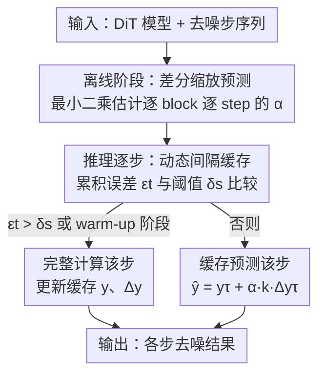

# ScalingCache: Extreme Acceleration of DiTs through Difference Scaling and Dynamic Interval Caching

**会议**: ICLR 2026  
**OpenReview**: [https://openreview.net/forum?id=uXmbrTlko7](https://openreview.net/forum?id=uXmbrTlko7)  
**代码**: https://github.com/KlingAIResearch/ScalingCache  
**领域**: 模型压缩 / 扩散模型加速  
**关键词**: 扩散 Transformer、特征缓存、免训练加速、差分缩放、动态缓存间隔

## 一句话总结
ScalingCache 是一个免训练的 DiT 推理加速框架，通过离线估计「差分缩放系数 $\alpha$」自适应融合零阶（直接复用）与一阶（线性外推）缓存特征，再配合运行时的动态缓存间隔策略，在 Wan2.1、HunyuanVideo 上实现约 2.5× 加速、VBench 仅掉 0.5%，在 FLUX 上做到 3.1× 近无损加速。

## 研究背景与动机
**领域现状**：Diffusion Transformer（DiT）已成为视频/图像生成的主流架构，但其迭代去噪 + 深层 transformer 块的结构带来巨大算力开销，生成几秒视频往往要几分钟。免训练加速里最常用的一类是「特征缓存」——利用相邻去噪步之间特征的时间相似性，跳过某些步的完整计算而复用之前算好的激活。

**现有痛点**：特征缓存天生是有损的，而专业级视频生成要求近无损。问题集中在两个核心追问：**怎么用缓存**和**什么时候用缓存**。对前者，最朴素的做法是直接复用上一步缓存特征 $y^{(0)}$，但随时间距离增大特征相似度迅速衰减，误差爆炸；改进版如 Taylorseer 用一阶差分线性外推 $y^{(1)}$，但只靠一阶差分不足以刻画特征的动态变化，而提高 Taylor 展开阶数对最终质量提升甚微、却让缓存的读写和存储开销暴涨。对后者，按固定间隔重算特征过于死板，无法适应模型在不同去噪阶段的动态行为；现有动态策略（TeaCache、EasyCache）又往往只看第一个 block 的输入和最后一个 block 的输出，忽略了中间各 block 的动态。

**核心矛盾**：缓存预测的精度与计算节省存在 trade-off——纯复用够快但误差大，高阶外推够准但缓存膨胀；固定间隔省心但不自适应，已有动态调度又只看首尾 block。

**切入角度**：作者观察到一个关键现象（论文 Figure 1）——对**某些特定的 block 在特定的去噪步**，直接复用零阶特征 $y^{(0)}$ 反而比一阶外推 $y^{(1)}$ 离完整计算更近。这说明零阶和一阶各有适用区域，**逐 block、逐 step 地自适应混合**两者，比一刀切地只用其一更优。

**核心 idea**：给一阶外推项乘上一个离线学好的、逐 block 逐 step 的「差分缩放系数 $\alpha$」来自适应混合零阶与一阶预测；同时在推理时根据累积误差动态决定缓存间隔，只在误差超阈值时才触发完整计算。

## 方法详解

### 整体框架
DiT 模型可记为 $M = B_1 \circ B_2 \circ \cdots \circ B_L$，每个 block $B_l$ 含自注意力、交叉注意力、FFN 三个带残差的模块，给定输入 $x_t^l$，输出记为 $y_t^l$。ScalingCache 的目标是：在去噪过程中尽量跳过完整 block 计算、用缓存预测代替，同时把预测误差压到近无损。它由两个互补模块组成——**差分缩放预测**回答「缓存怎么用」（用更准的预测公式逼近完整计算），**动态间隔缓存**回答「缓存什么时候用」（自适应决定哪些 step 跳过、哪些 step 重算）。前者的 $\alpha$ 在离线阶段用约 20–50 条 prompt 一次性算好，推理时零额外开销；后者在推理时根据每一步的相对误差在线调度。

### 关键设计

**1. 差分缩放预测：用离线学的 $\alpha$ 自适应混合零阶与一阶缓存**

针对「只靠一阶差分不足以刻画动态、提高 Taylor 阶数又让缓存爆炸」这个痛点。Taylorseer 的一阶外推公式是 $y_t'^l = y_\tau^l + \frac{k}{T}(y_\tau^l - y_{\tau-T}^l)$，其中 $\tau = t-k$ 是最近一次完整计算步，$\Delta y_\tau^l = (y_\tau^l - y_{\tau-T}^l)/T$ 是特征平均变化率。作者基于「某些 block-step 上零阶复用比一阶外推更准」的观察，给一阶项加一个缩放系数，改写为：

$$\hat{y}_t^l = y_\tau^l + \alpha_t^l\, k\, \Delta y_\tau^l$$

当 $\alpha_t^l \to 0$ 时退化为零阶复用，$\alpha_t^l \to 1$ 时还原成一阶外推，中间值则是两者的连续混合。$\alpha_t^l$ 通过离线最小二乘求解——最小化预测与完整计算输出的差距 $\min_{\alpha_t^l} \|y_\tau^l - y_t^l + \alpha_t^l k \Delta y_\tau\|$。在 $k=1, T=1$ 时有闭式解：

$$\alpha_t^l = \frac{\langle y_{t-1}^l - y_t^l,\ -\Delta y_{t-1}^l\rangle}{\langle \Delta y_{t-1}^l,\ \Delta y_{t-1}^l\rangle}$$

为提升稳定性和泛化，$\alpha$ 用指数滑动平均更新 $\alpha_t^l \leftarrow \beta\, \alpha_t'^l + (1-\beta)\alpha_t^l$（$\beta=0.97$，约 50 条 prompt 离线预计算）。由于两次完整计算之间缩放因子不同，$\Delta y_\tau$ 的跨步估计还要按各步 $\alpha$ 做加权累乘修正。这套机制的好处是：只需每个模块存「缓存特征 $y_{t-1}^l$ + 特征差分 $\Delta y_{t-1}^l$」两个张量（不像高阶 Taylor 要存一堆），却拿到比纯一阶更准的预测，且离线算 $\alpha$ 对在线推理零开销。

**2. 运行时动态间隔缓存：按累积误差自适应决定何时重算**

针对「固定缓存间隔不自适应、已有动态调度只看首尾 block」这个痛点。作者发现缓存预测误差呈 **U 形**——去噪中段误差低、首尾误差大，所以静态间隔要么在中段浪费算力、要么在首尾累积误差。于是定义每一步对**所有 block** 的平均相对误差：

$$\bar{e}_t = \frac{1}{L}\sum_{l=1}^{L}\left\|\frac{y_t^l - y_{t-1}^l}{y_{t-1}^l}\right\|_1$$

再定义从上次完整计算到当前步的累积误差 $\epsilon_t = \sum_{i=\tau}^{t-1}\bar{e}_t$。更新规则是：若 $\epsilon_t > \delta_s$ 或处于 warm-up 阶段 $t \in [0, S_f-1]$，就做完整计算（捕捉早期快速变化的特征）；否则用 $\hat{y}_t^l = y_{t-1}^l + \alpha_t^l \Delta y_{t-1}^l$ 缓存预测。其中阈值 $\delta_s$ 不是固定的，而是用前 $S_f$ 步的误差在线估计、维护一个累积误差集合 $E$ 来动态求 $\delta_s = \frac{1}{|E|}\sum_{\epsilon\in E}\epsilon$。这样高变化视频自动得到更小的 $\delta_s$（更保守、多重算）、慢变化视频得到更大的 $\delta_s$（更激进、更高加速比）。关键区别在于：它用的是**全 block 平均误差**而非只看首尾 block，因此能在稳定区段激进复用、在快变区段保守更新，且整套策略只需用户指定一个超参 $S_f$。

### 损失函数 / 训练策略
方法完全免训练，无任何参数微调。唯一的「学习」是离线最小二乘求 $\alpha$：用约 20 条 prompt（每条 5 个随机种子）离线计算，$\beta=0.97$ EMA 平滑。推理时唯一需要指定的超参是 warm-up 步数 $S_f$，按目标加速比调节（$S_f \le 14$ 时各模型均可达 2.0× 以上端到端加速）。

## 实验关键数据

### 主实验
在 Wan2.1（1.3B / 14B）、HunyuanVideo 三个文生视频模型（prompt-enhanced VBench）和 FLUX 1.dev 文生图上评测。

| 模型 | 方法 | Speedup | PSNR↑ | SSIM↑ | LPIPS↓ | 质量分↑ |
|------|------|---------|-------|-------|--------|---------|
| Wan2.1 1.3B | Taylorseer | 1.9× | 13.52 | 0.510 | 0.447 | 81.97 (VBench) |
| Wan2.1 1.3B | EasyCache | 2.5× | 25.24 | 0.834 | 0.095 | 82.48 |
| Wan2.1 1.3B | **ScalingCache** | 2.5× | **26.61** | **0.890** | **0.071** | **82.92** |
| Wan2.1 14B | MixCache | 1.8× | 23.45 | 0.814 | 0.124 | 83.97 |
| Wan2.1 14B | **ScalingCache** | **2.5×** | **25.63** | **0.861** | **0.083** | 83.87 |
| HunyuanVideo | EasyCache | 2.2× | 29.20 | 0.904 | 0.063 | 80.69 |
| HunyuanVideo | **ScalingCache** | 2.3× | **30.80** | **0.930** | **0.049** | **81.13** |
| FLUX 1.dev | Taylorseer3 | 2.8× | 30.76 | 0.780 | 0.230 | 80.17 (CLIP) |
| FLUX 1.dev | **ScalingCache** | **3.1×** | **32.28** | **0.819** | **0.131** | 80.25 |

在相近加速比下，ScalingCache 的 LPIPS 比此前 SOTA 在图像任务上降低 45%、视频任务上降低 20–30%。FLUX 人类偏好测试中，加速生成与原始输出被选中比例接近（44.4% vs 55.2%），优于 Taylorseer（67.2% vs 32.2%）。

### 消融实验
在 FLUX 1.dev 与 Wan2.1 1.3B 上分别拆解差分缩放 $\alpha$ 与动态缓存间隔的贡献。

| 模型 | $\alpha$ | 动态间隔 | Speedup | PSNR↑ | SSIM↑ | LPIPS↓ |
|------|---------|---------|---------|-------|-------|--------|
| FLUX 1.dev | ✗ | ✗ | 2.9× | 29.15 | 0.652 | 0.324 |
| FLUX 1.dev | ✓ | ✗ | 2.9× | 29.83 | 0.701 | 0.259 |
| FLUX 1.dev | ✗ | ✓ | 2.6× | 31.04 | 0.772 | 0.192 |
| FLUX 1.dev | ✓ | ✓ | 3.0× | **32.28** | **0.819** | **0.131** |
| Wan2.1 1.3B | ✗ | ✗ | 2.4× | 24.53 | 0.857 | 0.092 |
| Wan2.1 1.3B | ✓ | ✓ | 2.5× | **26.61** | **0.890** | **0.071** |

### 关键发现
- 两个模块缺一不可：单独加 $\alpha$ 主要提质量（LPIPS 0.324→0.259），单独加动态间隔主要提质量+小幅让出速度（LPIPS→0.192），二者协同才在 3.0× 加速下拿到最佳 LPIPS 0.131。
- $\alpha$ 跨任务稳定：在 Wan2.1-1.3B 的 8 个子任务上，绝大多数子任务的 $\alpha$ 偏离全局均值不超过 2.5%（$|\alpha_i - \bar\alpha|$ 多在 0.006–0.022），说明离线估计的 $\alpha$ 可跨 prompt/任务泛化；随机采样子集算出的 $\alpha$ 偏差最小，故推荐用多样化 prompt 估计。
- $\alpha$ 收敛快：约 20 条 prompt 即可让 SA/CA/FFN 各模块的均值 $\alpha$ 收敛，方差小。
- 只有 $S_f$ 一个旋钮：$S_f \le 14$ 时各模型端到端加速均超 2.0×，按需调大可换更高加速比。

## 亮点与洞察
- **「零阶其实有时更好」这个反直觉观察**很关键：大家默认一阶外推总比直接复用准，但作者用 Figure 1 证明存在大量 block-step 上零阶更优，从而把「二选一」变成「用 $\alpha$ 连续插值」，一个标量就把两种 baseline 统一了。
- **把昂贵的拟合搬到离线**：$\alpha$ 用最小二乘 + EMA 离线算好，推理零开销，避开了 TeaCache/AdaCache 那种在线 profiling 或相似度计算的额外成本——这是「既要自适应又要不掉速」的巧解。
- **动态阈值看全 block 而非只看首尾**：用全 block 平均相对误差 $\bar e_t$ 驱动缓存决策，比只看第一/最后一个 block 的已有动态方法更能反映中间层动态，且 $\delta_s$ 还能按视频变化剧烈程度自动收紧/放松。
- 这套「离线学逐位置混合系数 + 在线按累积误差调度」的思路可迁移到其他迭代推理加速场景（如 U-Net 扩散、自回归 KV 缓存的跳算）。

## 局限与展望
- 离线 $\alpha$ 虽跨任务稳定，但仍依赖一组代表性 prompt；面对与离线分布差异极大的生成内容（如极端运动、罕见风格），$\alpha$ 是否仍最优值得验证（论文已显示高变化样本需更小 $\delta_s$，暗示存在边界）。
- 缓存需每模块存 $y$ 与 $\Delta y$ 两个张量，额外显存/读写开销在超大模型上的占比论文放在附录 G，正文未充分量化主结果中的内存代价。
- 动态间隔依赖前 $S_f$ 步估计 $\delta_s$，warm-up 阶段必须完整计算，对极短去噪步数（如蒸馏后的少步模型）收益空间会被压缩。
- 方法定位为免训练加速器，未与训练型蒸馏方法在同等加速比下直接对比绝对质量上限。

## 相关工作与启发
- **vs Taylorseer**：Taylorseer 靠高阶 Taylor 展开做 block 级特征预测，但提阶对质量提升有限、缓存读写/存储开销随阶数暴涨；ScalingCache 只用一阶差分 + 一个离线标量 $\alpha$，存储仅两个张量，质量反超（FLUX 上 3.1× vs Taylorseer 2.8×、LPIPS 0.131 vs 0.230）。
- **vs TeaCache / EasyCache**：它们的动态调度只基于第一个 block 输入和最后一个 block 输出，忽略中间 block 动态；ScalingCache 用全 block 平均相对误差驱动决策，并按视频变化程度自适应阈值 $\delta_s$。
- **vs ∆-DiT / ToCa 系列**：同属 delta/动态修正缓存路线，但 ScalingCache 把「怎么用缓存」（差分缩放）和「何时用缓存」（动态间隔）解耦成两个互补模块，并显式给出零阶/一阶融合的闭式 $\alpha$。
- **vs DeepCache / Faster Diffusion**：这些为 U-Net 设计，结构假设难直接搬到各向同性的 DiT；本文是 DiT 专用缓存机制。

## 评分
- 新颖性: ⭐⭐⭐⭐ 「零阶有时优于一阶」的观察 + 离线标量 $\alpha$ 统一两种预测，简洁且反直觉
- 实验充分度: ⭐⭐⭐⭐⭐ 覆盖 4 个主流模型、文生图+文生视频、含人类偏好、消融与跨任务稳定性分析
- 写作质量: ⭐⭐⭐⭐ 动机推导清晰，公式与算法完整，但部分图表说明依赖附录
- 价值: ⭐⭐⭐⭐⭐ 免训练、零额外推理开销、单超参，工程落地性强（已开源，KlingAI 出品）

<!-- RELATED:START -->

## 相关论文

- [\[ICLR 2026\] RAPID$^3$: Tri-Level Reinforced Acceleration Policies for Diffusion Transformer](rapid3_tri-level_reinforced_acceleration_policies_for_diffusion_transformer.md)
- [\[ICLR 2026\] Plug-and-Play Fidelity Optimization for Diffusion Transformer Acceleration via Cumulative Error Minimization](plug-and-play_fidelity_optimization_for_diffusion_transformer_acceleration_via_c.md)
- [\[ICLR 2026\] Inconsistency Biases in Dynamic Data Pruning](inconsistency_biases_in_dynamic_data_pruning.md)
- [\[ICLR 2026\] SeeDNorm: Self-Rescaled Dynamic Normalization](seednorm_self-rescaled_dynamic_normalization.md)
- [\[AAAI 2026\] Can You Tell the Difference? Contrastive Explanations for ABox Entailments](../../AAAI2026/model_compression/can_you_tell_the_difference_contrastive_explanations_for_abox_entailments.md)

<!-- RELATED:END -->
