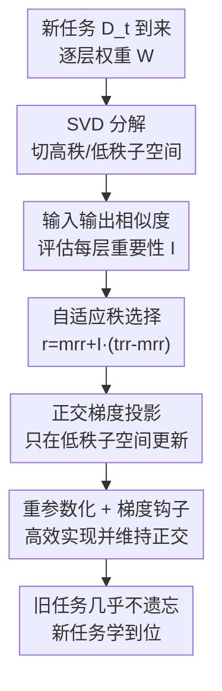

# Sculpting Subspaces: Constrained Full Fine-Tuning in LLMs for Continual Learning

**会议**: ICLR 2026  
**OpenReview**: [https://openreview.net/forum?id=vQcyqsGJDw](https://openreview.net/forum?id=vQcyqsGJDw)  
**代码**: https://github.com/Red-Hat-AI-Innovation-Team/mini_trainer (有)  
**领域**: 模型压缩 / 持续学习 / 参数高效微调  
**关键词**: 持续学习, 灾难性遗忘, SVD, 正交梯度投影, 参数高效微调

## 一句话总结
本文提出 OSFT（Orthogonal Subspace Fine-Tuning）：对每层权重做 SVD，把大奇异值对应的"高秩子空间"当作旧知识冻结，只在与之正交的"低秩子空间"里做全参数更新，从而在固定参数量、不存任务梯度的前提下持续学新任务，几乎不遗忘旧任务——在 15 任务基准上比 O-LoRA 高 1.7 个点，在 TRACE 上平均准确率高出约 7 个点。

## 研究背景与动机

**领域现状**：大模型部署到真实场景时要不断学新任务（新产品、新法规、新术语），但全参数顺序微调会带来灾难性遗忘——学了新任务，旧任务性能断崖式下跌。为缓解这点，主流走两条路：一是参数高效微调（PEFT，如 Adapter / LoRA），冻结底座只训少量新参数；二是约束更新方向的方法（如 EWC 的正则、O-LoRA / GPM 的梯度投影）。

**现有痛点**：PEFT 路线的参数预算受限，表达力被锁死，而且持续学习时要么每个任务堆一组新模块（参数随任务数线性膨胀），要么需要复杂的合并策略；正则类方法（EWC）只是"软约束"，用对角 Hessian 近似抓不住损失曲面真实的非对角曲率，只能减缓而不能阻止遗忘；基于激活的梯度投影（GPM / SGP）则要为每个任务累积激活子空间基，内存随任务数线性增长，对十亿参数级 LLM 根本不现实。

**核心矛盾**：可塑性（plasticity，学新任务的能力）与稳定性（stability，记住旧任务）之间的 trade-off。现有方法要么牺牲表达力（固定 adapter），要么浪费参数（全微调），要么内存不可控（激活投影），没法同时拿到"全参数表达力 + 固定内存 + 强抗遗忘"。

**切入角度**：作者抓住一个被忽略的事实——**并非所有参数方向都同等重要**。已有工作（Sharma et al. 2023）表明神经网络权重矩阵存在大量冗余，小奇异值对应的方向对模型行为贡献极小；而大奇异值方向往往编码关键知识。于是这些"沉睡"的低奇异值方向就可以被回收，拿去学新任务，同时保护住高奇异值方向。

**核心 idea**：对每层权重做 SVD，把更新**投影到与高奇异值方向正交的低秩子空间**里——用全参数更新的表达力，但只动那些不承载旧知识的方向，让新任务的梯度对旧知识"穿不透"。

## 方法详解

### 整体框架

OSFT 要解决的是"持续学新任务又不忘旧任务"。它的核心转换是：把"该不该更新某个参数"重新表述成"该往哪个方向更新"——对每层权重矩阵 $W^{(l)}$ 做一次 SVD，按奇异值大小切成高秩（旧知识）和低秩（可回收容量）两块，再把每一步梯度严格约束在低秩子空间内、与高秩子空间正交。

整个流程是：每来一个新任务，先对每层权重做 SVD；再用上一任务的数据算每层的"输入输出相似度"来评估该层有多重要；据此自适应决定每层冻结多少个奇异向量（重要层多保护、不重要层多放开）；最后训练时把梯度投影掉落在高秩子空间里的分量，保证更新只发生在正交的低秩方向上。整个过程参数量固定，不存任何任务相关的梯度或激活基。

### 关键设计

**1. SVD 切分高秩/低秩子空间：把"旧知识"和"可回收容量"在权重里分开**

这一步针对的痛点是：以往方法要么粗暴冻结整块权重（牺牲可塑性），要么不知道哪些参数承载旧知识。OSFT 对每层权重做 $W^{(l)} = U^{(l)} \Sigma^{(l)} (V^{(l)})^\top$，奇异值降序排列。大奇异值对应的方向被视为编码关键旧知识的"高秩子空间"，需要保护；小奇异值对应的"低秩子空间"贡献极小、可以安全回收来学新任务。这个切分是整个方法的地基——它把抽象的"稳定性 vs 可塑性"落到了奇异值这个可计算、可排序的量上。理论上作者用损失曲面的二阶 Taylor 展开论证：保护最大 Hessian 特征值（最大曲率方向）能最有效地抑制遗忘，而 Haink (2023) 的经验证据表明 Hessian 最大特征值与权重最大奇异值高度相关，于是"冻结高奇异值方向"就近似等于"冻结高曲率方向"，省掉了直接算 Hessian 的天价开销。SVD 每任务每层只算一次，相比全模型训练开销可忽略。

**2. 输入输出相似度驱动的自适应秩分配：让每层按功能角色决定保护多少**

固定秩投影（所有层都冻结前 $k$ 个奇异向量）忽略了层与层之间的异质性，要么过度保护（伤可塑性）、要么保护不足（致遗忘）。OSFT 借鉴 AdaSVD，用层输入激活 $X^{(l)}$ 与线性输出 $Y^{(l)} = W^{(l)} X^{(l)}$ 之间的余弦相似度来量化层重要性：

$$I^{(l)} = \frac{1}{N} \sum_{i=1}^{N} \text{cosine\_similarity}(X^{(l)}_i, Y^{(l)}_i)$$

相似度高说明该层主要"保持"而非"变换"表示（如前段注意力层），是稳定传播信息的关键，应多保护；相似度低的层（如末端 MLP）主要在变换表示，可多放开容量去学新任务。重要性分数归一化到层均值为 1（负值先截断到 0）。据此每层保留的奇异向量比例为：

$$r^{(l)}_{\text{frac}} = \text{mrr} + I^{(l)}(\text{trr} - \text{mrr})$$

其中 mrr（最小保留率，保证最不重要的层也留一点底）和 trr（目标保留率，最关键层的上界）是两个超参，实测 $\text{mrr}=0.1$、$\text{trr}=0.8$ 稳健；保留数为 $k^{(l)} = \lfloor r^{(l)}_{\text{frac}} \cdot \min(d^{(l)}_O, d^{(l)}_I) \rfloor$。方法对超参不敏感（±0.05 扰动准确率变化 <1%），但保留太激进会显著掉点。这个设计的价值在于：它让模型按每层的功能角色自动在稳定性和可塑性之间分配预算，而不是一刀切。

**3. 低秩子空间内的正交梯度投影：给旧知识筑一道"穿不透"的墙**

确定了每层要冻结的高秩基 $U^{(l)}_{\text{high}}$、$V^{(l)}_{\text{high}}$ 后，OSFT 把每步梯度落在高秩子空间里的分量减掉，强制更新严格正交于被保护的方向：

$$\nabla W^{(l)}_{\text{proj}} = \nabla W^{(l)} - U^{(l)}_{\text{high}} \left( (U^{(l)}_{\text{high}})^\top \nabla W^{(l)} V^{(l)}_{\text{high}} \right) (V^{(l)}_{\text{high}})^\top$$

直观说，这一步把梯度中"会动到旧知识方向"的部分挖掉，只留下落在低秩子空间里的更新。与 O-LoRA 的软正则（只是惩罚、不能完全防止干扰）相比，这是硬约束；与 GPM/SGP 基于激活构造子空间相比，OSFT 直接对权重做 SVD，只存当前权重的奇异向量，内存开销是常数、不随任务数增长——这正是它能用到十亿参数 LLM 上的关键，也是首个在十亿参数级别验证的权重-SVD 投影方法。

**4. 重参数化 + 梯度钩子：高效实现并防止子空间漂移**

直接对完整权重梯度做投影虽然可行，但更优雅高效的做法是重参数化。OSFT 在 SVD 后把权重替换成它的 SVD 分量：高秩分量 $(U^{(l)}_{\text{high}}, \Sigma^{(l)}_{\text{high}}, V^{(l)}_{\text{high}})$ 注册为冻结 buffer（不可训），低秩分量 $(U^{(l)}_{\text{low}}, \Sigma^{(l)}_{\text{low}}, V^{(l)}_{\text{low}})$ 注册为可训练参数；前向时实时重建完整权重 $W = W_{\text{high}} + W_{\text{low}}$，反向只对低秩分量算梯度。但只训低秩分量会让它的基向量逐渐"漂移"、失去与冻结高秩基的正交性，于是作者给可训练参数挂一个梯度钩子（gradient hook）：每次算出梯度（如 $\nabla U^{(l)}_{\text{low}}$）后，钩子把它投影到与高秩基正交，作为一道维护步骤，保证整个训练过程中子空间的数学完整性。这个工程设计让正交约束既省算力又始终成立。

### 损失函数 / 训练策略
没有引入额外正则项，训练目标就是各任务标准的微调损失；"约束"完全体现在梯度投影和重参数化上，因此参数量固定、无需存任务梯度。SVD 每任务每层只算一次，是主要额外开销。实验在 T5-Large、LLaMA-2 7B、Mistral-7B 上验证，按标准协议对随机打乱的任务序列跑三次取平均。

## 实验关键数据

### 主实验

T5-Large 上的标准持续学习基准（平均准确率 %，越高越好），15 任务场景最能体现长序列下的抗遗忘能力：

| 基准 | 指标 | OSFT | O-LoRA (SOTA) | 提升 |
|------|------|------|----------|------|
| 5-Task CL | 平均 AA | 75.9 | 75.8 | +0.1 |
| 15-Task CL | 平均 AA | 71.3 | 69.6 | +1.7 |

TRACE 基准（LLaMA-2-7B-Chat，8 个指令微调任务），同时看平均准确率 AA 和反向迁移 BT（越接近 0 越不遗忘）：

| 方法 | AA (%) | BT (%) |
|------|--------|--------|
| SeqFT | 23.0 | -8.3 |
| O-LoRA | 41.3 | -6.2 |
| **OSFT (ours)** | **48.4** | -7.1 |
| PerTaskFT（上界） | 57.6 | NA |
| MTL（上界） | 52.3 | NA |

OSFT 在 TRACE 上平均准确率比 O-LoRA 高约 7 个点，在 Pareto 前沿上占优（同时在"学得好"和"忘得少"两个轴上领先），且只用约 56% 的有效可训练秩。

### 通用能力与安全保持

| 模型 | MMLU | GSM | BBH | TydiQA | BoolQA | PIQA |
|------|------|-----|-----|--------|--------|------|
| Base Instruct | 46.6 | 26.1 | 40.2 | 23.5 | 70.5 | 76.2 |
| OSFT (ours) | 47.7 | 7.7 | 34.2 | 35.8 | 76.6 | 77.6 |

指令遵循与安全的 Win/Tie/Lose（对比 LLaMA-2-7B-Chat 底座）：OSFT 指令遵循 Win 24 / Tie 56 / Lose 20，安全 Win 18 / Tie 78 / Lose 4，明显优于 Replay、SeqFT 等基线（它们 Lose 比例普遍超过 50%）。

### 关键发现
- **长序列优势更明显**：5 任务上 OSFT 与 O-LoRA 几乎打平，但 15 任务上拉开到 +1.7 点，说明硬正交约束在任务越多、累积干扰越大的场景下越有用。
- **正向迁移**：在 TRACE 的 NumGLUE-cm 与 NumGLUE-ds 这类相关任务上，学了后一个任务反而让前一个任务准确率上升，说明约束更新不仅防遗忘还能促进相关任务间的知识共享。
- **推理能力是普遍短板**：GSM8K（数学推理）在持续学习后掉得厉害（26.1→7.7），但这是 TRACE 里所有方法的通病（缺乏 CoT 监督所致），可叠加思维链增强来缓解，不是 OSFT 独有的问题。
- **超参鲁棒**：mrr/trr 在 ±0.05 范围内扰动准确率变化 <1%，但保留过于激进会显著掉点。

## 亮点与洞察
- **把"该不该更新"换成"往哪个方向更新"**：不冻结整块权重，而是冻结权重里的高奇异值方向、放开低奇异值方向，从而保住全参数更新的表达力又不伤旧知识——这是比 LoRA"加模块"更本质的思路。
- **权重 SVD 替代激活 SVD，换来常数内存**：GPM/SGP 要为每个任务存激活子空间基、内存线性增长，OSFT 只存当前权重的奇异向量，内存固定，这才让它能跑到十亿参数级别。
- **理论与工程都接地气**：用 Hessian 曲率论证"冻高奇异值=冻高曲率"，又用权重奇异值近似 Hessian 特征值绕开天价计算；工程上用重参数化 + 梯度钩子让正交约束既省算力又始终成立。
- **可迁移**：这种"按奇异值分高低秩子空间、把更新约束到正交补"的范式，可迁移到任何需要边学边保护已有能力的场景（如领域自适应、多任务增量部署）。

## 局限与展望
- **推理能力退化未解决**：数学推理（GSM8K）大幅下降，作者承认需叠加 CoT 等显式推理监督才能缓解，OSFT 本身不能保护这类能力。
- **依赖 SVD 与重参数化**：每任务每层要做 SVD 并重参数化权重，对超大模型仍有一次性开销；论文把详细的计算/内存分析放在附录，正文未充分展开真实墙钟时间。
- **超参需小网格搜**：mrr/trr 虽不敏感，但仍建议在第一个任务上做小范围网格搜索，未完全免调参。
- **重要性度量的选择**：用输入输出余弦相似度衡量层重要性是经验选择，作者也提到 CKA 等替代方案是自然扩展，说明这个度量未必最优。

## 相关工作与启发
- **vs O-LoRA**：O-LoRA 在低秩适配器上加软正交正则，只能减缓遗忘且受低秩预算限制；OSFT 做全参数更新、硬正交投影，长序列下抗遗忘更强（15 任务 71.3 vs 69.6）。
- **vs MiLoRA / PiSSA**：MiLoRA 同样只更新低奇异值分量（OSFT 与它结构最近），但 OSFT 额外用正交子空间投影约束梯度留在保留子空间的补集里，且按层用输入输出相似度自适应选秩，而非全局固定秩；PiSSA 则相反地去更新高奇异值分量。
- **vs GPM / SGP**：同属梯度投影，但 GPM/SGP 对激活做 SVD、内存随任务线性增长，OSFT 对权重做 SVD、内存恒定，且是首个在十亿参数 LLM 上验证的权重-SVD 投影方法。
- **vs EWC**：EWC 用对角 Hessian 近似惩罚重要权重变化，抓不住非对角曲率，保留效果差；OSFT 用奇异值近似高曲率方向并硬约束，更原则化。

## 评分
- 新颖性: ⭐⭐⭐⭐ 把权重 SVD + 自适应秩 + 正交投影组合成常数内存的全参数持续学习，思路清晰且首次上十亿参数。
- 实验充分度: ⭐⭐⭐⭐ 覆盖三种模型、三个基准、通用能力/安全/指令遵循全测，但部分对比放在附录。
- 写作质量: ⭐⭐⭐⭐ 动机与方法推导扎实，理论论证与工程实现都交代清楚。
- 价值: ⭐⭐⭐⭐ 为 LLM 持续学习给出实用、可扩展、参数固定的方案，工程落地性强。

<!-- RELATED:START -->

## 相关论文

- [\[ICLR 2026\] IDER: IDempotent Experience Replay for Reliable Continual Learning](ider_idempotent_experience_replay_for_reliable_continual_learning.md)
- [\[ICLR 2026\] Study of Training Dynamics for Memory-Constrained Fine-Tuning (TraDy)](study_of_training_dynamics_for_memory-constrained_fine-tuning.md)
- [\[ICLR 2026\] LoFT: Low-Rank Adaptation That Behaves Like Full Fine-Tuning](loft_low-rank_adaptation_that_behaves_like_full_fine-tuning.md)
- [\[ICLR 2026\] Quantized Gradient Projection for Memory-Efficient Continual Learning](quantized_gradient_projection_for_memory-efficient_continual_learning.md)
- [\[CVPR 2026\] Mining Attribute Subspaces for Efficient Fine-tuning of 3D Foundation Models](../../CVPR2026/model_compression/mining_attribute_subspaces_for_efficient_fine-tuning_of_3d_foundation_models.md)

<!-- RELATED:END -->
