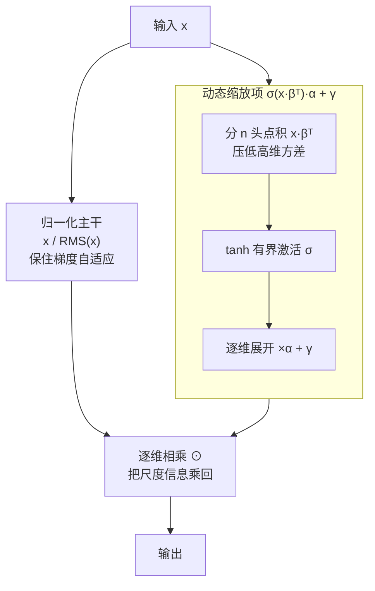

# SeeDNorm: Self-Rescaled Dynamic Normalization

**会议**: ICLR 2026  
**arXiv**: [2510.22777](https://arxiv.org/abs/2510.22777)  
**代码**: 无  
**领域**: 模型压缩 / 归一化层  
**关键词**: 归一化层, 动态缩放, RMSNorm, DyT, 大语言模型

## 一句话总结

提出 SeeDNorm，一种自适应动态归一化层，通过将输入自身作为条件来动态调整缩放系数，从而在前向传播中保留输入范数信息，同时在反向传播中保持类似 RMSNorm 的自适应梯度调整能力，以极少额外参数在语言建模和视觉任务上全面超越 RMSNorm、LayerNorm 和 DyT。

## 研究背景与动机

归一化层（Normalization Layer）是现代深度神经网络的基本构建模块，在稳定训练和加速收敛方面起着关键作用。在 Transformer 架构中，RMSNorm 是目前最主流的归一化方法，它将向量约束到单位超球面上，然后通过可学习的缩放参数 γ 进行逐维缩放以恢复表达能力。

然而，RMSNorm 存在两个核心局限：

**前向传播中丢弃输入范数信息**：归一化操作本身会抹除输入的尺度信息，这限制了网络的表达能力，尤其在零样本泛化场景中更为突出

**静态缩放因子 γ 不够灵活**：γ 是与输入无关的固定参数，无法适应输入数据的广泛变化和分布偏移

近期的替代方案如 DyT（Dynamic Tanh）虽然在前向传播中保留了输入范数信息，但由于 tanh 的饱和特性导致梯度消失问题。作者通过理论分析证明（Proposition 6.1），在假设输入范数恒定的条件下，DyT 在梯度层面等价于 RMSNorm 的逐元素操作，这意味着 DyT 失去了 RMSNorm 根据输入范数动态调整梯度的能力。

这引出了一个根本性问题：**能否设计一种方法，同时兼具训练稳定性、优化效率和保留输入范数信息三大优势？**

## 方法详解

### 整体框架

SeeDNorm 想解决的是 RMSNorm 的两个软肋——前向把输入尺度信息抹掉、缩放因子又与输入无关——但它没有推翻归一化主干，而是只动了那个静态缩放项。整条计算分成两路并行再汇合：一路照旧做 RMS 归一化，把 $\mathbf{x}$ 压到单位超球面上得到 $\frac{\mathbf{x}}{\text{RMS}(\mathbf{x})}$；另一路用输入自身算出一个动态缩放矩阵 $\sigma(\mathbf{x}\cdot\boldsymbol{\beta}^T)\cdot\boldsymbol{\alpha}+\boldsymbol{\gamma}$，让每个 token 的缩放系数随它自己的内容而变；两路逐维相乘，就把归一化时丢掉的尺度信息重新乘回特征里。完整公式为：

$$\text{SeeDNorm}(\mathbf{x}) = [\sigma(\mathbf{x} \cdot \boldsymbol{\beta}^T) \cdot \boldsymbol{\alpha} + \boldsymbol{\gamma}] \odot \frac{\mathbf{x}}{\text{RMS}(\mathbf{x})}$$

其中 $\text{RMS}(\mathbf{x}) = \sqrt{\frac{1}{D}\sum_{i=1}^D x_i^2 + \epsilon}$，$\boldsymbol{\alpha}, \boldsymbol{\beta}, \boldsymbol{\gamma} \in \mathbb{R}^{1 \times D}$ 为可学习参数，$\sigma$ 为非线性激活函数（默认 tanh）。

### 关键设计

**1. 自适应缩放矩阵：动态项找回范数、保留 1/RMS 守住梯度自适应**

RMSNorm 前向抹掉尺度、缩放因子又与输入无关，根子都在那个静态的 $\boldsymbol{\gamma}$ 上。SeeDNorm 把它换成依赖输入的动态项 $\sigma(\mathbf{x} \cdot \boldsymbol{\beta}^T) \cdot \boldsymbol{\alpha}$：输入 $\mathbf{x}$ 先与 $\boldsymbol{\beta}$ 做点积压成标量，经 tanh 约束到 $[-1, 1]$，再乘 $\boldsymbol{\alpha}$ 展开成逐维缩放矩阵。于是每个 token 的缩放系数都由它自身内容决定，不同范数、不同分布的输入得到不同缩放，前向被抹掉的尺度信息因此重新编码回特征——代价只是 $\boldsymbol{\alpha}, \boldsymbol{\beta}$ 两个 $D$ 维向量。

更关键的是 SeeDNorm 没动归一化主干，仍保留 $\frac{1}{\text{RMS}(\mathbf{x})}$ 这个除法结构，这让它在反向传播里同时继承了 RMSNorm 的稳定优势。DyT 之所以失效，是因为 tanh 饱和后梯度被压死，且在常数范数假设下其梯度等价于 RMSNorm 的逐元素操作，丢掉了按范数调节梯度的能力。SeeDNorm 因为保住了 $\frac{1}{\text{RMS}(\mathbf{x})}$，反向时梯度仍主要由它主导：当某输入 $k\mathbf{x}$ 异常大，$\frac{1}{\text{RMS}(k\mathbf{x})} = \frac{1}{k \cdot \text{RMS}(\mathbf{x})}$ 会把梯度按 $k$ 自动缩小，输入过小则相应放大。这种由输入范数驱动的自动伸缩正是 RMSNorm 稳定的关键——前向恢复尺度、反向守住梯度自适应，两件事在一套设计里同时拿下，是 SeeDNorm 的核心。

**2. 尺度不变的初始化：训练初期不让动态项乱动**

引入输入相关项的代价是模型可能在训练早期对输入尺度过度敏感，反而破坏稳定性。当输入整体被缩放 $k$ 倍时，由于 RMS 归一化本身具备尺度不变性，$\frac{\mathbf{x}}{\text{RMS}(\mathbf{x})}$ 不变，SeeDNorm 中唯一随 $k$ 变化的就是自适应项里的 $\sigma(k\mathbf{x} \cdot \boldsymbol{\beta}^T)$。作者把 $\boldsymbol{\beta}$ 初始化为零，使训练起点处 $\nabla_\mathbf{x} f$ 恰好为零，于是网络在最初阶段对尺度扰动近乎免疫，等价于退化成标准 RMSNorm，再随训练逐步学出动态行为，避免了一上来就被动态项带偏。

**3. 多头形式：用分头点积压住高维下爆炸的梯度方差**

直接在高维特征上算 $\mathbf{x} \cdot \boldsymbol{\beta}^T$ 会出问题——这个点积的方差与维度 $D$ 成正比（Theorem 3.2），维度一高方差就过大，导致梯度剧烈震荡甚至不收敛。借鉴多头注意力的思路，SeeDNorm 把 $\mathbf{x}$ 和 $\boldsymbol{\beta}$ 各切成 $n$ 个子向量，在每个子空间内分别算点积再拼接，单个点积涉及的维度从 $D$ 降到 $D/n$，方差随之被压下来。视觉任务对此尤其敏感，因此默认采用多头版本，消融显示 ViT-B 上单头直接不收敛，而 16 头能稳定到最优。

**4. AdaSeeDNorm：适配 DiT 里 AdaLN 的条件注入结构**

DiT 中的 AdaLN 会把类别条件 $c$ 通过缩放、偏移注入归一化，结构和 RMSNorm 不同，不能简单替换。作者为此设计了兼容变体，把动态缩放项嵌进 AdaLN 的条件调制框架：

$$\text{AdaSeeDNorm}(\mathbf{x}, c) = [(\sigma(\mathbf{x} \cdot \boldsymbol{\beta}^T) \cdot \boldsymbol{\alpha} + 1) \odot \frac{\mathbf{x}}{\text{RMS}(\mathbf{x})}](1 + \boldsymbol{\gamma}(c)) + \boldsymbol{\eta}(c)$$

其中 $\boldsymbol{\gamma}(c)$ 和 $\boldsymbol{\eta}(c)$ 是由条件 $c$ 生成的缩放与偏移，既保留了 SeeDNorm 的输入自适应缩放，又不破坏 DiT 原有的条件信息通路。

### 损失函数 / 训练策略

参数初始化遵循"起步即 RMSNorm、动态项从零长起"的原则：$\boldsymbol{\gamma}$ 初始化为 1 与 RMSNorm 对齐，$\boldsymbol{\beta}$ 初始化为零让 $\boldsymbol{\alpha}$ 的梯度从小值起步、避免早期震荡，$\boldsymbol{\alpha}$ 在语言建模任务中初始化为 1——消融显示初始值过小（0.1）会限制收敛、过大（10）则直接失稳。正则化上对 $\boldsymbol{\alpha}, \boldsymbol{\beta}$ 额外施加 weight decay 控制数值稳定性，$\boldsymbol{\gamma}$ 则沿用基线模型一致的设置。视觉任务还需两个补丁：对动态系数 $\sigma(\mathbf{x} \cdot \boldsymbol{\beta}^T) \cdot \boldsymbol{\alpha}$ 施加与 drop path rate 相同的 dropout，并把 $\boldsymbol{\alpha} \cdot \boldsymbol{\beta}^T$ 除以维度进一步压低方差，以适配视觉模型对训练扰动更敏感的特性。

## 实验关键数据

### 主实验

**大语言模型（MoE 架构）**

| 模型 | 训练Token | c4_en Loss | PPL | ARC-C | ARC-E | HellaSwag | PIQA |
|------|----------|-----------|------|-------|-------|-----------|------|
| OLMoE-1.3B (RMSNorm) | 500B | 2.922 | 18.63 | 32.3 | 62.2 | 55.2 | 72.6 |
| OLMoE-1.3B-DyT | 500B | 2.968 | 19.45 | 30.4 | 61.9 | 53.2 | 70.6 |
| **OLMoE-1.3B-SeeDNorm** | 500B | **2.900** | **18.12** | **34.5** | **65.4** | **56.8** | **73.1** |
| OLMoE-7B (RMSNorm) | 1000B | 2.644 | 14.07 | 40.8 | 73.7 | 71.2 | 76.6 |
| **OLMoE-7B-SeeDNorm** | 1000B | **2.631** | **13.88** | **44.5** | **76.1** | **71.8** | **79.1** |

**大语言模型（Dense 架构）**

| 模型 | 训练Token | c4_en Loss | PPL | ARC-C | ARC-E |
|------|----------|-----------|------|-------|-------|
| OLMo2-1B (RMSNorm) | 500B | 2.884 | 17.88 | 35.6 | 68.7 |
| **OLMo2-1B-SeeDNorm** | 500B | **2.879** | **17.79** | **37.8** | **70.0** |

**计算机视觉任务**（ImageNet-1K 分类 Acc@1）

| 模型 | LayerNorm | DyT | SeeDNorm |
|------|-----------|-----|----------|
| ViT-B | 82.3 | 82.5 | **82.7** |
| ViT-L | 83.1 | 83.6 | **83.6** |
| ConvNeXT-B | 83.7 | 83.7 | **83.7** |
| ConvNeXT-L | 84.3 | 84.4 | **84.6** |
| ViT-B (MAE) | 83.2 | 83.2 | **83.5** |
| ViT-L (MAE) | 85.5 | 85.4 | **85.5** |

### 消融实验

| 配置 | c4 Loss | PPL | ARC-C | 说明 |
|------|---------|------|-------|------|
| SeeDNorm (默认，α←1) | 2.900 | 18.12 | 34.5 | 最佳配置 |
| α←0.1 | 2.912 | 18.39 | 31.2 | 初始值过小限制收敛 |
| α←10 | 3.154 | 23.42 | 27.8 | 初始值过大导致不稳定 |
| scalar α（标量替换向量） | 2.909 | 18.33 | 32.6 | 逐维调整优于统一缩放 |
| 逐元素乘法 x⊙β | 2.909 | 18.33 | 36.5 | 点积表达力更强 |
| 去掉 α | 2.907 | 18.29 | 32.1 | 失去逐维动态调整 |
| 去掉 β | 2.911 | 18.37 | 31.9 | 失去非线性形状控制 |
| 去掉 γ | 2.913 | 18.41 | 33.7 | 等价于直接替换 RMS 缩放 |

**多头消融**（ViT-B ImageNet 分类）

| 头数 | Acc@1 | 说明 |
|------|-------|------|
| 1 Head | 不收敛 | 梯度方差过大 |
| 8 Head | 82.5 | 可行但非最优 |
| 16 Head | **82.7** | 最佳 |
| 32 Head | 82.5 | 过多导致梯度多样性不足 |

### 关键发现

1. **MoE 架构放大 SeeDNorm 优势**：MoE 模型中的动态激活参数使 SeeDNorm 的收敛加速优势更明显，Dense 模型虽然训练 loss 提升较小，但零样本评估提升显著
2. **有界激活函数是必须条件**：使用 GeLU/Swish 等无界函数时模型无法收敛，tanh/sigmoid/hardtanh 均可收敛，其中 tanh 效果最佳
3. **DyT 在 LLM 预训练中失败**：用 DyT 替换 OLMoE-1.3B 的归一化层导致收敛缓慢且性能下降
4. **训练 token 越多优势越大**：随着训练 token 增加，SeeDNorm 相对于 baseline 的 loss 优势持续扩大

## 亮点与洞察

1. **理论深度出色**：通过 Proposition 6.1 证明 DyT 在常数输入范数假设下等价于 RMSNorm 的逐元素微分方程解，揭示了 DyT 的根本局限——无法根据输入范数动态调整梯度
2. **设计极简但有效**：仅增加两个 $D$ 维向量参数（$\boldsymbol{\alpha}$, $\boldsymbol{\beta}$），计算复杂度增加为 $O(D)$（远小于线性层的 $O(D^2)$），是真正的"即插即用"改进
3. **多头机制的方差分析**：从点积方差与维度正比的角度分析训练不稳定性，并通过分头计算有效解决，体现了理论指导设计的风格
4. **完整的梯度分析**：对所有参数（$\boldsymbol{\alpha}$, $\boldsymbol{\beta}$, $\boldsymbol{\gamma}$, $\mathbf{x}$）在极端条件下的梯度行为给出了详尽分析，不仅停留在实验层面

## 局限与展望

1. **PyTorch 原生实现效率有限**：SeeDNorm 的碎片化操作会增加内存访问次数，影响延迟和效率，需要融合 kernel 才能达到与 RMSNorm 接近的效率
2. **AdaLN 兼容性需要特殊处理**：不能直接替换 DiT 中的 AdaLN，需要设计专用的 AdaSeeDNorm 变体
3. **视觉任务需要额外超参数**：多头数量、dropout、维度缩放等在视觉任务中需要仔细调整，增加了使用门槛
4. **未在更大规模模型上验证**：最大实验为 OLMoE-7B（1B 激活参数），在 70B+ 参数规模上的表现未知
5. **KV Cache 兼容性未讨论**：在推理阶段 SeeDNorm 对 KV cache 的影响和额外开销值得关注

## 相关工作与启发

- **BatchNorm → LayerNorm → RMSNorm** 的演化路线：逐步简化归一化操作，但始终面临丢弃输入尺度信息的问题
- **DyT（Zhu et al., 2025b）**：用 dynamic tanh 替代归一化层，保留输入范数但牺牲梯度自适应能力
- **Frac-Connection（Zhu et al., 2025a）**：SeeDNorm 可与该方法结合使用，进一步提升性能
- 本文揭示的 RMSNorm 与 DyT 的梯度等价关系可能启发后续设计更好的归一化/激活替代方案

## 评分

- 新颖性: ⭐⭐⭐⭐ — 动态缩放因子的想法直观但有效，理论分析让设计不止于启发式
- 实验充分度: ⭐⭐⭐⭐⭐ — 覆盖 LLM（MoE+Dense）、分类、生成、自监督，消融详尽
- 写作质量: ⭐⭐⭐⭐ — 理论推导完整，实验叙述清晰，附录充实
- 价值: ⭐⭐⭐⭐ — 实用性强的即插即用组件，但需要 kernel 融合才能广泛部署

<!-- RELATED:START -->

## 相关论文

- [\[ICLR 2026\] Inconsistency Biases in Dynamic Data Pruning](inconsistency_biases_in_dynamic_data_pruning.md)
- [\[ICLR 2026\] Dr.LLM: Dynamic Layer Routing in LLMs](drllm_dynamic_layer_routing_in_llms.md)
- [\[NeurIPS 2025\] Dependency Parsing is More Parameter-Efficient with Normalization](../../NeurIPS2025/model_compression/dependency_parsing_is_more_parameter-efficient_with_normalization.md)
- [\[ICLR 2026\] OrderDP: A Theoretically Guaranteed Lossless Dynamic Data Pruning Framework](orderdp_a_theoretically_guaranteed_lossless_dynamic_data_pruning_framework.md)
- [\[ICLR 2026\] LD-MoLE: Learnable Dynamic Routing for Mixture of LoRA Experts](ld-mole_learnable_dynamic_routing_for_mixture_of_lora_experts.md)

<!-- RELATED:END -->
