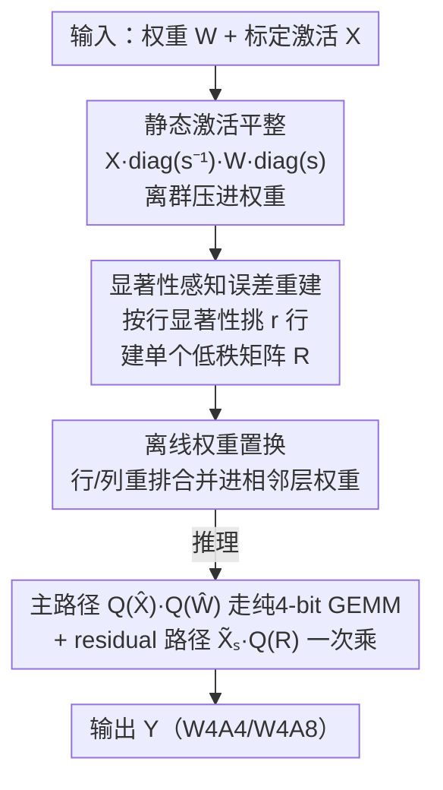

# SERQ: Saliency-Aware Low-Rank Error Reconstruction for LLM Quantization

**会议**: ICLR 2026  
**OpenReview**: [https://openreview.net/forum?id=nFjj8NEBqv](https://openreview.net/forum?id=nFjj8NEBqv)  
**代码**: https://github.com/acalabys/SERQ  
**领域**: 模型压缩  
**关键词**: LLM 量化, 后训练量化, 低秩误差重建, 显著性, W4A4

## 一句话总结
SERQ 把激活离群值和权重显著性统一进**一个**低秩补偿矩阵，靠静态激活平整 + 显著行误差重建 + 离线权重置换三步，让线性层在 W4A4 下走纯 4-bit 端到端计算路径，精度超过此前 LoRA 式误差重建方法和旋转类方法，同时几乎不增加推理延迟。

## 研究背景与动机

**领域现状**：后训练量化（PTQ）是部署 LLM 的主流手段，核心难点是处理**通道级激活离群值**。当前三条技术路线：① 预量化缩放（SmoothQuant、OmniQuant）把激活分布压平；② 在线变换（QuaRot 的随机 Hadamard、SpinQuant 的学习旋转）通过旋转张量抑制离群；③ **低秩误差重建**——用一对 LoRA 式低秩因子 $L_1L_2 \approx W - Q(W)$ 把量化误差补回来。第三条路线因为不需要重训练、不增加在线层而尤其受欢迎，代表作 L2QER 在 W4A8 下几乎无损。

**现有痛点**：低秩误差重建虽然好用，却卡在两个地方。其一，到了 **W4A4** 配置精度会严重崩塌——L2QER 在 LLaMA-3 上几乎失效。其二，传统低秩适配依赖**两个串行因子** $L_1, L_2$，推理时得算 $X_q W_q + X_q L_1 L_2$，两次顺序矩阵乘之间会产生中间值，必须插入一次**在线（on-the-fly）量化**才能继续走低精度，这恰好抵消了低精度 GEMM 内核的优势。旋转类方法虽能做 INT4，但要么吃昂贵的标定、要么因随机矩阵带来性能方差。

**核心矛盾**：低秩误差重建的两个串行因子既是它"轻量"的来源，也是它在 W4A4 下"既慢又掉点"的根源——中间量化步骤和分散的秩预算让误差补偿既低效又抓不准重点。SVD 把固定的秩预算均摊到所有行列上，**稀释**了真正出问题的显著行的容量。

**本文目标**：用**单个**低秩矩阵同时补偿权重侧和激活侧的量化误差，做到 ①消除中间在线量化、②全程纯 4-bit、③标定成本低、④精度在 W4A4 下不崩。

**切入角度**：作者借 AWQ 的洞察——只保护约 1% 的**显著通道（对应权重行）** 就能大幅降低误差。于是与其用 SVD 从整个权重矩阵抽秩，不如**直接按行显著性挑出 rank 个最关键的行**做误差重建，把全部低秩容量集中到这些行上。

**核心 idea**：把激活统计折叠进权重、按显著性挑出 $r$ 个关键权重行，只对这些行构造一个低秩补偿矩阵 $R = \tilde{W}_s - Q(\tilde{W}_s)$，residual 路径只需**一次**矩阵乘——从根上去掉串行第二因子和中间量化。

## 方法详解

### 整体框架
SERQ 要解决的是"如何用单个低秩矩阵在 W4A4 下精确补偿量化误差，同时不破坏纯 4-bit GEMM"。整体分三步串行：先用**静态激活平整**把通道离群值压进权重；再做**显著性感知误差重建**，识别折叠后权重里的显著行并只对它们建一个低秩补偿矩阵 $R$；最后用**离线权重置换**把行/列重排合并进权重参数，让推理时无需任何在线重排。标定阶段确定缩放因子、显著行与置换顺序；推理阶段主路径走 4-bit GEMM，residual 路径只对显著激活通道 $\tilde{X}_s$ 算一次 $R$。

### 关键设计

**1. 静态激活平整：把在线离群处理换成离线缩放**

激活量化最脆弱的地方是通道级离群值，旋转/辅助层这类在线方案虽有效却带来延迟。SERQ 因为本身就给线性层配了误差重建的 residual 路径，所以干脆放弃在线平整，回到 SmoothQuant 的**静态逐通道缩放**：用缩放因子 $s$ 把激活压平，并把 $s$ 折叠进权重，$Y = XW = (X\cdot \mathrm{diag}(s^{-1}))(\mathrm{diag}(s)\cdot W) = \tilde{X}\tilde{W}$。缩放因子在标定时算好、离线合并进相邻层，**运行时零开销**。代价是离群负担从激活转移到了权重、加大了权重量化难度——但这正好交给下一步的低秩重建来补偿，这种"先把脏活推给权重、再用低秩精确补回"的分工是 SERQ 能避开在线变换的关键。

**2. 显著性感知误差重建：单矩阵只补显著行，消除中间量化**

这是 SERQ 的核心，针对"两个串行因子 + 中间在线量化"这个痛点。经过静态平整后，激活离群被推进了对应的权重行；假设原权重近似正态分布，**折叠后权重里的显著行可以直接由其 scale 大小识别**。SERQ 把权重行按显著性降序置换 $P$，折叠矩阵写成 $\hat{W} = P\cdot\mathrm{diag}(s)\cdot W = [\tilde{W}_s; \tilde{W}_r]$，只对前 $r$ 个显著行 $\tilde{W}_s$ 构造低秩补偿矩阵：

$$R = \tilde{W}_s - Q(\tilde{W}_s)$$

线性运算变为 $Q(\hat{X})\cdot Q(\hat{W}) \approx \hat{X}_q\hat{W}_q + \tilde{X}_{s,q}\cdot Q(R)$。和 SVD 的根本区别在于：SVD 要从整矩阵抽秩、两个因子串行相乘产生中间值、必须中间量化；而 SERQ 直接抽显著行，residual 路径**只需一次** $\mathbb{R}^{s\_len\times r}\times \mathbb{R}^{r\times d}$ 矩阵乘，且 $R$ 本身也被量化，于是**全程纯低精度、无中间量化**。把固定秩预算全押在最该补的显著行上，也解释了为什么单矩阵反而比 SVD 全矩阵分解的 perplexity 更低。

**3. 离线权重置换：让行列重排不带来任何推理延迟**

显著性重建要求权重和激活都按显著性重排（$\hat{X}=[\tilde{X}_s\,\tilde{X}_r]$、$\hat{W}=[\tilde{W}_s;\tilde{W}_r]$），若推理时实时重排会引入延迟。SERQ 提出**可合并的置换方案**：权重的行和列都在标定阶段按显著性顺序离线重排。行置换直接预排进所有权重参数；对应激活要跟随同一通道顺序，则通过对**前一层权重做列置换**来实现——例如 down-projection 的置换顺序 $P_4$ 可以传播到前面 up/gate-projection 的权重列上，使其输出激活天然按 $P_4$ 排列，down-projection 无需再重排。这样所有线性层都避免了 on-the-fly reordering，推理零额外延迟。

## 实验关键数据

### 主实验

与低秩矩阵分解方法对比（perplexity↓ / 8 项零样本常识推理均值↑ / MMLU↑），LLaMA-2/3 系列：

| 配置 | 方法 | #Eff.(w) | L2-7B PPL | L2-7B 0-shot | L3-8B PPL | L3-8B MMLU |
|------|------|----------|-----------|--------------|-----------|------------|
| FP16 | baseline | 16 | 5.47 | 64.09 | 6.13 | 62.13 |
| W4A8 | L2QER | 4.35 | 5.83 | 63.35 | 7.16 | 57.81 |
| W4A8 | SERQ(GPTQ) | 4.24 | **5.59** | 63.04 | **6.52** | **60.25** |
| W4A4 | L2QER | 4.24 | 7.37 | 57.67 | 11.44 | 38.33 |
| W4A4 | L2QER-MXFP4 | 4.37 | 6.30 | 60.95 | 7.83 | 53.82 |
| W4A4 | SERQ(GPTQ) | 4.24 | **5.97** | **61.87** | 7.75 | 53.8 |

SERQ 在最低有效位宽（4.24）下几乎全面领先，W4A4 的差距尤其明显——L2QER 在 LLaMA-3 上掉到 PPL 11.44、MMLU 38.33，SERQ 仍守住 7.75 / 53.8。

与 W4A4 分布平整（旋转类）方法对比，LLaMA-2 7B / LLaMA-3 8B：

| 方法 | Training-free | 延迟开销 | L2-7B PPL | L2-7B MMLU | L3-8B PPL | L3-8B MMLU |
|------|---------------|----------|-----------|------------|-----------|------------|
| QuaRot | ✓ | 19.8% | 6.15 | 33.58 | 8.41 | 47.29 |
| SpinQuant | ✗ | 19.8% | 6.0 | 34.8 | 8.26 | 49.93 |
| SERQ | ✓ | **18.7%** | **5.97** | **37.03** | **7.75** | **53.8** |

SERQ 在 training-free 的前提下，精度（尤其 MMLU）和延迟都优于需要学习旋转矩阵的 SpinQuant。

### 消融实验

| 配置 | 关键指标 | 说明 |
|------|---------|------|
| Rank=0 | L3-8B PPL 9.80 | 不做低秩重建，明显劣化 |
| Rank=16 | L3-8B PPL 8.28 | 等价 LoRA rank 8，已很有竞争力 |
| Rank=128 | L3-8B PPL 8.07 | 默认设置 |
| Rank=256 | L3-8B PPL 7.98 | 收益快速饱和 |
| Wiki 128 样本 | L3-8B PPL 7.98 | 标定数据 |
| Pile 32 样本 | L3-8B PPL 8.18 | 换数据集/减样本仍稳定 |

### 关键发现
- **秩越大 perplexity 单调下降但很快饱和**：从 rank 0→128 提升最大，128→256 收益微薄；即便 rank=16 也已接近，说明误差确实高度集中在少数显著行上，印证了"单矩阵只补显著行"的核心假设。
- **对标定数据高度鲁棒**：WikiText-2 与 Pile、128 与 32 样本之间 PPL 几乎不变，标定成本可压得很低。
- **延迟优势来自去掉串行第二因子**：W4A4 下 SERQ 的 residual 路径比 L2QER 的 LoRA 双串行乘**最多快 4.5×**；相比旋转方法因不平衡矩阵维度带来约 1.6× 的旋转开销，SERQ 只多约 1% 延迟。端到端在 Blackwell GPU 上 TTFT 较 FP16 提速逾 2×、峰值显存最高省 2.48×。

## 亮点与洞察
- **"单矩阵"是延迟与精度双赢的支点**：传统 LoRA 式重建的两个串行因子既慢又要中间量化，SERQ 用"只补显著行的单个 $R$"一刀切掉第二因子，residual 变成一次矩阵乘——这是它能在 W4A4 走纯 4-bit 端到端路径的根本。
- **把显著性从"激活"统一搬到"权重行"**：静态平整把激活离群折叠进权重后，显著行可直接由 scale 识别，于是激活侧和权重侧的显著性被统一成"挑权重行"一件事，建模和实现都干净。
- **离线置换的传播技巧可复用**：把某层的行置换顺序传播到前一层的列置换上，使重排"零运行时开销"，这套思路对任何需要重排通道的量化/剪枝方法都有借鉴价值。

## 局限与展望
- 方法聚焦**线性层**量化，KV-cache 量化未纳入（旋转对比也特意排除 KV 量化做公平比较），端到端低比特部署的完整收益还需补齐这块。
- 显著行识别依赖"原权重近似正态、scale 即可定显著性"的假设，对分布异常的模型是否成立未深入讨论；显著行数固定为 rank，对极端离群结构可能不够自适应。
- 单 batch decoding 阶段量化反而比 FP16 略慢（与 MXFP4 同样的趋势），主要收益体现在 prefill 与较大 batch；小 batch 解码延迟仍是待优化点。

## 相关工作与启发
- **vs L2QER**：同为低秩误差重建，L2QER 用 SVD 抽两个串行因子、低秩矩阵用 8-bit、推理需中间在线量化；SERQ 直接抽显著行用单个 4-bit 矩阵、residual 一次乘无中间量化，因此在 W4A4 既更准又最多快 4.5×，有效位宽更低。
- **vs QuaRot / SpinQuant**：旋转类靠 Hadamard/学习旋转在线压平离群，QuaRot 有随机矩阵方差、SpinQuant 需训练旋转矩阵；SERQ 是 training-free 的静态方案，精度更高且延迟更低，尤其在紧凑的 LLaMA-3.2 模型上优势明显。
- **vs SmoothQuant**：SERQ 复用了 SmoothQuant 的静态逐通道平整，但补上了"平整把误差推给权重后如何精确补回"的关键一环——用单低秩矩阵重建显著权重行的残差。

## 评分
- 新颖性: ⭐⭐⭐⭐⭐ 首次用单个显著性引导低秩矩阵实现线性层 4-bit 端到端误差重建，切掉串行第二因子与中间量化。
- 实验充分度: ⭐⭐⭐⭐ 覆盖 LLaMA-2/3、Qwen 多规模 + W4A8/W4A4 + 旋转类对比 + GPU 延迟/显存，KV-cache 量化未涉及。
- 写作质量: ⭐⭐⭐⭐ 动机—方法—实验逻辑清晰，三步框架与公式表达明确。
- 价值: ⭐⭐⭐⭐⭐ 在最难的 W4A4 下兼顾精度与纯低精度推理效率，对边缘/服务端 LLM 部署有直接实用价值。

<!-- RELATED:START -->

## 相关论文

- [\[ICLR 2026\] UniQL: Unified Quantization and Low-Rank Compression for Adaptive Edge LLMs](uniql_unified_quantization_and_low-rank_compression_for_adaptive_edge_llms.md)
- [\[ICML 2026\] Preserve-Then-Quantize: Balancing Rank Budgets for Quantization Error Reconstruction in LLMs](../../ICML2026/model_compression/preserve-then-quantize_balancing_rank_budgets_for_quantization_error_reconstruct.md)
- [\[ICLR 2026\] Rethinking Residual Errors in Compensation-based LLM Quantization](rethinking_residual_errors_in_compensation-based_llm_quantization.md)
- [\[ICLR 2026\] Towards Quantization-Aware Training for Ultra-Low-Bit Reasoning LLMs](towards_quantization-aware_training_for_ultra-low-bit_reasoning_llms.md)
- [\[ICML 2026\] Saliency-Aware Model Merging](../../ICML2026/model_compression/saliency-aware_model_merging.md)

<!-- RELATED:END -->
