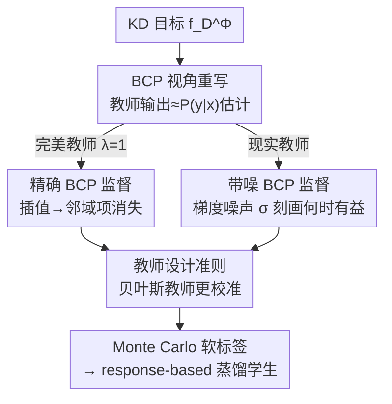

# SGD-Based Knowledge Distillation with Bayesian Teachers: Theory and Guidelines

**会议**: ICLR 2026  
**OpenReview**: [https://openreview.net/forum?id=YZGBnZbMYN](https://openreview.net/forum?id=YZGBnZbMYN)  
**领域**: 模型压缩 / 知识蒸馏理论  
**关键词**: 知识蒸馏, SGD 收敛分析, 贝叶斯类后验, 教师校准, 贝叶斯深度学习

## 一句话总结
本文从贝叶斯视角把知识蒸馏（KD）看作"用类后验概率（BCP）而非 one-hot 标签做监督"，严格分析了学生用 SGD 训练时的收敛行为，证明从精确 BCP 学习能消除收敛界里的"邻域项"（方差归零、可用更大学习率），并据此给出一条实践指南——用校准更好的贝叶斯教师做蒸馏，实验上学生精度最高提升 +4.27%、收敛噪声最多降 30%。

## 研究背景与动机
**领域现状**：知识蒸馏的核心是让小学生网络去拟合大教师网络输出的"软概率"，而不是硬 one-hot 标签。这套软监督在压缩、迁移、提升泛化上都很有效，已经衍生出动态温度、特征蒸馏、任务感知匹配等大量方法。

**现有痛点**：尽管 KD 实证上非常成功，它的理论基础仍然只被"部分理解"。特别是——教师输出的概率到底如何影响学生的**优化轨迹**和**泛化**，一直没有被刻画清楚。已有理论大多停留在自蒸馏等特殊场景，或是从统计风险（excess risk）的角度分析，而对 SGD 这类真正在用的学习算法的动力学几乎没有触及。

**核心矛盾**：KD 把监督信号从"离散标签"换成了"连续概率"，这个替换究竟改变了 SGD 收敛的哪个环节？以及——既然教师概率是对真实类后验 $P(y|x)$ 的一个（可能有噪声的）估计，那么教师估得越准（越校准），对学生优化的帮助到底体现在哪里、什么时候反而没用？这两个问题决定了"该设计什么样的教师"。

**本文目标**：（1）刻画"用 BCP 估计做监督"对 SGD 收敛的影响，分精确教师和带噪教师两种情形，并与 one-hot 监督对比；（2）由分析推导出可操作的教师设计准则。

**切入角度**：作者把教师输出解释为对**贝叶斯类后验概率（Bayes Class Probability, BCP）** $P(y|x)$ 的估计——完美教师输出真实 BCP，现实教师输出带噪 BCP。在这个统一建模下，蒸馏目标 $f_D^\Phi$ 恰好可以化简成"拿软标签当监督"的经验风险，从而能套用 SGD 收敛分析的成熟工具。

**核心 idea**：用"BCP 监督"替换"one-hot 监督"，会让优化问题从"拟合硬标签"变成一个**插值（interpolation）任务**，进而消除 SGD 收敛界里的随机噪声邻域项；噪声越小（教师越校准）这个好处越强——所以应该用天生校准更好的**贝叶斯教师**。

## 方法详解

### 整体框架
本文不是提出一个新模块，而是给 KD 搭了一套"理论 → 准则 → 实践"的链条。先把标准 KD 目标
$$\min_{\theta}\; f_D^\Phi(\theta)=\frac{1}{|D|}\sum_n \big[(1-\lambda)\,\ell(\phi_\theta(x_n),y_n)+\lambda\,\ell(\phi_\theta(x_n),\Phi(x_n))\big]$$
在交叉熵（对第二个参数线性）下化简为对**混合软标签** $(1-\lambda)y_n+\lambda\Phi(x_n)$ 的监督；当教师 $\Phi$ 输出真实 BCP 且 $\lambda=1$ 时，它就退化为纯 BCP 监督。然后在两个情形下分别给出 SGD 收敛界——**精确 BCP**（完美教师）和**带噪 BCP**（现实教师），并与 one-hot 监督的标准界对照，得到"消除邻域项 / 梯度噪声变小"的结论。最后把这个理论结论翻译成一句工程指南：既然好处来自教师对 BCP 的逼近精度（即校准度），就该用贝叶斯深度学习模型当教师，并给出两条落地路径（从头 VI 训练 / 把现成确定性教师用 Laplace 近似转成贝叶斯）。下游照常用 response-based 蒸馏，软标签由教师的 Monte Carlo 多次前向平均得到。

### 关键设计

**1. 贝叶斯视角下的 BCP 监督：把 KD 重写成可分析的优化问题**

针对"教师概率如何影响优化"这个一直没说清的问题，作者先把监督对象统一成 BCP。标准风险用 one-hot 标签 $\min_\theta f_P(\theta)=\mathbb{E}[\ell(\phi_\theta(x),y)]$；BCP 风险则把 $y$ 换成真实后验 $\min_{\hat\theta}\hat f_P(\hat\theta)=\mathbb{E}[\ell(\phi_\theta(x),P(y|x))]$。**Proposition 1** 证明在学生表达力足够（AS4）时，两者有**相同的最优解和最优值**（都是真实 BCP，最小损失等于 $y$ 关于 $x$ 的条件熵）——也就是说换成 BCP 监督不会改变要找的目标模型，只改变到达它的路径。这一步是后面所有收敛分析的地基：它保证"对比 BCP 监督和 one-hot 监督"是在比同一个终点的不同走法，而不是比两个不同问题。

**2. 完美 BCP 监督的插值性质：消除邻域项、放大可用学习率**

这是全文最核心的结论，解释了 KD 为什么稳。**Proposition 2 + Lemma 1** 证明 BCP 风险满足**插值性质**：最优解 $\hat\theta^*$ 在每个样本上都同时最小化损失，于是每个样本的梯度在最优点都精确为零 $\nabla_{\hat\theta}\ell(\phi_{\hat\theta^*}(x),P(y|x))=0$。这带来两个直接好处（**Theorem 1-2**）：其一，参数和风险都以 $(1-\alpha\mu)^t$ 几何收敛，而标准 SGD 界里那个正比于 $\frac{\alpha}{\mu}\sigma_f^*$ 的**邻域项直接消失**——学生不再在最优点附近抖动，而是精确收敛到底；其二，可保证收敛的学习率范围是标准 SGD 的**两倍**，允许更大步长、收敛更快。直观说，蒸馏把"拟合带噪 one-hot 标签"这个本质上不可插值的问题，变成了一个可插值问题，因此 SGD 的随机噪声被根除。这也解释了为什么 KD 能在 one-hot 监督会过拟合的设定下仍然泛化。

**3. 带噪 BCP 的梯度噪声刻画：精确给出"何时蒸馏才有益"的判据**

现实教师不完美，作者把带噪 BCP 建模为真实 BCP 加零均值、方差为 $\nu$ 的噪声 $\Phi(x)\equiv[P(y_k|x)+\epsilon_k]_k$。此时收敛界（**Theorem 3-4**）重新出现邻域项，但其大小由一个干净的梯度噪声项决定。**Proposition 3** 给出了两个并排的闭式：one-hot 监督的梯度噪声
$$\sigma_f^*=\mathbb{E}_x\Big[\sum_{k=1}^K \tfrac{1}{P(y_k|x)}\,\|J_{\theta,k}[\phi_{\theta^*}(x)]\|^2\Big],$$
带噪 BCP 监督的梯度噪声
$$\sigma_{\tilde f}^*=\nu\cdot\mathbb{E}_x\Big[\sum_{k=1}^K \tfrac{1}{[P(y_k|x)]^2}\,\|J_{\tilde\theta,k}[\phi_{\tilde\theta^*}(x)]\|^2\Big].$$
两者都是雅可比各列的加权平均，区别在权重：one-hot 用 BCP 的倒数，带噪 BCP 用噪声方差 $\nu$ 乘 BCP 平方的倒数。结论很锋利——当 $\nu\to0$（教师输出真 BCP）时退化回无邻域项的情形；而蒸馏**有益当且仅当** $\sigma_{\tilde f}^*<\sigma_f^*$，即教师噪声小于 one-hot 标签本身相对真 BCP 的固有方差。这个翻转点同时取决于数据分布、模型平滑度（雅可比）和教师质量（$\nu$），把"教师够不够好才值得蒸馏"量化成了一个可比较的不等式。

**4. 贝叶斯教师作为落地准则：用更校准的概率估计逼近 BCP**

理论指向"教师越校准（越逼近 BCP）越好"，作者据此主张用**贝叶斯神经网络（BNN）**当教师，因为 BNN 天生比确定性网络校准得更好。落地有两条互补路径：（i）用变分推断（VI）从头训练贝叶斯教师；（ii）用 **Laplace 近似（LA）**把现成的确定性预训练教师二阶展开转成贝叶斯模型——后者的好处是无需重训，可直接套用已有教师。随机性可注入全部权重、特定层或仅最后一层，从而按算力预算调节复杂度。推理时教师软标签由 $S$ 次随机前向（softmax 后平均）的 Monte Carlo 估计得到，再按 response-based 蒸馏喂给学生。这一步把抽象的"逼近 BCP"变成了具体可换的教师构造方式。

### 损失函数 / 训练策略
学生用标准交叉熵蒸馏目标 (式 4)，关键超参是蒸馏权重 $\lambda\in[0,1]$；分析显示**最优 $\lambda$ 随教师噪声水平变化**——教师越校准，可越偏向纯软标签（$\lambda$ 越大）。教师侧：VI 训练或 LA 转换；软标签用 $S$ 次 MC 前向平均。理论假设为强拟凸/PL 条件（AS1/AS2）、期望光滑（AS3）、学生表达力足够实现真 BCP（AS4）；作者也指出即使这些假设不严格成立，实验上准则依然有效。

## 实验关键数据

### 主实验
CIFAR-100，12 个 teacher-student 配对（6 个同架构 + 6 个异架构），每个配对比较 6 种教师类型，5 次运行取平均。学生精度（%），下标为相对"确定性教师"的变化：

| 配对（异架构） | 确定性教师→学生 | Bayesian(VI, 本文) | Laplace(LA, 本文) |
|--------|------|------|------|
| ResNet-50→VGG-8 | 75.66 | 77.27 (**+1.62**) | 76.11 (+0.46) |
| VGG-13→WRN-40-1 | 67.90 | 71.37 (**+3.47**) | 70.87 (+2.97) |
| ResNet-50→WRN-16-2 | 69.36 | 73.63 (**+4.27**) | 72.52 (+3.16) |
| ResNet-50→WRN-40-2 | 73.79 | 75.82 (+2.03) | 74.57 (+0.77) |

异架构配对上贝叶斯教师收益最大（最高 +4.27%），印证了"教师更校准 → 学生更好"的理论预测；同架构配对收益较小但同样一致为正。

### 消融实验（不同教师类型对比）

| 教师类型 | 做法 | 学生表现 |
|------|---------|------|
| Deterministic | 标准确定性教师（基线） | 基准 |
| Bayesian (VI, 本文) | 变分推断从头训练 BNN 教师 | 一致最优，最高 +4.27% |
| Laplace (LA, 本文) | 对预训练教师做 Laplace 近似 | 多数为正、收益次于 VI，无需重训 |
| MCMI | 确定性教师用条件互信息损失微调 | 增益很小（多在 ±0.3 内） |
| TTDA | 预训练教师改造成随机预测 | 增益微弱（±0.5 内） |
| MSE | 改 loss 提升校准 | **普遍掉点**（最差 -3.65） |

### 关键发现
- **贝叶斯教师贡献最大**：VI 教师在 12 个配对上一致提升学生精度，异架构场景增益尤其明显（最高 +4.27%），且收敛噪声最多降 30%——直接对应理论里"梯度噪声变小"。
- **Laplace 路径性价比高**：虽然教师本身精度有时略降（校准提升不等于精度提升），但学生大多受益，且不必重训教师，工程上最易落地。
- **改 loss 类方法不灵**：MSE、MCMI、TTDA 这些"在确定性框架内提升校准"的做法增益微弱甚至有害，反衬出"换到贝叶斯范式拿到的天然校准"才是关键。
- **$\lambda$ 随教师质量变**：合成实验显示让学生表现最好的 $\lambda$ 取决于 BCP 噪声水平，提示未来可用教师的不确定度自适应选 $\lambda$。

## 亮点与洞察
- **把 KD 的"软标签好用"翻译成 SGD 语言**：以往说软标签是"正则化"，本文精确指出它让优化变成插值任务、从而消掉随机噪声邻域项——这是对 KD 稳定性的一个机制级解释，而非泛泛而谈。
- **两个梯度噪声闭式是全文最干净的产物**：$\sigma_f^*$ 用 BCP 倒数加权、$\sigma_{\tilde f}^*$ 用 $\nu$ 乘 BCP 平方倒数加权，一眼看出"教师噪声 $\nu$ 怎么进收敛界"，并给出"$\sigma_{\tilde f}^*<\sigma_f^*$ 才值得蒸馏"的可判定条件。
- **理论直接生产工程准则**：从"逼近 BCP→要校准→用 BNN"一路推到"VI 训练 / LA 转换"两条可换教师，Laplace 那条尤其能套在任意现成确定性教师上，迁移成本极低。

## 局限与展望
- **理论假设较强**：强拟凸/PL、期望光滑、学生足够表达真 BCP（AS1-AS4）在真实深网上不严格成立；作者用实验弥补，但严格保证仍局限在理想设定。
- **噪声建模简化**：把教师误差建模为零均值、不相关的加性噪声（或 Dirichlet），现实教师误差可能有偏、相关，附录虽给了 Dirichlet 版本但覆盖仍有限。
- **实验规模有限**：只在 CIFAR-100 上验证，未涉及大规模图像或非视觉任务；贝叶斯教师（尤其 VI / 多次 MC 前向）的训练与推理开销也未与收益做成本权衡。
- **改进思路**：把"最优 $\lambda$ 随教师不确定度自适应"做成在线算法；将分析推广到非凸、有偏噪声以及序列任务。

## 相关工作与启发
- **vs Menon et al. (2021) / Dao et al. (2021)**：他们也从贝叶斯视角分析 KD，但聚焦风险的统计性质（excess risk、教师与真 BCP 的 $\ell_2$ 距离）；本文转而分析**学习算法本身**（SGD 收敛/梯度噪声），并落到教师设计上。
- **vs Safaryan et al. (2024)**：据作者所知是首个分析蒸馏对 SGD 影响的工作，但限定自蒸馏/学生是教师压缩版且依赖专门的梯度近似；本文对**任意教师**成立、不依赖梯度近似、显式把教师当 BCP 估计。
- **vs Kim/Fan/MCMI/MSE 等校准增强法**：它们在确定性框架内改 loss 提校准；本文直接换到贝叶斯范式拿天然校准与不确定度量化，实验上明显优于这些改 loss 方法。
- **vs ABKD / f-divergence 类**：那些工作改的是 KD 用的散度（怎么传概率质量），本文不动散度、只关注教师概率估计的**质量**对学生的影响。

## 评分
- 新颖性: ⭐⭐⭐⭐⭐ 首个把蒸馏对 SGD 动力学的影响刻画清楚、并由理论直接导出"用贝叶斯教师"准则。
- 实验充分度: ⭐⭐⭐⭐ 12 配对 × 6 教师类型 + 合成验证较扎实，但只限 CIFAR-100、缺成本分析。
- 写作质量: ⭐⭐⭐⭐⭐ 理论—准则—实验链条清晰，命题/定理对照标准 SGD 界讲得很透。
- 价值: ⭐⭐⭐⭐ 给"该设计什么教师"提供了可操作且低成本（Laplace）的答案，对 KD 实践有直接指导。

<!-- RELATED:START -->

## 相关论文

- [\[CVPR 2026\] Continual Distillation of Teachers from Different Domains](../../CVPR2026/model_compression/continual_distillation_of_teachers_from_different_domains.md)
- [\[ICLR 2026\] In Good GRACES: Principled Teacher Selection for Knowledge Distillation](in_good_graces_principled_teacher_selection_for_knowledge_distillation.md)
- [\[ICLR 2026\] Pedagogically-Inspired Data Synthesis for Language Model Knowledge Distillation](pedagogically-inspired_data_synthesis_for_language_model_knowledge_distillation.md)
- [\[ICLR 2026\] Generative Diffusion Prior Distillation for Long-Context Knowledge Transfer](generative_diffusion_prior_distillation_for_long-context_knowledge_transfer.md)
- [\[ICLR 2026\] Rejuvenating Cross-Entropy Loss in Knowledge Distillation for Recommender Systems](rejuvenating_cross-entropy_loss_in_knowledge_distillation_for_recommender_system.md)

<!-- RELATED:END -->
