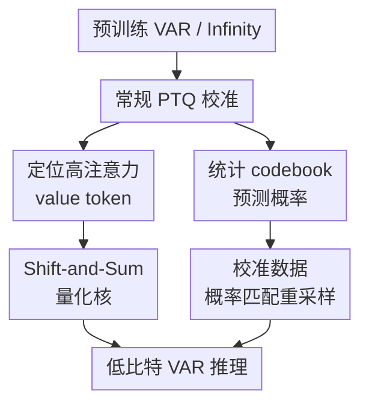

# Shift-and-Sum Quantization for Visual Autoregressive Models

**会议**: ICLR2026  
**OpenReview**: [https://openreview.net/forum?id=DAZvMAlZRp](https://openreview.net/forum?id=DAZvMAlZRp)  
**论文**: [OpenReview](https://openreview.net/forum?id=DAZvMAlZRp)  
**代码**: 未公开（项目页: http://cvlab.yonsei.ac.kr/projects/Shift-and-Sum/）  
**领域**: 模型压缩 / 视觉自回归模型 / 后训练量化  
**关键词**: 后训练量化, 视觉自回归模型, Shift-and-Sum, 校准数据重采样, 注意力量化  

## 一句话总结

本文针对 Visual Autoregressive Models 的后训练量化提出 Shift-and-Sum 量化与校准数据重采样：前者专门压低高注意力 value token 在 attention-value 乘积中的误差，后者让小校准集里的 VQ-VAE codebook 采样频率更接近模型预测概率，从而在低比特 VAR / Infinity 生成任务上稳定优于 BRECQ 和 LiteVAR。

## 研究背景与动机

**领域现状**：视觉自回归模型（VAR）把图像生成从传统的逐 token raster-scan 预测，改成从粗尺度到细尺度的 next-scale prediction。它先在低分辨率 token map 上确定整体结构，再逐步补细节，最终由 VQ-VAE decoder 还原图像。这种生成范式已经能和 diffusion、GAN 等模型竞争，但推理时需要多个 transformer block，并且每个尺度都要反复做 attention 和前馈层计算。

**现有痛点**：后训练量化（PTQ）本来很适合部署场景，因为它只用少量校准数据就能把权重和激活压到低比特；但 VAR 的量化问题不能直接套用 ViT 或 diffusion 的经验。作者发现，VAR transformer 里 attention score 和 value token 的乘积在量化后误差很大，尤其是粗尺度。粗尺度 token 数少，注意力更容易集中到少数 value token 上，一旦这些“被看得很重”的 value 被量化错，误差会顺着后续尺度继续传播。

**核心矛盾**：VAR 的另一个特殊矛盾来自 VQ-VAE codebook。校准时，模型会按预测概率从 codebook 中采样 token map；但 PTQ 只能用很少的校准样本，例如 256 张图。codebook 又很大，例如 VAR-d16 使用 4096 个 entries。于是某些 entry 在校准集里被随机采多了，某些本该常出现的 entry 反而采少了，最后校准出的量化参数偏向一个不准确的离散分布。

**本文目标**：作者要解决两个具体问题。第一，降低 VAR attention-value product 在粗尺度、高注意力 token 上的重构误差，同时避免引入混合精度硬件依赖。第二，在不扩大校准集的前提下，让校准 token map 的 codebook 频率更接近模型自身给出的概率分布。

**切入角度**：本文没有试图重新训练模型，也没有保留大量层为全精度，而是抓住 VAR 量化里最有辨识度的两处误差来源：attention 中“少数 token 权重大”的误差放大，以及 codebook 随机采样导致的校准分布漂移。这个角度的好处是改动局部、仍然保持 PTQ 的轻量部署属性。

**核心 idea**：对 attention 里最有影响的 value token 做“对称偏移后量化再求平均”，用额外的 bit-shift 与求和把单次量化误差摊薄；同时重分配校准 token，让 codebook entry 的实际采样频率贴近预测概率。

## 方法详解

### 整体框架

本文方法是一个面向 VAR 的 PTQ 框架，底座仍可接在 BRECQ 这类 block reconstruction 量化方法上。它先用常规量化器处理权重、激活、softmax attention：attention 用 log2 quantizer，其他权重和激活用 uniform quantizer；随后在 self-attention 的 $AV$ 乘积中，对平均 attention score 高于阈值的 value token 启用 Shift-and-Sum 核；最后在生成校准数据时，对 VQ-VAE codebook token 做概率匹配式重采样。

整体上，方法不是给整个网络套更高 bit-width，而是把额外计算预算集中到两个 VAR 特有的薄弱点：一个在 transformer 内部的 attention-value product，一个在校准数据的离散 codebook 分布。

在量化器层面，uniform quantizer 把浮点值 $x$ 映射到 $b$ bit 整数，再反量化为 $Q(x;s,z)=s(\hat{x}-z)$；softmax attention 使用 log2 quantizer，输出形如 $Q(x;s)=s2^{-\hat{x}}$。log2 attention 对硬件更友好，但它的相对误差会随着 attention score 的量级变化而影响最终乘积，这正是本文后续设计要处理的地方。

### 关键设计

**1. 高注意力误差建模：先解释为什么粗尺度最怕 value token 量化错**

VAR 每个尺度都要计算 attention score $a_i$ 与 value token $v_i$ 的加权和。量化后可以把 attention 和 value 的误差写成 $\epsilon_i^a$ 与 $\epsilon_i^v$，于是单个 attention-value product 的量化输出近似为 $\sum_i (a_i+\epsilon_i^a)(v_i+\epsilon_i^v)$。论文进一步把相对 attention 噪声写成 $\tilde{\epsilon}_i^a=\epsilon_i^a/a_i$，在误差独立、零均值的近似下得到重构误差方差：

$$
\operatorname{Var}[\delta]=\sum_{i=1}^{T} a_i^2\left(\sigma_a^2\lVert v_i\rVert_2^2+d(\sigma_a^2\sigma_v^2+\sigma_v^2)\right).
$$

这个式子说明，误差不是均匀地来自所有 token，而是被 $a_i^2$ 放大。粗尺度 token 数少，attention 更容易集中，超过阈值 $\theta$ 的 attentive tokens 比例更高；因此同样的 value 量化误差，在粗尺度会更容易变成最终图像里的结构性伪影。这个分析也把本文和一般“给 transformer 做 PTQ”的方法区分开来：它要处理的是 VAR coarse-to-fine 生成链路早期的误差放大。

**2. Shift-and-Sum 量化核：用对称偏移平均把单次舍入误差压到更细网格**

对一个标量 value $v$，本文定义了一个 $n$ 阶量化核：

$$
f_n(v;t_n)=\frac{1}{2n}\sum_{k=-n}^{n-1} Q\left(v+(2k+1)t_n\right).
$$

直观地说，它不是只量化一次 $v$，而是复制 $2n$ 个对称偏移版本，例如 $n=1$ 时量化 $v-s/4$ 和 $v+s/4$，再取平均。若取 $t_n=s/(4n)$，论文证明误差上界为 $|v-f_n(v;t_n)|\le s/(4n)$，而普通 uniform quantization 的典型舍入误差上界相当于 $s/2$。平均后的输出等价于落在更细的有效网格上，所以它能减少 value token 的量化误差，却不需要真的把这个 token 切到更高 bit-width。

关键在于它只对“值得花预算”的 token 使用。论文用 attention 矩阵 $A\in\mathbb{R}^{T'\times T}$ 的第 $i$ 列来衡量第 $i$ 个 value token 被所有 query 关注的程度：$\operatorname{Score}(v_i)=\lVert \alpha_i\rVert_1/T'$。当 $\operatorname{Score}(v_i)>\theta$ 时，才把这个 token 放入集合 $H$ 并使用 Shift-and-Sum；其他 token 仍走普通量化。这样 $AV$ 近似写成

$$
AV\approx \sum_{i\in H}Q_a(\alpha_i)f_n(v_i;s_v/(4n))^\top + \sum_{i\notin H}Q_a(\alpha_i)Q_v(v_i)^\top.
$$

**3. 自适应核阶数：让额外计算预算跟 attention score 绑定，而不是固定浪费**

Shift-and-Sum 会带来额外 duplicate、shift、sum 和更大的 BOP 消耗，所以不能对所有 attentive token 用同一个大核。本文把核阶数限制为 $1,2,4,\ldots$ 这样的 2 的幂，因为 attention score 除以 $2n$ 可以用 bit-shift 实现，更贴近普通硬件上的低比特矩阵乘部署。

具体做法是：对 $\operatorname{Score}(v_i)>\theta$ 的 token，令 $\hat{n}_i=\lceil \log_2(\operatorname{Score}(v_i)/\theta)\rceil$，并选择能把平均 attention score 压到阈值以下的最小阶数。这个设计本质上是在问：“这个 token 的权重有多大，才需要被复制和偏移多少次？”而不是粗暴地给所有异常 token 同样待遇。实验里额外 BOP 预算到总推理成本的 1% 左右时性能收益已经趋于饱和，说明这种预算分配比较克制。

它也避开了 mixed-precision quantization 的硬件问题。如果给 attentive token 单独使用更高 bit quantizer，attention-value product 会变成不同 scale 的浮点矩阵求和，常规低比特硬件未必能高效支持。Shift-and-Sum 使用同一套 value quantizer，只通过复制、偏移、bit-shift 和求和构造更小误差，工程语义更像“在同一低比特格式里多做几次便宜操作”。

**4. 校准数据概率匹配：修正小样本 PTQ 下 codebook entry 的随机采样偏差**

VAR 的 token map 来自 VQ-VAE codebook，校准时通常按模型预测概率随机采样。但当校准样本只有几百张时，随机性足以让实际采样频率 $s_k$ 和平均预测概率不一致。本文先统计第 $k$ 个 codebook entry 在所有校准样本、所有 token 位置上的平均概率：

$$
\hat{p}_k=\frac{1}{NT}\sum_{i=1}^{N}\sum_{j=1}^{T}p_k(i,j),
$$

再把目标频率定义为 $t_k=NT\hat{p}_k$。如果 $s_k-t_k\ge 1$，该 entry 被视为 oversampled；如果 $t_k-s_k\ge 1$，则被视为 undersampled。重采样时，方法从 oversampled entry 对应的 token 中抽出一部分，按当前位置对 undersampled entries 的归一化概率 $\tilde{p}_k(i,j)=p_k(i,j)/\sum_{k\in U}p_k(i,j)$ 重新分配，直到频率更贴近目标。

这一步解决的不是网络参数本身，而是校准数据“像不像模型实际会看到的分布”。如果校准集里某些 codebook entry 被偶然采多，量化参数就会偏向它们；若被采少，相关激活范围和分布又会校准不足。概率匹配让少量校准样本更像预测分布的期望样本，从而与 Shift-and-Sum 分别从数据端和算子端缓解 VAR PTQ 的误差。

### 一个完整示例

假设在某个粗尺度 attention 里，一个 value token $v_i$ 被很多 query 关注，平均分数为 $0.20$，而当前 BOP 预算下阈值 $\theta=0.10$。普通 PTQ 会直接计算 $Q_a(\alpha_i)Q_v(v_i)^\top$；如果 $v_i$ 正好落在 uniform quantizer 的两个格点中间，它的舍入误差会被较大的 $\alpha_i$ 放大。

Shift-and-Sum 会把这个 value token 复制成两个分支：$v_i+s_v/4$ 与 $v_i-s_v/4$。attention 分支也相应做 bit-shift，相当于用 $Q_a(\alpha_i/2)$ 分别乘两个偏移后的 value 量化结果，再把两项加起来。因为两个偏移围绕原值对称，一个分支的舍入误差常会抵消另一个分支的一部分误差，平均后有效误差上界变小。

如果另一个 token 的平均 attention score 只有 $0.03$，它不会进入集合 $H$，仍使用普通 $Q_v(v_i)$。这就是本文的核心取舍：只在误差会被 attention 放大的地方花额外计算。

### 损失函数 / 训练策略

本文是后训练量化方法，不重新训练原始 VAR，也不需要完整训练集。实验实现中，作者把方法建立在 BRECQ 之上，用 256 张校准图像来调整量化参数；权重量化器的 step size 和 zero-point 由 Percentile 方法初始化，激活采用 LiteVAR 设置中的 dynamic min-max quantizer。

bit-width 设置覆盖 6/6、4/8、4/6 和 4/4，其中 W/A 分别表示权重和激活比特数。softmax attention 使用 log2 quantizer，其余权重和激活使用 uniform quantizer。给定 BOP 约束后，作者在 $[0,1]$ 范围内以 $10^{-4}$ 步长搜索阈值 $\theta$，默认 Shift-and-Sum 的额外 BOP 约束为完整推理总操作量的 1%。

## 实验关键数据

### 主实验

作者在 VAR 和 Infinity 两类视觉自回归模型上评估。VAR 侧包括 ImageNet class-conditional image generation、inpainting、outpainting、class-conditional editing；Infinity-2B 侧评估 text-to-image generation。下表摘取最能体现低比特压力的 4/4 与较常用的 6/6 设置，指标来自 ImageNet 条件生成，FID 越低越好，IS 越高越好。

| 设置 | 模型 | 方法 | IS ↑ | FID ↓ | FID2FP16 ↓ |
|------|------|------|------|-------|------------|
| 6/6 | VAR-d16 | BRECQ | 202.9 | 5.56 | 4.29 |
| 6/6 | VAR-d16 | LiteVAR | 212.1 | 5.17 | 4.05 |
| 6/6 | VAR-d16 | Ours | 213.5 | 4.46 | 3.14 |
| 6/6 | VAR-d16 | Ours+LiteVAR | 226.1 | 4.08 | 2.64 |
| 4/4 | VAR-d16 | BRECQ | 67.6 | 33.03 | 32.82 |
| 4/4 | VAR-d16 | LiteVAR | 66.9 | 35.87 | 36.67 |
| 4/4 | VAR-d16 | Ours | 90.7 | 24.57 | 24.35 |
| 4/4 | VAR-d16 | Ours+LiteVAR | 110.9 | 18.92 | 18.32 |
| 4/4 | VAR-d30 | BRECQ | 125.3 | 15.71 | 14.66 |
| 4/4 | VAR-d30 | LiteVAR | 149.3 | 12.25 | 11.11 |
| 4/4 | VAR-d30 | Ours | 177.5 | 9.26 | 8.68 |
| 4/4 | VAR-d30 | Ours+LiteVAR | 180.6 | 9.12 | 8.48 |

Infinity-2B 的 text-to-image 结果也符合相同趋势。在 4/4 下，BRECQ 的 ImageReward 为 0.346，LiteVAR 为 0.407，本文方法提升到 0.575；结合 LiteVAR 后进一步到 0.748。GenEval 也从 BRECQ 的 0.563 和 LiteVAR 的 0.626 提升到本文的 0.653，Ours+LiteVAR 为 0.672。

在 inpainting、outpainting 和 class-conditional editing 上，VAR-d30 的 baseline 已经接近全精度，所以绝对差距较小，但本文仍稳定更好。以 4/4 为例，BRECQ 的 inpaint LPIPS 为 0.2912、outpaint LPIPS 为 0.2207、editing CLIP 为 0.2289；本文为 0.2888、0.2181、0.2358，Ours+LiteVAR 为 0.2879、0.2172、0.2363。

### 消融实验

消融在 ImageNet 条件生成、4/6 bit 设置下进行，分别考察 Shift-and-Sum 和 calibration data resampling。两个组件单独使用都有收益，合起来最好，说明一个负责 attention-value 算子误差，另一个负责校准分布偏差，二者不是重复修同一个问题。

| 模型 | Shift-and-Sum | Resample | IS ↑ | FID ↓ | FID2FP16 ↓ | 说明 |
|------|---------------|----------|------|-------|------------|------|
| VAR-d16 | ✗ | ✗ | 145.6 | 11.16 | 10.57 | BRECQ baseline |
| VAR-d16 | ✓ | ✗ | 155.4 | 10.15 | 9.55 | 降低 attention-value 重构误差 |
| VAR-d16 | ✗ | ✓ | 152.8 | 10.19 | 9.74 | 修正 codebook 校准频率偏差 |
| VAR-d16 | ✓ | ✓ | 162.1 | 9.20 | 8.44 | 两个组件叠加最好 |
| VAR-d20 | ✗ | ✗ | 189.1 | 6.74 | 6.62 | BRECQ baseline |
| VAR-d20 | ✓ | ✗ | 194.8 | 6.10 | 6.03 | Shift-and-Sum 单独有效 |
| VAR-d20 | ✗ | ✓ | 195.3 | 5.86 | 5.61 | Resample 单独有效 |
| VAR-d20 | ✓ | ✓ | 202.2 | 5.36 | 5.09 | 完整方法最好 |

### 关键发现

- Shift-and-Sum 对粗尺度最有帮助。论文的重构误差曲线显示，BRECQ 在低分辨率尺度的 attention-value product 误差明显更大，而本文方法能显著压低这些早期尺度误差。
- 额外 BOP 并不需要很大。随着 BOP overhead 增加，VAR-d16 和 VAR-d20 的 IS / FID 持续改善，但到总推理成本约 1% 后趋于饱和，说明默认预算设置比较合理。
- 校准重采样确实改变了 codebook 分布。论文可视化中，重采样后的 sampling frequency 更贴近预测概率曲线，解释了它为什么能在只有 256 个校准样本时提升 PTQ 稳定性。
- 本文和 LiteVAR 有互补性。LiteVAR 通过保留 GELU 后 FC 层为全精度换性能，本文则尽量全量化矩阵乘相关张量；二者组合仍能继续提升，但组合版本的效率解释需要单独看，因为 LiteVAR 的全精度保留会带来额外硬件和计算代价。

## 亮点与洞察

- 最大亮点是把 VAR 的 coarse-to-fine 生成机制和量化误差联系起来，而不是只说“transformer 量化困难”。粗尺度 attention 更集中，所以早期少数 value token 的误差会被放大并向后传播，这个诊断很具体。
- Shift-and-Sum 的设计很巧：它没有引入新的高比特 quantizer，而是用对称偏移、复制和平均构造一个更低误差的有效量化核。对硬件而言，这比混合精度路径更接近可部署的低比特操作。
- 校准数据重采样是一个容易被忽略但很实用的点。VAR 的输出不是连续像素，而是 codebook entry 的离散采样；小校准集下的频率偏差会直接影响 PTQ 看到的激活分布。
- 这个思路可以迁移到其他离散 token 生成模型，例如 VQGAN tokenizer、bitwise tokenizer 或多尺度 token 预测模型。只要模型在校准时依赖随机采样，就可以考虑把“实际采样频率”和“模型预测概率”对齐。
- 方法也提醒后续 PTQ 工作：不是所有 token 的量化误差都同等重要。把误差敏感性和 attention / routing 权重结合起来，可能比平均分配 bit-width 更划算。

## 局限与展望

- Shift-and-Sum 仍然引入额外计算和内存访问，虽然默认只占约 1% BOP overhead，但实际端侧推理还会受到 kernel 实现、cache 行为和 batch size 的影响。论文主要报告 BOP / memory 分析，真实硬件延迟仍需要进一步验证。
- 方法依赖 attention score 来识别 attentive tokens，因此更适合 attention-value product 是主要误差来源的 VAR 类模型。若某些架构的瓶颈来自 MLP 激活、tokenizer decoder 或其他算子，收益可能会变小。
- 校准数据重采样基于模型预测概率本身。如果全精度模型在某些类别或 prompt 上概率分布已经偏置，重采样会更忠实地复现这种偏置，而不是修正它。
- 实验覆盖了 VAR 和 Infinity，但仍主要集中在图像生成及编辑任务。未来可以看视频自回归、3D token generation 或多模态离散 token 模型中，粗尺度 attention 与 codebook 频率偏差是否同样显著。
- 进一步方向可以是把 Shift-and-Sum 的 token 选择和层级敏感性结合起来：不同层、不同尺度、不同 head 的阈值未必应该共享，自动预算分配可能带来更高性价比。

## 相关工作与启发

- **vs BRECQ**: BRECQ 通过 block reconstruction 做通用 PTQ，是本文实现的基础之一；但它没有意识到 VAR 粗尺度 attention-value product 的高注意力误差放大，也不处理 VQ-VAE codebook 校准频率偏差。本文在 BRECQ 之上加了 VAR-specific 的算子和数据修正。
- **vs LiteVAR**: LiteVAR 是较早针对 VAR 的量化方法，发现 GELU 后 FC 层量化会严重伤性能，因此保留这些层为全精度。本文更强调全矩阵乘相关张量使用同一 bit-width，并避免依赖混合精度硬件；但与 LiteVAR 组合后性能还能提高，说明二者解决的是不同误差来源。
- **vs PTQ4ViT / RepQ-ViT / IGQ-ViT**: 这些方法主要围绕 vision transformer 的 softmax 长尾、LayerNorm 后通道尺度差异或 instance-aware activation 分组展开。本文借用了 transformer PTQ 的基本量化经验，但核心问题换成了 VAR 生成链路里的尺度传播和离散 codebook 采样。
- **vs diffusion PTQ 方法**: PTQ4DM、Q-Diffusion、TFMQ-DM、AccuQuant 等方法关注 diffusion 时间步、concat activation 或 temporal embedding 的量化误差。本文的启发类似：生成模型的 PTQ 不能只看静态网络结构，还要看生成过程本身；在 VAR 中，对应的“过程变量”就是尺度和 codebook token 分布。

## 评分

- 新颖性: ⭐⭐⭐⭐☆ 误差诊断和 Shift-and-Sum 核很有针对性，尤其是把 attention score 与 VAR 粗尺度传播联系起来；整体仍属于 PTQ 框架内的局部增强。
- 实验充分度: ⭐⭐⭐⭐☆ 覆盖多种 VAR 深度、多个 bit-width、Infinity text-to-image 以及编辑类任务，并有组件消融；真实硬件延迟和更多模型族还可补强。
- 写作质量: ⭐⭐⭐⭐☆ 方法动机清楚，公式推导和可视化能支撑设计；部分硬件效率论证更多停留在 BOP 层面。
- 价值: ⭐⭐⭐⭐⭐ 对想部署 VAR / Infinity 这类视觉自回归生成模型的人很实用，提供了比“保留更多全精度层”更细粒度的 PTQ 改进路径。

<!-- RELATED:START -->

## 相关论文

- [\[ICLR 2026\] PTQ4ARVG: Post-Training Quantization for AutoRegressive Visual Generation Models](ptq4arvg_post-training_quantization_for_autoregressive_visual_generation_models.md)
- [\[ICLR 2026\] Beyond Uniformity: Sample and Frequency Meta Weighting for Post-Training Quantization of Diffusion Models](beyond_uniformity_sample_and_frequency_meta_weighting_for_post-training_quantiza.md)
- [\[CVPR 2026\] Progressive Supernet Training for Efficient Visual Autoregressive Modeling](../../CVPR2026/model_compression/progressive_supernet_training_for_efficient_visual_autoregressive_modeling.md)
- [\[ICCV 2025\] Bridging Continuous and Discrete Tokens for Autoregressive Visual Generation](../../ICCV2025/model_compression/bridging_continuous_and_discrete_tokens_for_autoregressive_visual_generation.md)
- [\[ICLR 2026\] UniFlow: A Unified Pixel Flow Tokenizer for Visual Understanding and Generation](uniflow_a_unified_pixel_flow_tokenizer_for_visual_understanding_and_generation.md)

<!-- RELATED:END -->
