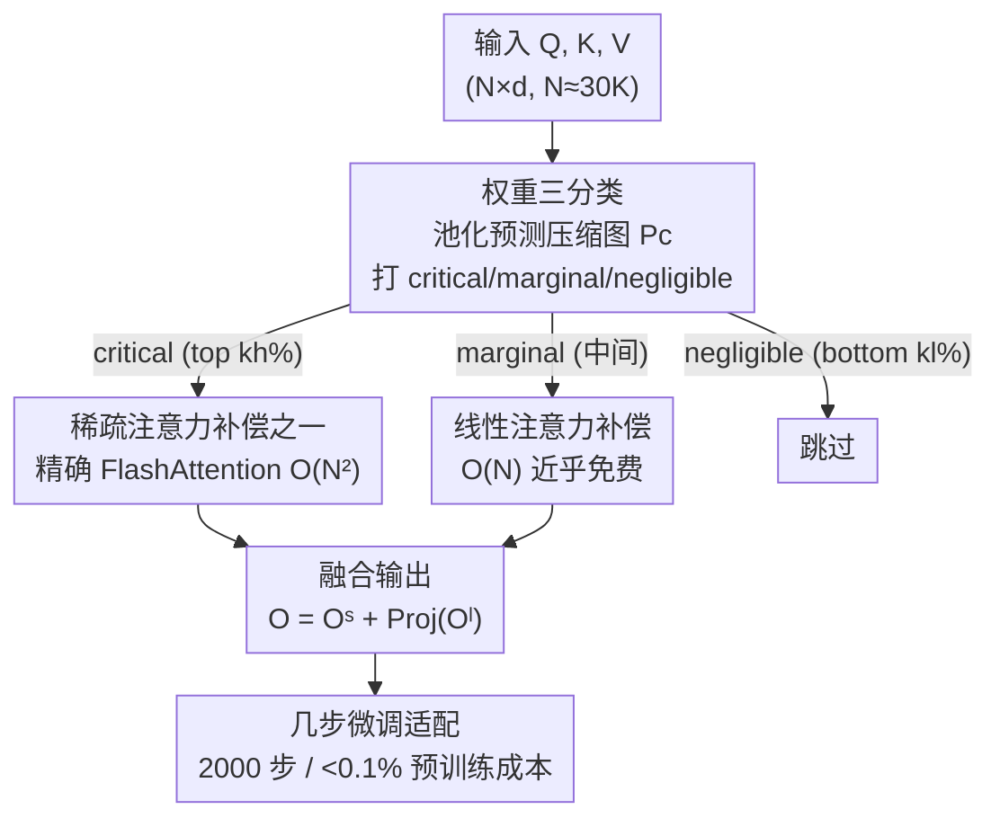

# SLA: Beyond Sparsity in Diffusion Transformers via Fine-Tunable Sparse–Linear Attention

**会议**: ICLR 2026  
**OpenReview**: [https://openreview.net/forum?id=eD8IPvNoZB](https://openreview.net/forum?id=eD8IPvNoZB)  
**代码**: https://github.com/thu-ml/SLA  
**领域**: 模型压缩 / 高效注意力 / 扩散模型  
**关键词**: 稀疏注意力, 线性注意力, 扩散 Transformer, 视频生成加速, GPU kernel

## 一句话总结
作者发现扩散 Transformer 的注意力权重可以拆成"少量高秩 + 大量极低秩"两部分，于是提出 SLA——对关键块用精确稀疏注意力、对边缘块用线性注意力、对可忽略块直接跳过，三者融进同一个 GPU kernel，只需几千步微调就把注意力计算量砍掉约 95%、端到端视频生成提速 2.2×，且画质几乎无损。

## 研究背景与动机

**领域现状**：在扩散 Transformer（DiT）尤其是视频生成里，序列长度动辄 10K–100K，注意力是唯一具有 $O(N^2)$ 复杂度的算子，成为最主要的计算瓶颈。现有提效路线分两类：一类是各种稀疏注意力（只算一部分注意力分数），另一类是少量线性注意力（把 softmax 重写成 $O(N)$ 的形式）。

**现有痛点**：两条路各有死穴。线性注意力在实践中经常失效，尤其在视频扩散上——已有线性注意力工作几乎只在图像生成上验证，一旦用到视频，画质会严重崩坏（论文里 Linear Only 的 VBench VA 分数直接掉到 0.04）。稀疏注意力则很难做到很高稀疏度，序列长度 50K 以下通常只能到 40–60% 稀疏；个别号称 80–85% 的，也是在 100K–300K 的超长序列上取得的（序列越长越容易稀疏）。

**核心矛盾**：作者把注意力权重画出来后看到一个两难。由于 softmax 的指数放大，只有约 8.1% 的权重大于均值 $1/N$，而约 45% 的权重小于 $1/(100N)$。跳过最小的 45%（稀疏化）只引入 <3% 的 L1 误差，但若只保留最大的 8.1%（92% 稀疏），误差会陡增到约 33%。问题就出在 $1/(100N)$ 到 $1/N$ 之间那批"中等权重"：删了精度大跌，全算又把稀疏度压回去——这正是稀疏注意力卡在 90% 稀疏度上不去的根因。

**切入角度**：作者进一步把注意力权重矩阵 $P$ 按 top-8% / bottom-92% 拆开做秩分析，发现一个漂亮的结构——top-8% 那块的稳定秩和满注意力相当（高秩），而 bottom-92% 那块的秩极低（实测仅约 9）。高秩的部分天生适合稀疏加速，低秩的部分天生适合低秩/线性近似。

**核心 idea**：用一句话概括就是"稀疏算关键、线性补边缘、跳过可忽略"——把注意力权重分成 critical / marginal / negligible 三类，关键块用精确稀疏注意力、边缘块用近乎免费的线性注意力做可学习补偿、可忽略块直接丢，再用几步微调让模型适应，从而在不掉画质的前提下把稀疏度从 70% 推到 95%。

## 方法详解

### 整体框架

SLA（Sparse-Linear Attention）是一个可训练、可微的混合注意力算子：输入还是标准的 $Q, K, V \in \mathbb{R}^{N \times d}$，输出还是注意力结果 $O$，但中间把"算哪些、怎么算"重新分配了。整体分三步：先用池化后的 $Q, K$ 快速预测一张块级别的压缩注意力图，按权重大小把每个块打成三类；然后关键块走精确稀疏 FlashAttention（$O(N^2)$）、边缘块走线性注意力（$O(N)$）、可忽略块跳过；最后把两路输出相加（线性那一路再过一个可学习投影做分布对齐）。关键在于稀疏和线性两路被融进**同一个 GPU kernel**，前向反向都支持，所以能真正落地成加速而非纸面 FLOPs。

### 关键设计

**1. 高秩/低秩分解：把注意力拆成"稀疏的少数 + 低秩的多数"**

这是全文的立论根基，针对的就是"中等权重删不得也算不起"的核心矛盾。作者把注意力权重用稀疏 mask $M$ 写成两项之和：

$$P = \underbrace{P \odot M}_{\text{稀疏分量}} + \underbrace{P \odot (1-M)}_{\text{低秩分量}}$$

经验观察是：去掉 top 值之后剩下的矩阵稳定秩极低（bottom-92% 的秩只有约 9，而满矩阵秩 6226）。而线性注意力本质上就是一个秩至多为 $d$ 的低秩近似——以往线性注意力之所以失败，正是因为它被迫去逼近**整个**高秩的注意力，能力不够。SLA 的巧妙在于不让线性注意力背锅整个矩阵，而是只让它去近似那块**本来就低秩**的剩余分量，正好对上它的能力上限。

**2. 三分类与块级预测：用一张廉价压缩图决定每块怎么算**

针对"逐元素稀疏在 GPU 上低效"的问题，SLA 全程在块级别操作。它先对 $Q, K$ 沿 token 维做均值池化，算出一张压缩注意力图：

$$P_c = \mathrm{Softmax}\!\left(\mathrm{pool}(Q)\,\mathrm{pool}(K)^\top / \sqrt{d}\right) \in \mathbb{R}^{(N/b_q) \times (N/b_{kv})}$$

然后按行内排名给每个块打标签：top $k_h\%$ 标为 critical（$M_c=1$），bottom $k_l\%$ 标为 negligible（$M_c=-1$），中间剩下的标为 marginal（$M_c=0$）。三类分别对应"精确算 / 跳过 / 线性算"。预测本身只在 $N/b_q \times N/b_{kv}$ 的压缩尺度上做，开销极小，却决定了后面绝大部分计算的去留——这就是稀疏度能冲到 95% 的操作落点。

**3. 线性注意力作可学习补偿，而非近似：边缘块几乎免费地"救回"精度**

这是 SLA 区别于"稀疏+线性简单相加"的关键洞察。对 marginal 块（$M_c=0$），SLA 用线性注意力计算：

$$H_i = \sum_{j:M_c[i,j]=0} \phi(K_j)^\top V_j,\quad Z_i = \sum_{j:M_c[i,j]=0} \mathrm{rowsum}(\phi(K_j)^\top),\quad O_i^l = \frac{\phi(Q_i) H_i}{\phi(Q_i) Z_i}$$

最终输出为 $O = O^s + \mathrm{Proj}(O^l)$，其中 $\mathrm{Proj}$ 是一个可学习的线性变换，用来缓和 softmax 注意力和线性注意力之间的分布失配。作者特别强调：这里的线性注意力**不是去逼近边缘权重对应的真实输出**，而是充当一个"可学习的补偿项"去增强稀疏注意力——因为线性注意力单独根本逼近不了满注意力。所以它必须配合微调：把 SLA 直接替换原注意力后，在与预训练同分布的数据上微调几步，让模型自己学会怎么用这个补偿。由于线性注意力在 Wan2.1 上只占满注意力 <0.5% 的成本（$O(Nd^2)=0.004\times O(N^2 d)$，当 $N=32K, d=128$），等于"几乎免费"就把 90% 稀疏拉到 95% 稀疏还更准。

**4. 稀疏+线性融合进单一 GPU kernel（含反向）：让 FLOPs 削减真正变成 wall-clock 加速**

光有 FLOPs 下降不等于真加速。SLA 把两路计算融进一个 kernel：稀疏那路沿用 FlashAttention 的 online-softmax 块式累加 $O_i^s$；线性那路预先算好每个 $(K_j, V_j)$ 的 $h_j=\phi(K_j)^\top V_j$ 和 $z_j$，这样当某块判为 marginal 时只需做一次矩阵加法（$H_i \mathrel{+}= h_j$）就行，几乎零额外开销。反向传播同样融合：稀疏分量按 FlashAttention 的方式回传 $dQ, dK, dV$，线性分量按链式法则回传 $dQ^\phi, dK^\phi, dV$，且 $dH_i, dZ_i$ 也预计算后用矩阵加法聚合。正因为可微且前后向都高效，SLA 才能被"微调"而不只是"训练后插入"。

### 损失函数 / 训练策略
不引入额外 loss，直接用扩散模型原本的训练目标做微调。把原注意力替换成 SLA 后，在与预训练同分布的数据上微调约 2000 步（batch size 64），成本 <0.1% 的预训练量（约 8×H200 上 9 小时）。激活函数 $\phi$ 经消融选用 softmax，$k_h\%=5\%$、$k_l\%=10\%$，块大小 $b_q=b_{kv}=64$。

## 实验关键数据

模型用 Wan2.1-1.3B（视频，序列长 30K），图像实验用 LightningDiT（见附录）。视频质量用 VBench 多维度指标（VA/VT/IQ/OC/AQ/SC）+ Vision Reward（VR），效率用 FLOPs 与稀疏度。

### 主实验

| 方法 | VA ↑ | VT ↑ | VR ↑ | FLOPs ↓ | 稀疏度 ↑ |
|------|------|------|------|---------|---------|
| Full Attention | 76.78 | 82.88 | 0.059 | 52.75T | 0% |
| Sparge-F（训练free） | 0.002 | 0.026 | −0.216 | 7.91T | 85% |
| Sparge-T（可训练） | 73.83 | 77.87 | 0.014 | 7.38T | 84% |
| VMoBa | 32.33 | 35.79 | −0.175 | 7.91T | 85% |
| VSA | 55.37 | 64.61 | −0.069 | 5.92T | 89% |
| **SLA** | **76.96** | **83.92** | **0.048** | **2.74T** | **95%** |

SLA 在 95% 稀疏（FLOPs 仅 2.74T，约 19.3× 效率增益）下，VA/VT 甚至略超满注意力，而所有 baseline 在更低稀疏度下质量都明显更差——其中纯训练-free 的 Sparge-F、VMoBa 在 VA/VT 上几乎崩盘。值得注意：SLA 在 95% 稀疏的计算量差不多只有 90% 稀疏注意力的一半（因为线性那路几乎免费）。

### 消融实验

| 配置 | VA ↑ | VT ↑ | FLOPs ↓ | 稀疏度 | 说明 |
|------|------|------|---------|--------|------|
| Full Attention | 76.78 | 82.88 | 52.75T | 0% | 上界 |
| Linear Only | 0.042 | 0.099 | 0.10T | 100% | 纯线性，画质崩 |
| Sparse Only | 64.00 | 70.50 | 7.91T | 85% | 只留稀疏那路 |
| L+S | 29.65 | 41.15 | 5.37T | 90% | 稀疏+线性直接相加 |
| **SLA (softmax)** | **76.96** | **83.92** | 2.73T | 95% | 完整模型 |
| SLA (elu+1) | 75.50 | 81.01 | 2.74T | 95% | 换激活 |
| SLA (Top 10%) | 75.29 | 82.20 | 5.38T | 90% | $k_h$ 调大 |
| SLA (Top 20%) | 75.81 | 83.82 | 10.65T | 80% | $k_h$ 更大 |

微调步数消融（VA）：0 步 41.11 → 250 步 64.46 → 1000 步 74.58 → 2000 步 76.96，说明 SLA 必须微调才能让线性补偿生效。

### 关键发现
- **三路缺一不可，且"融合"远胜"相加"**：Linear Only 直接崩（VA 0.04），Sparse Only 只有 64.0，最能说明问题的是 L+S——把稀疏和线性输出**直接相加**只有 29.65，而 SLA 的可学习投影 + 微调融合却能到 76.96。这证明线性那路的价值在于"被学出来的补偿"，而不是几何意义上的输出叠加。
- **$k_h$（critical 比例）是质量-效率旋钮**：Top 5% 就够好（95% 稀疏、VA 76.96），调到 Top 10%/20% 质量没明显涨、FLOPs 反而翻几倍，说明大多数块本就属于低秩可线性化的范畴。
- **真实 wall-clock 加速**：在 RTX5090 上前向比 FlashAttention2 快 13.7×、反向快 6.8×；端到端把注意力延迟从 97s 压到 11s（8.8×），整体视频生成提速 2.2×，此时注意力时间几乎可忽略。

## 亮点与洞察
- **把"分类难题"转成"结构难题"**：别人纠结于"中等权重删还是不删"，作者用秩分析指出剩余权重本就低秩，于是顺理成章地交给天生低秩的线性注意力——这是把一个阈值取舍问题重构成了一个矩阵分解问题，很优雅。
- **"补偿"而非"近似"的视角转换很关键**：线性注意力一直被当成 softmax 的廉价替身且屡屡失败，SLA 反过来只让它当稀疏注意力的可学习补偿项，配合微调，反而把它的"低秩"短板变成了对口的长处。
- **可迁移性强**：高秩/低秩分解 + 三分类 + 单 kernel 融合这套思路，原则上可推广到任何长序列 Transformer（语言模型长上下文、其他模态 DiT），只要满足"少数高秩 + 多数低秩"的权重结构即可。

## 局限与展望
- **依赖微调**：SLA 不是训练-free 的，0 步时质量很差（VA 41.11），必须微调约 2000 步才达标——对无法访问训练数据/算力的场景不友好，相比 Sparge-F 这类 training-free 方法是个门槛。
- **结构假设的普适性存疑**：高秩/低秩分解是在 Wan2.1 等模型上观察到的；若某些模型/层的注意力并不满足"bottom 部分极低秩"，线性补偿的有效性会打折，论文未系统刻画在何种条件下分解会失效。
- **主战场是视频**：核心结论建立在 30K 序列的视频生成上，图像（LightningDiT）和 MM-DiT 只在附录验证；更长序列（100K+）下 $k_h, k_l$ 是否仍是最优、误差是否累积，值得进一步考察。

## 相关工作与启发
- **vs 稀疏注意力（VSA / VMoBa / SpargeAttn）**：它们只做"算关键、跳其余"，因此稀疏度被中等权重卡在 ~90%；SLA 多了一条几乎免费的线性补偿路，把被跳过那批的低秩信息救回来，于是能上 95% 还更准。
- **vs 线性注意力（图像扩散里的线性化工作）**：它们让线性注意力逼近整个高秩注意力，在视频上必然崩；SLA 只让线性注意力接管本就低秩的剩余分量，并显式加可学习投影对齐分布。
- **vs L+S（朴素稀疏+线性相加）**：同样两路，但简单相加只有 29.65，SLA 靠微调 + Proj 融合到 76.96，差距说明"如何融合"比"用哪两路"更重要。

## 评分
- 新颖性: ⭐⭐⭐⭐⭐ 高秩/低秩分解 + 稀疏-线性融合，是注意力提效里一个干净且少见的新角度
- 实验充分度: ⭐⭐⭐⭐ 主实验/消融/效率/微调步数都覆盖到，但视频外的模态主要在附录
- 写作质量: ⭐⭐⭐⭐⭐ 动机—观察—方法—kernel 一条线讲得很清楚，图表支撑到位
- 价值: ⭐⭐⭐⭐⭐ 真·端到端 2.2× 加速 + 开源 kernel，对视频 DiT 落地很实用

<!-- RELATED:START -->

## 相关论文

- [\[CVPR 2026\] Trainable Log-linear Sparse Attention for Efficient Diffusion Transformers](../../CVPR2026/model_compression/trainable_log-linear_sparse_attention_for_efficient_diffusion_transformers.md)
- [\[ICLR 2026\] FASA: Frequency-Aware Sparse Attention](fasa_frequency-aware_sparse_attention.md)
- [\[ICLR 2026\] Ensembling Pruned Attention Heads for Uncertainty-Aware Efficient Transformers](ensembling_pruned_attention_heads_for_uncertainty-aware_efficient_transformers.md)
- [\[CVPR 2026\] BinaryAttention: One-Bit QK-Attention for Vision and Diffusion Transformers](../../CVPR2026/model_compression/binaryattention_one-bit_qk-attention_for_vision_and_diffusion_transformers.md)
- [\[ICLR 2026\] MaskPro: Linear-Space Probabilistic Learning for Strict (N:M)-Sparsity on LLMs](maskpro_linear-space_probabilistic_learning_for_strict_nm-sparsity_on_llms.md)

<!-- RELATED:END -->
