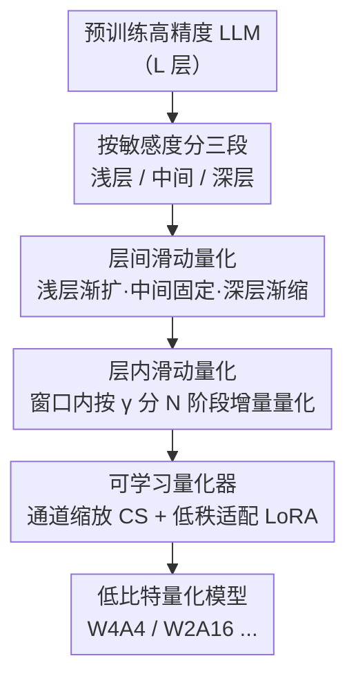

# SliderQuant: Accurate Post-Training Quantization for LLMs

**会议**: ICLR 2026  
**OpenReview**: [https://openreview.net/forum?id=YNqZqw4fLT](https://openreview.net/forum?id=YNqZqw4fLT)  
**代码**: https://github.com/deep-optimization/SliderQuant  
**领域**: 模型压缩  
**关键词**: 后训练量化, LLM, 滑动窗口, 层敏感度, 低比特量化

## 一句话总结
SliderQuant 发现 LLM 的浅层/深层（尤其是第一层和最后一层）对量化远比中间层敏感，于是用「层间滑动窗口（浅层渐扩、中间固定、深层渐缩）+ 层内增量量化」这套自适应滑动量化框架，在 W4A4、W2A16 等极低比特设置下显著超过 GPTQ / OmniQuant / CBQ 等现有 PTQ 方法。

## 研究背景与动机

**领域现状**：后训练量化（PTQ）是部署 LLM 的主流压缩手段——只用少量校准样本就能把高精度权重/激活换成低精度版本，不需要昂贵的重训练。现有方法几乎都建立在「顺序量化框架」上：把模型切成等大小的不相交片段，从第一段到最后一段逐段量化。按窗口大小不同，可分为 layer-wise（GPTQ、SmoothQuant，一层一段）、block-wise（OmniQuant、FlatQuant，一个注意力块一段）和 multi-block-wise（QLLM、CBQ，用固定大小滑动窗口跨多块）三类。

**现有痛点**：这些方法在公式形式上**对所有层一视同仁**——无论 layer-wise 还是 block-wise，都用同一套窗口大小和移动步长去量化每一层。这在 8-bit 这类温和设置下问题不大（总量化误差本来就小），但作者怀疑在 4-bit 权重-激活量化这种激进设置下并非最优。

**核心矛盾**：作者用 SmoothQuant、OmniQuant、CBQ 三个代表方法在 W4A4 下做了系统的逐层敏感度分析，得到三条关键观察：（1）中间层对量化的影响远小于浅层/深层，即**浅层和深层更敏感、中间层更好量化**；（2）在浅层/深层里，**第一层和最后一层量化误差显著最大**——因为它们分别负责最基础的特征提取和最终的特征抽象；（3）随着顺序量化推进，误差会逐层放大，而现有方法因为「层层平等」的前提，抑制这种累积的能力很差。一句话：层与层的量化难度天差地别，但现有框架假装它们都一样。

**本文目标**：设计一个仍用固定比特宽度、但能（a）对浅层/深层（尤其首尾层）给予特殊关照、（b）在相邻层之间建立量化协同来抑制误差累积的改进顺序量化框架。

**核心 idea**：用「自适应滑动窗口」代替「固定滑动窗口」——让窗口大小沿着浅层→中间→深层动态变化（渐扩、固定、渐缩），并在每个窗口内再做增量式的层内滑动，用极少量可学习参数把量化协同铺满整个网络。

## 方法详解

### 整体框架

SliderQuant 仍属于顺序量化框架，但把「窗口」这个概念用到了极致。基础概念是**固定大小滑动量化**：一个窗口 $\{s, i\}$ 沿层方向滑动（$s$ 是窗口大小、$i$ 是每步移动步长），相邻窗口重叠 $s-i$ 层，逐窗口最小化输出特征的重建误差 $\arg\min_{\hat{W}} \|F(W, X) - F(\hat{W}, X)\|_2^2$。当 $i=s$（无重叠）且 $s$ 取 1 层/1 块/多块时，它就退化成了 layer-wise / block-wise / multi-block-wise——也就是说现有方法都是固定滑动量化的特例。窗口越大精度越好，但显存开销也越大。

在这个基础上，SliderQuant 加了两个新组件来填补「层层平等」留下的空缺。**层间滑动量化（Inter-Layer）** 把模型分成浅层（$L_s$ 层）、中间层、深层（$L_d$ 层）三段，分别配三种窗口：浅层用**渐扩窗口**、中间用**固定窗口**、深层用**渐缩窗口**，在三段交界处各放一个重叠层做平滑接力。**层内滑动量化（Intra-Layer）** 则作用在每一个当前窗口内部，把窗口里所有层沿权重/激活维度按比例 $\gamma$ 分成 $N=1/\gamma$ 个阶段增量量化。最后所有层的量化都通过同一个量化器完成，量化器用「通道缩放（CS）+ 低秩适配（LoRA）」的可学习参数去抑制权重和激活的离群值。

### 关键设计

**1. 层间滑动量化：用三种窗口形状匹配三段层的不同敏感度**

这一步直接针对「浅层/深层敏感、首尾层最敏感、误差逐层放大」三条观察。作者不再用一个固定窗口扫完全网，而是按层位置给三段配三种窗口形状。对 $L_s$ 个**浅层**用**渐扩滑动窗口（PESW）**：从只量化第一层（窗口大小 1）开始，把第一层当锚点，每步窗口大小 +1，直到覆盖所有浅层——这样**第一层会出现在每一个扩展窗口里**，建立起密集的「局部到全局」协同，反复关照最敏感的首层。对 $L_d$ 个**深层**用对称的**渐缩滑动窗口（PCSW）**：从一次性量化所有深层开始，每步窗口 -1，直到只剩最后一层，把最后一层当锚点反复关照，建立「全局到局部」协同。对中间层用 $\{s=2, i=1\}$ 的**固定窗口（FSSW）**，并在浅/中、中/深交界处各设一个重叠层，既做平滑接力、又让每个中间层的量化频率均匀。三种窗口顺序衔接，就把「各层敏感度不同」这条经验直接编码进了量化调度里。消融显示 PESW 和 PCSW 各自单独加入都能大幅降低困惑度（Llama2-7B W4A4 从基线 12.73 分别降到 10.34 / 10.30）。默认 $L_s = L_d = 4$ 是精度-效率的折中。

**2. 层内滑动量化：在每个窗口内部再做一次增量量化**

层间设计解决的是「窗口之间」的协同，但单个窗口内部的多层仍是一次性联合量化。层内滑动量化把「渐扩」的思路下沉到窗口内部：当前窗口的 $s$ 层沿权重和激活维度按比例 $\gamma$ 并行做渐扩滑动，使联合量化在 $N = 1/\gamma$ 个阶段里增量完成。默认 $\gamma = 0.5, N = 2$——第一阶段先联合量化窗口内权重/激活矩阵的前一半，第二阶段再联合量化包含前一半在内的全部矩阵。这样在窗口**内部**也建立起一条「局部到全局」的参数协同路径，进一步压低量化误差。消融里 $\gamma=0.5$ 是最优点（W4A4 10.34），比 $\gamma=1$ 的一次性量化（即基线 12.73）显著更好，但分得太细（$\gamma=0.25$，10.34→11.32）反而变差，说明阶段数过多会让早期阶段在信息不全时过早定型。

**3. 可学习量化器：通道缩放 + 低秩适配联合抑制离群值**

无论窗口怎么滑，最终每层的权重和激活都要落到量化器里，而离群值是低比特量化误差的主要来源。SliderQuant 直接借鉴并组合了两种成熟手段：通道缩放（CS）和低秩适配（LoRA）。对第 $i$ 层权重 $W_i$ 和输入 $X_i$，先做 $\tilde{X}_i = X_i \oslash \alpha_i$、$\tilde{W}_i = W_i \odot \alpha_i + A_i B_i$，其中 $\alpha_i$ 是可学习的通道缩放向量（把激活离群值缩小、对应权重放大，把量化难度从难量化的激活转移到好量化的权重），$A_i \in \mathbb{R}^{n \times r}$、$B_i \in \mathbb{R}^{r \times m}$（$r=4$）是两个低秩矩阵用来精修权重；再走 $X_{i+1} = \text{quantizer}(\tilde{X}_i) \cdot \text{quantizer}(\tilde{W}_i)$。整套用统一量化器（uniform quantizer），只引入极少量可学习参数，保证和现有 PTQ 方法公平对比。SliderQuant+ 则在此基础上额外叠加旋转变换，用于精度更敏感的场景。

### 损失函数 / 训练策略

优化目标就是每个窗口的输出特征重建 MSE（式 1），权重-激活量化时把 $F(\hat{W}, X)$ 换成 $F(\hat{W}, \hat{X})$（输入先量化）。校准样本数 $c=128$，低秩维度 $r=4$，浅/深层数 $L_s=L_d=4$，层内阶段比例 $\gamma=0.5$。整个框架对权重-only 和权重-激活量化通用。

## 实验关键数据

### 主实验

语言生成（困惑度，越低越好）与零样本常识推理（准确率，越高越好），无额外推理开销的方法对比：

| 模型 / 设置 | 指标 | 之前最好 | SliderQuant | 说明 |
|------|------|------|------|------|
| Llama2-7B W4A4 | WikiText2 ↓ | 12.73 (CBQ) | **8.34** | 极低比特优势最明显 |
| Llama3-8B W4A4 | WikiText2 ↓ | 35.97 (CBQ) | **15.47** | 难量化模型差距巨大 |
| Llama2-7B W2A16 | WikiText2 ↓ | 12.10 (CBQ) | **9.59** | 2-bit 仍稳健 |
| Qwen2.5-14B W4A4 | 7 任务平均 acc ↑ | 53.50 (CBQ) | **58.96** | 常识推理 +5.5 |
| Llama2-13B W4A4 | 7 任务平均 acc ↑ | 54.67 (CBQ) | **56.77** | — |

带旋转变换的 SliderQuant+ 在 Llama2-7B/13B/70B、Llama3-8B 的 W4A4 上也全面超过 QuaRot、SpinQuant、FlatQuant 等最新旋转类方法（如 Llama2-13B W4A4 平均 acc 71.22 vs FlatQuant 70.38，已接近 FP16 的 71.69）。在 MoE 模型 Qwen3-30B-A3B 和 DeepSeek-R1 蒸馏模型上同样有效：R1-Distill-Qwen-32B 在 W4A16 下数学/代码平均 82.71 vs FP16 的 83.17，近乎无损。

### 消融实验

Llama2-7B，固定窗口 $\{s=2,i=1\}$ 为基线（Table 8）：

| 配置 | W4A4 Wiki ↓ | W2A16 Wiki ↓ | 说明 |
|------|---------|---------|------|
| 基线（固定窗口） | 12.73 | 12.10 | multi-block-wise 起点 |
| + PESW（浅层渐扩） | 10.34 | 10.71 | 单独加就大幅提升 |
| + PCSW（深层渐缩） | 10.30 | 10.67 | 与 PESW 效果相当 |
| + Intra-S（层内增量） | 9.84 | 10.92 | 窗口内协同 |
| Inter-S（PESW+PCSW） | 9.13 | 10.53 | 层间双窗口 |
| Full（Inter-S + Intra-S） | **8.34** | **9.59** | 完整模型 |

### 关键发现

- **三种窗口形状缺一不可**：PESW 和 PCSW 单独加入就把 W4A4 困惑度从 12.73 拉到 ~10.3，证实「浅深层敏感、需特殊关照」这条经验的价值；层间+层内耦合才到 8.34，验证多层级设计的必要性。
- **层内阶段数有甜点**：$\gamma$ 从 1→0.5 提升明显（12.73→10.34），但继续细分到 0.25 反而退化到 11.32，说明增量阶段不是越多越好。
- **$L_s, L_d$ 边际递减**：从 2 增到 6，W4A4 困惑度 10.23→8.94 持续改善，但 4 之后提升变小，故默认取 4 平衡显存与精度。
- **越激进越受益**：W4A4、W2A16 这类极端设置下相对优势最大，而 W4A16 这种温和设置下各方法差距收窄——印证了「层层平等假设在低比特下才暴露问题」的出发点。

## 亮点与洞察
- **把「层敏感度差异」这条被忽视的经验观察直接编码进量化调度**，而不是去改量化器本身——这是一个很干净的正交贡献，可叠加在旋转变换等已有技术之上（SliderQuant+ 就是证明）。
- **渐扩/渐缩窗口让首尾层反复出现在每个窗口里**，等价于给最敏感的层「加权关照」，却不需要混合精度（不像 SpQR/QUIK 要把离群值单独存 FP16），实现上更硬件友好。
- **同一套滑动概念统一了 layer/block/multi-block-wise**——把它们都看成固定滑动的特例，这个视角本身就很有启发：现有顺序量化方法只是在窗口参数空间里取了几个特殊点，而 SliderQuant 探索了「窗口形状随深度变化」这个更大的设计空间。
- 渐扩→固定→渐缩的形状设计可迁移到任何「不同位置重要性不同」的顺序处理任务（如逐层剪枝、逐层知识蒸馏）。

## 局限与展望
- 窗口越大精度越好但显存/计算开销随之上升，浅深层渐扩/渐缩本质上是在拉大有效窗口，量化阶段的资源成本高于纯 layer-wise 的 GPTQ；论文用 $L_s=L_d=4$ 折中，但没给出量化耗时的细致对比。
- 三段划分的边界（浅/中/深各多少层）和 $\gamma$、$r$ 等超参靠消融经验选定，对不同架构/规模是否需要重新搜索、迁移性如何，论文未充分展开。
- 「首尾层最敏感」的结论基于 Transformer dense/MoE LLM，是否适用于其他架构（如状态空间模型）需要验证。

## 相关工作与启发
- **vs CBQ / QLLM（multi-block-wise）**: 它们用**固定大小**滑动窗口跨多块，对所有层一视同仁；SliderQuant 让窗口形状随深度自适应变化（渐扩/固定/渐缩），是固定滑动的严格超集，在 W4A4 下把 Llama2-7B 困惑度从 CBQ 的 12.73 降到 8.34。
- **vs OmniQuant / FlatQuant（block-wise）**: 它们以注意力块为粒度逐块量化、块间无重叠协同；SliderQuant 用重叠窗口建立跨层误差抑制路径，并对首尾层特殊关照。
- **vs SpQR / QUIK / LLM-MQ（混合精度）**: 它们把离群值单独存 FP16 实现混合精度，硬件不友好；SliderQuant 用全精度统一比特宽度 + 滑动协同，在更低比特下反而精度更高（Table 6/7）。
- **vs QuaRot / SpinQuant / FlatQuant（旋转类）**: 旋转变换会引入不可吸收的额外推理开销；SliderQuant 本体无额外开销，且与旋转正交——SliderQuant+ 叠加旋转后进一步超过这些方法。

## 评分
- 新颖性: ⭐⭐⭐⭐⭐ 「层敏感度差异 → 自适应滑动窗口形状」是一个被忽视且优雅的新视角，统一并推广了现有顺序量化框架。
- 实验充分度: ⭐⭐⭐⭐⭐ 覆盖 5 个模型家族、7B-70B、W4A16/W3/W2/W4A4、MoE 与 R1 推理模型，消融翔实。
- 写作质量: ⭐⭐⭐⭐ 经验观察→设计动机的逻辑链清晰，但量化成本/耗时对比偏弱。
- 价值: ⭐⭐⭐⭐⭐ 即插即用、可叠加旋转，在极低比特下显著提升，对 LLM 实际部署有直接意义。

<!-- RELATED:START -->

## 相关论文

- [\[ICLR 2026\] Post-Training Quantization for Video Matting](post-training_quantization_for_video_matting.md)
- [\[ICLR 2026\] Training Dynamics Impact Post-Training Quantization Robustness](training_dynamics_impact_post-training_quantization_robustness.md)
- [\[ICLR 2026\] PTQ4ARVG: Post-Training Quantization for AutoRegressive Visual Generation Models](ptq4arvg_post-training_quantization_for_autoregressive_visual_generation_models.md)
- [\[CVPR 2025\] Q-DiT: Accurate Post-Training Quantization for Diffusion Transformers](../../CVPR2025/model_compression/q-dit_accurate_post-training_quantization_for_diffusion_transformers.md)
- [\[ICLR 2026\] Quant-dLLM: Post-Training Extreme Low-Bit Quantization for Diffusion Large Language Models](quant-dllm_post-training_extreme_low-bit_quantization_for_diffusion_large_langua.md)

<!-- RELATED:END -->
