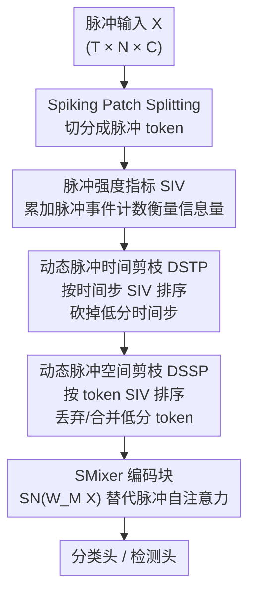

# SMixer: Rethinking Efficient-Training and Event-Driven SNNs

**会议**: ICLR 2026  
**OpenReview**: [https://openreview.net/forum?id=78glEsQB0v](https://openreview.net/forum?id=78glEsQB0v)  
**领域**: 模型压缩 / 脉冲神经网络  
**关键词**: 脉冲神经网络, 事件驱动, 高效训练, 特征剪枝, Token Mixer

## 一句话总结
针对脉冲神经网络（SNN）"高性能架构不是真·事件驱动、训练开销又大"的两难，本文以可在异步芯片上落地的 Spiking-token Mixer（SMixer）为骨干，再叠加一套零可训练参数的动态时空脉冲剪枝框架 DSTSP，在保持精度的同时把训练显存和能耗砍掉一半左右。

## 研究背景与动机

**领域现状**：SNN 用异步二值脉冲传递信息，神经元只在脉冲到达时才更新膜电位，天然跳过零值计算，因此特别适合 TrueNorth、Loihi 这类神经形态芯片，被视为低功耗计算的有希望路线。目前主流做法是把 ANN 里的先进架构搬到脉冲域：Spiking CNN、Spiking Transformer 等。

**现有痛点**：两条路都不理想。Spiking ResNet/CNN 精度明显偏低；高性能的 Spiking Transformer（Spikformer 系列）虽然刷到 SOTA，但其核心的 Spiking Self-Attention（SSA）依赖两个脉冲矩阵 $Q$、$K$ 相乘——在异步芯片上脉冲到达时间不精确，这种乘法会产生显著的计算偏差，导致性能严重退化。也就是说，SSA **并不是真正的事件驱动**，无法部署到异步神经形态硬件上。与此同时，SNN 训练开销极大：部署前要在 GPU 上训练，而 GPU 无法以事件驱动方式跑 SNN，连零值特征也要消耗算力；加上神经元固有的时间步和隐状态，进一步吃掉计算资源。

**核心矛盾**：事件驱动友好性、训练开销、性能这三者很难同时满足。SSA 性能高但不事件驱动；CNN 事件驱动但性能差；而所有方案都没解决训练成本问题。

**本文目标**：作者主张一个"合理的 SNN 架构"应同时具备三大特征——完全事件驱动、低训练开销、有竞争力的性能，并据此设计满足全部三点的网络。

**切入角度**：在架构侧，选用 Spiking-token Mixer（STMixer）替代 SSA——它把 $Q$、$K$ 之间的脉冲矩阵相乘换成一个可学习权重矩阵 $W_M$ 去拟合注意力图，从而避免脉冲矩阵相乘，对异步硬件友好。在效率侧，作者观察到 SNN 发放率本就很低、特征高度冗余且集中在特定时空区域，因此剪枝是天然的提速手段，但 SNN 剪枝面临"非结构化权重剪枝几乎不带来实际加速、且要更高剪枝率（≥0.3）"的难题，促使作者转向**结构化的特征剪枝**。

**核心 idea**：用可学习的 token mixing 矩阵替代脉冲自注意力以保证真·事件驱动；再用一个无可训练参数、基于脉冲计数统计的时空特征剪枝框架，直接砍掉低信息量的脉冲特征来加速训练。

## 方法详解

### 整体框架

方法分为"架构"和"剪枝"两层。架构层用 Spiking-token Mixer 作骨干：输入脉冲特征经 Spiking Patch Splitting（SPS）切分成 token，进入若干个由 SMixer 模块 + 脉冲 MLP 组成的编码块，最后接分类头。SMixer 模块的关键是把 SSA 的 $\mathrm{SN}(QK^TV)$ 换成 $\mathrm{SMixer}(X)=\mathrm{SN}(W_M X)$，其中 $W_M$ 是可学习的注意力权重矩阵，不再有脉冲矩阵相乘，因而可在异步芯片上运行。

剪枝层是核心贡献 DSTSP（Dynamic Spatial-Temporal Spiking Pruning）。它先用一个无参数的脉冲强度指标 SIV 度量每块脉冲特征的重要性，发现脉冲表示在时空上高度不均衡、绝大多数 token 信息量很低；据此先在**时间维**剔掉不重要的时间步、再在**空间维**剔掉低 SIV 的 token，把进入网络的特征量和神经元状态数都压下去，从而降低训练开销。整套剪枝只靠加法求和与排序，不引入任何可训练参数，契合 SNN 的脉冲驱动特性。

### 关键设计

**1. Spiking-token Mixer：用可学习矩阵替掉脉冲自注意力，换回真·事件驱动**

这一步直接针对"高性能 Spiking Transformer 不是事件驱动"的痛点。SSA 需要计算 $\mathrm{SSA}(Q,K,V)=\mathrm{SN}(QK^TV\cdot s)$，其中 $Q$、$K$、$V$ 都是脉冲形式（由 $\mathrm{SN}(\text{L-BN}(X))$ 得到），两个脉冲矩阵 $Q$、$K$ 相乘在异步硬件上会因脉冲到达时间不精确而产生大偏差。SMixer 把 $Q$、$K$ 这一对收敛成单个可学习矩阵 $W_M$，前向变成

$$\mathrm{SMixer}(X)=\mathrm{SN}(W_M X)$$

即在训练中让 $W_M$ 逐步拟合注意力图，避免脉冲对脉冲的矩阵相乘。这样既保留了 token mixing 的表达力，又让整个前向是"权重矩阵 × 脉冲输入"的形式，对异步神经形态芯片友好。实验显示，把三种 SOTA Spiking Transformer（SpikformerV2、QKFormer、SDT-V3）中的 SSA 换成 SMixer 后精度与原框架相当，说明它能作为一个通用的主流 SNN 原型。

**2. SIV 脉冲强度指标与时空冗余分析：用一次加法找出哪些脉冲特征可以扔**

要做剪枝，先得有个便宜可靠的重要性度量。作者定义 Spike Intensity Value（SIV）为某个指定特征区域内脉冲事件的总和——本质就是对脉冲求和。类比 ANN 里用激活幅值衡量语义信息，SIV 越高代表该区域语义信息越集中。在 DVS-Gesture 上的分析发现 SIV 分布极度不均衡：大量 token 的 SIV 很低（50% 的 token 落在很小的 SIV 区间内），且高 SIV 区域对应前景目标、低 SIV 区域对应背景。更关键的是只用高 SIV token 的模型精度远高于只用低 SIV token 的（97.9% vs 79.9%）。作者还用 RIE / MS-SSIM 分数对比了剪低 SIV（LP）、剪高 SIV（HP）、随机剪（RP）三种策略，并和 ANN-Transformer 上的 LP 做对照，得到两个结论：SIV 在 SNN 上比在 ANN 上更能暴露冗余；剪掉低 SIV 特征（LP）是 SNN 上信息保留最好的策略。这正是 DSTSP 的立论基础——SIV 计算只是一次简单求和，完全贴合 SNN 的运算特性。

**3. 动态脉冲空间剪枝 DSSP：按 token 的空间 SIV 排序，丢掉低信息 token 并裁剪权重矩阵**

DSSP 解决空间维冗余。对脉冲特征 $X\in S^{T\times N\times C}$（$T$ 时间步、$N$ token 数、$C$ 通道），先沿通道求和得到每个 token 的空间 SIV $I_S=\sum_{i=1}^{C}X[:,:,i]$，按 $I_S$ 降序排序，保留前 $N'=N\cdot(1-P_S)$ 个 token（$P_S$ 是空间剪枝率），其余丢弃或合并：

$$X'=X_i[:N'],\quad W_M'=W_M[N',N'],\quad \mathrm{SMixer}(X)=\mathrm{SN}(W_M'X')$$

注意 SMixer 的权重矩阵 $W_M$ 也要随之裁成 $N'\times N'$ 的"激活注意力权重" $W_M'$。对于 $W_M'$ 作者给了两种实现：一是把它当作静态的 $N'\times N'$ 矩阵；二是训练时随机选 $N'$ 个共享的行列索引、推理时再还原成全尺寸矩阵——两者推理精度几乎一致。被丢弃 token 默认用 Softmatch 策略合并处理，避免直接扔掉信息。

**4. 动态脉冲时间剪枝 DSTP：动态削减时间步与发放上限，直接砍神经元状态数**

DSTP 解决时间维冗余，也是 SNN 区别于 ANN 剪枝的特色。它从两方面剪：一是评估每个时间步的重要性、剔掉不显著的时间步。对 $X\in S^{T\times N\times C}$ 计算每个时间步的 SIV $I_T=\sum_{n=1}^{N}\sum_{i=1}^{C}X[:,n,i]$，降序排序后保留 $T'=T\cdot(1-P_T)$ 个时间步（$P_T$ 是时间剪枝率），得到 $X'=X_i[:T']$、再过脉冲神经元 $X''=\mathrm{SN}(X')$。二是动态约束神经元能发放的脉冲总数上限。由于时间步数直接决定神经元状态数和计算量，削减 $T$ 就直接降低了训练开销和推理延迟——实验里甚至能把时间步剪到 1。DSTSP 整体是"先时间后空间"顺序执行，两步都只用求和+排序，零可训练参数。

### 损失函数 / 训练策略

训练 epoch 数和超参与各原始模型保持一致。剪枝默认配置为空间剪枝率 $P_S=0.30$、时间步剪到 1（检测任务用 20% 空间剪枝率 + 单时间步）。DSTSP 直接嵌进训练循环，剪枝代价作为单一统一阶段计入，不额外引入训练负担。关于剪枝模块的放置位置，空间剪枝必须放在 SPS 模块之后（因为 SPS 的 2D 卷积依赖原始特征图的 H×W 尺寸），且训练+推理都开启剪枝（配置 B）效果最好。

## 实验关键数据

### 主实验

ImageNet-1K 上，DSTSP 在保持甚至略升精度的同时大幅降本（STMixer-8-768 上甚至 +0.2% 精度，显存降到原来的 76.44%、能耗降到 53.03%）：

| 方法 | 架构 | 时间步 | 显存(MB) | 能耗(mJ) | Top-1(%) |
|------|------|--------|----------|----------|----------|
| STMixer | STMixer-8-768 | 1 | 17008 | 4.45 | 76.68 |
| STMixer + DSTSP | STMixer-8-768 | 1 | 13002 | 2.36 | 76.87 |
| SpikformerV2→M | SpikformerV2-8-512 (T=1) | 1 | 5384 | 2.12 | 79.16 |
| SpikformerV2→M + DSTSP | SpikformerV2-8-512 (T=1) | 1 | 3368 | 1.98 | 78.99 |
| QKFormer→M + DSTSP | HST-10-512 | 1 | 9751 | 3.15 | 77.39 |

把三种 SOTA Spiking Transformer 的 SSA 换成 SMixer（→M）后精度与原框架相当；再叠 DSTSP，QKFormer/SDT-V3 变体掉点 <2%，SpikformerV2(T=4) 仅掉 1.3%，同时换来显著的显存/能耗/吞吐改善。

CIFAR 与神经形态数据集上，固定空间剪枝 0.30 + 时间步剪到 1，CIFAR-10/100 仅掉约 0.5%，CIFAR10-DVS、DVS128 掉点 <1%：

| 数据集 | SMixer | SMixer+DSTSP | 说明 |
|--------|--------|--------------|------|
| CIFAR-10 (T=4) | 96.01 | 95.67 | 静态图像 |
| CIFAR-100 (T=4) | 81.87 | 81.03 | 静态图像 |
| DVS128 (T=16) | 98.61 | 98.26 | 神经形态 |
| CIFAR10-DVS (T=16) | 83.02 | 82.34 | 神经形态 |

此外在时间序列预测（Metr-La/Pems-Bay/Solar/Electricity）上 SMixer 一致优于 Spikformer，叠 DSTSP 无明显退化；COCO 检测上 SMixer+DSTSP 用 39.2M 参数、21.2mJ 能耗拿到 mAP50 57.4（baseline 58.9）。

### 消融实验

CIFAR-100 上空间/时间剪枝率的权衡（默认 Softmatch 处理被剪 token）：

| $P_S$ | $P_T$ | 吞吐(im/s) | 显存 | FLOPs | CIFAR-100 Acc |
|-------|-------|-----------|------|-------|---------------|
| 0 | 0 | 266 | 5329M | 3.45G | 81.78 |
| 0.40 | 0 | 337 | 3498M | 2.72G | 80.81 |
| 0 | 0.50 | 671 | 3526M | 2.54G | 81.25 |
| 0.30 | 0.75 | 738 | 2346M | 2.04G | 81.03 |

时间剪枝几乎不掉点却大幅提吞吐（671 vs 266），空间+时间联合（0.30/0.75）在精度仅降 0.75 的情况下把吞吐提到 738、显存近乎减半。

### 关键发现
- **时间剪枝性价比最高**：单独剪时间步（$P_T=0.5$）几乎不掉精度（81.78→81.25），吞吐却从 266 飙到 671，说明 SNN 时间维冗余极重。
- **剪低 SIV 是正确方向**：剪枝策略对比中，剪高 SIV（HP）最差、精度跌到 78.11%（-2.92%），随机剪（RP）居中，剪低 SIV（DSTSP）最优 81.03%，印证 SIV 度量有效。
- **训练+推理都剪最好**：位置消融显示训练+推理都开启剪枝精度最高；仅训练剪枝也接近；仅推理剪枝最差。
- **SMixer 本身就够强**：在多个数据集上 SMixer（未剪枝）精度与 SSA 相当甚至更好，证明可学习 mixing 矩阵足以替代脉冲自注意力。

## 亮点与洞察
- **把"事件驱动"和"高性能"重新调和**：以往要么牺牲精度换事件驱动（CNN），要么牺牲事件驱动换精度（Transformer），SMixer 用一个可学习矩阵同时拿下两边，思路简洁。
- **零可训练参数的剪枝**：SIV 只是脉冲求和，DSSP/DSTP 全靠求和+排序，不像 ANN 剪枝要额外可训练 gate，这与 SNN 的加法/脉冲驱动特性高度契合，几乎不增训练负担。
- **时间维剪枝是 SNN 独有的提速杠杆**：直接削时间步数 = 减少神经元状态数，这是 ANN 没有的维度，且实测几乎免费提速，值得迁移到其他时序 SNN 任务。
- **即插即用**：DSTSP 能挂到 SpikformerV2/QKFormer/SDT-V3/SpikeYOLO 等多种框架上，泛化性好。

## 局限与展望
- 作者承认在更复杂的 COCO 检测上 DSTSP 会带来约 1.5 mAP 的下降（58.9→57.4），认为对如此精细的任务可接受，但说明高剪枝率在密集预测任务上仍有代价。
- 不同任务/不同时间步预算下的精度损失不可直接横比：分类掉点 <1%，检测掉点更明显，剪枝率需按任务重新调，缺乏统一的自适应剪枝率选择机制。
- SIV 只用脉冲计数衡量重要性，可能忽略时序顺序信息（同样脉冲数但分布不同的 token 被同等对待），这一假设的边界值得进一步分析。
- $W_M'$ 的两种实现（静态裁剪 vs 训练随机选索引、推理还原全矩阵）精度接近，但对异步硬件落地的实际差异未深入展开。

## 相关工作与启发
- **vs SSA / Spiking Transformer（Spikformer、QKFormer、SDT-V3）**：它们靠脉冲 $Q$、$K$ 相乘做注意力，性能 SOTA 但在异步芯片上有计算偏差、不是真事件驱动；SMixer 用单个可学习 $W_M$ 替代，牺牲极小精度换回事件驱动友好与可部署性。
- **vs STMixer（Deng et al. 2024）**：本文沿用其"可学习权重图融合脉冲 token 特征、消除脉冲矩阵相乘"的骨干思想，但首次为这类 Mixer 架构量身设计高比例特征剪枝，填补了 SMixer 上剪枝研究的空白。
- **vs 传统 SNN 权重剪枝（Grad R、RCMO-SNN、SparseSpikformer、Spatial-Temporal Spiking Feature Pruning 等）**：传统方法多是非结构化突触/权重剪枝，实际加速有限且常带额外训练开销；DSTSP 改为结构化的脉冲特征剪枝、零可训练参数、把剪枝并入训练循环，在三项基准（剪枝成本/稀疏度/精度退化）上取得最小性能损失。

## 评分
- 新颖性: ⭐⭐⭐⭐ 首次为 Spiking-token Mixer 设计高比例时空特征剪枝，SIV+DSTSP 组合简洁有效。
- 实验充分度: ⭐⭐⭐⭐ 覆盖分类/时序/检测、静态+神经形态多数据集，消融完整；但部分对比依赖附录。
- 写作质量: ⭐⭐⭐⭐ 动机—架构—剪枝逻辑清晰，符号偶有不一致（STP/DSTSP 混用）。
- 价值: ⭐⭐⭐⭐ 同时改善事件驱动性、训练显存与能耗，对 SNN 落地神经形态硬件有实际意义。

<!-- RELATED:START -->

## 相关论文

- [\[ICLR 2026\] Memba: Membrane-driven Parameter-Efficient Fine-Tuning for Mamba](memba_membrane-driven_parameter-efficient_fine-tuning_for_mamba.md)
- [\[ICLR 2026\] INSTANT: Compressing Gradients and Activations for Resource-Efficient Training](instant_compressing_gradients_and_activations_for_resource-efficient_training.md)
- [\[ICLR 2026\] Rethinking Residual Errors in Compensation-based LLM Quantization](rethinking_residual_errors_in_compensation-based_llm_quantization.md)
- [\[ICLR 2026\] Rethinking Continual Learning with Progressive Neural Collapse](rethinking_continual_learning_with_progressive_neural_collapse.md)
- [\[CVPR 2025\] DELT: A Simple Diversity-driven EarlyLate Training for Dataset Distillation](../../CVPR2025/model_compression/delt_a_simple_diversity-driven_earlylate_training_for_dataset_distillation.md)

<!-- RELATED:END -->
