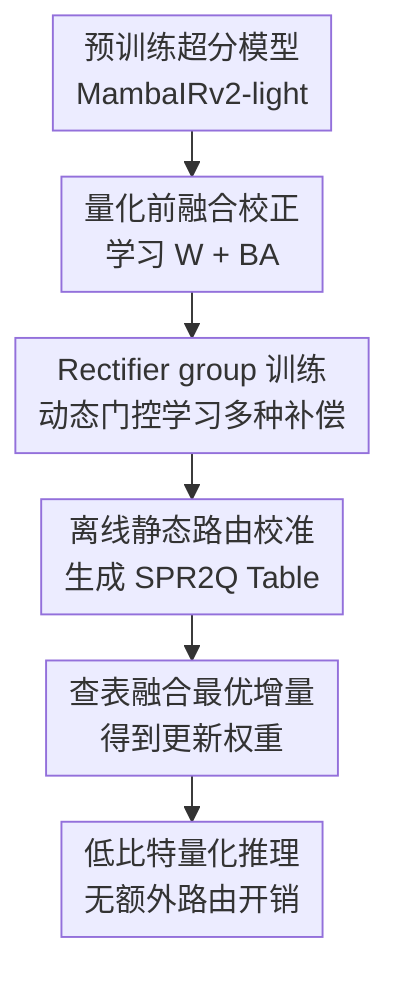

# SPR$^2$Q: Static Priority-based Rectifier Routing Quantization for Image Super-Resolution

**会议**: ICLR 2026  
**OpenReview**: [https://openreview.net/forum?id=8tDIzHFOx6](https://openreview.net/forum?id=8tDIzHFOx6)  
**代码**: 无  
**领域**: 模型压缩  
**关键词**: 后训练量化, 超分辨率, Mamba量化, 低秩校正器, 静态路由

## 一句话总结
SPR$^2$Q 面向图像超分辨率模型的极低比特后训练量化，在量化前用一组低秩 rectifier 学习补偿权重增量，再通过离线静态优先级路由把最合适的增量融合进各层权重，从而在 4-bit、2-bit 甚至 1-bit 下显著缓解 MambaIRv2-light 的细节恢复损失且不增加推理开销。

## 研究背景与动机
**领域现状**：图像超分辨率模型从 CNN、Transformer 发展到 Mamba/SSM 架构后，重建质量越来越高，但部署成本也更敏感。低比特量化是把这些模型落到真实设备上的重要手段：它把浮点权重和激活压到 4-bit、2-bit 甚至更低，以换取模型尺寸、FLOPs 和推理速度收益。

**现有痛点**：主流量化路线可以分为 QAT 和 PTQ。QAT 精度通常更稳，但训练成本高，甚至接近重新训练全精度模型；PTQ 更适合快速部署，只在训练后校准量化器边界或重构权重，但在超分这种像素级任务上特别容易损失纹理和边缘。尤其是 MambaIRv2 这类 Mamba 超分模型，内部有递归状态和动态门控，简单照搬分类或语言模型里的 Mamba 量化方法，会在高频细节区域累积数值误差。

**核心矛盾**：现有 PTQ 大多把预训练权重视为固定对象，只调量化器的 clipping range 或重构误差。可是在 2-bit/4-bit 这样的激进压缩下，量化误差已经不只是边界选得好不好，而是模型本身缺少主动适应量化扰动的能力。若只调量化器，模型无法提前把将要丢掉的信息编码进更抗量化的权重形态。

**本文目标**：作者希望保留 PTQ 的低成本和无推理额外开销，同时让模型在量化前获得少量可学习的补偿能力。具体来说，方法要解决三件事：一是给原始权重注入对量化误差有针对性的补偿信息；二是避免单个低秩补偿器表达单一、对不同层和不同信息类型适配不足；三是让多补偿器的选择在推理时不引入动态路由开销。

**切入角度**：论文借鉴 LoRA 的低秩增量思想，但目标不是高效微调新任务，而是在量化前学习一组可以被融合进权重的 rectifier。这样量化器面对的不是原始权重 $W$，而是已经被修正过的 $W+\Delta W$；量化后模型仍然是普通的低比特模型，不需要额外分支。

**核心 idea**：SPR$^2$Q 用“量化前低秩校正 + 离线静态路由”替代单纯校准量化器，让补偿信息先进入权重，再被量化成最终模型。

## 方法详解
### 整体框架
SPR$^2$Q 的整体流程分成三个阶段：先训练低秩 rectifier，让它们学会补偿量化后的像素与中间特征误差；再把单个 rectifier 扩展成 rectifier group，并通过动态路由训练出多样化补偿能力；最后离线校准每个模块该使用哪些 rectifier 权重，把结果写入固定的 SPR$^2$Q Table，推理时直接查表融合、量化并前向计算。它的关键不是在推理时多跑一个专家路由，而是把所有选择都提前压成静态权重增量。

从数学上看，基础 PTQ 先把输入或权重裁剪到 $[a,b]$，再按 bit width $n$ 离散化：步长 $s=(b-a)/(2^n-1)$，量化-反量化大致可写成 $x_q=\mathrm{round}((\hat{x}-a)/s)\cdot s+a$。SPR$^2$Q 不否定这套量化器，而是在量化前把待量化权重从 $W$ 改成带补偿的 $W'=W+\Delta W$，并且同时优化补偿增量和 clipping bounds。

### 关键设计
**1. 量化前融合校正：先把补偿信息写进权重再量化**

普通 PTQ 的问题是“先有固定权重，再尽量找一个好量化器”。SPR$^2$Q 反过来问：如果已知权重马上要被低比特离散化，能不能先给它加一个小的、可学习的修正项，让离散化后的结果更接近全精度模型？为此，论文引入 Pre-Quantization Fine-tuning with Fused Rectifier（PQFR），把每个待校正权重写成 $W'=W+\Delta W$，其中 $\Delta W=BA$，$A\in\mathbb{R}^{r\times d_{in}}$、$B\in\mathbb{R}^{d_{out}\times r}$。原始权重 $W$ 冻结，只训练低秩矩阵 $A,B$ 和量化边界 $a,b$。

这个设计的好处在于，rectifier 训练完会被直接融合进权重，最终量化对象是 $Q_{a,b}(W+BA)$。它不像额外适配器那样推理时还要并行计算，也不是只对量化器做后验校准；它把“量化误差补偿”提前变成权重的一部分。对超分任务来说，这一点很重要，因为图像重建的误差往往会在局部纹理和边缘处被放大，低秩增量可以用很少参数把这部分系统性偏差提前吸收掉。

**2. 像素与块级特征联合约束：同时管最终图像和中间误差传播**

只让量化模型输出图像接近全精度输出，可能会掩盖中间块已经出现的局部偏移；而 MambaIRv2 这类深层恢复模型对误差逐层传播很敏感。因此 SPR$^2$Q 使用混合损失，既约束最终重建图像，也约束每个计算块的中间特征。像素项使用 $L_1$ 距离，让量化模型输出 $f_q(x)$ 贴近全精度模型输出 $y_{FP}$：$L_{pixel}=\mathbb{E}_{(x,y_{FP})}[\lVert f_q(x)-y_{FP}\rVert_1]$。

特征项则把第 $l$ 个 block 的特征记为 $\phi_l(\cdot)$，要求量化模型和全精度模型在每一层都保持接近：

$$
L_{feature}=\mathbb{E}_{x}\left[\sum_{l=1}^{L}\lVert \phi_l(f_q(x))-\phi_l(f_{FP}(x))\rVert_2^2\right].
$$

最终目标是 $L=L_{pixel}+\lambda L_{feature}$。这相当于给 rectifier 两种信号：最终 PSNR/SSIM 相关的图像保真度，以及每个 block 内部的细粒度对齐。论文还用 STE 近似 round 操作的梯度，使低秩矩阵和 clipping bounds 可以在同一个目标下更新。

**3. Rectifier group：用多组低秩补偿避免单一校正器同质化**

单个低秩 rectifier 能补偿一类主要误差，但超分模型里的层并不均质：浅层更接近局部纹理和边缘，深层可能涉及长程依赖和状态空间建模，Mamba 模块又有递归状态与门控带来的数值敏感性。论文因此把一个 rectifier 扩展成 $N$ 个 rectifier 组成的集合 $E=\{\Delta W_1,\Delta W_2,\ldots,\Delta W_N\}$，每个 $\Delta W_i=B_iA_i$。

训练阶段使用一个轻量 gating network，根据输入给不同 rectifier 分配权重 $g_i$，并把它们加权融合到原始权重中：

$$
W'_q=Q_{a,b}\left(W+\sum_{i=1}^{N}g_i\Delta W_i\right).
$$

这里的动态路由只发生在训练期，目的不是部署一个动态专家模型，而是让不同 rectifier 在训练中被充分使用，学到不同类型的补偿策略。换句话说，group training 用动态性制造多样性，但不会把动态性带到最终推理里。

**4. 离线静态优先级路由：把动态选择压缩成固定查表增量**

如果推理时仍然根据输入动态选择 rectifier，模型结构会变复杂，也会抵消低比特量化带来的部署收益。SPR$^2$Q 的关键处理是 Offline Static Routing Calibration（OSRC）：在 rectifier group 训练完成后，冻结主干权重和 rectifier 参数，只优化每个模块对应的静态 gating weight，目标仍然是前面的混合损失。形式上，它在允许的权重空间 $G$ 中寻找 $\hat{g}=\arg\min_{g\in G}L(f(X,Q_{a,b}(W+\sum_i g_i\Delta W_i)))$。

校准得到的 $\hat{g}$ 被整理为 SPR$^2$Q Table。推理阶段，每个模块直接从表中取自己的最优组合，把 $\sum_i\hat{g}_i\Delta W_i$ 融合进对应权重，再做低比特量化和普通前向。这样既保留了多 rectifier 的表达空间，又保持静态图和无额外推理开销；论文的效率实验也强调，辅助参数都在离线融合后消失，最终模型尺寸和速度收益来自真正的低比特部署。

### 一个完整示例
以 MambaIRv2-light 的某个超分模块做 4-bit 量化为例，普通 PTQ 会直接拿该模块预训练权重 $W$，学习或统计 clipping range $[a,b]$，然后得到 $Q_{a,b}(W)$。如果这个模块负责恢复建筑窗格、漫画线条等高频结构，2-bit/4-bit 离散化会让一些细微权重差异被挤到同一个量化 level，输出就容易变糊。

在 SPR$^2$Q 中，第一阶段会给该模块加上低秩 $BA$，让 $W+BA$ 的量化结果更接近全精度模块行为。第二阶段不再只给一个 $BA$，而是训练 4 个 rectifier：有的可能更擅长修正纹理区域误差，有的更适合边缘或平滑区域。第三阶段离线校准发现这个模块最适合的组合，比如可以理解为 $0.50\Delta W_1+0.30\Delta W_2+0.15\Delta W_3+0.05\Delta W_4$。最终部署时，这个组合已经变成固定增量，模型只执行一次融合后的 4-bit 矩阵计算。

### 损失函数 / 训练策略
实验使用 DF2K 作为训练集，包含 DIV2K 和 Flickr2K；评测使用 Set5、Set14、B100、Urban100、Manga109，并在 YCbCr 的 Y 通道上报告 PSNR/SSIM。主干模型是 MambaIRv2-light，测试 $\times2$ 和 $\times4$ 超分，量化精度覆盖 4-bit、2-bit，并额外探索 1-bit。

训练配置上，Rectifier group training 进行 12,000 iterations，Offline Static Routing Calibration 进行 500 iterations，batch size 都是 8。优化器使用 Adam，学习率 $1\times10^{-2}$，$\beta=(0.9,0.999)$，学习率调度为 Cosine Annealing。默认 rectifier rank 取 $r=8$，group size 取 $N=4$，这是在性能和训练成本之间的折中。

## 实验关键数据

### 主实验
论文先在 MambaIRv2-light 上比较 PTQ4VM、Quamba、MambaQuant 等 Mamba 量化方法。下面摘取 $\times2$ 设置下最能说明问题的一组结果：

| 方法 | Bit | Set5 PSNR/SSIM | Urban100 PSNR/SSIM | Manga109 PSNR/SSIM |
|------|-----|----------------|--------------------|--------------------|
| MambaIRv2-light | 32 | 38.26 / 0.9615 | 33.26 / 0.9378 | 39.35 / 0.9785 |
| PTQ4VM | 4 | 37.17 / 0.9549 | 30.47 / 0.9084 | 37.22 / 0.9706 |
| Quamba | 4 | 37.07 / 0.9544 | 30.54 / 0.9107 | 36.94 / 0.9699 |
| MambaQuant | 4 | 36.67 / 0.9495 | 28.08 / 0.8407 | 33.47 / 0.9186 |
| SPR$^2$Q | 4 | 37.72 / 0.9589 | 31.53 / 0.9223 | 38.03 / 0.9754 |
| PTQ4VM | 2 | 34.38 / 0.9328 | 27.61 / 0.8603 | 32.04 / 0.9399 |
| Quamba | 2 | 34.66 / 0.9339 | 27.80 / 0.8613 | 32.50 / 0.9407 |
| MambaQuant | 2 | 34.65 / 0.9337 | 27.78 / 0.8610 | 32.43 / 0.9395 |
| SPR$^2$Q | 2 | 35.97 / 0.9495 | 28.55 / 0.8819 | 34.39 / 0.9599 |

在 4-bit 下，SPR$^2$Q 在 Set5 上比 PTQ4VM 高 0.55 dB，比 MambaQuant 高 1.05 dB；在 Urban100 这种纹理密集数据集上，提升更能体现补偿机制的价值。到了 2-bit，所有方法都明显掉点，但 SPR$^2$Q 仍在 Set5 上比最强基线高约 1.31 dB，说明低秩校正和静态路由确实缓解了极低比特的信息丢失。

论文还报告了 $\times4$ 超分结果。SPR$^2$Q 在 4-bit 下达到 Set5 31.60 / 0.8844、Urban100 25.64 / 0.7713、Manga109 29.60 / 0.8959；在 2-bit 下达到 Set5 29.37 / 0.8327、Urban100 23.69 / 0.6874、Manga109 25.77 / 0.8096，仍整体优于 Mamba 量化基线。

### 消融实验
| 配置 | Set5 PSNR/SSIM | Urban100 PSNR/SSIM | 说明 |
|------|----------------|--------------------|------|
| 基线 | 37.20 / 0.9554 | 30.69 / 0.9112 | 没有 PQFR、RGT、OSRC 的量化基线 |
| + PQFR | 37.44 / 0.9567 | 31.25 / 0.9188 | 单个低秩 rectifier 已能明显补偿量化误差 |
| + PQFR + RGT | 37.60 / 0.9581 | 31.24 / 0.9170 | 多 rectifier 扩展表达空间，Set5 继续提升 |
| + PQFR + RGT + OSRC | 37.72 / 0.9589 | 31.53 / 0.9223 | 静态路由校准后达到最佳整体性能 |

| 超参数 | 设置 | Set5 PSNR/SSIM | Urban100 PSNR/SSIM | 结论 |
|--------|------|----------------|--------------------|------|
| Rectifier rank | $r=2$ | 37.63 / 0.9585 | 31.36 / 0.9208 | rank 较低时已有收益 |
| Rectifier rank | $r=4$ | 37.67 / 0.9588 | 31.48 / 0.9221 | 表达能力继续增强 |
| Rectifier rank | $r=8$ | 37.72 / 0.9589 | 31.53 / 0.9223 | 论文默认设置，收益和成本较均衡 |
| Rectifier rank | $r=16$ | 37.74 / 0.9591 | 31.70 / 0.9240 | 仍有提升但 Set5 增益很小 |
| Group size | 2 | 37.50 / 0.9578 | 31.31 / 0.9196 | rectifier 数量偏少 |
| Group size | 4 | 37.72 / 0.9589 | 31.56 / 0.9223 | 默认设置，较 2 个有明显提升 |
| Group size | 8 | 37.82 / 0.9595 | 31.73 / 0.9249 | 继续提升但边际收益变小 |

### 关键发现
- PQFR 是最核心的增益来源之一：单独加入 PQFR 后，Set5 提升 0.24 dB，Urban100 提升 0.56 dB，说明“先学补偿再量化”比只调量化器更适合超分低比特压缩。
- RGT 和 OSRC 的组合体现了本文的第二层贡献。RGT 让多个 rectifier 学到多样化补偿，OSRC 再把这种多样性压成固定表；完整模型在 Urban100 上从 30.69 提到 31.53，说明纹理密集场景最受益。
- rank 和 group size 都存在饱和点。$r=8$、$N=4$ 是合理默认值；更大的 $r=16$ 或 $N=8$ 还能涨一点，但训练参数和校准成本也更高。
- 效率上，MambaIRv2-light 在 $\times4$、输入分辨率 180×320 下，4-bit 模型大小从 3.01 MB 降到 1.20 MB，FLOPs 从 75.6G 降到 22.0G，速度提升 3.44×；2-bit 则为 1.07 MB、18.2G、4.15×。这些收益没有被额外推理模块抵消。
- 跨架构实验显示，SPR$^2$Q 不只适用于 MambaIRv2-light。在 SwinIR-light 的 2-bit $\times2$ 上，它达到 Set5 37.28 / 0.9572、Urban100 30.20 / 0.9077、Manga109 37.08 / 0.9726，优于 2DQuant、FIMA-Q、APHQ-ViT 等 ViT 量化基线。

## 亮点与洞察
- 把 LoRA 式低秩增量用于“量化前校正”很自然但很有效。它不是为了适配新任务，而是为了让权重在被离散化之前主动变成更抗量化的形态，这比单纯搜索 clipping range 更接近低比特退化的根因。
- 训练期动态、推理期静态的设计很干净。Rectifier group 训练时可以用 gating network 获得多样性，但最终通过离线校准写成固定表，不把动态路由复杂度带到部署端。
- 论文把超分任务的特殊性抓得比较准。SR 不是分类任务，PSNR/SSIM 和可视纹理对局部数值误差非常敏感；块级特征蒸馏让补偿不只盯最终输出，也能压住中间层误差传播。
- 这个思路可以迁移到其他图像恢复模型，例如去噪、去模糊、低光增强。只要任务对高频细节敏感，低比特量化前的可学习补偿都可能比量化器参数校准更稳。
- 对更大的视觉基础模型量化也有启发：多组低秩补偿器可以被看作“离线专家”，训练时保持多样化，部署时合并为静态增量，适合那些不希望引入 MoE 推理开销的压缩场景。

## 局限与展望
- 论文主要围绕 MambaIRv2-light 和 SwinIR-light 展开，虽然覆盖 Mamba 与 Transformer 两类架构，但仍属于相对轻量的超分模型。对于更大规模 restoration backbone 或真实移动端 NPU，实际延迟和内存访问收益还需要进一步验证。
- 方法虽然推理时无额外开销，但训练和校准阶段比普通 PTQ 更复杂。Rectifier group training 需要 12,000 iterations，OSRC 还要额外 500 iterations；这仍然比 QAT 轻，但不能等同于完全免训练 PTQ。
- 静态路由的优势是部署简单，但它牺牲了输入自适应性。对于退化类型变化很大的真实超分场景，固定表是否总能覆盖不同图像内容、噪声和压缩伪影，还值得进一步分析。
- 消融主要报告 PSNR/SSIM，感知质量指标和真实用户偏好没有展开。超分图像在边缘、纹理和伪影上的主观质量，可能需要 LPIPS、DISTS 或用户研究补充。
- 未来可以探索更细粒度的静态路由单位，例如按层、按 block、按通道组分别校准，也可以把 rectifier 训练和硬件友好的量化格式结合，进一步贴近实际部署。

## 相关工作与启发
- **vs PTQ4VM / Quamba / MambaQuant**: 这些方法主要来自 Visual Mamba 或 Mamba family 的量化研究，更关注如何量化状态空间结构本身。SPR$^2$Q 的区别是把任务落到图像超分，强调量化前补偿和重建细节保持，因此在 Urban100、Manga109 这类高频场景上更有优势。
- **vs 2DQuant**: 2DQuant 是面向图像超分的低比特 PTQ 方法，已经证明 SR 量化需要专门设计。SPR$^2$Q 进一步把重点从量化边界校准推进到权重主动校正，并在 SwinIR-light 上显示出比 2DQuant 更强的 2-bit 性能。
- **vs LoRA**: LoRA 通常用于参数高效微调，保留低秩分支或合并到权重中。本文借用低秩增量形式，但目标是量化误差补偿；rectifier 的好坏不取决于新任务适配，而取决于量化后是否更接近全精度模型。
- **vs QAT 方法如 CADyQ / PAMS**: QAT 可以获得较好精度，但成本高、训练流程重。SPR$^2$Q 介于传统 PTQ 和 QAT 之间，只训练少量低秩参数和量化边界，试图以较低成本获得接近主动适应的效果。

## 评分
- 新颖性: ⭐⭐⭐⭐☆ 把低秩补偿器、多 rectifier 训练和离线静态路由组合到超分 PTQ 中，整体思路清晰且针对 Mamba SR 场景有新意。
- 实验充分度: ⭐⭐⭐⭐☆ 覆盖 4-bit、2-bit、1-bit，包含 MambaIRv2-light、SwinIR-light、五个 SR benchmark 和多个消融；但真实硬件与感知质量指标还可以更丰富。
- 写作质量: ⭐⭐⭐⭐☆ 方法链条比较完整，公式和消融能支撑主张；部分术语如 priority routing 与 static weighting 的关系还可以解释得更直观。
- 价值: ⭐⭐⭐⭐⭐ 对图像恢复模型低比特部署很实用，尤其是“训练期多样、推理期静态融合”的模式有较强可迁移性。

<!-- RELATED:START -->

## 相关论文

- [\[ICML 2026\] Hierarchical Image Tokenization for Multi-Scale Image Super Resolution](../../ICML2026/model_compression/hierarchical_image_tokenization_for_multi-scale_image_super_resolution.md)
- [\[AAAI 2026\] QuantVSR: Low-Bit Post-Training Quantization for Real-World Video Super-Resolution](../../AAAI2026/model_compression/quantvsr_low-bit_post-training_quantization_for_real-world_video_super-resolutio.md)
- [\[CVPR 2026\] Gradient Knows Best: Mixed-Precision Quantization via Gradient-Guided Bit Allocation for Super-Resolution](../../CVPR2026/model_compression/gradient_knows_best_mixed-precision_quantization_via_gradient-guided_bit_allocat.md)
- [\[ICLR 2026\] Post-Training Quantization for Video Matting](post-training_quantization_for_video_matting.md)
- [\[ICLR 2026\] SliderQuant: Accurate Post-Training Quantization for LLMs](sliderquant_accurate_post-training_quantization_for_llms.md)

<!-- RELATED:END -->
