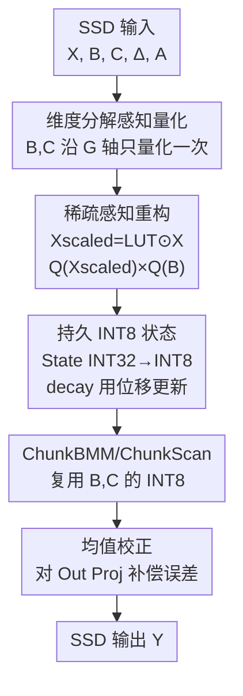

# SSDi8: Accurate and Efficient 8-bit Quantization for State Space Duality

**会议**: ICLR 2026  
**OpenReview**: [https://openreview.net/forum?id=pjMDZJd4rT](https://openreview.net/forum?id=pjMDZJd4rT)  
**代码**: https://github.com/cau-hai-lab/SSDi8 (有)  
**领域**: 模型压缩  
**关键词**: 训练后量化, Mamba-2, 状态空间对偶, INT8, 通道量化

## 一句话总结
SSDi8 是首个专门针对 Mamba-2 状态空间对偶（SSD）模块的训练后量化框架，通过"稀疏感知重构 + 持久 INT8 状态通路 + 维度分解感知的通道量化 + 均值校正"四件套，在 W8A8 / W4A8 下保持接近 FP16 的精度，同时把 SSD 推理加速最多 1.4×。

## 研究背景与动机

**领域现状**：Mamba 作为 SSM（状态空间模型）的代表，以线性复杂度提供高效的长程依赖建模，被视为 Transformer 的有力替代。Mamba-2 进一步提出结构化状态空间对偶（Structured State Space Duality, SSD），把"循环模式"和"注意力模式"统一起来，引入类似多头注意力的 head 维度，让 GEMM 利用率更高、可扩展到 8B+ 参数。但模型一大，显存和延迟开销也跟着膨胀，催生了对 SSD 专属压缩方案的需求。

**现有痛点**：把为 Transformer 设计的量化方法（Hadamard 旋转、GPTQ）直接套到 SSD 层上会带来严重掉点——论文 Table 1 显示，2.7B 模型在 W4A8 下，仅量化 In Proj 几乎无损（63.6%），但一旦把 SSD 也按 per-tensor 量化，精度从 63.8% 暴跌到 58.4%，再加上 Out Proj 量化更掉到 54.6%。已有的 Mamba 量化工作（MambaQuant、Quamba1）只针对 Mamba-1；Quamba2 虽然扩展到 Mamba-2，但只量化了 SSD 层的**输入**，没碰 SSD **内部**的计算，INT8 执行路径被打断，延迟优化也受限。

**核心矛盾**：SSD 内部的计算组织和 Transformer 完全不同，导致三处量化敏感。第一，模型维度被拆成 head 数 H 和 head 内维度 P，两个轴统计分布迥异，按整体量化必然失真；第二，SSD 含"维度可变激活"（B、C 在内存里按 group 维度 G 存储，计算时广播到 H），且被多个子模块反复调用；第三，逐元素乘（decay、softplus 等）和矩阵乘高度交织，逐元素乘里只要混入一个 FP16 张量，整条 INT8 GEMM 通路就被迫退回浮点。

**本文目标**：在 SSD 内部建立一条**从输入到输出不中断的持久 INT8 通路**（persistent INT8 path），既要把延迟降下来，又不能让精度塌掉。

**切入角度**：作者对 SSD 做了首次系统分析，发现 SSD 输入激活经过维度变换后（B,L,D → B,L,H,P）会沿 H 轴显现出清晰的"可分离"离群模式（Fig. 2），而经过 decay 缩放后的激活 Xscaled 在通道轴上**高度稀疏**——这两个结构性观察分别成了"怎么量化才准"和"怎么重构才能保 INT8"的突破口。

**核心 idea**：用一次代数重构把 decay 缩放从 B 搬到 X（`Q(Xscaled)×Q(B)` 等价替换 `X×(B⊙LUT)`），解除逐元素乘对 INT8 通路的阻断；再沿 SSD 固有的 H/P/G 维度结构做差异化通道量化，把循环状态以 INT8 形式持久化复用。

## 方法详解

### 整体框架

SSDi8 的载体是 Mamba-2 的一个 SSD block：输入张量经 In Proj、Conv 后进入 SSD，SSD 把序列按 `L = c⊙l` 切成 c 个 chunk（chunk 大小 l），再经过五个子模块——ChunkCumsum、ChunkState、StatePassing、ChunkBMM、ChunkScan(1/2)——产出输出 Y，最后过 RMSNorm 和 Out Proj。SSDi8 的目标是让这五个模块尽可能跑在 INT8 上：它在 SSD 入口处**只量化一次** B、C（沿 group 轴 G）并在下游全程复用；对会打断 INT8 的逐元素乘做**稀疏感知重构**；把循环状态 State 直接以 INT8 持久化、用位移完成 decay 更新；最后对输出投影做**均值校正**补偿累积误差。少数实在恢复不了的张量（ChunkCumsum 产出的 dAcs、ChunkScan2）保留 FP16，因为它们要么尺寸极小、要么逐元素乘后无法重构。

### 关键设计

**1. 稀疏感知重构：把 decay 缩放从 B 搬到 X，解除逐元素乘对 INT8 的阻断**

ChunkState 的原始计算是 `State = X × (B ⊙ LUTstate)`（式 4），其中 `LUTstate = Δ⊙Decaystate` 是一个 FP16 的 look-up table，要沿 chunk 内步长 l 给 B 施加 decay。这一步有三重麻烦：B 虽已量化成 INT8，但 LUT 是 FP16，整个乘法被拉回浮点；LUT 沿 l 轴呈指数变化，除 per-l 量化外都误差巨大，而 per-l 量化又会在 l 轴矩阵乘后误差累积；若直接 `Q(B⊙LUT)`，则必须在 `G→H` 广播之后才能量化，开销最高翻 4 倍。

SSDi8 的关键观察是：LUTstate 的乘法只作用在 X 和 B **共享的 l 维度**上，其余维度都相互独立——所以把缩放从 B 端移到 X 端不改变结果。据此重构为

$$\text{State}_{\text{INT32}} = Q(X_{\text{scaled}}) \times Q(B),\quad X_{\text{scaled}} = \text{LUT}_{\text{state}} \odot X$$

重构后只需量化一次 $X_{\text{scaled}}$（沿 P、H 轴），就能让整条乘法跑在 INT8 GEMM 上。更妙的是 $X_{\text{scaled}}$ 在通道轴上虽有显著离群点，但**高度稀疏**（Fig. 3a），所以实际量化误差并不大；论文在附录 A 证明了温和条件下 $Q(X_{\text{scaled}})$ 的量化误差**小于** $Q(X)\odot\text{LUT}_{\text{state}}$，从理论上为这次"搬家"背书。

**2. 循环状态的持久 INT8 表示：状态直接 INT8 存储，decay 更新用位移完成**

重构得到的 $\text{State}_{\text{INT32}}$ 以 INT32 累加，而 INT32 占用是 FP16 的两倍，会浪费 DRAM 带宽。SSDi8 在寄存器里就用量化尺度把 INT32 直接压成 INT8 再写回 DRAM，跳过中间的 FP16 表示：

$$\text{State}_{\text{INT8}} = \text{Round}\!\left(\text{State}_{\text{INT32}} \odot \frac{s_x s_b\, q_{\max}}{s_s}\right),\quad q_{\max}=2^{b-1}-1$$

其中 $s_x, s_b, s_s$ 分别是 X、B、State 的量化尺度。State 沿 head 维度 H 有变化、但沿 P 和 N 一致，且 N 还要参与 ChunkScan1 的后续乘法（量化误差无法恢复），所以 State 按 (H,P) 量化、不碰 N。到了 StatePassing，chunk 间的状态要按式 6 带 decay 递归累加，SSDi8 把标量 Decay 也定点量化，并把门控常数取成 $S=2^k$（实验 $k=7$），于是递归更新退化成**纯位移操作**：

$$Q(\text{State}_{i+1}) \leftarrow Q(\text{State}_{i+1}) + \frac{Q(\text{Decay}_{i+1})}{S} \odot Q(\text{State}_i)$$

由于 per-(H,P) 量化让所有 chunk 的 State 共享同一尺度，递归才能用位移而非浮点乘完成。这样 State 一路 INT8 穿过 ChunkScan1，与 $C_{\text{INT8}}$ 做 INT8 Tensor Core 乘法。ChunkBMM、ChunkScan2 同样复用入口处量化好的 $B_{\text{INT8}}/C_{\text{INT8}}$（CB 比 X 还大，量化它省下可观显存），其中 ChunkScan2 因 X 是 FP16、且 LUT 与 CB 形状不匹配无法重构，故把 CB 的反量化尺度融进 LUTScan2、保留部分 FP16 执行。

**3. 维度分解感知的通道量化：按 SSD 固有的 H/P/G 轴差异化量化**

SSD 把进入它的外部维度分解成两个独立轴 H（head 数）和 P（head 内维度），$D=H\odot P$，且 H 远大于 P。Fig. 2 显示同一激活在进 SSD 前（B,L,D）看不出 token 级模式，变换到（B,L,H,P）后沿 H 轴露出清晰的可分离离群模式，不同 head 的取值分布差异可达 5×——因此**直接 per-head 量化不稳定**，必须把 H 的异质性纳入考量。对沿 group 轴 G 定义的 B、C，SSDi8 选择在每个 SSD 层**开头就沿 G 轴量化一次**，而不是在每个用到它的子模块里各量化一遍：因为 $|G|\ll|H|$，沿 G 量化比广播到 H 后再量化高效得多，只给 SSD 增加约 3% 延迟；之后所有下游模块直接复用这份 INT8 张量。状态维度 N 虽统计平稳，但它直接进入后续矩阵乘、误差无法挽回，所以被排除在量化轴之外。正是这种"哪个轴该量化、哪个轴该跳过"的精细划分，让精度损失被压到几乎可忽略。

**4. SSD 量化误差的均值校正：用每通道误差均值闭式补偿累积偏移**

跨 SSD 层逐层累积的量化误差需要额外补偿。给定全精度结果 $Y=XW$ 和反量化结果 $Y'=X'W'$，把误差建模成最小二乘问题 $E_c=\|Y-(Y'+c)\|_F^2$，其最优校正向量恰好是每通道的量化误差均值（闭式解）：

$$c^\star_p = \frac{1}{N}\sum_{i=1}^{N}(Y-Y')_{i,p}$$

为了让估计准确，作者采用**逐层顺序更新**：先校正前面的层，让后续层的统计能反映已施加的校正，从而捕捉到由前层修正引起的激活漂移。为控制开销，$c$ 只施加在输出投影层（维度是输入投影层的一半、且量化误差最显著），仅带来约 1–2% 的延迟，却能稳定提升精度。

### 损失函数 / 训练策略
SSDi8 是训练后量化（PTQ），无需重训。采用对称、静态量化覆盖 W8A8 与 W4A8；4-bit 权重用 GPTQ 配合 Hadamard 变换的投影层；用 γ 迁移处理 RMSNorm 引发的离群；均值校正系数取 0.15 以防估计过拟合。

## 实验关键数据

### 主实验

零样本任务（Mamba-2 三个规模，六个 benchmark 平均，Table 2）：

| 模型 | 位宽 | 方法 | 平均 ACC |
|------|------|------|---------|
| 2.7B | FP16 | — | 63.8% |
| 2.7B | W8A8 | Quamba2 | 62.5% |
| 2.7B | W8A8 | **SSDi8** | **63.2%** |
| 2.7B | W4A8 | Quamba2 | 62.1% |
| 2.7B | W4A8 | **SSDi8** | **62.6%** |
| 8B | W8A8 | Quamba2 | 69.8% |
| 8B | W8A8 | **SSDi8** | **70.2%** (FP16=70.7%) |

WikiText2 困惑度（越低越好，Table 3）：8B 模型 SSDi8 在 W8A8 下 7.49 vs Quamba2 7.79（↓3.9%）、W4A8 下 7.62 vs 7.94（↓4.0%），全面收窄到 FP16（7.25）的差距。

延迟：Mamba-2 2.7B（B=32, L=2048）SSDi8 相对 FP16 加速 1.47×、相对 Quamba2 加速 1.38×；模块级看 ChunkScan 加速最多 1.77×（vs FP16）、StatePassing 达 2.25×。在边缘设备 Orin NX 16G 上，各序列长度均稳定优于 Quamba2（如 W8A8 L=2048：217.69ms vs 249.29ms）。

### 消融实验

内部 SSD 量化逐组件消融（Mamba-2 2.7B，W4A8，Table 5）：

| 配置 | 延迟 | PPL | 说明 |
|------|------|-----|------|
| baseline（SSD 全 FP16） | 8.63 | 9.34 | 仅 SSD 外 W4A8 |
| + Q(X) only | 8.58 | 9.35 | 单量化 X，无法上持久 INT8 |
| + 稀疏重构 + B,C 量化 | 8.05 | 9.37 | 重构让 ChunkScan1 进 INT8 |
| + 持久 INT8 + ChunkBMM 量化 | 6.53 | 9.43 | 全套，加速 1.32× |

SSD 量化 + 均值校正消融（Lambada，Table 6）：HadMamba 仅 51.2% → 加 SSD 量化升到 67.2% → 再加均值校正 67.4%（FP16=69.5%），校正开销仅 ~1–2%。

混合架构 Nemotron-H-8B-Reasoning（Table 7）：仅对 SSD 路径上 INT8，平均精度 73.1%→73.0% 几乎无损，SSD 模块延迟从 19.834ms 砍到 9.156ms（约 2×），端到端前向从 109.873ms 降到 98.904ms。

### 关键发现
- **稀疏重构是延迟的关键开关**：不做重构、只量化 X 时持久 INT8 通路无法建立，最终加速仅 1.07×；启用重构后 ChunkScan1 进 INT8 提速 1.08×，再量化 ChunkBMM 达 1.32×，而 PPL 退化始终 <0.1。
- **SSD 内部量化贡献远大于均值校正**：把精度从崩溃的 51.2% 拉回 67.2% 靠的是 SSD 量化本身，均值校正只贡献最后 0.2%，属于"锦上添花"的低成本补偿。
- **收益随并行度放大**：batch 越大、序列越长，chunk 级并行越充分，加速越明显；而极短序列（L=256）FP16 反而更高效（计算密度低）。
- **W4A4 被刻意排除**：因硬件层面 INT4 激活会反而拖慢，论文只主打 W8A8 / W4A8。

## 亮点与洞察
- **"搬家"式重构 + 稀疏性证明**：把 decay 缩放从 B 移到 X 看似只是代数恒等变换，但配合"Xscaled 高度稀疏 → 量化误差更小"的理论证明，既解除了 INT8 阻断又给出了精度保证，是全文最优雅的一手。
- **状态递归用位移而非乘法**：通过把门控常数取成 $2^k$ 并让所有 chunk 共享量化尺度，把循环状态更新降为位移操作，这是把"per-(H,P) 共享尺度"和"硬件友好"绑在一起的巧妙工程设计。
- **量化轴的精细取舍**：H/P/G/N 四个轴里"该量哪个、该跳哪个"全部基于分布观察（H 异质、N 进矩阵乘不可恢复），这种"按结构选轴"的思路可迁移到任何带多维分解的算子量化。
- **首次在 Mamba-2 SSD 内部打通持久 INT8**：之前的 Quamba2 只量化 SSD 输入，本文真正把 INT8 贯穿到 SSD 内部五个模块，填补了空白。

## 局限与展望
- W4A4 因当前硬件 INT4 激活反而变慢而被排除，方法的极致压缩潜力受限于硬件而非算法。
- dAcs、ChunkScan2 等少数张量仍保留 FP16，持久 INT8 通路并非 100% 纯净，留有进一步压缩空间。
- 实验聚焦语言建模与零样本任务，对 Mamba-2 在视觉、音频、多模态场景的量化鲁棒性验证较少。
- 均值校正仅施加在输出投影层、且只取每通道均值（一阶统计），对更复杂的误差分布可能不足，可探索二阶或逐 token 校正。

## 相关工作与启发
- **vs Quamba2**：Quamba2 同样支持 Mamba-2 的 W4A8/W8A8，但只量化 SSD **输入**、不碰内部计算，INT8 通路被打断、延迟优化受限；SSDi8 把 INT8 贯穿到 SSD 内部五模块，精度和延迟全面反超（2.7B W4A8：62.6% vs 62.1%，加速 1.38×）。
- **vs Quamba1 / MambaQuant**：二者只针对 Mamba-1 架构，不适用于基于 SSD 的 Mamba-2；SSDi8 是首个 SSD 专属 PTQ。
- **vs 直接套用 Transformer 量化（Hadamard 旋转 / GPTQ）**：直接套到 SSD 会因 head/group 维度的分布异质和逐元素乘交织而严重掉点（Table 1：63.8%→58.4%），SSDi8 靠维度分解感知量化和稀疏重构规避了这些陷阱。

## 评分
- 新颖性: ⭐⭐⭐⭐⭐ 首个把持久 INT8 打通到 Mamba-2 SSD 内部，稀疏重构+理论证明有原创性
- 实验充分度: ⭐⭐⭐⭐ 覆盖三规模、六任务、边缘设备和混合架构，但视觉/多模态场景验证偏少
- 写作质量: ⭐⭐⭐⭐ SSD 内部机制讲解清晰，公式与观察图配合到位
- 价值: ⭐⭐⭐⭐⭐ Mamba-2 部署的实用量化方案，加速 1.4× 且近无损，落地价值高

<!-- RELATED:START -->

## 相关论文

- [\[CVPR 2025\] EfficientViM: Efficient Vision Mamba with Hidden State Mixer based State Space Duality](../../CVPR2025/model_compression/efficientvim_efficient_vision_mamba_with_hidden_state_mixer_based_state_space_du.md)
- [\[ICLR 2026\] The Curious Case of In-Training Compression of State Space Models](the_curious_case_of_in-training_compression_of_state_space_models.md)
- [\[ICLR 2026\] SliderQuant: Accurate Post-Training Quantization for LLMs](sliderquant_accurate_post-training_quantization_for_llms.md)
- [\[ICLR 2026\] AIRE-Prune: Asymptotic Impulse-Response Energy for State Pruning in State Space Models](aire-prune_asymptotic_impulse-response_energy_for_state_pruning_in_state_space_m.md)
- [\[ICLR 2026\] Towards Quantization-Aware Training for Ultra-Low-Bit Reasoning LLMs](towards_quantization-aware_training_for_ultra-low-bit_reasoning_llms.md)

<!-- RELATED:END -->
