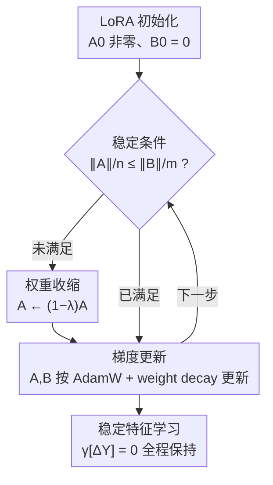

# Stable-LoRA: Stabilizing Feature Learning of Low-Rank Adaptation

**会议**: ICLR 2026  
**OpenReview**: [https://openreview.net/forum?id=xSa19DAieH](https://openreview.net/forum?id=xSa19DAieH)  
**代码**: https://github.com/Yize-Wu/Stable-LoRA  
**领域**: 模型压缩 / 参数高效微调（LoRA）  
**关键词**: LoRA, 特征学习稳定性, 权重收缩, 参数高效微调, 训练动力学

## 一句话总结
本文从特征学习稳定性的角度分析 LoRA 的训练动力学，证明 LoRA 在合适超参与初始化下能"自稳定"，但常用的非零初始化 $A_0$ 会长期破坏这种稳定性；为此提出 Stable-LoRA——在训练最初若干步对 $A$ 做指数收缩，既保留非零初始化的好处又消除其引入的不稳定，在多模型多任务上稳定优于 AdamW 等基线，且几乎不增加显存与计算。

## 研究背景与动机

**领域现状**：LoRA 把权重更新写成 $W = W_0 + sBA$，冻结原权重 $W_0$，只训练两个低秩矩阵 $A \in \mathbb{R}^{r\times n}$、$B \in \mathbb{R}^{m\times r}$（$r \ll \min(m,n)$），以极少参数量微调大模型。它在海量任务上经验有效，但"为什么这么稳健有效"一直缺乏理论解释。

**现有痛点**：近期工作（LoRA+、Riemann 预条件、LoRA-RITE 等）开始从训练动力学角度分析 LoRA，关注的核心是"特征学习稳定性"——即随模型宽度 $n$ 增大，LoRA 学到的特征（输出更新 $\Delta Y$）既不爆炸也不消失。但这些方法要么靠经验调学习率、要么改优化器，没有把"LoRA 何时天然稳定、什么时候不稳定"这条因果链讲清楚。

**核心矛盾**：理论上让 LoRA 稳定的"理想初始化"是 $A_0 = B_0 = 0$，但 $A=B=0$ 是零梯度的鞍点会卡死训练，且 $A_0 Z = 0$ 导致 $B$ 学不到信息、梯度消失/爆炸。业界通用补救是只让 $B_0=0$、$A_0$ 非零采样。然而本文指出：这个非零 $A_0$ 恰恰会破坏稳定性条件 $\gamma[A_0 Z] \le \gamma[\eta]+1$，而且这种破坏会沿训练递推关系一直延续下去，是"长期病"。

**本文目标**：(1) 给出 LoRA 自稳定的充分条件，解释其经验稳健性的理论来源；(2) 定位非零初始化导致的不稳定，并设计一个能消除它、又保留非零初始化好处、还几乎零开销的优化策略。

**切入角度**：作者发现初始化引发的不稳定与鞍点、梯度消失等问题在"时间尺度"上根本不同——后者只在训练开头出现、随训练自然消解，而前者一旦在开头触发就会被递推关系放大并持续整个训练。既然 $A_0$ 的好处只在早期、坏处是长期，那就让 $A_0$ 先发挥早期作用、再随训练逐步抹掉它的负面影响。

**核心 idea**：保留非零 $A_0$，但在训练最早期对 $A$ 施加指数收缩 $A_{t+1}=(1-\lambda)A_t-\eta g_A^t$，把 $A$ 的尺度压到与 $B$ 相当后停手，从而既享非零初始化之利、又恢复特征学习稳定性。

## 方法详解

### 整体框架
Stable-LoRA 的本质是给标准 LoRA 训练循环打的一个"补丁"：在原有梯度下降之上，于训练最初若干步插入一个对 $A$ 的收缩操作，由一个可判定的"稳定条件"控制何时停止收缩。输入是常规 LoRA 配置（非零 $A_0$、$B_0=0$、AdamW 优化器），输出是全程满足 $\gamma[\Delta Y]=0$（特征学习稳定）的微调模型。

理论侧先回答"何时稳定"：要求输出更新 $\Delta Y_t$ 的三个分量 $\delta_1,\delta_2,\delta_3$ 都为 $\Theta(1)$，推出 LoRA 自稳定的条件（Theorem 3.1）。诊断侧指出常用非零 $A_0$ 违反该条件且是长期病。方法侧则用权重收缩把 $A$ 的尺度拉回稳定区间。下图是训练时的实际流程（理论框架与病灶定位是它的"为什么"，不在流程图里单列为节点）：

### 关键设计

**1. 自稳定性理论：刻画 LoRA 天然稳定的充分条件**

这一设计回答"LoRA 为什么经验上这么稳健"。作者定义特征学习稳定为 $\Delta Y_t = \Theta(1)$（即 $\gamma[\Delta Y]=0$），并用一个 $\gamma$-函数记号刻画各量随宽度 $n$ 的尺度（$v=\Theta(n^{\gamma[v]})$，乘法 $\gamma[vv']=\gamma[v]+\gamma[v']$、加法 $\gamma[v+v']=\max$）。把 $\Delta Y_t = -s\eta g_B A_t Z - s\eta B_t g_A Z + s\eta^2 g_B g_A Z$ 的三个分量 $\delta_1,\delta_2,\delta_3$ 都约束为 $\Theta(1)$，并基于 $\gamma[g_A Z]=1$ 的假设（连最简单的 sign 优化器都满足，因为 $\mathrm{sign}(Z)^\top Z = \Theta(n)$），归纳出递推关系 $\gamma[A_tZ]\ge\gamma[\eta]+1$、$\gamma[B_t]\ge\gamma[\eta]$。

结论（Theorem 3.1）是：只要超参满足 $\gamma[s]+2\gamma[\eta]+1=0$，且初始化满足 $\gamma[A_0Z]\le\gamma[\eta]+1$ 与 $\gamma[B_0]\le\gamma[\eta]$（即 Case 1），那么 $\gamma[\delta_1]=\gamma[\delta_2]=\gamma[\delta_3]=0$ 会被同时满足，LoRA **无需任何额外操作**就能自然达到并全程维持稳定特征学习。这就为 LoRA 的稳健有效提供了理论根基。

**2. 病灶定位：非零 $A_0$ 是长期病，而非短期病**

理想初始化是 $A_0=B_0=0$，可使 $\gamma[A_0]=\gamma[B_0]=-\infty$、对任意 $\eta$ 都满足 Case 1。但 $A=B=0$ 是鞍点会卡死训练，且 $A_0Z=0$ 让 $B$ 信息全失、梯度消失/爆炸。通用补救是 $B_0=0$、$A_0$ 按 $\sigma^2=n^{-1}$ 采样——它解决了鞍点和信息丢失，却带来新麻烦：非零 $A_0$ 使稳定条件 $\gamma[A_0Z]\le\gamma[\eta]+1$ 对 $\eta$ 施加了一个下界，而微调常用的小学习率往往违反它。

更关键的是，作者论证这无法靠调初始化或超参解决：调 $A_0$ 不能在整批数据上一致缩小 $A_0Z$（$Z$ 在变而 $A_0$ 固定），调 $s$ 也无用（$s$ 不出现在该条件里）。一旦开头 $\gamma[A_0Z]>\gamma[\eta]+1$，递推关系 $\gamma[A_tZ]=\max(\gamma[A_{t-1}Z],\gamma[\eta]+1)$ 会把它**一路延续到训练结束**。这与鞍点/梯度消失这类"训练初期自然消解"的短期病形成鲜明对比——正是这个"长期 vs 短期"的洞察决定了后面方法的形态。图 2 实测印证：训练中 $\|A\|_F$ 始终不掉到初值以下、$\|B\|_F$ 从小值快速上涨，使 $\delta_1$ 主导 $\delta_2$，恰对应 $\gamma[A_tZ]>\gamma[\eta]+1$。

**3. 权重收缩：让 $A_0$ 早期有用、负面影响随训练消退**

既然 $A_0$ 的好处只在早期、坏处是长期，方法就不在开头改 $A_0$（那会重新激活鞍点/梯度消失），而是随训练逐步削弱它。具体在最早若干步、参数更新前先收缩 $A$：

$$A_{t+1} = (1-\lambda)A_t - \eta g_A^t$$

其中收缩比 $\lambda\in(0,1)$。展开 $N$ 步可得 $A_N=(1-\lambda)^N A_0 - \eta g_A^{N-1} - \eta\Delta$，由于 $\gamma[(1-\lambda)^k]\le 0$，有 $\gamma[A_NZ]=\max\big(N\gamma[1-\lambda]+\gamma[A_0Z],\ \gamma[\eta]+1\big)$。只要 $N$ 和/或 $\lambda$ 足够大，第一项 $N\gamma[1-\lambda]+\gamma[A_0Z]$ 终会降到 $\gamma[\eta]+1$ 以下，从第 $N+1$ 步起稳定特征学习被恢复并维持。这对**任意学习率 $\eta$** 都成立，正好绕开了"小学习率违反下界"的死结。该收缩与 AdamW、weight decay 正交（见 Algorithm 1），且可原地（in-place）完成——收缩前的值用完即弃，因此不增显存，只多一次标量×矩阵乘法。

**4. 稳定条件：用 $\|A\|/n \le \|B\|/m$ 判定何时停止收缩**

收缩不能无限做下去，否则会把 $A$ 压没。停止准则设计为：当 $A$ 与 $B$ 的平均范数尺度相当，即 $\|A\|_F/n \le \|B\|_F/m$（分母里的 $r$ 已约掉）时停手。这个条件直接来自 $\delta_1=s\eta g_B A_t Z$ 与 $\delta_2=s\eta B_t g_A Z$：当 $A_t$、$B_t$ 尺度相当时这两项尺度也相当。由于 $\gamma[\delta_2]=0$ 始终成立，满足该条件就保证了 $\gamma[\delta_1]=0$，从而 $\gamma[\Delta Y]=0$。实验（Table 4）显示越过该条件继续收缩对性能几乎无影响，说明它确实卡在了"刚好够"的位置，验证了准则的合理性。

### 损失函数 / 训练策略
不改任务损失，只改优化过程。Algorithm 1：每步先判 `stable` 标志，若未稳定且 $\|A\|_F/n>\|B\|_F/m$ 则 $A_t\leftarrow(1-\lambda)A_t$，否则置 `stable=true`；随后用优化梯度加 weight decay 正常更新 $A_{t+1}=A_t-\eta g_A^t-\eta w A_t$、$B_{t+1}=B_t-\eta g_B^t-\eta w B_t$。收缩比在 $\lambda\in\{0.0005,0.001,0.002,0.005\}$ 中搜最优。超参搜索范围 $\eta\in[5\mathrm{e}{-5},8\mathrm{e}{-4}]$、$s\in[2.0,64.0]$，默认在 attention 的 qproj、vproj 上加 rank $r=8$ 的 LoRA，每个结果取 3 次随机种子最优。

## 实验关键数据

### 主实验

多选问答（QA：HellaSwag / SocialIQa / OpenbookQA / ARC-E / ARC-C）平均准确率，Qwen-2 (0.5B/1.5B) 与 LLaMA-3.2 (1B/3B)：

| 模型 | AdamW | LoRA+ | Riemann | LoRA-RITE | Stable-LoRA |
|------|-------|-------|---------|-----------|-------------|
| 0.5B | 61.94 | 62.55 | 61.48 | 61.85 | **64.01** |
| 1B | 71.90 | 71.36 | 69.07 | 71.04 | **72.52** |
| 1.5B | 81.11 | 81.02 | 80.25 | 81.08 | **81.95** |
| 3B | 83.53 | 83.42 | 82.91 | 83.32 | **84.03** |

Stable-LoRA 在所有模型上一致最优（最高约 +4% 单任务提升），而其它基线只在个别任务/模型上偶有提升、不稳定。CoT 数学推理（MetaMathQA 训练、GSM8K 评测）下，不同训练步数（1000/2000/5000）Stable-LoRA 也始终优于 AdamW（如 3B@5000：59.44 vs 58.83）。

### 消融实验

| 配置 | 0.5B | 1B | 1.5B | 3B | 说明 |
|------|------|----|----|----|------|
| Stable-LoRA | 62.46 | 72.80 | 80.75 | 84.13 | 完整方法（合并 QA 数据集） |
| w/o 稳定条件 | 62.52 | 72.72 | 80.61 | 84.10 | 越过稳定条件继续收缩 |

目标模块泛化（合并 QA，3B 为例）：qv→84.13、qkvo→84.93、qkvogud→85.60，Stable-LoRA 在每种 LoRA 作用范围下都稳超 AdamW（对应 83.79 / 84.54 / 85.31）。

开销（0.5B + HellaSwag 训练时间）：AdamW 217.4s、LoRA+ +0.0%、Riemann +8.3%、LoRA-RITE +46.0%、**Stable-LoRA 仅 +0.6%**，且零额外显存（原地收缩）。

### 关键发现
- **病灶被实测证实**：图 2 显示 $\|A\|_F$ 全程不低于初值、$\|B\|_F$ 快速增长，正对应理论预言的 $\gamma[A_tZ]>\gamma[\eta]+1$；Stable-LoRA 压低 $\|A\|_F$ 的同时 $\|B\|_F$ 早期不受影响，说明非零 $A_0$ 的好处被保留。
- **稳定条件卡得恰到好处**：去掉停止准则继续收缩，准确率几乎不变（差异 ≤0.14），印证"满足条件即已稳定，再收缩无增益"。
- **稳健性优于其它稳定化方法**：LoRA+、Riemann、LoRA-RITE 往往在某些设置上反而掉点，Stable-LoRA 的提升跨任务跨模型一致。

## 亮点与洞察
- **"长期病 vs 短期病"的时间尺度洞察**最为精彩：把鞍点/梯度消失（自然消解）与初始化不稳定（递推延续）区分开，直接推导出"早期收缩、后期停手"这一形态，而不是简单调初始化或学习率——这是把理论分析转化为算法的关键一跃。
- **几乎零成本的工程性**：收缩可原地完成，不增显存、+0.6% 时间，对 LoRA 最常用的资源受限场景极友好；且与 AdamW、weight decay 正交，能直接叠加进现有训练流程。
- **可判定的稳定条件**：用 $\|A\|_F/n\le\|B\|_F/m$ 这一可在线计算的范数比作为停止准则，把抽象的尺度条件 $\gamma[\delta_1]=0$ 落成一行代码，迁移性强——任何关心 $A/B$ 尺度失衡的 LoRA 变体都可借鉴这种"范数比触发"思路。

## 局限与展望
- **理论聚焦宽度极限**：分析建立在模型宽度 $n\to\infty$ 与 $\gamma$-函数尺度刻画上，深度方向、有限宽度下的精确行为未覆盖；Assumption 1（$\gamma[g_AZ]=1$）虽对 sign 类优化器成立，但对更复杂优化器只是"well justified"而非严格证明。
- **超参仍需搜索**：收缩比 $\lambda$ 在 4 个候选里取最优，$\eta$、$s$ 也做了较大范围搜索，论文未给出 $\lambda$、$N$ 的免搜索自适应方案。
- **任务/模型规模有限**：实验止于 3B、集中在多选 QA 与数学 CoT，更大模型、生成式或多模态任务上的收益尚待验证。
- **改进方向**：可探索把"范数比"做成连续的自适应收缩（而非二元的收缩/停止），或把同一稳定性框架推广到 DoRA、QLoRA 等变体。

## 相关工作与启发
- **vs LoRA+**：LoRA+ 让 $\eta_B>\eta_A$（如 $4\times$）来追求稳定，属于"调学习率"；本文指出非零 $A_0$ 引发的是长期不稳定、单靠调学习率难以根治，转而直接收缩 $A$ 的尺度。
- **vs Riemann 预条件**：Riemann 对 $g_A,g_B$ 做矩阵预条件，开销 +8.3%；Stable-LoRA 只做标量收缩，+0.6% 且效果更稳。
- **vs LoRA-RITE**：LoRA-RITE 追求变换不变的梯度均衡，开销高达 +46%；本文路线更轻、并配有自稳定性理论支撑。
- **vs 初始化方法（Xavier / He / µP）**：这些在宽度极限下稳定激活方差；本文沿用 He 初始化（$\sigma^2=n^{-1}$）但揭示它在 LoRA 下破坏特征学习稳定，并用训练时收缩而非换初始化来修复。

## 评分
- 新颖性: ⭐⭐⭐⭐⭐ 把 LoRA 自稳定讲成理论 + 定位非零初始化的长期病 + 给出零成本收缩补丁，因果链完整且少见。
- 实验充分度: ⭐⭐⭐⭐ 覆盖 4 模型、QA/CoT、目标模块与开销消融，但规模止于 3B、未做大模型与生成任务。
- 写作质量: ⭐⭐⭐⭐ 理论推导清晰、动机层层递进；$\gamma$-函数记号略密，需要一定数学背景。
- 价值: ⭐⭐⭐⭐⭐ 即插即用、零显存增量、稳定提点，对 LoRA 实践者有直接落地价值。

<!-- RELATED:START -->

## 相关论文

- [\[ICLR 2026\] FlexLoRA: Entropy-Guided Flexible Low-Rank Adaptation](flexlora_entropy-guided_flexible_low-rank_adaptation.md)
- [\[ICLR 2026\] E²LoRA: Efficient and Effective Low-Rank Adaptation with Entropy-Guided Adaptive Sharing](e²lora_efficient_and_effective_low-rank_adaptation_with_entropy-guided_adaptive_.md)
- [\[ICLR 2026\] LoFT: Low-Rank Adaptation That Behaves Like Full Fine-Tuning](loft_low-rank_adaptation_that_behaves_like_full_fine-tuning.md)
- [\[ICML 2026\] Energy-Structured Low-Rank Adaptation for Continual Learning](../../ICML2026/model_compression/energy-structured_low-rank_adaptation_for_continual_learning.md)
- [\[AAAI 2026\] Group Orthogonal Low-Rank Adaptation for RGB-T Tracking](../../AAAI2026/model_compression/group_orthogonal_low-rank_adaptation_for_rgb-t_tracking.md)

<!-- RELATED:END -->
