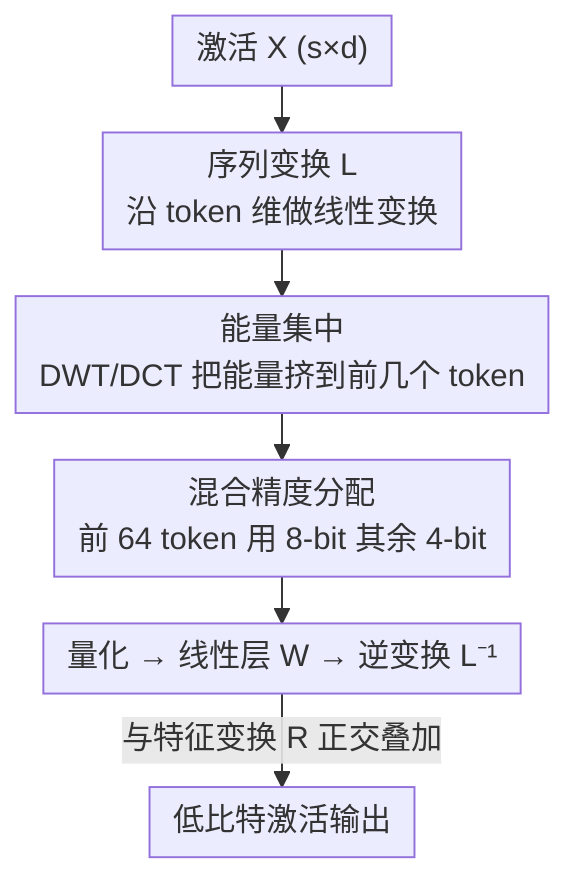

# STaMP: Sequence Transformation and Mixed Precision for Low-Precision Activation Quantization

**会议**: ICLR 2026  
**OpenReview**: [https://openreview.net/forum?id=suB4wYViDt](https://openreview.net/forum?id=suB4wYViDt)  
**代码**: https://github.com/Qualcomm-AI-research/stamp-quantization  
**领域**: 模型压缩 / 量化  
**关键词**: 激活量化, 后训练量化, 序列变换, 混合精度, 能量集中

## 一句话总结
STaMP 提出沿**序列维度**做可逆线性变换（用 DCT/小波把激活能量集中到少数 token），再给这些高能量 token 分配更高比特，从而在固定平均比特预算下大幅降低低比特激活量化误差；它与现有沿特征维度的变换（Hadamard/QuaRot）正交互补，在 LLM 与 LVM 上即插即用地改善 W4A4 量化。

## 研究背景与动机

**领域现状**：后训练量化（PTQ）是压缩 LLM/LVM 推理开销的关键手段，但当激活被压到 4-bit 时精度急剧下降，主因是权重和激活里存在离群值（outliers）。为对抗离群值，近期工作引入「函数保持的可逆线性变换」：SmoothQuant 把激活离群值缩小、再放大后续权重来补偿；QuaRot/FlatQuant 等用 Hadamard 旋转把离群值打散到多个通道，从而压低激活的动态范围。

**现有痛点**：这些方法**清一色作用在特征维度（feature dimension）**——也就是在 $d$ 个通道之间做重分布，却完全忽略了**序列维度（sequence dimension）**上 token 之间的相关性。

**核心矛盾**：而图像和文本天然有强**局部相关性**——相邻像素、相邻 token 高度依赖，这种结构也会保留在模型的中间激活里。换句话说，激活矩阵 $X\in\mathbb{R}^{s\times d}$ 沿 $s$ 方向藏着可被利用的冗余，而现有变换一点没动它。

**本文目标**：(1) 提出一类沿序列维度的激活变换，与特征变换互补；(2) 刻画序列变换下的量化误差，并据此设计混合精度方案；(3) 证明它叠加在特征变换+权重量化之上仍能持续提升精度。

**切入角度**：作者从传统**媒体压缩**（JPEG/JPEG2000/视频音频编码）汲取灵感——这些编解码器正是用 DCT/小波把空间信号的能量集中到少数频率系数，再按感知重要性分配比特。作者把同样的思想搬到生成模型的激活空间。

**核心 idea**：用一个正交序列变换 $L$ 把激活能量**集中到前几个 token**，对这少数高能量 token 用 8-bit、其余用 4-bit，从而在几乎不增加平均比特的前提下显著压低量化误差。

## 方法详解

### 整体框架

STaMP 把一个「序列变换 + 混合精度」的薄层包在每个线性层外面。对线性层输入 $X$，先用一个**左可逆矩阵** $L$ 沿序列维度变换得到 $LX$（把能量挤到前若干 token），按 per-token 不同比特 $b_i$ 量化，过线性层 $W$，再用 $L^{-1}$ 逆变换还原、加偏置。关键性质是：序列变换是线性的、与线性层可交换，因此 $L^{-1}$ 可以推迟到线性层之后再做（偏置也随之变成 $\ell\beta^T$），**不触碰权重**——这让它和 GPTQ、SVDQuant 等权重量化方法天然正交。

整条流水线要回答三件事：① 用什么 $L$ 才能既高效又把能量集中好？② 怎么把比特预算分配给各 token？③ 这个变换层本身的开销有多大？下面三个关键设计正对应①②，外加贴合硬件的工程取舍。

### 关键设计

**1. 序列变换：把量化误差转化为「能量分配」问题**

现有特征变换只在通道间做文章，忽略了 token 间相关性。STaMP 引入沿序列维度的正交变换 $L$，并给出误差上界（Theorem 1）：在 min-max 逐 token 缩放下，变换后激活的量化误差被各 token 能量的加权和上界控制，

$$\mathcal{L}(X;L)\le \frac{d}{2}\sum_{i=1}^{s}\frac{e_i}{(2^{b_i}-1)^2},\qquad e_i = E\big[\|l_i^T X\|_2^2\big].$$

这里 $e_i$ 是第 $i$ 个变换后 token 的能量。由于正交变换**不改变总能量** $E=\sum_i e_i$，想压低这个上界只能靠**重新分配比特**。这一步的妙处在于：它把「怎么降低量化误差」精确地转写成「怎么在固定 token 间分配能量与比特」，为后面的混合精度铺平了道路——而这正是媒体压缩里能量压缩（energy compaction）的经典套路。

**2. 高效能量集中：用 DCT/小波近似最优 KLT**

理论上，让能量最大程度集中到少数 token 的最优变换是激活自相关矩阵 $S=E[XX^T]$ 的特征基，即 KLT（Karhunen-Loève 变换），$L=U^T$。但 KLT 既要逐激活估计 $S$（昂贵的标定），矩阵乘又是满秩 $O(s^2 d)$ 复杂度，且每层要做两次，完全不实用。

作者的关键观察是：LLM/LVM 激活的自相关矩阵因为自然图像/文本的局部相关性而呈**（块）Toeplitz 结构**——相邻 token 强相关、远离 token 弱相关。由 Szegő 定理，这类矩阵的特征基可用**傅里叶基**很好地逼近；又因 $S$ 实对称，可直接用**离散余弦变换 DCT**（复杂度 $O(ds\log s)$）代替复数傅里叶基。进一步只保留傅里叶系数的符号就得到 Walsh-Hadamard 变换（WHT），更利于硬件；而**离散小波变换 DWT**（Haar 小波）把复杂度降到 $O(ds)$，每步把能量推到前一半（2D 信号前 1/4）token，$\log s$ 步即可充分集中。实验显示 DCT/WHT/DWT 三者能量集中效果接近，于是作者主选最便宜的 DWT。

**3. 最优比特分配 + 两档离散精度：贴合硬件的「64+8bit」方案**

给定能量向量 $e$ 和总预算 $B$ 比特，连续意义下的最优分配为 $b_i^* = \log_2\sqrt{e_i} - C$（$C$ 是使总和满足预算的常数），即**比特正比于 token 能量的对数**——因为误差上界分母随 $b_i$ 指数增长，把一比特从低能量 token 挪给高能量 token 收益不成比例地大。

但硬件只支持整数、且最好只用少数几档精度（如 4/8-bit）。这正是作者**偏爱 DWT 而非更优 DCT** 的理由：DWT 天然产生**离散的能量层级**，与「只用两档比特」的诉求完美契合。最终方案极简——**前 64 个 token 保 8-bit、其余 4-bit**，在 PixArt-Σ 上平均比特仅 4.0625，几乎零额外预算，却显著提升精度。在 LLM 上该方案对应有效比特 W4A4.125KV4.125。需要注意的限制：LLM 的逐 token 生成阶段每次只有一个激活，无法做序列变换，因此 STaMP 主要用于 prompt 预填充阶段（恰好是计算受限阶段，收益正中要害）。

### 损失函数 / 训练策略
STaMP 是纯 PTQ、**无需任何训练或微调**：变换矩阵（DWT/DCT）是固定的解析变换，比特分配是确定性的「前 64 token 8-bit」规则，唯一的统计量是用一个标定集估计自相关结构以确认 Toeplitz 假设成立。整套方法即插即用地挂在已有量化方法之上。

## 实验关键数据

### 主实验（LVM：DiT 架构，W4A4 逐块量化，块大小 64，STaMP 固定 64 token 用 8-bit）

| 模型 / 方法 | COCO SQNR (无→+STaMP) | COCO IR | MJHQ SQNR | MJHQ IR |
|------|------|------|------|------|
| PixArt-Σ · RTN | 5.88 → 6.16 | 0.38 → 0.80 | 5.75 → 6.23 | 0.38 → 0.76 |
| PixArt-Σ · ViDiT-Q | 7.82 → 6.37 | 0.83 → 0.84 | 7.55 → 8.53 | 0.76 → 0.86 |
| PixArt-Σ · SVDQuant | 8.78 → 9.72 | 0.90 → 0.91 | 8.83 → 9.75 | 0.86 → 0.89 |
| SANA · RTN | 8.63 → 9.32 | 0.89 → 0.91 | 8.56 → 9.40 | 0.95 → 0.99 |
| SANA · SVDQuant | 9.99 → 10.69 | 0.87 → 0.90 | 9.88 → 10.51 | 0.93 → 0.98 |

叠加 STaMP 后绝大多数配置的 SQNR 和 Image Reward 都提升，生成图像伪影显著减少（论文 Fig.1/Fig.6）。

### 主实验（LLM：W4A4KV4，Wikitext-2 困惑度 PPL，越低越好，所有方法均用 64 个 8-bit token）

| 方法 | Llama-3-8B | Llama-3.2-1B-it | Llama-3.2-3B-it | Qwen-2.5-3B-it |
|------|------|------|------|------|
| FP（参考） | 6.14 | 13.16 | 11.27 | 8.56 |
| RTN → +STaMP | 668 → 95.3 | 1795 → 700 | 483 → 159 | 99723 → 18767 |
| SmoothQuant → +STaMP | 531 → 93.8 | 883 → 407 | 177 → 88.5 | 66929 → 29063 |
| QuaRot → +STaMP | 9.05 → 8.66 | 25.78 → 23.72 | 18.43 → 17.57 | 94.86 → 71.13 |
| FlatQuant → +STaMP | 6.89 → 6.77 | 15.72 → 15.16 | 12.71 → 12.40 | 9.29 → 9.19 |

**所有 baseline 加上 STaMP 后 PPL 一致下降**，尤其在离 FP 还很远、难量化的小模型（1B/3B）上改善最明显。

### 消融实验

| 维度 | 设置 | 关键发现 |
|------|------|---------|
| 序列变换选择 | Identity / DCT / WHT / DWT（Fig.7） | DCT/WHT/DWT 三者 SQNR/PPL 接近，从昂贵精确的 DCT 换成便宜的 DWT 几乎不掉点 |
| 与特征变换组合 | × {SDCB, QuaRot, SmoothQuant, FlatQuant} | 序列变换与特征变换收益**largely 互补**，尤其 LVM 上叠加增益明显 |
| 高精度 token 数 | 改变高精度 token 数（Fig.4b） | 只要引入少量高精度 token，SQNR 就**急剧上升**；5-bit 区间仍优于均匀量化 |
| 开销 | DWT 三级 + 专用 CUDA kernel（Table 3） | 单步去噪 DWT 序列变换 flops 开销 0.21%、CUDA 4.8%，与 Hadamard 特征变换相当，占总运行时 <5% |

### 关键发现
- **能量集中 + 混合精度是核心增益来源**：去掉序列变换（Identity 行/列）相比加上 DWT，SQNR/PPL 明显变差；增益来自「把比特挪给高能量 token」这一指数级收益。
- **DWT 是精度-效率的甜点**：虽然不如 DCT 最优，但其离散能量层级恰好匹配两档比特方案，且复杂度最低 $O(ds)$。
- **正交互补而非竞争**：STaMP 不与特征变换/权重量化抢位置，而是叠加上去都能再涨——这是它最实用的属性。

## 亮点与洞察
- **把「激活量化」重新框成「信号压缩」问题**：作者敏锐地发现激活自相关呈 Toeplitz 结构，于是直接把 JPEG/视频编码的能量压缩 + 自适应比特分配整套思想搬过来，视角非常漂亮。
- **正交维度的发现**：所有同行都在特征维度卷离群值，STaMP 指出序列维度是一块「无人区」，且与特征维度增益叠加——这种「换个轴」的创新往往最便宜也最通用。
- **理论与工程的闭环**：从误差上界（Theorem 1）→ 最优变换是 KLT → Toeplitz 让 DCT 逼近 → DWT 的离散层级匹配硬件两档精度，每一步取舍都有依据，最后落到「前 64 token 8-bit」这种极简可落地的方案。
- **可迁移**：「沿被忽略的维度做可逆变换 + 按能量分配资源」这一范式可迁移到 KV-cache 压缩、稀疏化、甚至梯度通信压缩。

## 局限与展望
- **LLM 解码阶段不适用**：逐 token 生成时每步只有一个激活，无法做序列变换，STaMP 只能用于 prompt 预填充阶段（虽然恰好是计算受限阶段）。
- **依赖 Toeplitz/局部相关假设**：方法的有效性建立在激活自相关呈块 Toeplitz 结构之上；对于不满足该结构的激活（如论文中提到的 cross-attention 依赖池化文本嵌入的那支，就没法用 DWT），需要单独处理。
- **延迟开销仍有空间**：DWT 的 CUDA 延迟（4.8%）高于其 flops（0.21%），说明当前 kernel 未充分优化，作者也承认可借更好的 kernel 或专用硬件进一步压缩。
- **高精度 token 数是手工设的**：64 这个数字是经验值，是否对不同序列长度/模型自适应仍可探索。

## 相关工作与启发
- **vs SmoothQuant / QuaRot / FlatQuant**：它们都沿特征维度打散离群值，STaMP 沿序列维度做能量集中，两者正交可叠加；STaMP 还不碰权重，因此与权重量化方法也不冲突。
- **vs SVDQuant**：SVDQuant 用 SVD 把激活离群值吸进高精度低秩分支、残差量化到 4-bit；STaMP 与之组合（Table 1）能进一步提升 SQNR/IR。
- **vs 传统媒体压缩（JPEG/JPEG2000/HEVC/MP3）**：这些编解码器用 DCT/DWT 做能量压缩 + 感知比特分配，STaMP 证明同样原理可搬到生成模型的激活空间，是一次跨领域思想迁移。
- **vs Federici et al. 2025（减序列均值 + Hadamard）**：同样关注序列结构，但那一支是减去序列平均再做特征旋转，STaMP 则是完整的序列变换 + 混合精度框架。

## 评分
- 新颖性: ⭐⭐⭐⭐⭐ 把激活量化沿被忽略的序列维度重构为信号压缩问题，视角原创且与现有方法正交
- 实验充分度: ⭐⭐⭐⭐ 覆盖 LVM（PixArt-Σ/SANA）与多个 LLM、多 baseline、消融与开销齐全；解码阶段未覆盖
- 写作质量: ⭐⭐⭐⭐⭐ 理论上界→最优变换→DCT/DWT 逼近→硬件落地的推导链条清晰
- 价值: ⭐⭐⭐⭐⭐ 即插即用、无需训练、与现有量化栈正交叠加，工程实用性强

<!-- RELATED:START -->

## 相关论文

- [\[ICLR 2026\] PM-KVQ: Progressive Mixed-Precision KV Cache Quantization for Long-CoT LLMs](pm-kvq_progressive_mixed-precision_kv_cache_quantization_for_long-cot_llms.md)
- [\[ICLR 2026\] Channel-Aware Mixed-Precision Quantization for Efficient Long-Context Inference](channel-aware_mixed-precision_quantization_for_efficient_long-context_inference.md)
- [\[ICLR 2026\] MicroMix: Efficient Mixed-Precision Quantization with Microscaling Formats for Large Language Models](micromix_efficient_mixed-precision_quantization_with_microscaling_formats_for_la.md)
- [\[AAAI 2026\] DynaQuant: Dynamic Mixed-Precision Quantization for Learned Image Compression](../../AAAI2026/model_compression/dynaquant_dynamic_mixed-precision_quantization_for_learned_i.md)
- [\[AAAI 2026\] KVmix: Gradient-Based Layer Importance-Aware Mixed-Precision Quantization for KV Cache](../../AAAI2026/model_compression/kvmix_gradient-based_layer_importance-aware_mixed-precision_.md)

<!-- RELATED:END -->
