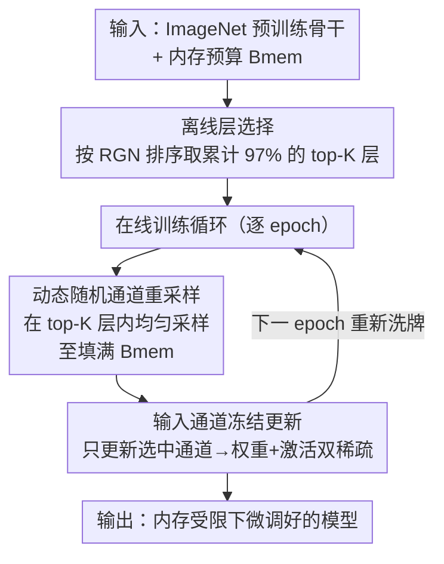

# Study of Training Dynamics for Memory-Constrained Fine-Tuning (TraDy)

**会议**: ICLR 2026  
**OpenReview**: [https://openreview.net/forum?id=BhfIg0tuti](https://openreview.net/forum?id=BhfIg0tuti)  
**代码**: 论文提供匿名仓库（含 training_metrics 与复现脚本）  
**领域**: 模型压缩 / 内存高效训练 / 端侧学习  
**关键词**: 内存受限微调, 梯度剪枝, 动态通道选择, 重尾梯度, 端侧学习

## 一句话总结
针对端侧设备内存极度受限、无法做完整反向传播的问题，本文先用三条关于微调训练动态的观察（梯度重尾、层重要性由架构决定、通道重要性由任务决定）把"该更新哪里"拆成离线选层 + 在线动态选通道两步，提出 TraDy——在架构预选出的高重要层内、每个 epoch 重新随机采样输入通道来更新，在严格内存预算下逼近全梯度，做到最高 99% 激活稀疏、95% 权重导数稀疏、97% 反向 FLOPs 削减，且精度反超确定性 oracle。

## 研究背景与动机
**领域现状**：把模型部署到边缘设备时，主流是把离线训好的压缩模型搬上去做推理，研究焦点集中在量化、低秩、紧凑结构、知识蒸馏、剪枝这几条压缩路线上。但这些工作几乎只优化"推理"，没有解决"在设备上继续训练/微调"的问题。

**现有痛点**：离线训好、设备上只跑推理的模型会随时间发生数据漂移（data drift），性能逐渐退化；要做端侧学习又被反向传播的内存和算力卡死——边缘设备的内存是硬约束，存不下全部参数的权重导数和激活。已有几类替代方案各有短板：Lin et al. 的 Sparse Update（SU）用一个静态子网络，但需要昂贵的离线精度贡献分析 + 进化搜索，而且所有下游任务共用一套固定选择；Kwon et al. 用 Fisher 信息排层，但算 Fisher 比算梯度还费内存，自相矛盾；Quélennec et al. 的 Velocity 动态选神经元，却只考虑权重内存、忽略了同样吃紧的激活内存。

**核心矛盾**：内存预算和梯度近似质量之间存在 trade-off——要省内存就得冻结大量参数/通道，但冻得越死、梯度近似越偏、精度越掉；而要精确判断"哪些通道重要"又得算完整梯度，这本身就违反内存约束。同时已有方法要么静态（不随训练自适应）、要么只算了内存的一半（只权重不激活）。

**本文目标**：在严格的权重 + 激活联合内存预算下，且事先不知道下游任务数据的前提下，选出"更新哪一部分网络"使精度最大化。

**切入角度**：作者不直接设计选择规则，而是先研究"微调时的训练动态本身长什么样"——提出三条命题：①随机梯度在微调中呈重尾分布，天然产生集中在少数通道的稀疏；②层的相对重要性主要由网络架构决定、跨下游任务几乎不变，因此可以离线（甚至 a priori）定层；③通道层面的重要性分布是任务相关的，没有目标数据就无法预先确定。

**核心 idea**：把"选哪里更新"分解为两层——层用架构信息离线定死（省去在线开销），通道则因为任务相关而无法预定，索性在选定层内**逐 epoch 随机重采样**，让随机选择的期望逼近全梯度，从而在不算完整梯度的前提下同时拿到内存合规与高精度。

## 方法详解

### 整体框架
TraDy（Training Dynamics）把内存受限微调拆成"离线选层 + 在线选通道"两阶段。输入是一个 ImageNet 预训练骨干和一个内存预算 $B_{mem}$（权重 + 激活合并计算），输出是在下游任务上微调好、且全程不超内存的模型。离线阶段在任意可得的下游任务上跑几个 epoch，按重加权梯度范数 RGN 给层排序，挑出累计 RGN 占 97% 的 top-K 层作为"可更新层池"；在线阶段进入训练循环，每个 epoch 在这批层内**均匀随机**采样输入通道、直到填满内存预算，只更新这些通道，下个 epoch 重新洗牌再采样。这样既绕开了"算完整梯度才能选通道"的内存悖论，又用动态重采样把随机子集的期望拉向全梯度。

### 关键设计

**1. 离线层选择：层重要性只看架构、跨任务不变**

这一步针对"在线判断该更新哪层会带来额外内存/算力开销"的痛点。作者先定义重加权梯度范数 RGN（Reweighted Gradient Norm），把通道的梯度范数除以它的内存代价：$\mathrm{RGN}_c = \frac{\lVert (\partial L/\partial W_i)_c \rVert_2}{C^{W_i}_c + C^{A_i}_c}$，其中 $C^{W_i}_c = C'\times D\times D$ 是权重内存、$C^{A_i}_c = H\times W$ 是激活内存。原始梯度范数会偏向参数多的通道（范数天生大），RGN 用内存代价做归一，转而青睐"单位内存梯度贡献高"的通道，在内存相近时优先更新更省内存的通道，等于在同样预算里塞进更多有效更新。层的 RGN 是其通道 RGN 之和（命题 3.1）：$\big(\partial L/\partial W_i\big)_{\mathrm{RGN}} = \frac{1}{(\Theta_{space})_i}\sum_c \lVert (\partial L/\partial W_i)_c \rVert_2^2$。关键观察是——层间相对排序在训练全程、跨不同下游任务都几乎不变，主要由架构（尤其残差结构：每个残差块第一层梯度范数显著高）决定。实验证据很强：MobileNetV2 在 7 个数据集 × 3 seed 共 21×21 的层拓扑 Spearman 相关矩阵，最差对也不低于 0.8。于是可以离线（甚至只用几个 epoch）把层排好序，取累计 RGN 达 97% 的 top-K 层（MbV2 为 35 层、MCUNet 27 层、ProxylessNAS 43 层），把这步彻底从在线开销里抠掉。

**2. 动态随机通道重采样：通道重要性任务相关，用随机近似全梯度**

层能离线定死，通道却不行——命题 3.2 指出通道梯度范数分布在不同任务间显著不同（跨数据集的 T 检验 p 值几乎全为 0，强烈拒绝"同均值"假设），因为权重导数同时依赖激活图（特征提取）和激活导数（任务相关损失），二者都是任务相关的。这就堵死了"离线预选通道"的路，而在线精确选又要算完整梯度、违反内存约束。TraDy 的做法是干脆不算梯度：每个 epoch 在 top-K 层内按均匀分布随机采样输入通道，采到填满 $B_{mem}$ 为止，更新后下个 epoch 重新洗牌。其理论依据是随机梯度的期望等于全梯度，加上层选择已经排除了低幅梯度的层、通道又是均匀采样，于是 $\mathbb{E}\big[\sum_t \Delta\tilde W\big] \simeq \mathbb{E}\big[\sum_t \Delta W_{\{C_t\}}\big]$——随着 epoch 累积，被更新通道的集合在期望意义上覆盖全梯度方向。随机选 k/n 通道的复杂度只有 $O(k\log n)$，相对梯度计算可忽略。一个反直觉的结果是：TraDy 甚至超过了"每个 epoch 算完整梯度、确定性选最高 RGN 通道"的 D-Det RGN（本应是上界 oracle）。作者解释，确定性永远挑最大 RGN 会把一批"RGN 偏小但仍显著"的通道永久冻死，让训练沿最陡梯度方向走、易陷局部极小；而随机重采样保留了有益的随机性（只在显著层内洗牌），平均方向仍对齐非零梯度。

**3. 输入通道冻结：一刀同时砍掉权重与激活内存**

剩下的问题是"沿哪个维度冻结才省内存"。从权重导数公式 $\big(\partial L/\partial W_i\big)_{c',c,k,l} = \sum_{b,h',w'} [A^p_i]_{b,c,h,w}\,(\partial L/\partial A_{i+1})_{b,c',h',w'}$ 看，卷积核有四个可冻维度：输入通道、输出通道、两个 kernel 维。逐参数剪会造成非结构化稀疏、拿不到真实的内存/算力收益；沿输出通道冻只省了存激活导数的内存，但这些导数仍得算全（要往前层传梯度）；唯有**沿输入通道冻结**能同时拿到权重稀疏和激活稀疏——因为更新某个输入通道 $c$ 只需存对应的激活值，冻掉它就同时省下该激活的存储和对应权重梯度的计算。单通道的空间/时间复杂度为 $(\Theta_{space})_c = C^{W_i}_c + C^{A_i}_c$、$(\Theta_{time})_c = D^2 C' H' W'$。这一选择是前两个设计能落地的前提：正因为输入通道冻结给出结构化的、权重+激活双稀疏的更新单元，重尾梯度的稀疏才能被高效利用，最终实测把激活稀疏推到 99%、权重导数稀疏 95%、权重导数 FLOPs 削减 97%。

### 损失函数 / 训练策略
没有改损失函数，仍是标准交叉熵 + SGD（无 momentum，因为存优化器状态也违反内存约束），cosine 学习率衰减 + 5 个 warm-up epoch，不用 weight decay/dropout。训练流程见 Algorithm 1：给定预训练骨干、epoch 数 $n$、内存预算 $B_{mem}$、相关层集合 $\{L_K\}$，每个 epoch 在 $\{L_K\}$ 内按均匀分布随机采样通道 $\{C_t\}$ 至填满 $B_{mem}$、更新这些通道，训练结束在测试集评估。

## 实验关键数据

实验覆盖 3 个端侧 CNN（MobileNetV2-w0.35、ProxylessNAS、MCUNet，均 ImageNet 预训练）× 7 个下游数据集（CIFAR-10/100、CUB、Flowers、Food、Pets、VWW）× 3 个内存预算 × 3 个 seed = 每种策略 189 次训练，统计显著性充分。主结果用配对 t 检验热图（Fig. 4）呈现，数值表见 Tab. 1。

### 主实验
MobileNetV2-w0.35 在最小内存预算（$B_{mem}=27946$）下 7 数据集平均 top-1 精度（节选自 Tab. 1）：

| 方法 | CIFAR-100 | CUB | Food | VWW | 7 任务平均 |
|------|-----------|-----|------|-----|-----------|
| SU（静态 SOTA） | 67.34 | 56.85 | 61.62 | 87.73 | 74.22 |
| Velocity（动态选神经元） | 68.14 | 57.51 | 61.79 | 88.29 | 74.47 |
| D-Full Random（全网随机） | 67.85 | 57.42 | 60.69 | 88.56 | 74.24 |
| D-Det RGN（oracle 上界） | 67.48 | 57.70 | 61.88 | 88.36 | 74.49 |
| **TraDy（本文）** | **68.68** | **57.90** | **62.61** | **88.76** | **74.91** |

TraDy 平均精度最高，且**反超了应作上界的 D-Det RGN**；统计上每个动态变体（D-）都优于其对应静态变体（S-）。

### 消融实验
关键对照是"静态 vs 动态"与"全网 vs top-K 层内"两个维度的交叉（Fig. 4 t 检验）：

| 配置 | 相对表现 | 说明 |
|------|---------|------|
| TraDy = D-TopK Random | 最佳 | top-K 层内 + 动态重采样 |
| S-Full Random（≈PaCA） | 最差 | 全网随机 + 静态，验证选层与动态都必要 |
| S-TopK Random | 第二差 | 选了层但静态不重采样 → 说明动态重采样是关键 |
| Velocity | 精度第二 | 动态但只算权重内存 |

### 关键发现
- **动态重采样比选层更"卡脖子"**：S-TopK Random（选了层却静态）排倒数第二，说明光把层选对还不够，逐 epoch 重新洗牌通道才是涨点主因。
- **随机优于确定性 oracle**：D-Det RGN 永远挑最大 RGN，会把"小但显著"的通道永久冻死、易陷局部极小；TraDy 的随机性反而帮训练逃离。
- **双稀疏才是真省内存**：TraDy 权重稀疏 93–99%、激活稀疏 97.5–99.5%；Velocity 虽精度第二，但其神经元级选择导致激活稀疏只有 20–40%（更新一个神经元就得存整张前层激活）、FLOPs 仅省 ~88%，而 TraDy/通道法省 ~97%。
- **RGN 重加权的价值**：相同总内存下，原始范数阈值化会砍掉更多通道但精度更早崩，RGN 能在删掉一半训练内存时仍保持满精度（Fig. 8）。

## 亮点与洞察
- **把"选哪里更新"按可预测性分层处理**：层重要性由架构决定 → 离线定死；通道重要性由任务决定 → 在线随机近似。这个"按信息可得性分解问题"的思路很干净，可迁移到任何"部分子集选择"的高效训练场景。
- **用随机性击败 oracle 是真·反直觉**：通常我们假设"知道完整梯度再贪心选"是上界，本文实证在极端内存预算下随机重采样反而更好，把它归因于避免永久冻结显著通道——这对"该不该用确定性 top-k 剪枝"是个有力反例。
- **RGN 这一个度量同时解决两件事**：既给层排序、又把内存代价显式写进通道优先级，等于把"梯度重要性"与"内存效率"统一进一个标量，简单但好用。
- **输入通道冻结是双稀疏的关键支点**：四个可冻维度里只有输入通道能同时省权重和激活，这个分析为后续端侧训练的稀疏设计提供了明确依据。

## 局限与展望
- **没有真实硬件指标**：作者承认全文是模拟，未报告端侧实测的延迟/能耗；动态重采样需要专门的工程实现才能在边缘设备上高效执行。
- **只比了 SU**：因 Quélennec（Velocity）的预算不含激活、Kwon（TinyTrain）当时无公开代码，正面对比仅覆盖 SU + 自家变体，横向覆盖面有限。
- **反向传播总成本未必降**：只报了权重导数的 FLOPs 节省；TraDy 倾向选更深的层，激活导数仍要从输出一路传回，可能增加总反向延迟。
- **K 的选择较粗**：97% RGN 阈值是固定经验值，未随内存预算自适应；作者把自适应 K 留作未来工作。
- 自己观察：实验全在小 CNN + 小图像分类数据集上，虽附录补了 SwinT/BERT/RoBERTa，但"重尾 + 架构定层"这两条命题在大模型/大数据上是否同样稳健仍需验证。

## 相关工作与启发
- **vs SU (Lin et al. 2022)**：SU 用静态子网络 + 离线进化搜索，所有任务共用一套固定选择；本文层离线定但通道在线动态重采样，省掉进化搜索且自适应任务，精度更高。
- **vs Velocity (Quélennec et al. 2024)**：Velocity 动态选神经元但只算权重内存，导致激活稀疏极低（20–40%）；本文用输入通道冻结拿到权重+激活双稀疏，激活稀疏 97–99%。
- **vs TinyTrain (Kwon et al. 2024)**：TinyTrain 用激活 Fisher 信息排层，但算 Fisher 比算梯度更费内存、且仍是静态选择；本文用更廉价的 RGN 离线排层 + 动态选通道。
- **vs PaCA (Woo et al. 2025)**：PaCA 在已有层里随机选通道更新但跨全网均匀、不考虑层重要性也不重采样，恰好对应本文最差的 S-Full Random 基线；TraDy 在其上加了选层与动态重采样。
- **vs 适配器类 PEFT (LoRA/DoRA)**：适配器引入并行路径、推理要双路前传、反向又得存完整激活来更新适配器，与极端激活内存约束根本不兼容；本文不加任何模块、直接在原层里稀疏更新。

## 评分
- 新颖性: ⭐⭐⭐⭐ 把训练动态的三条命题转成"离线选层+在线随机选通道"的分解很巧，随机反超 oracle 的结论有冲击力。
- 实验充分度: ⭐⭐⭐⭐ 3 网络×7 数据集×3 预算×3 seed=189 训练/策略，统计扎实；但缺真实硬件指标、横向只比 SU。
- 写作质量: ⭐⭐⭐⭐ 命题—验证—方法链路清晰，公式与图配套到位。
- 价值: ⭐⭐⭐⭐ 为端侧/内存受限持续学习提供了简单可落地的方案，思路可迁移到更广的高效训练。

<!-- RELATED:START -->

## 相关论文

- [\[ICLR 2026\] Sculpting Subspaces: Constrained Full Fine-Tuning in LLMs for Continual Learning](sculpting_subspaces_constrained_full_fine-tuning_in_llms_for_continual_learning.md)
- [\[ICLR 2026\] Training Dynamics Impact Post-Training Quantization Robustness](training_dynamics_impact_post-training_quantization_robustness.md)
- [\[ICLR 2026\] Efficient Orthogonal Fine-Tuning with Principal Subspace Adaptation](efficient_orthogonal_fine-tuning_with_principal_subspace_adaptation.md)
- [\[ICLR 2026\] Memba: Membrane-driven Parameter-Efficient Fine-Tuning for Mamba](memba_membrane-driven_parameter-efficient_fine-tuning_for_mamba.md)
- [\[ICLR 2026\] PiCa: Parameter-Efficient Fine-Tuning with Column Space Projection](pica_parameter-efficient_fine-tuning_with_column_space_projection.md)

<!-- RELATED:END -->
