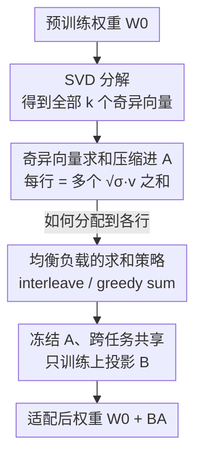

# SumRA: Parameter Efficient Fine-Tuning with Singular Value Decomposition and Summed Orthogonal Basis

**会议**: ICLR 2026  
**OpenReview**: [https://openreview.net/forum?id=v23Pqcm6qp](https://openreview.net/forum?id=v23Pqcm6qp)  
**领域**: 模型压缩 / 参数高效微调  
**关键词**: PEFT, LoRA, 奇异值分解, 初始化策略, 多语种 ASR

## 一句话总结
SumRA 把预训练权重 SVD 得到的**全部**奇异向量按"不相交且负载均衡"的方式求和压缩进 LoRA 的下投影矩阵 $A$，再冻结 $A$ 只训上投影矩阵 $B$，从而在可训练参数减半、且 $A$ 可跨任务共享的前提下，把 Whisper 适配五个新语种的 WER 从 LoRA 的 14.42% 降到 12.41%。

## 研究背景与动机

**领域现状**：把大模型适配到下游任务时，主流走 PEFT 路线，其中 LoRA 是最经典的方案——冻结预训练权重 $W_0$，把权重更新写成两个低秩矩阵之积 $W' = W_0 + BA$，只训 $A$、$B$。后续的 LoRA-FA 进一步把下投影 $A$ 也冻住、只训 $B$，可训练参数和显存再砍一半；PiSSA 则换了个更聪明的初始化：用 $W_0$ 的 SVD 取前 $r$ 个主奇异向量来初始化 $A$、$B$，让微调沿着 $W_0$ "拉伸最强"的方向走，收敛更快、效果更好。

**现有痛点**：把 LoRA-FA 的"冻 $A$"和 PiSSA 的"SVD 初始化"结合本是省参数的好思路，但 PiSSA 只用了排在最前面的几个奇异向量——通常不到全部奇异向量的 5%。每个奇异向量大致只编码模型某一类概念/词表子集的知识，于是 $A$ 的影响力被锁死在一个很窄的子空间里，适配只能动到模型已学知识的一小块。

**核心矛盾**：$A$ 的秩 $r$ 远小于 $W_0$ 的秩 $k$，无法给每个奇异向量都分一行；但小奇异值对应的方向对适配同样有用（不该被直接丢弃）。"想用上全部奇异向量"和"$A$ 只有 $r$ 行"这两件事天然冲突。

**本文目标**：在不增加 $A$ 的秩、不增加可训练参数的前提下，让 $A$ 的初始化能覆盖**全部**奇异向量所携带的知识，从而把适配从"局部"扩展到"全局"。

**切入角度**：既然行数不够分，那就把多个奇异向量**求和**塞进同一行——求和等价于把原本分散在各向量上的计算合并到一起，这种"跨概念共享计算"的做法在相关工作里已被证明有效。

**核心 idea**：把 $A$ 的每一行初始化为"从 SVD 里挑出的多个奇异向量之和"，并设计求和分配策略让重要向量均匀摊开，再冻结 $A$、跨任务共享，实现全局知识适配下的参数高效微调。

## 方法详解

### 整体框架
SumRA 本质上是对 PiSSA 初始化的一次升级：先对预训练权重 $W_0$ 做一次 SVD 拿到全部奇异向量，然后**不是只取前 $r$ 个**，而是把全部 $k$ 个奇异向量分配到 $A$ 的 $r$ 行里、每行内部求和，得到一个把"全模型知识"压缩进去的 $A$；上投影 $B$ 初始化为零以保持初始输出不变。初始化完成后，$A$ 被冻结、只训练 $B$，因此 $A$ 可以在不同任务/语种间共享，存储成本只随 $B$ 增长。

整条流水线如下：

### 关键设计

**1. 奇异向量求和压缩：把全部 SVD 方向塞进低秩 A**

直接痛点是 PiSSA 只用前 $r$ 个主奇异向量，$A$ 的影响范围被困在不到 5% 的知识子空间里。SumRA 的做法是先和 PiSSA 一样做 SVD：

$$\mathrm{SVD}(W_0) = U\Sigma V^\top = \sum_{i=1}^{k} \sigma_i u_i v_i^\top$$

然后把全部 $k$ 个（按 $\sqrt{\sigma}$ 缩放的）奇异向量分配到 $A$ 的 $r$ 行中。设 $a_i \in \mathbb{R}^k$ 是 $A$ 的第 $i$ 行，$S_i$ 是分配给这一行的奇异向量列下标集合，则

$$a_i = \sum_{j \in S_i} \sqrt{\sigma_j}\, v_j$$

这样一来，原本要被丢弃的小奇异值方向也被保留下来——$A$ 不再只盯着"拉伸最强"的几个方向，而是携带了整张知识图谱的信息，特别适合需要"全局"而非"局部"知识迁移的任务（如适配口音、说话风格）。求和的本质是把原本分散在各向量上的计算合并，等价于跨概念共享模型计算。

**2. 不相交正交分配 + 负载均衡的求和策略：避免重要向量互相干扰**

光"求和"还不够——把多个向量加进同一行必然带来信息干扰。SumRA 先用两条约束保证结构良好：每个奇异向量的列下标必须**恰好**分到一个 $S_i$（$\bigcup_i S_i = \{1,\dots,k\}$），且各子集**两两不相交**（$S_i \cap S_j = \varnothing$）。不相交意味着 $A$ 的各行彼此正交（$a_i \perp a_j$），而正交性本身能提升微调时的优化效率。

更关键的是"怎么分"。把最重要的几个奇异向量堆进同一行会造成毁灭性干扰，所以要让它们均匀摊开。论文用每行的**负载** $L_j = \sum_{i \in S_j} \sigma_i$（该行所有奇异值之和）来度量集中度，目标是最小化最大行负载 $L_{\max} = \max_j L_j$。据此对比了三种策略：① block sum 把连续一段下标塞一行，会把大奇异值全堆到前几行，最差；② interleave sum 按 $S_i = \{i, \tfrac{k}{r}+i, \dots\}$ 隔行取，让大值错开；③ greedy sum 把奇异向量按降序逐个分给"当前负载最小"的行，论文在附录证明它能取得**最小可能**的 $L_{\max}$，是最优分配。实验也证实 interleave/greedy 一致优于 block sum。

**3. 冻结 A、跨任务共享：参数减半且存储不随任务数膨胀**

完成初始化后，$A$ 被冻结、$B$ 初始化为零、只训 $B$，这直接把可训练参数砍掉约一半（同 LoRA-FA 思路）。但 SumRA 的真正杀手锏在存储：因为 $A$ 完全由 $W_0$ 的 SVD 决定、不参与训练，它在所有任务/语种间是**同一个**矩阵，可以共享；每来一个新任务只需存一个小小的 $B$。这正好命中多语种、个性化 ASR 的痛点——成千上万用户各需一个 LoRA 时，总存储可达 10 TB，而 SumRA 让 $A$ 不再随任务数累加，存储成本只跟 $B$ 走。

### 损失函数 / 训练策略
训练目标就是标准的 ASR 监督损失，没有额外正则项。优化器用 AdamW + ReduceLROnPlateau 变体调度器；LoRA 模块加在 Whisper 解码器全部前馈和注意力层的线性层上，缩放系数 $\alpha$ 取等于秩 $r$；训练时只更新 LoRA 模块（即 $B$）和归一化层参数，跑两个 epoch、batch size 4、贪心解码。

## 实验关键数据

任务为低资源多语种 ASR：用 Common Voice 把 Whisper（small / large-v2）适配到五个**未见过**的新语种（eo / ia / fy-NL / mhr / kmr），每种仅 10 小时训练数据，指标为 WER（越低越好）。

### 主实验
下表节选 whisper-large-v2、rank=32 的结果（参数列为不可共享部分的额外存储）：

| 方法 | 额外参数 | eo | ia | fy-NL | mhr | kmr |
|------|---------|------|------|-------|------|------|
| LoRA | 34.3M | 14.42 | 8.67 | 24.75 | 32.39 | 37.72 |
| DoRA | 34.9M | 13.45 | 8.28 | 23.38 | 29.67 | 35.59 |
| PiSSA | 34.3M | 13.00 | 8.82 | 22.43 | 29.97 | 34.26 |
| CorDA | 34.3M | 13.13 | 9.18 | 22.96 | 29.20 | 36.33 |
| **SumRA (ours)** | **17.6M** | **12.41** | **8.17** | **22.27** | **27.19** | **34.21** |

SumRA 在参数量减半的情况下，五个语种里四个取得最佳 WER，相对 LoRA 最高提升约 16%（mhr）、相对 CorDA 也能领先到 11%。在 rank=2、whisper-small 等多种配置下结论一致。论文还指出：whisper-small 上全量微调（FT）一般优于 LoRA 类方法，但模型放大到 large-v2 后 FT 更易过拟合，SVD 初始化的方法（PiSSA/CorDA/SumRA）反而能靠"沿主成分方向初始化"抑制过拟合。

### 消融实验
求和策略对比（whisper-small，rank=32）：

| 配置 | 额外参数 | eo | ia | fy-NL | mhr | kmr |
|------|---------|------|------|-------|------|------|
| LoRA | 7.7M | 23.39 | 15.31 | 39.34 | 40.63 | 48.51 |
| SumRA (block sum) | 3.9M | 21.68 | 13.91 | 35.38 | 37.35 | 47.30 |
| SumRA (interleave sum) | 3.9M | 20.77 | 13.38 | 33.37 | 36.30 | 44.47 |
| SumRA (greedy sum) | 3.9M | 20.73 | 13.16 | 33.91 | 37.53 | 44.72 |

数据规模消融（适配 Esperanto，whisper-small）：

| 方法 | 10h | 50h | 100h |
|------|-----|-----|------|
| LoRA | 23.39 | 15.20 | 13.28 |
| SumRA (freeze A) | 20.77 | 14.49 | 13.39 |
| SumRA (train A) | 20.14 | 13.75 | 13.02 |

### 关键发现
- **均衡分配是关键**：block sum 把重要奇异向量堆到同一行造成毁灭性干扰，明显劣于 interleave / greedy；后两者在五语种上一致更优，验证了"用 $L_{\max}$ 度量并均衡负载"的设计动机。
- **越低资源收益越大**：10h 时 SumRA 相对 LoRA 提升最大，到 100h 时增益几乎消失——SumRA 的全局知识更新机制在数据稀缺时价值最高。
- **冻结 A 几乎免费**：解冻 $A$（train A）虽能再降一点 WER，但要付出更多可训练参数和训练开销；冻结版已能在参数减半下超过所有基线。

## 亮点与洞察
- **"求和压缩"替代"截断丢弃"**：以往 SVD 系初始化（PiSSA）都是取 top-$r$ 直接扔掉尾部，SumRA 反其道把全部奇异向量求和塞进固定秩矩阵，是一种很巧的"零额外参数地装下更多知识"的手段。
- **把分配问题转成调度问题**：用行负载 $L_j$ 和最小化 $L_{\max}$ 来刻画"重要向量别扎堆"，再借经典贪心调度（最小负载优先）给出可证明最优解，把一个看似 heuristic 的初始化技巧落到了有理论保证的地基上。
- **存储视角的真创新**：$A$ 由 $W_0$ 唯一决定 ⇒ 跨任务共享 ⇒ 存储只随 $B$ 增长，这条对"千万级 LoRA"的多语种/个性化 ASR 部署极具现实价值，可直接迁移到任何需要大规模 adapter 库的场景。
- 论文还指出 SumRA(interleave) 等价于对多个不同 $A$ 初始化版本做"模型平均"，但在适配前就把方向融合进单一模型，更高效。

## 局限与展望
- **只擅长全局适配**：作者坦承 SumRA 对口音、说话风格这类影响大片词表的"全局属性"有优势；对只需改少量领域术语的"局部适配"收益有限。
- **NLP 任务上不灵**：初步实验显示把 LLaMA 适配到 GLUE 时 SumRA 没有明显增益，因为分类任务主要是在已有表示上学决策边界、不涉及表示空间的大范围平移。
- **改进方向**：可探索按任务类型自适应选择"全局 vs 局部"初始化，或把求和分配做成数据感知（类似 CorDA 用激活协方差重定向）以兼顾局部适配。

## 相关工作与启发
- **vs PiSSA**：PiSSA 只用 top-$r$ 主奇异向量初始化 $A$、且 $A$ 参与训练；SumRA 用**全部**奇异向量求和初始化并冻结 $A$，覆盖更广知识空间、参数更少、$A$ 可共享。
- **vs LoRA-FA**：两者都冻 $A$ 只训 $B$，但 LoRA-FA 用**随机**基初始化 $A$、浪费了 $W_0$ 里的预训练知识；SumRA 用 SVD 的结构化奇异向量初始化，knowledge-aware。
- **vs CorDA**：CorDA 在 SVD 前用目标任务激活协方差对 $W_0$ 重定向（数据感知），但仍是取主成分；SumRA 是数据无关地把全部奇异向量压缩进 $A$，两条路线正交，未来可结合。

## 评分
- 新颖性: ⭐⭐⭐⭐ "求和压缩全部奇异向量 + 负载均衡分配 + 冻结共享"组合清晰且有理论保证，是对 PiSSA/LoRA-FA 的有机改进
- 实验充分度: ⭐⭐⭐ 多模型/多秩/多语种 + 求和策略与数据规模消融较完整，但任务面较窄（基本只在多语种 ASR，NLP 上自承无效）
- 写作质量: ⭐⭐⭐⭐ 动机推导和图示（Fig.2/3）把"为什么求和、为什么要均衡"讲得很直观
- 价值: ⭐⭐⭐⭐ 跨任务共享 $A$ 对大规模 LoRA 部署的存储痛点有直接落地价值

<!-- RELATED:START -->

## 相关论文

- [\[ICLR 2026\] PiCa: Parameter-Efficient Fine-Tuning with Column Space Projection](pica_parameter-efficient_fine-tuning_with_column_space_projection.md)
- [\[ICLR 2026\] Efficient Orthogonal Fine-Tuning with Principal Subspace Adaptation](efficient_orthogonal_fine-tuning_with_principal_subspace_adaptation.md)
- [\[ICLR 2026\] Memba: Membrane-driven Parameter-Efficient Fine-Tuning for Mamba](memba_membrane-driven_parameter-efficient_fine-tuning_for_mamba.md)
- [\[ICLR 2026\] TRAC: Tensor-Train Based Across-Layer Compression for Parameter-Efficient Fine-Tuning](trac_tensor-train_based_across-layer_compression_for_parameter-efficient_fine-tu.md)
- [\[ACL 2025\] C3A: Parameter-Efficient Fine-Tuning via Circular Convolution](../../ACL2025/model_compression/parameter-efficient_fine-tuning_via_circular_convolution.md)

<!-- RELATED:END -->
