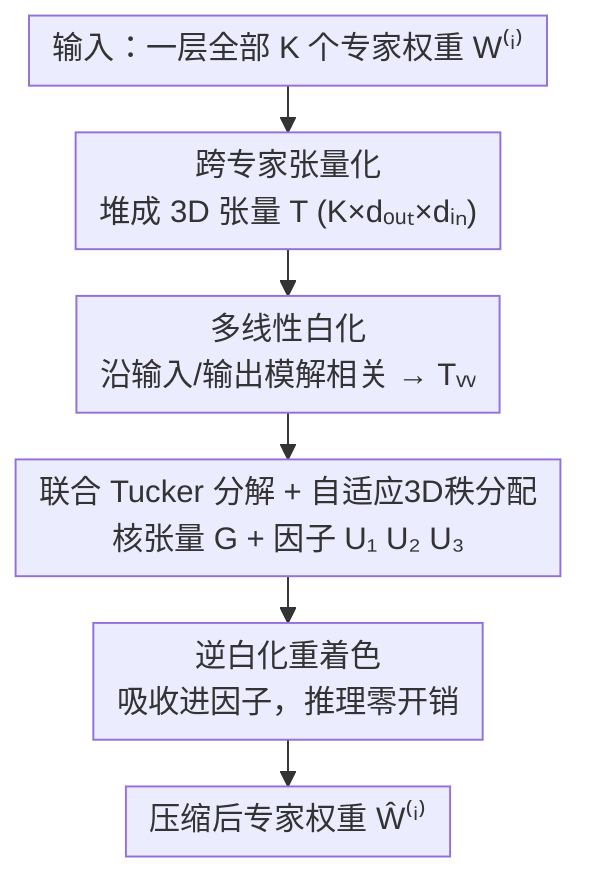

# TD-MoE: Tensor Decomposition for MoE Models

**会议**: ICLR 2026  
**OpenReview**: [https://openreview.net/forum?id=D9cnZNZfxX](https://openreview.net/forum?id=D9cnZNZfxX)  
**代码**: 无  
**领域**: 模型压缩  
**关键词**: MoE 压缩, 张量分解, Tucker 分解, 跨专家冗余, 白化

## 一句话总结
TD-MoE 把 MoE 一层里所有专家的权重堆成一个三维张量做联合 Tucker 分解，再配上多线性白化与自适应 3D 秩分配，从而捕捉到逐专家方法忽略的「专家间结构冗余」，在 20% 压缩下几乎无损、40%/60% 压缩下比 SVD 类 SOTA 高出 11%~14%。

## 研究背景与动机
**领域现状**：Mixture-of-Experts(MoE) 是把大模型扩到万亿参数的关键手段——每个 token 只路由到少数专家，算力可控，但所有专家权重都要常驻显存，带来巨大的内存开销。为压缩 MoE，主流路线有剪枝、合并、量化和低秩分解，其中**分解类方法**最受青睐：它直接把专家里最密的权重矩阵因子化成低秩分量，不改架构、不改路由，天然可扩展。代表作 MoE-SVD 对每个专家的权重矩阵做 SVD，能在保持精度的同时显著减参。

**现有痛点**：但几乎所有现有分解方法（包括 MoE-SVD、MoE-I²）都在**单个专家的粒度**上操作——把每个专家当成孤立的权重矩阵分别截断。MoE-SVD 甚至要靠一个很强的假设：专家冗余主要集中在一个可共享的输入投影空间里，功能特化只发生在输出映射。这种逐专家隔离的视角，把同一层里本应高度相关的专家当成互不相干的个体来处理。

**核心矛盾**：同一层的专家是在相关分布上联合优化出来的，权重模式本就高度相关、存在大量**跨专家的结构冗余**；而逐专家分解只能挖掘每个专家**内部**的低秩性，看不到专家**之间**的共享结构。这导致在高压缩率下精度急剧崩塌——压缩与性能之间的 trade-off 远未做到最优。

**本文目标**：在不动路由、不做压缩后微调的前提下，设计一个能同时利用「专家内 + 专家间」冗余的统一压缩框架，并能精确命中给定的压缩预算。

**切入角度**：作者注意到，SVD 本质上是张量分解的二阶特例。如果把一层的 K 个专家权重矩阵**沿一个新维度堆叠**成三维张量，那么对这个张量做高阶分解，就能在一个统一对象里同时建模专家内结构和专家间相关性——这正是逐专家方法看不到的维度。

**核心 idea**：把 MoE 压缩从「逐专家分解」重新表述为「联合张量分解」——堆张量 + Tucker 分解 + 白化 + 自适应秩分配，用数据感知的方式优雅地削减跨专家冗余，而不做硬性的专家剪枝/合并决策。

## 方法详解

### 整体框架
TD-MoE 要解决的是「逐专家分解看不到专家间冗余」这件事，整体思路是把一层的全部专家权重当成**一个三维张量**来联合压缩。给定一层 K 个专家的权重矩阵 $W^{(i)}\in\mathbb{R}^{d_{out}\times d_{in}}$，流程分四步串行：先把它们沿专家维堆成张量 $\mathcal{T}\in\mathbb{R}^{K\times d_{out}\times d_{in}}$；再用校准数据算出的统计量对输入/输出模做白化，得到良态张量 $\mathcal{T}_w$；接着对 $\mathcal{T}_w$ 做 Tucker 分解，得到一个紧凑核张量 $\mathcal{G}$ 和三个因子矩阵，其秩三元组由一个满足全局压缩预算的自适应分配方案决定；最后把逆白化矩阵吸收进因子完成「重着色」，重建出压缩后的专家权重。整个过程离线完成，推理时零额外开销，也不改变原始路由行为。

### 关键设计

**1. 跨专家张量化：把一层专家堆成 3D 张量，暴露专家间冗余**

这一步针对的就是「逐专家隔离」这个根本痛点。作者不再把每个专家单独分解，而是把一层里 K 个专家矩阵沿一个新的「专家模」堆叠成三维张量 $\mathcal{T}\in\mathbb{R}^{K\times d_{out}\times d_{in}}$——mode-1 索引专家、mode-2 是输出特征、mode-3 是输入特征。这个看似简单的重排，把原本散落的专家集合统一成一个对象，从而让后续分解能**同时**建模专家内部结构和专家之间的相关性。它和剪枝/合并的本质区别在于：剪枝/合并要做「保留/合并/丢弃哪个专家」这种硬性离散决策，而张量化是把专家维的冗余交给后续分解去**数据驱动地、连续地**压缩——专家既不被删也不被强行合并，而是被编码进一个低维的「专家模因子」里。值得注意的是，过去把张量分解用于 CNN/RNN 时，是把单个权重矩阵 reshape 成高阶张量；而 MoE 的专家本来就是一组独立矩阵，沿专家维堆叠是更自然、更能暴露跨专家冗余的高阶组织方式。

**2. 多线性白化：在分解前解相关特征，让低秩近似更均衡**

直接对原始专家权重做分解效果不好，因为输入激活往往高度相关、特征空间病态——此时每个 $W^{(i)}$ 的奇异值并不能忠实反映它对模型行为的真实贡献，会导致糟糕的截断决策。作者把 2D 白化推广到张量场景：用校准集 $D_{calib}$ 收集输入激活 $X$ 和输出梯度 $\nabla_Y L$，算出输入/输出协方差 $\Sigma_{in}=\frac{1}{N}X^TX$、$\Sigma_{out}=\frac{1}{N}(\nabla_Y L)^T(\nabla_Y L)$，再取其正则化平方根逆 $S_{in}=(\Sigma_{in}+\epsilon I)^{-1/2}$、$S_{out}=(\Sigma_{out}+\epsilon I)^{-1/2}$，沿张量的输入模和输出模相乘得到白化张量：

$$\mathcal{T}_w = \mathcal{T}\times_2 S_{out}\times_3 S_{in}.$$

与以往只能处理单个矩阵的 2D 白化不同，这种多线性白化能同时（或单独）对输入模、输出模解相关，并显式适配输入或输出统计量。消融数据很有说服力：白化前激活协方差谱极度病态，特征值跨近四个数量级（如第 9 层从 9 到 $5.4\times10^4$），白化后所有特征值收敛到 1.0、偏差小于 $10^{-7}$；白化前 0.63~0.79 的非对角相关也被几乎完全消除。良态化后的张量让 Tucker 截断更稳定，这是数据感知压缩的关键前提。

**3. 自适应 3D 秩分配：用闭式解把秩三元组精确卡到目标压缩率**

Tucker 分解会把张量近似为核张量 $\mathcal{G}$ 与三个因子矩阵 $U_1\in\mathbb{R}^{K\times r_1}$、$U_2\in\mathbb{R}^{d_{out}\times r_2}$、$U_3\in\mathbb{R}^{d_{in}\times r_3}$ 的乘积，秩三元组 $(r_1,r_2,r_3)$ 同时决定压缩率和重建保真度。这里三个因子在 MoE 语境下有清晰解释：$U_1$ 相当于 $r_1$ 个「元专家」，专门压缩专家间冗余；$U_2$、$U_3$ 定义低维的输出/输入子空间。压缩后总参数为 $P_{tucker}=r_1r_2r_3+(Kr_1+d_{out}r_2+d_{in}r_3)$，相比原始 $P_{orig}=Kd_{out}d_{in}$。问题在于直接在三维空间搜索秩组合代价太高。作者给出闭式约束：固定 $(r_1,r_2)$，满足目标压缩率 $\rho^*$ 的 $r_3$ 可由预算方程直接解出

$$r_3=\frac{(1-\rho^*)P_{orig}-(Kr_1+d_{out}r_2)}{r_1r_2+d_{in}},$$

再投影到合法区间 $1\le r_3\le d_{in}$。这把三维搜索降为对 $(r_1,r_2)$ 的二维扫描 + $r_3$ 的一维闭式更新，能高效地在严格参数预算下找到「最贴近目标模型尺寸」的秩三元组，从而把任意目标压缩率精确落地。

**4. 逆白化重着色：把白化吸收进因子，做到推理零开销**

白化虽然提升了分解质量，但若推理时还要显式做白化/逆白化，就会引入额外算力。作者的做法是把逆白化变换直接吸收进 Tucker 因子里：原始专家张量可恢复为 $\mathcal{T}\approx\mathcal{G}\times_1 U_1\times_2(S_{out}^{-1}U_2)\times_3(S_{in}^{-1}U_3)$，于是部署时直接存储「预着色」后的因子 $U'^{(1)}=U_1$、$U'^{(2)}=S_{out}^{-1}U_2$、$U'^{(3)}=S_{in}^{-1}U_3$。这样白化与重着色全部在离线分解阶段完成，推理时拿到的就是普通的低秩因子，不带任何运行时开销。配合随机化 Tucker 实现，单步复杂度为 $O(d_{out}d_{in}r)$，与专家数 $K$ 解耦；而逐专家 SVD 需要 $E\cdot O(d_{out}d_{in}\min(d_{out},d_{in}))$，随专家数线性增长。专家越多，TD-MoE 的可扩展优势越明显。

### 损失函数 / 训练策略
TD-MoE 是**纯后训练（post-training）**方法，不做任何微调。优化目标是让压缩后权重在校准分布上保持原模型的激活行为：

$$\min_{\{\hat W^{(i)}\}}\ \mathbb{E}_{x\sim D_{calib}}\Big[\textstyle\sum_{i=1}^{K}\|W^{(i)}x-\hat W^{(i)}x\|_2^2\Big],$$

在白化后的张量上转化为 Frobenius 范数下的 Tucker 重建误差 $\min_{\mathcal{G},U_1,U_2,U_3}\|\mathcal{T}_w-\mathcal{G}\times_1 U_1\times_2 U_2\times_3 U_3\|_F^2$。实现上固定用 256 条 WikiText-2 样本算白化统计量，协方差特征值低于 $10^{-3}$ 的部分截断以保数值稳定；对 Qwen2-57B-A14B 用完整 3 模分解，对 Mixtral-8×7B 用「保留专家维」的方案以便和 MoE-SVD 公平对比。

## 实验关键数据

### 主实验
在 Qwen2-57B-A14B（8+64 专家）和 Mixtral-8×7B（8 专家）上，覆盖 7 个常识推理基准 + 3 个语言建模困惑度数据集，全程无微调。下表取常识推理平均准确率（output-whitening 变体）：

| 模型 | 压缩率 | 原始 | MoE-SVD | TD-MoE | 相对提升 |
|------|--------|------|---------|--------|----------|
| Qwen2-57B-A14B | 20% | 0.59 | 0.56 | 0.58 | ↑4% |
| Qwen2-57B-A14B | 40% | 0.59 | 0.48 | 0.56 | ↑6%~17%* |
| Qwen2-57B-A14B | 60% | 0.59 | 0.47 | 0.51~0.52 | ↑11% |
| Mixtral-8×7B | 20% | 0.63 | 0.58 | 0.62 | ↑7% |
| Mixtral-8×7B | 40% | 0.63 | 0.50 | 0.57 | ↑14% |
| Mixtral-8×7B | 60% | 0.63 | 0.37 | 0.45 | ↑22%(input) |

*40% 的相对提升论文在准确率/困惑度上分别报到 6% 与 17%（口径不同）。困惑度侧同样领先，如 Mixtral 40% 压缩下 TD-MoE(output) 达 WikiText2/PTB/C4 = 5.79/24.60/9.21，远好于 MoE-SVD 的 6.74/27.73/12.41。20% 压缩下两个模型相对原始模型的绝对掉点均 <1%，近乎无损。

### 消融实验
| 配置 | 关键现象 | 说明 |
|------|---------|------|
| 白化前 vs 后（Table 2） | 特征值从跨 4 个数量级 → 全部≈1.0（偏差 <$10^{-7}$） | 白化把病态谱拉平，非对角相关 0.63~0.79 → <$10^{-7}$ |
| + NF4 量化（Table 4） | 20% 压缩 LM-PPL 9.81→9.70、推理准确率不变 | 与量化正交可叠加 |
| + 结构化剪枝（Table 4） | 20% 压缩再剪到 40% 稀疏，推理 Acc 0.66→0.61 平滑下降 | Tucker 域内按核切片能量剪枝 |
| 校准量 N / 截断阈 τ（Table 5） | N 从 128→2k：ΔPPL≤0.03；τ 扫 4 个量级：ΔPPL≤0.09 | 对超参高度鲁棒 |

### 关键发现
- **三大组件缺一不可**：跨专家联合分解提供「看到专家间冗余」的能力，白化保证截断决策可靠，秩分配保证精确命中预算；消融显示去掉任一项都会掉点。
- **输入 vs 输出白化各有所长**：output-whitening 在低压缩率更优（更好地保住输出分布主方向），input-whitening 在高压缩率（60%）更稳（抑制病态输入激活被放大）。
- **专家越多越占便宜**：分解复杂度 $O(d_{out}d_{in}r)$ 与专家数解耦，相比逐专家 SVD 随 $K$ 线性增长，在 Qwen2 这种 64 专家模型上可扩展优势明显。
- **高度鲁棒**：对校准集大小、截断阈值、甚至语料迁移（WikiText-2→PTB）都几乎不敏感，说明白化让分解工作在良态区间。

## 亮点与洞察
- **视角转换最值钱**：把「逐专家分解」重述为「沿专家维堆张量做联合分解」，一行重排就把一个看不见的冗余维度暴露出来——$U_1$ 那 $r_1$ 个「元专家」是对专家间冗余的优雅连续编码，避免了剪枝/合并的硬决策。
- **闭式秩分配很实用**：把 3D 秩搜索降成「2D 扫描 + 1D 闭式解」，让方法能精确卡住任意目标压缩率，这对工程落地（给定显存预算反推配置）非常友好，可迁移到任何 Tucker/张量压缩场景。
- **白化吸收进因子=零推理开销**：把训练期的数据感知变换在离线阶段「焊死」进低秩因子，部署时就是普通低秩层——这个「离线吸收」trick 在很多需要数据校准的压缩方法里都能复用。
- **与量化/剪枝正交可叠加**：Tucker 域天然适合按核切片能量做结构化剪枝，再叠 NF4 量化，压缩链路可组合。

## 局限与展望
- **依赖校准数据**：白化统计量来自 256 条 WikiText-2 样本，虽显示对语料迁移鲁棒，但极端分布偏移下的表现未充分验证。
- **分解阶段更慢**：随机化 Tucker 在 Mixtral 上比逐专家 SVD 慢 1.3~2.2×（不过在 Phi-3.5-MoE 这种更宽 FFN 上反而快 2.5~4.6×，且全程离线、不影响推理）。
- **60% 高压缩仍有明显掉点**：尽管比基线更抗压，60% 下所有方法都不可避免地退化，准确率从 0.63 跌到 0.45~0.52，离实用还有距离。
- **未覆盖共享专家的特殊处理**：Qwen2 的 8 个共享专家与 64 个标准专家是否应区别对待，论文未深入；这可能是进一步提分的空间。

## 相关工作与启发
- **vs MoE-SVD**：MoE-SVD 逐专家做 SVD，并假设冗余集中在「可共享的输入投影空间」、特化只在输出映射——这是个很强且未必成立的先验。TD-MoE 不做任何此类假设，直接用张量分解让数据决定专家间/内的冗余怎么压，在 40%/60% 压缩下大幅领先。
- **vs MoE-I² / 剪枝合并类**：这些方法靠相似度、激活频率等启发式做「保留/合并/丢弃专家」的硬决策，决策过程复杂且离散；TD-MoE 把专家维冗余交给因子矩阵 $U_1$ 连续地、数据驱动地削减，更平滑。
- **vs 经典张量分解压缩 CNN/RNN**：以往是把单个权重矩阵 reshape 成高阶张量（依赖卷积核天然的多维结构）；TD-MoE 的创新在于发现 MoE 的「一组独立专家」本身就是一个可堆叠的高阶组织，沿专家维堆叠才是暴露跨专家冗余的正确打开方式。

## 评分
- 新颖性: ⭐⭐⭐⭐⭐ 把 MoE 压缩从逐专家 SVD 升维到跨专家联合 Tucker 分解，视角转换干净有力。
- 实验充分度: ⭐⭐⭐⭐ 两个主力 MoE + Phi-3.5、10 个任务、多压缩率、白化/量化/剪枝/超参四组消融齐全，但缺少与更多最新量化/合并 SOTA 的端到端对比。
- 写作质量: ⭐⭐⭐⭐ 公式与图示清晰，三大组件动机讲得透；个别表述（如相对提升口径）略需对照表格才能厘清。
- 价值: ⭐⭐⭐⭐ 无微调、不改路由、推理零开销，与量化/剪枝正交可叠加，对大规模 MoE 部署有直接实用价值。

<!-- RELATED:START -->

## 相关论文

- [\[ICLR 2026\] LeSTD: LLM Compression via Learning-based Sparse Tensor Decomposition](lestd_llm_compression_via_learning-based_sparse_tensor_decomposition.md)
- [\[ICLR 2026\] KBVQ-MoE: KLT-guided SVD with Bias-Corrected Vector Quantization for MoE Large Language Models](kbvq-moe_klt-guided_svd_with_bias-corrected_vector_quantization_for_moe_large_la.md)
- [\[ICLR 2026\] REAP the Experts: Why Pruning Prevails for One-Shot MoE Compression](reap_the_experts_why_pruning_prevails_for_one-shot_moe_compression.md)
- [\[ICLR 2026\] Steering MoE LLMs via Expert (De)Activation](steering_moe_llms_via_expert_deactivation.md)
- [\[ICLR 2026\] MoBE: Mixture-of-Basis-Experts for Compressing MoE-based LLMs](mobe_mixture-of-basis-experts_for_compressing_moe-based_llms.md)

<!-- RELATED:END -->
