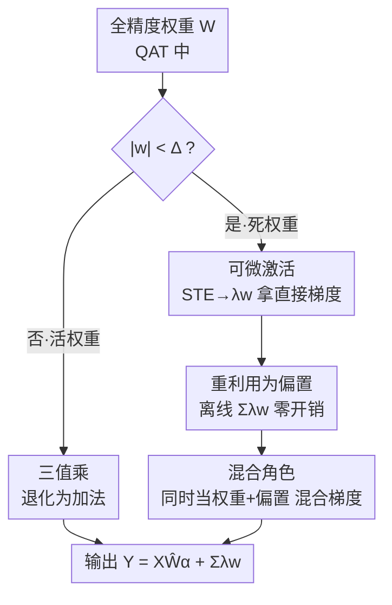

# Tequila: Trapping-free Ternary Quantization for Large Language Models

**会议**: ICLR 2026  
**OpenReview**: [https://openreview.net/forum?id=9CZzD5LWdy](https://openreview.net/forum?id=9CZzD5LWdy)  
**代码**: https://github.com/Tencent/AngelSlim/tree/tequila/TernaryQuant  
**领域**: 模型压缩  
**关键词**: 三值量化, 死区陷阱, 动态偏置, 量化感知训练, 边缘部署

## 一句话总结
针对三值量化（权重压到 {-1, 0, +1}）中大量权重被卡在"死区"边界、收不到有效梯度的问题，本文提出 Tequila，把这些"死权重"重新激活成可微的**动态偏置**，让它们既能在前向贡献信号、又能在反向收到直接梯度，几乎零推理开销下把 ARC 上的精度比 SOTA 三值方法提升 >4%，逼近全精度（差距 <1%）并获得 3.0× 推理加速。

## 研究背景与动机

**领域现状**：把 LLM 部署到资源受限的边缘设备上，量化是主流手段。但大多数量化方法（AWQ、GPTQ 等）依赖混合精度乘法，需要服务器级 GPU 的专用硬件支持，在手机/CPU 这类边缘硬件上跑不动。三值量化把权重限制在 {-1, 0, +1}，可以把昂贵的乘法直接退化成加法（输入按符号累加），几乎所有硬件都原生支持，是 on-device 部署的理想路径。

**现有痛点**：三值压缩太激进，信息损失严重，即使用海量数据做代价高昂的量化感知训练（QAT）也很难追平全精度。BitNet 烧了 4T tokens 训练仍达不到全精度水平；BitCPM4 即便从预训练模型出发也要 100B tokens。也就是说，三值 LLM 同时被"精度掉点"和"训练成本爆炸"两座大山压着。

**核心矛盾**：作者把根因定位为**死区陷阱（deadzone trapping）**。三值量化在 $(-\Delta, \Delta)$ 之间造了一个很大的死区，落进去的权重被量化成 0。训练时这些"死权重" $\hat{w}_i=0$ 在前向被剪掉、对输出 $Y$ 和 loss $L$ 几乎无贡献，于是上游梯度 $\partial L/\partial Y$ 对它们不敏感；再叠加 STE（直通估计器）注入的噪声，这些权重收到的梯度又吵又没信息量（GSNR 极低）。结果它们既逃不出死区、偶尔逃出又被反向梯度拉回来，长期堆在死区边界来回震荡，大批权重事实上"长期失活"，模型容量和优化效率双双崩坏。

**本文目标**：在不牺牲三值"纯加法"硬件效率的前提下，把这批死权重重新利用起来，让它们既贡献前向信号、又能拿到干净有效的梯度，从而打破死区陷阱。

**切入角度**：与其想办法把死权重"挤出"死区（治标），不如换个思路——让死权重以另一种身份继续参与计算。作者观察到，只要死权重能对输出贡献哪怕很小但有信息的值，就能打通反向的梯度通路。

**核心 idea**：把死区里的权重 **repurpose（重新利用）成动态偏置**——它们在前向以偏置形式给输出加一个连续信号，在反向沿偏置项收到直接、有信息的梯度；而且这个偏置只依赖权重、与输入无关，可以离线预计算融进 kernel，推理几乎零开销。

## 方法详解

### 整体框架

Tequila 不是一个全新的量化器，而是一个**可插拔（plug-and-play）的优化模块**，挂在已有三值量化（如 AbsMean / AbsMedian）之上。它的思路是分三步从"朴素三值"演进到最终方案：先用 **Minima Reactivation** 验证"激活死权重"这个方向可行但有两个硬伤（梯度仍靠 STET 不稳、偏置依赖输入有推理开销）；再用 **可微激活** 替掉 STE 拿到干净梯度；再把激活项 **离线化成纯偏置** 消除推理开销；最后用 **混合角色** 让死权重同时当权重和偏置，兼得输入信息与直接梯度。最终前向写成：

$$Y = X Q(W) + C(W) = X\hat{W}\alpha + \sum_{i\in D}\lambda w_i,$$

其中 $Q(W)$ 是常规三值矩阵乘（退化为加法），$C(W)=\sum_{i\in D}\lambda w_i$ 是死区权重贡献的偏置，相当于给死区权重接了一条残差连接。$D$ 是死区权重的下标集合，$\lambda$ 是激活系数（默认 $10^{-3}$）。

### 关键设计

**1. 可微激活：用 $\lambda w_i$ 缩放替掉 STE，给死权重一条干净的梯度通路**

朴素三值里死权重靠 STE 估梯度，等于在 $\text{sign}(\cdot)$ 这个不可导操作上硬塞一个直通近似，噪声大、训练不稳。Minima Reactivation 把死权重激活成带符号的常量极小值 $0^-/0^+$（对任意输入 $x$ 都映射成 $\pm\varepsilon$），虽然让死权重开始贡献前向信号、GSNR 抬高了，但 $\text{sign}(\cdot)$ 的梯度仍走 STE，依旧吵，只换来边际收益。Tequila 的改法是把"映射到常量 $\pm\varepsilon$"换成"按 $\lambda w_i$ 线性缩放"，前向变为

$$Y \approx \alpha\sum_{i\in\bar D}\text{sign}(w_i)x_i + \lambda\sum_{i\in D}\text{sign}(x_i)w_i,$$

这个激活函数对 $w_i$ 是光滑可导的，**绕开了 STE**，死权重因此能拿到直接、随下游 loss 成比例变化的梯度，优化方向明确，训练也更稳。

**2. 重利用为偏置：把在线的输入相关项近似成离线纯偏置，换来几乎零推理开销**

设计 1 里那个激活项 $\lambda\sum_{i\in D}\text{sign}(x_i)w_i$ 依赖输入 $x$，每次前向都得现算，推理时是实打实的额外开销。Tequila 把它近似成与输入无关的纯偏置：$\lambda\sum_{i\in D}\text{sign}(x_i)w_i \approx \lambda\sum_{i\in D}w_i$。这样做有两点依据：一是它依然忠于"让死权重对输出有贡献"的初衷，而偏置正是一种 activation-free 的贡献方式，完美契合假设；二是有经验支撑——原始的输入相关偏置向量和简化后的纯偏置向量在训练中余弦相似度 >70%，说明简化保留了本质功能。这个纯偏置只依赖权重，可以**离线预计算并融进推理 kernel**，实测额外计算成本 <0.1%，从而保住了三值"纯加法"的硬件效率。

**3. 混合角色：让死权重同时当权重和偏置，叠出混合梯度兼得输入信息与干净信号**

如果死权重彻底变成纯偏置 $\sum_{i\in D}\lambda w_i$，梯度是干净了，但丢掉了宝贵的输入相关信息（偏置项不带 $x$）。Tequila 让激活后的死权重身兼二职：既作为动态偏置进入 $C(W)$，又继续作为参与者留在三值矩阵乘里。这样它收到的梯度是两条通路叠加的——标准三值通路（带输入）与直接偏置通路（干净），即

$$\frac{\partial L}{\partial w_i} = x_i\frac{\partial L}{\partial Y} + \lambda\frac{\partial L}{\partial Y}, \quad \forall i\in D.$$

混合梯度既保留了输入相关信息、又享受了直接有信息的梯度信号，比"纯偏置只给单一梯度"更利于优化。消融显示这一项贡献最大（+1.9%）。靠这三个设计，Tequila 在训练全程都维持着高且稳定的 GSNR，实现"trapping-free"的优化。

### 损失函数 / 训练策略
训练沿用标准 QAT：维护一份全精度权重副本累积梯度，前向用三值量化函数 $Q(\cdot)$（AbsMean，$\alpha=\frac{1}{n}\sum|w_i|$，$\Delta=\alpha/2$），反向走全精度梯度。Tequila 只是在前向额外加上偏置项 $C(W)$、并改写死区权重的反向梯度，不引入新 loss。默认 $\lambda=10^{-3}$，学习率固定 $10^{-4}$，group size 128，QAT 用 UltraFineWeb 采样的 10B tokens，量化 transformer 内所有线性层。

## 实验关键数据

### 主实验
在 LLaMA-3.2-1B/3B 上，用 10B tokens 做 QAT，对比各类三值量化方法（六个 zero-shot benchmark 平均）：

| 模型 | 方法 | ARC-e | ARC-c | 平均 |
|------|------|-------|-------|------|
| 1B | BF16（全精度参考） | 0.654 | 0.313 | 0.502 |
| 1B | AbsMean（SOTA 静态） | 0.603 | 0.259 | 0.445 |
| 1B | **Tequila+AbsMedian** | 0.645 | 0.308 | **0.477** |
| 3B | BF16（全精度参考） | 0.745 | 0.422 | 0.580 |
| 3B | AbsMean（SOTA 静态） | 0.672 | 0.329 | 0.510 |
| 3B | **Tequila+AbsMean** | 0.702 | 0.346 | **0.530** |

Tequila 在 1B/3B 上均超过所有 baseline，平均提升 >2.6%；ARC-e/ARC-c 上提升 >4%，与 BF16 差距 <1%。

与其他成熟三值 LLM 直接比（不同训练 token 预算，平均 5 个 benchmark）：

| 模型 | Size | #Tokens | 平均 |
|------|------|---------|------|
| BitNet | 3B | 100B | 0.527 |
| Spectra | 3.9B | 100B | 0.567 |
| **TequilaLLM** | 3B | **10B** | **0.576** |

TequilaLLM-3B 仅用 10% 的训练 tokens 就比 SOTA 的 Spectra-3.9B 平均高 0.9%，同时收敛更快。

### 消融实验
1B 模型在 ARC-Easy 上逐项拆解（基线 AbsMean 60.3%）：

| 配置 | 精度 | 说明 |
|------|------|------|
| AbsMean | 60.3% | 关闭所有激活 |
| Minima Reactivation | 61.5% | 只激活前向信号、梯度仍靠 STE（+1.2%） |
| Tequila w/o Mixed Gradients | — | 加可微激活、死权重当纯偏置（再 +1.1%） |
| Tequila（Full） | 64.5% | 再加混合梯度（再 +1.9%） |

### 关键发现
- **混合梯度贡献最大（+1.9%）**：说明让死权重身兼"权重+偏置"双职、拿到混合梯度，比当纯偏置只给单一梯度更有效。
- **可微激活 > STE（+1.1%）**：绕开 STE 直接反传，比常量极小值映射更能缓解死区陷阱。
- **静态量化反而优于可学习量化**：LSQ/SEQ/DLT 这类可学习方法普遍不如 AbsMean 等静态方法——可学习参数变多会拖慢收敛、更易陷局部最优，印证了开源三值 LLM 偏爱静态 AbsMean 的趋势。
- **$\lambda$ 敏感性**：激活系数 $\lambda$ 在较宽范围内稳健，默认 $10^{-3}$；过大过小都会掉点。
- **推理零开销**：偏置项离线预计算，额外成本 <0.1%，CPU 上 3.0× 加速，与纯三值 BitNet 同档。

## 亮点与洞察
- **把"缺陷"变"资源"**：死区一直被当成三值量化的固有损失来源，本文反手把死区权重重新利用成动态偏置——同一批权重，换个身份就从"拖累优化"变成"扩容+清梯度"，这个视角转换很巧。
- **离线偏置是点睛之笔**：靠"输入相关偏置 ≈ 纯偏置（余弦相似 >70%）"这个经验近似，把在线开销抹成离线常量，既保住性能又保住硬件效率，是"零开销"成立的关键。
- **GSNR 作为诊断工具**：用梯度信噪比量化"死权重梯度有多吵"，把抽象的"死区陷阱"变成可观测的曲线，诊断和验证一气呵成。
- **可迁移性**：plug-and-play 设计可挂到大多数三值量化方案上；"用可微残差旁路给被压制的参数补梯度"的思路，或许也能迁到其他极端量化/稀疏化场景。

## 局限与展望
- 偏置近似（输入相关 → 纯偏置）依赖 >70% 余弦相似这一经验观察，在更深/更大模型或不同数据分布下是否依然成立，缺乏理论保证。
- 实验主要在 1B–4B 规模、10B tokens 预算下验证；更大模型、更长训练下死区陷阱的形态与该方案的收益是否保持，仍待检验。
- 偏置项虽然推理零开销，但训练时混合角色让每个死区权重多走一条梯度通路，训练计算/显存略增，论文未量化训练侧开销。
- $\lambda$ 为全局固定超参，是否需要按层/按通道自适应（不同层死区比例差异大）值得探索。

## 相关工作与启发
- **vs 朴素三值（TWN / AbsMean / BitNet）**：它们让死权重彻底失活、只靠 STE 估梯度，长期卡在死区边界震荡；Tequila 把死权重激活成可微动态偏置，给出直接梯度，逼近全精度且训练 token 少一个量级。
- **vs Minima Reactivation（本文的中间方案/消融项）**：它把死权重映射成带符号常量 $\pm\varepsilon$，前向开始贡献信号但梯度仍走 STE、且偏置依赖输入有推理开销；Tequila 用可微缩放 $\lambda w$ 换掉常量、再离线化偏置，同时解决"梯度吵"和"推理慢"。
- **vs 可学习量化（LSQ / SEQ / DLT）**：它们把 $\alpha/\Delta$ 设为可训练参数，但收敛慢易陷局部最优、整体不如静态法；Tequila 不动量化阈值，而是从优化动力学（死区梯度）入手，正交且互补。

## 评分
- 新颖性: ⭐⭐⭐⭐⭐ 把死区权重重利用成可微动态偏置、并离线化做到零开销，视角新颖
- 实验充分度: ⭐⭐⭐⭐ 多模型多 benchmark + 消融 + GSNR/收敛/推理分析齐全，但规模上限到 4B
- 写作质量: ⭐⭐⭐⭐⭐ 从死区陷阱诊断到三步演进逻辑清晰，图示与公式配合到位
- 价值: ⭐⭐⭐⭐⭐ 让三值 LLM 用 10% tokens 逼近全精度且 3× 加速，对边缘部署实用价值高

<!-- RELATED:START -->

## 相关论文

- [\[ICLR 2026\] MicroMix: Efficient Mixed-Precision Quantization with Microscaling Formats for Large Language Models](micromix_efficient_mixed-precision_quantization_with_microscaling_formats_for_la.md)
- [\[ICLR 2026\] Quant-dLLM: Post-Training Extreme Low-Bit Quantization for Diffusion Large Language Models](quant-dllm_post-training_extreme_low-bit_quantization_for_diffusion_large_langua.md)
- [\[ICLR 2026\] QWHA: Quantization-Aware Walsh-Hadamard Adaptation for Parameter-Efficient Fine-Tuning on Large Language Models](qwha_quantization-aware_walsh-hadamard_adaptation_for_parameter-efficient_fine-t.md)
- [\[ICLR 2026\] KBVQ-MoE: KLT-guided SVD with Bias-Corrected Vector Quantization for MoE Large Language Models](kbvq-moe_klt-guided_svd_with_bias-corrected_vector_quantization_for_moe_large_la.md)
- [\[ACL 2025\] Spectra 1.1: Scaling Laws and Efficient Inference for Ternary Language Models](../../ACL2025/model_compression/scaling_laws_and_efficient_inference_for_ternary_language_models.md)

<!-- RELATED:END -->
