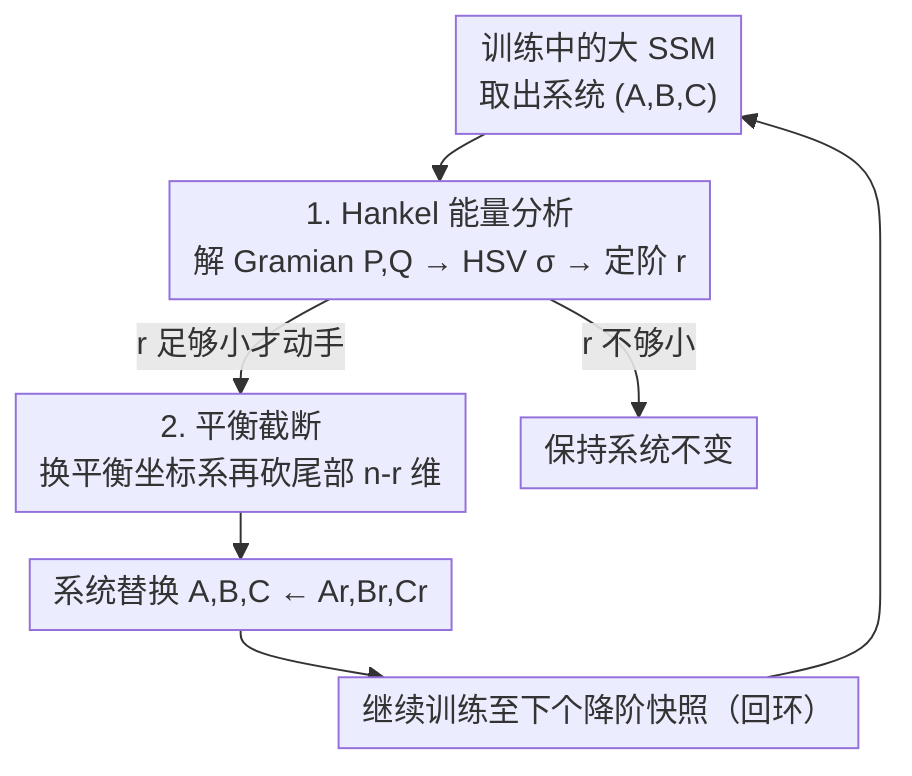

# The Curious Case of In-Training Compression of State Space Models

**会议**: ICLR 2026  
**OpenReview**: [https://openreview.net/forum?id=LtzmeSMBTW](https://openreview.net/forum?id=LtzmeSMBTW)  
**代码**: https://github.com/camail-official/compressm  
**领域**: 模型压缩  
**关键词**: 状态空间模型, 平衡截断, Hankel奇异值, 训练中压缩, 模型降阶

## 一句话总结
本文提出 COMPRESSM，把控制论里的「平衡截断 + Hankel 奇异值分析」搬到 SSM 的训练过程中，在训练早期就识别并砍掉对输入输出贡献低的状态维度，让模型「从大开始、训练中变小」，既加速训练又保留了直接训小模型会丢掉的关键结构。

## 研究背景与动机

**领域现状**：状态空间模型（SSM，如 S4、LRU、Mamba 这一系）凭借「训练可并行、推理像 RNN 一样快」的特性，成为长序列建模的有力选手。它的核心是一个维护隐状态 $h$ 的线性动力系统 $h(k{+}1)=Ah(k)+Bx(k),\ y(k)=Ch(k)+Dx(k)$，而每一步更新的开销随状态维度 $n$ 增长。

**现有痛点**：SSM 的算力不仅随序列长度涨，还被状态维度 $n$ 进一步放大，所以压缩状态维度是同时省显存和省时间的直接手段。但现有的结构化压缩——知识蒸馏、训练后量化、低秩分解、结构化剪枝——几乎都是**训练后**做的：先把一个大模型完整训到收敛，再压。这意味着那笔昂贵的大模型预训练成本一分都省不掉。

**核心矛盾**：表达力与算力之间存在 trade-off。直接训一个小状态维度的模型很省，但实验里它往往学不到大模型才能捕捉的「任务关键结构」，性能明显掉；而要拿到好性能就得先训大模型，再压缩又得付两遍成本。

**本文目标**：能不能不先训大模型到底，而是在**训练过程中**就把状态维度压下来，做到「既享受大模型早期的表达力红利，又省掉后 90% 训练的算力」。

**切入角度**：作者回到 SSM 的控制论出身。控制论里有一套成熟工具——Hankel 奇异值（HSV）度量每个状态方向的「能量/重要性」，平衡截断（balanced truncation）能在有误差保证的前提下把高维系统降到低维。关键观察是：训练过程中 SSM 主导的 Hankel 奇异值是**保序的**（rank-preserving），即早期不重要的维度后面通常也不会突然变重要。

**核心 idea**：用 Hankel 奇异值在训练早期给状态维度打能量分，一旦某些维度的相对能量跌破阈值就用平衡截断把它们砍掉，让 SSM「越训越小」。

## 方法详解

### 整体框架

COMPRESSM 不动 SSM 层外面的投影、非线性、卷积、跳连等任何设计，而是**外科手术式**地只作用在 SSM 层内部那个离散线性动力系统 $(A,B,C)$ 上。整套流程在训练早期（通常是学习率 warm-up 阶段）按固定间隔对模型快照执行：对每个 SSM 块（若是逐通道的 SISO 系统则按通道）算一遍状态维度的重要性，把不重要的维度截掉，再把瘦身后的系统装回模型继续训练。

对单个块/通道，一次降阶的完整流转是：抽出当前系统矩阵 $(A,B,C)$ → 解 Lyapunov 方程得到可控/可观 Gramian $P,Q$ → 由 $\sigma=\mathrm{sort}_\downarrow\sqrt{\mathrm{spec}(PQ)}$ 算出 Hankel 奇异值 → 按能量阈值定出保留阶数 $r$ → 若 $r$ 足够小则做平衡变换 + 截断到 $r$ 阶 → 把截断后的 $(A_r,B_r,C_r)$ 写回模型权重，之后正常训练直到下一个降阶快照。

> 说明：训练中早截断为何合法（设计 3 的谱稳定性）和务实变体（设计 4 的验证集守门）是支撑这套回环成立的依据与可选控制策略，不是流水线上独立的节点。

### 关键设计

**1. Hankel 能量分析与降阶判据：用控制论给每个状态维度打能量分**

直接看 $A,B,C$ 的数值大小没法判断哪个状态维度重要，因为同一个输入输出映射可以有无数种坐标系下的等价实现。作者借控制论的 Gramian 把「重要性」量化下来：在系统稳定、可控、可观的假设下，解离散 Lyapunov 方程 $APA^\top - P + BB^\top = 0$ 得到可控 Gramian $P$（衡量每个状态被输入激发的难易），解 $A^\top QA - Q + C^\top C = 0$ 得到可观 Gramian $Q$（衡量每个状态对输出的贡献）。二者合起来的 Hankel 奇异值

$$\sigma = \mathrm{sort}_\downarrow\left(\sqrt{\mathrm{spec}(PQ)}\right)$$

同时刻画了一个状态方向「既容易被输入驱动、又强烈影响输出」的程度，是与坐标系无关的内禀重要性。降阶判据就建在它上面：找最小的 $r$ 使前 $r$ 个奇异值保住总能量的 $(1-\tau)$ 比例，$r=\min_k\{\,k:\sum_{i=1}^{k}\sigma_i\ge(1-\tau)\sum_{i=1}^{n}\sigma_i\,\}$。容差 $\tau$ 越大，砍得越狠。许多现代 SSM 的 $A$ 是对角的，此时 Gramian 有闭式解，这一步几乎不增加额外开销。

**2. 平衡截断：换到「重要性对角」坐标系再砍尾部维度**

光知道每个奇异值大小还不够，得真正把对应的低能量维度从系统里去掉，且不能破坏稳定性。平衡截断（balanced truncation）先用变换矩阵 $T$ 把系统变到**平衡实现**——在这个坐标系里可控与可观 Gramian 相等且同时对角化 $W=\mathrm{diag}(\sigma)$，每个状态维度的「重要性」一目了然。然后把系统按 $r$ 切块，只保留对应大奇异值的左上 $r\times r$ 子系统：$(A_r,B_r,C_r)=(A_b[{:}r,{:}r],\,B_b[{:}r,:],\,C_b[:,{:}r])$。它的妙处在于有**误差保证**：截断系统 $\hat G$ 与原系统的 $H_\infty$ 误差被丢掉的奇异值之和界住，$\|G-\hat G\|_\infty\le 2\sum_{i=r+1}^{n}\sigma_i$，所以只要砍的都是小奇异值，输入输出行为的偏差就可控，且降阶后系统仍然稳定。截断完按架构需要可能要重新对角化以保持计算一致性，再写回权重。

**3. 训练中早截断为何成立：用谱稳定性把「早砍」合法化**

把训练后才用的工具搬到训练早期，最大的风险是：万一某个现在看着不重要的维度，训练到后期突然变关键，早砍就砍错了。作者用 Weyl 定理给出依据。梯度更新让 $(A,B,C)$ 增量变成 $(A',B',C')$，Gramian 与 Hankel 奇异值都对这种扰动连续。把 HSV 写成某个 Hermitian 矩阵 $H=(P^{1/2}QP^{1/2})^{1/2}$ 的特征值，Weyl 定理保证每个奇异值一步内的变化不超过扰动 $\delta H$ 的最大绝对特征值：$|\sigma_i(W')-\sigma_i(W)|\le\max_i|\sigma_i(\delta W)|$。也就是说奇异值是「平滑漂移」而非乱跳。理论只能保证连续性，但作者在 sMNIST 上逐步追踪单个 LRU 块的 HSV 轨迹（用这个连续性界把每条轨迹隔离开，必要时用线性指派求解还原顺序），实证发现：经过很短的初始步数后，奇异值的相对排序基本不变，底部 $r$ 个维度的累计能量也很快稳定、几乎不再增长。这三条（可追踪、排序稳定、底部能量不上升）正是早截断不会误伤关键维度的经验保证。

**4. 务实变体：用验证集守门 + 回滚，免去手调容差**

固定容差 $\tau$ 需要预先调参，且不知道大模型上界到底在哪。作者给了一个更省心的变体：每次按固定比例（约 10%）截断前先存一个检查点，截断后再训很少几步并在验证集上评估——只要验证性能还在涨就继续下一次截断；一旦掉点，就丢弃这次截断、回滚到上一个检查点，并停止后续所有截断。这样无需显式设定截断次数或容差，就能保证模型质量始终贴着未压缩基线，把「该砍多少」交给训练动态自己决定。

### 损失函数 / 训练策略
方法不引入额外损失项，沿用标准 SSM 训练流程（实验里用 LRU，含序列混合层的学习率因子等 LRU 训练细节）。降阶只在训练早期触发：除 IMDB、sMNIST 外的数据集，在占总步数 10% 的学习率 warm-up 期内做四次等间隔截断尝试，把瘦身红利留给后 90% 的训练；sMNIST 不做学习率衰减，故全程尝试截断；IMDB 因易过拟合，加了等待阶段并在更小的时间窗内截断。仅当降阶后维度小于当前维度的 95% 时才真正执行截断。

## 实验关键数据

### 主实验
在 LRU 上跑 sMNIST 与 Long Range Arena（LRA）系列任务，5 个随机种子、报告 top-3 均值。基线是「直接初始化在压缩模型平均终态维度」的非压缩模型，以做公平对比。

| 数据集 | 容差 τ | COMPRESSM 终态维度 | COMPRESSM 准确率 | 同维度基线准确率 | 全维度基线 |
|--------|--------|--------------------|------------------|------------------|-----------|
| CIFAR10 | $1.5\times10^{-1}$ | 57.4 | 84.4 | 78.2 | 86.5（dim 384）|
| CIFAR10 | $1\times10^{-1}$ | 92.6 | 85.7 | 81.8 | 86.5 |
| sMNIST | $4\times10^{-2}$ | 12.7 | 95.9 | 92.6 | 97.3（dim 256）|
| ListOps | $1\times10^{-1}$ | 81.8 | 51.8 | 46.3 | 49.7 |
| Pathfinder | $1\times10^{-1}$ | 51.2 | 97.9 | 97.3 | 98.3 |

关键对比：在状态维度与性能强相关的数据集（CIFAR10、sMNIST、ListOps）上，COMPRESSM 把小模型性能拉到接近全维度基线——CIFAR10 上随容差变化性能几乎不掉，而同维度直训基线掉了约 10 个点；ListOps 上压缩小模型甚至反超直训基线。

### 速度与「压缩 vs 直训小模型」对比

| CIFAR10 配置 | 状态维度 | 准确率 | 训练加速 |
|--------------|---------|--------|----------|
| 全维度基线 | 384 | 86.5% | 1.0× |
| COMPRESSM | 92 | 85.7% | 1.5× |
| 直接训小模型 | 92 | 81.8% | 1.6× |

直接训 dim 92 只比 COMPRESSM 快一点点（1.6× vs 1.5×），但准确率差了近 4 个点——说明「从大开始再压」保住了直训小模型学不到的关键结构。

### 关键发现
- **状态维度是否与性能相关，决定 COMPRESSM 有没有用**：AAN、Pathfinder 上非压缩基线本身对维度不敏感，这时 COMPRESSM 无法让小模型更好；只有在维度真正影响性能的任务上，它的「先大后小」才有红利。
- **务实变体的价值**：验证集守门让模型质量始终贴近未压缩基线，免去对截断次数/容差的显式调参。
- **训练长度是前提**：IMDB 上未压缩模型约 8k 步就过拟合，而做训练中截断需要训练相位足够长、截断间隔足够大；非激进截断（小 τ）下，top 压缩模型常反超基线。

## 亮点与洞察
- **把控制论的成熟理论直接当压缩判据**：Hankel 奇异值 + 平衡截断本是 50 年的模型降阶经典，作者点出 SSM 的线性动力系统正好满足其前提，于是「重要性度量」和「带误差保证的截断」都现成可用，省去自己设计启发式打分。
- **「从大开始、训练中变小」是反直觉的好策略**：常识是想要小模型就直接训小，本文证明先让模型在大维度上学到关键结构、再用有理论保证的方式砍维度，能保住直训小模型丢掉的结构——这个 in-training 的时序安排是核心 insight。
- **谱稳定性把「早砍」从赌博变成有据可依**：用 Weyl 定理 + 实证的「排序稳定、底部能量不增」三条件，论证早期判断的负责维度后期通常仍负责，可迁移到任何「想在训练早期做不可逆裁剪」的场景。

## 局限与展望
- 主体理论与实验都建立在 LTI（线性时不变）SSM 上，对 Mamba 这类选择性（输入相关、LTV）模型只在附录给了扩展讨论，未做大规模验证。
- 「排序稳定、底部能量不增」只有经验证据、无理论保证，极端训练动态下早截断仍可能误伤。
- 实验集中在 LRU + LRA/sMNIST 这类相对小的序列分类任务，未在大规模语言/音频建模上验证；且只有当状态维度与性能强相关时方法才有增益，适用范围受任务性质限制。

## 相关工作与启发
- **vs 训练后压缩（蒸馏 / 量化 / 低秩 / 结构化剪枝）**：它们都要先把大模型完整训到收敛再压，本文在训练早期就压，省掉后续大维度训练成本；区别在「压缩时机」从训练后提前到训练中。
- **vs 直接训练小模型**：直训小模型最省但学不到关键结构、性能掉点；COMPRESSM 让模型先大后小，用平衡截断保住关键动态，在 CIFAR10/sMNIST/ListOps 上明显更优。
- **vs 启发式重要性剪枝**：用 Hankel 奇异值这一控制论内禀度量替代经验打分，且自带 $H_\infty$ 误差界，截断的「可丢弃性」有理论支撑。

## 评分
- 新颖性: ⭐⭐⭐⭐⭐ 把控制论平衡截断搬进 SSM 训练过程，时机与工具的组合都很新。
- 实验充分度: ⭐⭐⭐⭐ LRA/sMNIST 上多容差、多种子、含速度分析较扎实，但缺大规模与选择性模型验证。
- 写作质量: ⭐⭐⭐⭐ 理论铺垫清晰、图示直观，控制论门槛略高。
- 价值: ⭐⭐⭐⭐ 为 SSM 提供省训练成本的压缩范式，思路可迁移到其它线性动力系统结构。

<!-- RELATED:START -->

## 相关论文

- [\[ICLR 2026\] AIRE-Prune: Asymptotic Impulse-Response Energy for State Pruning in State Space Models](aire-prune_asymptotic_impulse-response_energy_for_state_pruning_in_state_space_m.md)
- [\[NeurIPS 2025\] Hankel Singular Value Regularization for Highly Compressible State Space Models](../../NeurIPS2025/model_compression/hankel_singular_value_regularization_for_highly_compressible_state_space_models.md)
- [\[ICLR 2026\] SSDi8: Accurate and Efficient 8-bit Quantization for State Space Duality](ssdi8_accurate_and_efficient_8-bit_quantization_for_state_space_duality.md)
- [\[ICML 2025\] Parameter-Efficient Fine-Tuning of State Space Models](../../ICML2025/model_compression/parameter-efficient_fine-tuning_of_state_space_models.md)
- [\[CVPR 2025\] MambaIC: State Space Models for High-Performance Learned Image Compression](../../CVPR2025/model_compression/mambaic_state_space_models_for_high-performance_learned_image_compression.md)

<!-- RELATED:END -->
