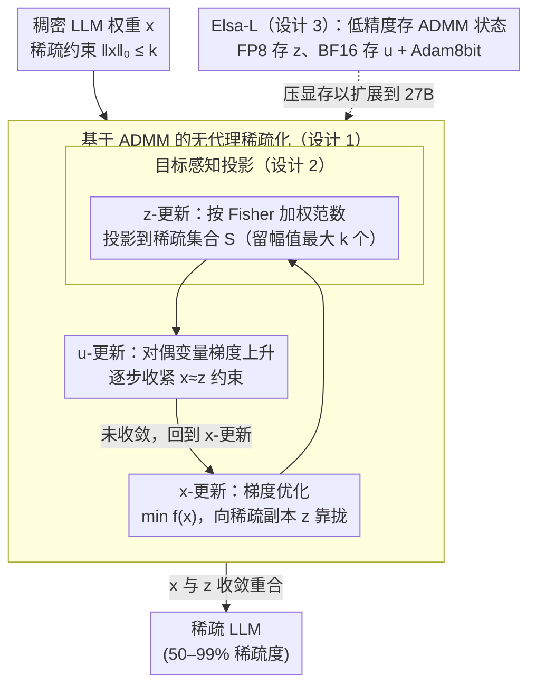

# The Unseen Frontier: Pushing the Limits of LLM Sparsity with Surrogate-Free ADMM

**会议**: ICLR 2026  
**arXiv**: [2510.01650](https://arxiv.org/abs/2510.01650)  
**代码**: [https://github.com/log-postech/elsa](https://github.com/log-postech/elsa)  
**领域**: 模型压缩  
**关键词**: LLM 剪枝, 极端稀疏性, ADMM, 无代理目标, 网络压缩

## 一句话总结

提出 Elsa 方法，通过无代理目标的 ADMM 约束优化直接求解稀疏性约束问题，突破 LLM 剪枝 50-60% 的"稀疏墙"瓶颈，在 90% 稀疏度下仍保持高模型保真度。

## 研究背景与动机

- **LLM 部署挑战**: 大语言模型体积庞大，内存、计算和能耗需求巨大，严重制约广泛部署
- **剪枝瓶颈**: 现有 LLM 剪枝方法（SparseGPT、Wanda、ALPS 等）在 50-60% 稀疏度之后性能急剧下降，形成所谓的"稀疏墙"（sparsity wall）
- **根本原因分析**: 现有方法依赖逐层重建误差最小化的代理目标（surrogate objective），存在三个关键缺陷：
  1. **近似误差累积**: 逐层求解无法达到零重建误差，小误差逐层传播导致整体性能坍塌
  2. **全局次优**: 逐层独立优化限制了搜索空间，且前面层固定后无法根据后续层调整
  3. **代理目标偏差**: 最小化重建误差 $\tilde{f}$ 不等于最小化真正的语言建模目标 $f$

## 方法详解

### 整体框架

Elsa 不再像 SparseGPT、Wanda 那样逐层最小化重建误差，而是把剪枝重新表述为一个全局约束优化问题：直接最小化真正的语言建模目标 $f(x)$，同时强制 $\|x\|_0 \leq k$ 的稀疏约束，即 $x^{\star} = \arg\min f(x) \ \text{s.t.}\ \|x\|_0 \leq k$。$\ell_0$ 约束不可微、又与训练目标耦合在一起难以直接求解，所以 Elsa 借助 ADMM（交替方向乘子法，Alternating Direction Method of Multipliers）做变量分裂：引入一个稀疏副本 $z$ 和对偶变量 $u$，把"权重训得好"和"权重足够稀疏"这两件事拆开，在三个子问题之间循环——$x$-更新用梯度优化最小化真实损失 $f$、$z$-更新把权重投影成稀疏（这一步换成目标感知的 Fisher 投影）、$u$-更新收紧约束，反复迭代直到 $x$ 和稀疏副本 $z$ 收敛重合，输出稀疏模型。面对 27B 这种超大模型，Elsa-L 把 ADMM 的额外状态用低精度存储，让整套流程塞进可承受的显存。

### 关键设计

**1. 基于 ADMM 的无代理稀疏化：让稀疏约束与训练目标各管各的**

现有方法的根子问题在于用逐层重建误差 $\tilde f$ 替代真正的目标 $f$，误差逐层累积撞上"稀疏墙"。Elsa 引入一个辅助变量 $z$ 充当"稀疏副本"，把原问题改写成增广拉格朗日形式

$$\mathcal{L}_{\lambda}(x,z,u) = f(x) + I_{\mathcal{S}}(z) + \frac{\lambda}{2}\|x - z + u\|_2^2 - \frac{\lambda}{2}\|u\|_2^2,$$

其中 $I_{\mathcal{S}}$ 是稀疏集合的指示函数、$u$ 是对偶变量。随后交替求解三个子问题：$x$-更新在"贴近稀疏副本 $z$"的牵引下用梯度优化最小化真实目标 $f$，$z$-更新把当前解投影回稀疏集合 $\mathcal{S}$（只保留幅值最大的 $k$ 个参数），$u$-更新对对偶变量做梯度上升以逐步收紧约束。这样模型权重可以一直按真实损失自由训练，稀疏性则由 $z$ 和 $u$ 逐步拉拢，避免了逐层固定后无法回头调整的全局次优。在 $f$ 满足下界、$\beta$-光滑且 $\mu$-弱凸的条件下，该迭代可证明收敛到原约束问题的 $\lambda$-驻点。

**2. 目标感知投影：让"扔掉哪些权重"对得起损失函数**

设计 1 里的 $z$-更新若按标准欧几里得距离裁剪，等于默认每个参数同等重要，但实际上不同权重对损失 $f$ 的影响天差地别。Elsa 改用 Hessian 诱导的范数来做这一步投影：

$$z^{t+1} = \arg\min_{z \in \mathcal{S}} \sum_{i \leq d} \hat{\mathbf{F}}_{ii} \big(z_i - (x_i^{t+1} + u_i^t)\big)^2,$$

其中 $\hat{\mathbf{F}}_{ii}$ 是经验 Fisher 信息矩阵的对角近似（用梯度外积做 Gauss-Newton 近似得到），相当于给每个参数加了一个"重要性权重"——对损失敏感的方向在投影时更不容易被裁掉。关键是这个二阶信息无需额外计算，可直接从 Adam 优化器已经在维护的二阶矩估计里免费读取，因此几乎不增加开销就把投影从纯几何操作变成与训练目标对齐的操作，消融实验证实它相比标准欧氏投影带来显著增益。

**3. 低精度状态扩展（Elsa-L）：把 27B 模型塞进可承受的显存**

朴素 Elsa 需要同时保存完整模型参数、辅助变量 $z$ 和对偶变量 $u$，对超大模型显存压力极大。Elsa-L 对这些额外状态做量化存储：用 FP8 存 $z$、BF16 存 $u$，并搭配 Adam8bit 优化器跑 $x$-更新（仅 FP8 存一个状态相比 FP32 就省 $4\times$ 显存）。即便引入量化误差，在额外的误差约束下该变体仍有严格的收敛性证明，因此扩展性的提升不以牺牲理论保证为代价，从而能扩展到 Gemma-2-27B 规模。

## 实验

### 主实验：困惑度 vs 稀疏度

| 模型 | 方法 | 60% PPL | 70% PPL | 80% PPL | 90% PPL |
|------|------|---------|---------|---------|---------|
| OPT-125M | SparseGPT | 49.83 | - | >1000 | - |
| OPT-125M | Elsa | 42.99 | - | 47.45 | - |
| LLaMA-2-7B (90%) | 最优基线 | - | - | - | ~210 |
| LLaMA-2-7B (90%) | Elsa | - | - | - | 26.97 (Wiki) / 23.14 (C4) |
| LLaMA-2-13B (90%) | 其他方法 | - | - | - | >100 |
| LLaMA-2-13B (90%) | Elsa | - | - | - | 27.84 |

### 极端稀疏度实验（LLaMA-2-7B）

| 稀疏度 | 方法 | Wiki PPL | C4 PPL |
|--------|------|----------|--------|
| 90% | Wanda + Full | 42.40 | 34.87 |
| 90% | Elsa | **26.97** | **23.14** |
| 95% | Wanda + Full | 84.30 | 53.62 |
| 95% | Elsa | **38.91** | **28.39** |
| 99% | Wanda + Full | 146.37 | 71.64 |
| 99% | Elsa | **55.94** | **40.10** |

### 实际部署效益（LLaMA-2-7B）

| 稀疏度 | 延迟加速 | 吞吐提升 | 内存压缩 |
|--------|----------|----------|----------|
| 70% | 1.94× | 1.93× | 2.42× |
| 90% | 2.50× | 2.56× | 4.60× |
| 95% | 4.00× | 3.98× | 7.80× |

### 消融实验发现

- 目标感知投影比标准欧几里得投影显著提升性能
- Elsa 方法在所有测试架构（OPT、LLaMA-2/3、Gemma-2）和规模（125M-27B）上一致有效
- 零样本下游任务中，Elsa 在 90% 稀疏度下 7 个任务中 6 个保持最优精度

## 亮点

- **突破稀疏墙**: 首次证明 LLM 可在 90% 甚至 99% 稀疏度下保持有意义的性能
- **理论扎实**: 基于经典 ADMM 优化理论，有严格收敛保证
- **问题诊断深刻**: 系统分析现有方法失败的三大根因（误差累积、局部次优、代理偏差），并提出统一解决策略
- **实用性强**: 90% 稀疏度带来 2.5× 延迟降低和 4.6× 内存压缩

## 局限性

- 需要 4 GPU 训练约 1.78 小时（LLaMA-2-7B, 90%），计算成本高于一次性剪枝方法
- 需要存储完整模型参数和优化器状态，内存需求高于逐层方法
- 目前仅验证了非结构化稀疏和 N:M 半结构化稀疏，未广泛探索其他稀疏模式
- 对 MoE 架构和多模态模型的适用性尚未验证

## 相关工作

- **逐层剪枝**: SparseGPT、Wanda、ALPS、L-ADMM、SAFE、SparseLLM
- **ADMM 剪枝**: L-ADMM 使用逐层 ADMM，但仍受限于代理目标
- **全局优化视角**: 本文首次在 LLM 上成功应用全局无代理 ADMM 稀疏化
- **量化方法**: 与量化正交，Elsa-L 本身也使用低精度技术提升扩展性

## 评分

| 维度 | 分数 |
|------|------|
| 创新性 | ★★★★★ |
| 理论深度 | ★★★★☆ |
| 实验充分性 | ★★★★★ |
| 实用价值 | ★★★★☆ |
| 写作质量 | ★★★★☆ |

<!-- RELATED:START -->

## 相关论文

- [\[ICLR 2026\] To Compress or Not? Pushing the Frontier of Lossless GenAI Model Weights Compression with Exponent Concentration](to_compress_or_not_pushing_the_frontier_of_lossless_genai_model_weights_compress.md)
- [\[ICLR 2026\] Alignment-Enhanced Integration of Connectivity and Spectral Sparsity in Dynamic Sparse Training of LLM](alignment-enhanced_integration_of_connectivity_and_spectral_sparsity_in_dynamic_.md)
- [\[ICLR 2026\] Is Finer Better? The Limits of Microscaling Formats in Large Language Models](is_finer_better_the_limits_of_microscaling_formats_in_large_language_models.md)
- [\[ICLR 2026\] Towards Reliable Benchmarking: A Contamination Free, Controllable Evaluation Framework for Multi-step LLM Function Calling](towards_reliable_benchmarking_a_contamination_free_controllable_evaluation_frame.md)
- [\[ICLR 2026\] Learnable Sparsity for Vision Generative Models](learnable_sparsity_for_vision_generative_models.md)

<!-- RELATED:END -->
