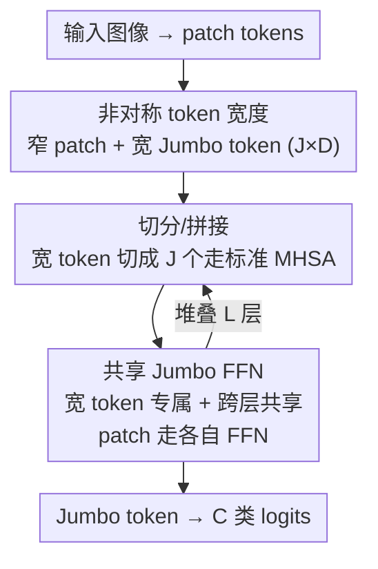

# Thicker and Quicker: A Jumbo Token for Fast Plain Vision Transformers

**会议**: ICLR 2026  
**OpenReview**: [https://openreview.net/forum?id=nxcevynv08](https://openreview.net/forum?id=nxcevynv08)  
**代码**: https://github.com/antofuller/jumbo  
**领域**: 模型压缩 / 高效 ViT / 视觉骨干网络  
**关键词**: 高效 ViT、Jumbo token、token 宽度非对称、参数共享 FFN、plain ViT 兼容

## 一句话总结
为了让小尺寸 plain ViT 既快又准，本文用一个比 patch token 宽 $J$ 倍的 "Jumbo token" 替换原来的 CLS token，并给它配一个跨层共享、只处理单个 token 的专属宽 FFN，在几乎不增加计算/显存的前提下把全局表示容量补上去——在 ImageNet-1K Nano 尺度比 ViT+Registers 提升 13%，同时保持纯 ViT 的全部生态兼容性（MAE、SAR、分割头、多模态、时间序列）。

## 研究背景与动机
**领域现状**：plain ViT（纯注意力、非层级/各向同性结构）是当下视觉的主力骨干，DINOv2、CLIP、SAM、DiT 等基础模型都建立在它之上。它的优势不只是精度，更在于一套"接口"——非层级 + 纯注意力让它能直接 drop token 做稀疏计算、能换 tokenizer 处理时间序列/点云/多模态、能即插即用各种为 ViT 设计的分割头、测试时自适应方法、Flash Attention 等。

**现有痛点**：在最小、最快的尺度上，plain ViT 打不过专门设计的高效架构（EfficientViT、SHViT、MobileNetV4）。要让 ViT 变快，业界只有两条老路：一是设计混合架构（塞卷积、做层级、用 BatchNorm），但这就丢掉了上面那套接口，MAE、SAR、ViT 分割头都用不了；二是直接缩窄 token 宽度（Base 768 → Small 384 → Tiny 192 → Nano 128），但精度会跟着掉。

**核心矛盾**：现有做法把宽度 $D$ 在**所有 token、所有层**上等量缩放——想快就只能整体变窄。可是一个 $224\times224$、patch $16\times16$ 的图只有 196 个局部 token，外加 1 个 CLS token，全局表示只占了 $1/197$ 的容量，这个分配本身就失衡。缩窄宽度时，全局容量被一并砍掉，是精度下滑的主因。

**本文目标**：在保住 plain ViT 接口（纯注意力 + 非层级）的前提下，给小尺寸 ViT 把全局表示容量补回来，让它在高速区间也具备竞争力。

**切入角度**：宽度不必在 token 之间对称。Registers（Darcet et al. 2024）已经证明"多给全局容量"有用——它在 CLS 之外再 prepend 若干 register token。本文沿着这个思路再进一步：register 仍然和 patch 等宽，而本文把全局 token 直接**加宽**，让它独享更大的处理容量。

**核心 idea**：缩窄 patch token 宽度换速度，同时引入一个宽 $J$ 倍的 Jumbo token + 专属宽 FFN 把全局容量补回来——"token 宽度非对称"地分配计算，让单个宽 token 以可忽略的代价撑起全局表示。

## 方法详解

### 整体框架
Jumbo 在结构上几乎就是一个 plain ViT：图像照常切 patch、线性投影成 patch embedding $x_P \in \mathbb{R}^{N\times D}$、加位置编码。唯一的改动是把原本的 CLS token 换成一个**宽 $J$ 倍**的 Jumbo token $x_{\text{Jumbo}} \in \mathbb{R}^{J\cdot D}$。整个网络用结构完全相同的 $L$ 层 transformer 处理这两路输入，全程不引入任何卷积或层级下采样，因此输出特征图与标准 ViT 一致，下游头/方法可以原样接上。

每一层内部的流转是这样的：进自注意力前，把宽 Jumbo token 沿特征维**切成 $J$ 个**与 patch 等宽（$D$）的 token，和 patch 拼成长度 $N+J$ 的序列，走一遍标准多头自注意力；注意力后再把这 $J$ 个 token 从序列里取出、沿通道维**拼回**成 $J\cdot D$ 的宽 token。然后两路分流走各自的 FFN：宽 Jumbo token 走一个**专属的、跨层共享的** Jumbo FFN，patch 走它们自己的（逐层独立的）patch FFN。$L$ 层处理完后，把最终的 Jumbo token 投影到 $C$ 个类别 logits。

### 关键设计

**1. 非对称 token 宽度：缩窄 patch、加宽全局 token**

直接缩窄整个 ViT 会连全局容量一起砍掉，这是小模型掉点的根因。本文的做法是把宽度的分配**解耦**：patch token 保持窄（继承缩窄带来的速度），单独引入一个宽 $J$ 倍的 Jumbo token $x_{\text{Jumbo}} \in \mathbb{R}^{J\cdot D}$ 来承载全局表示。之所以"加宽一个 token"几乎免费，是因为每层的计算量（FLOPs）主要由**序列长度 $N$** 和 **patch 宽度 $D$** 决定，而 Jumbo 只是序列里多出来、且仅在 FFN 处变宽的**单个** token，其 FLOPs 贡献相对可忽略（论文 Fig. 3）。这也带出两个可验证假设：patch 越窄，Jumbo 补容量的增益越大（实验证实 Nano +13% > Tiny +4% > Small +0.8%）；任务输出维度越高，增益越大（ImageNet-1K → 21K，Small 增益从 0.8% 涨到 3.1%）。

**2. 切分/拼接：让宽 token 兼容标准多头自注意力**

宽 token 没法直接进等宽的注意力层，强行让它单独走一个宽注意力又会破坏 plain ViT 的简洁接口。本文用一组零成本的 reshape 巧妙绕开：注意力前把 $x_{\text{Jumbo}}$ 沿特征维切成 $J$ 段 $\mathbb{R}^{1\times J\cdot D} \to \mathbb{R}^{J\times D}$，与 patch 拼接 $x = x_{\text{Jumbo}}\,\|_0\,x_P \in \mathbb{R}^{(N+J)\times D}$，这样它就等价于"$J$ 个额外的全局 token / 注意力头"，和 patch 一起走**同一个标准 MHSA**；注意力后再沿序列维切出这 $J$ 个 token、沿通道维拼回 $\mathbb{R}^{1\times J\cdot D}$。两次切分、两次拼接只是张量重排，运行时开销可忽略，却让宽 token 既能在注意力里以多头形式与全局信息充分交互，又完整保住了"纯注意力、非层级"的接口——这正是与 Registers 的关键区别：Registers 的全局 token 始终和 patch 等宽、共享同一个 FFN，而 Jumbo 让全局 token 真正变宽并独立处理。

**3. 专属 Jumbo FFN + 跨层共享：补容量又控显存**

光在注意力里加宽还不够，要真正提升容量得让宽 token 经过更强的非线性处理，于是本文给 Jumbo token 配一个**不与 patch 共享参数**的专属 FFN（拼回成 $J\cdot D$ 宽之后再过）。但一个 $J\cdot D$ 宽的 FFN 参数量不小，如果逐层独立会撑爆显存。解法是**跨所有层共享**这一个 Jumbo FFN 的参数：因为它每层只处理 1 个 token，时间成本本就极低；共享后参数只算一份，显存代价极小，还顺带起到正则作用。消融显示共享几乎不掉精度（ImageNet-21K Small：不共享 44.95% vs 共享 44.61%），而那点差距还能用逐层 LoRA（rank=8，44.94%）以可忽略的代价补回来。值得注意的是，即使去掉 Jumbo FFN（只靠加宽 + 拼接全局 token 进分类器），也已比 Registers 高 2.2%——说明"非对称加宽 + 把全部全局 token 喂给分类器"本身就有效，而专属宽 FFN 是锦上添花的容量来源（$J:6\to10$ 时 Small 达 45.6%，反超不少配置）。

### 损失函数 / 训练策略
分类用标准交叉熵 + 蒸馏加速收敛；ImageNet-1K 从头训 400 epoch（$128\times128$）+ 20 epoch（$224\times224$）。Jumbo 对 $J$ 不敏感，Base 用 $J=3$、其余用 $J=6$；对照的 Registers 用 $R=16$。在 ImageNet-21K 上为省算力采用 token dropping 训练（drop 率从 90% 线性降到 10%），这恰好也展示了 plain ViT 接口的好处——只需极少代码改动即可 mask。

## 实验关键数据

### 主实验
覆盖 5 类任务，验证"既快又准 + 生态兼容"：

| 任务 / 数据集 | 指标 | ViT+Jumbo | ViT+Registers | 提升 |
|--------------|------|-----------|---------------|------|
| ImageNet-1K（Nano） | Top-1 Acc | — | — | ↑13% |
| ImageNet-1K（Tiny） | Top-1 Acc | — | — | ↑4% |
| ImageNet-21K（Small / Base） | Top-1 Acc | — | — | ↑3.1% / ↑1.2% |
| ADE20K 分割（Base/Small/Tiny） | mIoU | 44.4 / 39.1 / 35.5 | 42.5 / 37.0 / 32.4 | ↑1.9~3.1 |
| MAE 线性探测（Base） | Top-1 Acc | 73.0 | 68.1 | ↑4.9 |
| ImageNet-C（TTA, SAR） | 平均 Acc | 60.1 | 54.9 | ↑5.2 |

亮点：ViT-Base+Jumbo 的 MAE 线性探测（73.0%）**追平 ViT-Large** baseline，但参数少 2.3×、FLOPs 少 3.5×、吞吐高 3.1×。在与专用高效架构（EfficientViT/SHViT/MobileNetV4）的对比中，Jumbo 在 ImageNet-1K/v2/ReaL/HR/R 上达到 Pareto 前沿，且同精度下比 Registers 快 1.9×（ImageNet-21K）。时间序列上 PatchTST+Jumbo 在 20 个 UCR/UEA 基准上排名第一，证明它能推广到 ViT 之外的非因果 transformer。

### 消融实验（ImageNet-21K, ViT-Small）

| 配置 | Top-1 Acc | 显存(GB) | 说明 |
|------|-----------|---------|------|
| Jumbo（共享 FFN, $J=6$） | 44.61 | 2.6 | 默认配置 |
| w/o 层共享 | 44.95 | 4.1 | 略升精度但显存 ↑1.6× |
| w/o Jumbo FFN | 43.64 | 2.2 | 仍比 Registers 高 2.2% |
| + 逐层 LoRA(rank=8) | 44.94 | 2.5 | 共享+LoRA 几乎追平不共享 |
| $J: 6\to10$ | 45.62 | 3.4 | 加宽换更高精度，代价低 |

### 关键发现
- **patch 越窄、增益越大**：印证"全局容量是小模型瓶颈"的假设，Nano 提升远大于 Small。
- **跨层共享几乎免费**：不共享只多 0.34% 精度却把显存推高 1.6×；用逐层 LoRA 可在共享前提下补回这点差距。
- **Jumbo FFN 是有效但非唯一的容量来源**：去掉它仍胜 Registers 2.2%，说明"非对称加宽 + 拼接全部全局 token 进分类器"本身就贡献了主要增益。
- **生态兼容性是真优势**：SAR 等 TTA 方法为 LayerNorm 设计，专用架构用 BatchNorm 无法即插即用，而 Jumbo 直接受益（TTA 后 +5.2%）。

## 亮点与洞察
- **"宽一个 token 几乎免费"是全文支点**：抓住了"每层 FLOPs 由序列长度和 patch 宽度主导、单 token 变宽贡献可忽略"这一观察，把容量加在最便宜的地方。这个 FLOPs 拆解的视角可迁移到任何想"局部省、全局补"的序列模型。
- **切分/拼接让宽 token 复用标准 MHSA**：不另造宽注意力，只靠零成本 reshape 就把"宽全局 token"塞进等宽注意力，是保住 plain ViT 接口的关键工程巧思。
- **跨层共享 FFN 既省显存又当正则**：单 token 处理使共享几乎不付时间代价，是"参数共享"用对场景的典范；配 LoRA 微调更是兼顾效率与精度。
- **以"兼容性"为卖点而非纯刷点**：作者反复强调 Jumbo 能即插即用 MAE/SAR/分割头/多模态/时间序列，这是它相对专用高效架构最持久的价值。

## 局限与展望
- **语言/多模态实验仍是概念验证**：image-caption 检索（top-10 34% vs 30%）、MLM（困惑度 4.8 vs 4.9）只是 proof-of-concept，没追求 SOTA，NLP 上的真实收益尚不明确。
- **$J$ 与 patch 宽度的最优配比靠扫**：虽然称对 $J$ 鲁棒，但 Base 用 $J=3$、其余 $J=6$、最优有时到 $J=10$，缺乏自动选择机制。
- **共享 FFN 在小尺度反而略掉精度**：需要 LoRA 才能补回，说明"共享"并非无损，在更大规模或更长训练下的表现需进一步验证。
- **增益依赖"小模型 + 高输出维度"场景**：在已经很宽的大模型上，非对称加宽的相对收益会缩小（Base 提升仅 1.2%）。

## 相关工作与启发
- **vs ViT+Registers**：Registers 在 CLS 外加若干**等宽** register token、与 patch 共享同一 FFN；Jumbo 把全局 token 直接**加宽 $J$ 倍**并配专属共享 FFN，让全局表示有更强的独立处理。两者都保住 plain ViT 接口，但 Jumbo 在高速区间精度更高、同精度下更快（1.9×）。
- **vs EfficientViT / SHViT / MobileNetV4**：它们靠卷积、层级、BatchNorm 提速，虽快但丢掉 plain ViT 接口，无法即插即用 MAE/SAR/ViT 头/多模态；Jumbo 在达到甚至超过它们速度-精度前沿的同时保住全部兼容性。
- **vs BiXT（Perceiver 系）**：同样是纯注意力、非层级的高效扩展，是 Jumbo 的天然对照；Jumbo 在 ImageNet 上取得更优前沿。
- **启发**：把"容量"与"速度"在 token 粒度上解耦——便宜的地方（少量宽 token）加容量、贵的地方（大量 patch）保持窄，这种"非对称缩放"思路可推广到点云、视频、长序列时间序列等任何 token 数多但需要强全局表示的场景。

## 评分
- 新颖性: ⭐⭐⭐⭐ 把"宽度非对称分配 + 单宽 token + 共享宽 FFN"组合成一个极简且保接口的方案，视角新颖
- 实验充分度: ⭐⭐⭐⭐⭐ 覆盖分类/分割/MAE/TTA/时间序列/语言 6 类任务、多尺度、完整消融与分析
- 写作质量: ⭐⭐⭐⭐⭐ 动机推导清晰，假设-验证闭环漂亮，图表支撑到位
- 价值: ⭐⭐⭐⭐⭐ 给小尺寸 plain ViT 一条"既快又准且不丢生态"的实用路线，落地价值高

<!-- RELATED:START -->

## 相关论文

- [\[ICLR 2026\] Faster Vision Transformers with Adaptive Patches](faster_vision_transformers_with_adaptive_patches.md)
- [\[ICLR 2026\] WSVD: Weighted Low-Rank Approximation for Fast and Efficient Execution of Low-Precision Vision-Language Models](wsvd_weighted_low-rank_approximation_for_fast_and_efficient_execution_of_low-pre.md)
- [\[AAAI 2026\] Distillation Dynamics: Towards Understanding Feature-Based Distillation in Vision Transformers](../../AAAI2026/model_compression/distillation_dynamics_towards_understanding_feature-based_di.md)
- [\[CVPR 2026\] BinaryAttention: One-Bit QK-Attention for Vision and Diffusion Transformers](../../CVPR2026/model_compression/binaryattention_one-bit_qk-attention_for_vision_and_diffusion_transformers.md)
- [\[AAAI 2026\] Stratified Knowledge-Density Super-Network for Scalable Vision Transformers](../../AAAI2026/model_compression/stratified_knowledge-density_super-network_for_scalable_vision_transformers.md)

<!-- RELATED:END -->
