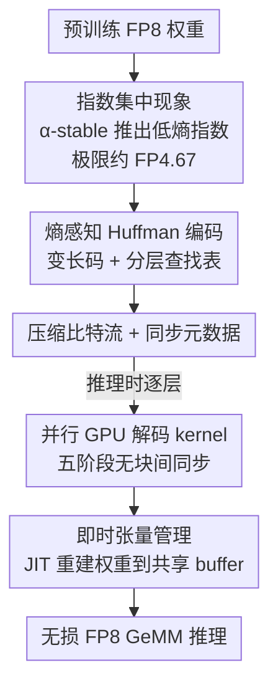

# To Compress or Not? Pushing the Frontier of Lossless GenAI Model Weights Compression with Exponent Concentration

**会议**: ICLR 2026  
**OpenReview**: [https://openreview.net/forum?id=XI1CeufywD](https://openreview.net/forum?id=XI1CeufywD)  
**代码**: https://github.com/zeyuyang8/ecf8  
**领域**: 模型压缩  
**关键词**: 无损压缩, FP8, 指数集中, Huffman 编码, 推理加速

## 一句话总结
本文发现训练后 GenAI 权重的浮点指数普遍呈现「指数集中」（低熵）现象，从 α-稳定分布理论上证明指数熵有界、对应约 FP4.67 的压缩极限，并据此设计了无损 FP8 压缩框架 ECF8（熵感知 Huffman 编码 + GPU 并行解码 + 即时张量管理），在最多 671B 参数的 LLM 与 DiT 上实现最高 26.9% 显存节省、177.1% 吞吐提升，且输出逐比特无任何偏差。

## 研究背景与动机
**领域现状**：模型规模膨胀到几千亿参数后，低精度计算成了部署刚需。主流路线是整数量化（INT8/INT4 等），通过把权重压成定点数来省显存、降算力。

**现有痛点**：整数量化有两个根本毛病。其一是**有损**——压缩会引入精度或生成质量退化，对生成式模型尤其敏感。其二是**反而拖慢大 batch 推理**：整数张量在做矩阵乘之前必须反量化回浮点，这道 dequantization 工序加上混合精度执行，会吃掉本该省下的吞吐。

**核心矛盾**：人们想要「又省显存又不掉点又不掉速」，但量化把这三者绑死成了权衡。此前 DFloat11 观察到 BF16 权重的指数熵远低于其分配的位宽，提示存在无损压缩的空间，但社区一直困惑：这个现象有没有**根本性原理**？能不能推广到 BF16 以外的格式？指数熵的理论下界到底在哪？最关键的——显存压缩能不能真正转化成**推理加速**（而不只是省存储）？

**本文目标**：(1) 给出指数集中现象的理论解释与熵下界；(2) 据此推导无损浮点格式的压缩极限；(3) 把这条理论落地成一个既无损、又能端到端加速的实用 FP8 框架。

**切入角度**：作者从一个跨架构、跨模态都成立的经验观察出发——权重指数总是挤在很窄的几个取值上，Shannon 熵稳定在 2–3 bit，而标准浮点给指数分了 4 bit 甚至更多。这个「熵 gap」就是无损压缩的免费午餐。

**核心 idea**：把 SGD 训练出的权重建模成 α-稳定分布，证明其浮点指数服从双边几何分布、熵有界（极限约 FP4.67），再用熵感知的 Huffman 编码 + 定制 GPU 解码 kernel，把这部分冗余位真正抠掉并换成吞吐。

## 方法详解

### 整体框架
ECF8 要解决的是「FP8 权重里指数那 4 bit 大量浪费」的问题。整条链路分两段：**离线编码**把每个权重的指数用变长 Huffman 码压成紧凑比特流并生成同步元数据；**在线推理**时逐层用 GPU kernel 即时解码、把权重恢复成原始 FP8 再做无损 GeMM。之所以能无损，是因为只压指数这一离散符号、尾数与符号位原样保留，解码结果与原 FP8 逐比特相同。

整个设计建立在一个理论地基上：作者先证明训练权重的指数天然低熵（指数集中），这既解释了「为什么能压」，也给出「能压到多少」（约 FP4.67），从而论证了 FP8 是贴近理论极限又对硬件友好的工程落点。

### 关键设计

**1. 指数集中现象：从 α-稳定分布证明指数熵有界**

这一节回答「为什么能无损压」这个最根本的疑问，而不是停在经验观察。作者指出，权重是 SGD 在大量带重尾噪声的更新中累加而成的：mini-batch 采样让梯度噪声呈幂律尾 $P(|\Delta_t|>x)\sim x^{-\alpha}$（$\alpha<2$），由广义中心极限定理，这类重尾变量之和收敛到 α-稳定分布，所以训练后的权重近似服从对称 α-稳定律 $X\sim S_\alpha(\beta=0,\gamma,\delta)$。

在此基础上，定义浮点指数 $E=\lfloor\log_2|X|\rfloor$，论文证明 $E$ 服从参数 $q=2^{-\alpha}$ 的双边几何分布 $P(E=k)=\frac{1-q}{1+q}q^{|k|}$，并给出熵的紧界：

$$\frac{\alpha}{1+2^{-\alpha}}\le H(E)\le\frac{\alpha}{1-2^{-\alpha}}$$

含义是指数并不在整数轴上均匀铺开，而是以 $2^{-\alpha}$ 的速率几何衰减地集中在 0 附近，因此**无论 $\alpha$ 取何值熵都有限**，$\alpha$ 越小集中越紧、熵越低。这把「指数熵只有 2–3 bit」从巧合变成了统计规律，也直接说明指数携带的不确定性极少、天然可压。

**2. 压缩极限 FP4.67：理论下界论证 FP8 是最佳工程落点**

有了熵界，作者把它翻译成具体的压缩极限。无损编码指数的最小期望位数就是 $L_{\min}=H(E)$。代入 Gaussian 类情形 $\alpha=2$（$2^{-\alpha}=1/4$），得指数熵界 $1.6\le H(E)\le 2.67$，即极端情况下指数本身约需 2.67 bit。再补上 1 个符号位与维持精度所需的极小尾数（约 1 bit），绝对地板约为 $2.67+1+1\approx4.67$ bit。

但「FP4.67」乃至 FP5 在现代 GPU 上因对齐与硬件约束几乎无法高效实现，所以作者选 FP8 作为落地格式——它既贴近熵驱动的理论极限，又保留了足够尾数精度与硬件兼容性。这个设计点的价值在于：它不是拍脑袋选 FP8，而是用理论下界论证了「再往下压收益有限、硬件代价剧增」，把格式选择变成有依据的工程决策。

**3. 熵感知 Huffman 编码 + 分层查找表：把变长码做成 GPU 友好的解码结构**

FP8 给指数分了 4 bit（取值 $\{0,\dots,15\}$），但实测熵远低于此。ECF8 统计指数经验频率 $p(x)$、构造最小化期望码长 $E[\ell]=\sum_x p(x)\ell(x)$ 的最优 Huffman 树，给高频指数分短码。为保证 GPU 兼容，限制最大码长 16 bit（对罕见符号做频率微调，实测 transformer 层几乎不触发该约束）。

变长码的难点在解码：直接逐 bit 走树在 GPU 上极慢。作者构造**级联的分层查找表**——按字节对齐前缀组织，每个 8-bit 子表有 256 项，每项要么直接给出解码后的指数（若该前缀拼上这个字节构成完整码），要么给出指向更长前缀子表的指针 $256-\text{index}(p_{i'})$。这样把变长解码拆成若干次 8-bit 查表，内存占用 $O(|P|\cdot 256)$、查表时间 $O(\lceil\ell_{\max}/8\rceil)$，与 GPU 内存架构对齐。编码时还顺带算出每个线程的 gap 偏移 $g_t=\big(\sum_{i<t}\sum_{x_j}\ell(x_j)\big)\bmod 8B$ 与各 block 的输出位置，作为后续并行解码的同步元数据。

**4. 并行 GPU 解码 kernel + 即时张量管理：把压缩真正换成吞吐**

无损压缩若解码慢就毫无意义，这个设计点是「压缩→加速」转化的关键。解码 CUDA kernel 分五阶段：(i) 内存初始化，每线程开寄存器缓冲；(ii) 数据加载，把分到的比特段从 global memory 搬进寄存器；(iii) 并行计数，各线程按 gap 先算自己能解出多少符号，再做 block 内并行归约得到累积计数与互不重叠的输出位置；(iv) 协同解码，各线程按算好的位置把符号写进 shared memory；(v) 回写 global memory（合并写）。靠预先算好的 gap 与输出位置，**线程块之间无需同步**即可自治并行解码。

配套的即时（JIT）张量管理用 PyTorch forward hook 拦截每层执行，在计算前才解压该层权重，并复用一块大小等于「最大层权重」的预分配 buffer——层 $\ell_i$ 算完，buffer 立即让给 $\ell_{i+1}$，使得无论模型多深，GPU 解压开销恒定。最终省下的显存能撑起更大 batch，把存储效率兑现成实打实的吞吐与延迟收益。

## 实验关键数据

测试 9 个模型，覆盖自回归 LLM、扩散 Transformer（DiT）、MoE 变体，规模 8B–671B。

### 主实验：无损显存节省 + 固定显存下的吞吐

| 模型 | 显存↓(%) | 吞吐↑(%) | 备注 |
|------|---------|---------|------|
| DeepSeek-R1-0528 (671B) | 14.8 | 150.3 | 623→530 GB，可在 8×H100 跑 |
| Qwen3-235B-A22B-Instruct-FP8 | 14.4 | 35.9 | 217→186 GB |
| Llama-3.3-70B-Instruct-FP8 | 13.4 | 11.3 | — |
| Qwen3-Coder-30B-A3B-FP8 | 14.3 | 23.7 | 可塞进单卡 RTX5090 |
| Qwen3-8B-FP8 | 9.8 | 12.6 | 单卡 RTX4070 |
| FLUX.1-dev | 14.1 | **177.1** | DiT，最高吞吐增益 |
| Wan2.1-T2V-14B | 25.4 | 55.1 | — |
| Wan2.2-T2V-A14B | **26.9** | 108.3 | 最高显存节省 |
| Qwen-Image | 21.0 | 126.6 | — |

关键现象：LLM 压缩率稳定在 9.8%–14.8%，DiT 更高（最高 26.9%）；压缩效果在 8B→671B 跨度上几乎不变，说明 ECF8 依赖的是权重分布本身的统计性质而非模型规模。生成质量上，ECF8-Qwen-Image 与原 FP8 同种子同参数下输出**逐像素相同**，数值差严格为零。

### 固定显存下的 LLM 推理对比（FP8 vs ECF8）

| 模型 / 约束 | Max Batch (FP8→ECF8) | 延迟↓(%) | 吞吐↑(%) |
|------|------|------|------|
| DeepSeek-R1-0528 / 640 GB | 2 → 16 | 60.1 | 150.3 |
| Qwen3-235B / 240 GB | 32 → 64 | 26.4 | 35.9 |
| Llama-3.3-70B / 80 GB | 32 → 48 | 10.2 | 11.3 |
| Qwen3-Coder-30B / 32 GB | 16 → 32 | 19.2 | 23.7 |
| Qwen3-8B / 12 GB | 16 → 24 | 11.2 | 12.6 |

DiT 侧（DiffSynth + VRAM 管理，单 GH200）：FLUX.1-dev 端到端延迟从 24.29s 降到 13.15s（↓45.9%），Qwen-Image 单步延迟 ↓55.9%；视频模型 Wan2.x 因计算受限而延迟改善较小（3.3–4.0%），但仍有 7.6–17.8% 显存节省。

### 关键发现
- **压缩→加速的机理**：固定显存下显存节省直接换成更大 batch，从而提吞吐、降单请求延迟（DeepSeek 在 640 GB 下 batch 从 2 提到 16）。
- **架构差异**：DiT 指数熵更低（部分 block 低至 ~1 bit），故压缩率高于 LLM；DiT 多为计算受限，单 batch 延迟收益主要来自 VRAM 管理时更小的权重搬运开销。
- **无损是硬约束**：所有模型输出零偏差，这是相对有损量化的根本区别，对生产部署至关重要。

## 亮点与洞察
- **把「现象」升级成「定律」**：从 α-稳定分布严格证明指数熵有界，给出 FP4.67 这个可量化的无损压缩极限——这让 DFloat11 式的经验观察第一次有了理论解释，也为未来数值格式设计立了标尺。
- **理论直接指导格式选择**：不是经验上选 FP8，而是用熵下界论证「FP8 贴近极限且硬件友好」，方法论上很干净。
- **真正端到端加速**：很多无损压缩只省存储、解码慢得无法用于推理；ECF8 用分层查找表 + 无块间同步的 GPU kernel，把压缩兑现成最高 177% 的吞吐，这是它「first lossless method delivering end-to-end acceleration」的底气。
- **可迁移 trick**：级联 8-bit 查找表把变长解码做成 GPU 友好的定长查表，这套思路可复用到其他需要 GPU 上做熵解码的场景（如 KV cache 压缩、激活压缩）。

## 局限与展望
- 收益强依赖「指数低熵」这一统计前提；若权重分布被刻意正则化得指数更均匀，或非 Transformer 架构不满足 α-稳定假设，压缩空间会缩水。
- 只压指数、保留全尾数，所以压缩率有天花板（LLM 约 10–15%），与有损量化的 2–4× 不在一个量级——它换来的是严格无损。
- DiT 在计算受限场景下单 batch 延迟收益有限，主要靠 VRAM 管理时的搬运节省，收益对部署方式敏感。
- 依赖定制 CUDA kernel 与 forward hook，工程落地与框架集成（vLLM/LoRA 兼容性见附录）需要额外适配。

## 相关工作与启发
- **vs 整数量化（GPTQ / AWQ / SmoothQuant 等）**：它们有损且需反量化，大 batch 下反而掉速；ECF8 无损、解码即得原 FP8、压缩还能换吞吐——但压缩率远低于整数量化。
- **vs DFloat11**：DFloat11 在 BF16 上观察到指数低熵并做熵编码，但停在经验层面、且未实现端到端加速；本文给出 α-稳定分布的理论解释与熵下界，推广到 FP8，并补上 GPU 解码 kernel 实现真正加速。
- **vs Heilper & Singer (2025)**：同样报告神经网络指数低熵，本文则把它纳入统一的统计定律框架并工程化。

## 评分
- 新颖性: ⭐⭐⭐⭐⭐ 把指数集中从经验现象证成有界熵定律，并给出可量化的 FP4.67 极限
- 实验充分度: ⭐⭐⭐⭐⭐ 9 个模型、8B–671B、LLM/DiT/MoE 全覆盖，含吞吐与逐比特无损验证
- 写作质量: ⭐⭐⭐⭐ 理论与系统两段都讲清，公式与 kernel 流程完整
- 价值: ⭐⭐⭐⭐⭐ 首个端到端加速的无损权重压缩，生产部署即插即用

<!-- RELATED:START -->

## 相关论文

- [\[ICLR 2026\] The Unseen Frontier: Pushing the Limits of LLM Sparsity with Surrogate-Free ADMM](the_unseen_frontier_pushing_the_limits_of_llm_sparsity_with_surrogate-free_admm.md)
- [\[ICLR 2026\] QVLA: Not All Channels Are Equal in Vision-Language-Action Model's Quantization](qvla_not_all_channels_are_equal_in_vision-language-action_models_quantization.md)
- [\[ICLR 2026\] Towards Lossless Memory-efficient Training of Spiking Neural Networks via Gradient Checkpointing and Spike Compression](towards_lossless_memory-efficient_training_of_spiking_neural_networks_via_gradie.md)
- [\[ICLR 2026\] OrderDP: A Theoretically Guaranteed Lossless Dynamic Data Pruning Framework](orderdp_a_theoretically_guaranteed_lossless_dynamic_data_pruning_framework.md)
- [\[ICML 2026\] ZipMoE: Efficient On-Device MoE Serving via Lossless Compression and Cache-Affinity Scheduling](../../ICML2026/model_compression/zipmoe_efficient_on-device_moe_serving_via_lossless_compression_and_cache-affini.md)

<!-- RELATED:END -->
