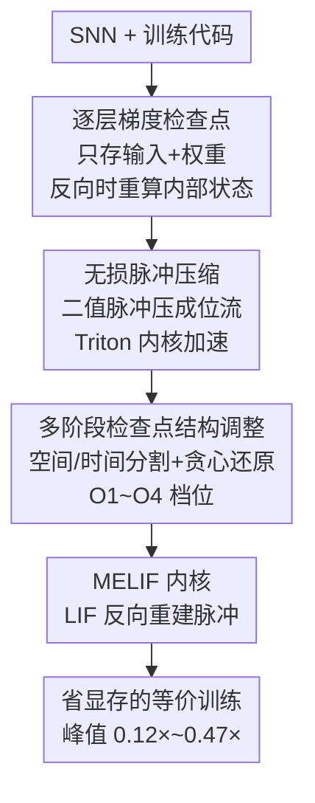

# Towards Lossless Memory-efficient Training of Spiking Neural Networks via Gradient Checkpointing and Spike Compression

**会议**: ICLR 2026  
**OpenReview**: [https://openreview.net/forum?id=nrBJ0Uvj7c](https://openreview.net/forum?id=nrBJ0Uvj7c)  
**代码**: https://github.com/AllenYolk/snn-gradient-checkpointing  
**领域**: 模型压缩 / 脉冲神经网络 / 高效训练  
**关键词**: SNN、BPTT、梯度检查点、无损脉冲压缩、显存优化

## 一句话总结
针对脉冲神经网络（SNN）用 BPTT 直接训练时 $O(LT)$ 显存爆炸的痛点，本文把「逐层梯度检查点 + 无损二值脉冲压缩 + 多阶段检查点结构调整」打包成一个自动优化 pass，在不改精度、慢不超过 20% 的前提下把峰值显存压到原来的 0.12×～0.47×。

## 研究背景与动机

**领域现状**：SNN 用离散时间步把自己当成二值激活的 RNN，再用「时间反向传播（BPTT）+ 替代梯度（surrogate gradient）」端到端训练，是目前精度最高、适用面最广的直接训练范式，spiking ResNet、spiking Transformer 都靠它拿到有竞争力的结果。

**现有痛点**：BPTT 要为 $L$ 层、展开 $T$ 个时间步的网络存下所有中间结果，显存复杂度是 $O(LT)$，而结构类似的 ANN 只需 $O(L)$。这让 SNN 比 ANN 更容易爆显存，深度和时间步一加大就训不动。现有省显存的三条路线又各有硬伤：在线学习（online learning）截断时间梯度、按时间步单步执行，会引入梯度失配导致时序任务掉点，还和时间并行（如 PSN）不兼容；BPTT-to-BP 用发放率代理绕开时间维，根本处理不了序列数据；可逆网络（reversible network）反向时重建中间特征，精度能保住但训练显著变慢、且对架构有苛刻约束。更要命的是，这些方法大多要手改网络结构或重写训练代码，又繁琐又容易出错。

**核心矛盾**：要省显存就得在「精度、速度、通用性、易用性」里做牺牲——现有方法没有一个能四角全占。

**切入角度**：作者先做了一次内存成本拆解，发现 SNN 训练的显存几乎全压在「中间特征」上——对 $T=4$ 的 SNN，中间特征（每层输入脉冲 + 神经元内部状态）占峰值显存 96% 以上，而权重、梯度、优化器状态基本不随 $T$ 变。换句话说，省显存只需要盯住「内部状态」和「输入脉冲」这两块。

**核心 idea**：用经典的梯度检查点（gradient checkpointing, GC）丢掉内部状态、反向时局部重算；再把必须保留的二值输入脉冲无损压成位流；最后用一个自动 pass 根据 profiling 结果调整检查点结构，把这套机制零侵入地套到任意逐层 SNN 上。

## 方法详解

### 整体框架

整个方法是一个在训练前自动重构计算图的「优化 pass」：用户调一次 `memory_optimization(net, ...)`，传入想优化的层类型和一个 `level` 档位，pass 就会把网络改造成省显存版本，训练代码几乎不用动。内部分三步走：先用**逐层梯度检查点**消掉内部状态的存储，再用**无损脉冲压缩**把每层必须保留的输入脉冲从 32-bit 浮点压成 1-bit 位流，然后由**多阶段检查点结构调整**根据实测的逐层显存/耗时，自适应地在高成本层里插检查点、把没收益的检查点段还原成普通 BPTT 段，最后配上手写的 **MELIF 内核**进一步省下 LIF 神经元的中间量。这四块串起来，既把全局峰值显存压下去，又把 GC 带来的重算开销控制在可接受范围。

### 关键设计

**1. 逐层梯度检查点：把内部状态从「全程保存」改成「反向时现算」**

标准 BPTT 要为每一层都存下神经元的内部状态 $\Omega_l$（膜电位等），累加起来是 $\sum_l M_{\Omega_l}$，这正是 SNN 显存的大头。本文对每层 $l$ 套用梯度检查点：前向时只保留该层的输入 $S_{l-1}$ 和权重 $W_l$，丢掉内部状态；反向到这一层时，用 $S_{l-1}$、$W_l$ 重跑一次局部前向，把 $\Omega_l$ 重建出来再算梯度，算完立刻释放。这样**任意时刻最多只有一层的内部状态在显存里**，峰值上界从对所有层求和变成

$$M^{peak}_{GC} \le \sum_l \big(M_{W_l} + M_{G_l} + M_{\Lambda_l} + M_{S_{l-1}}\big) + \max_l\big(M_{\Omega_l} + M_{R_l}\big).$$

由于前向远比反向便宜，重算的时间代价可控；又因为 SNN 的内部状态比 ANN 大得多，GC 在 SNN 上比在 ANN 上收益更明显。

**2. 无损脉冲压缩：让必须保留的输入脉冲只占 1 bit**

套了 GC 之后，输入脉冲 $S_{l-1}$ 仍然得存。问题是主流 SNN 框架为了和算术运算兼容，把脉冲存成 32-bit 浮点（混合精度下 16-bit），可这些值非 0 即 1，用 32 位纯属浪费。于是前向时不存原始 $S_{l-1}$，而是存它的压缩形式 $\tilde S_{l-1}$，反向需要时再解压回来，峰值上界进一步降到

$$M^{peak}_{GC+Comp} \le \sum_l \big(M_{W_l} + M_{G_l} + M_{\Lambda_l} + M_{\tilde S_{l-1}}\big) + \max_l\big(M_{\Omega_l} + M_{R_l}\big).$$

压缩**必须无损**，才能保证和标准 BPTT 在数值上严格等价。作者比较了位表示（1 bit/值，最高 32× 压缩率）、稀疏表示（记非零索引）、以及 Zstandard、ANS 这类通用无损流压缩；位表示虽然吃不到脉冲稀疏性的红利，但多数情况下更快、更省，因此设为默认，并手写 Triton 内核加速压缩/解压。非二值输入（如网络第一层输入 $S_0$）跳过压缩。

**3. 多阶段检查点结构调整：用 profiling 把峰值进一步往下压、把多余重算省回来**

逐层 GC + 压缩后，全局峰值往往集中在某个「临界层」，远高于别处的局部峰值，而能不能在某台设备上训得动只取决于这个全局峰值。这给了进一步优化的空间：在非临界层多花点显存换临界层降下来。作者提出三招（汇总在 Algorithm 2）：**空间分割**找到峰值最大的 GC 段，沿层维劈成两个子段插入检查点，因为 $M_{\Omega_{l^*}} > \max\{M_{\Omega_{l^*_1}}, M_{\Omega_{l^*_2}}\}$ 能保证 $\max_l M_{\Omega_l}$ 下降，重复到峰值不再降为止；**时间分割**把临界段沿时间轴切成 $k$ 个时序子段、各自检查点输入与初始隐状态，因为它会破坏时间并行、拖慢训练，所以仅作为空间分割之后的保守补充；**贪心还原**则反过来——对那些局部显存远低于全局峰值的 GC 段，按前向耗时从大到小贪心地还原成普通 BPTT 段（不再重算），只要还原后峰值不上升就保留，从而把 GC 的重算开销省回来。这三招由 `level` 档位统一暴露：O1 只开 GC+压缩，O2 加空间分割，O3 再加时间分割，O4 再加贪心还原，默认档覆盖大多数场景。

**4. MELIF：为 LIF 神经元手写的省显存内核**

在 pipeline 之外，本文还从内核层面再榨一层。对最常用的 LIF 神经元，从其离散动力学推出的 BPTT 公式表明，反向只需在前向时保存膜电位 $\{H_l[t]\}$ 和脉冲 $\{S_l[t]\}$。作者进一步连脉冲都不存——反向时用 $S_l[t] = \Theta(H_l[t]-V_{th})$ 直接重建，于是浮点脉冲在它被下一层压缩完之后就能立刻丢弃。这个用 Triton 写的内核命名为 MELIF（memory-efficient LIF）并设为默认；实测它比 SpikingJelly 的 CuPy 版（SJLIF）和纯 PyTorch 版（PTLIF）都更省显存、更快。

## 实验关键数据

### 主实验

在 Sequential CIFAR-10、DVS128 Gesture、CIFAR10-DVS、ImageNet（SEW ResNet-34 / Spikformer / QKFormer）上测显存与速度。下表为各任务下 O4 + MELIF 相对 SJLIF+BPTT 的峰值显存（括号内为比例）与吞吐：

| 任务 / 网络 | 方法 | 吞吐 (sample/s) ↑ | 峰值显存 (MB) ↓ |
|---|---|---|---|
| Seq. CIFAR-10 / SCNN | BPTT (SJLIF) | 4872 | 1317 |
| Seq. CIFAR-10 / SCNN | O4 (MELIF) | 5139 (1.05×) | 475 (0.36×) |
| ImageNet / SEW ResNet-34 | BPTT (SJLIF) | 309 | 8821 |
| ImageNet / SEW ResNet-34 | O4 (MELIF) | 281 (0.91×) | 2004 (0.23×) |
| ImageNet / Spikformer | BPTT (SJLIF) | 117 | 34265 |
| ImageNet / Spikformer | O4 (MELIF) | 94 (0.80×) | 7641 (0.22×) |
| ImageNet / QKFormer | BPTT (SJLIF) | 86 | 44571 |
| ImageNet / QKFormer | O4 (MELIF) | 77 (0.89×) | 5220 (0.12×) |

峰值显存普遍压到 0.12×～0.47×，速度损失 ≤20%，模型越大省得越狠（QKFormer 达 0.12×）。

### 与其他高效训练方法对比（CIFAR10-DVS, Spiking VGG）

| 类别 | 方法 | 吞吐 ↑ | 峰值显存 (MB) ↓ | 梯度有偏 | 约束 |
|---|---|---|---|---|---|
| Vanilla | BPTT | 290 | 6131 | 否 | 无 |
| 在线学习 | SLTT | 297 | 737 | 是 | 仅单步执行 |
| BPTT-to-BP | Tandem SNN | 552 | 1707 | 是 | 无时间依赖 |
| 可逆网络 | T-RevSNN | 191 | 1089 | 否 | 仅可逆模型 |
| 本文 | O4 | 271 | 2349 | 否 | 仅逐层网络 |

在线学习显存最低但梯度有偏、只能单步；BPTT-to-BP 吞吐高但有偏、处理不了时序；可逆网络省显存却慢且限架构。本文是唯一同时保持「与 BPTT 数学等价（无梯度偏置）+ 速度可接受 + 通用逐层适配」的方案。

### 消融实验（CIFAR10-DVS, Spiking VGG）

| LIF 实现 / 档位 | 吞吐 ↑ | 峰值显存 (MB) ↓ | 说明 |
|---|---|---|---|
| SJLIF | 290 | 6131 | CuPy 基线 |
| PTLIF | 151 | 5889 | 纯 PyTorch，最慢 |
| MELIF | 331 | 4865 | 仅换内核就更快更省 |
| MELIF + O1 | 247 | 2888 | 加 GC+压缩，显存大降 |
| MELIF + O3 | 248 | 2349 | 加空间/时间分割 |
| MELIF + O4 | 271 | 2349 | 贪心还原把吞吐拉回 |

### 关键发现

- **内核与流水线分工清晰**：MELIF 内核本身（不开 GC）就把显存从 6131 降到 4865、吞吐从 290 提到 331；O1 的 GC+压缩是显存下降主力（→2888），O3 的结构分割再降到 2349，O4 的贪心还原不再降显存而是把吞吐从 248 拉回 271，正好印证「分割降显存、还原省重算」的设计意图。
- **数学等价已验证**：Sequential CIFAR-10 上 MELIF 开/不开 O4 的精度曲线完全重合，说明 GC 与脉冲压缩不引入梯度偏置；与 SJLIF 基线的微小差异只来自 Triton 与 CuPy 的数值实现差别，落在基线误差带内。
- **兼容性广**：对时间并行的 PSN / Sliding PSN（O4 把 ImageNet SEW ResNet-34 压到 0.33×）、以及 AMP、LOMO 等省显存技术都能叠加使用——而在线学习、BPTT-to-BP 与时间并行根本不兼容。
- **实际解锁能力**：QKFormer/ImageNet 下 batch size 可放大近 8× 还不多吃显存（8→64 带来约 1.43× 提速）；SHD 上的 DH-SFNN 能把 $T$ 提 4× 做更细时间分辨率；SpikeVideoFormer/Kinetics-400 把单卡显存从 54.43 GB 压到 11.17 GB，让原本要 8×A6000 的训练能在 24GB 的 4090 上跑。

## 亮点与洞察

- **先量化再下手**：用内存成本拆解证明 SNN 训练 96%+ 显存压在中间特征上，把优化目标精确锁定到「内部状态 + 输入脉冲」，让后续每一招都打在刀刃上——这种「先 profiling 再设计」的思路可迁移到任何显存敏感的训练系统。
- **把无损压缩当一等公民**：二值脉冲存成 32-bit 浮点是框架的历史包袱，1-bit 位表示 + Triton 内核既省 32× 又保证逐 bit 无损，从而维持与 BPTT 的严格等价——这是它区别于所有「有偏」省显存方法的根本。
- **分割与还原的对偶**：空间/时间分割「插检查点降峰值」，贪心还原「拆检查点省重算」，两者方向相反却互补，把「显存-速度」的取舍交给 profiling 自动平衡，而不是让用户手调。
- **零侵入工程价值**：包成一个 `memory_optimization` pass，靠 `level` 一个旋钮覆盖大多数场景，把学术方法落成「改一行代码」的可用工具，这是很多省显存论文缺的临门一脚。

## 局限与展望

- **仅适配逐层网络**：方法的 GC 粒度是「层」，对非逐层、强耦合的特殊结构适配性未知；空间/时间分割点目前还要用户指定分割方案与状态转移函数（虽然有默认）。
- **时间分割代价偏大**：沿时间轴切段会破坏时间并行和内核融合，所以只能保守地作为空间分割的补充，对那些主要靠大 $T$ 吃显存的极端场景，省显存与保速度之间仍有张力。
- **速度仍有损失**：尽管 ≤20%，重算本质上是拿时间换显存，在算力紧张而显存充裕的场景未必划算；位表示也吃不到脉冲稀疏性的红利，超高稀疏场景下稀疏/流压缩可能更优。
- **改进方向**：把分割点选择、`level` 档位也做成自动搜索（而非用户指定），并探索按稀疏度自适应切换压缩器，可能进一步逼近「无损 + 更省 + 更快」。

## 相关工作与启发

- **vs 在线学习（SLTT / OTTT / NDOT）**：它们截断时间梯度、单步执行换来最低显存，但梯度有偏、时序任务掉点、且不兼容时间并行；本文显存稍高却**梯度无偏、兼容 PSN**，时序能力不打折。
- **vs BPTT-to-BP（Tandem SNN / Rate-based）**：它们用发放率代理去掉时间维，吞吐高但引入显著梯度偏置、处理不了强时间依赖；本文与 BPTT 数学等价，适用面更广。
- **vs 可逆网络（RevSResNet / T-RevSNN）**：同样保精度，但可逆网络对架构有硬约束、训练明显变慢；本文不限架构（仅需逐层）、速度损失更小。
- **vs 已有 SNN 时间维 GC（Singh 2022 / Bencheikh 2024）**：前人只沿时间维做 GC、面向浅网大 $T$（$T\ge100$），既没考虑空间维、也没在短时间步（$T\le16$）的大模型上验证，更缺自动化工作流；本文做的是空间+时间联合 GC + 压缩 + 自动 pass。

## 评分
- 新颖性: ⭐⭐⭐⭐ 把通用 GC 思想针对性地组合进 SNN（内部状态重算 + 二值无损压缩 + 自动结构调整），是巧妙的系统级创新而非全新机制。
- 实验充分度: ⭐⭐⭐⭐⭐ 覆盖 4 类任务、多种架构（CNN/Transformer/PSN/DH-LIF）、与三大类高效训练方法横评，还有等价性验证与三个真实 case study。
- 写作质量: ⭐⭐⭐⭐⭐ 从内存拆解出发逐步推导，公式、算法、图示与档位设计层层递进，动机与方法对得很紧。
- 价值: ⭐⭐⭐⭐⭐ 无损、零侵入、最高 8× 省显存，直接降低大规模 SNN 训练的硬件门槛，工程落地性强。

<!-- RELATED:START -->

## 相关论文

- [\[ICLR 2026\] Cannistraci-Hebb Training on Ultra-Sparse Spiking Neural Networks](cannistraci-hebb_training_on_ultra-sparse_spiking_neural_networks.md)
- [\[ICLR 2026\] Otters: An Energy-Efficient Spiking Transformer via Optical Time-to-First-Spike Encoding](otters_an_energy-efficient_spiking_transformer_via_optical_time-to-first-spike_e.md)
- [\[ICLR 2026\] Quantized Gradient Projection for Memory-Efficient Continual Learning](quantized_gradient_projection_for_memory-efficient_continual_learning.md)
- [\[NeurIPS 2025\] Spiking Brain Compression: Post-Training Second-Order Compression for Spiking Neural Networks](../../NeurIPS2025/model_compression/spiking_brain_compression_post-training_second-order_compression_for_spiking_neu.md)
- [\[ICLR 2026\] Many Eyes, One Mind: Temporal Multi-Perspective and Progressive Distillation for Spiking Neural Networks](many_eyes_one_mind_temporal_multi-perspective_and_progressive_distillation_for_s.md)

<!-- RELATED:END -->
