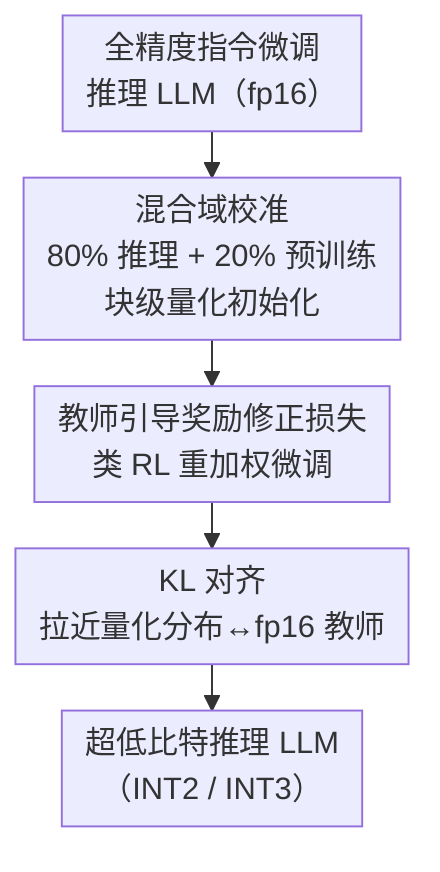

# Towards Quantization-Aware Training for Ultra-Low-Bit Reasoning LLMs

**会议**: ICLR 2026  
**OpenReview**: [https://openreview.net/forum?id=Azsd2qyK6C](https://openreview.net/forum?id=Azsd2qyK6C)  
**代码**: https://github.com/yasu0001/ReasoningQAT  
**领域**: 模型压缩  
**关键词**: 量化感知训练, 超低比特量化, 推理大模型, 混合域校准, 奖励修正损失

## 一句话总结
针对超低比特（≤2 bit）量化会严重摧毁推理能力的问题，本文提出一套面向推理 LLM 的两阶段 QAT 流水线——第一阶段用「80% 推理 + 20% 预训练」的混合域数据做块级量化校准，第二阶段用教师引导的奖励修正损失做微调，让 2-bit 量化的 Qwen3-8B 在五个推理基准上平均超过 PTQ 基线 50.45%。

## 研究背景与动机
**领域现状**：把 LLM 部署到推理端的一个主流路线是权重量化。其中量化感知训练（QAT）在超低比特（< 4 bit）场景下尤其有效——它在带量化约束的前提下继续微调权重，能让 2-bit 模型逼近 fp16 原模型的表现，远比无需重训的后训练量化（PTQ）稳。典型 QAT 流水线分两步：先用一小撮校准数据初始化量化权重，再用自监督/蒸馏损失端到端微调。

**现有痛点**：现有 QAT 几乎都是为「指令微调模型」设计的，校准数据通常直接取预训练数据的子集，微调用普通的交叉熵/蒸馏损失。可一旦作用在**经过 post-training（SFT + 偏好优化）的推理模型**上，数学、代码、指令跟随这些推理类基准会断崖式掉点——2-bit 的 GPTQ/AWQ 在 MATH-500 上几乎归零。

**核心矛盾**：作者把矛头指向 post-training 引入的「异质知识结构」。预训练得到的常识知识与 post-training 得到的推理能力，对量化的**敏感度根本不同**。论文做了一个关键实验（图 2）：把 3-bit 量化的校准数据里推理数据的比例从 0 慢慢加到 100%，常识类任务的准确率几乎纹丝不动，而数学/代码/科学这些推理任务的准确率随推理数据增多而显著上升；t-SNE 也显示预训练输入的激活聚得很紧、推理输入却分散得很开。这说明：推理能力会受「域偏移」之苦、对校准数据极敏感，常识知识则相对皮实——单域校准必然顾此失彼。

**本文目标**：设计一套专为推理 LLM 服务的 QAT 流水线，把算力**集中花在保住难以恢复的推理能力上**，对常识知识只需最小投入即可维持。

**核心 idea**：两阶段——(1) 用偏向推理的**混合域校准**做块级量化，先把两类能力都「框住」；(2) 用**教师引导的奖励修正损失**微调，把推理能力像 RL 那样「拉回来」，但又不付 RL 在线采样的高昂代价。

## 方法详解

### 整体框架
整套流水线接收一个全精度的指令微调推理模型（Qwen3 系列），输出一个超低比特（2/3-bit）但仍保有推理能力的量化模型，全程分两阶段串行。第一阶段是**块级量化校准**：用 80% 推理数据 + 20% 预训练数据混合的校准集逐块拟合量化参数，把模型初始化成一个「常识没丢、推理底子还在」的量化起点。第二阶段是**端到端微调**：固定量化结构，用一个把交叉熵改造成「类 RL」的教师引导奖励修正损失，叠加一项对齐 fp16 教师分布的 KL 损失，专门把推理能力恢复到接近原模型。两阶段各司其职——第一阶段负责「都别丢」，第二阶段负责「把推理拉满」。

### 关键设计

**1. 混合域校准数据：让推理与常识在量化时都不掉队**

第一阶段的核心问题是「校准数据该取什么域」。论文 3.1 节的分析表明：纯预训练数据校准会让推理任务因域偏移而误差陡增，纯推理数据校准又会反过来拖累常识任务（即便常识任务整体不敏感，喂纯推理数据时也会掉点）。两者都是单域校准的牺牲品。本文据此提出把校准集设为 **80% 推理数据（OpenThoughts-1.2M，含数学/代码/科学）+ 20% 预训练数据（FineWeb-Edu）**：主体偏向推理，因为推理能力一旦在量化时丢了后面极难恢复；留两成预训练数据则是为了「覆盖预训练分布」、守住常识。块级量化时只微调 scale（沿用 EfficientQAT 的做法），用 4096 条、上下文 2048 的样本逐块拟合。实验里这个混合配比相比单域校准在六项任务上平均最多提升 2.74%，关键是它在推理基准上几乎追平纯推理校准、又在常识基准上明显优于纯推理校准，真正做到两头都不塌。

**2. 教师引导的奖励修正损失：用 RL 的「修正」精神而不付 RL 的采样代价**

第二阶段要恢复推理能力。直接拿推理数据做普通监督微调（SFT）泛化差；改用强化学习能泛化好，但在线自回归采样开销巨大。本文借鉴 reward rectification（奖励修正）来折中：它本质是给 SFT 损失乘一个动态重加权因子，把监督目标改造得「像 RL」。原始形式为 $L(\theta) = L_{\mathrm{SFT}}(\theta)\cdot \mathrm{sg}(1/w)$，其中 $\mathrm{sg}(\cdot)$ 是停梯度算子；当取 $w = 1/\pi_\theta(y\mid x)$ 时，其梯度等价于以 $r(x,y)=\mathbb{1}[y=y^*]$ 为奖励的同策略策略梯度更新，从而避免模型在低概率参考 token 上过度集中、改善泛化，却完全不需要额外采样或显式奖励函数。

但直接套用会踩坑：量化后模型自身的概率分布因精度损失而不可靠，再拿它自己的 $\pi_\theta$ 去重加权只会放大误差。于是本文改用**教师模型**（fp16 原模型）对标签的概率 $\pi_t(y^*\mid x)$ 作为重加权依据：

$$L_t(\theta) = L_{\mathrm{SFT}}(\theta)\cdot \mathrm{sg}\big(\pi_t(y^*\mid x)\big)$$

直观上，当量化模型对正确标签的概率低于教师概率时，监督损失被放大、逼它往教师分布靠；当量化分布逐渐接近原分布，这个因子就退化回原始奖励修正的作用。它把「修正」锚定在我们想恢复的目标分布上，而非可能已被量化污染的自身分布。

**3. KL 散度对齐：把整体输出分布拉回 fp16 教师**

奖励修正只盯着标签 token，为了让量化模型的**整体概率分布**也对齐原模型，本文再加一项 KL 散度损失，最终训练目标为

$$L(\theta) = \alpha L_t(\theta) + \beta D_{\mathrm{KL}}\big(\pi_T(\cdot\mid x)\,\Vert\,\pi_S(\cdot\mid x)\big)$$

其中 $\pi_T$ 是 fp16 教师、$\pi_S$ 是量化学生，$\alpha,\beta$ 控制两项权重（默认 $\alpha=0.2,\ \beta=1.0$，KL 只在 top-20 概率上计算）。奖励修正负责「在难点上施压恢复推理」，KL 负责「整体行为别跑偏」，两者互补——消融显示两项并用比任一单独使用都好，且在更激进的 2-bit 设置下增益更明显。

### 损失函数 / 训练策略
训练分两阶段。校准阶段：4096 条样本、上下文 2048，量化参数学习率 1e-4、权重学习率 1e-5（2-bit 权重用更大的 2e-5）。微调阶段：从 OpenThoughts-1.2M 取 32768 条样本，AdamW + 余弦退火，batch 64；3-bit 跑 1 个 epoch、学习率 1e-6，2-bit 的 1.7B 模型跑 3 个 epoch、权重学习率 5e-6（其余参数 1e-4）。KL 损失过滤到 top-20 概率，默认 $\alpha=0.2,\ \beta=1.0$。

## 实验关键数据

### 主实验
在 Qwen3 系列、五个推理基准（MATH-500、LiveCodeBench、MMLU-Redux、GPQA-Diamond、IFEval）上对比 PTQ 基线 GPTQ/AWQ，group size = 128，激活为 bf16（W/A = 2 或 3 / 16）。

| 模型 | 方法 | 位宽(W/A) | 五任务平均 | 说明 |
|------|------|-----------|-----------|------|
| Qwen3-8B | FP 基线 | bf16 | 80.5 | 原模型上限 |
| Qwen3-8B | GPTQ | 2/16 | 4.6 | PTQ 几乎崩溃 |
| Qwen3-8B | AWQ | 2/16 | 4.0 | PTQ 几乎崩溃 |
| Qwen3-8B | **本文** | 2/16 | **55.1** | 较 PTQ 平均高约 50.45% |
| Qwen3-1.7B | GPTQ | 3/16 | 28.3 | — |
| Qwen3-1.7B | AWQ | 3/16 | 36.5 | — |
| Qwen3-1.7B | **本文** | 3/16 | **55.2** | 较 PTQ 高 18.71% |

2-bit 下 GPTQ/AWQ 在 MATH-500 上基本归零，本文方法仍能拿到 MATH-500 80.4（8B）；且准确率随参数量增大而稳步上升，说明方法能随模型规模有效扩展。

与 SOTA QAT（同框架复现，均用混合校准 + 同 token 数微调）对比，Qwen3-1.7B：

| 方法 | 位宽 | 五任务平均 |
|------|------|-----------|
| EfficientQAT | 3/16 | 53.5 |
| BitDistiller | 3/16 | 39.2 |
| **本文** | 3/16 | **55.2** |
| EfficientQAT | 2/16 | 18.3 |
| BitDistiller | 2/16 | 15.2 |
| **本文** | 2/16 | **28.4** |

与从零训练的原生三值模型 BitNet b1.58 2B4T 对比：本文 INT2 的 Qwen3-1.7B 仅用 968M 训练 token（BitNet 用 4T），MATH-500 达 48.60 vs 43.40，平均 50.75 略胜 51.75 中的数学项——以远更少的训练成本取得约 2~2.5% 数学推理优势。

### 消融实验
表 4：拆解块级校准（C）与损失选择（S 为普通交叉熵 SFT、R 为本文奖励修正损失），2-bit Qwen3-1.7B。

| 配置 | MATH-500 | LiveCodeBench | IFEval | 说明 |
|------|----------|---------------|--------|------|
| S | 1.4 | 0.0 | 10.72 | 只做普通 SFT，几乎无效 |
| R | 1.60 | 0.0 | 12.20 | 没校准，单靠新损失也救不回 |
| C+S | 22.70 | 0.00 | 23.66 | 有校准 + 普通 SFT |
| **C+R** | **38.13** | **5.75** | **31.61** | 校准 + 本文损失，全面最优 |

表 6（损失权重，3-bit Qwen3-1.7B，MATH-500）：仅奖励修正 $(1,0)$ 得 78.2，仅 KL $(0,1)$ 得 82.8，两者并用 $(0.2,1)$ 得 82.7——单看 MATH 接近，但综合多基准并用最稳，2-bit 下并用的增益更突出。

### 关键发现
- **校准与损失是两根不可或缺的支柱**：缺校准（S/R）几乎全崩，缺新损失（C+S）也明显弱于 C+R；从交叉熵换成奖励修正损失，MATH-500 直接 +15.43%、LiveCodeBench +5.75%，而普通交叉熵 SFT 反而会让推理基准退化。
- **混合校准的价值在「两头都保」**：纯推理校准在常识任务上掉点、纯预训练校准在推理任务上误差大，80/20 混合既追平纯推理校准的推理表现、又守住常识。
- **方法对模型容量受限时尤其管用**：位宽越低、参数越少，相对 PTQ 的提升越大（如 3-bit 1.7B 提升 18.71%）。

## 亮点与洞察
- **「分域诊断 → 对症下药」的清晰逻辑**：先用数据配比扫描 + t-SNE 证明「推理对量化敏感、常识不敏感」，再据此把校准预算偏向推理（80/20），动机具体且可验证，不是拍脑袋调比例。
- **教师引导是点睛之笔**：奖励修正本来用学生自身概率重加权，但量化模型分布已被污染，改用 fp16 教师概率当锚点——一个小改动绕开了「用坏分布纠坏分布」的恶性循环，这个思路可迁移到任何「学生分布不可靠的蒸馏/量化重加权」场景。
- **用「类 RL 的 SFT」换效率**：把奖励修正损失证明为等价于某种同策略策略梯度，既拿到 RL 的泛化好处，又省掉在线采样的天价开销，对算力有限的超低比特训练很实用。

## 局限与展望
- 实验集中在 Qwen3 单一系列（1.7B/4B/8B），跨架构（如 Llama、MoE）的普适性未验证。
- 只覆盖 2/3-bit、权重量化，激活仍是 bf16；权重+激活联合超低比特、以及 1-bit/三值的极端场景未探。
- 混合比例固定为 80/20、$\alpha=0.2,\beta=1.0$ 等关键超参偏经验设定，不同模型/任务下是否需要重调缺乏系统分析。
- 教师引导依赖一个可用的 fp16 教师，若原模型本身就弱或不可得，该路线的优势会打折。

## 相关工作与启发
- **vs EfficientQAT / BitDistiller（SOTA QAT）**：它们主要为指令模型设计、用预训练数据校准 + 交叉熵/蒸馏微调；本文指出这套在推理模型上不够，换成混合域校准 + 教师引导奖励修正损失，同框架复现下 2-bit/3-bit 全面更优。
- **vs GPTQ / AWQ（PTQ）**：PTQ 无需重训、快，但超低比特下推理基准近乎归零；本文以 QAT 微调换来 2-bit 可用的推理能力，平均高出约 50%。
- **vs BitNet b1.58 2B4T（原生三值）**：BitNet 从零训练、吃 4T token；本文把已有 Qwen3 量化到 2-bit，用 < 1B token 就在数学推理上反超，路线更省、更易复用现成强模型。

## 评分
- 新颖性: ⭐⭐⭐⭐ 「分域敏感度诊断 + 教师引导奖励修正」的组合有清晰洞察，单个组件多为已有技术的巧妙改造。
- 实验充分度: ⭐⭐⭐⭐ 覆盖 PTQ/QAT/原生三值三类基线、多尺寸多位宽、消融到位；但仅限 Qwen3 系列。
- 写作质量: ⭐⭐⭐⭐ 动机推导扎实、图表清楚，公式表述偶有粗糙处。
- 价值: ⭐⭐⭐⭐ 超低比特推理 LLM 部署是真需求，方法实用且训练成本低。

<!-- RELATED:START -->

## 相关论文

- [\[ICLR 2026\] Compute-Optimal Quantization-Aware Training](compute-optimal_quantization-aware_training.md)
- [\[AAAI 2026\] SpecQuant: Spectral Decomposition and Adaptive Truncation for Ultra-Low-Bit LLMs Quantization](../../AAAI2026/model_compression/specquant_spectral_decomposition_and_adaptive_truncation_for_ultra-low-bit_llms_.md)
- [\[ICLR 2026\] Quant-dLLM: Post-Training Extreme Low-Bit Quantization for Diffusion Large Language Models](quant-dllm_post-training_extreme_low-bit_quantization_for_diffusion_large_langua.md)
- [\[ICLR 2026\] Metis: Training LLMs with FP4 Quantization](metis_training_llms_with_fp4_quantization.md)
- [\[ICLR 2026\] SliderQuant: Accurate Post-Training Quantization for LLMs](sliderquant_accurate_post-training_quantization_for_llms.md)

<!-- RELATED:END -->
