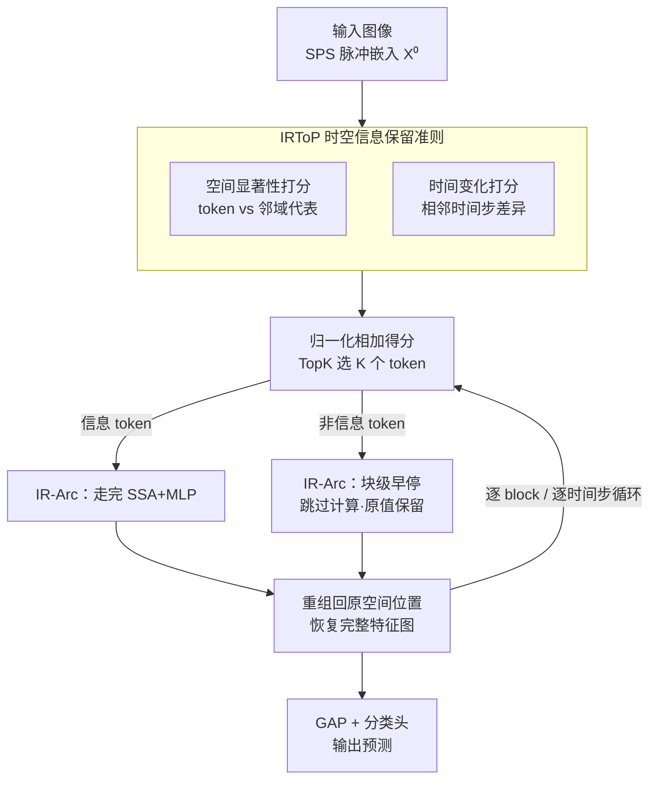

# TP-Spikformer: Token Pruned Spiking Transformer

**会议**: ICLR 2026  
**OpenReview**: [https://openreview.net/forum?id=L5llQD0nMf](https://openreview.net/forum?id=L5llQD0nMf)  
**代码**: 无  
**领域**: 模型压缩  
**关键词**: 脉冲神经网络, 脉冲 Transformer, Token 剪枝, 免训练, 时空显著性

## 一句话总结
针对脉冲 Transformer 部署开销大的问题，本文提出一种**免训练、不改结构**的 token 剪枝方法 TP-Spikformer：先用受神经科学启发的「时空信息保留准则」(IRToP) 给每个 token 打分，再用「块级早停架构」(IR-Arc) 让不重要的 token 跳过后续计算而非直接删除，在 ImageNet 等多个架构与任务上以零微调换来最高约 48% 的算力下降而精度仅掉 0.5–1.5%。

## 研究背景与动机

**领域现状**：脉冲神经网络 (SNN) 用二值脉冲、事件驱动的方式传递信息，只有部分神经元被激活并参与突触累加，因此天生节能、契合神经形态硬件。把 Transformer 引入 SNN 后诞生了 Spikformer、QKFormer、Spike-driven Transformer (SDT) V1/V3 等一系列脉冲 Transformer，在大规模 benchmark 上把精度推得很高。

**现有痛点**：精度是用规模换来的。以 SDT-V3 为例，它在 ImageNet 上达到 86.2% 准确率，却带着 1.73 亿参数、1384MB 显存、每秒 284 亿次突触运算——这把 SNN 最宝贵的能效优势抵消掉了，根本没法部署到边缘设备。Token 剪枝是一条很自然的压缩路线（视觉任务的最终预测通常只依赖一部分 token），但现有 SNN token 剪枝方法（SparseSpikformer、AT-SNN、STATA）有两个共同毛病：一是**要改原结构**（引入额外 token、加可训练模块、改连接），二是**要重训练**，训练成本高、通用性差。

**核心矛盾**：想压缩就得动结构、动训练，而动结构、动训练又抬高了应用成本、削弱了"即插即用"的可能。已有方法还普遍只用脉冲发放率 (firing rate) 衡量 token 重要性，**没利用 SNN 独有的时间维度信息**，且大多只在单一架构、小数据集上验证过。

**本文目标**：设计一个 token 重要性判据，既看空间显著性又看时间动态；并设计一种剪枝执行方式，不改原网络、不需要从头训练，还能兼容带特征金字塔的层级式脉冲 Transformer。

**切入角度**：作者借鉴神经科学——人类视觉系统并不平均处理所有信息，而是优先关注**空间上显著**（与周围明显不同）或**时间上突变**的区域。把这个选择性注意机制搬到脉冲 Transformer 上，就能用一个启发式判据找出"信息量大"的 token。

**核心 idea**：用「空间不相似度 + 时间变化量」启发式地给 token 打分 (IRToP)，再把不重要的 token **块级早停**（跳过 SSA/MLP、原样保留）而不是直接删掉 (IR-Arc)，从而在零微调下既省算力又少丢信息。

## 方法详解

### 整体框架

TP-Spikformer 是一个**插在已训练好的脉冲 Transformer 每个 block 前面的剪枝外挂**：输入图像经脉冲 patch embedding (SPS) 得到时空特征 $\mathbf{X}^0 \in \mathbb{R}^{T\times H\times W\times D}$ 后，在每个 block、每个时间步 $t$ 上，先用 IRToP 准则给 $H\times W$ 个 token 打时空分，按剪枝率 $r_\ell$ 用 TopK 选出"信息 token"集合 $\mathbf{I}$ 和"非信息 token"集合 $\mathbf{U}$；信息 token 正常走完该 block 的 SSA + MLP，非信息 token 则被**块级早停**（直接跳过本 block 的计算、原值保留），最后把两部分**重组**回原来的空间位置，恢复成完整特征图喂给下一个 block。所有 block 跑完后由全局平均池化 (GAP) 和分类头 (CH) 出预测。整个过程不引入任何可训练参数，因此可以在官方预训练权重上**零微调**直接运行。

### 关键设计

**1. 空间显著性打分：用 token 与邻域代表的余弦不相似度衡量"独特性"**

人类视觉里，空间位置之间会竞争显著性，只有与局部环境明显不同的区域才会被保留下来继续处理。据此，作者衡量每个 token 与其空间邻域"代表 token"的表征差异：对位置 $(h,w)$ 的 token $\mathbf{X}^{\ell-1}_{t,h,w}$，先取它 $k\times k$ 窗口内所有 token 的均值 $\mathbf{Y}^{\ell-1}_{t,h,w}$ 作为局部上下文代表，再算两者的余弦不相似度

$$\mathcal{S}_{\mathrm{score}}(\mathbf{X}^{\ell-1}_{t,h,w}) = 1 - \frac{\langle \mathbf{X}^{\ell-1}_{t,h,w}, \mathbf{Y}^{\ell-1}_{t,h,w}\rangle}{|\mathbf{X}^{\ell-1}_{t,h,w}|\cdot|\mathbf{Y}^{\ell-1}_{t,h,w}|}.$$

用"均值代表 token"而不是和每个邻居两两算相似度，是为了把复杂度从 $O(k^2)$ 降到一次卷积（实现上就是用全 1 的 $k\times k$ 均值核做一次 Conv2d 得到 $\mathbf{Y}$）。整张特征图算完后归一化到 $[0,1]$ 且总和为 1，分越高说明这个 token 越"与众不同"、越该被保留。这条分支抓的是单帧内的空间显著性。

**2. 时间变化打分：用相邻时间步的差异捕捉 SNN 独有的时序信息**

这是相对已有方法（只看发放率）的关键差异点：SNN 在 $T$ 个时间步上重复处理同一输入，相邻时间步之间的变化携带了真正的时序动态，而发放率把这层信息抹平了。作者据此对每个 token 算它在相邻时间步上的变化幅度

$$\mathcal{T}_{\mathrm{score}}(\mathbf{X}^{\ell-1}_{t,h,w}) = \begin{cases} |\mathbf{X}^{\ell-1}_{t,h,w} - \mathbf{X}^{\ell-1}_{t-1,h,w}|, & t>1, \\ |\mathbf{X}^{\ell-1}_{t,h,w}|, & t=1, \end{cases}$$

同样在每个时间步内归一化。变化越大说明该 token 承载越丰富的时序信息、保留优先级越高。最终 IRToP 把归一化后的空间分和时间分**直接相加**得到时空总分 $\mathrm{IRToP} = \hat{\mathcal{S}}_{\mathrm{score}} + \hat{\mathcal{T}}_{\mathrm{score}}$，按该分排序取 TopK 个保留：$K=\lceil(1-r_\ell)\times H\times W\rceil$，其余划为非信息 token 候选剪枝。消融显示两条分支缺一不可——空间分支在 SDT-V1 上够用，时间分支在 QKFormer 上更关键。

**3. IR-Arc 块级早停剪枝架构：跳过而非删除，免训练且兼容特征金字塔**

有了打分还要解决"怎么剪"。直接删 token (Drop) 会改变特征图尺寸，对层级式、带特征金字塔的架构（如 QKFormer）极不友好——消融里 Drop 在 QKFormer/SDT-V3 上直接 "Fail"。IR-Arc 的做法是**早停**而非删除：在第 $\ell$ 个 block，信息 token 走完完整计算 $\mathbf{X}^\ell_{t,\mathrm{inf}}=\mathrm{MLP}(\mathrm{SSA}(\mathbf{I})+\mathbf{I})+\dots$，非信息 token 则跳过这个 block 的 SSA/MLP、保持原值 $\mathbf{X}^\ell_{t,\mathrm{uni}}=\mathbf{U}^{\ell-1}_t$，再用 Reassemble 把两部分按原坐标拼回完整特征图。

这样设计有三重好处：一是**省**——非信息 token 不进自注意力和 MLP，显存和算力都降；二是**保信息**——被剪的 token 不是被丢弃而是带着原值继续往下传，比直接删除丢的信息更少；三是**通用**——因为特征图尺寸始终被还原，所以不挑架构，能无缝套到层级式脉冲 Transformer 上。最关键的是整套流程不含任何可训练模块，剪枝率 $r=\{r_1,\dots,r_L\}$ 是按 block 预设的超参，因此**零微调**就能在预训练权重上跑，这正是它相对 STATA（要完整重训）等方法的核心卖点。

### 损失函数 / 训练策略
方法本身**无需训练**：不引入新参数、不改原结构，直接在官方预训练权重上前向推理即可剪枝。若进一步微调可再涨点，但论文主打的就是 zero-finetuning 即可保持精度（详见实验）。剪枝率按 block 递增设置（浅层少剪、深层多剪，如图示 $r$ 从 0.0 逐步升到 0.59）。

## 实验关键数据

### 主实验

ImageNet 上跨架构验证（节选 Table 2，"S" 表示不加参数/不重训，$N_{avg}$ 为平均 token 保留率）：

| 架构 | $N_{avg}$ | OPs$_{block}$ | Power | Acc. | 吞吐 |
|------|-----------|---------------|-------|------|------|
| SDT-V1-8-768 | ×1 (Base) | 9.04G | 10.26mJ | 76.32% | 156 |
| SDT-V1-8-768 | ×0.51 | 4.71G (↓48%) | 6.36mJ (↓38%) | 74.79% (-1.53) | 202 (↑29%) |
| QK-10-768 | ×1 (Base) | 15.08G | 32.12mJ | 85.56% | 75 |
| QK-10-768 | ×0.53 | 7.97G (↓47%) | 25.71mJ (↓20%) | 82.53% (-3.03) | 106 (↑41%) |
| SDT-V3-19M | ×1 (Base) | 1.74G | 5.47mJ | 79.72% | 1562 |
| SDT-V3-19M | ×0.56 | 0.98G (↓44%) | 4.25mJ (↓22%) | 77.55% (-2.17) | 1886 (↑21%) |

小数据集上与已有 SNN token 剪枝方法对比（Table 1，本文是唯一"S"=免训练免加参的方法）：CIFAR-10 仅保留 20% token 时精度只掉 0.07%（95.12% vs 95.19%）；CIFAR-100 保留 60% 反而涨 0.27%；DVS-CIFAR10 保留 78% 涨 0.1%，均优于需要重训的 SparseSpikformer / AT-SNN / STATA。

下游任务（均用 SDT-V3 作 backbone，免训练）：ADE20K 语义分割保留 56% token，吞吐 1.7×、mIoU 仅掉 0.2%（40.0% vs 40.2%）；COCO2017 检测保留 78% token，吞吐 1.4×、mAP 仅掉 1%；事件跟踪 (FE108/FELT/VisEvent) 保留 56% token 即可超过多数 RGB 跟踪器、逼近 SDTrack。

### 消融实验

ImageNet 上零微调消融（Table 6，精度%）：

| 配置 | SDT-V1 ×0.52 | QKFormer ×0.65 | SDT-V3 ×0.78 |
|------|--------------|----------------|--------------|
| [Random, Drop] | 59.88 | Fail | Fail |
| [Random, IR-Arc] | 60.02 | 74.45 | 73.15 |
| [Spatial, IR-Arc] | 73.52 | 58.93 | 75.95 |
| [Temporal, IR-Arc] | 70.95 | 79.69 | — |
| [IRToP, IR-Arc] (Full) | **73.78** | **81.16** | **75.95** |

### 关键发现
- **IRToP 评分确实有效**：在 IR-Arc 下，IRToP 相比随机剪枝在 SDT-V1/QKFormer/SDT-V3 上分别提升 13.76% / 6.71% / 2.8%，说明"按时空信息量选 token"远胜随机。
- **IR-Arc 的价值在通用性**：与直接删除 (Drop) 比，SDT-V1 上差距很小 (59.88% vs 60.02%)，但 Drop 在 QKFormer/SDT-V3 上直接 Fail，而 IR-Arc 能撑住——早停+重组才是兼容特征金字塔的关键。
- **两个 scorer 缺一不可且互补**：空间 scorer 在 SDT-V1 上够用 (73.52%)、单独用时间 scorer 反而更差；但在 QKFormer 上时间 scorer 才是主力 (79.69% vs 空间 58.93%)。不同架构各有侧重，合起来 (IRToP) 才能两边都最好。
- **零微调即可保持精度**：用官方预训练权重直接剪枝、不微调就能拿到上述成绩，这是它最实用的性质。

## 亮点与洞察
- **把"免训练"做成核心卖点**：不引入任何可训练参数、不改网络连接，直接套预训练权重——这让它相比要重训的 STATA/AT-SNN 在部署成本上有代差级优势，也是 SNN 边缘部署最需要的性质。
- **"早停而非删除"是巧设计**：被剪的 token 带原值继续往下传而非清零，既省算力又少丢信息，还顺带保住了特征图尺寸，使方法天然兼容层级式架构——一个动作解决了"省"和"通用"两个问题。
- **真正利用了 SNN 的时间维度**：已有方法只看发放率、丢掉了时序信息，本文用相邻时间步差异补上这一维，消融证明它在 QKFormer 这类架构上是决定性的。这个"时间变化打分"思路可迁移到其他需要在 $T$ 个时间步上做选择的 SNN 任务（如脉冲视频/事件流处理）。
- **打分用均值核卷积实现**：空间 scorer 用全 1 均值核一次 Conv2d 得到邻域代表，避免两两相似度的 $O(k^2)$ 开销，是个可复用的轻量 trick。

## 局限与展望
- **剪枝率是手工预设的逐 block 超参**：$r=\{r_1,\dots,r_L\}$ 需要人为设定（浅层少剪、深层多剪），没有自适应机制；不同架构/任务可能要重新调，论文未给出自动确定剪枝率的方案。
- **高压缩率下大模型掉点仍明显**：QKFormer 保留 53% token 时精度掉 3.03%，并非所有架构都能"几乎无损"，越大越复杂的模型对剪枝越敏感。
- **下游任务定位是"有竞争力"而非"更强"**：分割/检测/跟踪实验作者明确说是为了证明剪枝后仍 competitive，而非刷 SOTA，掉点（如检测 mAP -1%）在边缘场景可接受但并非免费。
- **改进方向**：把逐 block 剪枝率变成可学习/可自适应（按输入难度动态调），或结合量化、NAS 进一步压缩，可能在高压缩率下找回更多精度。

## 相关工作与启发
- **vs SparseSpikformer**：它在权重+token 两级做混合剪枝、按发放率判重要性，但只用发放率（丢时序）、且只在单一架构小数据集验证；本文用时空双 scorer、且跨 4 种架构 + 4 类任务验证，还免训练。
- **vs AT-SNN**：它用自适应计算时间 (ACT) + Halting Score 在训练中 mask token，再做相似度 token 合并；ACT 引入额外参数、必须重训，本文则零参数零微调。
- **vs STATA**：它是首个在 ImageNet 上验证的脉冲 Transformer token 剪枝方法，但要完整重训、额外 loss 抬高训练开销；本文不重训、不改结构，且在相近保留率下精度更高（如 Spikformer 系对比）。

## 评分
- 新颖性: ⭐⭐⭐⭐ 把神经科学的时空选择性注意做成免训练判据，并用"早停而非删除"兼顾省算力与通用性，组合新颖。
- 实验充分度: ⭐⭐⭐⭐⭐ 跨 Spikformer/QKFormer/SDT-V1/V3 四架构 + 分类/分割/检测/跟踪四任务，消融解耦了两个 scorer 与 IR-Arc，很扎实。
- 写作质量: ⭐⭐⭐⭐ 结构清晰、动机与公式交代到位，方法叙述完整。
- 价值: ⭐⭐⭐⭐ 免训练、不改结构、即插即用，对 SNN 边缘部署有直接实用价值。

<!-- RELATED:START -->

## 相关论文

- [\[ICLR 2026\] Otters: An Energy-Efficient Spiking Transformer via Optical Time-to-First-Spike Encoding](otters_an_energy-efficient_spiking_transformer_via_optical_time-to-first-spike_e.md)
- [\[ICLR 2026\] Vulcan: 为边缘智能裁剪紧凑的类特定视觉 Transformer](vulcan_crafting_compact_class-specific_vision_transformers_for_edge_intelligence.md)
- [\[ICML 2026\] Plug-and-Play Spiking Operators: Breaking the Nonlinearity Bottleneck in Spiking Transformers](../../ICML2026/model_compression/plug-and-play_spiking_operators_breaking_the_nonlinearity_bottleneck_in_spiking_.md)
- [\[ICLR 2026\] Ensembling Pruned Attention Heads for Uncertainty-Aware Efficient Transformers](ensembling_pruned_attention_heads_for_uncertainty-aware_efficient_transformers.md)
- [\[ICLR 2026\] Reasoning Models Can be Accurately Pruned Via Chain-of-Thought Reconstruction](reasoning_models_can_be_accurately_pruned_via_chain-of-thought_reconstruction.md)

<!-- RELATED:END -->
