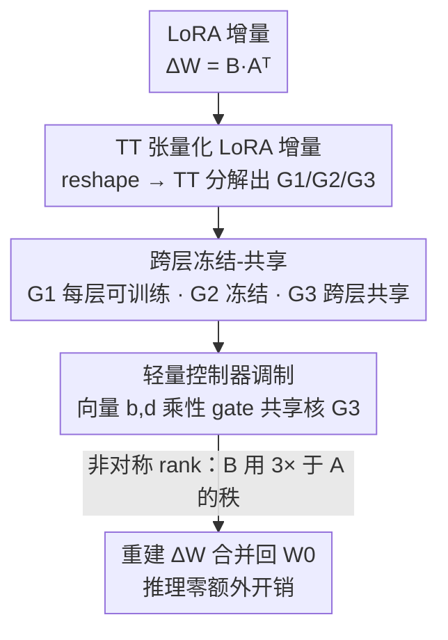

# TRAC: Tensor-Train Based Across-Layer Compression for Parameter-Efficient Fine-Tuning

**会议**: ICLR 2026  
**OpenReview**: [https://openreview.net/forum?id=tz5yPWZp9W](https://openreview.net/forum?id=tz5yPWZp9W)  
**代码**: https://github.com/BangguoYe/TRAC  
**领域**: 模型压缩 / 参数高效微调（PEFT）  
**关键词**: Tensor-Train 分解, 跨层共享, LoRA, 参数高效微调, 张量压缩

## 一句话总结
TRAC 把 LoRA 的低秩增量矩阵 $A,B$ 改写成 Tensor-Train（TT）张量核序列，再在「跨层冻结/共享部分张量核 + 轻量向量控制器恢复层间灵活性」的策略下，把可训练参数压到比 LoRA 小一个数量级（LLaMA2-13B 上 20×、ViT-Large 上 14×），同时在 NLU / NLG / 常识与数学推理 / 图像分类上保持甚至超过 LoRA。

## 研究背景与动机

**领域现状**：在资源受限下微调大模型，主流是参数高效微调（PEFT），其中 LoRA 把权重更新写成低秩分解 $\Delta W = BA^\top$（$B\in\mathbb{R}^{m\times r},A\in\mathbb{R}^{n\times r}$），只训练这两个小矩阵，因为简单高效成为事实标准。

**现有痛点**：LoRA 的参数量被「矩阵分解」这件事本身卡住了下限——参数量正比于秩 $r$，而 $r$ 是离散的，最小只能取到 $r=1$。当服务商要为成千上万用户各存一份 LoRA 权重时，即便这个「已经很小」的量也变得可观；更关键的是，秩的离散性让参数预算无法做细粒度调节，在「极低参数」区间里 LoRA 根本下不去。

**核心矛盾**：一类工作（VeRA、ShareLoRA、VB-LoRA 等）试图靠「跨层冻结/共享」继续压缩，利用了「不同层的 LoRA 矩阵彼此相似、存在冗余」这一观察；但它们仍困在矩阵分解的范式里，结构约束让它够不到极小预算。另一类工作（LoRETTA、TT-LoRA、QuanTA）改用更灵活的张量分解，表达力更强、参数配置更连续，但它们把每层的分解模块都当成一组独立的可训练张量，**没有利用跨层冗余**，于是参数量仍然随网络深度 $L$ 线性增长。

**本文目标**：把这两条线的优点合到一起——既要张量分解的表达力与连续可调，又要跨层共享带来的「参数量不随深度增长」。

**切入角度**：作者在 RoBERTa-Base 上做了一个对照实验，发现 TT 分解出的三个核里，大核 $G_2,G_3$ 在深层 Transformer 中存在大量跨层冗余：把它们冻结/共享后参数从 0.41M 砍到 0.026M（近 15×），精度几乎不掉。这说明「大核可以省、层特异性主要靠小核」。

**核心 idea**：把 LoRA 增量张量化成 TT 核序列，给三个核分配不同角色——小核 $G_1$ 每层可训练、大核 $G_2$ 冻结、$G_3$ 跨层共享，再用每层一对轻量向量控制器去乘性地调制共享核 $G_3$，把被共享磨掉的层间灵活性补回来。

## 方法详解

### 整体框架

TRAC 的目标是：在不动预训练主干 $W_0$ 的前提下，用尽可能少的可训练参数表达 LoRA 增量 $\Delta W = BA^\top$，并在推理时像 LoRA 一样把 $\Delta W$ 合并回 $W_0$、不改变网络结构。整条流水线分四步走：先把低秩矩阵 $A,B$ **张量化**成 TT 核序列；再按「**跨层冻结-共享**」给每个核分配角色；然后用**轻量控制器**把共享核重新「调味」出层间差异；最后重建 $\Delta W$ 合并。

具体地，对 $A\in\mathbb{R}^{n\times r}$，先 reshape 成高阶张量 $\mathcal{A}\in\mathbb{R}^{n_1\times n_2\times n_3\times r}$（$n_1n_2n_3=n$），再做 TT 分解成三个三阶核 $G_1\in\mathbb{R}^{1\times n_1\times r_1}$、$G_2\in\mathbb{R}^{r_1\times n_2\times r_2}$、$G_3\in\mathbb{R}^{r_2\times n_3\times r}$，使 $\mathcal{A}(i_1,i_2,i_3,:)=G_1(i_1)G_2(i_2)G_3(i_3)$；$B$ 同理分解成 $O_1,O_2,O_3$。注意 $G_1$ 因含一维大小为 1 的维度而很小（$|G_1|=n_1r_1$），$G_2,G_3$ 才是参数大头（$|G_2|=r_1n_2r_2$、$|G_3|=r_2n_3r$）——这正是冻结/共享要瞄准的对象。

### 关键设计

**1. TT 张量化 LoRA 增量：用张量核序列替代低秩矩阵，突破矩阵分解的参数下限**

LoRA 受困于「参数量正比于秩 $r$、$r$ 离散」，最小到 $r=1$ 就到底了。TRAC 的第一步是把 LoRA 的 $A,B$ 先 reshape 成高阶张量、再做 Tensor-Train 分解。TT 分解的好处是：对一个 $d$ 阶张量 $\mathcal{X}\in\mathbb{R}^{n_1\times\cdots\times n_d}$，它表示成 $d$ 个三阶核 $G_k\in\mathbb{R}^{r_{k-1}\times n_k\times r_k}$ 的「矩阵乘积」形式 $\mathcal{X}(i_1,\dots,i_d)=G_1(i_1)\cdots G_d(i_d)$，参数量约 $dnr^2$，**随阶数线性增长**，相对原始 $n^d$ 维是指数级压缩。更关键的是，压缩比可以通过 TT-rank $(r_1,r_2)$ 连续调节，而不像 LoRA 只能踩在离散的 $r$ 上——这就让 TRAC 能进入 LoRA 进不去的极低参数区间。这一步只是「换了一种更省、更可调的参数化」，单独用（即下面会提到的 All Trainable 基线）已经能比 LoRA 省，但还没利用跨层冗余。

**2. 跨层冻结-共享：按核的大小和冗余分配角色，让参数量不再随深度增长**

直接把每层的 TT 核都设为可训练（All Trainable 基线），参数仍随层数 $L$ 线性增长，因为每层都有独立的 $G_2,G_3$。作者在 RoBERTa-Base 上的对照实验发现：深层 Transformer 中，恰恰是大核 $G_2,G_3$ 跨层高度冗余——把 $G_2$ 冻结、$G_3$ 跨层共享、只保留小核 $G_1$ 每层可训练后，参数从 0.41M 降到 0.026M（近 15×），而 CoLA/MRPC/RTE/STS-B 上精度统计上几乎无差异。于是 TRAC 给三个核分配固定角色：$G_1$ **每层可训练**（保留最廉价的层特异性）、$G_2$ **冻结**（随机初始化后不训）、$G_3$ **跨层共享**（同一类型的 query/key/value/FFN 矩阵在所有层共用一份 $G_3$）。因为大头被共享，TRAC 的参数阶降到 $O(n^{1/3}r^2)$——**不含 $L$**，而 LoRA 是 $O(Lnr)$、LoRETTA 是 $O(Ln^{1/3}r^2)$。这是 TRAC 能在 13B 模型上拿到 20× 压缩的根本原因。

**3. 轻量控制器调制：用每层一对向量把共享核「调味」回层间差异**

共享 $G_3$ 省了参数，但所有层用同一份核会损失层特异性。TRAC 为每层引入两个轻量向量控制器 $b\in\mathbb{R}^{r_2}$、$d\in\mathbb{R}^{n_3}$，对共享核做乘性门控：

$$\widetilde{G_3}(t_1,t_2,t_3)=\gamma(b,d)\cdot\sigma(b)(t_1)\cdot\sigma(d)(t_2)\cdot G_3(t_1,t_2,t_3)$$

其中 $\gamma$ 是（固定或可训练的）缩放因子，$\sigma(\cdot)$ 是任务相关激活（文本分类用指数、文本生成与图像分类用线性）。直觉上，这两个向量像 MoE 里的专家权重 / DARTS 里的连续算子选择，按层去缩放共享核的不同切片，从而让每层「在共用同一份 $G_3$ 的前提下」表现出不同的行为。代价极小（每层只是两个向量），却能明显补回因共享而损失的表达力——消融显示加控制器是「几乎零额外开销换明显涨点」。$B$ 侧同理有自己的 $b',d'$。

**4. 非对称 rank 分配 + TT-norm 初始化：把有限预算花在更重要的 $B$ 上，并保证重建方差稳定**

TRAC 借用「$A,B$ 重要性不对称、$B$ 更关键」的已有结论（Zhu et al., 2024），在张量结构上很自然地实现：给 $A$ 用秩 $(r_1,r_2)$、给 $B$ 用 $(3r_1,3r_2)$，实验证明优于给两者都用 $(2r_1,2r_2)$ 的对称配置。初始化上，作者从 LoRETTA 改进出 **TT-norm 初始化** $\sigma_k=\frac{1}{\sqrt{r_k}}\left(\frac{1}{m+n}\right)^{\frac{1}{2n_k}}$，同时考虑张量秩和形状因子，保证重建矩阵的方差稳定、避免随张量维度/秩变化而爆炸或消失；并沿用 LoRA 惯例把 $B$ 的末核 $O_3$ 初始化为零（使初始 $B=0$），控制器则初始化成「起步时等价恒等映射」。这一组实现细节虽不如前三点抢眼，却是 TT 在极低秩下还能稳定训练的前提。

### 损失函数 / 训练策略
TRAC 不改训练目标，沿用各下游任务原本的微调损失（分类用交叉熵、生成用语言建模损失等），只是把可训练参数限定为每层的 $G_1/O_1$、控制器 $b,d,b',d'$（及可选的 $\gamma$），$G_2$ 冻结、$G_3$ 跨层共享。推理时 TT 核可经快速 TT 乘法重建出 $\Delta W$ 合并进 $W_0$，每层主导计算量为 $O(nr)$，与 LoRA 同阶。

## 实验关键数据

覆盖 86M～13B 参数模型，横跨 NLU、NLG、常识/数学/代码推理、图像分类。

### 主实验

GLUE（RoBERTa-Base/Large，平均分）：

| 方法 | 可训练参数(Base) | AVG.(Base) | 可训练参数(Large) | AVG.(Large) |
|------|------|------|------|------|
| FT | 124.69M | 85.2 | 355.42M | 88.2 |
| LoRA | 0.295M | 85.6 | 0.8M | 88.2 |
| VeRA | 0.043M | 83.9 | 0.061M | 87.4 |
| LoRETTA | 0.068M | 83.2 | — | — |
| **TRAC** | **0.026M** | **85.0** | **0.041M** | **87.7** |

Large 上 TRAC 用 0.041M 参数（比 LoRA 的 0.8M 少 ~19×）拿到 87.7 AVG，全面超过 VeRA、LoRETTA 且逼近 LoRA。

SuperGLUE（LLaMA2-7B/13B，AVG.）与 E2E 生成（GPT-2，节选）：

| 任务/模型 | 方法 | 可训练参数 | 关键指标 |
|------|------|------|------|
| SuperGLUE LLaMA2-13B | LoRA | 3.28M | 88.3 |
| SuperGLUE LLaMA2-13B | **TRAC** | **0.166M** | **88.6**（最佳，20× 压缩） |
| E2E GPT-2-Medium | LoRA | 0.35M | BLEU 68.9 |
| E2E GPT-2-Medium | **TRAC** | **0.054M** | **BLEU 70.3**（14% 参数） |

图像分类（ViT-Base/Large，四数据集 AVG.）：

| 模型 | 方法 | 可训练参数 | AVG. |
|------|------|------|------|
| ViT-Base | LoRA | 0.295M | 90.27 |
| ViT-Base | **TRAC** | **0.026M** | **90.85**（11× 压缩反超） |
| ViT-Large | LoRA | 0.786M | 91.74 |
| ViT-Large | **TRAC** | **0.056M** | **92.60**（14× 压缩反超） |

常识/数学/代码（LLaMA3-8B、Qwen3-8B）：TRAC 用 LoRA 的 35%–59% 参数，常识推理 AVG. 与 GSM8K / HumanEval 均与 LoRA 持平或更高（如 Qwen3-8B 常识 TRAC-1.06M 达 86.15 vs LoRA-1.92M 的 84.82）。

### 消融实验

| 配置（RoBERTa-Base，相同 TT-rank） | 可训练参数 | CoLA | MRPC | RTE | STS-B |
|------|------|------|------|------|------|
| All Trainable（全核可训练） | 411,648 | 64.83 | 88.92 | 80.29 | 91.21 |
| **Freeze+Share（本文）** | **26,304** | 64.84 | 88.63 | 80.14 | 91.21 |

参数效率与开销（RoBERTa-Large / LLaMA2-13B，节选自 Fig.3）：

| 指标 | LoRA | **TRAC** | 说明 |
|------|------|------|------|
| 权重存储(RoBERTa-Large) | 3.014 MB | **0.197 MB** | 省 >93% |
| 权重存储(LLaMA2-13B) | 12.543 MB | **0.699 MB** | 省 >94% |
| 训练时间(RoBERTa-Large) | 1932.3 s | 2002.5 s | 额外开销 <6% |
| 峰值显存(LLaMA2-13B) | 26.571 GB | 26.605 GB | 几乎相同 |

### 关键发现
- **大核冗余是压缩主力**：All Trainable 比 Freeze+Share 多近 15× 参数，但四个任务上几乎打平，直接证明 $G_2,G_3$ 跨层冗余巨大，是 TRAC 设计的实验根基。
- **控制器以极小代价补回表达力**：消融（BERT/ViT）显示控制器带来明显涨点而额外参数可忽略，验证「共享省参 + 控制器补差异」两个组件缺一不可。
- **压缩几乎不带来速度/显存代价**：TT 分解的训练时间额外开销 <6%、峰值显存与 LoRA 基本一致，省下的是存储（>93%）——这对「为海量用户各存一份适配器」的服务场景最有价值。
- **极低参数区间反超**：在 ViT 上 TRAC 用 1/11～1/14 参数还能超过 LoRA，说明跨层共享让它能在同等预算下用更大的 TT-rank，从而获得更小的近似误差（理论分析也支持这一点）。

## 亮点与洞察
- **「张量分解的连续可调」× 「跨层共享的不随深度增长」是这篇的核心组合拳**：单独用任一条都有人做过（LoRETTA 只张量化、VeRA 只共享），TRAC 把二者拼起来，参数阶才第一次甩掉了 $L$ 这个因子（$O(n^{1/3}r^2)$）。
- **按核大小分配角色是个很「抠」但很对的工程直觉**：$G_1$ 含一维大小为 1 故天然小，留它可训练既廉价又保住层特异性；大头 $G_2/G_3$ 才拿去冻结/共享——把「该省哪、该留哪」对齐到「参数量分布」上，而不是一刀切。
- **控制器的设计可迁移**：用一对轻量向量乘性门控一个共享的大权重块、按层调出差异，这个「共享主体 + 每实例轻量调制」的模式可以迁移到任何「想共享但又怕丢个性」的参数共享场景（如跨任务、跨头共享）。
- **非对称 rank 的实现优雅**：「$B$ 比 $A$ 重要」在 LoRA 里不好精细表达，但在 TT 里只要给 $B$ 配更大的秩即可，结构天然支持。

## 局限与展望
- **作者承认**：缺乏对「冻结+共享如何影响 TT 分解表达能力」的严格理论刻画；张量结构与秩的最优配置目前靠经验/搜索，缺高效自动搜索策略。
- **超参面变大**：相比 LoRA 只有秩 $r$ 和学习率，TRAC 多了张量阶、张量形状 $(n_1,n_2,n_3)$、TT-rank $(r_1,r_2)$ 等，且共享/冻结哪个核是人为指定的——配置空间更复杂，对不熟悉 TT 的用户上手成本更高。
- **激活函数任务相关**：$\sigma(\cdot)$ 在不同任务类型间需手动切换（分类用指数、生成/视觉用线性），泛化到新任务类型时这个选择缺乏原则性指导。
- **冗余假设的边界未探**：跨层共享建立在「层间矩阵相似冗余」上，主要在标准 Transformer 验证；对层间差异本就很大的架构（或异构层）是否仍成立，文中未充分讨论。

## 相关工作与启发
- **vs LoRA**：LoRA 用矩阵低秩分解，参数下限被离散秩卡死（$O(Lnr)$）；TRAC 改用 TT + 跨层共享，参数阶降到 $O(n^{1/3}r^2)$、可连续调，在 13B 上省 20×、存储省 >93%，多数任务持平或反超。
- **vs VeRA**：VeRA 跨层共享 LoRA 矩阵、只训练标量，参数阶 $O(Ln)$ 仍含 $L$，且其有效秩很大导致计算接近 $O(n^2)$；TRAC 共享的是张量核、参数阶不含 $L$，计算仍是 $O(Lnr)$，参数与精度都更优。
- **vs LoRETTA / TT-LoRA / QuanTA**：同样用 TT，但它们把每层当独立张量集合、不用跨层冗余，参数随深度线性增长（$O(Ln^{1/3}r^2)$）；TRAC 靠冻结 $G_2$、共享 $G_3$ 把 $L$ 消掉，并用控制器补回层特异性，在相同任务上以 ~1/3 参数稳定超过 LoRETTA。
- **vs ShareLoRA / VB-LoRA / FourierFT**：这些都是「在矩阵分解范式内」做跨层共享或换域共享；TRAC 把共享提升到张量核层面，享受到张量分解更高的表达力与更连续的预算控制。

## 评分
- 新颖性: ⭐⭐⭐⭐ 把「张量分解 + 跨层共享 + 控制器调制」三者首次系统拼合，参数阶消去深度因子，组合创新扎实但单点（TT、共享、门控）均有前作。
- 实验充分度: ⭐⭐⭐⭐⭐ 覆盖 86M～13B、NLU/NLG/推理/视觉全谱系，含 All-Trainable 对照、参数敏感性与时间/显存/存储开销分析，证据链完整。
- 写作质量: ⭐⭐⭐⭐ 动机—观察—设计—理论—实验逻辑清晰，TT 记号略密集，附录承载了大量细节。
- 价值: ⭐⭐⭐⭐⭐ 存储省 >93% 直击「海量用户各存一份适配器」的真实痛点，且开销几乎为零、即插即合并，工程落地价值高。

<!-- RELATED:START -->

## 相关论文

- [\[ICLR 2026\] PiCa: Parameter-Efficient Fine-Tuning with Column Space Projection](pica_parameter-efficient_fine-tuning_with_column_space_projection.md)
- [\[ICLR 2026\] ABBA-Adapters: Efficient and Expressive Fine-Tuning of Foundation Models](abba-adapters_efficient_and_expressive_fine-tuning_of_foundation_models.md)
- [\[ICLR 2026\] SumRA: Parameter Efficient Fine-Tuning with Singular Value Decomposition and Summed Orthogonal Basis](sumra_parameter_efficient_fine-tuning_with_singular_value_decomposition_and_summ.md)
- [\[ICLR 2026\] Memba: Membrane-driven Parameter-Efficient Fine-Tuning for Mamba](memba_membrane-driven_parameter-efficient_fine-tuning_for_mamba.md)
- [\[ACL 2026\] A Layer-wise Analysis of Supervised Fine-Tuning](../../ACL2026/model_compression/a_layer-wise_analysis_of_supervised_fine-tuning.md)

<!-- RELATED:END -->
