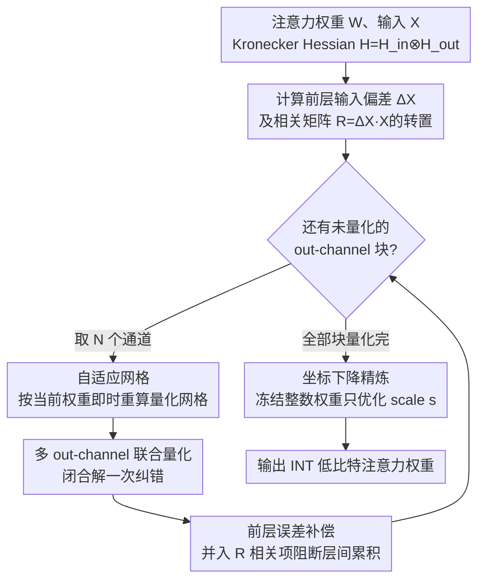

# TurboBoA: Faster and Exact Attention-aware Quantization without Backpropagation

**会议**: ICLR 2026  
**arXiv**: [2602.04929](https://arxiv.org/abs/2602.04929)  
**代码**: [GitHub](https://github.com/SamsungLabs/TurboBoA)  
**领域**: 模型压缩 / 量化 / LLM  
**关键词**: post-training quantization, attention-aware, backpropagation-free, low-bit quantization, LLM compression

## 一句话总结

TurboBoA 提出了一种无需反向传播的 LLM 后训练量化方法，通过多 out-channel 联合量化、前层误差补偿和自适应网格选择三大创新，在保留 BoA 精度优势的同时实现了 3 倍以上加速。

## 研究背景与动机

LLM 规模的快速增长使得后训练量化（PTQ）成为降低内存和计算成本的关键技术。基于 Hessian 引导误差补偿的无反向传播方法（如 GPTQ）因其高效性广受关注。

然而存在两类方法之间的权衡：
- **GPTQ**：假设层间独立，在低比特（如 INT2）下精度严重下降
- **BoA**：利用注意力模块内的跨层依赖改进 Hessian 近似，大幅提升精度，但需要逐 out-channel 顺序量化，效率远低于 GPTQ

核心问题：**能否在保持 BoA 精度的同时大幅提升效率？**

## 方法详解

### 整体框架

TurboBoA 沿用 BoA 基于注意力重建误差、Kronecker 结构 Hessian $\mathbf{H}=\mathbf{H}_{in}\otimes\mathbf{H}_{out}$ 的无反向传播量化框架，但把 BoA 逐 out-channel 的串行流程改造成可并行、可纠错的版本。整条流水线按 out-channel **分块**迭代：每次取一块 $N$ 个 out-channel，先用自适应网格按当前权重重算量化网格，再对这 $N$ 个通道一次性联合量化并用闭合解纠错（其中已显式纳入前层量化带来的输入偏差）；所有块量化完成后，再冻结整数权重做一轮坐标下降精炼。靠这套"联合量化打破顺序瓶颈 + 前层误差补偿 + 网格/scale 重对齐"的组合，TurboBoA 在 BoA 的精度水准上拿到 3 倍以上的加速。

### 关键设计

**1. 多 out-channel 联合量化：打破逐通道串行的效率瓶颈**

BoA 之所以慢，是因为它一次只量化一个 out-channel，再用剩余 out-channel 做误差补偿，128 个通道就意味着 128 次顺序操作。TurboBoA 把这个粒度放大到一次同时量化 $N$ 个 out-channel，把误差补偿写成一个带约束的最小化问题 $\min_{\Delta\mathbf{W}}\|\mathbf{G}\Delta\mathbf{W}\mathbf{X}\|_F^2$，约束为已量化的 $N$ 个通道满足 $\mathbf{e}_i^T\Delta\mathbf{W}=\mathbf{Q}_{i,:}-\mathbf{W}_{i,:}\;(0\le i<N)$。论文的 Proposition 3.1 给出它的闭合形式解 $[\Delta\mathbf{W}]_{N:,:}=-[\mathbf{U}_{out}^T]_{N:,B}[\mathbf{U}_{out}^T]_{B,B}^{-1}(\mathbf{W}_{B,:}-\mathbf{Q}_{B,:})$，其中 $B=\{0,\dots,N-1\}$、$\mathbf{U}_{out}=\text{Chol}(\mathbf{H}_{out}^{-1})^T$。因为有解析解，联合量化不引入额外迭代；当 $N=16$ 时顺序操作从 128 次降到 8 次，相比 BoA 加速 3 倍以上，而剩余 out-channel 仍足够承担补偿任务，精度几乎无损。

**2. 前层量化误差补偿：阻断误差在层间累积**

BoA 假设每一层拿到的输入是干净的，但实际推理时前面的层已被量化，输入本身带着偏差 $\Delta\mathbf{X}=\mathbf{X}-\tilde{\mathbf{X}}$，这部分误差会一路传到后面放大。TurboBoA 把这项偏差直接写进重建目标：$\mathbf{G}\mathbf{Q}\mathbf{X}-\mathbf{G}\mathbf{W}\tilde{\mathbf{X}}=\mathbf{G}\Delta\mathbf{W}\mathbf{X}+\mathbf{G}\mathbf{W}\Delta\mathbf{X}$，右端第二项即前层误差的贡献。相应地 Proposition 3.2 把补偿解推广为 $[\Delta\mathbf{W}]_{N:,:}=-[\mathbf{U}_{out}^T]_{N:,B}[\mathbf{U}_{out}^T]_{B,B}^{-1}\big((\mathbf{W}_{B,:}-\mathbf{Q}_{B,:})-\mathbf{W}_{B,:}\mathbf{R}\mathbf{H}_{in}^{-1}\big)$，其中 $\mathbf{R}=\Delta\mathbf{X}\mathbf{X}^T$ 编码了输入偏差与原输入的相关性。与同样考虑前层误差的 GPTAQ 只做向量级优化不同，这里直接处理一般的稠密 $\mathbf{H}_{out}$，因此能和注意力模块的跨层依赖兼容。

**3. 自适应网格 + 坐标下降精炼：让量化网格始终对齐更新后的权重**

联合量化和误差补偿都会改动权重，如果量化网格仍按旧权重确定，就会出现错位。TurboBoA 在每次量化前即时重新计算网格（自适应网格），保证网格范围与当前权重匹配；量化完成后再冻结整数权重 $\mathbf{W}_{int}$、只优化 scale 向量 $\mathbf{s}$ 做坐标下降精炼，目标是 $\min_{\mathbf{s}}\|\mathbf{G}(\text{diag}(\mathbf{s})\mathbf{W}_{int}-\mathbf{W})\mathbf{X}+\mathbf{G}\mathbf{W}\Delta\mathbf{X}\|_F^2$，同样含前层误差项。Proposition 3.3 给出逐分量的闭合更新 $s_j^*=s_j+\frac{[\mathbf{W}_{int}(\mathbf{H}_{in}(\mathbf{W}-\mathbf{Q})^T-\mathbf{R}^T\mathbf{W}^T)\mathbf{H}_{out}]_{j,j}}{[\mathbf{W}_{int}\mathbf{H}_{in}\mathbf{W}_{int}^T]_{j,j}[\mathbf{H}_{out}]_{j,j}}$，每一步都只用 Hessian 的对角元素，开销极小却能把联合量化带来的网格漂移收回来，保住低比特下的精度。

## 实验

### 主实验：INT2 量化加速

| 方法 | N | Llama3-8B 时间 | Wiki2 PPL |
|------|---|-------------|-----------|
| BoA | 1 | 94.75 min | 15.20 |
| TurboBoA | 4 | 39.46 min | 15.27 |
| TurboBoA | 8 | 30.55 min | 15.30 |
| TurboBoA | **16** | **25.30 min** | **15.41** |
| TurboBoA | 32 | 22.95 min | 15.22 |

70B 模型：BoA 需 17 小时，TurboBoA (N=16) 仅需 5.6 小时，节省约 11 小时。

### 消融实验：三大特征

| 方法 | F2 | F3 | Llama3-8B Wiki2↓ | C4↓ |
|------|----|----|-----------------|-----|
| BoA | - | - | 15.20 | 36.95 |
| TurboBoA (F1 only) | ✗ | ✗ | 15.41 | — |
| TurboBoA (F1+F2) | ✓ | ✗ | 改善 | — |
| TurboBoA (全部) | ✓ | ✓ | 最佳 | 最佳 |

### SOTA 结果

结合 QuaRot 等异常值抑制技术后：
- **Weight-only 量化**：在 INT2 下全面超越 GPTQ、BoA 等方法
- **Weight-activation 量化**：同样达到 SOTA

### 关键发现

1. $N$ 增大到 64 精度退化仍可忽略，说明剩余 out-channel 提供了充足的误差补偿能力
2. 加速效果在 $N > 16$ 后收益递减，$N=16$ 是最优平衡点
3. 前层误差补偿和网格精炼各自贡献独立且互补

## 亮点

- 三个 Proposition 均提供了闭合形式解，理论优雅
- 3 倍以上加速的同时精度持平甚至提升
- 方法不依赖特定的 Hessian 形式，可直接适配更先进的 Hessian
- 70B 模型节省超 11 小时量化时间，实用价值显著

## 局限性

- 仅在 Llama 系列模型上验证，未测试其他架构（如 Mixtral、Qwen）
- $N$ 的选择虽然鲁棒，但缺乏理论上的误差界分析
- 稳定化系数 $\alpha$ 需要手动调参（从 {0.05, 0.125, 0.25} 中选择）
- 仅聚焦于注意力层的量化，FFN 层使用标准 GPTQ

## 相关工作

- **无反向传播量化**：GPTQ (Frantar et al., 2023)、BoA (Kim et al., 2025)、GPTAQ (Li et al., 2025)
- **变换方法**：SmoothQuant (Xiao et al., 2023)、QuaRot (Ashkboos et al., 2024)
- **早期 PTQ**：AdaRound (Nagel et al., 2020)、BRECQ (Li et al., 2021)

## 评分

- 新颖性：⭐⭐⭐⭐ — 联合量化的闭合形式解是核心创新
- 理论深度：⭐⭐⭐⭐⭐ — 三个 Proposition 完整严谨
- 实验充分性：⭐⭐⭐⭐ — 多规模模型，完善的消融
- 实用价值：⭐⭐⭐⭐⭐ — 直接解决 BoA 的效率瓶颈
- 写作质量：⭐⭐⭐⭐ — 符号体系清晰，数学推导详实

<!-- RELATED:START -->

## 相关论文

- [\[ICML 2025\] BoA: Attention-aware Post-training Quantization without Backpropagation](../../ICML2025/model_compression/boa_attention-aware_post-training_quantization_without_backpropagation.md)
- [\[ICLR 2026\] CARE: Covariance-Aware and Rank-Enhanced Decomposition for Enabling Multi-Head Latent Attention](care_covariance-aware_and_rank-enhanced_decomposition_for_enabling_multi-head_la.md)
- [\[ICLR 2026\] AgilePruner: An Empirical Study of Attention and Diversity for Adaptive Visual Token Pruning in LVLMs](agilepruner_an_empirical_study_of_attention_and_diversity_for_adaptive_visual_to.md)
- [\[ICLR 2026\] FASA: Frequency-Aware Sparse Attention](fasa_frequency-aware_sparse_attention.md)
- [\[CVPR 2026\] BinaryAttention: One-Bit QK-Attention for Vision and Diffusion Transformers](../../CVPR2026/model_compression/binaryattention_one-bit_qk-attention_for_vision_and_diffusion_transformers.md)

<!-- RELATED:END -->
