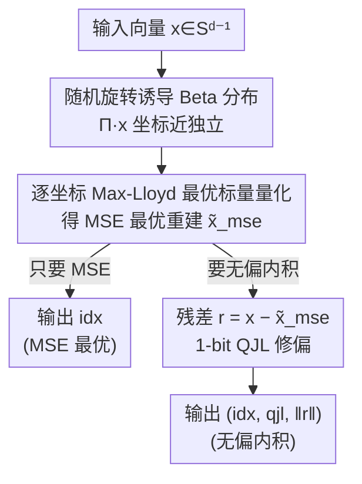

# TurboQuant: Online Vector Quantization with Near-Optimal Distortion Rate

**会议**: ICLR 2026  
**OpenReview**: [https://openreview.net/forum?id=tO3ASKZlok](https://openreview.net/forum?id=tO3ASKZlok)  
**代码**: 无  
**领域**: 模型压缩  
**关键词**: 向量量化, KV Cache 压缩, 近似最近邻, 无偏内积估计, 失真-码率界

## 一句话总结
TurboQuant 是一个 data-oblivious（无需数据校准、可在线即时使用）的向量量化算法：先随机旋转把任意输入向量的坐标"洗"成近独立的 Beta 分布，再对每个坐标套用预先解出的 Max-Lloyd 最优标量量化器，从而在所有码率/维度下都把 MSE 失真压到信息论下界的常数倍（≈2.7）以内；针对内积估计的偏差，再叠一层 1-bit QJL 处理残差得到无偏估计，在 KV cache 压缩与 ANN 检索上都超过现有 product quantization。

## 研究背景与动机

**领域现状**：向量量化（VQ）是把高维浮点向量压成低比特整数、同时尽量保住几何结构（MSE、内积）的核心工具，广泛用于 LLM 权重/激活压缩、KV cache 压缩、以及向量数据库的近似最近邻（ANN）检索。它的理论根基可追溯到 Shannon 的 source coding——最优失真由失真-码率函数刻画。

**现有痛点**：现有 VQ 方法陷入一个两难。一类是**离线/数据相关**方法（如基于 Hessian 二阶信息的 GPTQ、AWQ、product quantization 的 k-means 码本），需要重型预处理与校准，无法应对 KV cache 这种"边生成边量化"的动态数据；另一类**在线/data-oblivious** 方法虽然能即时使用，但失真保证随比特宽度的衰减很松，达不到接近最优的失真-码率。

**核心矛盾**：可在线、加速器友好（向量化）与拥有逼近信息论下界的失真保证，这两者长期不可兼得。同时还有一个被忽略的细节——**为 MSE 最优而设计的量化器，对内积估计是有偏的**（1-bit 情形会引入 $2/\pi$ 的乘性偏差），而 ANN 检索恰恰需要无偏内积。

**本文目标**：设计一个 data-oblivious、加速器友好的量化器 $Q:\mathbb{R}^d\to\{0,1\}^{b\cdot d}$，对任意 worst-case 向量（不做任何分布假设）同时在 MSE 和内积两个失真度量上都逼近最优，且内积估计无偏。

**切入角度**：作者抓住一个关键几何事实——把单位球面上的向量做**随机旋转**后，每个坐标都服从同一个 Beta 分布（高维下趋于正态），且不同坐标在高维下**近乎独立**。一旦坐标独立，d 维量化就退化成 d 个一维标量量化问题，可以离线一次性解出最优码本。

**核心 idea**：用"随机旋转 + 逐坐标最优标量量化"得到 MSE 最优量化器，再用"1-bit QJL 修残差"把它升级成无偏内积量化器——两阶段拼出一个全比特宽下都近最优的在线 VQ。

## 方法详解

### 整体框架
TurboQuant 是一个两阶段流水线，把"d 维向量量化"这个难题分解成"d 个一维标量量化 + 一次残差修正"。给定单位球面上的向量 $x\in S^{d-1}$（范数单独用浮点存）：第一阶段做随机旋转后逐坐标量化，得到 MSE 最优的重建；第二阶段对第一阶段的残差再叠一层 1-bit QJL，把内积估计从有偏修成无偏。两阶段共享同一个总比特预算 $b$——MSE 量化器用 $b-1$ 比特，残差 QJL 用 1 比特。

### 关键设计

**1. 随机旋转诱导 Beta 分布、把坐标"洗"成近独立**

worst-case 输入向量的坐标可能高度相关、分布任意，直接逐坐标量化无法给保证。TurboQuant 在量化前先用一个随机旋转矩阵 $\Pi\in\mathbb{R}^{d\times d}$（对 i.i.d. 正态随机矩阵做 QR 分解得到正交阵）把 $x$ 旋成 $\Pi\cdot x$。关键事实（Lemma 1）：旋转后向量在单位球面上**均匀分布**，于是每个坐标都服从同一个与输入无关的 Beta 密度

$$f_X(x)=\frac{\Gamma(d/2)}{\sqrt{\pi}\,\Gamma((d-1)/2)}\left(1-x^2\right)^{(d-3)/2},\quad x\in[-1,1],$$

高维下由中心极限定理趋于正态。更重要的是，旋转后任意两个不同坐标在高维下**近乎独立**（比"不相关"更强的结论）。这一步是整套方法成立的地基：它把一个需要考虑坐标间耦合的 d 维联合量化问题，化归成 d 个互不干扰、分布已知且相同的一维标量量化问题——既给了 worst-case 保证（对任意输入都成立），又让量化高度向量化、加速器友好。

**2. 逐坐标 Max-Lloyd 最优标量量化、把 MSE 压到下界常数倍**

坐标独立后，剩下的就是为一个已知分布 $f_X$ 设计最优标量量化器。作者把它写成一维的连续 k-means（把 $[-1,1]$ 切成 $2^b$ 个 bucket）：

$$C(f_X,b):=\min_{-1\le c_1\le\cdots\le c_{2^b}\le 1}\sum_{i=1}^{2^b}\int_{\frac{c_{i-1}+c_i}{2}}^{\frac{c_i+c_{i+1}}{2}}|x-c_i|^2\,f_X(x)\,dx,$$

最优解满足 Voronoi 划分（bucket 边界是相邻质心的中点），用 Max-Lloyd 迭代数值求解到任意精度。由于 $f_X$ 只依赖维度 $d$ 和比特宽度 $b$、与具体数据无关，作者**离线一次性解出**一批常用 $(d,b)$ 的码本并存起来，在线时直接查表，因此量化本身几乎零开销。量化时 $\text{idx}_j=\arg\min_k|(\Pi x)_j-c_k|$，反量化时取回质心再乘 $\Pi^\top$ 旋回去。Theorem 1 证明 MSE 失真满足 $D_{\mathrm{mse}}\le\frac{\sqrt{3}\pi}{2}\cdot\frac{1}{4^b}$，且小比特宽下更精细：$b=1,2,3,4$ 时 $D_{\mathrm{mse}}\approx 0.36,\,0.117,\,0.03,\,0.009$。这个 $1/4^b$ 的指数衰减相对现有在线方法是指数级的改进。

**3. 两阶段残差 QJL、把有偏内积修成无偏**

MSE 最优量化器对内积是有偏的：以 $b=1$ 为例，最优码本退化成 $\pm\sqrt{2/(\pi d)}$，量化映射变成 $\mathrm{sign}(\Pi x)$，导致 $\mathbb{E}\langle y,Q^{-1}_{\mathrm{mse}}(Q_{\mathrm{mse}}(x))\rangle=\frac{2}{\pi}\langle y,x\rangle$——多出一个 $2/\pi$ 的乘性偏差。ANN 检索要求无偏，所以不能直接用 MSE 量化器。TurboQuant 的解法是两阶段：先用比特宽 $b-1$ 的 $Q_{\mathrm{mse}}$ 量化，得到残差 $r=x-Q^{-1}_{\mathrm{mse}}(Q_{\mathrm{mse}}(x))$（其期望范数恰是 $\sqrt{C(f_X,b-1)}$，很小）；再对残差套用 1-bit 的 Quantized JL 变换 $\mathrm{qjl}=\mathrm{sign}(S\cdot r)$（$S$ 为 i.i.d. 正态投影），最终内积估计为

$$\langle y,Q^{-1}_{\mathrm{mse}}(Q_{\mathrm{mse}}(x))\rangle+\|r\|_2\cdot\langle y,Q^{-1}_{\mathrm{qjl}}(Q_{\mathrm{qjl}}(r))\rangle.$$

QJL 的随机符号化天然给出无偏估计，把第一阶段残留的偏差抵消掉。Theorem 2 证明该估计**无偏** $\mathbb{E}\langle y,\tilde x\rangle=\langle y,x\rangle$，且内积失真 $D_{\mathrm{prod}}\le\frac{\sqrt{3}\pi^2\|y\|_2^2}{d}\cdot\frac{1}{4^b}$，小比特宽下 $b=1,2,3,4$ 对应 $\approx\frac{1.57}{d},\frac{0.56}{d},\frac{0.18}{d},\frac{0.047}{d}$。整套只多花 1 比特就把有偏 MSE 量化器升级成无偏内积量化器。

**4. 信息论下界证明、确立"近最优"的硬性参照**

为了说明 TurboQuant 不是"看起来好"而是"真的接近极限"，作者用 Shannon 下界配合 Yao 的极小极大原理（minimax principle）证明：对**任何**随机量化算法 $Q:\mathbb{R}^d\to\{0,1\}^{b\cdot d}$，都存在 hard 输入实例使得 $D_{\mathrm{mse}}(Q)\ge\frac{1}{4^b}$、$D_{\mathrm{prod}}(Q)\ge\frac{\|y\|_2^2}{d}\cdot\frac{1}{4^b}$（Theorem 3）。对照 Theorem 1/2 的上界，TurboQuant 的 MSE 失真至多是下界的 $\frac{\sqrt{3}\pi}{2}\approx 2.7$ 倍，而且小比特宽下这个常数还会收紧——$b=1$ 时只差约 $1.45$ 倍。这个下界让"近最优"成为可证明的论断，而不是 benchmark 上的经验观察。

### 损失函数 / 训练策略
本方法**无需训练**：码本由离线求解连续 k-means（Max-Lloyd）一次性得到并缓存，旋转矩阵 $\Pi$ 与 QJL 投影 $S$ 都是随机生成的，运行时纯查表 + 矩阵乘。在 KV cache 实测中还用了**两档通道级混合精度**：离群通道分更多比特、其余通道更少（如 2.5-bit = 32 通道 3-bit + 96 通道 2-bit），以非整数平均比特宽进一步提升质量。

## 实验关键数据

### 主实验

**LongBench-V1 KV cache 压缩**（Llama-3.1-8B-Instruct，KV Size 越小压得越狠）：

| 方法 | KV Size | SingleQA | MultiQA | Summ. | Few-shot | Synthetic | Code | 平均 |
|------|---------|----------|---------|-------|----------|-----------|------|------|
| Full Cache | 16 | 45.29 | 45.16 | 26.55 | 68.38 | 59.54 | 46.28 | 50.06 |
| KIVI | 3 | 43.38 | 37.99 | 27.16 | 68.38 | 59.50 | 44.68 | 48.50 |
| PolarQuant | 3.9 | 45.18 | 44.48 | 26.23 | 68.25 | 60.07 | 45.24 | 49.78 |
| **TurboQuant** | **2.5** | 44.88 | 44.01 | 26.75 | 68.39 | 59.07 | 46.03 | 49.74 |
| **TurboQuant** | **3.5** | 45.01 | 45.31 | 26.00 | 68.63 | 59.95 | 46.17 | **50.06** |

TurboQuant 在 3.5-bit 下平均分（50.06）与全精度持平，2.5-bit 下也仅微降（49.74），且做到 >4.5× 压缩；而 KIVI 在 3-bit 下掉到 48.50。

**Needle-in-a-Haystack**（Llama-3.1-8B，0.25 内存压缩比，分数越高越好）：

| 方法 | 检索分数 |
|------|---------|
| SnapKV | 0.858 |
| PyramidKV | 0.895 |
| KIVI | 0.981 |
| PolarQuant | 0.995 |
| Full-Precision | 0.997 |
| **TurboQuant** | **0.997** |

即便 4× 量化，TurboQuant 的长上下文检索与全精度完全一致（0.997），token 级压缩（SnapKV/PyramidKV）与无理论保证的标量量化（KIVI）都明显落后。

### 消融实验

理论 vs 经验失真验证（DBpedia OpenAI3 embedding，$d=1536$）作为方法的核心"消融"：

| 配置 | 现象 | 说明 |
|------|------|------|
| TurboQuant_mse | 内积估计有偏，偏差随 $b$ 增大而消失 | 验证 MSE 最优器对内积的固有偏差 |
| TurboQuant_prod | 全比特宽下内积估计无偏 | 验证两阶段残差 QJL 的修偏作用 |
| 实测 MSE / 内积误差 | 落在理论上下界之间，逼近下界 | $b=1$ 时仅差最优约 1.45× |
| 低比特 vs 高比特 | 低比特 prod 更优；高比特 mse 反超 | 偏差消失后 mse 方差更小 |

### 关键发现
- **无偏 vs 有偏的转折点随比特宽变化**：低比特宽时 TurboQuant_prod（无偏）更好；比特宽升高后 TurboQuant_mse 的偏差自然衰减、方差更小，反而在内积估计上超过 prod。说明"修偏"主要在低比特宽场景增益最大。
- **失真曲线贴着下界走**：实测 MSE 与内积误差都落在理论上下界之间且贴近下界，把"近最优"从证明落到了经验。
- **加速器友好带来的吞吐优势**：在 KV cache 的 $QK^\top$ 计算上，相对 PyTorch einsum 基线，序列越长加速越明显（1/2/4-bit 在百万级序列长度下可达约一位数倍率加速）。
- **ANN 检索几乎零索引时间**：在 GloVe（d=200）与 OpenAI3（d=1536/3072）上，TurboQuant 在几乎所有设置下 recall@k 高于 Product Quantization 与 RabitQ，且索引时间近乎为零（无需 k-means 训练码本）；唯一例外是个别 GloVe 2-bit 设置 RabitQ 略高。

## 亮点与洞察
- **把高维 VQ 化归成一维标量量化**：核心 trick 是"随机旋转 → 坐标近独立"，一旦独立，d 维联合量化坍缩成 d 个相同的一维问题，可离线解一次永久复用——这是它既 data-oblivious 又近最优的根本原因。
- **"1 比特修偏"的巧思**：用 $b-1$ 比特做 MSE 最优、留 1 比特给 QJL 修残差，几乎不增加预算就把有偏估计变无偏。这种"主量化 + 残差修正"的分层思路可迁移到任何需要无偏内积/距离的压缩场景。
- **上界配下界才叫近最优**：很多压缩论文只报 benchmark，本文用 Shannon + Yao minimax 把信息论下界也证出来，2.7× 这个常数因此是有硬参照的，可信度高。
- **离线码本缓存**：码本只依赖 $(d,b)$ 与已知分布，可预先算好查表，把在线开销压到接近零——工程上很实用。

## 局限与展望
- **单位范数假设**：方法默认 $\|x\|_2=1$，实际要单独用浮点存范数再 rescale；对范数分布极端的数据，额外的范数存储与误差未深入讨论。
- **近独立是渐近性质**：坐标近独立、Beta 趋正态都依赖高维 $d$；在低维（如 GloVe d=200 的 2-bit）场景优势会被削弱，实验里也确实在该设置被 RabitQ 反超。
- **随机旋转的代价**：稠密随机旋转矩阵 $\Pi$ 的 $O(d^2)$ 乘法在超高维下不便宜，论文未讨论用结构化/快速旋转（如 Hadamard）替代后保证是否仍成立。
- **未覆盖权重量化端到端**：实验集中在 KV cache 与 ANN，对 LLM 权重/激活的端到端精度影响、与 GPTQ/AWQ 类离线方法的直接对比相对较少。

## 相关工作与启发
- **vs Product Quantization（PQ）**：PQ 用 k-means 学数据相关码本、随比特宽存储指数增长且需训练；TurboQuant 是 data-oblivious、码本离线固定、索引时间近零，且在多数设置 recall 更高。
- **vs RabitQ**：RabitQ 缺向量化实现、CPU 慢、实际比特用量高于名义值；TurboQuant 加速器友好、比特账目干净，仅个别低维低比特设置略逊。
- **vs KIVI / 标量量化（无保证）**：KIVI 等无形式化失真保证，长上下文检索掉点明显；TurboQuant 有 $1/4^b$ 失真界，4× 压缩下检索与全精度持平。
- **vs PolarQuant**：同为带理论保证的 KV 量化方法、Needle 任务都强（0.995 vs 0.997）；TurboQuant 在更低比特（2.5/3.5-bit）下平均分更优，且对生成 token 也持续量化而非跳过。
- **vs QJL（Zandieh et al. 2024a）**：本文复用 QJL 作残差修偏组件，但把它从单独的 1-bit JL 量化器扩展进"MSE 最优 + 残差 QJL"的两阶段框架，得到无偏且失真近最优的完整方案。

## 评分
- 新颖性: ⭐⭐⭐⭐⭐ 随机旋转化归 + 两阶段残差 QJL + 信息论下界，理论与算法都新。
- 实验充分度: ⭐⭐⭐⭐ KV cache 与 ANN 双线验证、理论曲线对照充分；权重量化端到端对比偏少。
- 写作质量: ⭐⭐⭐⭐⭐ 上界/下界/算法/实验环环相扣，定理与直觉都讲清。
- 价值: ⭐⭐⭐⭐⭐ data-oblivious + 近最优 + 加速器友好，KV cache 与向量库都能直接落地。

<!-- RELATED:START -->

## 相关论文

- [\[ICML 2026\] WUSH: Near-Optimal Adaptive Transforms for LLM Quantization](../../ICML2026/model_compression/wush_near-optimal_adaptive_transforms_for_llm_quantization.md)
- [\[AAAI 2026\] Reinforced Rate Control for Neural Video Compression via Inter-Frame Rate-Distortion Awareness](../../AAAI2026/model_compression/reinforced_rate_control_for_neural_video_compression_via_inter-frame_rate-distor.md)
- [\[ICLR 2026\] Compute-Optimal Quantization-Aware Training](compute-optimal_quantization-aware_training.md)
- [\[ICML 2026\] NeUQI: Near-Optimal Uniform Quantization Parameter Initialization for Low-Bit LLMs](../../ICML2026/model_compression/neuqi_near-optimal_uniform_quantization_parameter_initialization_for_low-bit_llm.md)
- [\[ICLR 2026\] KBVQ-MoE: KLT-guided SVD with Bias-Corrected Vector Quantization for MoE Large Language Models](kbvq-moe_klt-guided_svd_with_bias-corrected_vector_quantization_for_moe_large_la.md)

<!-- RELATED:END -->
