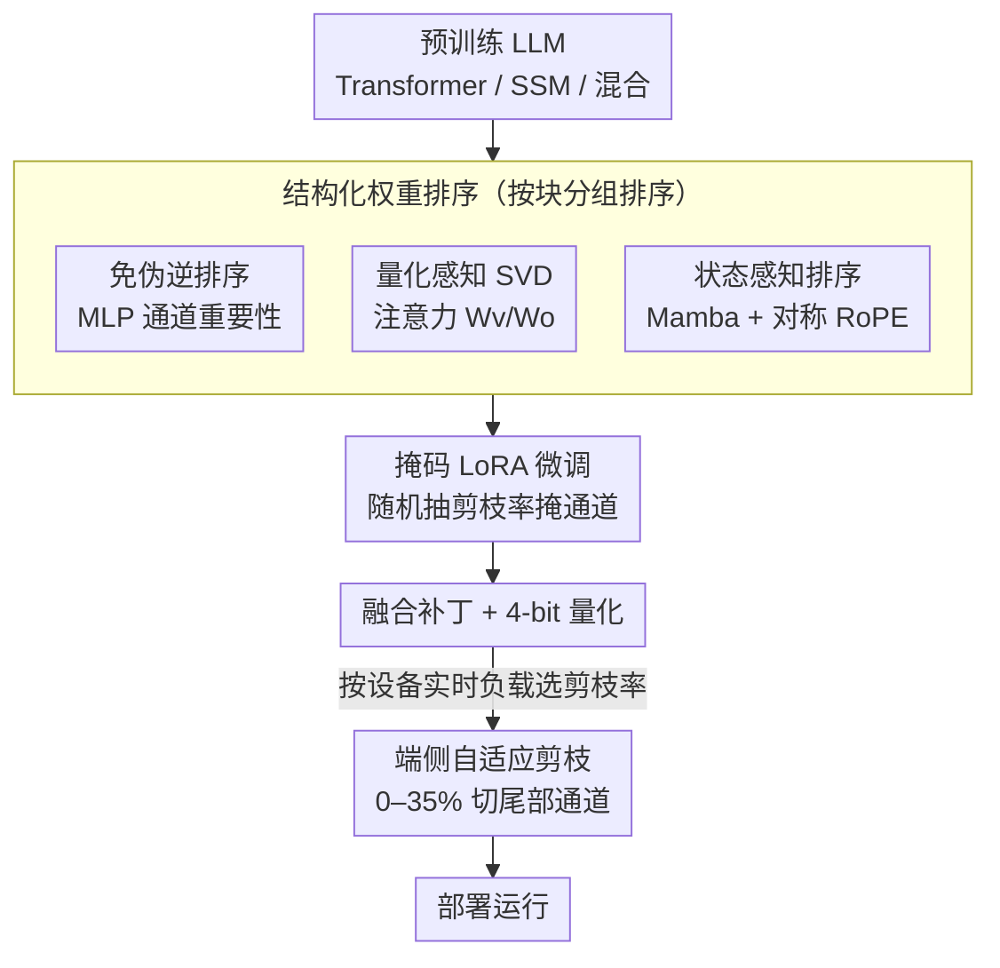

# UniQL: Unified Quantization and Low-Rank Compression for Adaptive Edge LLMs

**会议**: ICLR 2026  
**OpenReview**: [https://openreview.net/forum?id=iOGu4wtDTF](https://openreview.net/forum?id=iOGu4wtDTF)  
**代码**: https://github.com/enyac-group/UniQL (待开源)  
**领域**: 模型压缩  
**关键词**: 后训练量化, 结构化剪枝, 低秩分解, 端侧 LLM, 状态空间模型  

## 一句话总结
UniQL 把后训练量化和结构化低秩剪枝统一到一条"云端跑一次、端侧按需裁"的流水线里，通过免伪逆的权重排序、量化感知 SVD 和状态感知排序，让 Transformer、SSM、混合模型都能在一次压缩后按设备实时负载在端上配置 0–35% 的剪枝率，做到 4×–5.7× 显存压缩和 2.7×–3.4× 吞吐提升，精度仍贴近原模型。

## 研究背景与动机

**领域现状**：把十亿参数级 LLM 塞进 VR/AR 眼镜、手机这类边缘设备，主流靠两条路——低比特量化（AWQ、GPTQ）降存储，结构化剪枝（SliceGPT、MoDeGPT）减参数。两者通常各做各的，最后产出一个固定大小的压缩模型。

**现有痛点**：边缘设备的内存是操作系统动态调度的共享资源，可用量随系统负载实时波动。一个固定大小的预压缩模型，在高负载时可能根本装不下；想临时再压一遍又不现实——重新量化/剪枝要在云端 GPU 上跑几个小时。退而求其次的办法是预存多个不同压缩率的副本，但既费时间又占存储；用弹性训练（Flextron、LLaMaFlex）让一个模型派生多种尺寸，则需要 GPU 资源和精挑的训练数据，而且每次只服务一种特定模型（比如只为 Llama-3.1-8B 定制），通用性差。

**核心矛盾**：设备端需要的是"运行时可调的弹性尺寸"，但现有压缩范式产出的是"训练/压缩时就钉死的固定尺寸"——弹性需求和固定产物之间存在根本错位，而把弹性能力做进来的方法又都依赖昂贵的训练或重压缩。

**本文目标**：在后训练设定下（云端 GPU 和精标数据都有限），设计一条统一框架，让量化和结构化剪枝在一张服务器 GPU 上一次性完成，同时覆盖 Transformer、SSM 和混合三类架构，并让最终模型支持端侧自由配置剪枝率。

**切入角度**：作者观察到，只要把每层权重按"重要性"排好序、把最不重要的通道排到末尾，端侧就能像切尾巴一样直接裁掉若干列来实现任意剪枝率，而无需重新计算。难点在于：排序算法必须便宜（不能依赖伪逆）、必须对低比特量化友好、还要能照顾 SSM 这类对状态矩阵特别敏感的结构。

**核心 idea**：用一套"结构化权重排序 + 量化感知分解 + 掩码微调"的一次性云端流水线，把弹性剪枝能力烤进权重排列里，把"选多大"这个决定推迟到端侧运行时。

## 方法详解

### 整体框架

UniQL 的全部重活都在云端一次完成，端侧只剩"按当前负载选一个剪枝率、裁掉尾部通道"这一个轻量动作。云端流水线分四步：先对一个块内的权重分组，从校准集采集通道相关性，用排序算法把通道按重要性重排（MLP 用免伪逆排序、注意力的 Wv/Wo 用量化感知 SVD、Mamba 用状态感知排序）；再对排好序但**未剪枝**的整模型做一次掩码 LoRA 微调，每步随机抽一个全局剪枝率把尾部通道掩掉，让模型在各种剪枝率下都鲁棒；接着把微调补丁融回权重并做 4-bit 量化；最后把量化模型部署到端上，根据系统利用率实时裁通道。整条管线对压缩率数量是 $O(1)$ 复杂度——排序一次就服务所有剪枝率，而 MoDeGPT、SVD-LLM 这类方法是 $O(n)$（每个目标尺寸都要重跑一遍）。

### 关键设计

**1. 免伪逆的结构化权重排序：让一次排序服务所有剪枝率**

要支持端侧按需剪枝，必须先给通道排个序，把不重要的排到尾部。最直接的做法（如 MoDeGPT）用 Moore-Penrose 伪逆来求排序，能给出剪枝误差的理论界，但有三个硬伤：伪逆对 $n$ 阶方阵是 $O(n^3)$ 复杂度，而 MLP 的中间维 $D_{int}$ 往往很大（Llama-3-8B 的 $D_{int}=14336$，单次伪逆要 20 分钟）；伪逆需要 FP64 才能数值稳定，吃满显存；更关键的是矩阵求逆破坏了剪枝等价性 $(W')^\dagger \neq (W^\dagger)'$，换一个剪枝率就得重算一遍。

UniQL 对 MLP 改用纯相关性驱动的免伪逆排序：从校准集采中间激活 $X_{int}=\sigma(XW_g)\odot XW_u$，算通道相关矩阵 $C=X_{int}^\top X_{int}$，再用 ridge leverage score $\mathrm{diag}\big(C(C+\lambda I)^{-1}\big)$（取 $\lambda=1$）作为每个通道的重要性分，据此构造列排序矩阵 $S_m$ 重排 $W_u$、$W_g$ 的输出列和 $W_d$ 的输入行。这一步不碰伪逆、不算梯度，矩阵分解比 MoDeGPT 快 22×（0h19m vs 7h03m）、比 SVD-LLM 快 1.8×。因为排序只做一次、与目标剪枝率解耦，所以端侧切任意尾部长度都不用重算——这正是 $O(1)$ 弹性的来源。

**2. 量化感知 SVD 分解：把奇异值并进 U 而不是 V**

注意力里的 $W_v$、$W_o$ 用激活加权 SVD 联合分解：$C^{1/2}W_v W_o = U_v \Sigma_v V_v^\top W_o = U_v U \Sigma V^\top$。但低比特（INT4）量化对一个量化组内的数值分布极其敏感，而 SVD 的奇异值 $\Sigma$ 是长尾的——若像 SVD-LLM（$W=U\Sigma\cdot\Sigma V$）或 MoDeGPT（$W=U(\Sigma V)$）那样把 $\Sigma$ 丢给 $V$ 一侧，会把长尾分布带进那一侧的量化组里，量化误差爆炸。

UniQL 的做法是把对角阵 $\Sigma$ 合并进 $U$：$W=(U\Sigma)V$，于是 $U$ 的第 $i$ 列被对应奇异值 $\sigma_i$ 缩放。妙处在于，每个量化组本来就共享一个缩放因子，$\sigma_i$ 正好充当这个组的缩放因子，**不会扭曲组内分布**——长尾被缩放因子吸收，留给量化器的是分布平整、量化友好的矩阵。最终 $W_v=C^{-1/2}U_v U\Sigma$、$W_o=V^\top$。消融显示这个"简单观察"在 4-bit、25% 剪枝下给 Llama-3.1-8B 带来 7.5% 的精度提升（60.2%→67.7%）。

**3. 状态感知排序 + 对称 RoPE：照顾 SSM 与注意力的特殊结构**

SSM（Mamba）块对状态矩阵特别敏感，照搬注意力或 MLP 的排序会掉点严重。作者把 Mamba 块拆成两部分分别排序：算 SSM 输入掩码 $M$ 的 $\{W_B,W_C\}$ 这组，注意 $B$ 要被输入相关的 $\Delta$ 离散化（$(\Delta B)^g=\Delta^g\otimes B^g$），所以排序分要从离散化后的相关性 $\Delta C_B^g$ 和 $C_C^g$ 算；另一组 $\{W_z,W_x,W_o\}$ 则提出**状态感知**排序——直接从 SSM 状态 $H$ 采相关性 $C_H=H^\top H$，再用 ridge leverage score 排序，让排序真正反映状态空间里的通道重要性而非表层激活。

注意力侧还有个细节：$W_q$、$W_k$ 的结构化排序会打乱位置，导致 RoPE 的 sin/cos 索引错位。作者用对称排序 $s_{sym}=s_1+s_2$（把头维拆成 $[x_1,x_2]$ 两半，让两半共享排序），这样只需存/载一半索引向量，并把"按索引收集 RoPE 嵌入 + 旋转"融进一个定制 kernel，减少访存。融合 RoPE kernel 在 4-bit Llama-3.1-8B 上带来约 10%（1.1×）的延迟下降。

**4. 掩码 LoRA 微调 + 端侧自适应剪枝：一次微调，端侧按需裁**

排序后直接量化部署，精度还是会掉。UniQL 不像以往方法那样针对某个固定剪枝率微调，而是对**未剪枝的排序后整模型**做一次掩码 LoRA 微调：先用 Block Influence 分数算出每个预设全局剪枝率（$P_{15},P_{20},\dots$）下的逐层剪枝率 $r_l$，微调时每步随机抽一个剪枝率 $P_t\sim P$，把对应的尾部通道掩掉再前传。这样一次微调就让模型对一整族剪枝率都鲁棒，而不是只擅长某一个尺寸。微调用 Alpaca 指令数据跑 5 个 epoch，全程单卡云端完成。

部署阶段，补丁融回权重，做组内对称均匀量化（$N=4$、组大小 128，基于 GPTQ，并把 Hadamard 矩阵融入权重、嵌入层和输出层也量到 4-bit）。端侧则根据系统利用率，直接缩减 MLP 的 $D_{int}$、注意力的 $D_{hd}$、Mamba 的 $D_s$ 和 $D_{hd}$ 来剪通道；INT4 权重在线解包、裁通道后再重打包进 INT32 喂给 4-bit kernel。整个"选尺寸"的决定被推迟到运行时，按当前内存负载弹性选 0–35%。

### 损失函数 / 训练策略
微调采用 LoRA 恢复式指令微调，目标是常规语言建模损失；关键不在损失形式而在**随机剪枝率采样**：每个训练步从预设集合 $P$ 中抽 $P_t$ 掩通道，使单次微调覆盖整族剪枝率。排序用的相关矩阵和 GPTQ 的 Cholesky 分解用 FP32，其余计算用 BF16。

## 实验关键数据

### 主实验

一次压缩、端侧多剪枝率（4-bit + 微调，Table 4），与只支持单一压缩率的 SVD-LLM 对比：

| 剪枝率 | 模型尺寸缩减 | Llama-3.1-8B | Qwen-2.5-7B | Nemotron-H-8B | Mamba2-8B |
|--------|------|------|------|------|------|
| FP16 (0%) | 0× | 74.0% | 72.4% | 76.0% | 70.6% |
| UniQL 0% | 4× | 73.6% | 72.4% | 73.3% | 69.3% |
| UniQL 15% | 4.7× | 71.4% | 68.1% | 70.5% | 65.8% |
| UniQL 25% | 5.3× | 67.7% | 64.0% | 64.7% | 61.8% |
| UniQL 35% | 6.1× | 62.7% | 58.1% | 59.0% | 57.7% |

15% 剪枝下精度仍在原模型 5% 以内，且四类架构（Transformer / 混合 / SSM）全覆盖。对比结构化剪枝（Table 2，FP16+FT，25% 剪枝），UniQL 在 Llama-3.1-8B 上 69.6% 对 SVD-LLM 的 59.5%、Qwen-2.5-7B 上把 MoDeGPT 数值不稳导致的 40.8% 大幅拉回。

压缩时间（Table 5，A6000）：

| 方法 | 仅分解 | +微调 | 压缩率复杂度 |
|------|--------|-------|------|
| MoDeGPT | 7h03m | 7h03m | $O(n)$ |
| SVD-LLM | 0h35m | 16h25m | $O(n)$ |
| UniQL | 0h19m | 6h59m | $O(1)$ |

### 消融实验

各组件对精度的贡献（Table 10，4-bit、25% 剪枝）：

| 配置 | Llama-3.1-8B | Qwen-2.5-7B | 说明 |
|------|------|------|------|
| +FT +PTQ（无 QSVD） | 60.2% | 61.0% | 缺量化感知 SVD |
| +FT +PTQ +QSVD（完整） | 67.7% | 64.0% | 完整模型 |
| FP16 25% 无 FT | 67.0% | 62.1% | 不做掩码微调 |
| FP16 25% +FT | 69.6% | 65.8% | 加掩码微调 |

### 关键发现
- **量化感知 SVD 贡献最大**：在 4-bit 25% 剪枝下，加上 QSVD 让 Llama-3.1-8B 涨 7.5%（60.2%→67.7%）、Qwen 涨 3%——把奇异值并进 U 这一步对低比特精度是决定性的。
- **掩码微调稳定有效**：FP16 25% 剪枝下给 Llama-3.1-8B 涨 2.6%、Qwen 涨 3.7%；4-bit 下也有 2.7%/3.3% 增益。
- **端侧实测加速明显**：Nano 8G 上 Qwen-2.5-7B 的 TPOT 75.8ms，比 TAO-HQQ 的 129.8ms 快 1.7×；再剪 35% 后 55.5ms，达 2.1×。模型大小 Llama-3.1-8B 从 FP16 的 16GB 压到 4.1GB（4-bit）、再到 35% 剪枝的 2.8GB，比同为 4-bit 但嵌入/输出层用 FP16 的 TRT-AWQ（5.8GB）、TAO-HQQ（5.7GB）更小，因为 UniQL 嵌入和输出层也量到 4-bit。

## 亮点与洞察
- **把"选尺寸"从压缩时推迟到运行时**：核心洞察是排序一次、端侧切尾，于是一份模型就能弹性适配设备实时负载，绕开了"多副本"或"弹性训练"的高成本，这个"$O(1)$ 服务所有剪枝率"的设计很值得在其他自适应部署场景借鉴。
- **奇异值当量化缩放因子**：QSVD 把 $\Sigma$ 并进 $U$ 让长尾被组内缩放因子自然吸收——一个几乎零成本的代数重排就换来 7.5% 的低比特精度，是非常漂亮的"免费午餐"。
- **统一覆盖三类架构**：同一套排序+量化+融合框架同时吃下 Transformer、SSM、混合模型，尤其状态感知排序专门照顾 Mamba 的状态敏感性，体现了"按块定制、整体统一"的工程思路。

## 局限与展望
- 作者承认 UniQL 本身不缓解语言模型输出的社会风险，端侧广泛部署反而放大隐私和误导内容的滥用面，需要负责任的部署实践。
- 剪枝率上限 35%——再往上精度滑落明显（35% 时 Qwen 已掉到 58.1%），高压缩区间的可用性受限。
- 评测集中在 5 个零样本常识任务（HellaSwag/PIQA/ARC/WinoGrande），缺生成质量、长上下文、指令遵循等更全面的评估；端侧实测主要在 Orin Nano 8G，更受限的手机 NPU 上的表现仍待验证。
- 排序依赖校准集采的相关性，校准数据分布与真实部署分布的偏移可能影响重要性估计的准确度。

## 相关工作与启发
- **vs MoDeGPT**: 都做结构化低秩压缩，但 MoDeGPT 靠伪逆求排序，$O(n^3)$ 且需 FP64、换剪枝率要重算（$O(n)$）；UniQL 免伪逆、ridge leverage score 排序，快 22×且 $O(1)$ 弹性，并在 $D_{int}\gg D_h$ 的病态相关矩阵上更稳（Qwen 上避免了 MoDeGPT 的数值崩塌）。
- **vs SVD-LLM**: SVD-LLM 按目标压缩率截断奇异值、把 $\Sigma$ 留在 $V$ 侧且需对 U/V 分别微调（导致 16h+ 训练），每个尺寸单独跑；UniQL 把 $\Sigma$ 并进 $U$ 做量化感知分解、一次掩码微调覆盖全族剪枝率，更快也更适配低比特量化。
- **vs Flextron / LLaMaFlex（弹性训练）**: 它们靠剪枝+权重共享做"多合一"架构，但要 GPU 资源和精标数据、且每次只服务一种特定模型；UniQL 在后训练设定下单卡完成，天然支持 Transformer/SSM/混合多架构和端侧自适应。

## 评分
- 新颖性: ⭐⭐⭐⭐ 首个把后训练量化与结构化剪枝统一、并支持端侧可配剪枝率覆盖三类架构的框架，QSVD 与状态感知排序是实打实的新点。
- 实验充分度: ⭐⭐⭐⭐ 覆盖 6 个模型、4 种压缩率，含云/端真机延迟与逐组件消融；但任务面偏窄、缺生成与长上下文评测。
- 写作质量: ⭐⭐⭐⭐ 流水线和图示清晰，公式与符号体系完整，部分 SSM 推导较密集需对照原图。
- 价值: ⭐⭐⭐⭐⭐ 直击边缘设备动态内存这一真实痛点，一次压缩弹性部署的工程价值高，且代码与模型计划开源。

<!-- RELATED:START -->

## 相关论文

- [\[ICLR 2026\] GlowQ: Group-Shared Low-Rank Approximation for Quantized LLMs](glowq_group-shared_low-rank_approximation_for_quantized_llms.md)
- [\[ICLR 2026\] SERQ: Saliency-Aware Low-Rank Error Reconstruction for LLM Quantization](serq_saliency-aware_low-rank_error_reconstruction_for_llm_quantization.md)
- [\[ICLR 2026\] Towards Quantization-Aware Training for Ultra-Low-Bit Reasoning LLMs](towards_quantization-aware_training_for_ultra-low-bit_reasoning_llms.md)
- [\[ICLR 2026\] E²LoRA: Efficient and Effective Low-Rank Adaptation with Entropy-Guided Adaptive Sharing](e²lora_efficient_and_effective_low-rank_adaptation_with_entropy-guided_adaptive_.md)
- [\[ICLR 2026\] SliderQuant: Accurate Post-Training Quantization for LLMs](sliderquant_accurate_post-training_quantization_for_llms.md)

<!-- RELATED:END -->
