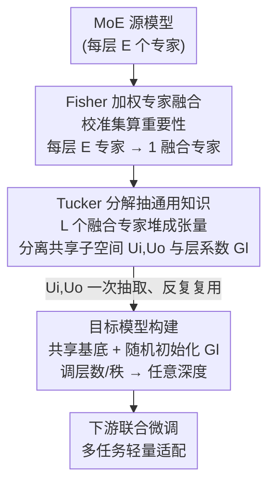

# UNITE: Universal Knowledge Integration from Task-Specific Experts

**会议**: ICLR 2026  
**OpenReview**: [https://openreview.net/forum?id=WnW0zndglL](https://openreview.net/forum?id=WnW0zndglL)  
**代码**: 无  
**领域**: 模型压缩  
**关键词**: 混合专家, 通用知识抽取, Tucker分解, Fisher信息, learngene

## 一句话总结
针对 MoE 大模型里专家知识"碎片化、跨层冗余"的问题，UNITE 先用 Fisher 信息把每层多个专家加权融合成一个专家，再用 Tucker 分解把跨层共享的低秩输入/输出子空间（作为"通用知识 / learngene"）从层特有系数中剥离出来，最后用这套共享子空间一次抽取、反复重组，搭建任意深度的轻量目标模型——在推理类任务上比随机初始化基线高出 +6% 以上，参数量却只有压缩基线的几分之一。

## 研究背景与动机

**领域现状**：现代大语言模型大量采用混合专家（Mixture-of-Experts, MoE）架构，每个 token 通过 top-1 或 top-2 路由只激活几十个专家中的一两个，单次前向只用到不到 5–10% 的参数。这种稀疏激活带来了巨大的算力与扩展性收益，让万亿参数模型在可承受的推理成本下成为可能。

**现有痛点**：稀疏激活的代价是，对任意一个输入而言，绝大多数专家的知识都"闲置"着，专家知识被高度碎片化地分散在不同层、不同专家里。更糟的是，冗余不只发生在层内——很多层实现的是彼此重叠、功能相似的变换（已有工作发现跨层参数共享如 ALBERT 几乎不损精度）。也就是说，MoE 模型里其实藏着大量可复用的结构，但被路由稀疏性和层间冗余给"埋"住了。

**核心矛盾**：以往研究（梯度敏感度、loss 变化追踪、Data Shapley 等）主要在"诊断"冗余或评估参数重要性，揭示出模型里确实存在重叠/可压缩结构，但它们停留在**识别**层面——给出的重要性要么高度分散在单个参数上、要么聚合到整层粒度，缺乏把这些发现**转化为可系统复用知识**的机制。换句话说，前人知道"有共享结构"，却没人把它真正抽出来反复用。

**本文目标**：作者把问题分解为两个子问题——(1) 如何把层内碎片化的专家知识**整合**成一个紧凑表示；(2) 如何在层间把**真正通用、可跨任务迁移**的部分从层特有的局部变化中**剥离**出来，并验证它确实可复用。

**切入角度**：作者借用人类学习的类比——人不是靠死记孤立事实学习，而是把各学科经验沉淀成可跨领域迁移的推理原则（学数学练出的逻辑演绎能力能迁移到物理、计算机）。由此提出假设：MoE 专家虽各自专精，但参数并非完全独立，可能包含重叠、冗余和反复出现的变换，隐式编码了可迁移模式。如果这种"通用知识"存在，它就能作为一个紧凑基底被一次抽取、反复复用，呼应 learngene（可遗传的结构知识单元）的思想。

**核心 idea**：用 **Fisher 加权融合（消层内碎片化）+ Tucker 分解（剥层间共享子空间）** 把 MoE 的碎片化专家参数变成一份紧凑可复用的"通用知识"（共享投影矩阵 $U_o, U_i$），再用它一次性、灵活地重构出不同深度的目标模型。

## 方法详解

### 整体框架

UNITE 要解决的是"MoE 里的通用知识到底存不存在、能不能抽出来反复用"这个问题。整条流水线分三步串行：**先在层内把碎片化专家融成一个、再在层间把共享子空间分解出来、最后用共享子空间重组目标模型**。输入是一个训练好的 MoE 源模型（如 Mixtral-8×7B），输出是一族可在不同算力预算下灵活实例化、且共享同一套通用知识的目标模型。

具体地：第一步在一个通用领域校准集（Wikitext-2）上计算每个专家的 Fisher 信息分数，按分数加权把每层 $E$ 个专家融合成 1 个，$L$ 层模型由此得到 $L$ 个融合专家；第二步把这 $L$ 个融合专家权重堆叠成一个三阶张量，做 Tucker 分解，分离出跨层共享的低秩输入/输出投影矩阵 $U_i, U_o$（即"通用知识 / learngene"）和层特有的核张量系数 $\mathcal{G}_l$；第三步把 $U_o, U_i$ 固定为所有层共用的基底，配上随机初始化的层特有系数 $\mathcal{G}_l$ 重构前馈模块，通过调整层数 $L'$ 和 Tucker 秩，搭出大小可变的目标模型，再在下游任务上联合微调。

### 关键设计

**1. Fisher 加权专家融合：用参数敏感度消除层内碎片化**

层内最朴素的整合方式是把 $E$ 个专家直接均匀平均 $W^{avg}_l = \frac{1}{E}\sum_{i=1}^{E} W_{l,i}$，但这隐含假设所有专家同等重要，而实践中往往是少数专家主导预测、大量专家被冷落——均匀平均会稀释关键信息，淹没在被低频激活专家的噪声里。UNITE 改用 Fisher 信息来量化每个专家的重要性：在校准集 $D$ 上，专家 $i$ 的 Fisher 信息为 $F_{l,i} = \mathbb{E}_{(x,y)\sim D}[\nabla_{\theta_{l,i}} \log p(y|x;\theta)\, \nabla_{\theta_{l,i}} \log p(y|x;\theta)^\top]$，直觉上 Fisher 分数大的专家对似然影响更强、编码了更关键的知识。

据此做 Fisher 加权融合：$W^f_l = \sum_{i=1}^{E} \alpha_{l,i} W_{l,i}$，其中权重 $\alpha_{l,i} = F_{l,i} / \sum_{j=1}^{E} F_{l,j}$。这样信息量大的专家拿到更高权重、稀有专家的噪声被抑制，融合后的单个专家成了该层知识的紧凑而全面的"摘要"，为后续跨层分解提供了更干净的基础。关键的工程选择是：校准集刻意选成**领域通用且多样**（Wikitext-2 而非某个下游任务），保证估出来的重要性反映的是广泛可迁移的信号，而不是对某个下游任务的过拟合。消融显示，光是把均匀平均换成 Fisher 加权，PIQA 就从 0.5092 涨到 0.6289（近 +12%）。

**2. Tucker 分解抽取通用知识：把跨层共享子空间从层特有变化中剥离**

层内融合解决了碎片化，但跨层冗余仍在——很多层做的是重叠或功能相似的变换。要找出真正可迁移的紧凑成分，需要一个能"跨层"看的工具。UNITE 把每个融合专家权重 $W^f_l \in \mathbb{R}^{d_o \times d_i}$ 沿 $L$ 层堆叠成三阶张量 $\mathcal{W} \in \mathbb{R}^{L \times d_o \times d_i}$，再做 Tucker 分解：$\mathcal{W} \approx \mathcal{G} \times_1 U_L \times_2 U_o \times_3 U_i$。其中 $U_L \in \mathbb{R}^{L \times r_L}$ 是层特有系数，$\mathcal{G} \in \mathbb{R}^{r_L \times r_o \times r_i}$ 是编码跨维交互的核张量，$U_o \in \mathbb{R}^{d_o \times r_o}$、$U_i \in \mathbb{R}^{d_i \times r_i}$ 是定义输出/输入低秩子空间的投影矩阵。

关键洞察在于这种分解天然把"共享"和"专属"分开了：$U_o, U_i$ 是所有层共用的公共投影基底，而 $\mathcal{G}$ 和 $U_L$ 负责调制这套基底以捕捉层特有变化。第 $l$ 层的权重可重构为 $W^f_l \approx U_o\, \mathcal{G}_l\, U_i^\top$，其中 $\mathcal{G}_l = \sum_{k=1}^{r_L} U_L[l,k]\, \mathcal{G}_{k,:,:}$。于是作者把 $\{U_o, U_i\}$ 指定为抽出的**通用知识（learngene）**——它们是跨层复用的共享低维子空间；而 $\mathcal{G}_l$ 承载层特有变化、让每层在共享基底上适配自己的功能角色。为什么非 Tucker 不可？消融对比了 CP 和 SVD：CP 强加单一共享秩、过度简化了交互；SVD 无法建模多路（multi-way）相关；只有 Tucker 能按模态（mode-wise）恢复共享输入/输出子空间同时保留层特有变化，在 ARC-Easy 上比 CP 高 +10% 以上、PIQA 上比 SVD 高 +10% 以上。

**3. 目标模型构建：一次抽取、灵活重组出任意深度的轻量模型**

抽出通用知识后，怎么"用"它才是验证其可复用性的关键。UNITE 的做法很直接：把从源模型一次性抽出的 $U_o, U_i$ 当作所有层共用的固定基底，每层只配一个**随机初始化**的层特有系数 $\mathcal{G}_l$，按 $\hat{W}_l = U_o\, \mathcal{G}_l\, U_i^\top$ 重构前馈模块，随后在下游数据上对全部参数（含 $U_o, U_i, \mathcal{G}_l$）联合做监督微调。共享基底保证了所有层一致复用通用结构，随机初始化的 $\mathcal{G}_l$ 则提供了适配下游任务的灵活度。

这种重构最妙的地方是带来了 **once-for-all（一次抽取，处处复用）** 的能力：通用知识只需从源模型抽一次，之后通过改层数 $L' \le L$（资源受限就搭浅模型、要容量就保留更多层）和调 Tucker 秩 $(r_L, r_o, r_i)$（细粒度控制参数量），就能造出一族大小不同、却都依赖同一套通用成分的目标模型——而且**无需重新抽取或重训**。这与蒸馏、压缩方法形成鲜明对比：后者每要一个新尺度都得重新付出昂贵的重训成本，且不保证一致提升。

### 损失函数 / 训练策略
目标模型初始化后，$U_o, U_i, \mathcal{G}_l$ 全部参数在下游数据集上联合做监督微调（SFT），用准确率作为评测指标。Tucker 默认秩为 512（额外实验 {128, 256, 512}），目标模型层数取 {2, 4, 6, 8, 10} 以覆盖不同参数预算。Fisher 信息在 Wikitext-2 上计算。对照的"从头学"基线在 1B token 上预训练后再微调。

## 实验关键数据

在三个有代表性的 MoE 源模型上验证：Mixtral-8×7B（8 专家、top-2）、DeepSeek-MoE-16B-Base（16 专家）、Qwen3-MoE-30B（30B）。下游覆盖 7 个 benchmark：ARC-C/ARC-E（科学推理）、HellaSwag/Winogrande（常识与逻辑推理）、OBQA/PIQA（科学与物理常识）、GLUE-RTE（自然语言推理）。评测围绕"泛化、数据效率、收敛速度"三个对标人类学习的标准展开。

### 主实验

| 对比维度 | 数据集 | UNITE | 对照 | 提升/说明 |
|--------|------|------|----------|------|
| vs 随机初始化 | ARC-C | — | — | Mixtral/DeepSeek/Qwen 分别 +5.5% / +8.5% / +9.5% |
| vs 预训练基线 | PIQA | 0.631 (Mixtral) | 0.505 (BERT-Large) | +12% 以上，参数更少 |
| vs 压缩方法 | OBQA | 0.476 (Qwen, 360M) | 0.474 (压缩版, 1.31B) | 同精度，参数仅约 1/4 |
| vs 压缩 + BERT | PIQA | 0.629 (DeepSeek, 317M) | 0.625 (压缩 990M) / 0.505 (BERT-L 340M) | 更小更强 |
| 数据效率 | ARC-E | 0.397 | 0.268（20B token 预训练最佳） | 免大规模预训练，远超 |
| 收敛速度 | ARC-E | 第 4 epoch 超 0.36 | 随机基线 10 epoch 仍 < 0.27 | 3–5 epoch 即收敛 |

### 消融实验

| 维度 | 配置 | ARC-E | PIQA | OBQA | 说明 |
|------|------|------|------|------|------|
| 融合策略 | Uniform Avg | 0.3378 | 0.5092 | 0.4720 | 均匀平均稀释关键专家 |
| 融合策略 | UNITE (Fisher) | 0.3970 | 0.6289 | 0.5020 | ARC-E +5.9%，PIQA +12% |
| 分解策略 | CP | 0.2681 | 0.5136 | 0.3020 | 单一共享秩过度简化交互 |
| 分解策略 | SVD | 0.2668 | 0.5027 | 0.2860 | 无法建模多路相关 |
| 分解策略 | UNITE (Tucker) | 0.3970 | 0.6289 | 0.5020 | 最优，比 CP/SVD 高 +10% 以上 |

目标模型深度（Qwen3-based，共享同一套通用知识、仅层数不同）：2 层 360M→ARC-E 0.3548、PIQA 0.6148；10 层 552M→ARC-E 0.4584、PIQA 0.6464。Tucker 秩：rank-128→ARC-E 0.386，rank-512→0.4262（+4.0%）。

### 关键发现
- **Fisher 加权和 Tucker 分解都是缺一不可的核心组件**：换成均匀平均或 CP/SVD 都会掉 10% 量级，说明"按重要性融合"和"按模态分离共享子空间"两件事各自不可替代。
- **深度的收益是任务相关的**：推理类（ARC-Easy）随层数加深显著受益（0.3548→0.4584），而 Winogrande、RTE 在不同深度下基本持平——深模型更利于复杂推理结构，浅模型足以应付表层/局部推理。中等深度（6–8 层）已是参数量与精度的较好平衡点。
- **Tucker 秩是精度-紧凑度的旋钮**：秩越大一般越准但收益递减（HellaSwag 仅 +1.5%），rank-256 用更少参数就有竞争力，rank-512 以适度代价取得最高精度。
- **once-for-all 是相对压缩/蒸馏的本质优势**：通用知识抽一次后，换尺度几乎零额外成本即可实例化评测，无需像压缩/蒸馏那样每个尺度重训。

## 亮点与洞察
- **把"诊断冗余"推进到"抽取并复用通用知识"**：前人停在识别重要参数/冗余结构，UNITE 第一次给 MoE 提供了把这些重叠结构**转化成可系统复用知识单元**的机制（共享子空间 $U_o, U_i$），这是从"知道有"到"用得上"的关键一跃。
- **Tucker 分解 = 天然的"共享 vs 专属"分离器**：把 $L$ 层融合专家堆成张量后，Tucker 的因子矩阵恰好对应跨层共享的输入/输出基底、核张量对应层特有变化——这个"工具和问题结构高度吻合"的选择是方法成立的核心，也是它压过 SVD/CP 的根本原因。
- **learngene 思想在高度模块化结构上的落地**：以往 learngene/learnware 主要面向 CNN、ViT 等稠密架构、层/块粒度，UNITE 把可遗传知识单元的抽取做到了 MoE 的细粒度、跨层、架构无关层面，填补了空白。
- **可迁移的 trick**："按 Fisher 重要性加权融合一组同构子模块 + 跨实例堆叠后做 Tucker 分解抽共享子空间"这套组合，原则上可推广到任何含大量同构模块（多头、多适配器、多任务头）的结构上做参数复用与压缩。

## 局限与展望
- **校准集依赖**：通用知识的质量依赖 Fisher 信息，而 Fisher 又依赖校准集的选择（本文用 Wikitext-2）。校准集若偏向某领域，抽出的"通用"知识可能并不通用，跨域迁移会打折。
- **绝对精度仍偏低**：目标模型在多数 benchmark 上准确率仍在 0.3–0.6 区间，更多是"在小参数量下相对随机初始化/同规模预训练模型更强"，离真正大模型水平有距离——定位是高效初始化/轻量适配，而非性能 SOTA。
- **随机初始化的层系数**：$\mathcal{G}_l$ 随机初始化后需下游微调才能用，意味着"通用知识"只提供了基底，层特有部分仍要重新学；若有办法也从源模型继承 $\mathcal{G}_l$ 的良好初始化，数据效率或可进一步提升。
- **未深入分析"通用知识"的可解释性**：论文论证了 $U_o, U_i$ 可复用、有效，但对这些共享子空间到底编码了什么样的"通用推理结构"缺乏可解释性层面的剖析。

## 相关工作与启发
- **vs 重要性评分 / 剪枝（梯度敏感度、Data Shapley 等）**：它们识别"哪些参数重要"用于压缩/稀疏化，但重要性要么分散到单参数、要么聚合到整层，止于诊断；UNITE 不止识别，而是把重叠结构**抽取成可复用单元**并验证其迁移性。
- **vs 模型压缩（Delta Decompression）**：压缩方法每个目标尺度都要单独重训；UNITE 一次抽取通用知识后即可零额外成本地造任意深度模型（once-for-all），且在 OBQA/PIQA 上用约 1/4 参数追平压缩版精度。
- **vs Learngene / Learnware**：同属"可复用知识"范式，但前者主要面向 CNN/ViT 等稠密架构、层/块粒度；UNITE 把细粒度、跨层、架构无关的可复用知识抽取做到了 MoE 这类高度模块化结构上。
- **vs 知识蒸馏 / LoRA 等 PEFT**：蒸馏/PEFT 通过复用预训练权重 + 轻量任务模块提效，聚焦任务适配；UNITE 关心的是抽取**跨架构、跨任务都稳定的结构性知识单元**，是更底层的"知识复用"而非"任务适配"。

## 评分
- 新颖性: ⭐⭐⭐⭐⭐ 首次把"诊断 MoE 冗余"推进到"抽取并系统复用通用知识"，Fisher 融合 + Tucker 分解的组合对问题结构高度契合。
- 实验充分度: ⭐⭐⭐⭐ 三个 MoE 源模型 × 7 benchmark × 三准则，消融完整；但绝对精度偏低、缺与更强基线的对比。
- 写作质量: ⭐⭐⭐⭐ 人类学习类比贯穿全文、动机清晰，公式与流程交代到位。
- 价值: ⭐⭐⭐⭐ 为"从 MoE 复用知识造轻量模型"提供了原理性、可扩展的路径，once-for-all 特性实用。

<!-- RELATED:START -->

## 相关论文

- [\[ICCV 2025\] Integrating Task-Specific and Universal Adapters for Pre-Trained Model-based Class-Incremental Learning](../../ICCV2025/model_compression/integrating_task-specific_and_universal_adapters_for_pre-trained_model-based_cla.md)
- [\[ICLR 2026\] Unveiling Super Experts in Mixture-of-Experts Large Language Models](unveiling_super_experts_in_mixture-of-experts_large_language_models.md)
- [\[ACL 2026\] SAMoRA: Semantic-Aware Mixture of LoRA Experts for Task-Adaptive Learning](../../ACL2026/model_compression/samora_semantic-aware_mixture_of_lora_experts_for_task-adaptive_learning.md)
- [\[ICLR 2026\] A universal compression theory for lottery ticket hypothesis and neural scaling laws](a_universal_compression_theory_for_lottery_ticket_hypothesis_and_neural_scaling_.md)
- [\[ICLR 2026\] Alignment-Enhanced Integration of Connectivity and Spectral Sparsity in Dynamic Sparse Training of LLM](alignment-enhanced_integration_of_connectivity_and_spectral_sparsity_in_dynamic_.md)

<!-- RELATED:END -->
