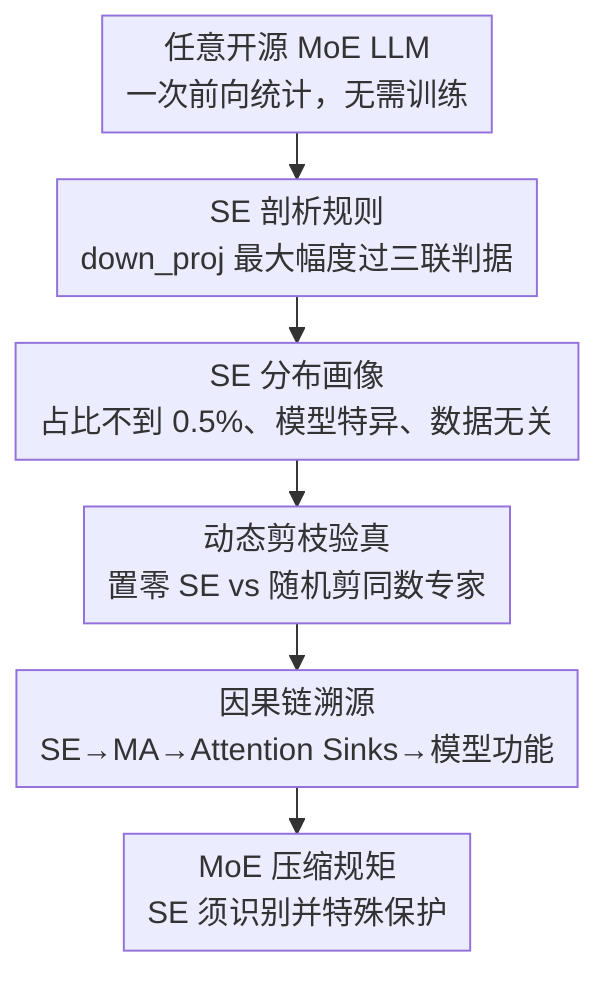

# Unveiling Super Experts in Mixture-of-Experts Large Language Models

**会议**: ICLR 2026  
**arXiv**: [2507.23279](https://arxiv.org/abs/2507.23279)  
**代码**: [GitHub](https://github.com/ZunhaiSu/Super-Experts-Profilling)  
**领域**: 模型压缩 / MoE / LLM 分析  
**关键词**: Mixture-of-Experts, super experts, massive activations, attention sinks, expert pruning, model compression

## 一句话总结

本文首次发现并系统研究了 MoE LLM 中的"超级专家"（Super Experts）——数量极少但对模型推理至关重要的专家子集，它们通过 down_proj 中的极端激活异常值驱动 massive activations 和 attention sinks 机制。

## 研究背景与动机

MoE LLM（如 DeepSeek、Qwen3、Mixtral）通过动态路由和稀疏激活实现了强大的学习能力。现有专家级压缩方法利用专家间的重要性差异进行剪枝、合并或量化，但多依赖启发式指标来识别关键专家，缺乏对专家异质性重要性的深层理解。

核心问题：**是否存在少量极端关键的专家子集？它们的作用机制是什么？**

## 方法详解

### 整体框架

本文不是提出一个新模型，而是用"先定位、再消融、后溯因"的三步分析揭开 MoE 中超级专家（SE）的面纱：先用一个轻量的剖析规则在 down_proj 输出里自动定位极少数 SE，并刻画它们少而稳的分布（对应下面的设计 1、2，§3 定位阶段）；再通过动态剪枝量化这几个专家对各任务的真实影响（设计 3，§4 消融阶段）；最后顺着残差连接把 SE 与 massive activations（MA）、attention sinks 串成一条完整的因果链（设计 4，§5 溯因阶段）。整套流程不依赖训练、只需一次前向统计即可完成，结论是给 MoE 压缩立下"SE 必须特殊保护"这条硬规矩。

### 关键设计

**1. SE 剖析规则：用一个三联判据把"针"从专家堆里挑出来**

MoE LLM 的隐藏状态里藏着 massive activations（MA）——某些维度的激活值比周围大上十万倍的极端异常值。作者追溯发现，这些 MA 并非凭空出现，而是由极少数专家在 down_proj 输出端持续产生、再经残差连接逐层累积传播。为了把这些专家自动挑出来，作者统计每个专家在每一层 down_proj 的最大输出幅度 $a_{l,e}$，并将同时满足三个条件的 $(l,e)$ 判定为 SE：$a_{l,e} > P_{99.5}$（落在全体幅度分布的 99.5 分位之上）、$a_{l,e} > \frac{1}{10}a_{\max}$（不低于全局最大幅度的十分之一）、且 $l\in L$（该层确实是产生 MA 的层），其中 $P_{99.5}=\text{Percentile}_{99.5}(\mathcal{A})$。三个条件叠加既排除了普通的高激活专家，又保证挑出的确实是驱动 MA 的源头，整个判据只需一遍前向即可算出，配套工具可对任意 MoE 直接出 SE 清单。

**2. SE 的分布画像：数量少到离谱，却高度稳定**

把剖析规则套到各家 MoE 上，得到的结论相当反直觉：SE 的占比普遍不到 0.5%，多数模型只有个位数个。Qwen3-30B-A3B 的 6144 个专家里只有 3 个 SE（0.05%，Top1 最大激活 744.0），DeepSeek-R1 的 15677 个专家里 10 个（0.06%，616.0），DeepSeek-V2-Lite 是 2/1782（0.11%，1424.0），Mixtral-8x7B 则是 1/256（0.39%，5600.0）。更关键的是这份名单的稳定性——SE 的位置是**模型特异**的（每个模型自成一套），却是**数据无关**的：在 C4、WikiText-2、C-Eval、GSM8K、HumanEval 等差异极大的语料上跑出来的 SE 几乎完全一致，连 RLHF 等后训练也不改变它们的分布。这说明 SE 是模型在预训练中"长"出来的固有结构，而非被某类数据临时激活。

**3. 动态剪枝验真：拔掉三个专家，数学能力直接崩盘**

光是数量少还不足以证明 SE 重要，作者用动态剪枝做对照实验来量化它们的因果作用：把 SE 的输出在前向时置零，再和"随机剪掉同样数量的普通专家"对照。结果触目惊心——Qwen3-30B-A3B 剪掉那 3 个 SE 后平均分从 70.22 跌到 55.00（-21.68%），其中 GSM8K 从 89.61 暴跌到 42.38（-52.71%），MMLU 从 77.82 降到 56.03；而随机剪 3 个普通专家几乎没有影响（平均 70.36，GSM8K 甚至 89.84）。在推理型模型上更极端，剪掉 DeepSeek-R1 的 10 个 SE 会让 AIME、Math-500 的 Pass@1 直接逼近零，数学推理彻底失能。0.05% 的专家承担着远超其占比的功能，证明 MoE 的重要性分布是极度长尾的。

**4. 因果链溯源：SE 是 attention sinks 的总开关**

最后一步把 SE 放回 Transformer 的整体机制里追问"为什么这么重要"。作者发现 SE 恰好在 attention sink token（通常是序列起始 token）上产生极强激活，这些激活经残差连接累积成 MA，而 MA 又是 attention sinks 形成的物理基础——sink token 之所以能稳定吸走大量注意力，正是因为它们携带了 MA 这一显著特征。于是一旦压缩掉 SE，链条会逐级坍塌：MA 消失、attention sinks 崩溃、注意力分数分布随之紊乱，模型功能瓦解。这条 **SE → MA → Attention Sinks → 模型功能** 的因果链，解释了为何如此微小的扰动会带来如此剧烈的性能崩塌，也给 MoE 压缩立下一条硬规矩：SE 必须被识别并特殊保护。

## 实验

### 主实验：非推理模型

| 指标 | Qwen3-30B 基线 | 剪 SE | 下降率 | 随机剪 | 下降率 |
|------|-------------|-------|-------|-------|-------|
| Avg. | 70.22 | 55.00 | -21.68% | 70.36 | -0.20% |
| GSM8K | 89.61 | 42.38 | -52.71% | 89.84 | +0.26% |
| MMLU | 77.82 | 56.03 | -28.00% | 77.84 | +0.03% |

### 推理模型实验

剪去 DeepSeek-R1 的 10 个 SE：
- AIME/Math-500 的 Pass@1 降至接近 0
- 数学推理能力完全崩溃

### 消融实验

- 按层分别剪 SE：单层 SE 剪枝即可消除该层的 MA 贡献
- 全部 SE 剪除：MA 完全消失

### 跨数据集稳定性

在 C4、WikiText-2、C-Eval、GSM8K、HumanEval 上的 SE 分布高度一致，验证了数据无关性。

## 亮点

- 首次系统发现并定义了 MoE LLM 中的超级专家
- 揭示了完整因果链：SE → MA → Attention Sinks → 模型功能
- 提供了自动化 SE 剖析工具，可快速定位 SE
- 对 MoE 压缩具有重要指导意义：SE 必须特殊对待

## 局限性

- SE 为何在预训练中形成的根本原因尚不清楚
- 仅分析了开源 MoE 模型，闭源模型（如 GPT-4）的情况未知
- SE 的保护策略（如分配更高比特预算）仅初步讨论
- 是否可以设计"无 SE"的更均衡 MoE 训练机制，未深入探讨

## 相关工作

- **MoE 模型**：DeepSeek (Guo et al., 2025)、Qwen (Yang et al., 2025)、Mixtral
- **专家级压缩**：基于频率、路由分数、重建损失的专家重要性度量
- **Massive Activations**：Sun et al. (2024) 发现但未解释在 MoE 中的成因
- **Attention Sinks**：Xiao et al. (2023) 发现初始 token 获得异常高注意力

## 评分

- 新颖性：⭐⭐⭐⭐⭐ — 首次发现和系统研究 MoE 中的超级专家
- 理论深度：⭐⭐⭐⭐ — 因果分析深入但缺乏形式化理论解释
- 实验充分性：⭐⭐⭐⭐⭐ — 多模型、多任务、多数据集全面验证
- 实用价值：⭐⭐⭐⭐⭐ — 直接指导 MoE 压缩策略
- 写作质量：⭐⭐⭐⭐ — 递进式分析结构清晰

<!-- RELATED:START -->

## 相关论文

- [\[ICLR 2026\] MoBE: Mixture-of-Basis-Experts for Compressing MoE-based LLMs](mobe_mixture-of-basis-experts_for_compressing_moe-based_llms.md)
- [\[ICLR 2026\] Coupling Experts and Routers in Mixture-of-Experts via an Auxiliary Loss](coupling_experts_and_routers_in_mixture-of-experts_via_an_auxiliary_loss.md)
- [\[ICLR 2026\] LD-MoLE: Learnable Dynamic Routing for Mixture of LoRA Experts](ld-mole_learnable_dynamic_routing_for_mixture_of_lora_experts.md)
- [\[ICLR 2026\] Efficient Quantization of Mixture-of-Experts with Theoretical Generalization Guarantees](efficient_quantization_of_mixture-of-experts_with_theoretical_generalization_gua.md)
- [\[ICML 2026\] DAG-MoE: From Simple Mixture to Structural Aggregation in Mixture-of-Experts](../../ICML2026/model_compression/dag-moe_from_simple_mixture_to_structural_aggregation_in_mixture-of-experts.md)

<!-- RELATED:END -->
