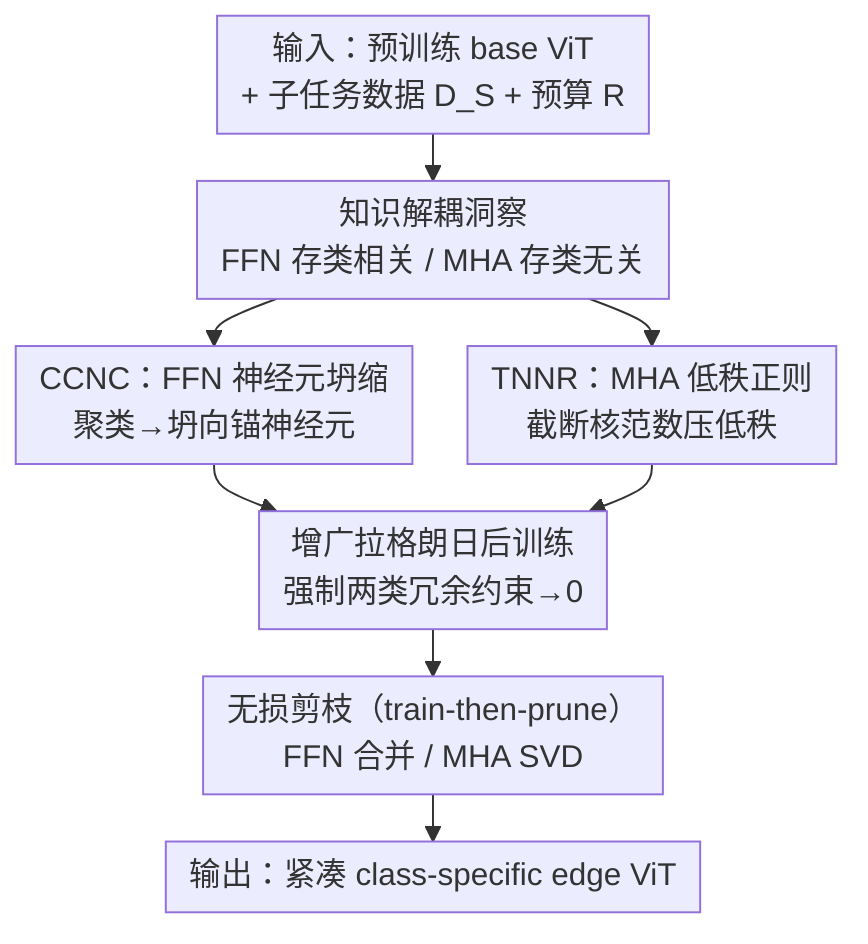

# Vulcan: 为边缘智能裁剪紧凑的类特定视觉 Transformer

**会议**: ICLR 2026  
**OpenReview**: [https://openreview.net/forum?id=0xE0kNdGIz](https://openreview.net/forum?id=0xE0kNdGIz)  
**代码**: 有（论文标注 Code available，链接见 OpenReview）  
**领域**: 模型压缩  
**关键词**: 视觉 Transformer、结构化剪枝、类特定模型、边缘部署、知识解耦

## 一句话总结
Vulcan 发现 ViT 里 FFN 存「类相关知识」、MHA 存「类无关模式」，于是用一套「先训后剪」(train-then-prune) 的后训练方法，在 FFN 上把神经元向高激活的锚神经元坍缩、在 MHA 上用截断核范数正则把投影矩阵压成低秩，从而能在给定算力预算下近乎无损地剪出一个又小又强的「只认目标类」的边缘 ViT——只用原模型 20%–40% 的体积，类特定精度反而比原 ViT 高出最多 15.12%。

## 研究背景与动机
**领域现状**：大 ViT 要上无人机、车载传感器这类边缘设备，必须先压缩。主流压缩手段有量化、知识蒸馏、非结构化/结构化剪枝，其中结构化剪枝因为产出「形状规整」的模型、不依赖专用算子加速，最适合各种异构边缘硬件，是公认的 edge-friendly 路线。

**现有痛点**：现有压缩方法默认要保住 ViT 的「全类知识」(all-classes knowledge)，但边缘场景往往只用得上其中一小撮类——车载传感器要认车辆、路牌、信号灯，根本不需要花朵和昆虫的知识。这些无关知识不仅白白占体积，还会分散模型注意力，导致它在真正关心的目标类上表现反而不够好。

**核心矛盾**：要剪出「类特定」模型，必须先搞清楚「类相关知识到底分布在 ViT 的哪些模块里」——这是个一直没解决的可解释性问题。同时，传统剪枝走的是 prune-then-train（先剪后训）范式：先按重要性分数砍掉权重再微调，但「不重要」不等于「可丢弃」，高剪枝率下这种直接删权会造成**不可逆的知识损失**。

**本文目标**：给定算力预算（参数量 / GFLOPs），从一个通用预训练 base ViT 派生出一个紧凑、只服务目标类子集 $S$ 的边缘 ViT。

**切入角度**：作者对 DeiT-Base 做激活驱动分析，发现 FFN 神经元具有极强的人类可识别可解释性（浅层抓色调/纹理/背景，深层抓「蛇」这类语义类别），而 MHA 的 QK/VO 维度用数据无关的 SVD 剪枝反而比基于数据的打分剪枝更好——这两个现象指向一个**知识解耦**结构。

**核心 idea**：既然 FFN 装类相关知识、MHA 装类无关知识，那就分而治之——先通过后训练**故意往模型里塞冗余**（让 FFN 神经元成簇坍缩、让 MHA 矩阵变低秩），再把这些冗余无损剪掉，用「先训后剪」替代「先剪后训」，绕开不可逆的知识损失。

## 方法详解

### 整体框架
Vulcan 是一个面向剪枝的后训练 (pruning-oriented post-training) 方法。输入是预训练 base ViT $M_B$、目标子任务 $S$ 的数据 $D_S$、以及资源预算（折算成整体剪枝率 $R$）；输出是一个只服务 $S$ 类别、形状规整可直接部署的紧凑边缘 ViT $M_E$。整体逻辑是：先用一次激活/SVD 分析确认 ViT 的知识解耦结构，再在后训练阶段对 FFN 和 MHA 分别施加两个「冗余约束」，把约束塞进增广拉格朗日目标里强制收敛；后训练一旦让约束逼近零，就能在剪枝阶段近乎无损地把冗余切掉，得到 edge ViT。

整条管线是「分析洞察 → 双路注入冗余 → 联合后训练 → 无损剪枝」的串行结构，FFN 路与 MHA 路在后训练里并行作用：

### 关键设计

**1. 知识解耦洞察：FFN 存类相关、MHA 存类无关**

这是全文的地基，针对的痛点是「不知道类知识藏在哪，就没法做类特定剪枝」。作者从两个互补的实验现象推出解耦结论。其一在 FFN：由公式 $\mathrm{FFN}^{(l)}(X)=\sum_{i=1}^{e_l}\sigma(Xn_1^{(l,i)})\otimes n_2^{(l,i)}$ 可知，每个神经元的激活幅度就是它对输出的权重，于是对每个神经元取其在 ImageNet-1K 验证集上激活最高的 Top-25 图像来看「它记的是什么」，结果发现这些神经元有极强可解释性——浅层管色调、竖纹、网格纹理，深层专门识别「蛇」这类具体类别，说明 **FFN 是类相关知识的蓄水池**。其二在 MHA：QK、VO 维度本质是两次矩阵乘 $W_Q^\top W_K,\ W_V^\top W_O^\top\in\mathbb{R}^{d\times d}$ 的中间维，可以用 SVD 剪；而实验里这种**数据无关**的 SVD 剪枝竟然稳定优于各种基于数据打分的剪枝，意味着即使不知道子任务是什么也能压好 MHA，反推出 **MHA 存的是类无关知识**。这个解耦直接决定了后面 FFN 走「按激活坍缩」、MHA 走「按 SVD 低秩」两条不同的技术路线。

**2. CCNC：让 FFN 神经元向锚神经元成簇坍缩**

针对「FFN 装着大量与目标类无关的神经元」这一痛点，CCNC（Class-Centric Neuron Collapse）的做法是先在每个 block 内按权重对 FFN 神经元做 k-means 聚类，再把同一簇里的所有神经元全部坍缩到**激活最高的那个锚神经元** $\hat n_k^{(l)}$ 上。激活用子任务数据算：$a^{(l,i)}=\sum_j\sigma(X[j]\cdot n_1^{(l,i)})$，激活越高说明该神经元越贴目标类。由于不同 block 的神经元功能不同，簇数不是全局统一，而是按激活分布和整体剪枝率自适应决定：

$$K^{(l)}=\sum_{i=1}^{e_l}\mathbb{I}\!\left(a^{(l,i)}>\Phi\!\left(A^{(l)},\big\lceil(\textstyle\sum_{j}e_j)\times R\big\rceil\right)\right)$$

其中 $\Phi(A,k)$ 返回集合里第 $k$ 小的元素。坍缩本身靠后训练时加一个坍缩正则 $L_{\text{collapse}}$ 来实现，它把同簇神经元的权重（或激活）逼向锚神经元 $\hat\nu_k^{(l)}$。论文实测**权重坍缩**比激活坍缩收敛更快、精度更高——因为权重坍缩直接强制权重相等，更契合后续剪枝过程，而激活坍缩的损失数量级偏小、约束偏弱。坍缩到位后，一簇神经元就能由一个锚神经元代表，FFN 中间维 $e$ 被有效压缩。

**3. TNNR：用截断核范数把 MHA 压成可 SVD 无损剪的低秩结构**

MHA 路的痛点是「想用 SVD 剪 QK/VO，但原矩阵不够低秩，直接 SVD 会丢信息」。TNNR（Truncated Nuclear Norm Regularization）于是在后训练里主动给 $W_Q^{(l,h)}$、$W_V^{(l,h)}$ 注入低秩结构（其低秩性被 $W_K$、$W_O$ 共享）。每个头要保留多少秩，由**有效秩** (effective rank) 决定——作者发现 MHA 知识在不同 block、不同维度上分布也不均，于是用有效秩 $E(W)=\exp(-\sum_i p_i\log p_i),\ p_i=\sigma_i/\sum_j\sigma_j$（$\sigma_i$ 为奇异值）来度量每个头的知识容量，并据此自适应分配各 block 的 QK/VO 剪枝率 $R^{(l)}_{QK|VO}$。注入低秩的手段是对 $W_Q$、$W_V$ 的核范数做**截断**正则——只惩罚要被砍掉的那些尾部奇异值：

$$L_{\text{rank}}=\sum_{l=1}^{L}\sum_{h=1}^{H_l}\left(\sum_{i=q'_l+1}^{q_l}\sigma_{Q}^{(l,h,i)}+\sum_{i=v'_l+1}^{v_l}\sigma_{V}^{(l,h,i)}\right)$$

其中 $q'_l=\lfloor q_l(1-R^{(l)}_{QK})\rfloor$。这样后训练会把尾部奇异值压到接近 0，剪枝时直接用 SVD 取前 $q'_l/v'_l$ 个奇异分量就能近乎无损地重构 $W_Q',W_K',W_V',W_O'$，从而把类无关的 MHA 容量整齐切掉。

**4. 增广拉格朗日后训练 + 先训后剪的无损剪枝**

前两个设计给出了两类冗余约束（$L_{\text{collapse}}$、$L_{\text{rank}}$），这个设计负责把它们「强制执行」并完成最终剪枝，针对的正是传统 prune-then-train 不可逆知识损失的痛点。Vulcan 把任务损失 $L_T$ 与两类约束统一进**增广拉格朗日**目标：把约束扩成线性 + 二次两项，引入两个可学习乘子 $\lambda_1,\lambda_2$（初始为 0，用梯度上升、以惩罚参数 $\rho$ 为学习率更新）来逼迫约束收敛：

$$L=L_T+\sum_{l,k,i}\Big(\lambda_1|\nu_k^{(l,i)}-\hat\nu_k^{(l)}|+\lambda_2(\nu_k^{(l,i)}-\hat\nu_k^{(l)})^2\Big)+\sum_{l,h,i}\Big(\lambda_1\sigma+\lambda_2\sigma^2\Big)$$

后训练过程像一次「edge ViT 向 base ViT 逐步对齐」：早期 $L_T$ 主导、base ViT 精度上升；随着 $\lambda$ 增大，冗余损失开始主导，base ViT 略降而 edge ViT 大幅上升，最后两者收敛到等价。一旦 $L_{\text{collapse}}\to0$、$L_{\text{rank}}\to0$，剪枝就是**无损**的——FFN 侧把同簇神经元的第二层权重相加合并（$W_2'[:,k]=\sum_i n_{k,2}^{(l,i)}$，本质是网络扩张的逆操作、满足函数保持原则），MHA 侧直接对 $W_{QK},W_{VO}$ 做 SVD 截断。论文给出了形式化证明：约束满足时 $\mathrm{FFN}_{\text{pruned}}=\mathrm{FFN}$、$\mathrm{MHA}_{\text{pruned}}=\mathrm{MHA}$，因此整模型输出不变；实际中约束只渐近趋零，故精度在剪枝前后波动极小，即「近乎无损」。

### 损失函数 / 训练策略
最终目标即上面的增广拉格朗日 $L$（任务损失 + FFN 坍缩约束 + MHA 低秩约束）。$\lambda_1,\lambda_2$ 初始化为 0，以 $\rho$ 作学习率用梯度上升更新；$\rho$ 是 Vulcan 唯一超参（默认 1.0），实验显示对 $\rho\in\{0.1,1.0,10.0\}$ 极不敏感。后训练 batch size 256、学习率 $10^{-4}$、AdamW 优化；CCNC 计算 $K^{(l)}$ 前对各 block 激活做 z-score 归一化，锚神经元逐 batch 更新；剪后维度对齐到 8 的倍数以适配边缘硬件加速。

## 实验关键数据

### 主实验
在 DeiT-Base + ImageNet-1K 上构造 25/50/100 类的子任务，剪枝率 0.60 与 0.80，对比五个 SOTA 结构化剪枝方法（Top-1 准确率 %，取各列均值 Avg）：

| 方法 | 25 类 Avg (R=0.6) | 100 类 Avg (R=0.6) | 25 类 Avg (R=0.8) | 100 类 Avg (R=0.8) |
|------|------|------|------|------|
| DeiT-Base（原模型，未压缩） | 81.05 | 81.06 | 81.05 | 81.06 |
| X-Pruner | 92.64 | 86.03 | 85.74 | 74.95 |
| MDP | 92.64 | 83.27 | 85.47 | 65.69 |
| DC-ViT | 77.27 | 64.41 | 61.81 | 35.15 |
| **Vulcan** | **95.60** | **89.25** | **93.04** | **83.29** |

剪枝后模型只用原 ViT 20%–40% 体积，类特定精度反而比原 ViT 高最多 15.12%、比最强 baseline 高最多 13.92%。R=0.6 时 Vulcan 比 base ViT 高 11.05%、比 X-Pruner/MDP 高 2.91%/4.07%；即便 R=0.8 仍比 base ViT 高 6.95%，并能保住微调后 base ViT 精度的 97.63%(R=0.6)、93.30%(R=0.8)。剪枝率越高、子任务越大，Vulcan 优势越明显。

效率上（Jetson Orin NX / RTX 4090）：

| 剪枝率 | #Param (M) | #FLOPs (G) | Orin NX 加速 | 内存(Orin) |
|------|------|------|------|------|
| DeiT-Base | 86.57 | 17.57 | 1× | 0.34 GB |
| Vulcan(0.60) | 34.09 | 6.77 (↓61.47%) | 2.16× | 0.15 GB |
| Vulcan(0.80) | 16.96 | 3.26 (↓81.45%) | 3.02× | 0.08 GB |

### 消融实验
DeiT-Base、R=0.60、子任务 T1–T3 平均（Top-1 %）：

| 配置 | Avg | 说明 |
|------|------|------|
| Vulcan（完整） | 95.60 | 完整模型 |
| w/o CCNC | 11.35 | 去掉 FFN 坍缩，掉 84.25%（FFN 知识不可逆损失） |
| w/o TNNR | 79.45 | 去掉 MHA 低秩正则，掉 16.15%（MHA 本就偏低秩，影响较小） |
| w/o anchor | 91.04 | 坍向随机神经元而非锚神经元，掉 4.56% |

### 关键发现
- **CCNC 贡献最大**：去掉它精度从 95.60 崩到 11.35，说明 FFN 的类相关知识若被直接剪掉是不可逆的，必须先坍缩注入冗余；这反向验证了「FFN 存类相关知识」的洞察。
- **MHA 天然偏低秩**：去掉 TNNR 只掉 16.15%，印证 MHA 容量本就冗余、用 SVD 压损失小，与「MHA 存类无关知识」一致。
- **锚神经元不可替**：坍向高激活锚神经元比坍向随机神经元高 4.56%，因为锚神经元最贴目标类，能把特征提取主导权交给类相关神经元。
- **极稳健**：对唯一超参 $\rho$（0.1/1.0/10.0）几乎不敏感；权重坍缩优于激活坍缩。可视化显示，为 120 类狗派生的 $M_{E/\text{dogs}}$ 末层 680 个神经元里有 229 个专门识别狗类，直观证明模型确实「特化」到了目标类。

## 亮点与洞察
- **把可解释性变成压缩工具**：以往可解释性研究只「看」神经元在记什么，本文第一次把「FFN 记类相关、MHA 记类无关」的解耦结论直接变成剪枝策略的分工依据，让 insight 真正落地为算法。
- **train-then-prune 范式翻转**：传统是「先剪后训、按重要性砍权重」，本文反过来「先训出冗余再剪」，并配上无损性证明——剪掉的权重是被后训练逼成完全冗余的，而非「不重要但有用」的，从根上回避不可逆损失。这个思路可迁移到任意需要结构化压缩的网络。
- **压缩后反超原模型**：类特定 edge ViT 在目标类上精度高于全类 base ViT，说明「去掉无关知识」本身就是一种正则/聚焦，不只是省体积。
- **数据无关 SVD > 数据打分剪枝**：这个反直觉现象本身就是一条可复用的经验——MHA 投影矩阵压缩可以不依赖校准数据。

## 局限与展望
- **依赖事先知道目标类子集 $S$**：方法面向「已知应用场景类别」的边缘部署，若部署后类别集合动态变化或开放世界场景，需重新派生模型。
- **后训练有额外开销**：相比纯训练后剪枝，Vulcan 需要一轮带增广拉格朗日约束的后训练，虽换来近乎无损，但派生成本仍非零（论文将 wall-clock 成本放在附录）。
- **验证集中在分类 + 检测/分割的有限骨干**：实验覆盖 DeiT 系与 Swin-T（Fast/Mask R-CNN），是否在更大规模或其他架构（如纯卷积-Transformer 混合）上同样成立仍待验证；CCNC 对其他 FFN 架构的适配性只在附录初步展示。
- **解耦是经验观察**：FFN/MHA 的类相关/无关解耦由激活与 SVD 现象支撑、附录给理论解释，但并非严格证明的普适规律，极端情况下可能不成立。

## 相关工作与启发
- **vs 手工 edge 架构（MobileViT / EfficientViT / Flatten Transformer）**：它们靠人工设计轻量结构并从头训练，无法随大 ViT 的进步自动受益；Vulcan 从预训练 base ViT 派生，能继承大模型知识、随基座升级。
- **vs 传统结构化剪枝（NViT / X-Pruner / DC-ViT / MDP）**：它们走 prune-then-train、按重要性分数砍权重，缺乏面向类特定性的策略，高剪枝率下不可逆掉点；Vulcan 走 train-then-prune，先注入冗余再无损剪，且专门服务目标类。
- **vs 量化 / 非结构化剪枝 / 知识蒸馏**：量化与非结构化剪枝依赖专用算子才能在边缘加速，蒸馏只从特征空间迁移且训练成本高；Vulcan 从参数空间提取、产出形状规整模型，且与这些技术正交，可叠加使用进一步压缩。

## 评分
- 新颖性: ⭐⭐⭐⭐⭐ 首个「类特定 ViT 派生」+ 首个 train-then-prune 剪枝范式，并以知识解耦洞察支撑，思路新颖
- 实验充分度: ⭐⭐⭐⭐⭐ 5 个 base ViT、3 类视觉任务、4 个数据集，含主对比/消融/效率/可视化/超参敏感性，覆盖全面
- 写作质量: ⭐⭐⭐⭐ 洞察—方法—证明逻辑清晰，公式与符号偏密，附录承载较多关键细节
- 价值: ⭐⭐⭐⭐⭐ 边缘部署刚需场景，压缩后反超原模型且与其他压缩正交，实用价值高

<!-- RELATED:START -->

## 相关论文

- [\[ICLR 2026\] TP-Spikformer: Token Pruned Spiking Transformer](tp-spikformer_token_pruned_spiking_transformer.md)
- [\[ICLR 2026\] RAPID$^3$: Tri-Level Reinforced Acceleration Policies for Diffusion Transformer](rapid3_tri-level_reinforced_acceleration_policies_for_diffusion_transformer.md)
- [\[ICLR 2026\] Plug-and-Play Fidelity Optimization for Diffusion Transformer Acceleration via Cumulative Error Minimization](plug-and-play_fidelity_optimization_for_diffusion_transformer_acceleration_via_c.md)
- [\[ICLR 2026\] Otters: An Energy-Efficient Spiking Transformer via Optical Time-to-First-Spike Encoding](otters_an_energy-efficient_spiking_transformer_via_optical_time-to-first-spike_e.md)
- [\[CVPR 2026\] ThinkingViT: Matryoshka Thinking Vision Transformer for Elastic Inference](../../CVPR2026/model_compression/thinkingvit_matryoshka_thinking_vision_transformer_for_elastic_inference.md)

<!-- RELATED:END -->
