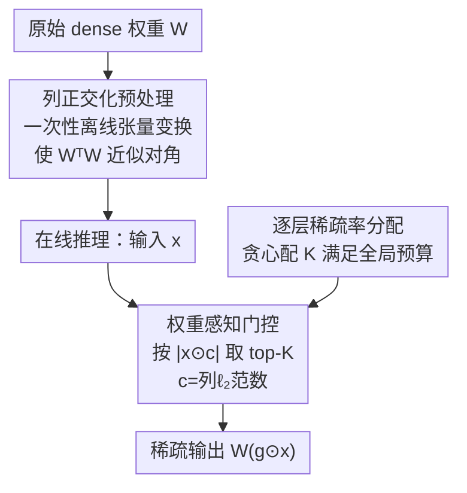

# WINA: Weight Informed Neuron Activation for Accelerating Large Language Model Inference

**会议**: ICLR 2026  
**OpenReview**: [https://openreview.net/forum?id=l7Vb3yxmuz](https://openreview.net/forum?id=l7Vb3yxmuz)  
**代码**: https://github.com/microsoft/wina  
**领域**: 模型压缩 / LLM效率  
**关键词**: 稀疏激活, 免训练加速, 权重感知门控, 近似误差界, 推理加速

## 一句话总结
WINA 在免训练稀疏激活中把"权重列范数"和"隐藏状态幅值"一起纳入门控判据——用 $|x_i \cdot c_i|$ 而非单纯的 $|x_i|$ 选 top-K 神经元，在理论上给出更紧的近似误差上界，并在 Llama/Mistral/Phi-4 上以相同稀疏度取得比 TEAL/CATS/R-Sparse 更高的精度，尤其在 65% 这种极端稀疏下优势显著。

## 研究背景与动机
**领域现状**：让 LLM 推理变快有两条路。一条是改架构（MoE、蒸馏），让每个 token 只激活子网络，但这需要大量（重）训练；另一条是**免训练稀疏激活**——保留原始 dense 模型，推理时按某种判据动态把一部分神经元/权重置零，即插即用、可直接套用现成模型。TEAL、CATS、Q-Sparse、R-Sparse 都属于后者。

**现有痛点**：当前免训练方法几乎都用**单一判据**——隐藏状态幅值 $|x_i|$ 的 top-K。它们忽略了权重矩阵 $W$ 在前向传播中的作用：一个激活值 $x_i$ 到底对下一层输出影响多大，不只取决于 $x_i$ 自身，还取决于它要乘的那一列权重 $W_{:,i}$ 的大小。只看 $|x_i|$ 会**丢掉幅值小但权重重的高影响激活、却保留一堆幅值大但权重轻的低影响激活**，在稀疏度升高时近似误差不断累积，精度掉得比必要的更狠。

**核心矛盾**：稀疏激活本质是"在效率和输出质量之间做取舍"，而这个取舍的关键在于**保住对输出贡献最大的那些激活**。可"贡献大小"是 $x_i$ 与 $W_{:,i}$ 共同决定的量，单看激活幅值这一侧必然给出次优的选择。

**本文目标**：设计一个仍然免训练、即插即用、架构无关的门控判据，但要把权重信息纳入进来，从而（1）更准地估计每个激活对下游的影响，（2）给出比现有方法更紧的近似误差理论界。

**切入角度**：回到最朴素的目标——稀疏后输出 $W(g\odot x)$ 要尽量逼近原始输出 $Wx$，即 $\min_g \|Wx - W(g\odot x)\|_2$。直接分析这个目标会发现，被置零的第 $i$ 维带来的误差正比于 $|x_i|\cdot\|W_{:,i}\|_2$，于是"该保哪些"的答案自然就含进了权重列范数。

**核心 idea**：用 $|x_i \cdot \|W_{:,i}\|_2|$ 代替 $|x_i|$ 做 top-K 门控——一句话就是"用权重信息加权后的激活强度"来决定激活谁。

## 方法详解

### 整体框架
WINA 的目标只有一句：在每一层把输入向量 $x$ 里"对输出贡献最小"的那批维度置零，构造一个稀疏子网络，同时让稀疏前后的层输出 $Wx$ 与 $W(g\odot x)$ 尽量接近。它把这件事拆成三块：一是**离线把权重列正交化**（一次性预处理，使后面的理论保证成立），二是**在线用权重感知判据 $|x\odot c|$ 选 top-K** 构造二值门控 $g$，三是**按层分配各自的稀疏率 $K$** 以在给定全局预算下最小化整体掉点。整个过程没有任何梯度更新，门控是闭式确定的，且对 attention、MLP、残差乃至量化层都通用。

### 关键设计

**1. 权重感知门控函数：让"激活幅值×权重列范数"共同决定激活谁**

这是 WINA 的核心。现有方法的门控是 $g_i = 1$ 当且仅当 $|x_i|$ 落在 $|x|$ 的 top-K 内（式 3），完全没看权重。WINA 改成：

$$[g_{\text{WINA}}]_i = \begin{cases} 1 & |x_i c_i| \text{ 落在 } |x\odot c| \text{ 的 top-K 内} \\ 0 & \text{否则} \end{cases}$$

其中 $c\in\mathbb{R}^n$ 是权重矩阵 $W$ 的**列向 $\ell_2$ 范数**，$c_i=\|W_{:,i}\|_2$，$\odot$ 是逐元素积。直觉非常直接：把第 $i$ 维置零，对层输出造成的扰动正比于 $\|x_i W_{:,i}\|_2 = |x_i|\cdot\|W_{:,i}\|_2$，所以真正该保留的是这个乘积大的维度，而不是单看 $|x_i|$。这样既不会丢掉"幅值不大但乘上一根大权重列后影响很大"的激活，也不会浪费 K 名额去保留"幅值大但权重列很小、对输出几乎没贡献"的激活。$K$ 越小、置零越多、省的 FLOPs 越多但精度风险越大；$K$ 的选择灵活，可以全层共享一个粗粒度阈值，也可以逐层细调。

**2. 列正交化预处理：用一次性离线变换把理论保证落到实处**

WINA 想证明的不只是"直觉上更好"，而是一个**可证最优/更紧的误差界**。Lemma 3.1 证明：当 $W$ 满足列正交性（$W^\top W$ 为对角阵）时，按 $|x_i\cdot\|W_{:,i}\|_2|$ 保留 top-K 的 WINA 门控是单层问题 $\min_g\|Wx-W(g\odot x)\|_2$ 的**最优解**；Theorem 3.2 进一步把它推广到 $L$ 层线性网络，给出可分的输出偏差上界 $E(x;G)\le U(x;G)$，并证明最小化 $U$ 恰好等价于"逐层按平方列范数加权选最大的 $k$ 个坐标"，即 $G_{\text{WINA}}=\arg\min_G U(x;G)$。

但真实 LLM 的权重并不天然列正交。WINA 借用 (Ashkboos et al., 2024a) 的高效**一次性离线张量变换**强制列正交：这步很轻量、**不改变模型的函数表达能力**（等价变换），却让上面的理论假设在实际模型上近似成立，从而把"最优误差界"从纸面带进部署。这正是 WINA 相对 TEAL 等方法在 Table 1 里独占"Tight Approx Error"的原因。

**3. 逐层稀疏率分配：在全局预算下贪心地把稀疏度切给各层**

同样是 50% 全局稀疏，把它均匀摊到每一层并不最优——不同层对稀疏的敏感度差很多。WINA 沿用 TEAL 提出的**贪心算法**：给定全局稀疏目标，迭代地为每一层配置各自的稀疏率，使总体稀疏度满足预算的同时整体掉点最小（layer-specific sparsity）。配合判据 1 的架构无关性，WINA 能把这套稀疏率分配统一施加到注意力层、MLP、残差连接上；相比之下 CATS 只能作用在门控 MLP 的 SwiGLU 上，因而连 50%/65% 这种较高的模型级稀疏都达不到。

## 实验关键数据

### 主实验
在 Llama-2-7B、Llama-3-8B、Mistral-7B、Phi-4-14B 上，用 lm-evaluation-harness 评测常识推理（PIQA/ARC/WinoGrande/HellaSwag/SciQ/OBQA/BoolQ）、MMLU、GSM8K、HumanEval；基线为同样免训练的 CATS / R-Sparse / TEAL，均采用逐层稀疏率分配以对齐全局稀疏预算。

常识推理平均精度（节选，越高越好）：

| 模型 | 稀疏度 | CATS | R-Sparse | TEAL | WINA |
|------|--------|------|----------|------|------|
| Llama-2-7B | 0%(满) | — | — | — | 69.72 |
| Llama-2-7B | 25% | 68.04 | 69.48 | 69.52 | **69.59** |
| Llama-2-7B | 50% | —† | 67.03 | 67.58 | **68.79** |
| Llama-2-7B | 65% | —† | 59.37 | 61.07 | **65.14** |
| Llama-3-8B | 25% | 69.57 | 72.56 | 72.82 | **73.09** |
| Llama-3-8B | 65% | —† | 56.57 | 62.02 | **65.63** |
| Mistral-7B | 50% | —† | 68.70 | 71.93 | **72.45** |

† CATS 只能稀疏化 MLP 层，无法达到 50%/65% 的模型级稀疏。在 Llama-2-7B 65% 下 WINA 比 R-Sparse 高 +5.77%、比 TEAL 高 +4.07%；Llama-3-8B 65% 下比 TEAL 高 +3.61%、比 R-Sparse 高 +9.06%。值得注意的是 Llama-3-8B 在 25% 稀疏时 WINA 平均分 73.09% 反而**略超满模型 73.99→72.99**（这里满模型为 72.99），说明轻度稀疏几乎无损甚至有正则效果。

### 合成验证实验（误差界）
在随机初始化、强制列正交的网络上直接测稀疏前后输出的 $\ell_2$ 偏差（20 个随机种子，越低越好）：

| 理论 | 方法 | 25% | 40% | 50% | 65% |
|------|------|-----|-----|-----|-----|
| Lemma 3.1 | CATS/TEAL | 1.68 | 3.41 | 4.86 | 7.55 |
| Lemma 3.1 | R-Sparse | 1.72 | 3.48 | 5.01 | 7.75 |
| Lemma 3.1 | **WINA** | **0.70** | **1.73** | **2.70** | **4.75** |
| Theorem 3.2 | CATS/TEAL | 0.73 | 1.44 | 2.04 | 3.02 |
| Theorem 3.2 | **WINA** | **0.38** | **0.76** | **1.09** | **1.76** |

WINA 在所有稀疏度和两套理论设定下都给出最低的近似误差，**约比对手低 50%**，与理论保证吻合。

### 关键发现
- **权重信息是优势来源**：判据从 $|x|$ 换成 $|x\odot c|$，在合成实验里直接把近似误差砍掉约一半；这是 WINA 全部精度增益的根。
- **稀疏度越极端，优势越大**：25% 时各方法接近，到 65% 时 WINA 与 TEAL/R-Sparse 的差距拉到 +4~9%，因为权重感知判据能在名额紧张时优先保住真正高影响的激活。
- **CATS 的天花板**：CATS 只作用于 SwiGLU/MLP，模型级稀疏上不去（50%/65% 缺数据），凸显 WINA "架构无关 + 逐层分配"在高稀疏区的实用性。
- **与量化兼容**：论文额外验证 WINA 在 4-bit/8-bit 下仍有效，并提供 Triton kernel 测得相对 TEAL 有竞争力的实际加速。

## 亮点与洞察
- **判据只改了一个乘子，却把理论和实验都顶上去了**：把 top-K 的依据从 $|x_i|$ 换成 $|x_i|\cdot\|W_{:,i}\|_2$，改动极小、零训练、闭式确定，却同时拿下"可证更紧误差界 + 实测掉点更少"，是典型的"对问题本质看得更准"的设计。
- **理论假设用工程手段补齐**：列正交性本不成立，作者用一次性等价张量变换强行满足假设、又不改函数能力，把"理想化定理"落到真实 LLM 上，这个"理论—工程"衔接很值得学。
- **可迁移性强**：架构无关 + 与量化正交，意味着这套"权重感知 top-K"判据可以直接叠加到 MoE 路由、KV cache 稀疏、注意力头剪枝等任何"选 top-K 子结构"的场景里。

## 局限与展望
- **依赖列正交预处理**：紧误差界的成立建立在列正交假设上，靠离线张量变换近似满足；当变换不能很好正交化（如某些层结构）时，理论保证会打折，论文未充分讨论这种失配的影响。
- **理论分析限于线性层**：Lemma/Theorem 都在线性（或可分上界）假设下推导，非线性激活、LayerNorm 等真实组件下的误差传播只能靠经验结果支撑。
- **加速主要靠 Triton kernel**：稀疏激活能否转化为实际墙钟时间收益高度依赖 kernel 实现与硬件，论文给了 kernel 但端到端吞吐/延迟的系统性评测相对单薄。
- **改进方向**：把权重感知判据扩展到考虑跨层耦合（当前是逐层独立选 top-K），或与可学习的极轻量校准结合，可能在极端稀疏下进一步收窄与满模型的差距。

## 相关工作与启发
- **vs TEAL**：TEAL 把基于幅值的激活稀疏推广到全部层、能拿到很高的模型级稀疏，但门控只看隐藏状态幅值 $|x|$，忽略权重；WINA 在它的"全层 + 逐层稀疏率分配"框架上，把判据升级为 $|x\odot c|$，从而拿到更紧的误差界和更高的高稀疏精度。
- **vs CATS**：CATS 在门控 MLP 的 SwiGLU 上做稀疏激活，效果不错但**只能作用于特定层**，模型级稀疏上不去（50%/65% 无法达到）；WINA 架构无关，可统一施加到 attention/MLP/残差。
- **vs R-Sparse**：R-Sparse 也做免训练稀疏激活并支持逐层稀疏，但同样缺乏 WINA 的紧近似误差保证，在极端稀疏（65%）下掉点明显大于 WINA。
- **vs 模型剪枝 / MoE**：传统剪枝去冗余神经元后通常需要微调恢复精度，MoE/蒸馏需要训练可学习路由；WINA 完全免训练、即插即用，避开了这些训练开销。

## 评分
- 新颖性: ⭐⭐⭐⭐ 判据改动小但切中要害，把权重信息纳入门控并配上可证更紧的误差界，思路清晰且有理论支撑。
- 实验充分度: ⭐⭐⭐⭐ 覆盖四个模型族、多任务、多稀疏度，并有合成实验验证理论、量化兼容性与 Triton kernel；端到端系统级加速评测略单薄。
- 写作质量: ⭐⭐⭐⭐ 动机—判据—理论—实验逻辑顺畅，Table 1 对比清晰。
- 价值: ⭐⭐⭐⭐⭐ 免训练、架构无关、与量化正交，可直接部署到现成 LLM 并叠加到各类 top-K 选择场景，实用性强。

<!-- RELATED:START -->

## 相关论文

- [\[CVPR 2026\] Otil: Accelerating Diffusion Model Inference via Communication-Efficient Multi-GPU Parallelism](../../CVPR2026/model_compression/otil_accelerating_diffusion_model_inference_via_communication-efficient_multi-gp.md)
- [\[ICLR 2026\] Large Language Model Compression with Global Rank and Sparsity Optimization](large_language_model_compression_with_global_rank_and_sparsity_optimization.md)
- [\[ICLR 2026\] PASER: Post-Training Data Selection for Efficient Pruned Large Language Model Recovery](paser_post-training_data_selection_for_efficient_pruned_large_language_model_rec.md)
- [\[AAAI 2026\] Consensus-Aligned Neuron Efficient Fine-Tuning Large Language Models for Multi-Domain Machine Translation](../../AAAI2026/model_compression/consensus-aligned_neuron_efficient_fine-tuning_large_language_models_for_multi-d.md)
- [\[ICLR 2026\] ES-dLLM: Efficient Inference for Diffusion Large Language Models by Early-Skipping](es-dllm_efficient_inference_for_diffusion_large_language_models_by_early-skippin.md)

<!-- RELATED:END -->
