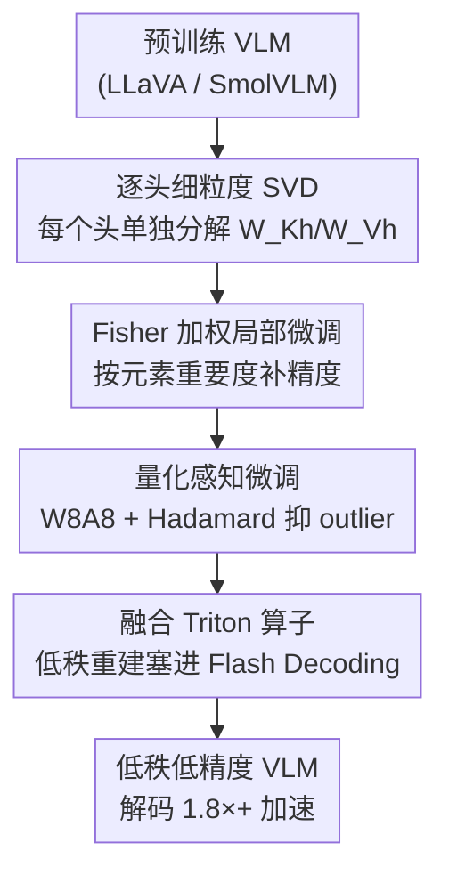

# WSVD: Weighted Low-Rank Approximation for Fast and Efficient Execution of Low-Precision Vision-Language Models

**会议**: ICLR 2026  
**论文**: Published as a conference paper at ICLR 2026  
**代码**: https://github.com/SAI-Lab-NYU/WSVD (有)  
**领域**: 模型压缩 / LLM效率  
**关键词**: 低秩分解, SVD, 加权微调, 量化感知训练, VLM 解码加速

## 一句话总结
WSVD 把传统对整张 K/V 投影矩阵做的 SVD 改成"逐注意力头"做、再用 Fisher 重要度加权微调补回精度、最后叠加 W8A8 量化，并写了一个把低秩重建直接融进 Flash Decoding 的 Triton 算子，让视觉语言模型（VLM）在解码阶段相对 Flash Decoding 拿到 1.8× 以上的真实加速、几乎不掉点。

## 研究背景与动机
**领域现状**：SVD 低秩分解是给大模型（LLM/VLM）减负的主流手段之一。常规做法是把自注意力里的 Q/K/V 投影矩阵 $W$ 分解成 $W \approx AB$ 两个低秩矩阵，从而减少参数量和存储；用在 KV cache 上时，把 $W_K = A_K B_K$，缓存里只存低维 latent $C_K = X A_K$，解码时再重建 $K = C_K B_K$，理论上既省显存又省 I/O。

**现有痛点**：作者在真实系统上实测发现一个反直觉现象——给 QKV 做 SVD 之后，解码延迟不但没降，有时反而比不压缩的原模型还高。VLM 的图像 token 序列很长，KV cache 很大，解码本就是**访存受限（memory-bound）**的；而从共享 latent $C_K$ 重建每个头的 $K_h = C_K B_{Kh}$ 时，每个头都要把整张大 latent $C_K$ 重新读一遍，反而把访存量推高了。

**核心矛盾**：常规 SVD 把整张矩阵分解成一个**所有头共享**的 latent $C_K$（尺寸 $L\times R$）。重建任意一个头都要触碰整张 $C_K$，于是单头重建的有效访存量是 $\eta_{svd}=LR$、计算量 $\gamma_{svd}=LRH$，访存被放大，省下来的存储被重建开销吃掉。

**本文目标**：(1) 找一种真正能降低解码延迟的低秩计算模式；(2) 弥补更激进低秩带来的精度损失；(3) 在低秩之上再叠量化，做出又快又准的低精度 VLM。

**切入角度**：既然问题出在"共享 latent 太大、每头都得整张读"，那就把分解粒度做细——**给每个头单独做 SVD**，让每个头只从自己的小 latent $C_{Kh}$ 重建，从根上砍掉重复访存。

**核心 idea**：用"逐头 SVD + Fisher 加权微调 + 量化感知微调 + 融合算子"四件套，把低秩分解从"理论省、实际不省"变成"实际可测的解码加速"。

## 方法详解

### 整体框架
WSVD 是一条三阶段离线改造流水线，输入一个预训练 VLM，输出一个低秩 + 低精度、解码极快的等价模型。**第一步**把每个注意力头的 K/V（以及 Q）投影矩阵单独做 SVD，得到逐头的小低秩矩阵和小 latent；**第二步**用 Fisher 重要度给每个权重元素加权，对低秩矩阵做局部加权微调，把逐头分解带来的精度损失补回来；**第三步**在低秩权重上叠加 W8A8 量化并做局部量化感知微调（QAT），配 Hadamard 旋转抑制 outlier。这三步只用 256 条 ScienceQA 校准样本、跑很少的步数就能完成。推理时再配一个把低秩重建直接塞进 Flash Decoding 的融合 Triton 算子，让低秩 latent 在片上被即用即弃，不回写显存。

### 关键设计

**1. 逐头细粒度 SVD：把"所有头共享一个大 latent"拆成"每头一个小 latent"**

这是 WSVD 解决"低秩反而更慢"的根本一招。常规方案对整张 $W_K\in\mathbb{R}^{E\times H_{tot}}$ 做 SVD，得到 $W_K=A_K B_K$，$A_K\in\mathbb{R}^{E\times R}$，缓存共享 latent $C_K=XA_K\in\mathbb{R}^{L\times R}$；重建第 $h$ 个头 $K_h=C_K B_{Kh}$ 时要访问整张 $C_K$，单头有效访存 $\eta_{svd}=LR$、计算 $\gamma_{svd}=LRH$。WSVD 改成对每个头的子矩阵 $W_{Kh}\in\mathbb{R}^{E\times H}$ 单独分解 $W_{Kh}=A_{Kh}B_{Kh}$，秩 $r$ 由截断 $W_{Kh}$ 的 $H$ 个奇异值得到。因为头维 $H \ll E$，逐头秩 $r$ 通常远小于全局秩 $R$。这样每个头只缓存自己的小 latent $C_{Kh}=XA_{Kh}\in\mathbb{R}^{L\times r}$，重建 $K_h=C_{Kh}B_{Kh}$ 只触碰自己的 latent，访存降到 $\eta_{wsvd}=Lr$、计算降到 $\gamma_{wsvd}=LrH$。两者相对常规 SVD 都按 $r/R$ 缩小：

$$\frac{\gamma_{wsvd}}{\gamma_{svd}}=\frac{\eta_{wsvd}}{\eta_{svd}}=\frac{r}{R},\quad r\ll R$$

参数量从每头 $\alpha_{orig}=EH$ 降到 $\alpha_{wsvd}=Er+rH$，KV-cache 从 $\eta_{orig}=LH$ 降到 $Lr$，对应参数比 $\rho_1=(1+H/E)\cdot r/H$、缓存比 $\rho_2=r/H$。代价是逐头分解会**放大近似误差**，精度更难控——这正是下一个设计要救的。

**2. Fisher 加权局部微调：让重要权重在分解里被"重点保护"**

标准 SVD 截断时对所有权重一视同仁，但已有工作指出大模型里存在极敏感的"超权重（superweights）"，动一点点就掉精度，逐头 SVD 又把误差放大了。WSVD 为每个权重元素估一个重要度分数，用它来加权低秩拟合。重要度先用梯度幅值近似 $G_K=\mathbb{E}_{x\sim D}|\nabla_{W_K}\ell(W;x)|$——梯度大说明这个元素稍变就显著影响 loss；再用 Fisher 信息矩阵（FIM）细化，对期望损失做二阶 Taylor 展开、把 Hessian 近似成对角，得到逐元素 Fisher 分数 $F_K=\mathbb{E}_{x\sim D}[g_K(x)\odot g_K(x)]$，$g_K(x)=\nabla_{W_K}\ell(W;x)$。拟合目标随之变成加权 Frobenius 误差：

$$\min_{A_{Kh},B_{Kh}}\ \sum_h \left\| F_{Kh}^{1/2}\odot (W_{Kh}-A_{Kh}B_{Kh})\right\|_F^2$$

这个目标没有解析解，靠微调 $A_{Kh},B_{Kh}$ 到收敛求解。和 FWSVD 给"每一行"配一个 Fisher 权重的粗粒度做法不同，WSVD 用的是**逐元素** Fisher 权重，把保护粒度细化到单个权重，同一套加权框架还能直接用到 $W_Q,W_V$ 和 FFN 层。

**3. 量化感知微调 + Hadamard 抑制 outlier：在低秩之上再压低精度而不崩**

为进一步压缩，WSVD 给低秩权重和激活叠加 W8A8 量化。难点是输入 $X$ 和 latent $C_K,C_V$ 存在通道维 outlier，直接量化会崩。WSVD 引入两个正交矩阵 $S_1,S_2$（$S_1$ 是预定义二值元素的 Hadamard 矩阵）来"旋转平滑"，把每个头的 QKV 计算改写成量化友好形式：

$$Y_h=(XS_1^\top)(S_1 A_h S_2^\top)(S_2 B_h)\approx Q(XS_1^\top)\,Q(S_1 A_h S_2^\top)\,Q(S_2 B_h)$$

其中 $S_1^\top S_1=S_2^\top S_2=I$，$Q(\cdot)$ 是量化算子。随后用 Fisher 加权的 QAT 目标联合微调 $S_2,A_h,B_h$ 来对抗量化噪声：$\min\ \|(F'_h)^{1/2}\odot(S_1W_h-Q(S_1A_hS_2^\top)Q(S_2B_h))\|^2$，$S_1$ 固定为精确 Hadamard 矩阵、$S_2$ 用 Cayley 优化器更新。因为只做**局部** QAT（50 步），开销远低于端到端微调。

**4. 融合 Triton 算子：把低秩重建塞进 Flash Decoding，让 latent 即用即弃**

前三步是算法，这一步是让加速"真实落地"的系统设计。朴素 PyTorch 实现里，重建 $K_h=C_{Kh}B_{Kh}$ 会把整张 $K_h\in\mathbb{R}^{L\times H}$ 物化并写回显存、再读回算注意力，I/O 和峰值显存反而暴涨，有时还超过原模型。WSVD 用 Triton 写了一个融合算子，把低秩重建直接嵌入 Flash Decoding 管线：以 tile 为粒度，从显存流式读入一个 $C_{Kh}$ 的小 tile（step 1），把上投影权重 $B_{Kh}$ 一次性载入片上（step 2），在寄存器/共享内存里临时拼出 $K_{h,t}=C_{Kh,t}B_{Kh}$（step 3），随即与 query tile 做 $q_h K_{h,t}^\top$、更新在线 softmax、乘上对应 value tile（step 4）。整个重建—qK累加—softmax—乘V 在一个 kernel 内完成，中间张量全程留在片上不回写显存，显存占用只随 tile 大小增长。V 路的上投影 $B_{Vh}$ 进一步融进输出投影、免去显式重建 $V_h$（沿用 Palu 的做法）。并行度横跨 tile 和 head 两级，充分吃满 GPU。

### 损失函数 / 训练策略
两阶段局部优化，都只用 256 条 ScienceQA 校准样本：加权微调阶段用 Adam（lr $1\times10^{-4}$）跑 100 步；QAT 阶段用 Adam（lr $1\times10^{-5}$）更新 $A_h,B_h$、用 Cayley 优化器更新 $S_2$，跑 50 步，$S_1$ 全程固定。整体附加延迟可忽略。

## 实验关键数据

设置：5 个 VLM（LLaVA-v1.5 7B/13B、LLaVA-Next 7B/13B、SmolVLM-Instruct 2B），在 ScienceQA-IMG 与 SEED-Bench-IMG 上评测，对比 SVD 类（ASVD / SVD-LLM / QSVD）与量化类（DuQuant / QVLM / QASVD）基线，硬件 H100（精度）+ RTX 4090/5090（延迟）。

### 主实验

FP16 下不同参数比 $\rho_1$ 的精度（平均，WSVD-noQ 只用逐头 SVD + 加权微调）：

| 模型 | 指标 | ASVD | SVD-LLM | QSVD-noQ | WSVD-noQ |
|------|------|------|---------|----------|----------|
| LLaVA-v1.5 7B | Avg.（5 档 ρ₁ × 2 数据集） | 42.05% | 58.47% | 62.64% | **64.10%** |
| LLaVA-Next 13B | Avg. | 70.43% | 70.94% | 71.44% | **72.17%** |
| SmolVLM 2B | Avg.（3 档 ρ₁） | 8.96% | 19.01% | 55.64% | **65.42%** |

低精度（W8A8，$\rho_1=\rho_2\approx50\%$）下与量化基线对比（W8A4），4 个 LLaVA 模型平均：

| 方法 | Avg. ↑ | 说明 |
|------|--------|------|
| QASVD | 54.78% | ASVD + QuaRot |
| QVLM | 59.09% | VLM 量化 |
| DuQuant | 63.31% | 量化基线 |
| QSVD | 66.07% | SVD + 量化基线 |
| **WSVD** | **67.10%** | 参数更小、cache 相同 |
| FP16 | 68.23% | 上界，WSVD 仅掉 ~1% |

解码延迟（LLaVA-Next 7B，batch=16，seq=8192，归一化加速比）：

| 方法 | RTX 4090 | RTX 5090 |
|------|----------|----------|
| Eager Attention | 1× | 1× |
| Palu | 1.8× | 1.9× |
| Flash Decoding | 3.8× | 4.3× |
| **WSVD-noQ** | **10.5×** | **9.5×** |

相对 Flash Decoding，WSVD-noQ 拿到 1.8×+ 的真实解码加速。

### 消融实验

| 配置 | ScienceQA-IMG (Next 7B) | 说明 |
|------|------|------|
| WSVD-noFT（ρ₁=50%） | 66.46% | 标准 SVD、不加权微调 |
| WSVD-noQ（ρ₁=50%） | 67.87% | 加 Fisher 加权微调，+1.4% |
| W/o QAT（W8A8，4 模型 avg） | 68.79% | 量化但不做局部 QAT |
| WSVD（W8A8，4 模型 avg） | 69.10% | 加局部 QAT，恢复掉点 |

### 关键发现
- **逐头 SVD 才是延迟收益的来源**：常规整矩阵 SVD 解码反而比不压缩更慢，逐头分解把"所有头共享大 latent"换成"每头小 latent"，访存和计算都按 $r/R$ 缩小，配合融合算子才拿到 10.5× / 9.5× 的真实加速。
- **加权微调与 QAT 各补一刀**：ρ₁ 越激进（50%），Fisher 加权微调收益越大；局部 QAT 能稳定恢复量化掉的点。两者去掉都掉点，说明它们分别针对"低秩误差"和"量化误差"。
- **低秩偶尔反超 FP16**：LLaVA-Next 13B 在 ρ₁≤70% 时 ScienceQA-IMG 反超 FP16（70% 时 73.57%，高出 0.3%+），作者猜测低秩近似可能隐式缓解幻觉，但⚠️ 以原文为准、需进一步验证。

## 亮点与洞察
- **"先实测延迟、再反推算法"的工程闭环**：论文没停在"SVD 理论省 FLOPs"，而是先在 RTX 4090 上 profile 出"SVD 解码反而更慢"，定位到重建访存放大，再设计逐头分解——这种从系统瓶颈倒推算法的思路很值得借鉴。
- **逐元素 Fisher 权重 + 加权 SVD 目标**：把"超权重该被重点保护"落成 $\|F^{1/2}\odot(W-AB)\|_F^2$ 的加权拟合，比 FWSVD 的逐行粗加权细一个量级，可直接迁移到任意线性层的低秩压缩。
- **重建融进 Flash Decoding 的 fused kernel**：把"低秩重建"和"注意力计算"合成一个 Triton kernel、latent 即用即弃不回写显存——这是低秩方法"理论省、实际不省"的通用解药，可复用到任何 KV-cache 低秩压缩。

## 局限与展望
- 加权微调/QAT 都依赖校准数据（256 条 ScienceQA），跨域分布偏移时 Fisher 重要度是否仍准确、需要多少校准样本，论文未充分探讨。
- 评测集中在 ScienceQA-IMG 与 SEED-Bench-IMG 两个 VQA 类基准，对长文本生成、OCR、细粒度定位等任务的鲁棒性未知。
- "低秩近似缓解幻觉"只是观察性猜测，缺乏机制层面的验证。
- 融合算子是针对 Flash Decoding 手写的 Triton kernel，迁移到其他注意力实现（如 PagedAttention）或非 NVIDIA 硬件需要重新工程化。

## 相关工作与启发
- **vs ASVD / SVD-LLM**：它们都对整张 Q/K/V 矩阵做 SVD（ASVD 考虑激活 outlier、SVD-LLM 最小化截断 loss），但共享 latent 导致解码访存放大；WSVD 改成逐头分解，从根上砍掉重复访存，真实加速。
- **vs FWSVD**：FWSVD 给每行配一个 Fisher 权重做粗粒度加权；WSVD 用逐元素 Fisher 权重，保护粒度更细。
- **vs Palu (QSVD)**：Palu 做 group-head SVD + 算子优化；WSVD 的逐头 SVD 粒度更细、融合算子更深地嵌进 Flash Decoding，延迟更低。
- **vs QuaRot / DuQuant**：纯量化方法只压精度不压秩；WSVD 把低秩与量化结合，cache 相同、参数更省、精度更高。

## 评分
- 新颖性: ⭐⭐⭐⭐ 逐头 SVD + 逐元素 Fisher 加权 + 融合算子的组合切中"低秩不省延迟"的真实痛点。
- 实验充分度: ⭐⭐⭐⭐ 5 个 VLM、两类基线、精度 + 延迟双维度，消融拆得清楚。
- 写作质量: ⭐⭐⭐⭐ 从系统 profiling 倒推算法的叙事顺，公式与推导清晰。
- 价值: ⭐⭐⭐⭐ 给 VLM 端侧/低资源部署提供了真实可测加速的低秩 + 量化方案，且开源。

<!-- RELATED:START -->

## 相关论文

- [\[ICLR 2026\] GlowQ: Group-Shared Low-Rank Approximation for Quantized LLMs](glowq_group-shared_low-rank_approximation_for_quantized_llms.md)
- [\[ICLR 2026\] STaMP: Sequence Transformation and Mixed Precision for Low-Precision Activation Quantization](stamp_sequence_transformation_and_mixed_precision_for_low-precision_activation_q.md)
- [\[ICLR 2026\] Taming Momentum: Rethinking Optimizer States Through Low-Rank Approximation](taming_momentum_rethinking_optimizer_states_through_low-rank_approximation.md)
- [\[ICLR 2026\] UniQL: Unified Quantization and Low-Rank Compression for Adaptive Edge LLMs](uniql_unified_quantization_and_low-rank_compression_for_adaptive_edge_llms.md)
- [\[NeurIPS 2025\] QSVD: Efficient Low-Rank Approximation for Unified Query-Key-Value Weight Compression](../../NeurIPS2025/model_compression/qsvd_efficient_low-rank_approximation_for_unified_query-key-value_weight_compres.md)

<!-- RELATED:END -->
