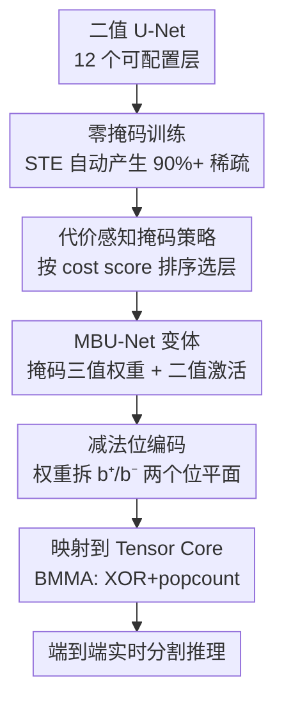

# Zeros Can Be Informative: Masked Binary U-Net for Image Segmentation on Tensor Cores

**会议**: ICLR 2026  
**论文**: [OpenReview](https://openreview.net/forum?id=zeros-can-be-informative)（⚠️ 链接以原文为准）  
**代码**: https://github.com/ChunshuWu/MBU-Net  
**领域**: 模型压缩 / 量化 / 高效推理  
**关键词**: 二值网络, 三值量化, U-Net, Tensor Core, 实时分割

## 一句话总结
作者发现给二值 U-Net 的权重加一个显式的「零」状态能让稀疏度飙到 90%+ 并大幅回血精度，于是提出按"性价比"挑选关键层做零掩码的 **MBU-Net**，再用一套"减法位编码"把这种掩码二值权重直接映射到 GPU 的二值 Tensor Core（BMMA）上，在 3 个分割数据集上做到接近全精度的精度（平均掉 3%）的同时相比 FP16 U-Net 提速 2.04×、能耗降 3.54×。

## 研究背景与动机

**领域现状**：AR/VR、无人机、自动驾驶这些边缘场景需要实时（如 60 Hz）、低功耗（几瓦）的高分辨率图像分割。相比 ViT/SAM 这些重模型，U-Net 凭借编码器-解码器 + skip connection 的结构在精度/效率上更划算，但在高分辨率视频上跑实时仍然顶不住边缘设备的算力、显存和功耗预算。量化（尤其是把权重和激活都压到 1-bit 的二值网络）是最激进的提效路径——MAC 乘加直接退化成 XNOR/XOR + popcount 位运算，硬件极其友好。

**现有痛点**：极端量化有两个老大难。其一，**精度崩**——纯二值表示把权重逼到 $\{-1,+1\}$，每条连接都被强制"表态"，没有一个中性状态去抑制不确定/噪声信号，U-Net 这种密集预测任务掉点尤其惨（论文里纯 Binary 在 Carvana 上 Dice 只有 0.662，而全精度是 0.997）。其二，**落地难**——大量二值/三值方法只是算法层面的 proof-of-concept，或者只为定制 FPGA/ASIC 数据通路设计，在通用 GPU 上做端到端 U-Net 高性能实现几乎是空白，尤其没人把它跑到 Tensor Core 上。

**核心矛盾**：二值的"硬件友好"和"精度可用"之间存在直接 trade-off；而即便算法上把精度补回来，通用 GPU 上也没有现成内核能高效执行这种"带掩码的二值"权重——BMMA（二值 Tensor Core 指令）功能存在但实验性、未被 cuBLAS/cuDNN 暴露，长期被闲置。

**本文目标**：拆成两个具体子问题——(1) 怎样让 U-Net 在分割任务上同时拿到接近全精度的精度和接近二值的效率？(2) 怎样不依赖专用加速器、就在常见 GPU 上把这份效率真正交付出来？

**切入角度**：作者做了两个关键经验观察。**观察一**：给二值权重训练时加上零掩码，不仅精度明显回血，权重还自发变得极稀疏——很多层零的比例超 90%，部分层稳定超 95%，远多于 +1/-1，说明大量信号本就该被"零"抑制掉。**观察二**：对 4000 个逐层量化配置做穷举扫描后发现，掩码任意单层对精度的影响是大致均等的（量化敏感度跨层均匀）。

**核心 idea**：既然零状态是稀缺的"精度补丁"、而各层贡献又差不多，那就**优先给"便宜"的层加掩码**——用最小的额外计算换最大的精度收益（典型例子：转置卷积层计算量极小却对精度至关重要）；再用减法位编码把掩码二值权重塞进二值 Tensor Core 的原生指令里跑起来。

## 方法详解

### 整体框架

MBU-Net 把一个 U-Net 抽象成 **12 个可配置层**（编码器 4 个双卷积 down-C1~4、解码器 4 个转置卷积 up-CT1~4、解码器 4 个双卷积 up-T1~4），每层可以是"纯二值"或"掩码三值"两种状态之一，构成 $2^{12}$ 的设计空间。整条管线分两段：**算法侧**先靠两个经验观察 + 一个**代价感知掩码策略**从这个庞大空间里挑出"该掩码哪些层"，得到一族 MBU-Net 变体（在精度/效率间取不同折中点）；**系统侧**再用**减法位编码**把挑好的掩码二值权重（配二值激活）映射到 GPU Tensor Core 的 BMMA 指令上，做成端到端、可在 A100/H100/Jetson Orin/2080 Ti 上跑的高吞吐内核。换句话说，前半段决定"网络长什么样"，后半段决定"它怎么在硬件上高效跑"。

### 关键设计

**1. 零掩码训练：给二值权重补一个能"沉默"的中性状态**

针对纯二值"每条连接都被迫表态、无法抑制噪声"的痛点，作者在权重里引入一个显式的零状态，把权重从二值 $\{-1,+1\}$ 扩成三值 $\{-1,0,+1\}$，而**激活仍保持二值**（这点很关键，下面位编码靠它）。零掩码不是手工设阈值，而是通过 STE（Straight-Through Estimator）训练时自动产生——前向用三值、反向用直通梯度近似不可导的量化。效果是双重的：一方面精度大幅回血（纯 Binary 的 Carvana Dice 0.662 → MBU-Net 0.981），另一方面权重自发高度稀疏（平均每层 >80% 是零，很多 >90%，部分 >95%）。作者由此提出标题里的论点——"零是有信息量的"：大量本该被抑制的信号，正是靠零这个中性档位被静音掉，只保留一小撮真正关键的 ±1 连接。

**2. 代价感知掩码策略：把稀缺的掩码额度花在"最便宜"的层上**

掩码虽好但不免费——三值层比纯二值层多一份计算/存储开销，全部层都掩码会让运算量翻倍（图 3b：全掩码 >0.12 TOPs，而轻掩码 0.08 TOPs 就能拿到相当精度）。配合观察二（各层量化敏感度均匀，图 3c 的 Shapley 边际增益跨层可比），作者得出一个朴素但实用的策略：**别每层都掩码，优先掩码那些"便宜"的层**。具体做法是为每层 $l$ 定义加权代价分数

$$s^l_{cost} = w_{op}\hat{n}^l_{op} + w_{param}\hat{n}^l_{param}$$

其中 $\hat{n}^l_{op}$、$\hat{n}^l_{param}$ 是该层归一化到 $[0,1]$ 的运算数和参数量，$w_{op}+w_{param}=1$ 为超参（实验默认各 0.5）。把所有层按 $s_{cost}$ 从低到高排成"掩码优先级表"，再按需从便宜的层开始往上掩码，就能在 Pareto 前沿上滑动选点。这之所以成立，是因为转置卷积层这类层运算量比别的层少 1~2 个数量级、却对精度至关重要——掩码它们几乎零成本却收益巨大，是典型的"高性价比"目标。

**3. 减法位编码：把三值权重拆成两个二值位平面，复用 BMMA 原生指令**

精度问题解决后，系统侧的痛点是：Tensor Core 的二值指令只认 XOR + popcount，没法原生算"含 0 的三值权重×二值激活"。作者的巧解是把每个三值权重写成两个二值位平面的差：$b_i = b^{pos}_i - b^{neg}_i$，其中 $b^{pos}_i, b^{neg}_i \in \{0,1\}$（即 +1 编码为 (1,0)、-1 为 (0,1)、0 为 (0,0)）。这样二值激活 $a$ 与三值权重 $b$ 的 MAC 就能完全用位运算表达：

$$a \cdot b = n + \text{popc}(a' \oplus b^{neg}) - \text{popc}(a' \oplus b^{pos})$$

相比原始 XNOR-Net 公式（式 1）只差一点——用 XOR 替代 XNOR 以兼容 Tensor Core 的内建指令。于是一个掩码层就拆成对两个位平面各做一次二值 WMMA/BMMA：内核以 $8\times8\times128$ 的位 tile 在 warp 层操作，分别累加得到 $C_{pos}$、$C_{neg}$，相减得临时结果 $R$，再用一次阈值比较 $A_{out} \leftarrow (R \ge \theta)$ 一并吃掉 BatchNorm、bias 和二值激活（BNN 标准做法），最后用 ballot/brev 等 intrinsic 打包位并写回。整个掩码二值卷积因此被自然纳入二值 Tensor Core 范式，无需专用硬件就在通用 GPU 上跑起来。

### 损失函数 / 训练策略
训练沿用 BNN 标准范式：前向对激活用 $x_b = \text{sign}(x)$ 二值化、对权重用三值量化，反向用 STE 近似不可导量化的梯度，零掩码在训练中自动浮现。代价感知策略不参与训练、只决定哪些层启用掩码（推理时配置）。量化实验中首末两个卷积层保持全精度（BNN 常规做法）。

## 实验关键数据

实验在 A100 / H100 / Jetson Orin Nano / RTX 2080 Ti 四个平台、Carvana（车辆）/ ISIC（皮肤病灶）/ Nuclei（细胞核）三个分割数据集上进行；U-Net 约 16M 参数，输入 0.25M~0.6M 像素。

### 主实验：精度对比（Dice / IoU / F1，越高越好）

| 配置（权重-激活） | Carvana Dice | ISIC Dice | Nuclei Dice | 说明 |
|------|------|------|------|------|
| Full Precision | 0.997 | 0.771 | 0.867 | FP32/FP16 全精度 |
| INT8 | 0.994 | 0.763 | 0.823 | 8-bit |
| INT4 | 0.989 | 0.753 | 0.819 | 4-bit |
| **MBU-Net** | **0.981** | **0.750** | **0.817** | 掩码三值权重 + 二值激活 |
| Binary | 0.662 | 0.560 | 0.434 | 纯二值，精度崩 |

MBU-Net 相对全精度平均只掉 0.029 / 0.037 / 0.024（Dice / IoU / F1），而纯 Binary 在 Carvana 上 Dice 暴跌到 0.662——零掩码把精度从"不可用"拉回"接近全精度"。

### 效率对比（相对基线的平均提升）

| 对比基线 | 加速比（MBU-Net） | 能耗降低（MBU-Net） |
|------|------|------|
| FP32 U-Net | 4.83× | 8.53× |
| FP16 U-Net | 2.04× | 3.54× |
| INT8（A100, TensorRT） | 1.52× | 2.09× |
| INT4（A100, TensorRT） | 2.23× | 2.63× |

### 消融 / 分析

| 配置 | 关键现象 | 说明 |
|------|---------|------|
| 全掩码 vs 轻掩码 | 全掩码 >0.12 TOPs，轻掩码 0.08 TOPs 精度相当 | 全部层掩码没必要，浪费 ~2× 运算 |
| 逐层 Shapley 边际增益 | 各层贡献大致均等 | 支撑"优先掩码便宜层"策略 |
| 转置卷积层 | 运算量比别层少 1~2 数量级、却精度关键 | 高性价比掩码目标 |
| 更高位宽权重 vs 掩码二值 | 仅边际提升 | 说明三值掩码已接近够用 |

### 关键发现
- **零状态是精度回血的主力**：纯 Binary 与 MBU-Net 唯一差别就是那个显式零，却带来 Carvana Dice +0.32 的巨大差距——印证"零是有信息量的"。
- **稀疏是副产品但很可观**：平均每层 >80% 权重为零，意味着真正承载信息的连接极少，给后续专用硬件的窄数据通路留足想象空间。
- **掩码该花在便宜层**：由于各层量化敏感度均匀，挑代价低的层（尤其转置卷积）掩码即可逼近全掩码精度，运算量却省近一半。
- **硬件相关的反直觉点**：H100（Hopper）移除了原生 BMMA 支持，导致 MBU-Net/Binary 在 H100 上反而被 FP16 latency 反超——⚠️ 这是平台特性，不是算法退化，以原文为准。

## 亮点与洞察
- **"零是有信息量的"这个 reframe 很漂亮**：把稀疏从"压缩副作用"重新解读成"主动抑制噪声的中性档位"，给二值网络补的不是位宽而是一个表达"沉默"的能力，既提精度又自然稀疏，一举两得。
- **减法位编码是真正落地的关键 trick**：用 $b = b^{pos} - b^{neg}$ 把三值拆成两个二值平面、用 XOR 替 XNOR，就把"带零的三值权重"无缝塞进只认二值的 BMMA 指令——这个工程映射让算法收益第一次在通用 GPU 上兑现，可迁移到任何想用 Tensor Core 跑三值/掩码权重的场景。
- **代价感知策略思路通用**：在"各层敏感度均匀但成本悬殊"的前提下，按性价比排序选层做某种昂贵操作（掩码/高位宽/注意力），是一个可复用到混合精度量化、结构化剪枝的调度范式。

## 局限与展望
- **依赖 BMMA 硬件支持**：方法的效率红利建立在 GPU 暴露二值 Tensor Core 指令上，而 Hopper 已移除原生 BMMA——这意味着加速优势在新架构上可能不稳定，作者也在 H100 上观察到被 FP16 反超。
- **激活仍是二值、没探到更激进的激活量化**：方法把零状态只给了权重，激活保持二值以省数据搬运；激活端能否也引入掩码、是否会进一步提精度未充分展开。
- **代价分数靠手工归一 + 等权超参**：$w_{op}=w_{param}=0.5$ 是经验设定，缺乏对不同模型/任务自适应选权的研究；穷举扫描只在 Carvana 上做，跨数据集的策略稳健性是隐含假设。
- **任务范围聚焦分割小图**：输入 0.25M~0.6M 像素、U-Net 仅 16M 参数，更大模型 / 更高分辨率 / 生成式 U-Net（DDPM backbone）上是否依然成立有待验证。

## 相关工作与启发
- **vs 纯 BNN（XNOR-Net / BNN）**：它们权重激活全二值、MAC 退化成 XNOR+popcount，但 U-Net 分割上精度崩；本文加一个零状态 + 减法位编码，在几乎不破坏硬件友好性的前提下把精度拉回近全精度。
- **vs 三值/混合量化（FATNN / TAB / TWN / TTQ）**：这些方法多停在算法层或定制 FPGA/ASIC，没人分析 U-Net 逐层贡献、也没给通用 GPU 上的端到端 Tensor Core 实现；本文的差异正是"算法洞察 + 代价感知调度 + BMMA 落地"三件套打通。
- **vs 大模型分割（ViT / SAM）**：后者精度高但参数与算力对边缘设备过重；本文走相反路线，押注轻量 U-Net + 极端量化做实时低功耗部署。

## 评分
- 新颖性: ⭐⭐⭐⭐ "零有信息量"的重新解读 + 减法位编码落地，角度新且实用，但单点创新而非范式级
- 实验充分度: ⭐⭐⭐⭐ 4 平台 × 3 数据集、精度/延迟/能耗/Pareto 都覆盖，惜大模型与高分辨率外推不足
- 写作质量: ⭐⭐⭐⭐ 观察→策略→硬件三段逻辑清晰，图表支撑到位
- 价值: ⭐⭐⭐⭐ 给边缘实时分割提供了可在通用 GPU 落地的量化方案，工程价值高

<!-- RELATED:START -->

## 相关论文

- [\[ICML 2026\] Selective Coupling of Decoupled Informative Regions: Masked Attention Alignment for Data-Free Quantization of Vision Transformers](../../ICML2026/model_compression/selective_coupling_of_decoupled_informative_regions_masked_attention_alignment_f.md)
- [\[ICLR 2026\] BEP: A Binary Error Propagation Algorithm for Binary Neural Networks Training](bep_a_binary_error_propagation_algorithm_for_binary_neural_networks_training.md)
- [\[AAAI 2026\] BD-Net: Has Depth-Wise Convolution Ever Been Applied in Binary Neural Networks?](../../AAAI2026/model_compression/bd-net_has_depth-wise_convolution_ever_been_applied_in_binary_neural_networks.md)
- [\[ICLR 2026\] LeSTD: LLM Compression via Learning-based Sparse Tensor Decomposition](lestd_llm_compression_via_learning-based_sparse_tensor_decomposition.md)
- [\[ICLR 2026\] Reasoning Models Can be Accurately Pruned Via Chain-of-Thought Reconstruction](reasoning_models_can_be_accurately_pruned_via_chain-of-thought_reconstruction.md)

<!-- RELATED:END -->
