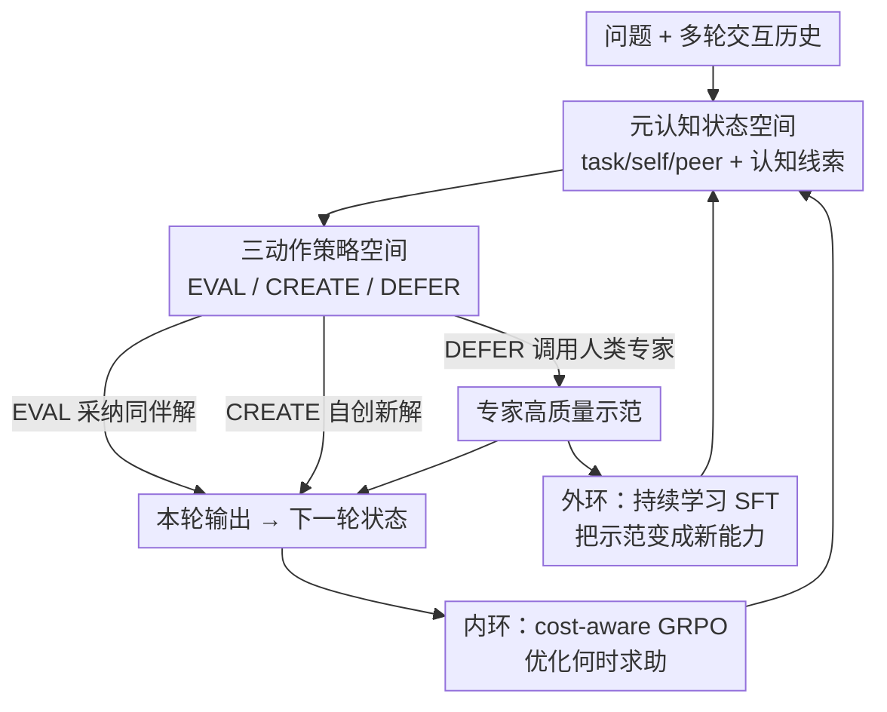

# Adaptive Collaboration with Humans: Metacognitive Policy Optimization for Multi-Agent LLMs with Continual Learning

**会议**: ICLR2026  
**OpenReview**: [https://openreview.net/forum?id=IKVUB9Exuc](https://openreview.net/forum?id=IKVUB9Exuc)  
**代码**: https://github.com/USC-Melady/HILA.git  
**领域**: 多智能体 / 人在回路 / LLM 协作  
**关键词**: 多智能体系统、人在回路、元认知策略、GRPO、持续学习

## 一句话总结
提出 HILA 框架，让多智能体 LLM 学会一套"元认知策略"——自己判断什么时候能独立解题、什么时候该把问题交给人类专家；再用 Dual-Loop Policy Optimization 把"何时求助"（内环强化学习）和"如何从求助中长本事"（外环持续学习）分开优化，在数学推理等基准上稳定超过现有自主多智能体系统。

## 研究背景与动机
**领域现状**：把单个 LLM 做大已经收益递减，下一步靠"协作变强"——多智能体系统（MAS）让多个 agent 通过辩论、拓扑控制、工作流图优化等协议互相配合，解决单模型搞不定的复杂推理任务。

**现有痛点**：纯自主的 MAS 本质上是"闭世界"系统。无论交互协议多精巧，所有 agent 的知识上限都被预训练语料锁死——它们只能重组已有信息，无法产生新知识或适应训练数据之外的情境。一旦任务需要实时信息、领域专长或训练里没见过的推理模式，内部再怎么讨论也补不上这个缺口，常常集体失败。

**核心矛盾**：要打破知识天花板，唯一原则性的出路是引入外部人类专家。但已有的人在回路系统把人当成"被动的神谕/子任务监督者"，留下两个没解决的关键问题——**何时求助**（when to ask）往往退化成"低置信度阈值"之类的启发式规则，而非学出来的策略；**如何成长**（how to grow）则把人类反馈当成"一次性补丁"，用完即弃，没能转化成长期能力。

**本文目标**：让 agent 不是简单地"把人塞进回路"，而是学会一套元认知策略，既能在不确定时权衡"失败风险 vs 求助成本"决定何时求助，又能把每次专家反馈沉淀成持久的推理能力。

**切入角度**：关键不在于 agent 能不能跟人交互，而在于能不能**有策略地、聪明地**交互。这需要一个对"自身能力 + 同伴能力"做高层推理的元认知策略，并把短期决策与长期成长**解耦**优化。

**核心 idea**：用一个可学习的元认知策略（EVAL/CREATE/DEFER 三动作）替代手工置信度阈值来决定何时 defer，再用双环优化把 defer 事件既当即时奖励信号、又当持续学习的监督样本，从而把"闭世界"MAS 变成能持续进化的"开世界"系统。

## 方法详解

### 整体框架
HILA（Human-In-the-Loop Multi-Agent Collaboration）把人机协作建模成一个**元认知马尔可夫决策过程**（Meta-MDP）：决策对象不是底层文字生成，而是"自主解题还是求助专家"这种高层认知策略。多轮协作中，$N$ 个 agent 在每一轮共享同一个认知状态 $s_t$，各自独立从策略 $\pi_\theta(a|s_t)$ 采样一个元认知动作并并行执行；动作结果汇集成下一轮状态 $s_{t+1}$。

整套系统由两部分耦合而成：**前端**是 HILA 的三动作协作协议（自主运行 → 元认知评估 → 策略性求助），定义了 agent 怎么观察状态、怎么在 EVAL/CREATE/DEFER 之间选择；**后端**是 Dual-Loop Policy Optimization（DLPO）训练范式，把这套元认知行为优化好——**内环**用带成本惩罚的 GRPO 在线打磨"何时 defer"的决策，**外环**把 DEFER 触发的专家示范存成离线监督样本做持续学习，直接抬高底座模型的推理能力上限。两环联合优化，形成"徒弟—师傅"动态：徒弟有策略地求助，并把每次指点系统性地内化成自己的本事。

### 关键设计

**1. 元认知状态空间：让策略基于全局协作语境而非单条局部回答做决策**

痛点是：若只看 agent 自己最新那条回答就决定要不要求助，会丢掉协作中最关键的"同伴一致性""自我可靠性"信息，导致判断片面。HILA 把策略状态 $s_t$ 设计成三类语境的拼接：任务语境 $x_t^{task}$（原始问题 + 交互历史，界定目标）、自身语境 $x_t^{self}$（自己最新解 + 局部推理状态，反映置信）、同伴语境 $x_t^{peer}$（其他 agent 的回答，提供一致/冲突/替代解路径的旁证）。在此之上，还可选地拼接三组**结构化认知线索**：社会共识线索 $z_t^{soc}$（收敛 vs 冲突）、元认知监控线索 $z_t^{mon}$（当前解的局部可靠性）、认知控制线索 $z_t^{ctrl}$（继续内部思考有用 vs 该升级求助）。形式上

$$s_t = \mathrm{concat}\big(x_t^{task}, x_t^{self}, x_t^{peer}, z_t^{soc}, z_t^{mon}, z_t^{ctrl}\big)$$

这三组线索都用轻量的解析/规则启发式从可观测交互轨迹里算出来，**不引入额外可学习模块或外部监督**，给元策略一个显式、面向决策的状态抽象，同时保持结构化部分轻量、只起辅助作用。

**2. 三动作策略空间：把"利用 / 探索 / 求助"做成离散的高层认知选择**

现有方法把求助塞进一个隐式阈值里，agent 没有显式的"协作姿态"可选。HILA 把动作空间定义成 $A=\{a_{eval}, a_{create}, a_{defer}\}$，对应三种泾渭分明的认知立场。**EVAL（利用集体知识）**是收敛/综合姿态：agent 从本轮同伴已提出的解里选一个并背书，强化高质量、有共识的方案。**CREATE（创造性探索）**是发散姿态：agent 判断当前解池不够好，从零生成一条新的 `(Choice, Reason)` 解序列，用来打破认知定势、纠正群体共享的错误、引入潜在更优的推理路径。**DEFER（风险缓释 + 知识增强）**是最高层的元认知觉察——承认系统自身能力的边界：当 agent 评估问题的不确定性/难度超出集体可靠求解的范围时触发，调用外部人类专家，把专家的高质量示范作为本轮输出。执行时本轮输出按动作分流：

$$y_{i,t} = \begin{cases} g_\theta(s_t), & a_{i,t}\in\{a_{eval}, a_{create}\}\\ y_{human,t}, & a_{i,t}=a_{defer}\end{cases}$$

DEFER 的妙处在于它**身兼两职**：既是当下"用专家解覆盖掉有缺陷的解"的风险缓释，又是给外环持续学习注入新知识的入口——人类不再是被动神谕，而是系统进化的驱动力。

**3. 内环：cost-aware GRPO 学"何时该求助"**

自主解题是"高风险高回报"，求助专家是"低风险但受限"，这个权衡天然适合强化学习。内环用 Group Relative Policy Optimization（GRPO）优化高层策略 $\pi_\theta(a|s_t)$，关键是奖励函数要同时编码"对错"和"动作成本"：

$$R(s_t, a_t) = \begin{cases} R_{gt}(\hat{y}(a_t)), & a_t=\text{EVAL}\\ R_{gt}(\hat{y}(a_t)) - C_{create}, & a_t=\text{CREATE}\\ R_{gt}(\hat{y}_{human}(a_t)) - C_{defer}, & a_t=\text{DEFER}\end{cases}$$

其中 $R_{gt}$ 是任务正确性奖励（如二值对错），$C_{create}$ 和 $C_{defer}$ 是小的可调惩罚，满足 $C_{defer} > C_{create}\ge 0$——这样正确性仍是主信号，但当多个动作结果都差不多好时，策略会倾向选成本更低的动作（少瞎创、少求助）。GRPO 用组内中心化算优势：$A(s_t, a_k)=R(s_t, a_k)-\frac{1}{K}\sum_j R(s_t, a_j)$，策略梯度损失 $L_{PG}=-\mathbb{E}[A(s_t, a_t)\log\pi_\theta(a_t|s_t)]$，再加 KL 惩罚（约束偏离参考策略）和熵奖励（鼓励探索）保证稳定：$L_{Inner}=L_{PG}+\beta_{kl}L_{KL}-\beta_{ent}L_{Entropy}$。

**4. 外环：持续学习把"专家示范"转成底座模型的新能力**

光靠内环 RL 只能改进"怎么用现有能力"，改不动底座 LLM 的知识天花板——它优化的是决策策略，不引入根本性的新技能。外环专门负责"扩能力"：它由 DEFER 动作激活（说明 agent 识别到了知识缺口），把专家返回的高质量示范 $y_{human}=(t_1,\dots,t_L)$ 转成一条 SFT 样本，最小化条件交叉熵 $L_{SFT}(\theta)=-\sum_i \log\pi_\theta(t_i|s_t, t_{1:i-1})$。于是内环决定"何时 defer"、外环教"从专家输入里学什么"。最终把两环联合成单一目标，用指示函数确保只有 DEFER 时才施加 SFT 损失：

$$L_{total}(\theta)=\mathbb{E}_{(s_t, a_t)}\big[L_{Inner}(\theta) + \lambda_{sft}\cdot \mathbb{I}(a_t=a_{defer})\cdot L_{SFT}(\theta)\big]$$

$\lambda_{sft}$ 平衡两类信号。这样训出来的单个 agent 既"策略上精明"（知道何时求助），又"持续在长本事"（每次求助都沉淀进底座）。

## 实验关键数据

### 主实验
在 LLaMA3-8B 底座上，跨数学推理（GSM8K / AMC / AIME）、程序合成（HumanEval）、通用理解（MMLU）评测，用 GPT-4o-mini 作为"人类专家"代理。HILA 在所有基准上都超过最强的自主多智能体基线，竞赛级数学（AMC/AIME，最容易因前提错误而级联失败）上提升尤其显著。

| 方法 | 类型 | GSM8K | AMC | AIME | HumanEval | MMLU |
|------|------|-------|-----|------|-----------|------|
| Vanilla | 单agent | 72.76 | 8.03 | 2.96 | 47.56 | 57.99 |
| LLM-Debate | 多agent | 83.52 | 19.28 | 5.56 | 57.72 | 67.59 |
| GPTSwarm | 多agent | 84.89 | 15.66 | 5.78 | 59.55 | 69.67 |
| AFlow | 多agent | 83.75 | 12.05 | 4.44 | 62.20 | 69.31 |
| **HILA** | 多agent | **89.86** | **35.83** | **9.37** | **72.15** | **73.62** |

相对最强自主基线，AMC 上从约 20.5 拉到 35.83、AIME 上从约 5.8 拉到 9.37，绝对提升约 3.7~15.4 个点。跨四种底座（Qwen2.5-7B/3B、LLaMA3-8B/3B）在 GSM8K 上 HILA 全部夺冠，且越弱的底座增益越大（LLaMA3-3B 上相对 Vanilla +38.59 个点），说明框架不绑定特定模型家族或规模。

### 消融实验
逐步加强训练机制（初始策略 → 只加内环 GRPO → 完整 DLPO），拆解"策略学习"与"能力增长"各自的贡献：

| 配置 | GSM8K | AMC | MMLU | 说明 |
|------|-------|-----|------|------|
| HILA (Init Policy) | 88.15 | 33.33 | 68.30 | 未优化策略 |
| HILA + GRPO | 88.38 | 32.50 | 70.47 | 只加内环策略优化 |
| HILA + DLPO | 89.86 | 35.83 | 73.62 | 再加外环持续学习 |

只加 GRPO 时整体提升有限（主要体现在更可靠的策略控制而非普遍涨点），加上完整 DLPO 才出现第二段明显提升——说明增益不能只用"动作选得更好"解释，外环监督把 defer 事件转成了持久的推理能力。

### 关键发现
- **外环是涨点主力**：把 DLPO 训练后的底座换进标准推理流程（单agent prompting、自主 MAS），即便下游方法**不做**策略性 defer，性能也一致提升（Vanilla 72.76→82.11、DyLAN 82.03→88.32），证明训练中收集的专家示范是在抬高底座 LLM 的通用推理能力，而非只帮 HILA 做更好的局部决策。
- **训练让系统学会"少求助"**：随训练推进，DEFER 占比在三个基准上持续下降（GSM8K 29%→26%→17%、MMLU 19%→15%→5%），EVAL 占比显著上升。GRPO 让 agent 因 defer 有惩罚而更挑剔（学"何时该问"），DLPO 进一步让 agent 因底座变强而"根本不需要问"。
- **专家越强、增益越大**：人类代理从 gpt-3.5-turbo → gpt-4o-mini → gpt-4o，三个基准上性能单调提升——HILA 的收益既取决于"学会何时 defer"，也取决于"defer 给谁"，策略与专家质量互补。
- **协作规模/轮数的权衡**：增加 agent 数量带来更广的集体探索、初期涨点明显但很快边际递减，而 token 成本陡升；增加交互轮数呈非单调（先升后降），中等深度最优。

## 亮点与洞察
- **把"何时求助"从启发式升级成可学策略**：以往 human-in-the-loop 用置信度阈值触发求助，HILA 把它变成 Meta-MDP 上的 RL 决策，并用 cost-aware reward 显式编码"求助有代价"，这个建模可迁移到任何"自主 vs 求助/调用工具/查检索"的权衡场景。
- **双环解耦是真正的"啊哈"点**：内环管"用好现有能力"、外环管"长出新能力"，并用指示函数让 SFT 只在 DEFER 时触发——把昂贵的人类反馈精准地用在知识缺口处，而不是无差别微调，数据效率高。
- **DEFER 一举两得**：同一个动作既是即时风险缓释（覆盖错误解）、又是持续学习的数据入口，这种"决策即采样"的设计避免了额外搭一套数据收集管线。
- **可迁移的 trick**：外环产出的"更强底座"能脱离 HILA 协议独立复用，相当于把多智能体协作 + 人类反馈蒸馏成了一个更好的单模型——这对部署很友好。

## 局限与展望
- **"人类专家"是 LLM 代理**：实验用 GPT-4o-mini/GPT-4o 模拟人类，真实人类专家的噪声、不一致、延迟和成本都未建模，落到真人在回路时效果存疑。
- **结构化认知线索靠规则启发式**：$z^{soc}/z^{mon}/z^{ctrl}$ 用解析/规则算出，在更开放、非选择题式的任务上（共识、可靠性难以规则化）可能失效。
- **成本惩罚 $C_{create}/C_{defer}$ 是手调超参**：DEFER 频率对这两个惩罚和 $\lambda_{sft}$ 敏感，论文未给出自适应调参方案。
- **协作规模/轮数边际递减且成本陡升**：更大集体的收益不线性、token 成本却快速上涨，实际部署需要在精度与开销间手动取舍。
- **改进方向**：让认知线索可学、引入对人类反馈噪声鲁棒的外环、把成本权衡做成自适应（按预算动态调 $C_{defer}$），并在真实多人专家场景验证。

## 相关工作与启发
- **vs 自主 MAS（LLM-Debate / DyLAN / GPTSwarm / AFlow）**：它们靠辩论、拓扑控制、工作流图优化在内部"集体内省"，把已有知识重组到极致，但被预训练知识边界锁死——是强大的整合器而非真正的学习者。HILA 通过策略性引入外部专家打破知识天花板，并把反馈持续学进底座。
- **vs 传统人在回路系统（把人当神谕/子任务监督）**：它们用置信度阈值等启发式触发求助、把反馈当一次性补丁。HILA 把"何时求助"学成策略、把"如何成长"做成外环持续学习。
- **vs LLM 中介的 MARL 引导（Siedler & Gemp, 2025）**：那里 LLM 当自然语言控制器去塑造 agent 学习轨迹；HILA 相反，是让 agent 学会主动判断何时把控制权交给人类专家。

## 评分
- 新颖性: ⭐⭐⭐⭐ 把元认知策略 + 双环解耦优化引入人机多智能体协作，建模角度新颖
- 实验充分度: ⭐⭐⭐⭐ 五基准 + 四底座 + 多组消融（策略分布、专家强度、规模/轮数），但"人类"是 LLM 代理
- 写作质量: ⭐⭐⭐⭐ 动机—方法—实验逻辑清晰，公式与表格自洽
- 价值: ⭐⭐⭐⭐ 为"持续进化的开世界 agentic 系统"提供了可落地的原则性框架，外环蒸馏底座的发现尤具实用价值

<!-- RELATED:START -->

## 相关论文

- [\[ICLR 2026\] AgentPO: Enhancing Multi-Agent Collaboration via Reinforcement Learning](agentpo_enhancing_multi-agent_collaboration_via_reinforcement_learning.md)
- [\[ICML 2026\] OMAC: A Holistic Optimization Framework for LLM-Based Multi-Agent Collaboration](../../ICML2026/multi_agent/omac_a_holistic_optimization_framework_for_llm-based_multi-agent_collaboration.md)
- [\[ICLR 2026\] Learning to Summarize by Learning to Quiz: Adversarial Agentic Collaboration for Long Document Summarization](learning_to_summarize_by_learning_to_quiz_adversarial_agentic_collaboration_for_.md)
- [\[ACL 2026\] ATLAS: Adaptive Trading with LLM AgentS Through Dynamic Prompt Optimization and Multi-Agent Coordination](../../ACL2026/multi_agent/atlas_adaptive_trading_with_llm_agents_through_dynamic_prompt_optimization_and_m.md)
- [\[ACL 2026\] MAGEO: From Experience to Skill — Multi-Agent Generative Engine Optimization via Reusable Strategy Learning](../../ACL2026/multi_agent/from_experience_to_skill_multi-agent_generative_engine_optimization_via_reusable.md)

<!-- RELATED:END -->
