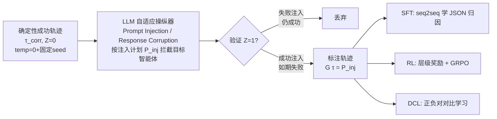

# Aegis: Automated Error Generation and Attribution for Multi-Agent Systems

**会议**: ICLR 2026  
**OpenReview**: [https://openreview.net/forum?id=zqcYoxXiN3](https://openreview.net/forum?id=zqcYoxXiN3)  
**代码**: 开源（论文承诺释放全部 code/data/models）  
**领域**: 多智能体系统 / 错误归因 / 数据集与基准  
**关键词**: 多智能体系统, 错误归因, 自动数据合成, 错误注入, 对比学习  

## 一句话总结
Aegis 用一个 LLM 操纵器把成功的多智能体轨迹"主动注入"成带标签的失败轨迹，自动造出 9,533 条标注了"出错智能体 + 错误模式"的数据，从而把昂贵的人工标注瓶颈变成可规模化的工程问题，并支持 SFT / RL / 对比学习三种范式训练错误归因模型。

## 研究背景与动机
**领域现状**：基于 LLM 的多智能体系统（MAS）通过把任务拆给多个专职智能体协作，在数学推理、科学发现、软件工程等复杂任务上取得显著进展。但这种"agentic 分解"带来了结构性脆弱：单个智能体的错误会沿着交互链级联放大，最终观测到的失败往往离最初的肇事点很远，使得根因分析和系统化调试极其困难。

**现有痛点**：MAS 错误归因研究被**数据稀缺**死死卡住。现有基准小得惊人——Who&When 只有 184 条标注错误，MASFT 只分析了 150 多个任务总结出 14 种错误模式，TRAIL 只有 148 条轨迹。它们全都依赖专家手工标注复杂执行日志，代价高、不可扩展。

**核心矛盾**：这形成了一个"可扩展性死锁"——SOTA LLM 当前的错误归因能力本就有限，本来需要大规模任务专用数据来突破，但手工造这种数据又贵到离谱。与此同时，AI 社区已经在推理、代码等领域大量用合成数据打破了数据稀缺，唯独 MAS 错误归因这块还是空白。

**本文目标**：把"人工标注瓶颈"转化为"可规模化的工程问题"，自动生成大规模、多样、标签可复现的 MAS 错误轨迹数据集。

**核心 idea**：**逆向造数据**——与其从真实失败里艰难标注根因，不如从**已知正确**的轨迹出发，用 LLM 操纵器**主动注入**符合错误模式分类的故障；因为故障是"我亲手注入的"，所以 ground-truth 标签（哪个智能体、犯了什么错）**by construction 天然已知**，无需任何人工标注。

## 方法详解

### 整体框架
Aegis 分两大块：**数据构造管线**（左）把成功轨迹变成带标注的失败轨迹，**学习方法**（右）在这份数据上用三种范式训练归因模型。数据构造遵循三阶段：(1) 在多种 MAS 框架下收集确定性的成功基线轨迹；(2) 用自适应操纵器注入定向干预，造出每条基线的多个故障变体；(3) 验证结果，只保留"如预期失败"且标签可靠的轨迹。最终覆盖 6 个 MAS 框架 + 6 个基准，产出 9,533 条标注错误轨迹。

### 关键设计

**1. 问题形式化：把错误归因定义为"智能体–错误模式对"的集合预测。** MAS 记为 $M$，由 $k$ 个智能体 $N=\{n_1,\dots,n_k\}$ 组成，调度策略 $\sigma:S\to N$ 在每步决定活跃智能体，交互产生轨迹 $\tau=(s_0,a_0,\dots,s_T)$，结果由二值函数 $Z(\tau)\in\{0,1\}$ 评判（$Z=1$ 为失败）。当失败发生时，ground-truth 是一个结构化标签 $G(\tau)=\{(n^*_1,Y^*_1),(n^*_2,Y^*_2),\dots\}$，其中 $n^*_i$ 是肇事智能体、$Y^*_i\subseteq Y$ 是它犯下的错误模式集合（$Y$ 是 $M=14$ 种错误模式的分类）。诊断模型 $f_\theta:\tau\mapsto\hat G(\tau)\approx G(\tau)$。这套形式化把模糊的"调试"变成了可量化、可多粒度评测的多标签预测任务。

**2. LLM 自适应操纵器：上下文感知地注入"真实感"故障。** 操纵器 $M_{\text{manip}}$ 的关键是生成**与任务相关、且对齐错误模式分类**的修改——编码任务里可能注入死循环，数学任务里则给出"看似合理但错误"的计算。它在两种攻击策略间随机选择：**Prompt Injection**（在智能体行动前篡改其输入状态）和 **Response Corruption**（用错误行动替换正确输出）。对每条正确轨迹 $\tau_{\text{corr}}$，定义一组注入计划 $P_{\text{inj}}=\{P^{(1)}_{\text{inj}},\dots,P^{(K)}_{\text{inj}}\}$，每个计划指定一组目标 $(n^*,Y^*)$ 对；在每一步，操纵器拦截目标智能体并把原行动 $a_t$ 替换成被操纵的 $a'_t=M(s_t,\pi_{n_t},P^{(j)}_{\text{inj}})$。注入故障锚定在 **MAST 分类的 14 种错误模式**（从 150+ 真实失败轨迹里实证总结而来），分三大类：Specification Issues（偏离角色）、Inter-Agent Misalignment（隐瞒关键信息）、Task Verification Failures（跳过验证），确保注入的错误来自真实失败模式而非凭空捏造。

**3. 非侵入式 wrapper + 验证保证标签因果性。** 实现基于 MASLab 统一代码库，用 monkey patching 等技术做非侵入式包装，在**不改 MAS 源码**的前提下拦截目标智能体的行为。为保证因果性，所有智能体统一用 GPT-4o-mini + temperature 0 确定性执行，而操纵器用 temperature 0.7 生成多样攻击。验证阶段只保留 $Z(\tau^{(j)}_{\text{inj}})=1$（真的如期失败）的轨迹，此时 $G(\tau^{(j)}_{\text{inj}})=P^{(j)}_{\text{inj}}$——标签就等于当初注入的计划，无需任何标注。这把"成功→故障"的成对结构天然保留下来，为后续三范式（尤其对比学习的正负对）提供基础。

**4. 三范式学习方法：一份数据喂三种范式。** SFT 把归因当 seq2seq，最小化 $L_{\text{SFT}}(\theta)=-\sum_{(\tau,G(\tau))}\log p_\theta(o|x)$，让 LLM 直接从日志生成 JSON 格式归因。RL 设计**层级奖励**提供稠密反馈：解析输出与 GT 为属性对集合，原始分 $S_{\text{raw}}=c_{\text{bonus}}+\sum_{(\hat n,\hat y)}\text{score}(\hat n,\hat y)-S_{\text{dup}}-S_{\text{quant}}$，打分函数对"完整对/仅对智能体/仅对错误模式/假阳性"给不同的**不可重复部分分**（防退化利用），再用 $R=S_{\text{raw}}/S_{\text{max}}$ 归一后用 GRPO 优化。CL 提出 **Disentangled Contrastive Learning（DCL）**，把轨迹当 turn 的 bag、用 MIL attention 加权显著 turn，再对齐到智能体原型库 $B_A$ 与错误模式原型库 $B_E$ 做解耦，复合损失 $L_{\text{DCL}}(\theta)=\lambda_{\text{cls}}L_{\text{cls}}+\lambda_{\text{con}}L_{\text{con}}+\lambda_{\text{hier}}L_{\text{hier}}$ 同时兼顾多标签分类、对比表示、以及"对概率不超过其组成的智能体/错误概率最小值"的层级一致性约束。

## 实验关键数据

### 主实验表格
Aegis-Bench（每个基准采样 100 条作测试集）+ Who&When（OOD），报告 Pair/Agent/Error 三层级的 Micro-F1（µF1）与 Macro-F1（MF1），Avg 为平均分（%）：

| 模型 | Aegis Pair µF1 | Aegis Agent µF1 | Who&When Agent µF1 | Avg |
|------|------|------|------|------|
| Random | 0.33 | 4.54 | 1.06 | 4.08 |
| DCL (Ours, 小模型) | 8.33 | 22.93 | 8.40 | 12.61 |
| Qwen2.5-14B-Instruct | 5.47 | 35.78 | 49.88 | 13.99 |
| **+ SFT (Aegis-SFT)** | **16.62** | **76.53** | 51.14 | **26.51** |
| + GRPO (Aegis-GRPO) | 6.84 | 49.74 | 54.43 | 18.41 |
| o3 | 7.86 | 40.31 | 53.10 | 20.24 |
| Gemini-2.5-Flash | 6.99 | 42.02 | 55.56 | 19.55 |
| Claude-Sonnet-4 | 7.68 | 40.73 | 44.76 | 18.16 |
| GPT-4.1 | 7.44 | 37.48 | 42.29 | 15.27 |

Aegis-SFT（26.51）超过所有 baseline，几乎把基座 Qwen2.5-14B 翻倍（13.99→26.51），且击败规模大一个数量级的专有模型（o3 20.24）。

### 消融实验表格
DCL 各组件消融（删去后 Avg 下降）：

| 变体 | Avg | 说明 |
|------|------|------|
| DCL (完整) | 12.61 | — |
| only-mix head | 12.42 ↓ | 仅混合头 |
| w/o intent | 10.16 ↓ | 去掉意图建模 |
| only-bilinear | 10.01 ↓ | 仅双线性 |
| w/o consistency | 9.52 ↓ | 去掉层级一致性，掉最多 |

层级一致性约束（$L_{\text{hier}}$）贡献最大，验证了解耦 + 一致性正则的设计价值。

### 关键发现
- **Micro-F1 显著高于 Macro-F1**：错误模式呈长尾分布，模型擅长高频失败、对罕见类别吃力，Macro-F1 才是泛化的真实指标。
- **Agent 级准确率 > Error 级**：识别"谁出错"比诊断"为什么错"更容易，后者需要更深的语义理解。
- **任务/架构影响显著**：在 Debate、AgentVerse 等结构化框架上表现好，在 Dylan、MacNet 等复杂拓扑上吃力；越难的拓扑，Aegis 微调带来的提升越大。
- **泛化性**：仅在 Aegis 上训练就能迁移到 OOD 的 Who&When，证明合成数据学到的归因能力可迁移。

## 亮点与洞察
- **逆向造数据的范式转换**：把"从真实失败标注根因"（昂贵、不可扩展）翻转成"从正确轨迹注入已知故障"（标签 by construction 免标注），是打破 MAS 错误归因可扩展性死锁的关键巧思。
- **一份数据撑三范式**：成对的"正确–故障"结构天然适配 SFT（input-target 对）、RL（多级奖励信号）、CL（正负对），数据设计的复用性极高。
- **小模型逆袭**：7B–14B 微调模型打平甚至超过大一个数量级的专有模型，说明 MAS 错误归因更吃"任务对齐的数据"而非单纯模型规模。
- **非侵入式 wrapper**：monkey patching 不改 MAS 源码即可插入故障，工程上让管线能 plug-and-play 接入任意框架。

## 局限与展望
- **注入故障 vs 自然故障的分布差**：主动注入的错误未必完全覆盖真实世界中自发涌现的失败模式，OOD 泛化虽然正向但绝对分数（Who&When Pair µF1 仅个位数）仍很低。
- **绝对性能天花板低**：即便最好的 Aegis-SFT，Pair 级 µF1 也只有 16.62，说明"智能体+错误模式"的联合精确归因仍是远未解决的难题。
- **依赖 MAST 分类**：错误模式锚定在 14 种 MAST 类别，新型/跨类别失败可能落在分类之外。
- **统一用 GPT-4o-mini 造数据**：基座智能体单一，不同能力等级智能体的失败特征可能未被充分覆盖。
- 论文也坦承部分细微失败模式（Figure 6）下所有模型（含自己）仍会失败，是开放挑战。

## 相关工作与启发
- **MAS 错误归因基准**：Who&When、MASFT、TRAIL 提供了分类和评测，但都受限于人工标注的小规模；Aegis 正是补上"大规模自动数据"这块短板。
- **自动合成数据**：与推理、代码领域的 challenger-solver 自博弈、闭环验证生成一脉相承，Aegis 把这条技术线延伸到了 MAS 错误归因。
- **分布式系统异常检测**：tracing、根因分析、拓扑感知异常检测是诊断大型服务失败的方法论背景，给 MAS 调试提供借鉴。
- **启发**：凡是"标注贵但前向过程可控"的任务，都可以考虑"从正确样本反向注入已知扰动"来零成本造标签——这套思路可迁移到代码缺陷定位、对话安全归因等场景。

## 评分
- **新颖性**: ⭐⭐⭐⭐ 「逆向注入造可验证标签」打破 MAS 错误归因数据死锁的思路简洁有力，DCL 的解耦+层级一致性也有设计感。
- **实验充分度**: ⭐⭐⭐⭐ 6 框架×6 任务×三范式，覆盖小/中/大模型与 8 个专有模型对比，含 OOD 泛化与消融，相当扎实。
- **写作质量**: ⭐⭐⭐⭐ 问题形式化清晰，三阶段管线与三范式叙述有条理，图 1 概览到位。
- **价值**: ⭐⭐⭐⭐ 开源 9,533 条数据 + 代码 + 模型，是可调试、可靠 MAS 研究的重要基础设施；但绝对归因精度仍低，离实用有距离。

<!-- RELATED:START -->

## 相关论文

- [\[ACL 2026\] Memory-Augmented LLM-based Multi-Agent System for Automated Feature Generation on Tabular Data](../../ACL2026/multi_agent/memory-augmented_llm-based_multi-agent_system_for_automated_feature_generation_o.md)
- [\[ACL 2025\] DocAgent: A Multi-Agent System for Automated Code Documentation Generation](../../ACL2025/multi_agent/docagent_a_multi-agent_system_for_automated_code_documentation_generation.md)
- [\[ACL 2026\] Seeing the Whole Elephant: A Benchmark for Failure Attribution in LLM-based Multi-Agent Systems](../../ACL2026/multi_agent/seeing_the_whole_elephant_a_benchmark_for_failure_attribution_in_llm-based_multi.md)
- [\[ACL 2026\] Towards Self-Improving Error Diagnosis in Multi-Agent Systems](../../ACL2026/multi_agent/towards_self-improving_error_diagnosis_in_multi-agent_systems.md)
- [\[ICLR 2026\] Stop Wasting Your Tokens: Towards Efficient Runtime Multi-Agent Systems](stop_wasting_your_tokens_towards_efficient_runtime_multi-agent_systems.md)

<!-- RELATED:END -->
