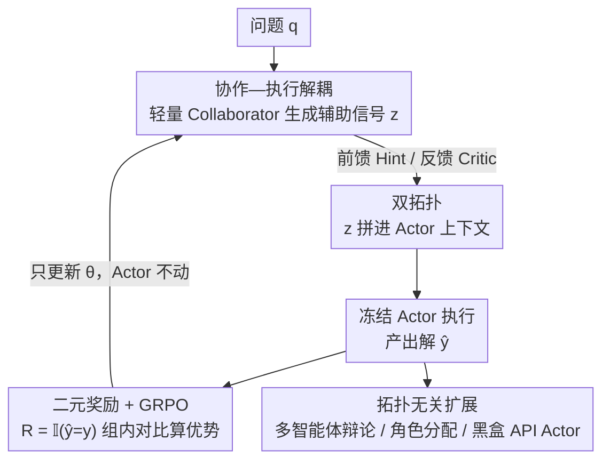

# AgentPO: Enhancing Multi-Agent Collaboration via Reinforcement Learning

**会议**: ICLR2026  
**OpenReview**: [https://openreview.net/forum?id=5L8uyzjn2l](https://openreview.net/forum?id=5L8uyzjn2l)  
**代码**: https://github.com/sunlin-ai/agentpo  
**领域**: 多智能体 / 强化学习 / LLM 推理  
**关键词**: 多智能体协作, GRPO, 协作优化, 固定拓扑, 数学推理

## 一句话总结
AgentPO 不去搜索多智能体拓扑结构，而是在一个固定拓扑里冻结强大的 Actor、只用强化学习（GRPO）训练一个轻量级 Collaborator 学会"怎么辅助队友"，仅用 500 条训练样本和 EvoAgent 7.8% 的推理开销，就在多个数学推理基准上稳定超越 Role Assignment、EvoAgent 等强基线。

## 研究背景与动机
**领域现状**：基于 LLM 的多智能体系统（MAS）通过让多个 agent 分工协作来解决单个 agent 难以处理的复杂问题。当前主流做法分两类：一类靠人工编排 agent 工作流，需要大量领域知识和提示词工程；另一类用自动化搜索去寻找最优的交互拓扑（如 ADAS、AFlow、GPTSwarm）。

**现有痛点**：人工编排的方法非常脆弱——LLM 对提示词高度敏感，一个 agent 的微小波动会沿着流程级联放大，让整个系统失稳。而自动搜索拓扑的方法面临组合爆炸：可能的拓扑数量随 agent 数指数增长，搜索很快变得不可行，且常常找不到真正有效的协作结构。

**核心矛盾**：两类方法都把研究问题框定为"什么是最优的 agent 拓扑？"——要么手搓拓扑，要么搜拓扑。但拓扑结构本身只是骨架，真正决定系统表现的是 agent 之间**怎么互动**。在一个已经不错的拓扑里，如果 agent 不会有效配合，再好的结构也发挥不出来；论文实验里就出现过"未经训练的 hint 反而把 Actor 带偏、性能跌破单模型基线"的现象。

**本文目标**：把研究问题从"找最优拓扑"重新表述为"给定一个有效的拓扑，怎么训练 agent 让它们更好地协作、最大化系统整体表现？"

**切入角度**：作者观察到，一个 MAS 里其实可以把"执行任务"和"辅助协作"两种职能拆开——让一个强大的模型专心做题（Actor），让一个轻量模型专门学习"如何帮它做对"（Collaborator）。只训练那个小的 Collaborator，既避开了昂贵的架构搜索，也不用微调动辄几十上百亿参数的 Actor。

**核心 idea**：在固定拓扑内，冻结 Actor，用一个"成功/失败"的二元奖励通过强化学习训练轻量 Collaborator，让它学会给出有效的提示、批评或建议，从而在不改变 Actor 底层能力的前提下提升团队整体表现。

## 方法详解

### 整体框架
AgentPO 要解决的是"如何在固定拓扑里训练出会协作的 agent"。它的核心是一次**职能解耦**：把一个智能体系统拆成两个角色——一个可学习的 Collaborator（策略 $\pi_\theta$，参数 $\theta$ 是优化目标）和一个冻结的 Actor（策略 $\pi_\phi$，参数 $\phi$ 固定不动）。

整条流程是这样转的：对于一个问题 $q$，Collaborator 先根据某个问题相关的上下文 $c_\theta(q)$ 生成一个辅助信号 $z \sim \pi_\theta(\cdot \mid c_\theta(q))$；这个信号 $z$ 和原问题拼接，构成 Actor 的增强上下文，Actor 据此产出最终解 $\hat{y} \sim \pi_\phi(\cdot \mid q, z)$；最后把 $\hat{y}$ 和标准答案 $y$ 比对，得到一个二元奖励 $R(\hat{y}, y) = \mathbb{I}(\hat{y} = y)$；这个标量奖励作为学习信号，通过 GRPO 反过来更新 Collaborator 的参数 $\theta$。整个回路里 Actor 始终是只读的"专家"，被优化的只有那个小小的"协作者"。

辅助信号 $z$ 具体长什么样、上下文 $c_\theta(q)$ 怎么构成，由**拓扑**决定：前馈模式下 Collaborator 是个"出主意"的 Hint Agent，反馈模式下它是个"挑毛病"的 Critic Agent。框架还能直接套用到多智能体辩论、角色分配这类更复杂的固定拓扑上，以及用黑盒 API 模型当 Actor 的混合系统里。

### 关键设计

**1. 协作—执行解耦：冻结 Actor、只训轻量 Collaborator**

这一设计直接针对"微调大 Actor 太贵、搜索拓扑又不可行"的痛点。AgentPO 把系统按职能拆成两个角色：Actor 用固定的高性能策略 $\pi_\phi$ 专心做题，参数 $\phi$ 全程冻结；Collaborator 用可学习策略 $\pi_\theta$ 专门学"怎么帮 Actor 做对"，是唯一被优化的对象。优化目标是

$$\theta^* = \arg\max_\theta \; \mathbb{E}_{(q,y)\sim D}\big[R(\hat{y}, y)\big]$$

即在问题分布 $D$ 上最大化系统联合产出的期望奖励。这样做的妙处在于：Actor 可以是任意一个 SOTA 模型（甚至只能调 API 的黑盒），完全不用动它的参数；真正学习的只是一个 3B 量级的小模型。这既避开了架构搜索的组合爆炸，也避开了微调超大模型的算力成本——作者把它概括为让小模型学一种**元技能**："如何引导一个有能力的专家"，而不是从零学领域知识，所以样本效率极高。

**2. 双拓扑：前馈 Hint 与反馈 Critic 两种协作范式**

辅助信号 $z$ 怎么生成、怎么注入 Actor，由拓扑定义。论文给出两种代表性拓扑，对应两种协作哲学。前馈模式（Hint-Actor）里，Collaborator 是个**主动出主意**的 Hint Agent：只看问题 $q$ 就生成提示 $h \sim \pi_\theta(\cdot \mid q)$，提示前置拼到问题上形成 $[q; h]$ 喂给 Actor，Actor 一次性产出答案 $y \sim \pi_\phi(\cdot \mid [q; h])$——这是"先给建议再做题"的前馈协作。反馈模式（Critic-Actor）里，Collaborator 是个**事后挑毛病**的 Critic Agent，构成一个迭代精修回路：Actor 先出一版草稿 $y_{\text{init}} \sim \pi_\phi(\cdot \mid q)$，Critic 看着 $[q; y_{\text{init}}]$ 给出批评 $c \sim \pi_\theta(\cdot \mid [q; y_{\text{init}}])$，Actor 再综合"问题 + 初稿 + 批评"产出精修解 $y_{\text{ref}} \sim \pi_\phi(\cdot \mid [q; y_{\text{init}}; c])$。两种拓扑里被训练的都只是那个 Collaborator（Hint 或 Critic），奖励都从最终解算出。论文还发现一个有意思的对照：Critic-Actor 即使不训练也表现不错（批评式推理本身就有效），而 Hint-Actor 不训练时甚至会拖累 Actor，必须经 AgentPO 优化才能转负为正——说明协作不只需要结构，更需要刻意的系统级优化。

**3. 二元奖励 + GRPO：用一个"对不对"的信号训出协作策略**

奖励信号被刻意做得极简——只看最终解对不对：$R(\hat{y}, y) = \mathbb{I}(\hat{y} = y)$，是个 0/1 的指示函数，不需要人工设计中间奖励。如此稀疏的解级奖励用 GRPO（Group Relative Policy Optimization）来优化最合适：对每个问题 $q$，从旧策略 $\pi_{\theta_{\text{old}}}$ 采样一组 $G$ 个回答 $\{o_i\}_{i=1}^G$，用**组内平均奖励当基线**算每个回答的优势 $\hat{A}_{i,t}$，从而省掉一个单独的价值网络、稳定训练。其目标函数为

$$J_{\text{GRPO}}(\theta) = \mathbb{E}\Big[\tfrac{1}{G}\sum_{i=1}^{G}\tfrac{1}{|o_i|}\sum_{t=1}^{|o_i|}\big(\min(r_{i,t}\hat{A}_{i,t},\ \text{clip}(r_{i,t}, 1-\varepsilon, 1+\varepsilon)\hat{A}_{i,t}) - \beta D_{\text{KL}}(\pi_\theta \| \pi_{\text{ref}})\big)\Big]$$

其中 $r_{i,t}(\theta) = \frac{\pi_\theta(o_{i,t}\mid q, o_{i<t})}{\pi_{\theta_{\text{old}}}(o_{i,t}\mid q, o_{i<t})}$ 是 token 级概率比，KL 项把更新约束在参考策略 $\pi_{\text{ref}}$ 附近。把它和设计 1 的解耦放在一起看就明白了：奖励是对整个团队最终产出打分，但梯度只回流到 Collaborator——于是这个小模型被逼着学会"出什么样的提示/批评，能让 Actor 走向高奖励的解"，而不是去解题本身。

**4. 拓扑无关扩展：从两两交互到多智能体与黑盒 API Actor**

这套"冻结执行者、只优化一个协作信号"的范式并不局限于 Hint/Critic 这种成对交互，论文把它推广到了两类更现实的场景。其一是更复杂的固定多智能体拓扑——在多智能体辩论（Multi-Agent Debate）和动态角色分配（Role Assignment）里，底层协作协议保持不变，只往里塞一个被训练的 Collaborator（Qwen2.5-3B），其余 agent（Llama-3.2-3B）全部冻结，结果在所有基准上都拿到稳定增益，说明哪怕在复杂固定拓扑里，优化一个最小的协作信号就足以解锁可观提升。其二是混合系统——很多最强模型（如 Qwen-Plus）是只能调 API 的黑盒、无法微调，AgentPO 用一个本地开源小模型当专职 Collaborator 去策略性地引导这个黑盒 Actor，照样能拿到收益（Qwen-Plus 56.6% → 58.8%）。这让"用一个便宜的本地小模型给一个昂贵且不可改的大模型当副驾"成为可能，而不需要触碰大模型的内部参数。

## 实验关键数据

### 主实验
在五个数学推理基准（AIME24 / Math500 / OlympiadBench / Minerva / AMC23）上评测，主表用 Hint-Actor 拓扑、Qwen2.5-3B-Instruct 当 Hint 模型，Pass@1 为指标。下表为不同 Actor 下的平均准确率对比：

| Actor 模型 | 方法 | 平均 Pass@1 | 相对提升 |
|--------|------|------|------|
| Llama-3.2-3B | Role Assignment（最强基线） | 22.7 | — |
| Llama-3.2-3B | EvoAgent | 17.3 | — |
| Llama-3.2-3B | **AgentPO** | **24.5** | +1.8 / +7.2 |
| Llama-3.1-8B | Role Assignment（最强基线） | 25.9 | — |
| Llama-3.1-8B | EvoAgent | 20.2 | — |
| Llama-3.1-8B | **AgentPO** | **31.5** | +5.6 / +11.3 |

换更强的 Llama-3.1-8B 后，AgentPO 在 AIME24 上从 6.7% 翻倍到 16.7%，OlympiadBench 从 16.1% 涨到 28.9%，说明系统级优化能随 Actor 能力一起放大收益。

### 协作优化 vs Actor 微调
更关键的一组对照：用 Qwen2.5-Math-7B 当 Actor，AgentPO 只微调 3B 的 Hint 模型，而基线直接微调整个 7B Actor。

| 类别 | 方法 | 平均 Pass@1 |
|------|---------|------|
| 基座 | Qwen2.5-Math-7B | 38.2 |
| Actor 微调 | SimpleRL-Zero-7B | 46.6 |
| Actor 微调 | Prime-Zero-7B | 48.0 |
| Actor 微调 | OpenReasoner-Zero-7B | 43.0 |
| 协作优化 | **AgentPO（只训 3B）** | **49.4** |

只训一个轻量 Collaborator 反而超过了直接微调 7B 专家的所有基线，且训练成本更低。

### 关键发现
- **样本效率惊人**：仅 100 条样本就达 45.5%，500 条达峰值 49.4%；而直接微调 Actor 通常要 >10,000 条样本。700/1000 条时反而略降，作者归因于轻微的策略过拟合（hint agent 过度适配有限训练数据的特异性）。
- **推理成本极低**：用 Llama-3.1-8B 时，AgentPO 平均只花 1522 token 就达 31.5%，而 Self-Consistency / Multi-Agent Debate 多花 5–12× token 却更低；约为 EvoAgent（19519 token）的 7.8%，打破了"准确率—成本"的传统权衡。
- **Collaborator 不必更大**：小的 Qwen2.5-3B 当 Hint 反而比 Qwen2.5-7B 效果好，作者认为关键是 Qwen 的推理模式与 Llama 互补、能帮 Actor 跳出固有偏差——协作靠的是能力**互补**而非单纯堆参数。
- **未训练的提示可能帮倒忙**：Hint-Actor 不经 AgentPO 优化时（55.1%）反而跌破单模型基线（56.6%），印证了系统级对齐的必要性。

## 亮点与洞察
- **重构问题本身比解问题更值钱**：把"找最优拓扑"换成"在固定拓扑里训练协作"，一句话绕开了组合爆炸和提示词脆弱两大坑，这是全文最漂亮的一步。
- **职能解耦 + 只训小模型**：让任意 SOTA / 黑盒模型当 Actor 而无需触碰其参数，这个设计可直接迁移到任何"有强模型但改不动"的场景（如商用 API 编排、智能体工具链）。
- **稀疏二元奖励也能训出协作技能**：不需要精心设计的过程奖励，只用"对/错"配 GRPO 的组内基线就够，工程上极易复现。
- **"元技能"视角解释了样本效率**：Collaborator 学的是"怎么引导专家"而非领域知识，所以 500 条就够——这个洞察对数据稀缺领域的 agent 训练很有启发。

## 局限与展望
- **只验证了数学推理**：全部实验集中在数学题，二元奖励 $\mathbb{I}(\hat{y}=y)$ 依赖可自动验证的标准答案；在没有明确对错信号的开放任务（写作、对话、代码）上如何定义奖励是开放问题。
- **拓扑仍需人工给定**：AgentPO 优化的是固定拓扑内的协作，但"哪个拓扑有效"还得靠人先设计（论文只试了 Hint/Critic 两种 + 辩论/角色分配），没有回答"拓扑+协作联合优化"。
- **过拟合风险**：700/1000 样本时性能回落，说明在极小数据上训练存在过拟合甜区，缺乏自动判停或正则机制。
- **改进思路**：可探索让 Collaborator 同时服务多种拓扑、或对开放式任务用模型奖励（reward model）替代二元奖励，以及把"训练协作"与"轻量搜索拓扑"结合成两阶段管线。

## 相关工作与启发
- **vs 拓扑搜索（ADAS / AFlow / GPTSwarm）**：它们在庞大的架构空间里搜索最优工作流/连接；AgentPO 不搜结构，而是在固定拓扑里直接训练 agent"怎么配合"，用系统级奖励催生协作，互补而非替代——前者答"工作流应该是什么"，后者答"给定工作流怎么合作"。
- **vs 人工编排（Self-Refine / Multi-Agent Debate）**：它们靠提示词和人工设计的交互协议，脆弱且不可学习；AgentPO 把协作信号变成可被强化学习优化的策略，并证明在 Debate / Role Assignment 这些已有协议里再塞一个被训练的 Collaborator 还能进一步提分。
- **vs 直接微调 Actor（SimpleRL / Prime / OpenReasoner）**：它们微调整个专家模型、需上万样本；AgentPO 只训一个轻量协作者，用更少数据反超，验证了"优化协作"可以匹配甚至超过"优化执行者本身"。

## 评分
- 新颖性: ⭐⭐⭐⭐⭐ 把 MAS 的研究问题从"搜拓扑"重构为"训协作"，职能解耦 + 只训轻量 Collaborator 是干净且有说服力的新范式。
- 实验充分度: ⭐⭐⭐⭐ 五基准、多模型、消融/数据效率/成本/混合系统都覆盖了，但局限于数学推理单一任务类型。
- 写作质量: ⭐⭐⭐⭐⭐ 动机推导清晰，问题重构这条主线贯穿全文，图表对照充分。
- 价值: ⭐⭐⭐⭐⭐ 极低样本与推理成本、可套用黑盒 API、易复现，对落地多智能体系统实用价值高。

<!-- RELATED:START -->

## 相关论文

- [\[ICLR 2026\] BRIDGE: Bi-level Reinforcement Learning for Dynamic Group Structure in Coalition Formation Games](bridge_bi-level_reinforcement_learning_for_dynamic_group_structure_in_coalition_.md)
- [\[ICLR 2026\] Adaptive Collaboration with Humans: Metacognitive Policy Optimization for Multi-Agent LLMs with Continual Learning](adaptive_collaboration_with_humans_metacognitive_policy_optimization_for_multi-a.md)
- [\[ICLR 2026\] Learning to Summarize by Learning to Quiz: Adversarial Agentic Collaboration for Long Document Summarization](learning_to_summarize_by_learning_to_quiz_adversarial_agentic_collaboration_for_.md)
- [\[ICLR 2026\] Context Learning for Multi-Agent Discussion](context_learning_for_multi-agent_discussion.md)
- [\[CVPR 2025\] Collaborative Tree Search for Enhancing Embodied Multi-Agent Collaboration](../../CVPR2025/multi_agent/collaborative_tree_search_for_enhancing_embodied_multi-agent_collaboration.md)

<!-- RELATED:END -->
