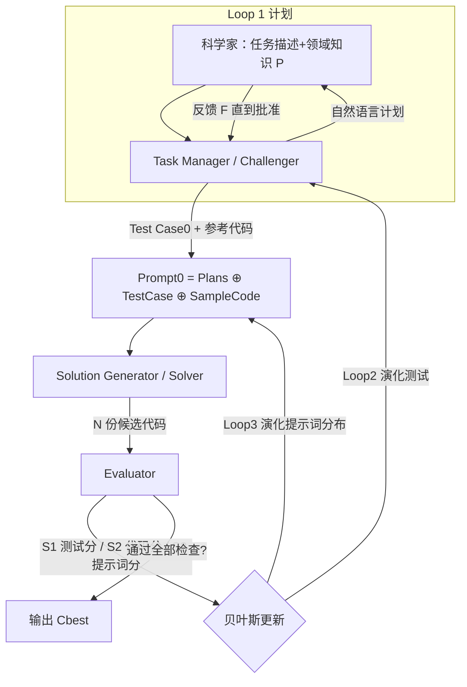

# AI-for-Science Low-code Platform with Bayesian Adversarial Multi-Agent Framework

**会议**: ICLR 2026  
**OpenReview**: [https://openreview.net/forum?id=Cug26Y0RlT](https://openreview.net/forum?id=Cug26Y0RlT)  
**代码**: 待确认  
**领域**: 多智能体 / AI for Science / 代码生成  
**关键词**: 多智能体, 对抗协同进化, 贝叶斯优化, 科学代码生成, 低代码平台, 幻觉抑制  

## 一句话总结
把"出题—解题—评分"三个 agent 组成对抗循环，并用一个**非 LLM 的贝叶斯更新规则**同时进化代码、测试用例和提示词，让 32B 开源模型在科学代码生成基准上打过 235B 模型，把系统可靠性从"赌单个 LLM 够强"转成"靠贝叶斯收敛降不确定性"。

## 研究背景与动机
**领域现状**：LLM（Codex、AlphaCode、CodeLlama 等）正在把科学仿真、数据分析等任务的代码生成自动化，多智能体系统进一步用角色分工 + 结构化通信去拆解复杂科学问题。

**现有痛点**：LLM 的概率本质会在**生成代码**和**生成测试用例**两侧同时产生幻觉；在多智能体流水线里，上游 agent 的错误会被下游 agent 不加批判地接受，**误差逐级放大**，系统可靠性被"最弱的那个 agent"卡死。更糟的是科学任务的评测本身就难——标准单元测试覆盖不了科学约束，全面评测指标往往昂贵甚至无法定义，而 LLM 生成的测试又会继承和被测代码一样的不可靠性。

**核心矛盾**：传统多智能体把代码当"待验证对象"、把测试当"可信裁判"，但在科学场景里测试和代码**一样不可信**，于是"静态验证"这个地基塌了——必须对二者给予同等的怀疑与同等的优化。

**本文目标**：做一个对底座 LLM 智能水平**不抱绝对信任**的框架，覆盖从 1.7B 开源到最新商业模型，既能抑制误差传播，又能让不懂提示工程的领域科学家用自然语言把活干完。

**核心 idea**：**对抗协同进化 + 贝叶斯更新**——让测试用例生成与代码改进在竞争中互相打磨，用 Bayes 定理演化"提示词分布"，把系统对单个 LLM 可靠性的依赖系统性地降下来。

## 方法详解

### 整体框架
框架由三个 agent 构成一个递归对抗循环：**Task Manager (TM) 当 Challenger** 负责把用户模糊需求结构化成计划并出测试用例、**Solution Generator (SG) 当 Solver** 负责按提示词批量生成候选代码、**Evaluator (Eval)** 负责给代码/测试/提示词三套打分。TM 不断出更刁钻但仍可解的测试去暴露 SG 的弱点，SG 据反馈迭代改进，整个"代码—测试—提示词"三元组的选择分布由一条**非 LLM 的贝叶斯规则**递归更新，直到出现一份能通过全部检查的代码或达到最大轮数（默认 3 轮）。

### 关键设计

**1. 三元组提示词与对抗博弈：把测试和代码放到同一张赌桌上**
框架的起手是把用户批准的计划、初始测试用例、参考代码直接拼成初始提示词 $\text{Prompt}_0 := \text{Plans} \oplus \text{Test Case}_0 \oplus \text{Sample Code}_0$，其中测试和代码都能在后续迭代里**各自独立更新**。博弈的核心是 TM 与 SG 的对抗：TM 根据测试的"真实难度"调权重、挑选测试，刻意构造对 SG 当前能力"难到能逼出进步、又不至于完全无解"的测试套件；SG 则用生成代码去应战，成败信号反过来塑造 TM 下一轮的出题策略。这种竞争式协同替代了"静态单元测试一锤定音"的旧范式，让代码和测试在互相挑刺中共同收敛到既满足显式需求、又满足领域隐式约束的解。

**2. 三套自洽评分：S1 测难度、S2 测代码、S3 测提示词**
Evaluator 给出三个互相耦合的分数。测试用例分 $S_1$ 衡量测试的"真实难度"——一个好测试应能区分不同质量的代码，用动量更新：

$$S_1(i)^{t+1} = (1-\alpha)\cdot S_1(i)^t + \alpha\cdot\left(\frac{\sum_{j' \text{ pass}} S_2(j')}{|\{Code_{j'}\}|} - \frac{\sum_{j^\dagger \text{ fail}} S_2(j^\dagger)}{|\{Code_{j^\dagger}\}|}\right)$$

其中 $\alpha=0.8$ 控制更新动量（即被高质量代码通过、被低质量代码失败的测试得分更高）。代码分 $S_2$ 则按"通过的测试的加权难度占比"算：$S_2(j)^t = \frac{\sum_i \mathbb{I}(C_j \text{ pass } T_i)\cdot S_1(i)^{t-1}}{\sum_i S_1(i)^{t-1}}$，即通过越难的测试得分越高。提示词分 $S_3 = \frac{1}{M}\sum S_1 + \frac{1}{N}\sum S_2$ 把测试质量与代码质量合成，作为贝叶斯更新的观测信号。三套分数互为因子、闭环耦合，没有任何一项依赖 LLM 当裁判，从根上切断了"用幻觉评判幻觉"。

**3. 贝叶斯提示词更新：把"哪种师生搭配最有效"学出来**
下一轮该选哪个测试 $i$、哪份样例代码 $j$ 进提示词，由贝叶斯规则决定：

$$p(\text{Prompt}^{t+1}_{ij} \mid S_3^t) \propto p(S_3^t \mid \text{Prompt}^t_{ij})\, p(\text{Prompt}^t_{ij})$$

先验 $p(\text{Prompt}^t_{ij})$ 初始可均匀、随历史有效性自适应；似然取 $p(S_3^t \mid \text{Prompt}^t_{ij}) \propto \exp(\mathbb{E}[S_3^{t-1}\mathbb{1}(i,j)])$，意思是"某个(测试,代码)搭配表现显著超过它的历史均值时，被选中的概率更高"。直觉上这是在挖掘"教师—学生"配对——哪些样例代码配哪些测试最能稳定产出高分提示词。样例代码池本身也是动态的：起初只有用户参考代码，SG 生成的高 $S_2$ 代码会被回收进池子，其"指导质量"随对提示词分的贡献被持续学习。

**4. 贝叶斯优化做代码性能先验估计：省掉昂贵的全量执行**
科学代码全部真跑一遍测试代价极高，框架因此用贝叶斯优化做**先验估计**：把每份代码经由 AST 结构特征 + 代码 embedding 嵌成向量 $x_i$，再用 BO 根据"与已测代码的结构相似度"预测未测代码的性能分。这样系统只对采集函数挑出的最有希望的少数候选（实验里设为 5 份）做昂贵的真实执行，既保了评测精度又保了解空间探索广度，让提示词分布的演化、进而代码与测试的协同进化都能高效推进。

## 实验关键数据

### 主实验：SciCode 跨底座模型（Sub=子问题解决率%，Main=主问题%）

| 模型 | 方法 | Sub (w/o知识) | Sub (w/知识) |
|---|---|---|---|
| Qwen3-8b | Baseline / Ours | 13.2 / **24.7 (+87.1%)** | 19.8 / **27.4 (+38.4%)** |
| Qwen3-14b | Baseline / Ours | 17.7 / **30.6 (+72.9%)** | 25.0 / **32.6** |
| Qwen3-32b | Baseline / Ours | 18.4 / **33.0 (+79.3%)** | 27.4 / **36.1** |
| Qwen3-235B-A22b | Baseline / Ours | 30.6 / **38.9** | 37.2 / **41.0** |
| GPT-4o | Baseline / Ours | 24.1 / **37.2 (+54.3%)** | 33.7 / **40.6** |
| Claude-sonnet-4 | Baseline / Ours | 31.3 / **42.7** | 38.8 / **43.8** |

关键看点：Qwen3-14b + 本框架在"无知识"下达到 30.6，**追平了体量大 16 倍的 Qwen3-235B 基线**；32B 开源模型套上框架可超过 235B 模型。

### 主实验：ScienceAgentBench（GPT-4o 底座，VER=有效执行率）

| 方法 | SR(w/o) | CBS(w/o) | VER(w/o) | VER(w/) |
|---|---|---|---|---|
| Direct | 11.8 | 82.6 | 52.9 | 41.2 |
| OpenHands CodeAct | 19.6 | 83.1 | 78.4 | 73.5 |
| Self-Debug | 22.6 | 84.4 | 83.3 | 71.6 |
| **LCP (Ours)** | **26.5** | **85.1** | **90.2** | **87.3** |

### 消融与分析

| 分析项 | 结论 |
|---|---|
| 迭代轮数 | HumanEval/MBPP/SciCode 上性能随迭代**单调上升**，3 轮后大涨、4~5 轮收敛（SciCode 27.1→37.2） |
| 对抗测试用例 ATC | 前 2 轮与无 ATC 相当，**第 3 轮起明显分叉**，带 ATC 始终更高 |
| 非专业用户鲁棒性 | 基线在"基础提示 vs 专家提示"间差距大（强依赖提示工程）；本框架把该差距大幅收窄，**"我们-无知识"持续超过"基线-有专家知识"** |

### 关键发现
- 误差传播被有效抑制：把测试与代码同等怀疑后，可靠性不再被最弱 agent 卡死。
- 框架收益对**小模型更大**（最高 +87.1%），说明它在补足底座能力不足时最有价值。
- VER 高达 90.2% 对科学应用尤为关键——直接证明产出代码"能跑且跑对"。

## 亮点与洞察
- **范式转变**：从"信任单个 LLM 的智能水平"转向"用非 LLM 的贝叶斯机制系统性降不确定性"，把多智能体可靠性问题转化成一个可收敛的优化问题。
- **对称怀疑**：明确指出测试用例和代码"同样会幻觉"，并给它们对称的优化地位，这是对传统 self-refine/self-debug 的一个清晰修正。
- **低代码可达性**：TM 内置需求结构化与交互澄清，让领域科学家用模糊自然语言也能跑通，鲁棒性实验直接量化了"省掉提示工程"的收益。
- **工程经济性**：BO + AST/embedding 相似度做性能先验，把"全量执行"的高成本压成"只测最有希望的 5 份"，让框架在昂贵科学代码上落地可行。

## 局限与展望
- 三 agent 递归循环 + 每轮 20 份候选代码 + BO 估计，**整体计算/token 开销显著**，论文虽用 BO 缓解但绝对成本仍高于单次生成。
- 默认仅 3 轮、初始 15 测试用例等超参偏经验设定，缺乏对不同任务自适应调度的系统分析。
- 贝叶斯似然的具体形式（指数族近似）较启发式，理论收敛性与"真实难度"度量的可靠性还需更深论证。
- 科学评测主要落在 SciCode / ScienceAgentBench 与地球科学案例，跨更多学科（生物、材料等）的泛化仍待验证。

## 相关工作与启发
- **对照 self-refine / Reflexion / Self-Debug**：这些靠 LLM 自我反思纠错，仍受底座 LLM 可靠性约束；本文用非 LLM 的对抗+贝叶斯把裁判权从 LLM 手里夺回来。
- **对照 MetaGPT / AgentCoder / MapCoder / CodeCoR 等多智能体编码框架**：它们多用 LLM 评测与决策，误差传播风险高；本文显式建模"测试也会错"并对称优化。
- **启发**：把"生成器 vs 验证器"的对抗思想（类 GAN）迁到 agent 编排里，再用贝叶斯优化做昂贵评测的代理，是一条让多智能体系统"少依赖强底座"的可复用路径——对预算受限、只能用中小开源模型的科学计算场景尤其有借鉴价值。

## 评分
- **新颖性**: ⭐⭐⭐⭐ 把对抗协同进化 + 非 LLM 贝叶斯更新引入多智能体科学代码生成，"测试与代码同等怀疑"的视角和 BO 性能先验组合较有原创性。
- **实验充分度**: ⭐⭐⭐⭐ 覆盖 1.7B~235B 多底座、通用+科学两类基准、迭代/ATC/鲁棒性多重消融，证据链完整；跨更多学科与算力成本量化稍欠。
- **写作质量**: ⭐⭐⭐⭐ 动机递进清晰、三套评分与贝叶斯更新公式表述到位，图 1/图 2 框架对照直观。
- **价值**: ⭐⭐⭐⭐ 让中小开源模型在科学代码上逼近超大模型、且对非专业用户鲁棒，对 AI4S 落地有较强实用价值。

<!-- RELATED:START -->

## 相关论文

- [\[AAAI 2026\] Hierarchical Pedagogical Oversight: A Multi-Agent Adversarial Framework for Reliable AI Tutoring](../../AAAI2026/multi_agent/hierarchical_pedagogical_oversight_a_multi-agent_adversarial_framework_for_relia.md)
- [\[ICLR 2026\] Learning to Summarize by Learning to Quiz: Adversarial Agentic Collaboration for Long Document Summarization](learning_to_summarize_by_learning_to_quiz_adversarial_agentic_collaboration_for_.md)
- [\[AAAI 2026\] KDR-Agent: A Multi-Agent LLM Framework for Multi-Domain Low-Resource In-Context NER via Knowledge Retrieval](../../AAAI2026/multi_agent/a_multi-agent_llm_framework_for_multi-domain_low-resource_in-context_ner_via_kno.md)
- [\[ICLR 2026\] CellAgent: LLM-Driven Multi-Agent Framework for Natural Language-Based Single-Cell Analysis](cellagent_llm-driven_multi-agent_framework_for_natural_language-based_single-cel.md)
- [\[ICLR 2026\] HAMLET: A Hierarchical and Adaptive Multi-Agent Framework for Live Embodied Theatre](hamlet_a_hierarchical_and_adaptive_multi-agent_framework_for_live_embodied_theat.md)

<!-- RELATED:END -->
