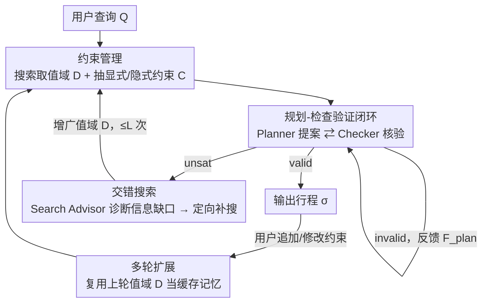

# ATLAS: Constraints-Aware Multi-Agent Collaboration for Real-World Travel Planning

**会议**: ICLR2026  
**OpenReview**: [https://openreview.net/forum?id=mIYGiBf9Pm](https://openreview.net/forum?id=mIYGiBf9Pm)  
**代码**: 待确认  
**领域**: Agent / 多智能体协作 / LLM 规划  
**关键词**: 多智能体, 约束满足, 旅行规划, 交错搜索, 多轮交互

## 一句话总结
ATLAS 把"带搜索的真实旅行规划"形式化成一个动态约束满足问题（CSP），用 5 个分工明确的 LLM 智能体（搜索、约束管理、规划、检查、搜索顾问）协同补全约束、迭代纠错、并在卡死时反过来指导搜索，把 TravelPlanner 最终通过率从 23.3% 提到 44.4%，并首次在带实时网络搜索的真实多轮场景里做到 84% 通过率。

## 研究背景与动机
**领域现状**：LLM 在推理和工具调用上进步很快，旅行规划被当成检验"约束遵从能力"的典型 testbed——给定预算、日期、目的地、口味偏好，要排出一份合理的多日行程。现有工作要么假设所有必要信息已经预先给好（只管约束遵从）、要么假设所有约束事先已知（只管搜索）。

**现有痛点**：真正难的场景是两者同时发生——智能体必须一边搜索上下文信息、一边发现约束，而这恰恰是没被解决的部分。论文用 Figure 1 举例：即便 Gemini-2.5-Pro 能满足用户显式要求（预算、日期），也会在隐式常识规则上翻车，比如早上 9 点到达却不安排午餐、把另一座城市的餐厅推荐进当天行程、城市顺序不合逻辑、甚至编造不存在的航班。

**核心矛盾**：约束本身分两类且来源不同——**显式约束 $C_E$**（用户明说或搜索结果带出的硬规则，如预算上限、住宿最少入住夜数）和**隐式约束 $C_I$**（常识与物理现实，如度假必须回到出发城市、餐厅不能全程重复）。单体（monolithic）智能体把"搜信息、抽约束、排方案、查合法性"全压在一次生成里，任何一环出错都会污染整份计划，且无法把"搜不到合适选项"和"逻辑排错"区分开。多轮对话里用户还会动态增删约束，使静态问题变成随时间演化的动态问题。

**本文目标**：系统性拆解约束感知规划的三个根本挑战——(1) 约束构建：在无先验下识别完整的显式+隐式约束；(2) 约束下作答：生成并验证一份满足全部约束的合法方案；(3) 弥合信息缺口：判断失败是逻辑错误还是搜索信息不足，并据此补搜。

**切入角度**：把旅行规划严格写成 CSP $P=\langle X, D, C\rangle$——$X$ 是每天每个槽位的决策变量（Day1Transportation、Day1Dinner……），$D$ 是各变量的候选值域（由实时搜索动态填充，而非预先给定），$C$ 是必须满足的约束集合。多轮场景则建模为动态 CSP，即一串静态 CSP $P^1, P^2, \dots, P^t$，后一个是前一个的变换。

**核心 idea**：与其让一个智能体硬扛，不如把三个挑战分派给三组专职机制——专门管约束的 Constraint Manager、专门"提案-验证"对打的 Planner-Checker 闭环、以及在判定 unsat 时反向诊断并指导补搜的 Search Advisor，让"搜索"和"规划"交错进行而非一次性串联。

## 方法详解

### 整体框架
ATLAS（Agent-based Travel planning with Live Adaptive Search）是围绕 CSP 求解组织的多智能体流水线，输入是用户自然语言查询 $Q^t$，输出是一份可行行程 $\sigma^t$。系统用三层循环索引来刻画运转：$t=1,\dots,T$ 是对话轮，$\ell=0,\dots,L$ 是一轮内的交错搜索循环，$k=0,\dots,K$ 是 Planner 与 Checker 之间的提案-验证循环。

整体怎么转：每轮先由 **Search Agent** 调工具搜集原始观测 $O^{t,\ell}$ 并抽成结构化值域 $D^{t,\ell}$（记进"记事本"notepad），**Constraint Manager** 据此构建完整约束集 $C^{t,\ell}=C_E^{t,\ell}\cup C_I$；随后 **Planner** 在 $\langle X, D^{t,\ell}, C^{t,\ell}\rangle$ 上提一份赋值 $\sigma$，交给 **Checker** 逐条核验，输出裁决 $V\in\{\texttt{valid},\texttt{invalid},\texttt{unsat}\}$。若 `invalid`，反馈 $F_{plan}$ 回传 Planner 让它在最多 $K$ 步内改方案；若 `unsat`，说明当前信息根本排不出合法方案，触发 **Search Advisor** 诊断信息缺口、生成定向补搜指令 $F_{search}$，把控制权交回 Search Agent 拿到增广值域 $D^{t,\ell+1}$，循环继续（最多 $L$ 次交错搜索）。多轮时复用上一轮的最终值域 $D^{t,L}$ 当缓存记忆，避免每轮从零搜起。

### 关键设计

**1. 约束管理：把"搜信息"和"显式+隐式约束抽取"拆成两个专职智能体（Challenge 1）**

针对单体智能体把搜索和约束识别混在一起、容易漏掉隐式常识规则的痛点，ATLAS 把第一阶段拆成 Search Agent 与 Constraint Manager 两个角色。Search Agent 用标准 ReAct 工具调用范式，把查询映射成值域：$D^{t,\ell}=\text{Search}(Q^t, F_{search}^{t,\ell-1})=(\Gamma\circ\Omega)(Q^t, F_{search}^{t,\ell-1})$，其中 $\Omega$ 负责从外部环境取原始观测、$\Gamma$ 负责把观测过滤结构化成候选值域（如某城某天的可订餐厅集合）。Constraint Manager 则在值域填好后构建 $C^{t,\ell}=C_E^{t,\ell}\cup C_I$，显式部分 $C_E^{t,\ell}=\Pi(Q^t, D^{t,\ell})$ 从用户查询和搜索结果里抽（预算、住宿最少夜数等），隐式部分 $C_I$ 调用 LLM 的世界知识与常识把"度假必须回出发城市""餐厅不能全程重复"这类没人明说但必须满足的规则补全。这一步把约束识别从规划里解耦出来——消融显示禁用 Constraint Manager 会让宏观硬约束通过率掉 14.4%，说明显式抽约束不能指望 Planner 顺带做。

**2. 规划-检查验证闭环：用一个 Planner 和一个 Checker 对打做迭代纠错（Challenge 2）**

针对"一次性生成的方案常常违反约束、却无人核验"的痛点，ATLAS 把"提案"和"验证"分给两个智能体并让它们迭代对打。Planner 在每次尝试时不仅看 CSP 实例，还看历史失败赋值和对应反馈：$\sigma^{t,\ell,k}=\text{Plan}(X, D^{t,\ell}, C^{t,\ell}; \{(\sigma^{t,\ell,i}, F_{plan}^{t,\ell,i})\}_{i=1}^{k-1})$。Checker 则逐条核验赋值是否满足 $C^{t,\ell}$ 里每个约束，产出裁决和定位到具体违规约束的反馈 $(V^{t,\ell,k}, F_{plan}^{t,\ell,k})=\text{Check}(Q^t, D^{t,\ell}, C^{t,\ell}, \sigma^{t,\ell,k})$。关键在于 Checker 区分 `invalid`（方案违规、可改）和 `unsat`（在当前值域+约束下根本无解、改也没用）——前者把带定位的反馈打回 Planner 在 $K$ 步内修订，后者直接升级到补搜阶段。这种"带定向反馈的迭代修订"比让 Planner 自己反思更可靠：单步检查（$K=1$）就把最终通过率从 20.6% 拉到 29.4%，但 $K=3$ 后收益饱和，因为剩下的失败往往源于信息不足而非逻辑错误——这正好引出第三个机制。

**3. 交错搜索：用 Search Advisor 把"卡死"翻译成"该补搜什么"（Challenge 3）**

针对"一次性搜索拿到的信息不够、Planner 怎么改都排不出方案"的死胡同，ATLAS 在 Checker 返回 `unsat` 时启动 Search Advisor。它分析全上下文（用户查询、当前值域、约束集、历史失败规划），定位根因并生成定向补搜反馈：$F_{search}^{t,\ell}=\text{SearchAdvise}(Q^t, D^{t,\ell}, C^{t,\ell}, H^{t,\ell,k})$，其中 $H^{t,\ell,k}$ 是迄今的规划历史。比如当前所选城市里找不到同时满足"带 10 岁以下儿童"和"私人房间"的住宿时，它会建议去威斯康星州的另一座城市搜。这条指令回灌 Search Agent，拿到增广值域 $D^{t,\ell+1}$ 和刷新的约束集 $C^{t,\ell+1}$，搜索与规划由此交错进行而非简单串联。论文强调这是把死胡同变成"自适应补充信息的机会"：在已修订三次的方案上激活交错搜索，最终通过率从 31.1% 进一步升到 44.4%（$L=5$）。对比实验也显示，简单地给 Reflexion/EvoAgent 这类强规划器加一次性搜索没有收益，甚至 ReAct+EvoAgent 还不如纯 ReAct——因为在差的搜索结果上做复杂规划反而放大了信息缺口。

**4. 多轮扩展：用上一轮值域当缓存记忆，避免每轮从零重搜**

针对真实对话里用户会动态增删约束（改预算、换口味）、若每轮推倒重来既慢又浪费工具调用的痛点，ATLAS 把单轮流程平滑提升到动态 CSP。当用户从 $Q^t$ 更新到 $Q^{t+1}$，系统不重启，而是复用上一轮最终值域 $D^{t,L}$ 当已知选项的缓存记忆，Constraint Manager 直接拿新查询对着缓存值域生成更新约束 $C^{t+1,1}=C^{t+1,1}_E\cup C_I$，新 CSP 实例变成 $P^{t+1,1}=\langle X, D^{t,L}, C^{t+1,1}\rangle$，先进入 Planner-Checker 闭环试图只靠已有信息排出合法方案。只有当它在 $K$ 步修订后仍得 `unsat`，才判定缓存信息不足、触发完整的交错搜索重新取信息。这种"先用旧知识、不够再补搜"的设计是关键的效率步，避免在已有信息足够时做无谓工具调用，也让 ATLAS 能稳定吸收逐轮引入的增量约束。

### 一个完整示例
以 Figure 2 的任务为例：用户要"从 Charlotte 出发、游威斯康星 2 城、5 天、预算 2500、带 10 岁以下小孩、偏好私人房间"。① Search Agent 搜出 Madison 的住宿/餐厅候选填进值域 $D$，记事本记下某住宿"不允许 10 岁以下儿童、最少 2 晚、最多入住 3 人"。② Constraint Manager 抽出显式约束（最后一天回出发城市、不能缺住宿）和隐式约束（房规允许儿童、偏好私人房、最少夜数）。③ Planner 提一份赋值 $\sigma(x_1),\dots,\sigma(x_6)$；Checker 核验后发现当前所选城市里没有同时满足"儿童 < 10"和"私人房"的住宿，返回 `unsat`。④ Search Advisor 诊断："当前城市的住宿很难满足全部约束，换威斯康星另一座城市试试"，生成补搜指令。⑤ Search Agent 据此搜 Green Bay 等城市，拿到增广值域，Planner-Checker 重新开闭环，最终排出合法行程。整条链清楚展示了"搜索→抽约束→提案→核验→诊断→再补搜"的交错回环。

## 实验关键数据

### 主实验
评测基于 TravelPlanner（沙盒环境，含住宿/餐厅/交通 API），用四个官方指标（均为 %）：Delivery rate（成功交付率）、Micro/Macro pass rate（约束通过率，分常识与硬约束）、Final pass rate（同时满足全部常识+硬约束的比例）。所有方法限 120 次工具调用，ATLAS 设 $K=3, L=10$，基座用 Gemini-2.5-Pro 和 Claude-Sonnet-4。

| 数据集 / 基座 | 方法 | Delivery | 常识 Macro | 硬约束 Macro | Final Pass |
|--------|------|------|------|------|------|
| Validation(#180) / Gemini-2.5-Pro | ReAct | 98.33 | 29.63 | 46.56 | 20.56 |
| | PMC（多智能体） | 100 | 30.56 | 37.22 | 23.33 |
| | **ATLAS** | 100 | **48.33** | **74.44** | **44.44** |
| Test(#1000) / Gemini-2.5-Pro | ReAct+Reflexion | 99.90 | 25.90 | 56.70 | 22.70 |
| | PMC | 100 | 28.30 | 46.10 | 21.08 |
| | **ATLAS** | 100 | **40.50** | **70.60** | **35.00** |
| Test(#1000) / Claude-Sonnet-4 | PMC | 100 | 15.59 | 33.56 | 12.12 |
| | **ATLAS** | 100 | **31.00** | **42.00** | **18.00** |

ATLAS 在所有指标上一致最优，验证集最终通过率把最好替代方案（PMC 的 23.3%）提到 44.4%，测试集相对多智能体基线最多领先约 14%。论文指出 ATLAS 优于 PMC 是因为它"显式编排去处理约束发现/约束作答/信息缺口"，比依赖 LLM 涌现式任务分解更可靠。

### 消融实验
消融在验证集用 Gemini-2.5-Pro（Figure 3）：

| 配置 | Final Pass | 说明 |
|------|---------|------|
| 完整 ATLAS | 44.4% | $K=3, L=5$ |
| w/o Constraint Manager | 硬约束 Macro −14.4% | 显式约束管理失效，证明 Challenge 1 |
| $K=0$（ReAct 串行 search-then-plan） | 20.6% | 无任何检查修订 |
| $K=1$ | 29.4% | 单步检查即大涨，$K=3$ 后饱和 |
| $L=0$（ReAct+3 步检查） | 31.1% | 无交错搜索 |
| $L=5$ | 44.4% | 激活交错搜索，再涨 13 个点 |

### 多轮与实时搜索
**多轮（Flex-TravelPlanner，Table 2）**：在 2/3 轮逐步引入局部（口味/房型）或全局（预算/人数）约束。3 轮"局部→全局"设置下 ReAct 仅 15.34% 最终通过率，ATLAS 达 33.60%，几乎翻倍；轮数越多、约束越复杂，差距越大。

**实时网络搜索（Table 7 / Figure 4）**：把沙盒工具换成 Google Search，引入新指标 no-hallucination rate（计划中所有信息既来自搜索结果又经独立 LLM 裁判核实为事实准确）。三轮后 ATLAS 最终通过率从 26.1% 升到 **83.9%**，而 ReAct 停在 58.9%、单体智能体停在 27.2%；ATLAS 的 no-hallucination rate 超 92%，ReAct 停滞在 76%。这是论文首次在带实时搜索+多轮反馈的真实场景里给出定量有效性。

### 关键发现
- 三个组件各自针对性解决一个挑战：去掉 Constraint Manager 掉硬约束、$K$ 提升边际递减、$L$ 补上最后一段——逐个验证了设计动机。
- 简单地给强规划器（Reflexion/EvoAgent）加一次性搜索无益甚至有害（ReAct+EvoAgent < ReAct），凸显"交错搜索"相对"串联搜索"的必要性。
- 沙盒里 ATLAS 优势主要来自"在稀疏信息下发现唯一隐藏解"的能力；实时环境选项丰富，初始找到任意可行解更容易，所以单轮差距小，但多轮反馈累积下 ATLAS 的纠错与抗幻觉优势才完全显现。

## 亮点与洞察
- **把模糊的"约束感知规划"严格写成动态 CSP**：用 $\langle X, D, C\rangle$ 和显式/隐式约束划分给问题一个形式化骨架，五个智能体各自对应 CSP 求解里一个明确职能（填值域、抽约束、提赋值、验约束、诊断补搜），这种"先形式化再分工"的范式可迁移到任何"边搜索边发现约束"的任务。
- **Checker 的 `unsat` 裁决是点睛之笔**：把"方案违规（可改）"和"信息不足（改也没用）"区分开，让系统知道何时该继续修订、何时该回头补搜——这正是单体智能体死循环的根因，也是交错搜索能触发的开关。
- **`unsat` → Search Advisor 的反向回路**把失败变成补搜信号，是"规划指导搜索"而非"搜索单向喂规划"的少见设计，可直接迁移到 RAG、工具调用类任务里做自适应检索。
- **多轮缓存值域当记忆**是一个简单但实用的效率技巧：先吃旧知识、不够再补搜，避免每轮重搜。

## 局限与展望
- 论文坦承各组件用的是"有效但简单"的实例化（Search 就是 ReAct、Checker 是 LLM 核验）。作者展望 Planner 可引入并行 test-time scaling、Checker 可接形式化 CSP solver 做更稳健验证。
- 实时搜索场景里"找到任意可行解"本就更容易，ATLAS 相对 ReAct 的单轮优势被稀释，主要靠多轮反馈累积——这说明其优势在"信息稀疏、约束冲突"的难任务上才最突出，选项极丰富时性价比下降。
- 评测仍集中在旅行规划单一域；论文提到可扩展到隐私合规、个性化偏好等域，但尚未给出跨域验证。
- $K, L$ 等上限是手调超参（$K=3, L=10/5$），不同任务难度下的自适应设定没有讨论；工具调用上限 120 也是人为约束。

## 相关工作与启发
- **vs PMC（多智能体任务分解）**：PMC 依赖 LLM 涌现式的任务分解与委派，ATLAS 则用显式编排把三个挑战写死成专职机制；结果上 ATLAS 在各指标稳定超 PMC，说明在约束密集任务里"显式系统设计 > 依赖涌现分解"。
- **vs ReAct / Reflexion / EvoAgent**：这些方法要么纯工具调用、要么把搜索一次性串在规划前；ATLAS 的核心区别是"交错搜索"——由 `unsat` 触发、由 Search Advisor 定向引导的补搜，证明非自适应的一次性搜索在信息缺口大时反而拖累强规划器。
- **vs 经典 CSP / 约束规划**：ATLAS 借用 CSP 形式化和动态 CSP（一串静态 CSP 的变换）框架，但值域 $D$ 由 LLM 实时搜索动态填充、隐式约束 $C_I$ 由 LLM 常识推断，是"用 LLM 把开放世界翻译成 CSP 再求解"的混合范式。
- **启发**：这套"形式化为 CSP + 多智能体分工 + 验证失败反向指导搜索"的模板，可迁移到任何需要在不完整信息下满足复杂约束的 agent 任务（合规检查、日程编排、配置生成）。

## 评分
- 新颖性: ⭐⭐⭐⭐ 把约束感知规划严格形式化为动态 CSP 并用专职多智能体对应每个 CSP 职能，"`unsat` 触发反向补搜"的交错机制是真创新。
- 实验充分度: ⭐⭐⭐⭐⭐ 沙盒+多轮+实时搜索三档评测、两套基座、完整组件消融，并首次在真实实时场景给定量结果。
- 写作质量: ⭐⭐⭐⭐⭐ 形式化清晰、Figure 1/2 直观、三个挑战与三个机制一一对应，逻辑链完整。
- 价值: ⭐⭐⭐⭐ 通用框架可迁移到其他约束密集 agent 任务，实时旅行规划 84% 通过率有实用意义。

<!-- RELATED:START -->

## 相关论文

- [\[ICML 2025\] Is Your LLM-Based Multi-Agent a Reliable Real-World Planner? Exploring Fraud Detection in Travel Planning](../../ICML2025/multi_agent/is_your_llm-based_multi-agent_a_reliable_real-world_planner_exploring_fraud_dete.md)
- [\[ACL 2026\] Towards Robust Real-World Spreadsheet Understanding with Multi-Agent Multi-Format Collaboration](../../ACL2026/multi_agent/towards_robust_real-world_spreadsheet_understanding_with_multi-agent_multi-forma.md)
- [\[ICLR 2026\] UIS-Digger: Towards Comprehensive Research Agent Systems for Real-world Unindexed Information Seeking](uis-digger_towards_comprehensive_research_agent_systems_for_real-world_unindexed.md)
- [\[ICLR 2026\] AgentPO: Enhancing Multi-Agent Collaboration via Reinforcement Learning](agentpo_enhancing_multi-agent_collaboration_via_reinforcement_learning.md)
- [\[ICLR 2026\] Strategic Planning and Rationalizing on Trees Make LLMs Better Debaters](strategic_planning_and_rationalizing_on_trees_make_llms_better_debaters.md)

<!-- RELATED:END -->
