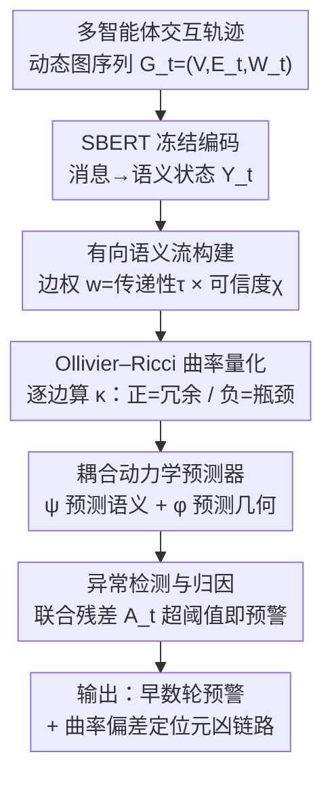

# Auditing Cascading Risks in Multi-Agent Systems via Semantic–Geometric Co-evolution

**会议**: ICLR 2026 Workshop  
**arXiv**: [2603.13325](https://arxiv.org/abs/2603.13325)  
**代码**: 无  
**领域**: 可解释性  
**关键词**: multi-agent safety, cascading risk, Ollivier-Ricci curvature, graph geometry, proactive auditing  

## 一句话总结
提出 SCCAL 框架，通过耦合语义流（semantic flow）和交互图的 Ollivier–Ricci 曲率（ORC）来建模多智能体系统中语义-几何的协同演化，利用两者的一致性残差作为级联风险的早期预警信号，在语义违规显现前数轮即可检测异常。

## 研究背景与动机
**领域现状**：LLM 多智能体系统（MAS）已从静态问答转向复杂自演化协作，广泛用于长horizon任务分解。

**现有痛点**：当前安全审计主要依赖逐消息的语义内容过滤（如毒性检测、越狱检测），本质是**反应式**的——等到语义违规可见时，系统的协作动力学往往已不可逆地崩溃。

**核心矛盾**：级联风险（hallucination cascade、collusion、role misalignment）是交互动力学的涌现属性，而非孤立的语义违规。早期消息语义流畅且合规，但底层交互结构已在扭曲。

**本文要解决**：如何在语义违规显现之前，从交互结构的变化中检测级联风险的前兆？

**切入角度**：类比物理系统在灾难性失效前会积累结构应力，MAS 交互在语义崩溃前会先出现拓扑畸变（如信息瓶颈、过度冗余）。

**核心idea**：将 MAS 安全审计建模为语义-几何耦合流形上的轨迹稳定性问题，用 Ollivier–Ricci 曲率量化交互图的局部几何特征，当语义流与几何演化的一致性被打破时便触发预警。

## 方法详解

### 整体框架
SCCAL（Semantic–Curvature Co-evolutionary Auditing Loop）要解决的核心问题是：在多智能体系统的语义违规还没显现出来之前，提前从交互结构的畸变中读出级联风险的前兆。它把多智能体交互建模成一段随轮次变化的动态图序列 $\mathcal{G}_t = (\mathcal{V}, \mathcal{E}_t, \mathbf{W}_t)$，并配套维护各智能体的语义状态 $\mathbf{Y}_t$。每一轮的处理顺着两条线并行展开：语义侧用冻结的 SBERT 编码器把消息编成表示，再据此构建一张有向语义流图；几何侧在这张图上逐边算 Ollivier–Ricci 曲率（ORC），把交互的局部结构量化成一个标量场。随后一个耦合动力学模型同时预测下一轮的语义状态和几何曲率，一旦真实演化与预测之间的联合残差超过阈值，就触发预警——这意味着语义和几何的协同关系被打破了，而这往往比表面的语义违规早好几轮发生。

### 关键设计

**1. 有向语义流构建：把消息流变成能反映"谁真正影响了谁"的加权图**

直接拿原始消息建图会把无效甚至有害的语义传播也当成真实影响路径。SCCAL 给每条边赋一个权重 $w_{ij}^t = \tau_{ij}^t \cdot \chi_i^t$，由两部分相乘构成：语义传递性 $\tau_{ij}^t = \cos(\mathbf{y}_i^t, \mathbf{y}_j^{t-1})$ 衡量智能体 $i$ 当前的意图和 $j$ 上一轮状态的对齐程度，可信度 $\chi_i^t = \exp(-\text{PPL}(s_i^t))$ 则用参考语言模型对消息 $s_i^t$ 的困惑度来惩罚不连贯、语无伦次的输出。两者相乘的效果是：只有既对齐又可信的影响才会在图上留下强边，从而抑制虚假语义传播、保留真正有意义的影响路径。

**2. Ollivier–Ricci 曲率（ORC）几何量化：用离散曲率读出交互图的冗余与瓶颈**

光有语义流权重还不够，它看不出整张交互图的局部结构在往哪个方向走。SCCAL 为每条边计算离散曲率 $\kappa_{ij} = 1 - W_1(m_i, m_j)/d(i,j)$，其中 $W_1$ 是 Wasserstein-1 距离，$m_i, m_j$ 是由语义流权重诱导的邻域概率度量。这个量有清晰的几何含义：正曲率对应两节点邻域高度重叠、信息冗余，是 echo chamber 或 collusion 的征兆；负曲率对应邻域几乎不重叠、形成结构瓶颈，正是级联风险被放大的脆弱点。相比 GNN 只能学到难以解释的聚合特征，ORC 天然刻画了信息传输的冗余/瓶颈，提供了一种 GNN 捕捉不到的局部几何信号。

**3. 耦合动力学预测器：让语义和几何互相约束，单一信号骗不过整个系统**

风险检测的关键在于"耦合"——语义和几何各自的演化都可能被伪装，但两者的协同关系很难同时造假。SCCAL 用两个互相咬合的预测器实现这一点。几何感知语义预测器 $\psi$ 是一个曲率门控的 GRU，注意力权重 $\alpha_{ij}^t \propto \exp(w_{ij}^t \cdot \text{ReLU}(\kappa_{ij}^t))$ 会主动衰减来自结构不稳定（负曲率）交互的影响，让语义预测不被脆弱链路带偏。语义张力几何预测器 $\phi$ 则反过来,从语义分歧预测结构如何重组：

$$\hat{\kappa}_{ij}^{t+1} = \text{MLP}\big[\,\kappa_{ij}^t \,\|\, \|\mathbf{y}_i^t - \mathbf{y}_j^t\| \,\|\, \text{Var}(\mathcal{N}_i, \mathcal{N}_j)\,\big]$$

它把当前曲率、节点对的语义距离、邻域方差拼起来，建模语义上的分歧如何引起局部几何的重组。两个预测器构成双向约束，确保语义和几何的演化被绑在一起——任何单独一个信号都不足以可靠检测风险，只有两者同时失配才说明系统真的出了问题。

**4. 异常检测与归因：用联合残差当预警信号，再用曲率偏差定位元凶**

有了两个预测器，风险就落到它们的"预测失准"上。SCCAL 把语义预测误差和几何预测误差加权合成一个联合残差：

$$\mathcal{A}_t = \sum_i \|\mathbf{y}_i^t - \hat{\mathbf{y}}_i^t\|^2 + \lambda \sum_{i,j} |\kappa_{ij}^t - \hat{\kappa}_{ij}^t|$$

$\mathcal{A}_t$ 超阈值即触发预警；而归因则直接看几何项——曲率偏差 $|\kappa_{ij}^t - \hat{\kappa}_{ij}^t|$ 最大的那条边，就指向了引发级联风险的具体智能体或交互链路，让审计结果不只是"有风险"，还能落到"哪条链路有问题"。

## 实验关键数据

### 主实验
在约 2000 条正常轨迹和 2000 条风险轨迹上评估（每个任务 12-15 个智能体）：

| 方法 | AUROC (攻击) | AUROC (自然) | DLT (攻击) | DLT (自然) |
|------|-------------|-------------|-----------|-----------|
| Semantic-only | 0.71 | 0.62 | 5.8 | 0.4 |
| ORC-only | 0.77 | 0.69 | 7.4 | 1.2 |
| Structural GNN | 0.75 | 0.77 | 7.2 | 2.6 |
| **SCCAL (Ours)** | **0.88** | **0.83** | **10.2** | **3.4** |

DLT（Detection Lead Time）= 在首次显式语义违规之前提前多少轮检测到风险，越高越好。

### 消融实验

| 配置 | AUROC | DLT |
|------|-------|-----|
| Full model | 0.88 | 9.8 |
| w/o Coupling | 0.81 | 7.1 |
| w/o Semantic module | 0.79 | 6.7 |
| w/o Curvature | 0.75 | 4.9 |

### 关键发现
- 语义-几何耦合是检测能力的核心，去掉耦合损失后 AUROC 降 7%，DLT 降 2.7 轮
- ORC-only 方法在良性高密度协作中误报率高达 0.32，而 SCCAL 仅 0.07
- 在无攻击的自然失败场景中，语义方法几乎随机（AUROC 0.62），而 SCCAL 依然有效（0.83）

## 亮点与洞察
- **时间不对称性洞察**：语义信号是滞后指标（lagging），几何信号是先导指标（leading），这一发现类似物理系统中应力积累先于断裂的规律
- **曲率的语义接地**：纯曲率会把良性的高效协作（如头脑风暴中的高正曲率）误判为共谋，必须用语义约束来消歧——这是一个重要的设计启示
- **从内容审计到过程审计的范式转移**：提供了一个可迁移的思路——任何多智能体系统的安全不应只看单条消息，而应看交互过程的结构演化

## 局限与展望
- 实验基于合成基准（AEGIS 2.0 风险分类），与真实生产环境（延迟、异步、human-in-the-loop）存在差距
- 仅使用局部 ORC，可能遗漏大规模网络中的全局拓扑相变；可引入持久同调（persistent homology）或谱方法
- Workshop 论文，实验规模有限（~4000 条轨迹），缺少大规模验证
- 未讨论计算开销——ORC 在稠密图上的计算成本可能是瓶颈

## 补充技术细节

### ORC 的物理直觉
Ollivier–Ricci 曲率源自黎曼几何的 Ricci 曲率离散化。在连续流形上，正 Ricci 曲率意味着相邻测地线趋于收敛（球面效应），负曲率意味着测地线发散（双曲效应）。映射到图上：
- **正 ORC**：节点 $i$ 和 $j$ 的邻域高度重叠 → 信息冗余，可能形成 echo chamber
- **负 ORC**：节点 $i$ 和 $j$ 的邻域几乎不重叠 → 信息瓶颈，一旦断裂会导致级联失效
- **零 ORC**：正常的信息扩散模式

### Wasserstein 距离计算
$W_1(m_i, m_j)$ 通过最优传输问题求解，在小规模邻域上可解析计算，复杂度 $O(k^3 \log k)$，其中 $k$ 是邻域大小。对于 12-15 个 Agent 的 MAS，计算可行但对更大规模系统可能需要近似算法。

## 相关工作与启发
- **vs 语义审计（guardrails）**: 传统方法逐消息过滤，是反应式的；本文是前瞻式的结构审计
- **vs CurvGAD**: CurvGAD 用 ORC 做静态图异常检测，但对语义上下文不敏感；本文通过语义接地消除误报
- **vs GNN 结构方法**: GNN 在自然故障上有竞争力但检测滞后（DLT 仅 2.6）；ORC 捕捉结构张力积累的能力更强（DLT 达 10.2）
- **vs 传统 MAS 安全分析**：传统方法关注固定动作空间内的策略鲁棒性，难以处理 LLM 带来的开放式语义交互风险
- 可启发多模态 agent 系统的安全设计：感知-推理模态失配可能也表现为语义-几何解耦
- 与信息论中的 Information Bottleneck 方法有内在联系：负曲率本质上是信息瓶颈的几何版本

## 评分
- 新颖性: ⭐⭐⭐⭐ 将黎曼几何（ORC）引入 MAS 安全审计是有创意的跨学科尝试
- 实验充分度: ⭐⭐⭐ Workshop 规模，实验设置有限，缺少真实环境验证
- 写作质量: ⭐⭐⭐⭐ 逻辑清晰，动机链完整，公式表述规范
- 价值: ⭐⭐⭐⭐ "从内容审计到过程审计"的范式转移思想有广泛适用性

<!-- RELATED:START -->

## 相关论文

- [\[AAAI 2026\] Shadows in the Code: Exploring the Risks and Defenses of LLM-based Multi-Agent Software Development Systems](../../AAAI2026/multi_agent/shadows_in_the_code_exploring_the_risks_and_defenses_of_llm-.md)
- [\[ICLR 2026\] Cache-to-Cache: Direct Semantic Communication Between Large Language Models](cache-to-cache_direct_semantic_communication_between_large_language_models.md)
- [\[ACL 2026\] EvoSci: A Bio-Inspired Multi-Agent Framework for the Evolution of Scientific Discovery](../../ACL2026/multi_agent/evosci_a_bio-inspired_multi-agent_framework_for_the_evolution_of_scientific_disc.md)
- [\[ACL 2026\] EvoSpark: Endogenous Interactive Agent Societies for Unified Long-Horizon Narrative Evolution](../../ACL2026/multi_agent/evospark_endogenous_interactive_agent_societies_for_unified_long-horizon_narrati.md)
- [\[ICLR 2026\] Stochastic Self-Organization in Multi-Agent Systems](stochastic_self-organization_in_multi-agent_systems.md)

<!-- RELATED:END -->
