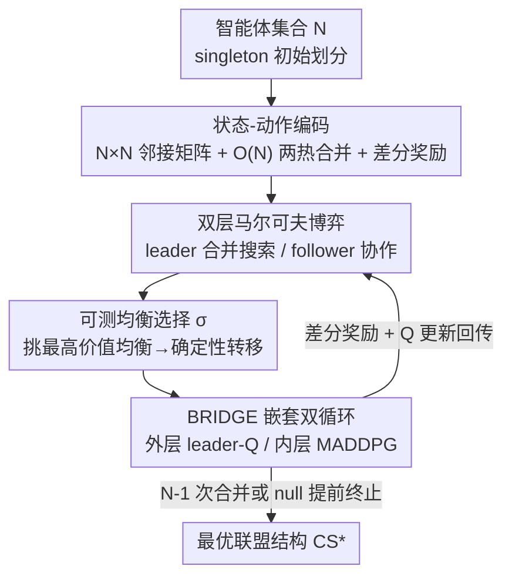

# BRIDGE: Bi-level Reinforcement Learning for Dynamic Group Structure in Coalition Formation Games

**会议**: ICLR2026  
**OpenReview**: [https://openreview.net/forum?id=kIIG4Km1lu](https://openreview.net/forum?id=kIIG4Km1lu)  
**代码**: 待确认  
**领域**: 多智能体系统 / 强化学习  
**关键词**: 联盟结构生成, 双层强化学习, 多智能体系统, Stackelberg 博弈, MADDPG

## 一句话总结
把"把一群智能体最优地划分成若干联盟"（NP 完全的联盟结构生成问题）建模成一个紧凑、可被强化学习吃下的 MDP，再用双层 RL（上层学合并联盟、下层学每个智能体的最优策略）联合求解，使得在 3 个智能体上训练的模型能泛化到 100 个智能体，并在推理速度和混合动机马尔可夫博弈上超过传统启发式方法。

## 研究背景与动机

**领域现状**：联盟结构生成（Coalition Structure Generation, CSG）研究的是如何把 $N$ 个自治智能体划分成互不相交、合起来覆盖全集的若干子集（联盟），使整体社会福利 $v(CS)=\sum_{C\in CS} v(C)$ 最大。它在拼车、灾害响应协调、智能电网等场景里都是核心问题。传统解法分两类：精确法（整数规划 ODP-IP、ODSS 等）能保证最优，但联盟结构空间随智能体数指数爆炸，超过约 40 个智能体就算不动；近似法（C-Link、GRASP 等）更快，但没有质量保证。

**现有痛点**：两类方法都是为静态的标准型博弈（normal-form game）设计的——给定一组固定的联盟价值 $v(C)$，求一个最优划分。它们有两个硬伤：一是**每来一个新实例就要从头重算**，学不到可迁移的结构；二是**只处理静态价值**，无法应对马尔可夫博弈里"联盟价值本身取决于智能体后续怎么行动"这种序贯、动态的情形。

**核心矛盾**：联盟结构空间大小是贝尔数级别（指数爆炸），而联盟价值又不是简单可加的——智能体之间合作可能带来额外收益也可能带来成本，所以大联盟未必最优。这就要求方法既能在指数大的空间里高效搜索，又能对"价值随策略动态变化"自适应。直接把整个组合问题硬塞成一个 MDP 是行不通的：朴素编码会指数爆炸，且求解任意 MDP 是 PSPACE-hard。

**本文目标**：设计一个**结构化、对 RL 友好**的 CSG 形式化，让深度 RL 能在大规模上近似最优联盟结构；同时把"联盟价值由底层智能体策略决定"这一动态耦合纳入框架。

**切入角度**：作者注意到联盟价值具有**组合性**——一个大结构的价值可以由它的子联盟价值拼出来。如果把"奖励"定义成相邻两步联盟结构价值之**差**，神经网络就能从小实例学到的子结构价值泛化到没见过的大结构。再借鉴 Stackelberg 博弈的层级思想，把"形成联盟"和"联盟内智能体怎么动"拆成上下两层。

**核心 idea**：用一个紧凑的 $N\times N$ 邻接矩阵表示联盟结构、用差分奖励让价值可泛化，把 CSG 写成一个有限 MDP；再用双层 RL——上层（leader）通过逐步合并联盟来搜索最优结构，下层（follower）在给定结构下用 MADDPG 学最优协作策略并反过来给出联盟价值。

## 方法详解

### 整体框架

BRIDGE 把 CSG 拆成上下耦合的两层。**上层是 leader 智能体**，它面对的是一个 episodic MDP：状态 $s_l$ 是当前的联盟结构，初始状态固定为全单例划分 $\{\{1\},\dots,\{N\}\}$，每个动作 $a_l$ 选两个联盟把它们合并（或选 null 动作"不合并"以提前终止），转移是确定性的——合并后的结构唯一确定。一个 episode 最多走 $N-1$ 步（每合并一次联盟数减一，$N-1$ 步必达大联盟）。**下层是 follower 智能体**：在 leader 当前给定的联盟结构下，每个智能体把自己所在的联盟当作要协作优化的对象，用 MADDPG 学最优策略，从而算出每个联盟实际能拿到的价值 $J_f^C$。

两层通过**奖励**耦合：leader 在第 $t_c$ 步的奖励定义为合并前后联盟结构价值之差

$$r_l(s_l,a_l,\pi_f) := \sum_{C\in T(s_l,a_l)} J_f^C(\pi_f\mid s_l) - \sum_{C\in s_l} J_f^C(\pi_f\mid s_l),$$

而这里的 $J_f^C$ 正是下层 follower 优化出来的联盟回报。于是 leader 学到的 $Q_l$ 既反映"哪种合并能提升整体价值"，又把下层智能体的真实协作能力考虑进去，实现了对动态环境的自适应。

### 关键设计

**1. 结构一致的状态-动作编码：让神经网络能跨规模复用学到的联盟知识**

CSG 最难啃的地方是联盟结构空间随 $N$ 指数爆炸，朴素地把每个结构当离散符号既学不动也不可泛化。BRIDGE 的做法是把任意联盟结构 $s_l$ 编码成一个 $N\times N$ 的 0/1 邻接矩阵——$(i,j)=1$ 当且仅当智能体 $i,j$ 在同一联盟——再拉平成向量。这个表示**系统地刻画了所有两两关系**，给深度网络提供了统一的输入格式，并且在智能体下标的一致置换下是等变（equivariant）的（训练和评估时固定下标顺序以保证稳定）。动作侧，把"合并哪两个联盟或不合并"编码成一个 $(N+1)$ 维的**两热（two-hot）向量**，通过共享打分器 $\psi$ 实现，编码维度随 $N$ **线性**增长而非平方增长，避免了网络输出维度爆炸。这套编码的关键收益是泛化：网络从小实例学到的"哪种分组好"的规律是局部、可组合的——比如学到 $\{\{1,2\},\{3\}\}$ 这种结构的价值后，可以迁移去估 $\{\{1,2\},\{3\},\{4,5\}\}$，于是在 3 个智能体上训练的模型能直接外推到几十上百个智能体。

**2. 双层马尔可夫博弈：把"形成联盟"和"联盟内怎么动"解耦成 leader-follower**

现实里联盟价值往往不是预先给定的常数，而是取决于联盟内智能体后续学成什么策略——这是传统静态 CSG 完全没考虑的动态性。BRIDGE 借 Stackelberg 博弈的层级结构来处理：把高层 leader 定义为领导者，目标是最大化联盟结构价值；把低层每个智能体定义为追随者，在 leader 给定的划分约束下最大化自己所在联盟的折扣累积回报 $J_f^C(\pi_f)=\sum_{t_k}\mathbb{E}[\gamma_f^{t_k} r_{f,t_k}^C]$。上层是 episodic MDP 负责序贯地"搭"出结构，下层是合作博弈负责"填"满每个联盟内的协作策略。两层各自定义了最优动作价值函数与对应的贝尔曼算子（leader 的 $Q_l^*$、follower 的 $Q_f^{i,*}$），论文在附录证明了在标准假设下该 RL 形式化会收敛到最优联盟结构。这种解耦让"全局联盟优化"和"局部协作优化"各司其职，又通过差分奖励紧密咬合。

**3. 可测均衡选择 σ：消除多重纳什均衡带来的转移不确定性**

下层是合作博弈，给定 leader 的结构 $s_l$，每个联盟 $C$ 被当成一个理性玩家，它们的联合策略落在纳什均衡集 $\mathrm{NE}(s_l)$ 里。问题是均衡可能有多个，不同均衡给出不同的联盟价值，从而让上层 leader 看到的奖励/转移变得随机、不可学。BRIDGE 引入一个**可测选择规则** $\sigma:\mathrm{NE}(s_l)\to\Pi_f$，约定当存在多重均衡时，总是挑那个**让联盟结构奖励最高**的均衡：

$$\pi_f = \arg\max_{\pi_f\in \mathrm{NE}(s_l)} \sum_{C\in s_l} J_f^C(\pi_f).$$

这等于给上层提供了一个**确定性的奖励/转移映射**，让 leader 的 MDP 是良定义、可用 Q-learning 求解的。实践中 follower 由 MADDPG 训练只能给出近似最优响应，作者用 Figure 4 的消融专门验证了系统对"中等程度 follower 次优"是鲁棒的。

**4. BRIDGE 嵌套双循环算法：慢外层搜结构、快内层练策略**

把上面三件事落到可跑的算法里，BRIDGE 用了一个嵌套双循环（Algorithm 1），借鉴元强化学习范式。**外层**按迭代 $c$ 推进，每步 $t_c$ leader 用 $\epsilon$-greedy 从 $Q_l$ 选一个合并动作，观察下一个结构和差分奖励，把转移 $(s_{l,t_c},a_{l,t_c},s_{l,t_c+1},r_{l,t_c})$ 存进 leader 回放池 $G$；外层走完后用 $y_g=r_{l,g}+\gamma\max_{a'}Q_l(s'_{l,g},a')$ 更新 leader 的 Q 网络。**内层**在 leader 给定的结构下用改造过的 MADDPG（把原版确定性策略换成随机策略）训练 follower：采样 minibatch，更新 critic $Q_f^i$、再用策略梯度更新 actor。外层慢（关心联盟怎么搭），内层快（关心联盟里怎么协作），两个速度尺度的循环嵌套在一起，正好对应"联盟形成"与"个体策略优化"之间的耦合，实现两者的联合优化。

### 损失函数 / 训练策略

下层 follower 用 MADDPG 风格：critic 损失 $L(\theta_f^i)=\frac{1}{|B_{mini}|}\sum_b\big(y_b^i-Q_f^i(o_f^C,a_f^C;\theta_f^i)\big)^2$，target $y_b^i=r_{f,b}^C+\gamma Q_f^i(o'^C_{f,b},a'^C_{f,b})$；actor 按策略梯度 $\nabla_{\theta_f^i}J=\mathbb{E}[\nabla_{\theta_f^i}\log\pi_{\theta_f^i}(a_f^i\mid o_f^i)\,Q_f^i]$ 更新。上层 leader 用 Q 网络损失 $L(\theta_l)=\frac{1}{|G_{mini}|}\sum_g(y_g-Q_l(s_{l,g},a_{l,g};\theta_l))^2$ 更新，学习率为 $\rho_l$。训练用约 300 个外层 episode，并在奖励方差连续 20 个 episode 低于 1% 时早停。

## 实验关键数据

### 主实验

**泛化能力（在 3 智能体上预训练，评估 5–10 智能体，modified normal 分布，报告达到最优值的百分比）**：

| 训练范式 | 5 agents | 6 agents | 7 agents | 8 agents | 9 agents | 10 agents |
|----------|---------|---------|---------|---------|---------|----------|
| Random Policy | 44.42% | 36.59% | 36.32% | 30.97% | 25.05% | 21.01% |
| Few-Shot (100 ep) | 88.83% | 66.17% | 59.67% | 55.62% | 47.18% | 41.61% |
| Few-Shot (200 ep) | **97.2%** | **80.33%** | **78.68%** | **63.52%** | **58.15%** | **48.24%** |

仅在 3 智能体上预训练、再在目标规模上微调 100/200 个 episode，就能稳定显著优于随机策略；200-episode 微调在所有规模上都最好。论文还称模型可外推到最多 100 个智能体。

**混合动机马尔可夫博弈（LBF 环境，6 种 a×t 配置，指标为 Baseline Gain，均值±标准差）**：

| 场景 | C-Link | GRASP | SALDAE | CSG-UCT | BRIDGE |
|------|--------|-------|--------|---------|--------|
| 6a4t | 27.70 | 9.17 | 25.00 | 31.00 | **34.17** |
| 8a4t | 32.58 | 12.44 | 27.43 | 34.76 | **38.57** |
| 8a5t | 40.68 | 23.33 | 31.33 | 45.33 | **52.17** |
| 10a4t | 66.23 | 29.71 | 41.33 | 73.33 | **77.43** |
| 10a5t | 73.71 | 33.10 | 63.83 | 82.83 | **89.29** |

除 6a5t 一格外，BRIDGE 在绝大多数配置上超过所有传统 CSG 基线（C-Link / GRASP / CSG-UCT / SALDAE）。在标准型基准的六种价值分布（modified uniform/normal、agent-based 及三种更难的分布）上，BRIDGE 也在所有实例上取得更高的联盟结构价值，尤其在"hard"分布上优势明显。此外推理速度显著快于传统启发式 CSG 方法（Table 2）。

### 消融实验

**follower 训练程度对 leader 表现的影响（LBF，不同 follower 训练 epoch 数）**：

| 场景 | 15 epochs | 10 epochs | 7 epochs | 5 epochs |
|------|-----------|-----------|----------|----------|
| 6a4t | 32.11 | 34.17 | 26.73 | 2.82 |
| 8a4t | 37.05 | 38.57 | 21.46 | 9.84 |
| 8a5t | 51.24 | 52.17 | 47.44 | 11.49 |
| 10a5t | 91.28 | 89.29 | 88.35 | 29.97 |

### 关键发现

- **follower 质量决定上限，但有容错带**：follower 收敛良好（10–15 epoch）时 leader 表现高且稳定；中等训练（7 epoch）会有所下降但仍可用；只有 follower 严重欠训练（5 epoch、给出不可靠价值信号）时才崩盘。这印证了第 3 个设计的理论假设（假定 follower 最优）在实践中对"中等次优"是鲁棒的。
- **泛化随微调预算单调提升**：从 0-shot（随机）→100-shot→200-shot，所有规模上的最优值百分比单调上升，说明 $N\times N$ 编码确实学到了可迁移的分组规律。
- **越难的分布越能拉开差距**：在加了更大随机性和大联盟惩罚的"hard"分布上，BRIDGE 相对启发式基线的优势更明显，说明它在真实非可加价值结构下更有价值。

## 亮点与洞察

- **差分奖励是泛化的关键开关**：把奖励定义成"相邻结构价值之差"而非绝对价值，巧妙地利用了联盟价值的组合性，让小实例学到的子结构知识能拼装到大实例上——这是"3 智能体训练、100 智能体推理"成立的根本原因，思路可迁移到任何"目标可由子结构组合"的组合优化 RL。
- **用可测均衡选择把博弈"确定化"**：多重纳什均衡通常是把博弈塞进 RL 时的拦路虎，BRIDGE 用一条"挑最高价值均衡"的选择规则就把上层转移变确定，让 leader 的 MDP 良定义可学，这个技巧对其他 Stackelberg 式分层 RL 有借鉴意义。
- **两速度尺度的嵌套循环**：慢外层搜结构 + 快内层练策略的设计，干净地映射了"联盟怎么搭"和"联盟里怎么动"这两个耦合却不同步的优化目标，比单层端到端更可控。

## 局限与展望

- **依赖固定下标顺序换取等变性**：$N\times N$ 编码只在"训练和评估固定智能体下标顺序"时才稳定，并非真正的置换不变；若部署时智能体身份动态变化，可能需要额外处理。
- **理论假设 follower 最优，实践只验证了中等鲁棒**：第 3 个设计的均衡选择假定下层给出最优响应，虽然 Figure 4 证明对中等次优鲁棒，但严重欠训练时直接崩盘，对 follower 训练预算敏感。
- **最优性验证只在小规模可做**：泛化表里"达到最优的百分比"靠暴力搜索得到真值，只能在 ≤10 智能体上算；100 智能体上没有最优参照，只能用 Baseline Gain 这类相对指标，实际逼近质量难以严格界定。
- **改进方向**：引入真正置换不变/等变的图网络编码以摆脱固定下标；把 follower 的近似误差显式纳入 leader 的价值估计；在更大规模上设计可扩展的近似最优性界。

## 相关工作与启发

- **vs 精确 CSG（ODP-IP / ODSS / IDP）**：精确法保证最优但只能撑到约 40 个智能体且每个实例从头算；BRIDGE 牺牲严格最优性换来可泛化、可扩展（外推到 100 智能体）和更快推理，且把学到的知识跨实例复用。
- **vs 近似 CSG（C-Link / GRASP / CSG-UCT / SALDAE）**：传统近似法是为静态标准型博弈手工设计的启发式，没有质量保证也不处理序贯决策；BRIDGE 用深度 RL 学习搜索策略，在标准型和混合动机马尔可夫博弈上都超过它们，并能处理"联盟价值随智能体策略动态变化"。
- **vs MARL 中的任务分配 / 分组（ALMA、角色建模等）**：这些工作研究多智能体里的任务分配与群组划分，与联盟形成有天然相似性，但通常不显式地把"联盟结构生成"当成一个可优化的上层 MDP；BRIDGE 把 CSG 的博弈论刻画与 MARL 的策略学习用双层结构正式缝合起来。

## 评分
- 新颖性: ⭐⭐⭐⭐⭐ 首次把 CSG 形式化成结构化可 RL 的 MDP + 双层 RL，差分奖励泛化与可测均衡选择都是巧思
- 实验充分度: ⭐⭐⭐⭐ 覆盖 6 种价值分布、标准型与混合动机两类博弈、泛化与鲁棒性消融；但大规模缺最优参照
- 写作质量: ⭐⭐⭐⭐ 形式化定义清晰、动机层层递进；部分理论推到附录，正文略密
- 价值: ⭐⭐⭐⭐ 给"动态、可学习价值"的联盟形成提供了可扩展范式，对多智能体协调与资源分配有实际意义

<!-- RELATED:START -->

## 相关论文

- [\[ICLR 2026\] AgentPO: Enhancing Multi-Agent Collaboration via Reinforcement Learning](agentpo_enhancing_multi-agent_collaboration_via_reinforcement_learning.md)
- [\[ICLR 2026\] Adaptive Collaboration with Humans: Metacognitive Policy Optimization for Multi-Agent LLMs with Continual Learning](adaptive_collaboration_with_humans_metacognitive_policy_optimization_for_multi-a.md)
- [\[AAAI 2026\] Learning to Generate and Extract: A Multi-Agent Collaboration Framework for Zero-shot Document-level Event Arguments Extraction](../../AAAI2026/multi_agent/learning_to_generate_and_extract_a_multi-agent_collaboration_framework_for_zero-.md)
- [\[ICLR 2026\] Context Learning for Multi-Agent Discussion](context_learning_for_multi-agent_discussion.md)
- [\[ICLR 2026\] Learning to Summarize by Learning to Quiz: Adversarial Agentic Collaboration for Long Document Summarization](learning_to_summarize_by_learning_to_quiz_adversarial_agentic_collaboration_for_.md)

<!-- RELATED:END -->
