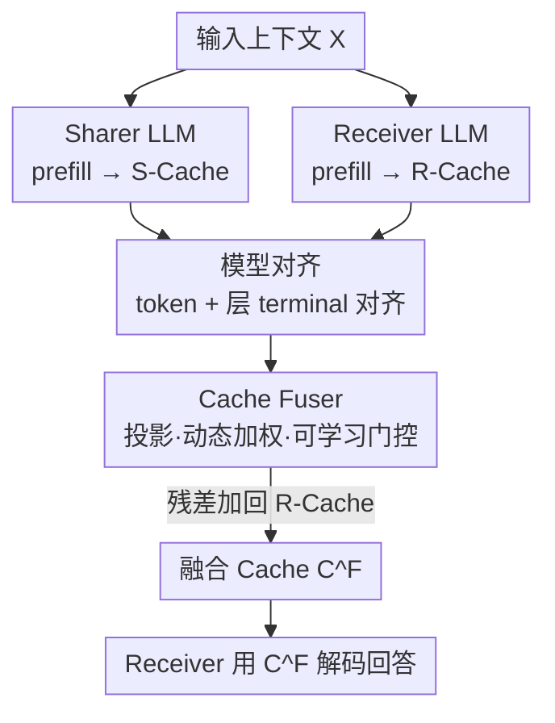

# Cache-to-Cache: Direct Semantic Communication Between Large Language Models

**会议**: ICLR2026  
**OpenReview**: [https://openreview.net/forum?id=LeatkxrBCi](https://openreview.net/forum?id=LeatkxrBCi)  
**代码**: https://github.com/thu-nics/C2C  
**领域**: 多 LLM 协作 / LLM 间通信 / KV-Cache  
**关键词**: 多 LLM 系统, KV-Cache 融合, 语义通信, 模型协作, 推理加速

## 一句话总结
让多个大语言模型不再靠"互相说话"协作，而是用一个轻量神经网络把 Sharer 模型的 KV-Cache 直接投影、融合进 Receiver 模型的 KV-Cache，绕开 token-by-token 的文本生成，既保住了文本会丢失的深层语义，又把延迟平均压低 2.5×，准确率比纯文本协作高约 3–5%。

## 研究背景与动机
**领域现状**：多 LLM 系统（multi-LLM systems）越来越流行——不同模型各有所长（编码、数学、视觉、边端等），把它们组队往往能拿到单个模型达不到的效果和效率。无论是协作式系统（Chain-of-Agents、MetaGPT、Mixture-of-Agents、多智能体辩论）还是路由式推理系统，模型之间几乎清一色靠**文本**交换信息：一个模型把内部表示解码成 token 序列说出来，另一个模型再把这段文本读进去。

**现有痛点**：作者把文本接口（Text-to-Text, T2T）的问题拆成三条。第一，文本是**低带宽媒介**，制造信息瓶颈——高维内部表示被反复压成线性字符串、再被接收方解压，当两个模型知识结构或角色分工不同时，有些信号根本无法复原。论文给了个很形象的例子（图 2）：Coder 模型告诉 Writer 模型"写在 `<section>` 包裹里"，但 `
` 作为段落分隔符的结构语义在文本里传丢了，Writer 把内容插错了位置。第二，自然语言**天生有歧义**，习语、指代不明、含糊表达普遍存在，即便有 MCP/A2A 这类协议把消息模板标准化，刚性模板仍撑不起开放域的灵活协作。第三，文本通信**延迟高**，每次交换都得逐 token 把上下文解释完整解码出来。

**核心矛盾**：协作要求传递"丰富、多样的语义理解"，但文本通道的带宽、清晰度、速度三方面都和这个要求对着干。模型内部本来已经算出了一份高维语义表示（KV-Cache），却非要先把它压扁成文本再让对方重新理解一遍。

**本文目标**：找一个比文本更直接的通信媒介，让一个模型的语义理解能整体搬到另一个模型里，且支持跨模型家族、跨参数规模。

**切入角度**：作者提出"LLM 能否在文本之外通信？"并用两组 oracle 实验先验证可行性——(1) **Benefit**：不延长序列、只是让 KV-Cache 语义更"丰富"，能不能提升准确率？(2) **Convertibility**：一个模型的 KV-Cache 能不能被另一个模型用上？两组实验都给出肯定答案，且发现不同 LLM 对同一输入编码出互补的语义理解。

**核心 idea**：用 KV-Cache 当通信媒介——训练一个 **Cache Fuser** 把 Sharer 的 KV-Cache 投影到 Receiver 的表示空间并融合进去，再用可学习门控选择哪些层真正需要被注入，从而实现 LLM 之间的"直接语义通信"（Cache-to-Cache, C2C）。

## 方法详解

### 整体框架
C2C 的运作对象是两个**冻结**的 LLM：提供上下文理解的叫 **Sharer**，使用它的叫 **Receiver**。在 prefill 阶段，两个模型各自对输入编码出自己的 KV-Cache（$C^S(X)$ 和 $C(X)$）；Cache Fuser 把第 $n$ 层 Receiver cache 和对齐后的第 $G(n)$ 层 Sharer cache 一起吃进去，输出一份"融合 cache"，并以残差方式加回 Receiver：

$$C^F = \left\{\, C_n(X) + F_n\big(C_n(X),\, C^S_{G(n)}(X)\big) \,\right\}_{n=1}^{N}$$

之后 Receiver 拿这份融合 cache $C^F$ 取代自己原本的 cache 去解码回答，整个推理只比单模型多了一次并行的 cache 融合（实测约 90ms），不需要 Sharer 逐 token 把内容"说"出来。这套设计要跑通，必须解决三件事：cache 怎么融（Fuser 结构）、跨模型的 token 和层怎么对齐（Model Alignment）、Fuser 怎么训（Training Scheme）。

### 关键设计

**1. KV-Cache 作为通信媒介：把"先验证再上手"做扎实**

在动手设计网络前，作者先用两组 oracle 实验回答"这事到底有没有戏"，这是整篇论文的地基。**Cache enrichment oracle** 想证明：不增加序列长度，仅让 KV-Cache 的语义更丰富就能涨点。做法是对比三种设置——Direct（只对问题 $X$ 做 prefill，用 $C(X)$ 解码）、Few-shot（对样例 $E$ 拼问题 $X$ 做 prefill，用更长的 $C(E\oplus X)$ 解码）、Oracle（同样对 $E\oplus X$ 做 prefill，但解码前丢掉样例那段 cache，只保留与问题对齐的切片 $C^*(X) = C_{[|E|:|E|+|X|]}(E\oplus X)$）。Oracle 的 cache 长度和 Direct 完全相同、不多看任何额外 token，但准确率从 58.42% 升到 62.34%（表 1），说明涨点确实来自"问题被更好地嵌入了 cache"，而非看了更多上下文。作者还发现这种增益**逐层不同**：增强表现最好的几层（如 top-5）甚至比增强全部层还略高，而增强最差的层会掉点（图 4），这直接催生了后面门控的设计动机。**Cache transformation oracle** 则训练一个 3 层 MLP 把 Qwen3-4B 的 cache 映射到 Qwen3-0.6B 空间，T-SNE 显示变换后的 cache 落进了目标模型的表示空间内（图 3），证明跨模型 cache 是**可转换**的；同时变换后只覆盖目标空间的一个子集，印证不同模型编码的语义互补而不重合。

**2. Cache Fuser 三模块结构：残差注入而非覆盖**

Fuser 是 C2C 的核心可学习组件，遵循"残差整合"原则——增强 Receiver cache 但不破坏性地覆盖它的原有信息，所以式 (3) 里用的是 $C_n + F_n(\cdot)$ 的加法而非替换。它内部串了三个模块。**投影模块（Projection）**先把 Receiver cache 和 Sharer cache 沿特征维拼接，过一个投影层再过一个特征融合层，把两份异构 cache 揉进同一表示。**动态加权模块（Dynamic weighting）**接一个 input-aware 的 head modulation 层，按当前输入对投影出的信息做注意力头级别的重新加权——不同输入需要从 Sharer 拿的东西不一样，这一层让融合随输入自适应。**可学习门控（Learnable gate）**给每一层一个可训练的门值，决定这一层"要不要"注入 Sharer 的上下文，正好回应了 oracle 里"有些层注入有害"的发现。门用带温度退火的 **Gumbel-sigmoid**：训练时可微、便于反传，随温度退火逐渐逼近推理时的二值（0/1）硬选择，从而无缝地从软门过渡到"这层注、那层不注"的离散决策。

**3. 模型对齐：让不同家族、不同尺寸的 cache 能对上号**

跨模型族、跨规模融合 cache，必须在 **token** 和 **层** 两个层面对齐。**Token 对齐**处理"同一输入被不同 tokenizer 切成不同 token 序列"的问题：把每个 Receiver token 解码回字符串、再用 Sharer 的 tokenizer 重新编码；偶尔出现一对多映射时，选字符串覆盖最大的那个 Sharer token 以尽量保信息。**层对齐**采用**末端对齐（terminal alignment）**策略：先把两个模型的最后一层对齐，再倒数第二层、再往前，按逆序一直对到较浅模型的第一层为止——这保证语义最成熟的深层先配对，浅模型多出来的层不会错配。层映射 $G(n)$ 就由这个策略给出，喂给式 (3) 的 $C^S_{G(n)}$。

**4. 训练方案：冻结双模型，只训 Fuser**

训练时 Sharer 和 Receiver 全部冻结，只更新 C2C 模块，因此代价远小于微调一个 LLM。监督信号就是 Receiver 回答上的标准 next-token 预测损失（类似 SFT），唯一区别是 Receiver 这次是**基于融合 cache** 而非自己的 cache 来预测回答。一次训练分三步：(1) Forward——两模型各自编码输入得到各自 cache；(2) Fusion——C2C 把两份 cache 融合并替换 Receiver 的 cache；(3) Supervision——Receiver 用融合 cache 对回答做 prefill，梯度只回传进 C2C 来最小化预测损失。训练数据用 OpenHermes2.5 的前 50 万条通用样本以保证泛化。

### 损失函数 / 训练策略
目标函数即 Receiver 回答上的 next-token 交叉熵（SFT 式），梯度只更新 Fuser；门控用 Gumbel-sigmoid + 温度退火实现"训练可微 → 推理二值"的平滑过渡；双 LLM 全程 frozen。

## 实验关键数据

### 主实验
Receiver 固定为 Qwen3-0.6B，配三种不同 Sharer，在 OpenBookQA / MMLU-Redux / ARC-C / C-Eval 四个基准上评测准确率与单条推理时延。

| 设置（Sharer→Receiver=Qwen3-0.6B） | 基准 | Receiver 单模型 | Text-to-Text | Cache-to-Cache |
|---|---|---|---|---|
| Qwen2.5-0.5B | OpenBook | 39.20 | 44.00 | **52.60** |
| Qwen2.5-0.5B | ARC-C | 41.04 | 49.48 | **54.52** |
| Llama3.2-1B | MMLU-Redux | 35.53 | 43.32 | **44.42** |
| Qwen3-4B-Base | OpenBook | 39.20 | 46.40 | **53.20** |
| Qwen3-4B-Base | ARC-C | 41.04 | 53.91 | **55.39** |

整体上 C2C 相对 Receiver 单模型平均提升约 9.6–11.9%，相对 T2T 平均高 3.06–5.36%。效率侧，C2C 比 T2T 加速 3.46×/1.51×/14.41×（三个 Sharer），平均约 2.5×。时延拆解（表 3，MMLU-Redux）很说明问题：T2T 里 Sharer 要解码 80 个输出 token、单这一步就 1312ms；C2C 把这段顺序解码换成一次 90ms 的并行 cache 融合。

一个有意思的用例：Qwen3-4B-Base 作为 Sharer 经常不听指令、单模型准确率低到个位数、T2T 通信时间还奇长，但 C2C 能绕过"指令跟随"这一环，让一个较弱的 instruction-tuned Receiver 直接吃到强 base 模型的知识。

### 消融实验

| 配置 | #Param. | OpenBook | ARC-C | MMLU | C-Eval | 说明 |
|---|---|---|---|---|---|---|
| Single | 596M | 45.80 | 47.65 | 36.81 | 35.81 | 只微调 Receiver、不接 Sharer |
| Identical | 529M | 50.60 | 52.52 | 42.17 | 40.34 | Sharer=Receiver 用同一模型 |
| C2C | 478M | **52.60** | **54.52** | **42.92** | **41.77** | Sharer/Receiver 用不同模型 |

### 关键发现
- **增益来源拆得很干净**：Single→Identical 的涨幅说明"C2C 这套融合结构 + 训练"本身就有用（哪怕两边是同一个模型）；Identical→C2C 的进一步涨幅才是"不同模型语义互补"的贡献。
- **门控对应 oracle 发现**：cache enrichment 逐层效果不同（图 4），增强好层涨、增强坏层掉，所以逐层可学习门控不是可有可无的装饰，而是从实验观察反推出来的必需件。
- **可扩展性**：序列长度从 0-4k 到 8k+，C2C 在 LongBenchV1 上全程压过 T2T；Sharer 越大、C2C 相对单模型的增益涨得比 T2T 更快；交换 Sharer/Receiver 时 C2C 仍 +5.05% 而 T2T 反而 -6.30%。

## 亮点与洞察
- **把"协作媒介"从文本换成 KV-Cache** 是真正的范式级想法：它一举解决了文本通信的带宽、歧义、延迟三个问题，因为内部表示根本不用再压扁成文本。
- **先 oracle 后建模**的研究范式值得学：两组 oracle 分别锁死"语义增强有益"和"跨模型可转换"两个前提，让后面的网络设计每一步都有据可依，门控这种细节都能追溯到一张实验图。
- **残差 + 逐层门控**是可迁移的 trick：当你想"往一个冻结网络的中间状态里注入外部信息又不想破坏它"时，残差注入 + Gumbel-sigmoid 可学习门控（训练软、推理硬）是一套很干净的模板。
- **绕开指令跟随**这个副产品很启发人：C2C 让强但不听话的 base 模型也能贡献知识，提示"能力"和"指令跟随"可以解耦传递。

## 局限与展望
- **需要训练且成对**：每个 Sharer-Receiver 组合都要训一个 Fuser，换模型组合就得重训，不像纯文本协作那样即插即用。
- **需要白盒访问**：必须拿到双方模型的内部 KV-Cache，闭源 API 模型无法参与，限制了落地场景。
- **对齐策略偏启发式**：token 对齐靠"解码再编码 + 最大覆盖"、层对齐靠末端对齐，都是工程性近似，跨差异极大的架构时是否仍稳健有待更系统验证。
- **增益对强 Receiver 递减**：论文自己指出 Receiver 越大、baseline 越强、与 Sharer 知识重叠越多，相对增益越小，C2C 的甜区主要在"小 Receiver + 更强/互补 Sharer"。

## 相关工作与启发
- **vs KV-Cache 复用/共享（DroidSpeak、层间 cache 复用等）**：那些工作是为了**加速单模型**，复用同模型或同结构模型的 cache；C2C 把 cache 当成**跨模型语义传输**的媒介，且明确支持跨家族、跨尺寸，目标完全不同。
- **vs 协作式多智能体（Chain-of-Agents、MetaGPT、Mixture-of-Agents、多智能体辩论、MCP/A2A 协议）**：它们都在文本层面交换消息，受限于文本带宽与歧义；C2C 在更深的内部表示层面直接共享，省掉了逐 token 解码。
- **vs 路由式多 LLM 推理（query-level routing 等）**：路由要么完全丢掉别的模型的上下文、要么只用自己的理解，小模型享受不到大模型已经算出的丰富表示；C2C 让 Receiver 直接继承 Sharer 的语义理解，路由在表里只能达到"两个原模型里较好的那个"的上限。

## 评分
- 新颖性: ⭐⭐⭐⭐⭐ 把多 LLM 通信媒介从文本换成 KV-Cache，是少见的范式级新想法
- 实验充分度: ⭐⭐⭐⭐ 四基准、多家族/多尺寸、序列长度与模型尺寸的 scaling、增益来源消融都覆盖到了
- 写作质量: ⭐⭐⭐⭐⭐ oracle→设计→实验的逻辑链非常清晰，图 2 的例子一眼说清动机
- 价值: ⭐⭐⭐⭐ 思想启发性强、效率收益实在，但需训练 + 白盒访问限制了即时落地

<!-- RELATED:START -->

## 相关论文

- [\[ACL 2026\] AgenticEval: Toward Agentic and Self-Evolving Safety Evaluation of Large Language Models](../../ACL2026/multi_agent/agenticeval_toward_agentic_and_self-evolving_safety_evaluation_of_large_language.md)
- [\[NeurIPS 2025\] Large Language Models Miss the Multi-Agent Mark](../../NeurIPS2025/multi_agent/large_language_models_miss_the_multi-agent_mark.md)
- [\[ICLR 2026\] Emergent Coordination in Multi-Agent Language Models](emergent_coordination_in_multi-agent_language_models.md)
- [\[AAAI 2026\] MedLA: A Logic-Driven Multi-Agent Framework for Complex Medical Reasoning with Large Language Models](../../AAAI2026/multi_agent/medla_a_logic-driven_multi-agent_framework_for_complex_medic.md)
- [\[NeurIPS 2025\] Debate or Vote: Which Yields Better Decisions in Multi-Agent Large Language Models?](../../NeurIPS2025/multi_agent/debate_or_vote_which_yields_better_decisions_in_multi-agent_large_language_model.md)

<!-- RELATED:END -->
