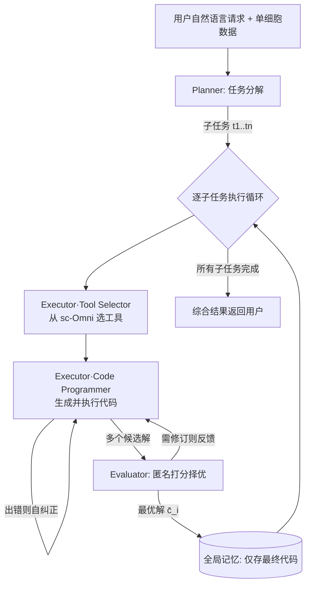

# CellAgent: LLM-Driven Multi-Agent Framework for Natural Language-Based Single-Cell Analysis

**会议**: ICLR 2026  
**OpenReview**: [https://openreview.net/forum?id=BsA2GNkJhz](https://openreview.net/forum?id=BsA2GNkJhz)  
**代码**: 待确认  
**领域**: LLM 多智能体 / AI for Science（单细胞生物信息学）  
**关键词**: 多智能体、scRNA-seq、空间转录组、自反思优化、工具调用  

## 一句话总结
CellAgent 用 Planner-Executor-Evaluator 三级智能体架构，配合专家工具箱 sc-Omni 和自反思优化机制，让研究者只用自然语言就能端到端跑完单细胞 RNA 测序与空间转录组分析，多项下游任务质量与人类专家相当甚至更优。

## 研究背景与动机
**领域现状**：单细胞 RNA 测序（scRNA-seq）和空间转录组（ST）已成为分子生物学的核心手段，能以前所未有的精度刻画细胞异质性，但也产生了海量数据，必须依赖复杂的计算工具链才能提取有意义的生物学信息。

**现有痛点**：现有分析流程（Scanpy、Squidpy、Seurat、scVI 等）虽然成熟，却要求分析者同时具备编程能力和生物学专业知识——既要手动挑选合适工具，又要针对数据特性精调超参数。这种"双重专业门槛"让单细胞分析成本高昂，阻碍了生物机制的发现。

**核心矛盾**：通用 LLM（GPT-4）和通用智能体框架（AutoGen）缺乏领域知识，难以做出可靠的生物学分析；已有的领域智能体（AutoBA、BioMANIA）则只盯着"任务执行成功率"，**没有机制去自动评估结果的生物学相关性**，因而无法在异构数据集上自主选算法、调超参。换句话说，"能跑通"不等于"跑得对"。

**本文目标**：构建一个自然语言驱动、功能集成、能自主优化的分析框架，把高层科学问题翻译成优化后的计算流程，在降低技术门槛的同时保证分析质量。

**核心 idea**：**[分层决策 + 自反思评估]** 把分析流程建模成对"流水线空间"的分层决策过程——Planner 做任务分解，Executor 实例化候选流水线，Evaluator 对候选打分并择优；并通过一个专门的 Evaluator 智能体把"生物学相关性评估"显式嵌入自动化工作流，用客观指标替代主观的人工评判。

## 方法详解

### 整体框架
CellAgent 是一个模拟"深度思考"工作流的分层多智能体系统，由三个专职智能体协作：高层 Planner 把用户的自然语言请求拆解成有序子任务；Executor 为每个子任务选工具、写代码、跑代码；Evaluator 对产出打分并提出修订意见。整套流程还依赖三个支撑模块——专家工具箱 sc-Omni、双层记忆系统、安全代码沙箱。

### 关键设计

**1. 分层任务规划（Hierarchical Decomposition）：把抽象目标拆成有序流水线。** Planner 是系统的"总架构师"，其系统提示 $p^p_{sys}$ 被注入了 scRNA-seq/ST 工作流的专家知识，包括标准操作顺序（如质控必须先于归一化）、典型参数范围、以及哪些下游任务需要特定的上游预处理。收到请求后，Planner 先检视数据集摘要 $\psi(D)$ 来"接地气"，再生成离散有序的子任务序列：

$$t_1, t_2, ..., t_n \leftarrow A^{LLM}_p(p^p_{sys}, u_{task}, u_{req}, u_D, \psi(D))$$

这一步把宽泛目标转化为可管理的步骤链，为后续执行与优化奠定逻辑骨架。关键在于规划不是凭空想象，而是基于具体数据特征做出的——这避免了通用智能体常见的"流程合理但不适配数据"问题。

**2. 自反思优化机制（Self-Reflective Optimization）：用客观评估替代人工评判。** 每个子任务进入 Executor-Evaluator 协作循环。Executor 由 Tool Selector 和 Code Programmer 两部分组成：前者从工具集 $T$ 中筛出当前步骤最合适的工具 $T_{t_i} \leftarrow A^{LLM}_t(p^t_{sys}, u_{req}, T, t_i)$；后者结合工具文档和记忆模块 $M$ 生成可执行代码与文字分析 $(c_i, w_i) \leftarrow A^{LLM}_c(p^c_{sys}, u_{task}, u_{req}, u_D, \psi(D), M, t_i, Doc(T_{t_i}))$，遇到执行错误 $E(c_i)$ 时自主纠错。真正的创新在 Evaluator：它先对同一任务跑一组成熟算法生成多个候选解 $\{c^j_i\}$，再由 GPT-4o 驱动系统性评估——评估标准随任务而变，融合定量指标（如插补的 Accuracy Score、批次校正的 iLISI）、领域知识引导的定性视觉判断（如轨迹连续性、空间域一致性）和异构证据综合（如细胞类型注释），最后择优：

$$\bar{c}_i = A^{LLM}_e(p^e_{sys}, u_{req}, u_D, t_i, \{c^j_i\}), \quad j = 1, 2, ...$$

为防止"自循环偏差"，Evaluator 只能看到匿名化的输出、任务指标和诊断图，**看不到 Executor 用的提示词和工具名**，从而保证打分客观。这把传统上耗时的人工评估彻底自动化了。

**3. 双层记忆控制（Memory Control）：用代码的高信息熵实现低 token 上下文传递。** 针对 LLM 无状态的缺陷，CellAgent 设计了双架构记忆。其设计依据是：单细胞分析的子任务大多自包含，只依赖前一步**最终验证过的产物**，而非中间的试错过程。因此全局记忆只存每步的最终代码 $M \leftarrow \{\bar{c}_1, \bar{c}_2, ...\}$——之所以只存代码，是因为在生物信息学里代码具有高信息熵，能以极简形式精确编码复杂的数据变换，从而用最小 token 开销传递完整上下文。与之互补的局部记忆则作为 Executor 在单个子任务内的短期工作区，捕捉实时执行轨迹（含正确与错误代码、报错信息、自纠正迭代），让智能体能从实时错误中学习。

**4. sc-Omni 专家工具箱：为 LLM 接地领域能力。** 单纯的 LLM 缺乏生物学领域知识，CellAgent 开发了 sc-Omni——一个由专家精选、高性能的工具集，整合了 scRNA-seq 和空间转录组分析所需的核心工具（如细胞类型注释的 Cellmarker/Celltypist、批次校正的 scVI/Harmony、空间插补的 Tangram 等）。Executor 的 Tool Selector 从中检索，配合工具文档生成调用代码，使 LLM 的分析能力真正落到基因组学的领域复杂性上。

## 实验关键数据

### 主实验表格（多任务对比，分数越高越好）

| 任务 | 指标 | CellAgent | 最强基线 | 基线方法 |
|------|------|-----------|----------|----------|
| 细胞类型注释 | Average score | **0.85** | 0.77 | scGPT |
| 批次校正 | Overall score | **0.67** | 0.66 | scVI |
| 轨迹推断 | Overall score | **0.50** | 0.47 | Slingshot |
| 空间域识别 | ARI | **0.47** | 0.47 | SCSA/SEDR |
| 空间插补 | Accuracy score | **0.88** | 0.75 | Tangram |

CellAgent 在多个任务上取得 SOTA 或并列最优，尤其在细胞类型注释（0.85 vs 0.77）和空间插补（0.88 vs 0.75）上优势明显。

### 关键发现
- **高鲁棒性**：在超过 60 个数据集上平均执行成功率超过 96%，证明自纠正与工具选择机制的稳定性。
- **媲美甚至超越专家**：在任务完成度、质量和效率三个维度上，CellAgent 表现与人类专家相当，部分方面甚至超越。
- **匿名评估去偏有效**：Evaluator 只看匿名输出，避免了把自己生成的工具名当线索的"自循环偏差"，保证了择优的客观性。
- **效率优势**：把高层科学问题自动翻译成优化流程，省去了手动选工具、调参的大量人力。

## 亮点与洞察
- **把"评估"提升为一等公民**：以往的生物信息学智能体只追求"跑通"，CellAgent 第一次把"生物学相关性评估"做成专职 Evaluator 智能体并嵌入主循环，直击"能跑 ≠ 跑对"的痛点。
- **匿名打分防自循环**：让 Evaluator 看不到 Executor 的提示词和工具名，是个小而精妙的去偏设计，值得其他多智能体工作借鉴。
- **"只存代码"的记忆哲学**：洞察到代码在生信场景具有高信息熵，用最终代码替代冗长执行轨迹做长期记忆，是个很务实的 token 节省策略。
- **降低门槛、推动民主化**：让不会编程的生物学家也能跑复杂分析，对基因组学科学发现的"民主化"有实际价值。

## 局限与展望
- **依赖专家精选工具箱**：sc-Omni 的覆盖范围决定了系统能力上限，遇到工具箱外的新方法或新任务时适配性存疑。
- **Evaluator 依赖 GPT-4o**：评估质量受底层 LLM 能力和评估指标设计影响，对于缺乏成熟定量指标的任务，定性判断的可靠性还需验证。
- **成本与可复现性**：多智能体多候选解的反复执行带来较高的算力/调用成本，论文未充分讨论端到端开销。
- **指标边际优势**：部分任务（如批次校正 0.67 vs 0.66、空间域识别并列 0.47）相对基线的提升较小，统计显著性有待更多验证。

## 相关工作与启发
- **科学领域智能体**：ChatMOF（材料）、ChemCrow（化学）展示了 LLM + 专家工具的范式，CellAgent 把这套思路系统化地搬到了单细胞分析。
- **单细胞计算工具与基础模型**：Scanpy、Squidpy、Seurat、scVI 提供了底层算法，scGPT、cellPLM 等基础模型提供了表征，但都需手动搭流水线——CellAgent 把它们封装进可自然语言调用的工具箱。
- **生物医学智能体**：Biomni（通用生物医学）、AutoBA、BioMANIA（单细胞）是最直接的对比对象，CellAgent 的差异化在于显式的质量评估与自反思优化。
- **启发**：把"评估器"做成独立智能体并去偏，是任何需要"自主择优"的多智能体系统的通用范式；"只存关键产物"的记忆设计也对长流程 agent 的上下文管理有借鉴意义。

## 评分
- **新颖性**: ⭐⭐⭐⭐ 把自反思评估做成专职去偏智能体，针对生信智能体"只求跑通"的痛点提出了清晰的解法，架构组合新颖。
- **实验充分度**: ⭐⭐⭐⭐ 覆盖 5 大下游任务、60+ 数据集，对比基线丰富，但部分任务相对优势较小、端到端成本分析不足。
- **写作质量**: ⭐⭐⭐⭐ 框架图清晰、动机层层递进、公式与模块职责表述明确，可读性强。
- **价值**: ⭐⭐⭐⭐ 显著降低单细胞分析的技术门槛，对生物信息学民主化有实际推动力，并提供了在线平台。

<!-- RELATED:START -->

## 相关论文

- [\[ICLR 2026\] From EduVisBench to EduVisAgent: A Benchmark and Multi-Agent Framework for Reasoning-Driven Pedagogical Visualization](from_eduvisbench_to_eduvisagent_a_benchmark_and_multi-agent_framework_for_reason.md)
- [\[AAAI 2026\] MedLA: A Logic-Driven Multi-Agent Framework for Complex Medical Reasoning with Large Language Models](../../AAAI2026/multi_agent/medla_a_logic-driven_multi-agent_framework_for_complex_medic.md)
- [\[ICLR 2026\] DoVer: Intervention-Driven Auto Debugging for LLM Multi-Agent Systems](dover_intervention-driven_auto_debugging_for_llm_multi-agent_systems.md)
- [\[AAAI 2026\] COACH: Collaborative Agents for Contextual Highlighting -- A Multi-Agent Framework for Sports Video Analysis](../../AAAI2026/multi_agent/coach_collaborative_agents_for_contextual_highlighting_--_a_multi-agent_framewor.md)
- [\[ICLR 2026\] Graph-of-Agents: A Graph-based Framework for Multi-Agent LLM Collaboration](graph-of-agents_a_graph-based_framework_for_multi-agent_llm_collaboration.md)

<!-- RELATED:END -->
